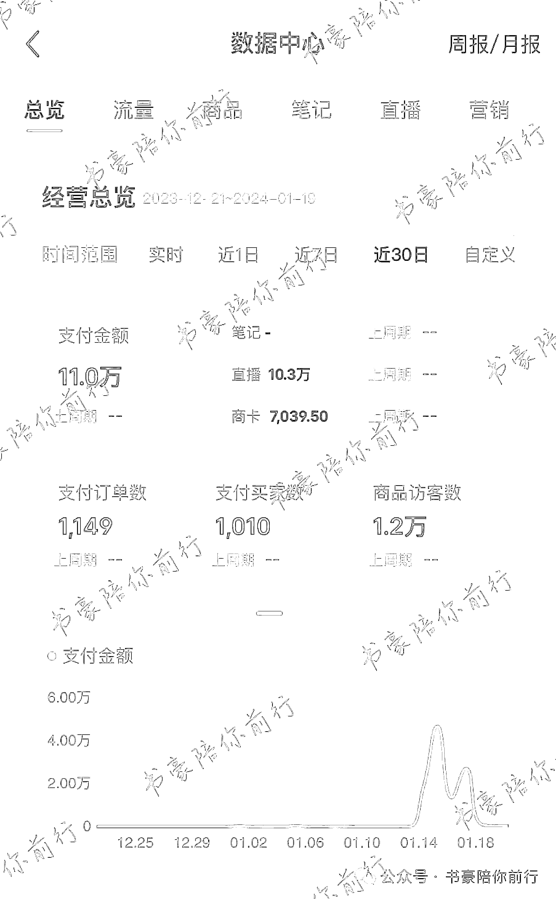
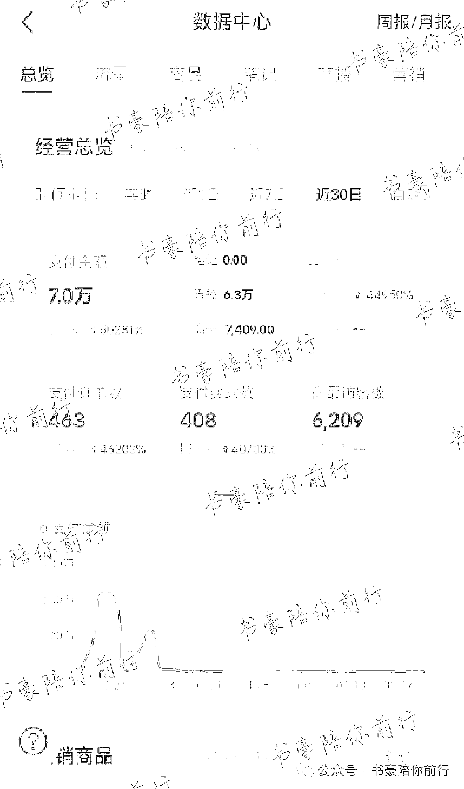

# 新手入局小红书直播，一个月自然流卖了 18 万！

> 原文：[`www.yuque.com/for_lazy/thfiu8/ypau9grygqo7475y`](https://www.yuque.com/for_lazy/thfiu8/ypau9grygqo7475y)

## (23 赞)新手入局小红书直播，一个月自然流卖了 18 万！

作者： 糖果

日期：2024-02-05

# 一、自我介绍

大家好，我是糖果，来自生财广州的圈友，最近参加了生财的小红书直播航海，自己也摸索过一小段时间做小红书的笔记，但是没有啥效果。中间一段时间放弃了，最近天天刷书豪教练的小红书直播高手领航和答疑。作为新人，觉得动力满满的同时又伴随着不少焦虑。

特别感谢书豪教练。

通过这次小红书直播航海实战，更加坚定地选择小红书赛道深耕

这次 1 月的小红书直播航海，也链接到了很多的高手，在次之前也机缘巧合参加了 @书豪教练的小红书进阶训练营，才让我这个新手在小红书直播赛道更快的拿到了正反馈。再次感谢生财这个开眼的大本营，也感谢@书豪教练。

坦白讲，我 1 个月拿到 18 万 GMV 的结果，是不好意思在生财分享的，因为生财的电商高手太多太多了。但是我从 0-1 做小红书直播的经历分享出来，把我走过的弯路和拿到的经验认知分享出来，说不定能帮助到一些人少踩坑，或者更快的拿到结果。

在小红书直播航海里学习，下载对应的软件，刷品，选品，找直播素材。其实在 12 月的时候，我就开始上手小红书直播开播了。那时候跟着书豪教练的精华文章去执行落地[`wx.zsxq.com/dweb2/index/topic_detail/188125222122482`](https://wx.zsxq.com/dweb2/index/topic_detail/188125222122482)

7 天 25W+营业额！小红书无人直播实操玩法分享

在 12 月 20 号起了一个号，1 月 13 号又起了一个号，两个号加起来卖了 18 万多。

分享一下我的实操经验和心路历程，希望可以帮到和我一样想做小红书的新手兄弟姐妹。

# 二、选品

这个品是按照书豪教练教的在小红书上关注无人直播的账号，然后在大半夜的晚上刷到的。不同时间段可以多去刷，会有不同的品出来。早上起床刷一下，晚上睡觉刷一下，半夜起床第一件事还是刷一下。那个晚上两三点刷到一个新号，直播了几天就出了一千多单，直播间素材也很好找，品也有利润。当晚就把链接复制好，等待第二天录制素材，开始直播。

一个好的品，一个好的直播间素材，确实能够快速起量。第一个号前后真正播就三四场，后面很快就被判录播了。个人店比较容易上榜，早上六七点的流量很好，经常冲到个人榜前十，最高是榜一。后面起的这个号也是做的这个品，如果不是接近年底，考虑到货源和素材问题，可以再扩充一下同类型的其它类似款的。

如果打爆一个品后，对这个品的对标、直播素材、货源都相对熟悉的情况下，可以测同类型的其它类似款，同样还是有不错的销量的。

直播素材的选择和处理：

1.不要选择太多人同时在打的爆品，容易废号。最好是新起量但是没有太多人打的品，类似于低粉爆款的思路。

2.直播素材可以简单处理，调整一下比例，或者其它参数，镜像反转等。也可以自己每天录制一些生活当中的视频，然后不透明度调为 1，类似于画中画，加到每天新录制的直播素材当中。

3.消音方面，处理过一两次，费时又处理不干净，我就放弃了。选择干净的直播间素材，能省不少时间。

# 三、女装的货源，售后问题

对接厂家的话，一般是选择 1688 上面对接的。我老公是靠近服装批发市场，本身也是每天有自己在拿货发货，所以就直接去找这边的档口对接。出于对女装行业的了解，我还是比较谨慎的。一开始加上了很高的利润率 50%以上，按照 50%的退货率算。如果出现最坏的情况，档口不给退货的话，我的利润是可以覆盖掉我的拿货成本的。

出乎我意料的是，这批货的退货率很高，然后号的周期特别短，导致售后非常麻烦。因为是突然爆单，仓促之下找的新厂家，她的做工比较粗糙，加上我这个品单价比较高，导致退货率很高。前面几天大批量拿货，后面几天就大批量退货，这个时候大部分厂家都不能接受的。厂家只给我退了一部分，自己压了一两百件的货。接着我就起了两个新号，由于那段时间打这个品的人非常多，素材重复度高，很容易被判录播，或者出现宣传绝对化。号一直起不来，这个时候有心灰意冷，打算认栽了。

又过了一阵子，对标同行的号都废得差不多了，或者都去打新款了，这个品没什么人播了，我也以为这个品就起不来量了。直到我突然刷到一个新号，以一个比较低的价格又去重新打这个品。这个人也是突然爆单，然后手上压到库存的。那个新号三四天也卖了几百单，我就马上跟着同样的策略重新打这个品。通过不断调整封面和直播标题，提高了封面点击率，达到 4%，时长停留 30 秒以上这个标准，后续场观人数达到 2 万+，最高在线人数 300 多人。

这次跟厂家重新谈条件，大家一起把库存处理掉，但是要承接我的大批量退货。发货的时候也是比较控制的，设置 15 天预售，分批次发货。这样避免积压太多的退货，但是会拉长整个售后时间。

# 四、小红书电商打品总结

1.女装行业利润率低于 20%的不要做

2.如果是 1688 或者其它平台下单的，最好线上结款

3.不要相信厂家的口头承诺退货，要压一些货款在手上。但是不熟的厂家一般不会答应，所以得多去谈或者自己本身有优势的货源供应链

4.有能力自己发货的，有固定合作厂家的，一开始要控制单量，尽量延长号的周期，后面备多几个号承接后续的退货库存

非常感谢书豪教练的耐心解答和无私分享，帮助我快速跑通从 0-1 的流程，爆单了之后，提高了自己的信心，让我有耐心能够继续把这个事情做下去。跟着有结果的人做有结果的事情，很赞！

* * *

评论区：

呆呆条 : 糖果圈友，能告诉我现在无货源还能做吗，平台的打压会很严格吗？
糖果 : 无货源可以做的
麻雀 : 代拍不行，无货源可以

* * *