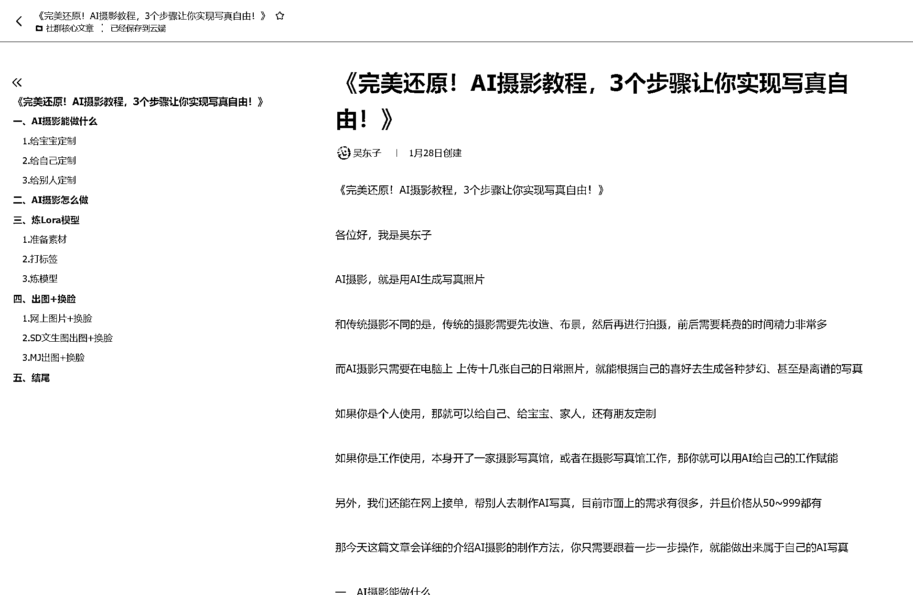
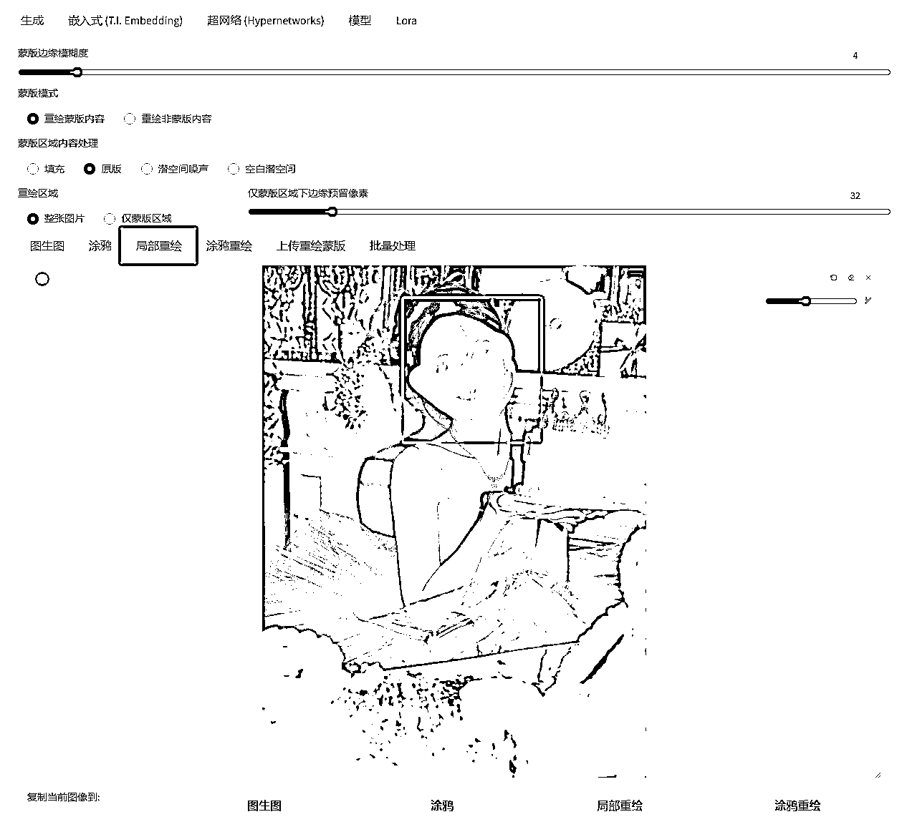
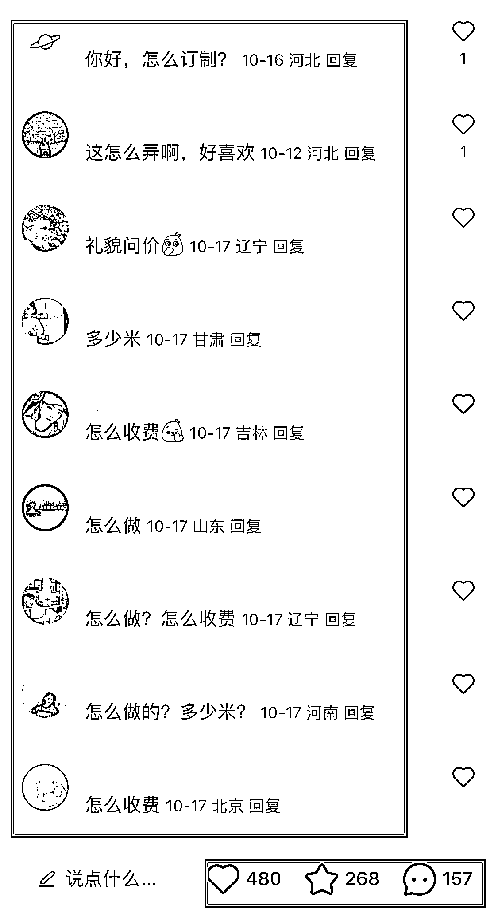
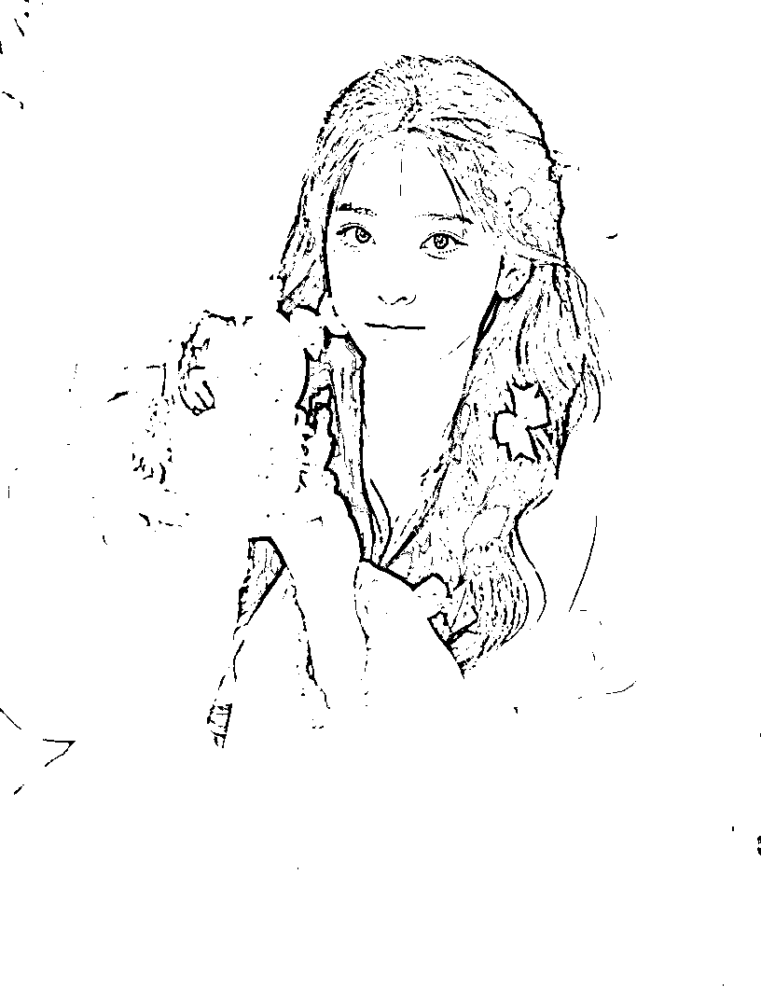
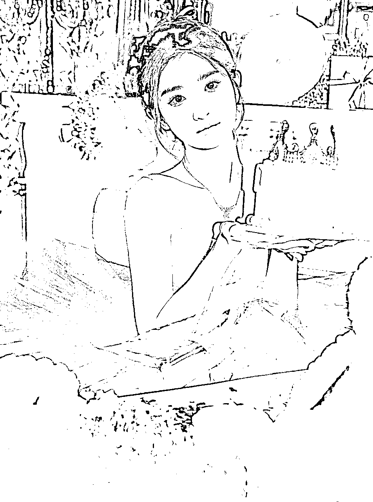
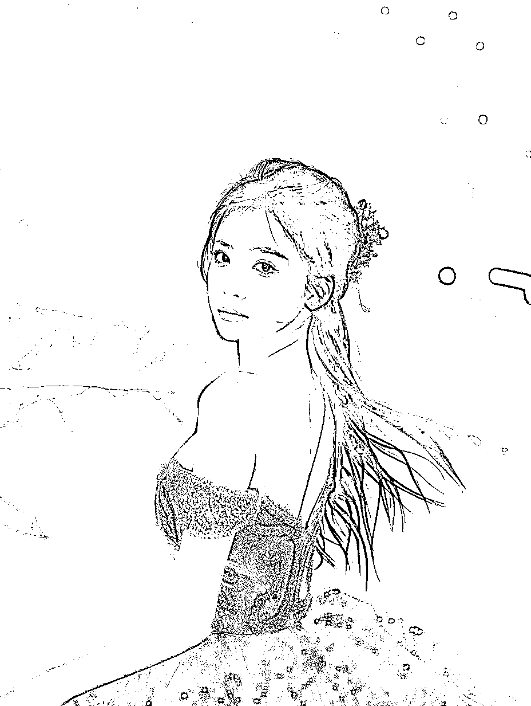
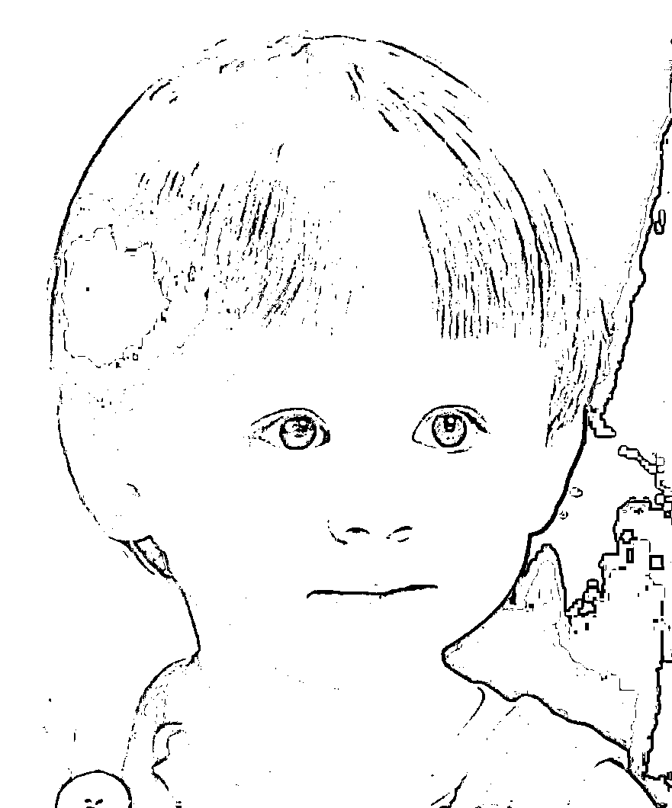
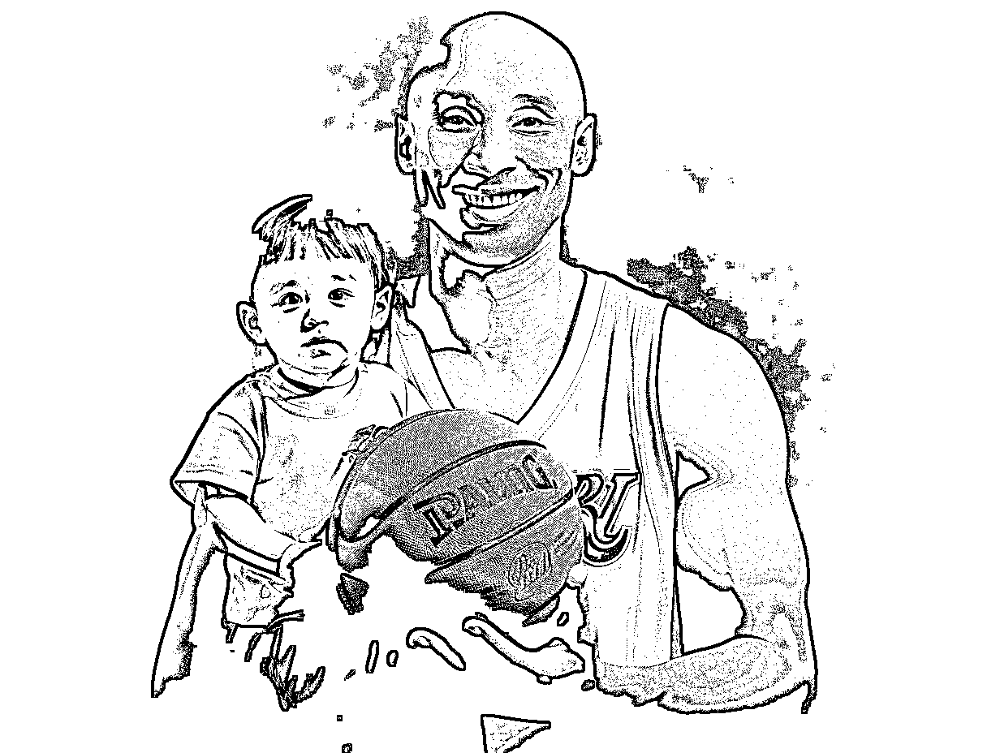
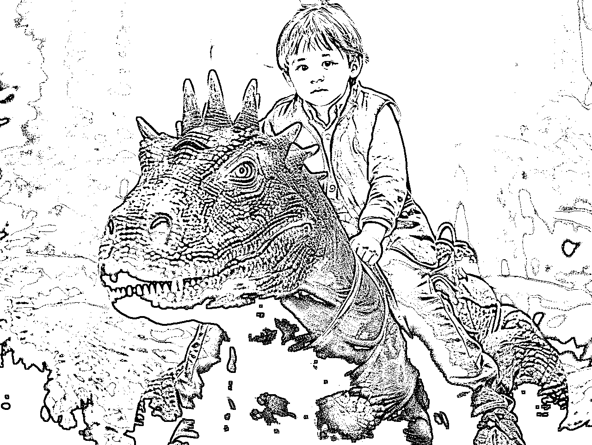

# AI 摄影教程，3 个步骤让你实现写真自由

> 原文：[`www.yuque.com/for_lazy/thfiu8/yi7neleqyd012isl`](https://www.yuque.com/for_lazy/thfiu8/yi7neleqyd012isl)

## (48 赞)AI 摄影教程，3 个步骤让你实现写真自由

作者： 吴东子

日期：2024-02-06

《完美还原！AI 摄影教程，3 个步骤让你实现写真自由！》

各位好，我是吴东子

AI 摄影，就是用 AI 生成写真照片

和传统摄影不同的是，传统的摄影需要先妆造、布景，然后再进行拍摄，前后需要耗费的时间精力非常多

而 AI 摄影只需要在电脑上 上传十几张自己的日常照片，就能根据自己的喜好去生成各种梦幻、好看的写真

如果你是个人使用，那就可以给自己、给宝宝、家人，还有朋友定制

如果你是工作使用，本身开了一家摄影写真馆，或者在摄影写真馆工作，那你就可以用 AI 给自己的工作赋能

另外，我们还能在网上接单，帮别人去制作 AI 写真，目前市面上的需求有很多，并且价格从 50~999 都有

那今天这篇文章会详细的介绍 AI 摄影的制作方法，你只需要跟着一步一步操作，就能做出来属于自己的 AI 写真

一、AI 摄影能做什么
二、如何做 AI 摄影？
三、训练模型
四、出图方式

花了很多时间才整理出来，希望对你有所帮助

[`ry5hwpuf7b.feishu.cn/docx/Ox2ndRADWojFdxxwYQZcYKVbnVc?from=from_copylink`](https://ry5hwpuf7b.feishu.cn/docx/Ox2ndRADWojFdxxwYQZcYKVbnVc?from=from_copylink)

* * *

评论区：

Beautiful * : 大佬，炼 lora 模型的文件夹从哪里找啊？
抉择 : 是用 sd 秋叶的包训练的吗
吴东子 : 是
陈去野 : 牛逼啊
村村 : 东子哥，我的 sd 界面找不到 Lora 训练的选项，是版本问题吗
杨一 : 以前刷到东子哥的 B 站，期待更新

* * *