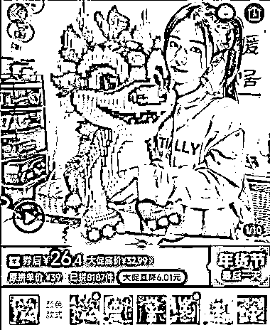

# AI 已经火了一年了，真正属于普通人的机会在哪里？

> 原文：[`www.yuque.com/for_lazy/thfiu8/qtdkydka9z17g3ri`](https://www.yuque.com/for_lazy/thfiu8/qtdkydka9z17g3ri)

## (28 赞)AI 已经火了一年了，真正属于普通人的机会在哪里？

作者： 吴东子

日期：2024-02-05

《AI 已经火了一年了，真正属于普通人的机会在哪里？》

大家好，我是吴东子

这是过去一年来，我收到过最多的问题

在这篇文章里，我会把我目前对 AI 的理解阐述出来，分享 3 个普通人能够把握的方向

讲清楚在现在这个时间节点，当我们在说搞 AI 的时候，到底是在搞什么，怎么搞

一、AI 行业的本质是什么？
二、AI 是一个「放大器」
三、AI 个体创业赚快钱

[`ry5hwpuf7b.feishu.cn/docx/KDGEdUXLUoRRLexnT9Oc3w47nMg?from=from_copylink`](https://ry5hwpuf7b.feishu.cn/docx/KDGEdUXLUoRRLexnT9Oc3w47nMg?from=from_copylink)

* * *

评论区：

暂无评论

* * *