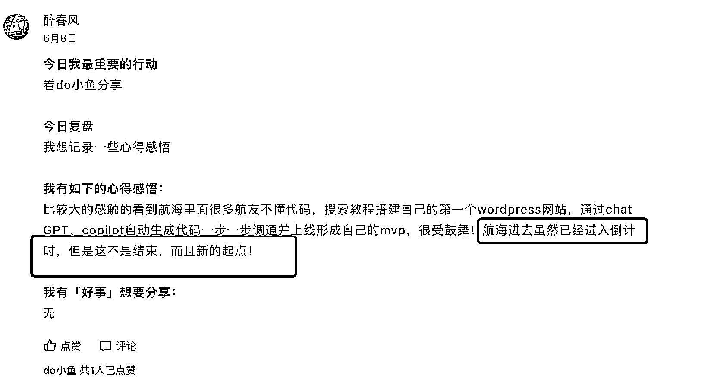
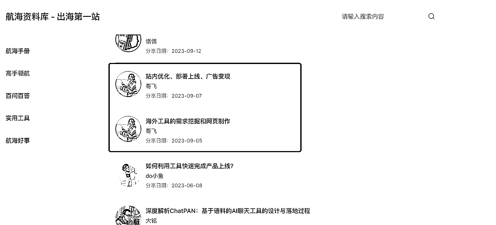
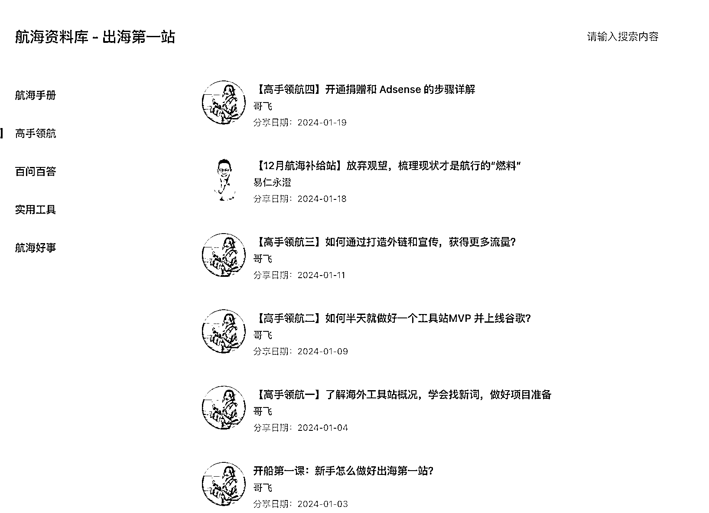
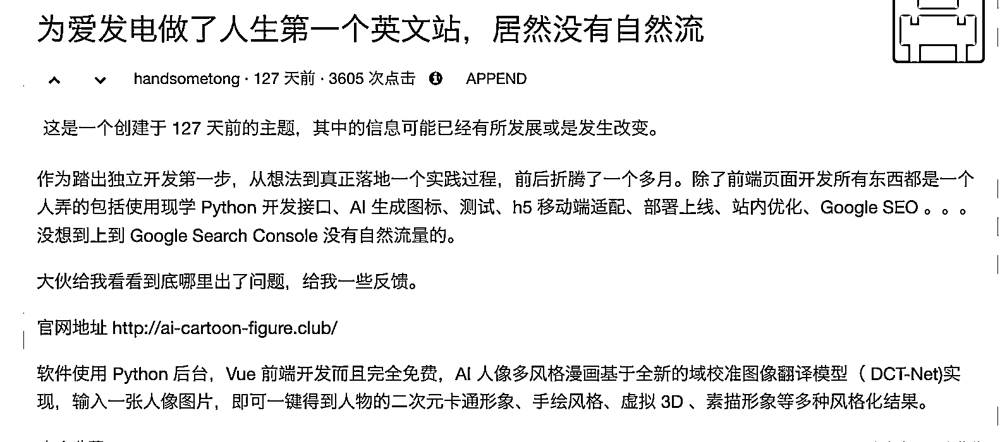
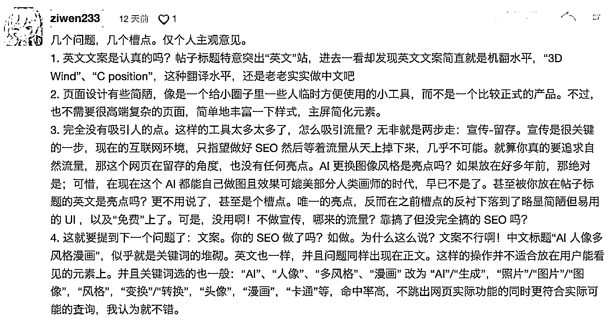
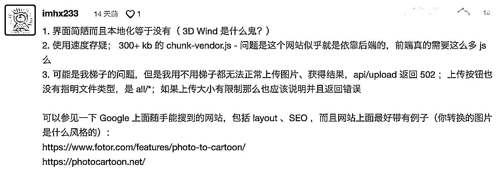
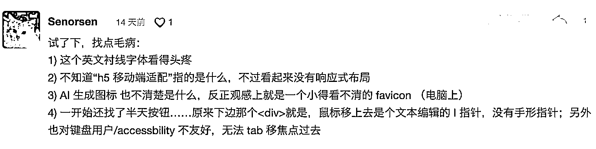
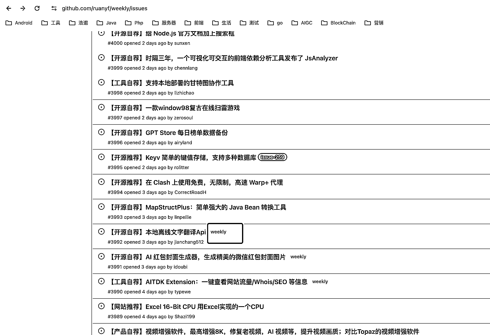
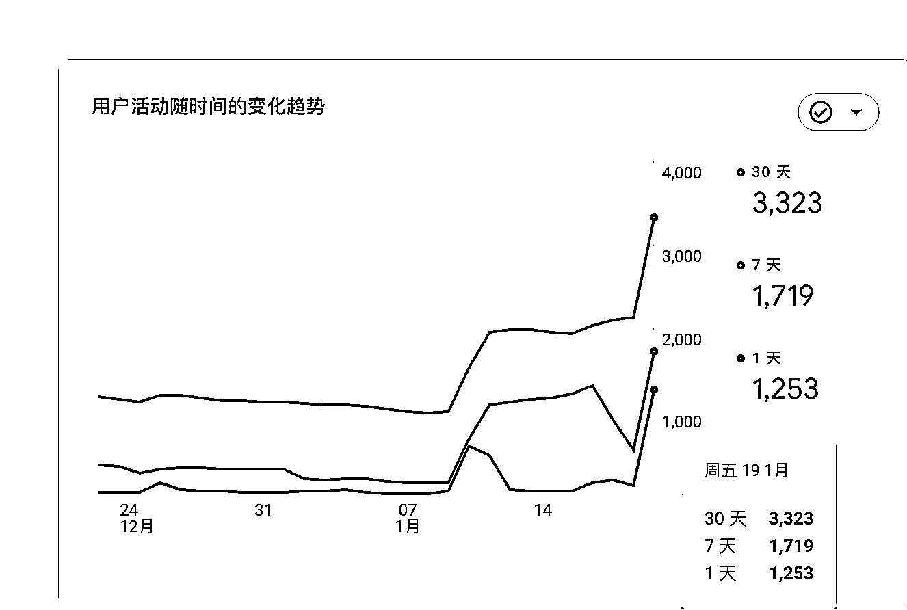
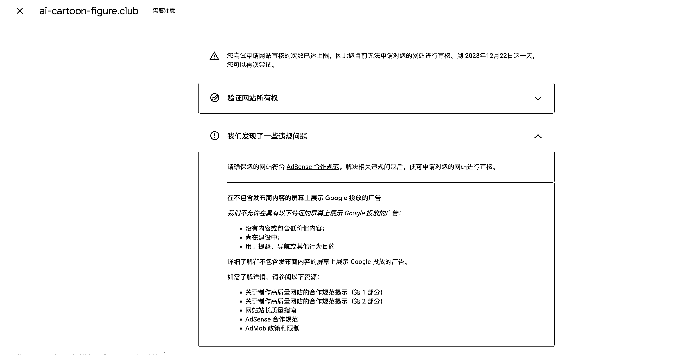

# 普通程序员如何花三个月的时间跑通海外工具站 MVP 赚到人生第一块美刀

> 原文：[`www.yuque.com/for_lazy/thfiu8/hhddv65hvygn2aza`](https://www.yuque.com/for_lazy/thfiu8/hhddv65hvygn2aza)

## (精华帖)(202 赞)普通程序员如何花三个月的时间跑通海外工具站 MVP 赚到人生第一块美刀

作者： 醉春风

日期：2024-02-04

个人介绍

先自我介绍一下，我是一名在二线城市小厂上班的普通二本程序员。做软件开发已有 10 年，期间做过.Net、Android，Java，略懂点 web 开发，参加「工具站航海」之前毫无任何海外相关的经验。

## 为什么要加入生财

江湖上一直流传着生财有术的传闻，但是我第一次真正深入接触生财是看了小报童里的「生财有术项目经验」，里面的 66 个案例让我大开眼界，让我看的时候经常情不自禁地感叹「还能这么玩！！！」。

之后我在生财航海的宣传海报上看到居然还有教人做网站的实战活动（符合我的能力），就果断入圈。

所有我进生财的目的比较明确，就是来跟船友们一起实操和结识一些在这个赛道上拿到过结果的球友（事实也证明我来对地方了）。4 月份我一进社群我就吭哧吭哧疯狂刷了一个多月海外工具站的航海手册，并积极参加了五月份的工具站航海和 8 月份的志愿者。

虽然直到 5 月份的航海结束我都没有拿到结果，但是就在那时种子已经在我心里悄悄发芽。

截止目前我已经用业余时间开发了两个网站，其中一个已经通过 Google Ads 跑通整个 MVP，并且该网站已经为我赚到了人生第一块美刀。

## 为什么要选择海外工具站

1.  亦仁大佬看好的赛道

1.  赚美刀感觉像是买股票上了 7 倍的杠杆，还不用担心会爆仓，只要体验一次你就会上瘾

2.  门槛相对较低，不像国内站需要各种备案、各种监管审核。

3.  可以产生「睡后收入」，是件有复利的事。可以指挥「千军万马」（服务器）24 小时为你工作。

> ## 快速上站经验分享
> 
> 除了每期航海手册是必看的外，具体的需求挖掘、网页制作、站内优化、部署上线、广告变现等技术上的问题我这里推荐哥飞的小白入门系列。文档内容很详细还配有每个步骤的截图，如果你原来就有一定的开发基础只需要按照文档上的方法一步一步操作就行。
> 
> 
> 
> 如果时间充裕的话，最新一期哥飞的航海视频也建议大家都去看一看。里面有很多案例分析、现场实操等，可以让你增长不少见识。
> 
> 
> 
> 哥飞是个高输出型的选手。我自己是如果「喜欢」一个人我会关注他所有的频道，并且翻阅查看以往的所有内容。哥飞在公众号、即刻、Twitter、朋友圈都有频繁的输出建议大伙都关注下，另外哥飞也有自己的收费社群，预算允许的情况下也建议大家「入坑」（此处应该要有广告费）。
> 
> ## 实战过的几个推广好网站
> 
> ### V2ex
> 
> V2ex 有 70%的国内用户，里面有很多程序员、营销经理、产品经理，也是我第一波流量的来源。第一次发帖很简单的内容当天就给我带来 3k+的访问。
> 
> 在 V2ex 上分享最主要的是真诚、诚恳还有关键的一点就是认真对待你的读者，认真地去回复你的每一条评论。
> 
> 
> 
> V2ex 是个卧虎藏龙的地方，里面藏着很多「大神」。更重要的是这些大神还愿意耐心码字给你评论和建议，不得不说给的建议非常专业。
> 
> 
> 
> 
> 
> 
> 
> V2ex 不仅给我带来的第一波的浏览而且还获取到了很多不错的改进意见。我的第二个版本也是在采纳了这些建设性意见后优化完善的。
> 
> ### 阮一峰的科技周刊
> 
> Github 上发布「产品自荐」，只要被标记为「weekly」你的工具就会出现在周刊的「工具」栏中。根据我的经验只要你的网站不要太拉垮、有一定的价值基本都能上推荐。
> 
> 
> 
> 周五当天就给我的网站带来 1.2k+的访问，之后下一周周五又有好几百的流量。
> 
> 
> 
> ### AI 导航站
> 
> 推荐一个 AI 导航站的导航站 [`askaitools.ai/`](https://askaitools.ai) 。这个网站收录了目前市场上大部分的 AI 导航站。没有什么技巧就是用最笨最粗暴的方法一个网站一个网站去提交自己的产品，给自己的网站增加外链。
> 
> ## 踩坑经验和建议分享
> 
> ### **付费就是捡便宜**
> 
> 靠近那些拿到结果的人，你也会越接近成功，而靠近牛人最简单最快的方法就是花钱加入他的付费社区。举个我自己真实的案例：我的网站第一次申请 Google Ads 是去年 11 月份，但是一直审核不通过被判断为低价值网站（第一个版本是单页面）。
> 
> 
> 
> 起先在网上看别人帖子以为是网站流量不大的话需要域名注册时间满三个月。三个月后不管网站流量大不大 Google Ads 都能通过（因为 google 也是靠广告赚钱）。
> 
> 好不容易熬到了域名注册满三个月，满心期待第二次申请结果审核还是被拒。期间差点就放弃了。最后是自己焦虑摸索了一个多月（疯狂研究通过 Google Ads 竞品的网站 ）给自己的网站增加了导航、登录、隐私等页面。
> 
> 之后我看了哥飞航海上的直播被「一语惊醒」。你自己持续焦虑摸索了一两个月的问题，可能别人只需要一两句话就能把你点醒。那如果我早点看到这些信息，那么我的网站至少可以提前一个多月产生收入。
> 
> ### 凡事先搞起来，就能解决 80%的问题。
> 
> 加入生财疯狂刷了一个多月的文档后我更加迷茫了，找不到方向。真正开始行动是 9 月份之后，就想我本身就看好海外工具站，今年又是 AI 大模型发展迅猛的一年。何不做个 AI 海外工具站这样成功的概率就翻倍了。就像船长刘小排说的：
> 
> > 自从行动起来，命运的齿轮也开始转动，人也不内耗焦虑了。
> > 
> > 就在写这篇文章之前，我也是一点头绪都没有（拖拉了一个月）。但是当我开始写第一条想分享的点，写着写着我脑海里就不断浮现出新的想法，最后连文章的框架也出来了。执行差>资源差>认知差>信息差。
> > 
> > ### 最少必要知识
> > 
> > 我的网站后台是用 Python 开发的，在这之前我的主要技术栈是 Java，没有开发过用 Python 的实际项目。
> > 
> > 我在简单学习过 Python 的基本语法后就在 Github 上找了个 Python 开源的项目，就开始码代码了。从学习到上线就用了一两周的时间，一开始也磕磕碰碰甚至连代码调试的日志都不知道怎么查看，但是这并不影响我最终拿到结果。
> > 
> > > 「用」就是最好的学。比起停留在原地，不断内耗，先飞起来，然后在空中加油，在复盘和迭代中不断去改进。
> > > 
> > > ### 以最低成本试错
> > > 
> > > 其实在做目前网站之前，我也尝试过开发 AI 换发型、口播也包括最近很火的克隆声音。去部署的时候才发现，这些程序的运行环境对机器配置要求都不低（要求 N 显卡成本高）。
> > > 
> > > 人都会想投入回报的，当你的投入成本超过了一定预期值，无形之中会对你的创业产生压力。
> > > 
> > > 对于小白来说代码最好是直接找开源的模版，在这基础上直接去修改，时间是最大的成本。服务器和域名前期我也是建议买最便宜的。如果万一网站真的「爆」了，再去考虑优化升级。要以迭代发展的眼光看待问题。
> > > 
> > > ### 锻炼自己的文字表达能力
> > > 
> > > 我接触的程序员圈子大部分人都比较「内敛」表达能力都不太行，有些人甚至一个简单的事情都能陈述地语无伦次。
> > > 
> > > 其实我的网站域名选的不好，导致我的 Google 关键词优化难度比较大，排名也上不去，没有自然的搜索流量。目前主要的浏览都来自我去各个网站发文推广。这得益于这些年在公众号上有输出的习惯。
> > > 
> > > 表达能力差，在很多地方其实都很吃亏。很多年前我出去面试就吃过不少亏，事实上你的能力远不止于你面试当场的表现。酒香也怕巷子深，从那之后我痛定思痛开通了微信公众号，虽然目前只有几个熟悉的朋友关注。但是这些年的持续输出，潜移默化影响了我。
> > > 
> > > 1.  互联网都是有记忆的（纪录）。虽然你写的技术文章网上基本都有现成的而且可能写的还比你好。但是当你在你简历上附上你的博客地址时，你已经超越了很多同行。
> > > 
> > > 2.  用输出倒逼你输入，加速自己成长。
> > > 
> > > 3.  多输出会潜移默化反作用你的语言表达能力。
> > > 
> > > ## 结束语
> > > 
> > > 感谢「工具站」航海，感谢每期航海船长的精心分享，感谢生财。没有参加过航海的圈友，强烈建议大伙参加一期试一试，我其实就做对了一件事情（根据航海手册一步一步去实操），就拿到了副业的第一个 MVP，那如果我还能在这基础上微创新呢？人至「践」则无敌，而生财航海就是这么一个督促你实践的地方。
> > > 
> > > 最后分享生财「普神」的一句话：努力去撞击世界，成败皆是反馈。
> > > 
> > > 
> > > 
> > > * * *
> > > 
> > > 评论区：
> > > 
> > > 梁靠谱 : 优秀！
> > > 文少 : 牛哇！
> > > 叉叉敌 : 专业
> > > 坏脾气的小可爱 : 太厉害了，学到了！
> > > 亦仁 : 不错不错。坚持做下去，至少做三年，然后你会回来感谢我。
> > > 林哲 : 大佬加个 v 交流一下 18768105622
> > > TingTing : 感谢分享！写得很清楚很好呀，不需要担心自己的文笔！
> > > 林家少爷 : 加油，同参加海外站航海，目前还在争取在这个赛道赚到第一块钱
> > > 
> > > 
> > > 
> > > * * *