# 00 后在澳洲做留学：如何从 0 搭建一个年营收 200 万的留学公司

> 原文：[`www.yuque.com/for_lazy/thfiu8/beuznnix7mosat4g`](https://www.yuque.com/for_lazy/thfiu8/beuznnix7mosat4g)

## (48 赞)00 后在澳洲做留学：如何从 0 搭建一个年营收 200 万的留学公司

作者： 黄哲泓

日期：2024-02-07

大家好，我是黄哲泓。

其实我是闪亮猫的第一代喵呜，也算是无敌姐的第一个员工， 2021 年 7 月，我来到闪亮猫实习了接近一年的时间，在无敌姐身边学到了很多运营小红书的知识，但是后来因为忙着考研退出了。

目前我在澳洲，22 年 8 月份，我开始在小红书做留学赛道，引流到微信一万多人，成交了 300 多人。每个学生我们都会通过腾讯电子签进行签约，以下是腾讯电子签的截图。

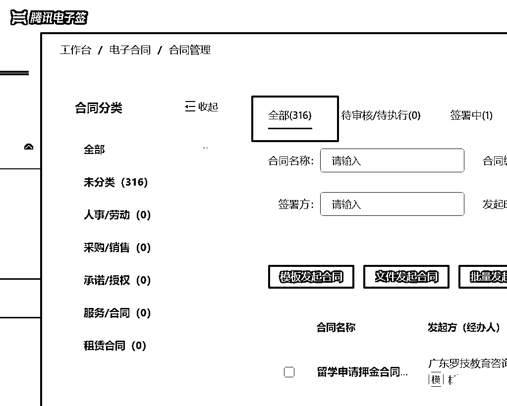

## 一、缘起：我为什么加入闪亮猫

首先，我自己有一个观念就是：**要跟着比我厉害并且拿到结果的人去干。**

2021 年暑假，我在生财看到了无敌姐的龙珠文，分享她通过小红书卖家具变现千万的故事，于是我就加了无敌姐。

跟她聊了几次后，我发现她很真诚，也很利他，问的一些问题她都会回复我，我觉得挺靠谱。

其次，**我一直想要去一个创业型的公司。**

因为我觉得进一个大公司，可能也就是做一颗螺丝钉，但如果进一家创业型公司，我可以深度参与整个从 0 到 1 的过程。

当时，闪亮猫刚刚成立，所以基于以上两条因素，我就加入了闪亮猫，成为了第一代喵呜。

喵呜这个角色，虽然只是一个客服，但是可以链接到每一个客户，可以看到他们都是做什么的。

此外，我还参与了几期打卡营的策划，见证了这些项目从 0 到 1 的过程，对我的成长帮助很大，包括小红书运营的一些技巧，我也是在这个阶段积累的，所以至今我依然十分感激闪亮猫这个平台。

## 二、从 0-1：如何跑通最小闭环

我觉得所有的项目都有一个共同点，就是分前端和后端两部分，**前端负责获客，后端负责变现**。

**前端之“获客”**

先说前端，前端的目的就是获客，我们可以通过分享各种留学知识引流，但是建议大家内容切入点要尽可能细分，比如细分到某个学校的某个专业。

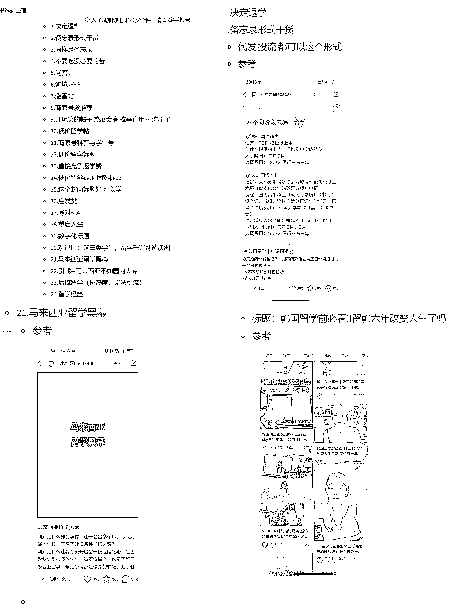

每个月我们都会搜集这些爆款案例，只要选题够好，基本照着发也有很大的几率能火。我们有一部分的帖子就是专门去蹭这些热点，做爆款的。

而另外的一种模式。切入点细分，比如细分到某个学校的某个专业的帖子，这也是“蓝海战略”。市面上有很多留学机构，有很多做留学的账号。

但我专门做某些学校的，避免了和他们竞争，才能取得大的结果。

献祭一个案例，我们公司做的澳洲**莫纳什大学**，单这个学校一年招生我们就达到了 60+学生。

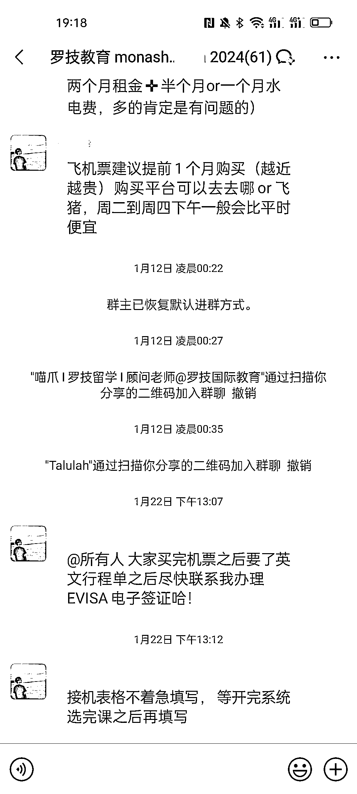

可以先用个人号发内容，等流量起来了再去认证成企业号，因为在留学领域，如果账号没有认证，很可能会被封掉。

我们有很多六七千粉丝的账号，目前都已经认证成某些学校的官方账号了。当然，这种情况需要有学校的授权。

你们也可以参考我们这个方式，先用比较容易爆款的内容（比如英语培训资料）快速涨粉，然后隐藏之前的内容，认证成企业号。

还有一些机构是通过让学生分享自己的留学申请感受去引流的，我们都会让学生真实记录他们的申请情况，发到小红书上面去；

有一些中介也会让学生写申请感受，然后分发到多个账号去。或者甚至是假装学生去钓鱼。

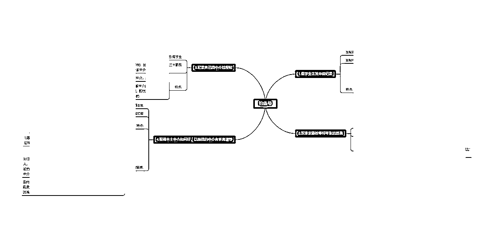

虽然我们流量团队不做这种引流，但是我们依然要知道理解其他人的引流方式。不少机构是专门做这种进行引流的，因为学生会更加信任学生，也拿到了很大的结果。

**后端之“机构名字”**

再说后端，我们留学赛道主要是引导流量到私域来，因为留学项目相对来说客单价高，需要在私域里逐渐进行转化。

在项目最开始的时候，会有学生看到我们公司登记的时间刚成立不久，而且没有正式名字，怀疑专业性不够。

而实际上，我的顾问老师从 2016 年就开始从事这一行业了，专业度是完全够的，只是比较难去打消学生的疑虑，有些学生马上要签约了，看到这个就停下来了。

后续我拿到了“罗技”的教育类商标，然后和顾问老师做了个小谈判，收购了他的公司，才解决这个问题。

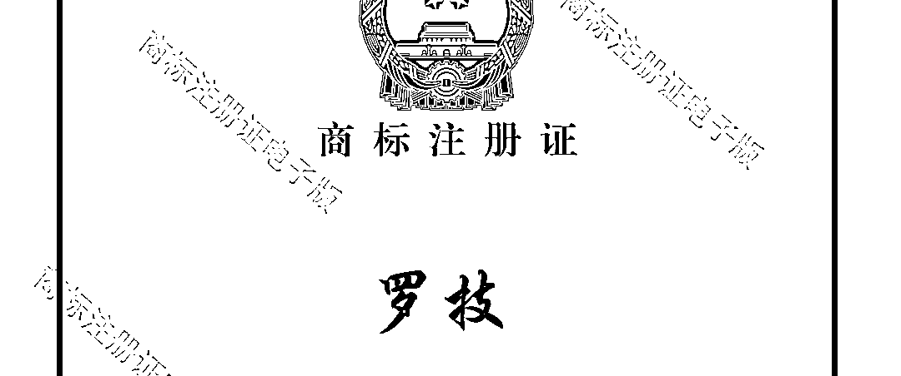

**后端之“客服”**

我们首先需要做的就是过滤非精准客户，比如有些大一大二、甚至五年级的学生，也会来申请留学的。

那我们就要用一些话术筛选出精准用户，比如大四、高三的学生，然后把他们单独拉到顾问群里，让顾问去一对一对接。

这样才能让我们的顾问，把足够的时间投入到有意向签约，和已签约学生上。

客服就类似电商的客服，不需要掌握专业知识。

而我们目前的顾问，也是从客服培养出来的，客服需要学习顾问老师谈单，然后整理成文档，慢慢就会形成属于自己的知识体系。

**后端之“顾问”**

一个好的顾问非常重要，他决定了这个学生能不能被转化，以及择校定位准不准确，而择校定位会影响学生后面的申请情况。

每个学生的情况都是不一样的，有些学生预算高，有些预算低；有些有移民打算，有的只想快速拿到一个学历。所以我们都是根据不同学生绩点和需求，匹配国家和学校。

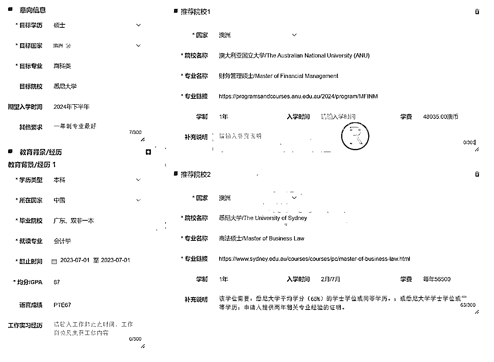

所以，**顾问是整个后端最重要的一环，顾问会给学生出择校方案，学生满意的择校方案，他才会签约。**合理的择校方案，才能保证学生有书可以读；而申请往往没有 100%能录取的把握，所以一切都是凭借顾问老师以前案例的经验，去跟学生聊择校。而申请上了满意的学校，学生才不会发到小红书去避雷我们机构，后续才会有很多转介绍。

**后端之“申请”**

如果大家是做流量的，申请就找专业的留学机构合作即可。后端非常非常繁琐，申请是很琐碎的事情，而且一旦操作失误，就会对学生的前程产生影响。所以一定要选择靠谱的合作方，因为咱们不管怎么说也不能耽误学生的前程。

虽然说每个国家的流程都不一样，但是也都差不多，做完择校方案后，就是收集学生的资料，整合成符合学校要求的格式，有些国家和地区还涉及到文书问题

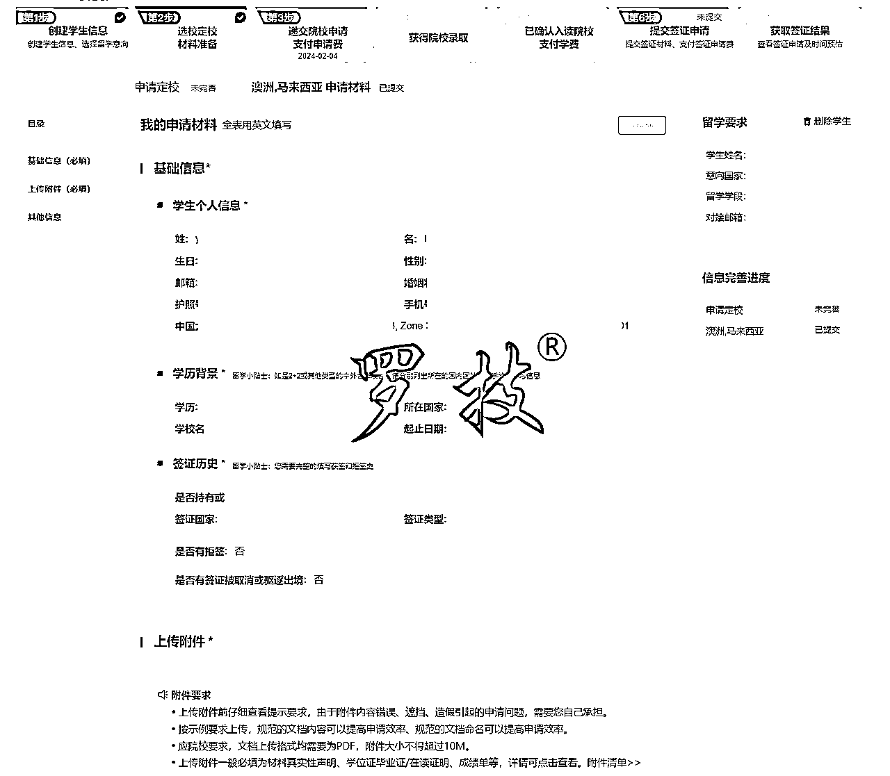

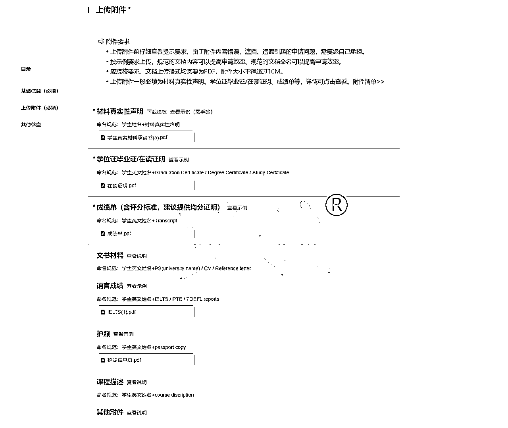

最开始我们是通过 word 文档收集，但是后面发现学生资料是会修改的，变更很不方便，再到后来就是使用飞书，现在是用留学申请系统了，方便学生的同时，也避免资料递交失误。

随便截了个学生案例哈，就是给学生递交学校，支付申请费用；以及根据学校要求，不断补充资料、催件、补件；基本我们都是事事有回应，工作日当天都会给学生安排好。

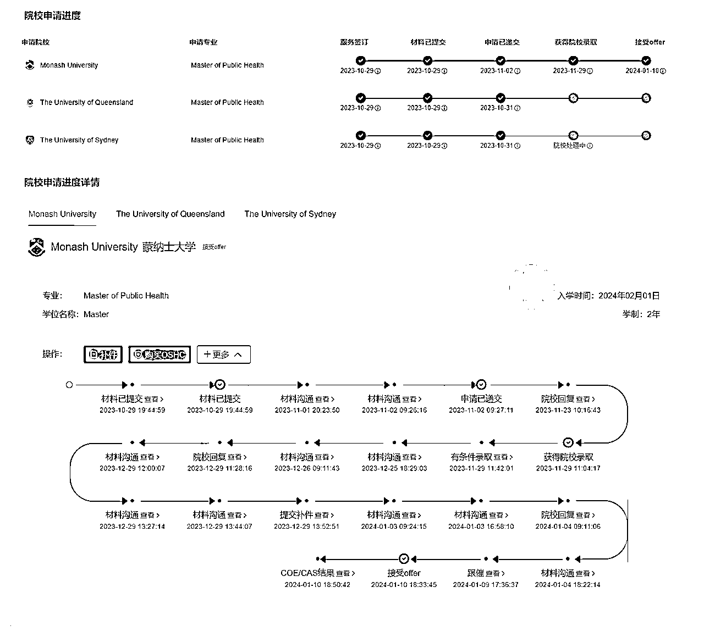

以这个学生为例，十月份签约的，一月份拿到了录取通知书和 COE，二月份下签，服务周期还是很漫长的。

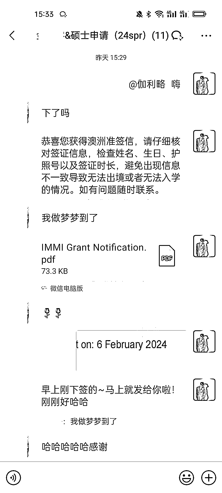

小红书上大部分的留学机构，后端都是接入别的公司的服务体系。有一些专业的 ToB 公司就在做这些事，比如新东方、再比如说我们也可以承接。一个成熟的留学公司往往是打通了全流程，找他们合作拿返佣即可。

## 三、从 1-10：单兵作战到团队协作分工

我在 22 年 8 月份做了第一个账号，10 月份就开始团队模式了。

我们前端基本都是兼职，最开始的兼职团队都是我本科的师弟师妹，当时是在学校墙上发了一些招聘广告，后面通过他们发朋友圈实现了迅速裂变。后端的服务老师就是全职，因为签约后的学生，我们需要保证回复率。

目前我们已经处于完全不缺人的状态，纯兼职的话，发个朋友圈就有很多人来问了。

**1、团队工作方式**

因为我不在国内，所以全职团队我们是以北京时间来工作，直接用腾讯会议，有问题就开麦。

兼职团队，就是给他们定任务，让他们根据任务直接发布内容，在招聘进来之后的前期，需要花费时间去培训，等到团队正常运转之后，就不需要耗费太多精力进行管理了。

之前招聘发的 JD，我们都是通过目前的兼职让他们去发朋友圈，以及找学校的墙去发招新帖。每次都会加到十几个人，然后再通过考核文件，筛选出能力比较高的。

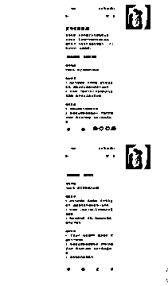

这一份飞书文档说明了我们所有账号的更新类型和频率等等，类似于账号档案，以及谁负责哪个账号的文案，谁负责哪个账号的图片，都会在这个飞书文档里面展示出来。

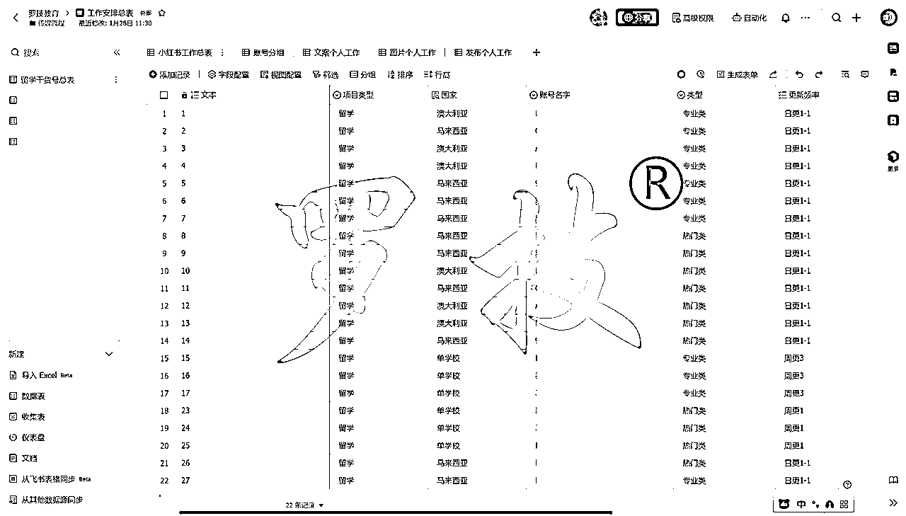

这个是按照文案个人工作的筛选，就可以对应到每个具体的人，负责什么账号的文案，图片和发布同理。

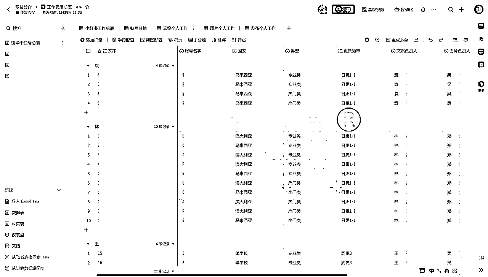

我们的引流团队全部是兼职，有人负责文案、有人负责图片、有人负责视频。每个人只需要做好自己擅长的那件事情，最后再专门有人负责发布。

之前我们也尝试过让一个人专门负责单个账号的。但是我发现账号一旦突破 30 个，就还是分开岗位去制作素材协作，会更加方便。

**2、团队管理工具**

在直播的时候，我推荐的是简道云，那个时候感觉简道云跟飞书差不多，而且还多了很多数据分析功能。

比如我可以看到每个人的日报，包含发布的链接、私信数量，有的还会上传私信截图。另外，简道云还可以自动帮我做业绩排名。

但几个月过去了，最后我们还是用回了飞书，因为飞书界面比较友好，设置起来也比较方便

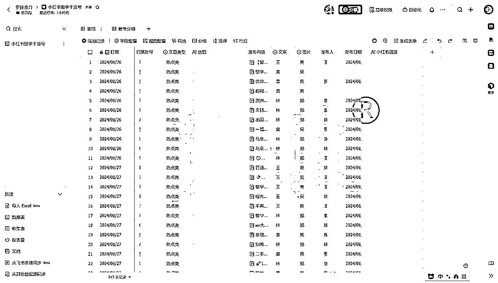

管理学生我用的是我们团队的网站，可以看到每个学生的申请进度，准备资料的进展，以及对应负责的客服、顾问老师、申请老师等。也可以看到整个学生是不是其他机构或者朋友给我们推荐的，方便核算佣金。

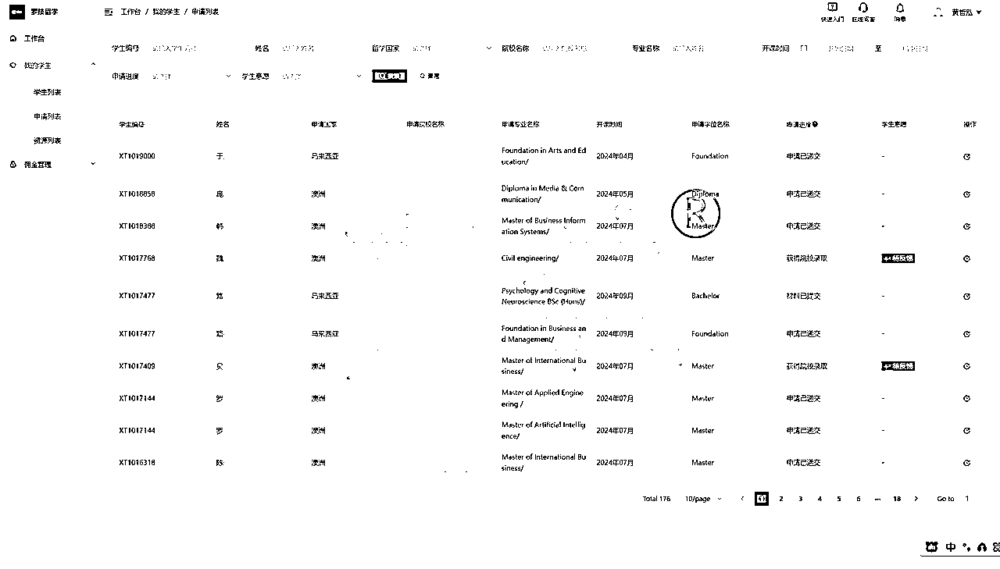

**3、团队岗位分配**

前端就是兼职人员，制作小红书图文发布到平台上，引流客户添加微信。

学生添加到微信后，首先接触到的是客服，客服是一个非常重要的角色，因为客户加进来后，我们必须迅速回复，不能晾他太久，否则他就可能跑了。

其次是顾问，每个国家我们会配备不同的顾问，但是像英国和澳洲，这两类人群有相互交集，所以同一个老师可以同时做这两个国家。

第三个是申请，这部分相对简单，澳洲有一些校代渠道，我们是直接把申请扔给校代去做，然后拿取佣金。马来西亚比较麻烦，因为事务繁多，而且利润比较少，但好处是现金流相对稳定。

所以我们目前的策略是通过马来西亚获取现金流，然后用聚光等方式获取澳洲的客源。

## 四、总结：给新人的一些建议

**1、做高客单产品**

我有朋友在抖音分享表情包，每天都能加到不少人，但是变现比较少。

其实我们做账号的目的不只是为了涨粉，所以要设计整个变现闭环，根据变现方式倒推你的文案、人设等等。我记得无敌姐的商家实战营，当时给了一个表格，然后无敌会根据你的具体情况给你建议。

在小红书上，我建议做一些高客单的项目，每天加几个人，成交几个就已经很好了。

**2、选择好赛道**

我觉得一个项目能不能做成功，赛道本身的好坏占了七八成。如果这个项目或赛道没有人做过，那你还是不要尝试了，不如去做一些已经被别人验证过的赛道。

哪怕这个赛道很卷，我觉得还是有机会赚到钱的，因为已经有人在做而且做得很好，那么只要你的内容比他们好，你还是有机会能抢占他们的流量。

**3、沉淀好所有的 SOP**

SOP 很重要，可以帮助新人快速上手。比如文案 SOP，我们把对标账号的文案拆解出来，就根据这个结构去套不同的内容。

再比如怎么注册账号，怎么养号，都要沉淀成一套 SOP，包括后端加人后怎么聊、发哪些资料，都会有 SOP 沉淀。这些 SOP 我也是跟着无敌姐学的，这些内容她的课程里都有。

当然了，**有了 SOP 也不代表你可以什么都不管了**，你还要留意团队人员的进展，如果你不去关注，他发什么内容你都不知道。

但是如果你的账号比较多，你就很难去顾及每个人，所以要有几个类似于组长的角色，让他们去监督管理。

**4、跟优秀的人学习**

这一点很重要，我自己不光付费，还付了很多，包括跟无敌姐认识，也是因为我当时加入了生财。其他一些杂七杂八的课程，我也买了不少，可以说，市面上一些有名的社群和课程，我基本上都报过。

可以这么说，如果没有通过闪亮猫学习小红书，我依然完全不懂小红书。再到后来自己初步做起来之后，比方说企业管理这块。虽然小红书帮我快速从 0 到 1，甚至从 1 到 10，但是我们想要做得更大，就遇到了管理上的问题，如果光靠我们自己，很难想出来。

所以我就去找宁培老师学习，也是无敌姐推荐的，他专门做企业管理这块。在这之前，我其实一直不知道我到底赚了多少钱，宁培老师的一个表格，帮我快速计算出了利润，也帮我扩张团队制订了可落地的步骤，直接拿来用。

**很多时候，如果你自己琢磨不透，不如直接付费学习，因为有些东西可以直接拿过来抄。**

当然了，付费学习也不是乱花钱，而是要把钱花在刀刃上。你可以计算投产比，比如我参加了无敌姐的训练营，它让我少走弯路，省下很多时间。从财务角度来看，我投入几千块去上课，但只要获取到一个客户，我就回本了，收获两个客户，我就开始赚钱了。

所以我觉得还是非常值得去做的，**能够花钱解决的问题，其实都不是大问题**。

以上就是我今天的分享，希望能给大家提供一些帮助。也给大家整理了一份留学行业的小红书选题合集，包含了市面上一些比较常见的笔记模式，欢迎添加我领取。

想做留学行业、和留学机构从业者也可以添加我，一起多多交流交流！

* * *

评论区：

希平 : 铁子，你 v 多少呢？想链接你一下
黄哲泓 : okkhzh
柠柠 : 疯狂打 call，真的很强，从 0 到 1 都见证过了，分享全是干货。
黄哲泓 : 谢谢柠柠～感恩成长路上的互助！
 : 优秀
黄哲泓 : 谢谢～
 : 真的好厉害，向优秀学习！
虎牙 : 好牛的 00 后，想链接一下

* * *