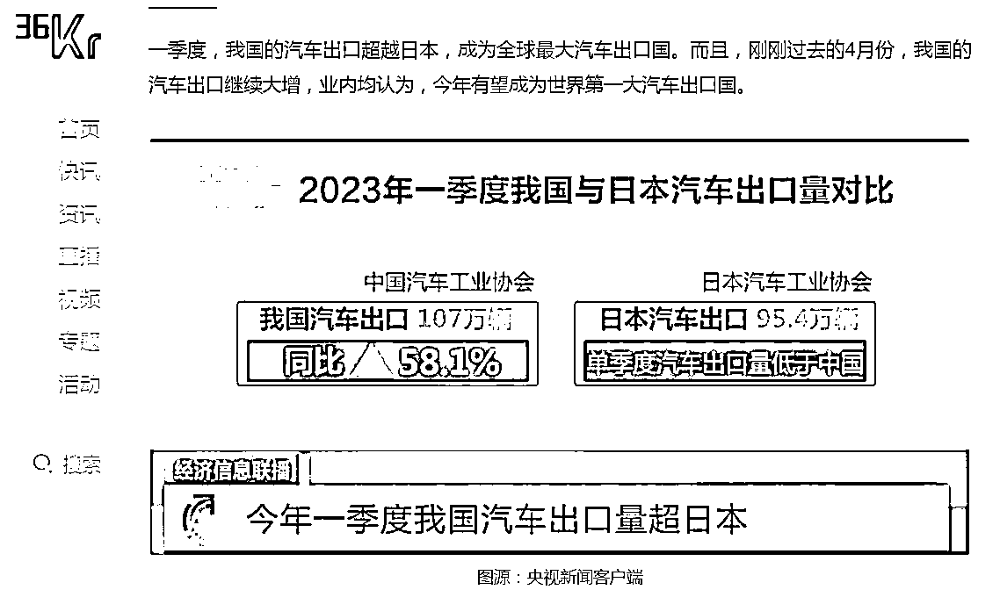

# 2023 年卷入汽车出口“蓝海”的 8 个月，一线实践避坑忠告！

> 原文：[`www.yuque.com/for_lazy/thfiu8/bsrctv6se9w3ow04`](https://www.yuque.com/for_lazy/thfiu8/bsrctv6se9w3ow04)

## (22 赞)2023 年卷入汽车出口“蓝海”的 8 个月，一线实践避坑忠告！

作者： 汽车出口-俊哥 Jer*

日期：2024-02-08

各位好，我是 Jerry.俊 | 桃李出海，

1）2023 年的 8 个月，我深度 0-1 参与了汽车平行出口贸易，并去到国外实地考察落地业务，获得了最一手的信息和经验。

2）2023 年的汽车出口，就是一场行业狂欢式的“盲人摸象” — — 公开信息所宣传的喜人数据背后，是整个业态的极度不成熟，和参与者无数的踩坑。

汽车出口，行业狂欢式的“盲人摸象”

可能消息灵通的大家，已经看到过官方展示的，十分可观增长的数据。并包括 36k，tx 汽车，dycj 等媒体关于汽车出口业务的报道。其中不乏月利润千万等创富神话。

但大家请相信，这篇回忆帖的内容，会更加贴近真实和细节。我们的故事，从去年 4 月底开始...

为保证阅读体验，欢迎移步飞书：

[`dop5miuclk.feishu.cn/docx/NIsUdCEiroH5ECxTUDocjMKAnUd`](https://dop5miuclk.feishu.cn/docx/NIsUdCEiroH5ECxTUDocjMKAnUd)

* * *

评论区：

希声 : 看完了，很有启发。👍
帅仔 : 写的太及时了，让我一篇看懂出口
zambidis : 太棒了！一直想做这件事。右舵车国家怎么破？
温暖的冰块 : 谢谢分享，星球很少有关传统外贸的文章，我本身也是从事进口外贸服务行业 6 年了，公司是一家代理进出口公司，帮忙 B 端客户完成医疗设备、机床机械的代理进出口服务工作。汽车行业，资金方的话利息一般是怎么个收费标准？

* * *