# app 出海风向标 小工具投放 tiktok 广告月盈利 40w 美金

> 原文：[`www.yuque.com/for_lazy/thfiu8/wc30e8urpgmh5o64`](https://www.yuque.com/for_lazy/thfiu8/wc30e8urpgmh5o64)

## (12 赞)app 出海风向标 小工具投放 tiktok 广告月盈利 40w 美金

作者： 阳光杉木

日期：2024-02-05

根据 pipiads 显示，发现了一款清理照片的 app 投放 tiktok 广告非常猛。当我仔细调研的时候我特别惊讶，因为我读高中的时候，就有类似的产品国内出现过，这就是一个很简单的小工具，通过其创新的用户交互设计和精心策划的营销活动，在工具类应用领域脱颖而出。

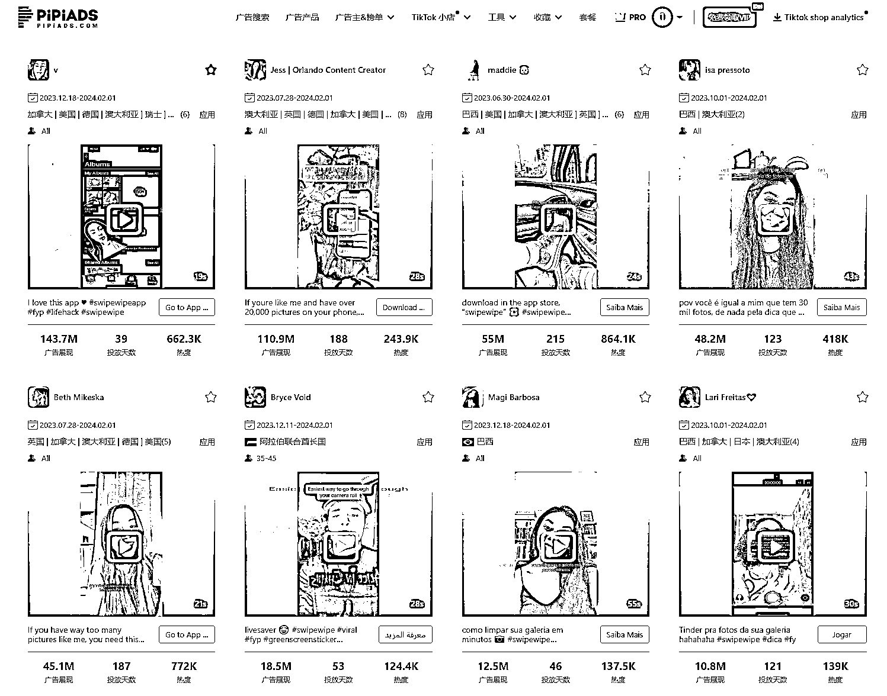

这个工具类 app 叫 swipewipe。来自一个法国老牌的 app 工厂 Music World Media

上个月有 70 万下载 40 万美元的营收 实用程序类别排名冲到了惊人的#26

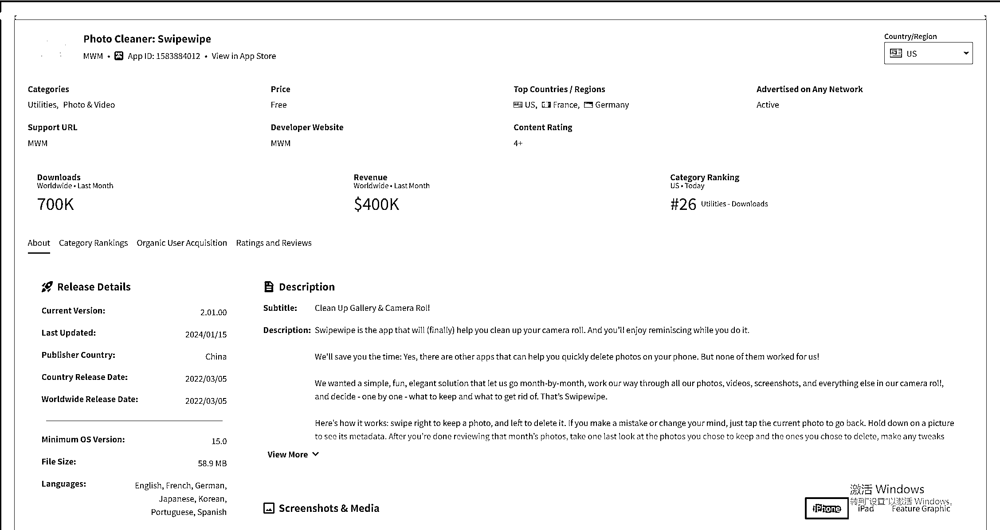

### SwipeWipe 应用概览

SwipeWipe 采取了滑动交互模式，为用户提供了一种直观且有趣的方式来整理和删除手机中的照片。尽管其功能看似简单——清理手机内存和照片，但该应用通过其丰富的色彩选择和简洁的界面设计，展现出了明显的设计感，这使其非常适合在社交媒体平台上进行传播。

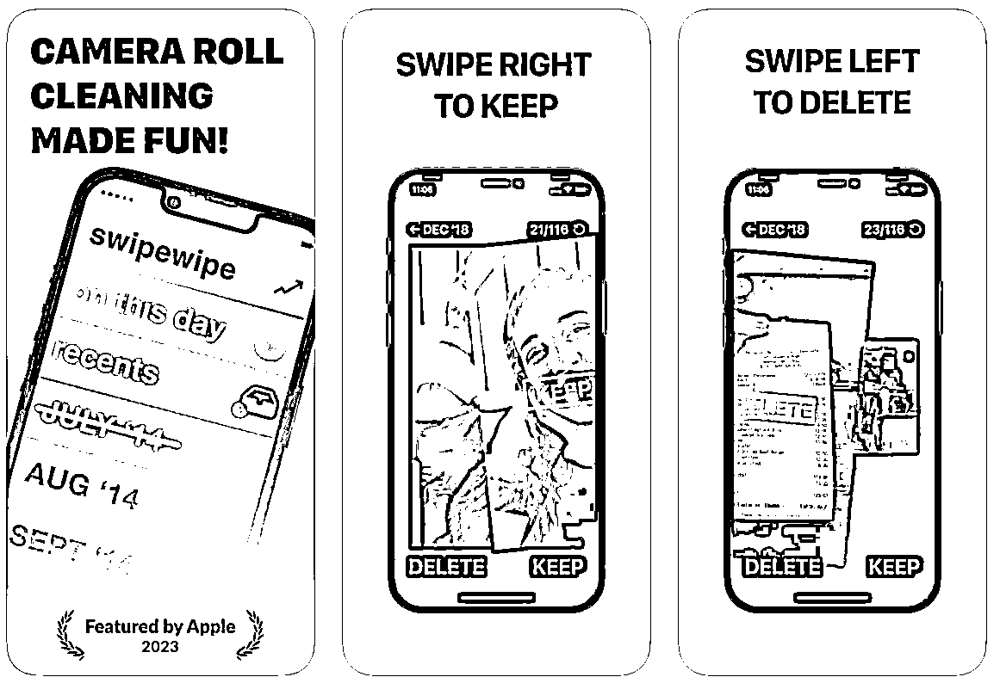

App Store 下载页面

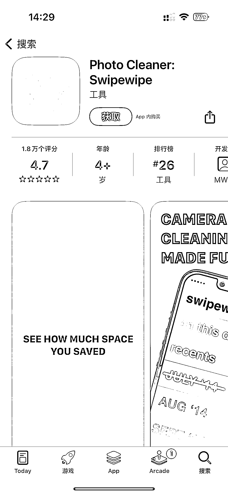

进入工具后提示授权权限，可以发现他的设计具有美感让人舒服

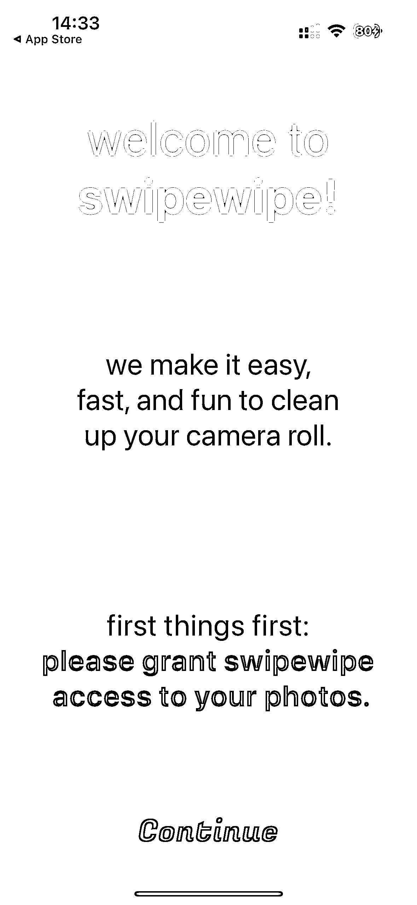

提示开启通知

提示付费：用户可以选择支付每周 4.99 美元的订阅费用以享受无限制的滑动操作并去除应用中的广告。

或按年费 79.99 美金进行支付

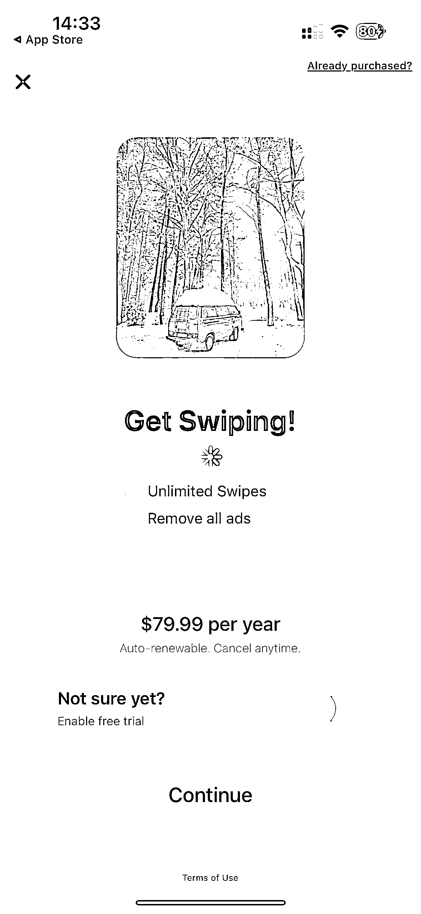

以下是我下载后的演练视频

暂时无法在飞书文档外展示此内容

### 关键特性

1.  滑动管理：受到流行约会应用的启发，SwipeWipe 允许用户快速左滑或右滑以决定保留哪些照片或删除，简化了照片管理过程。

2.  按月分类：照片按拍摄月份分类，使用户能够以可管理的细分来回顾和组织他们的图像。

3.  便于回忆：该应用不仅帮助整理杂乱，还通过有组织的方式呈现照片，增强了回忆过去时刻的体验。

4.  以用户为中心的设计：SwipeWipe 注重用户体验，融入了如视觉上令人愉悦的启动画面以及定期更新以提升性能和可靠性等特性。

5.  隐私考量：理解隐私的重要性，SwipeWipe 确保照片的管理工作尊重用户的隐私关切。

7.  付费与用户增长策略

8.  广告创意拉爆+红人种草（上 pipiads 查看创意素材）

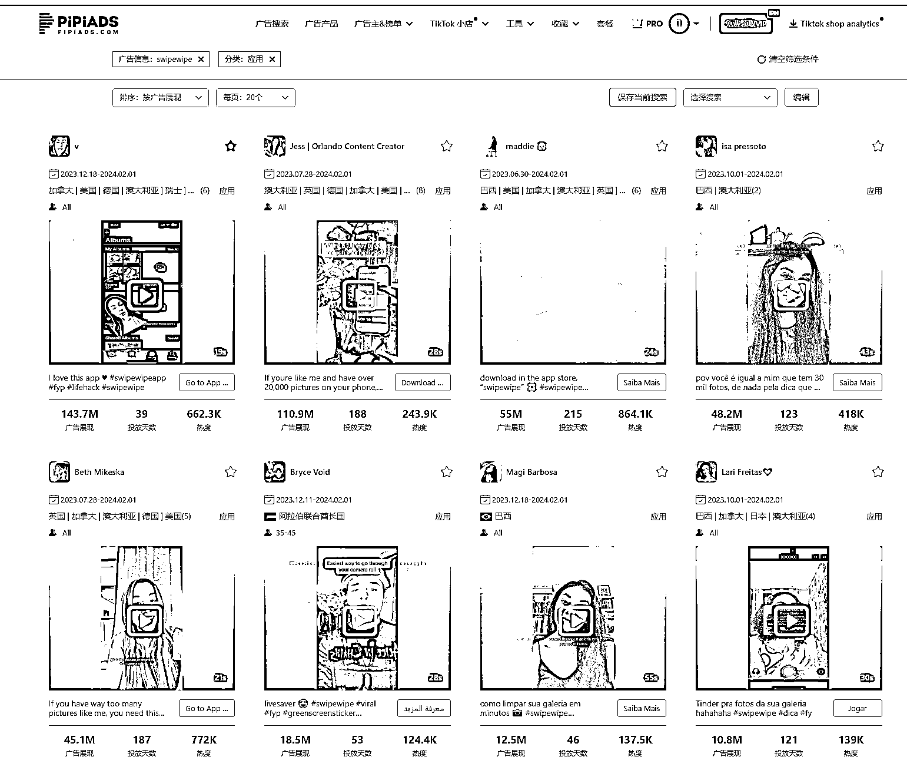

SwipeWipe 提供了两种主要的付费选项：用户可以选择支付每周 4.99 美元的订阅费用以享受无限制的滑动操作并去除应用中的广告。尽管这个价格对于一款看似简单的工具类应用来说可能略显高昂，SwipeWipe 却通过其在 TikTok 上的强劲广告投放策略和解决对应需求实现了显著的用户增长和盈利。

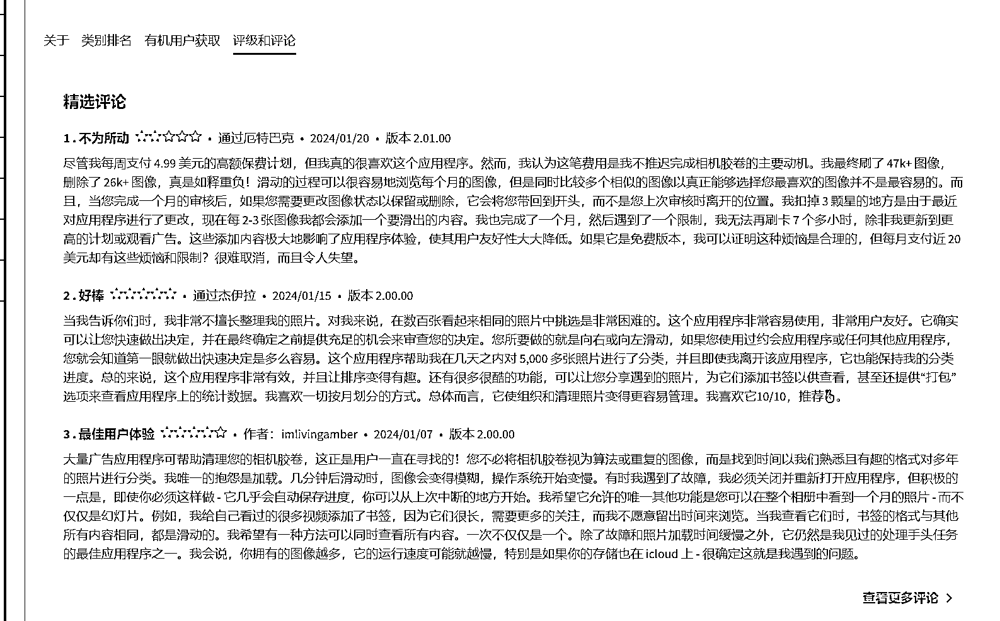

据 pipiads 数据显示，过去半年中，SwipeWipe 在 TikTok 上的广告播放量达到了数十亿次，主要通过真人出镜和应用操作演示的方式来吸引用户。其中，该应用的广告素材注重质量而非数量，总素材量不超过 100 条，但其中多条广告获得了超过百万的播放量。特别是两条红人素材，短短三个月拉到过亿的播放量，成为美国地区播放量最高的广告之一。

官方账号 1870 万广告展现 累计广告数 44 条

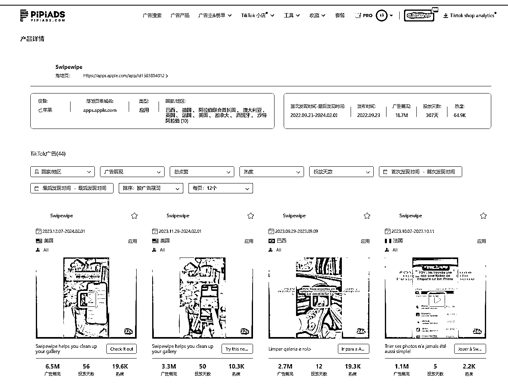

两条红人素材过亿播放量

素材一：1.43 亿播放量

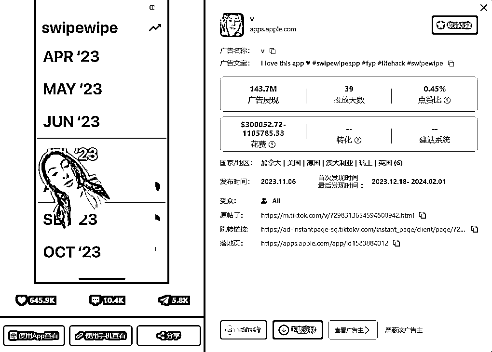

详情链接：[`www.pipiads.com/zh/ad-search/5585cc7d83c5d4419f5f/`](https://www.pipiads.com/zh/ad-search/5585cc7d83c5d4419f5f)

### 素材二：1.1 亿播放量

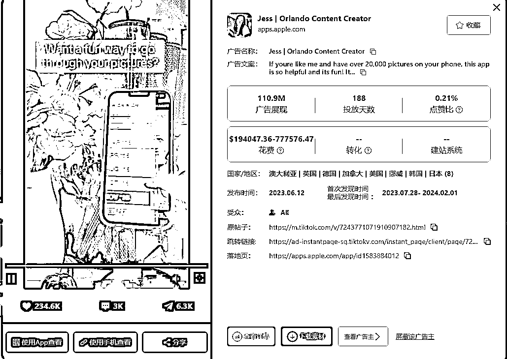

详情链接；[`www.pipiads.com/ad-search/5a9a90c7872bf433757c/`](https://www.pipiads.com/ad-search/5a9a90c7872bf433757c)

成功因素分析

SwipeWipe 的成功可归纳为几个关键因素：首先，其创新的交互设计改善了用户的应用体验；其次，通过精心挑选的 KOC 营销策略有效降低了营销成本，同时大幅提升了用户参与度和应用的可见度；最后，尽管面对 AI 技术风口下的激烈竞争，SwipeWipe 通过坚持其产品和营销创新，实现了月 70 万美元的收入，这一成绩显著超过了许多当前热门的应用。

### 总结；

SwipeWipe 的案例展示了如何通过结合技术创新和精明的市场策略，在竞争激烈的应用市场中取得成功。对于寻求在数字时代脱颖而出的应用开发者来说，SwipeWipe 提供了一个值得学习的范例。

### 目前 tiktok 大盘 游戏和应用的投放量比电商猛，电商是排在这两者之后的。

### 后续一些实用的小工具，对应到合适的需求，就是一个爆发很强的商业机会。

### 未来也会有更多的开发者团队 通过 tiktok 平台曝光产品迅速占领市场，验证结果。

* * *

评论区：

潮州痞子蔡 : 40 万营收和 40 万盈利有很大差别

* * *