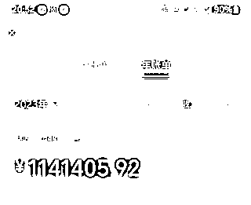
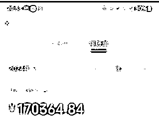

# 国学项目从 0 开始，我是如何一个人做到年入百万的

> 原文：[`www.yuque.com/for_lazy/thfiu8/oyebozl4gqq8p0rl`](https://www.yuque.com/for_lazy/thfiu8/oyebozl4gqq8p0rl)

## (70 赞)国学项目从 0 开始，我是如何一个人做到年入百万的

作者： 祥瑞山人

日期：2024-02-07

《国学项目从 0 开始，我是如何一个人做到年入百万的》

大家好，我是祥瑞山人，潜在咱们生财近 4 年，却很少发言的生财人。

随着离九运正式进入，接触国学的人越来越多，在这个赛道深耕 6 年左右的我，今天给大家带来：自己是如何一个人做国学项目，从 0 开始，到年入百万的经验分享。

虽然不能保证每一位圈友都可以有所收获，但会对做国学项目，或者是对国学项目感兴趣，以及一些自由职业者带来些许启发。绝对是一场心与心之间的交流。

接下来从以下十个版块为各位进行分享：
一、如何接触到国学赛道
二、这个赛道现在的情况
三、自己早期入行切入点
四、第一批单子和客户源
五、服务人群及提供价值
六、目前的产品设计形态
七、目前的主要流量渠道
八、目前的核心交付形式
九、如何形成闭环和放大
十、新人入场的六点建议

为了更好的阅读体验，大家可以移步飞书：
国学项目从 0 开始，我是如何一个人做到年入百万的
全文 7500 字左右，预计需要 10 分钟左右阅读，马上要过年了，文末有一点心意送给大家，请查收。

在这里也尤为感谢咱们圈友梁靠谱和芷蓝给自己提供的修改指导建议[玫瑰][玫瑰][玫瑰][`cv00zodij0t.feishu.cn/wiki/VpRnwvYgzibqU8kow6mcyWzHnXj?from=from_copylink`](https://cv00zodij0t.feishu.cn/wiki/VpRnwvYgzibqU8kow6mcyWzHnXj?from=from_copylink)

* * *

评论区：

xueping : 随喜！新年快乐，财源广进，大吉大利！
祥瑞山人 : 快快乐乐过新年，欢欢喜喜接财富[红包]
刘掌柜 : 下场小国比较卷了，晴朗行动又封的狠，不过目前还是有量的[呲牙][呲牙]，老师给个 v 呗
梁靠谱 : 老师牛逼！
闫君 : 一般
n : 请问方位东北位，要确定？
祥瑞山人 : V:ds16841 这种情况下一方面是把私域做好，一方面继续做量，小国学封号比较正常，现在我所在的那个操盘圈，为了尽量避免封号，基本上有几种方式：①在直播间快速拉流量，然后快速加 v 下播；②只给自己的关注粉丝或者是 VIP 会员开播；③提前把容易敏感词屏蔽掉，防止同行举报；④敏感词替换掉，换种语言形式代替，比如看感情用樱桃🍒代替，看事业用橙子🍊代替等。其他你看看还需要了解啥，不行我就把这个帖子再完善一下。第一次发帖，没啥经验，不知道分享什么。
祥瑞山人 : 也非常感谢您的指导[抱拳][抱拳][抱拳]

* * *