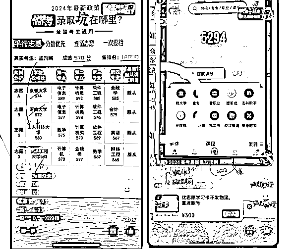
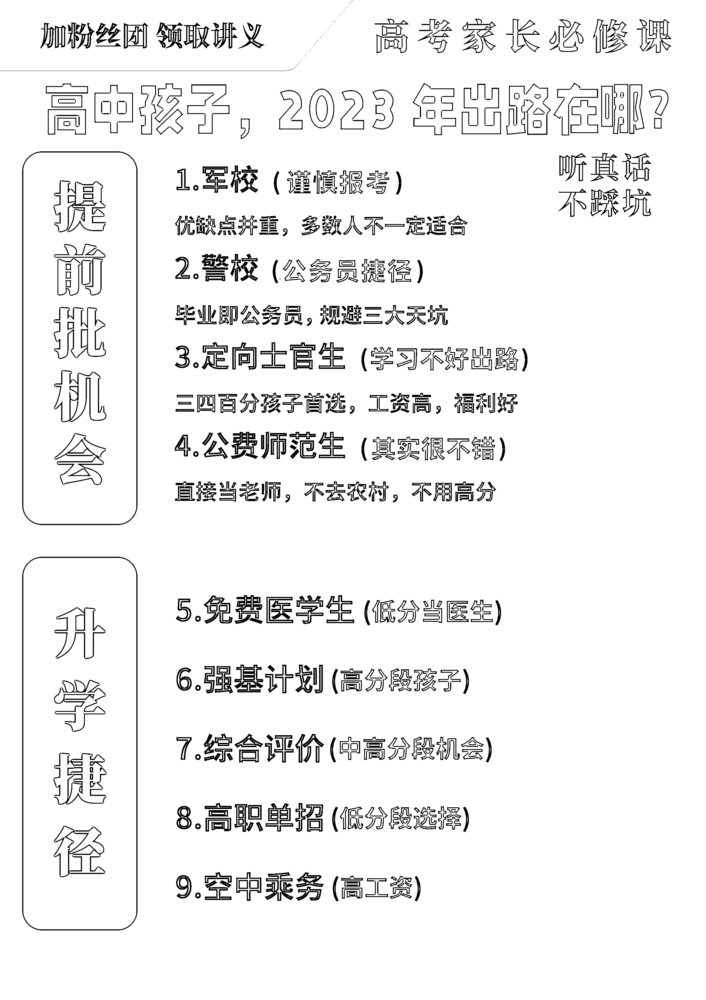
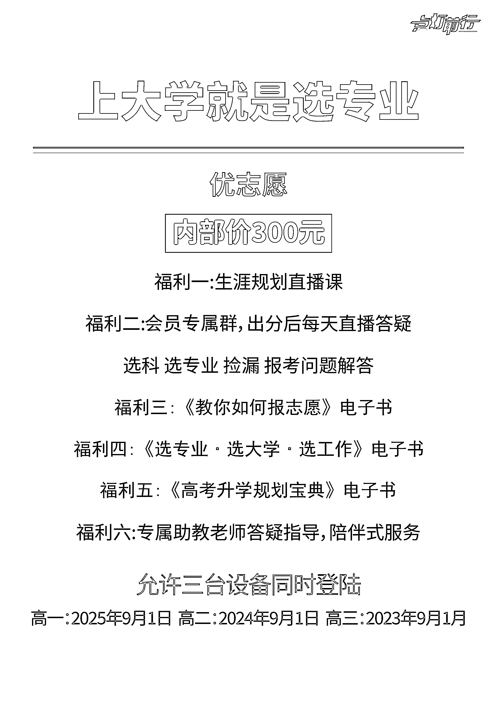
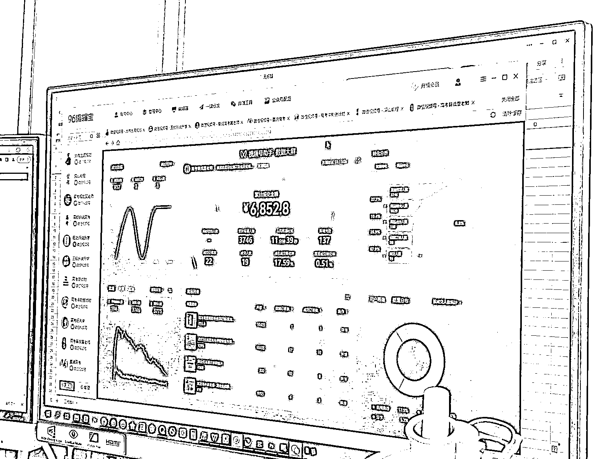
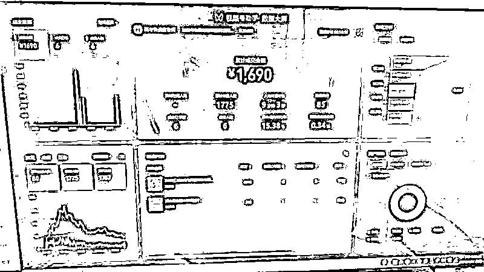
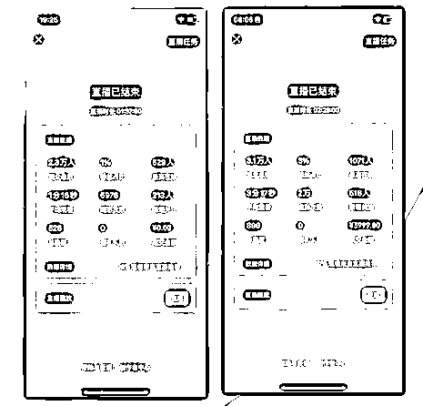
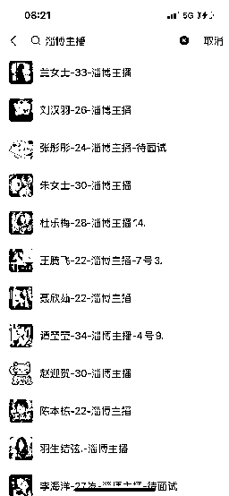

# 3 月份可以做的热门生意：成为高考规划师，为高考志愿填报

> 原文：[`www.yuque.com/for_lazy/thfiu8/antzgzimgg2rcot7`](https://www.yuque.com/for_lazy/thfiu8/antzgzimgg2rcot7)

## (42 赞)3 月份可以做的热门生意：成为高考规划师，为高考志愿填报

作者： 艾乐

日期：2024-02-06

今天分享的这个项目，是我们从去年 4 月份开始做的一个项目，主要针对高考家长人群的，高考前帮助小孩提分，高考后，帮助小孩做志愿规划填报，需求很清晰明确。

高考前，家长最迫切的需求就是帮小孩提成绩，哪怕提高一分两分，高考后，最迫切的需求，就是帮小孩规划填报好志愿，但是，大部分的家长都不懂，干着急，焦虑，所以，这个就是我们做这个项目的价值。

先说下这个项目是不是赚钱，正常在高考季的时候，我们一个月能到 50 万左右利润。当然，做的久的成熟的团队，一个月几百上千万的也很多。

再说下，为什么今年会开始去做这个项目，实际上最大的核心原因，在于我认识的朋友公司专门做这块的，做的非常的好，只专注做这一个业务，年利润有几千万，当然，他们在这块领域深耕好多年了，主播都非常成熟，背后的资源供应链合作方都相对稳定。

我们做这个项目，在整个运营模式上，说白了，就是抄作业。而且，我们在抄作业的时候，偶尔还可以去朋友公司学习一下，所以，这个也是我们前期走的弯路相对比较少，能快速拿到结果的原因之一。

接下来，我分为几块，跟大家说下，我们是如何开始抄作业的，以及在这个过程中，我认为比较核心关键的一些点。

当然在开始前，还有一些碎碎念，可跳过：

我们经常能接触到的项目其实很多，很多项目一看，大体的思路和方法都好像是明白的，但是自己真正去做的时候，因为没有经验，很多执行的细节的差距，或者某一些卡点，就会让这个项目停滞不前，然后，一度让我们自己怀疑，这个项目是不是真的能做的起来。

在这个项目中，因为我们有明确的对标案例，甚至对标案例的具体实操，日常工作情况是怎么样的，我们都很清楚。

在做这个项目开始之前，我特意带团队，去朋友公司驻扎了一个星期，专门学习，除了看他们怎么培训主播之外，更多的是让我们团队的人看到，真实的项目正常运转中的主播状态是怎么样的，以及这些主播都能拿到什么样的结果，最现实，对他们最有刺激的就是这些已经成熟的主播，每个月的薪资。

因为这类型的主播的薪资都是跟自己的直播销售单量挂钩的，而销售数量基本都是内部公开的，所以，谁一场直播赚多少钱，是明明白白的。

所以，在这样的环境下，我们团队的人，实际上对这个项目是否能赚到钱，已经非常坚信了，只要我们去做，去认真的抄作业，就一定可以拿到结果。

我觉得很多项目能做成，团队的信念感特别重要，你只有相信自己能做成，你才有可能做成。

## 一、**平台的选择**

这个项目一开始大部分的公司几乎都是在抖音直播，我们今年开始入局的时候，在抖音，这个赛道已经非常的卷了，做这种直播的特别多，个人的，公司的都有。

而且大家的直播脚本其实也并不会差太大，毕竟只要有个新的直播脚本出来，很快就会有直播间跟上的。

我自己从视频号刚出来，就开始入局在做视频号相关的项目了，我也是微信视频号创造营的讲师，所以，对视频号这个平台的玩法规则都更熟悉。

因此，我们做这个项目前期的规划就是主要以视频号直播为主，通过视频号去做这个项目，抖音虽然非常卷了，但视频号相对还是有很大的空间，而且视频号的整体人群相对年龄偏大，跟高考生的家长人群更加吻合。

所以，我们重点是选择视频号这个平台，但实际上，刚开始做的时候，尤其是做了大半个月视频号没有起色的时候，内心还是比较着急的，总是想是不是视频号上这个项目做不成。

为此，我们还分了两组，一组做视频号，一组做抖音，但做了一段时间，发现抖音的在线能稳定在 100 左右了，但是转化并不好，而且来直播间的人很多都是已经在其他直播间听过的，而我们的直播内容变动又比较少。

所以，对于很多刷到直播间的人来说，是复习的，而且这类的用户没有被其他主播转化，继续来我们直播间被转化的概率也就更小了。

所以，在做了一段时间后，索性就放弃了抖音，还是专心做视频号。视频号即便是放到现在，虽然也已经大量的公司进来在做这块了，但我认为还是有很大的空间的。

这个项目的好处在于，目标用户群体是即将要高考的孩子家长，而这些人每年都会有新的一批，并且都是强需求，2023 年的高考生有接近 1300 万，这个市场还是很大的，虽然，这几年的人口出生率下降了，未来这个市场的需求会变小，但最近几年还是有大量的需求在的。

# **二、产品的选择**

对于我们来说，刚开始做这个项目，产品选择上有几个标准：

**（1）产品必须靠谱。**

这个是最最最重要的，因为我们面向的人群很特殊，产品最终是用于高考的孩子的，所以，必须要负责任。

说小点，这个是会影响一个孩子的命运，说大点，影响的是一个家庭的命运的。我们虽然不自己开发产品，只是相当于一个销售，但是，合作的产品必须靠谱，这是底线。

因为在做这项目的过程中，尤其是团队主播多了以后，很多产品会找来合作的，也会给很高的佣金，如果只是看谁佣金高，就给谁带，那多少对这群用户是不负责的，甚至会害了他们。

**（2）必须是爆品**

在做这个项目之前，我研究了大量的这类对标账号，每个阶段都会有一些固定的卖的特别好的产品，比如：高考前后，帮助考生填报志愿的卡就是最好的一个产品。

大量的直播间，用数据说明了这点，那类似的产品实际有很多家，我们选哪个？

这个除了参考朋友公司的，我们还特意去考察了这些产品，最终选择的像优志愿这样的志愿填报卡，也是去他们公司深度了解以后，才定的。

**（3）利润要相对比较高。**

做这个项目还是要赚钱，利润当然是非常重要的一点，而像优志愿这样的卡就是我们最好的选择了。一般这样的一个卡的客单价是 300 元，根据不同的销售体量，利润在 200 左右。

所以，最终我们核心其实在卖的产品主要是押题卷+志愿填报卡，这两个产品在高考前后这段时间占销售额的 90%左右。

押题卷解决的是提分的问题，因为是王后雄的押题卷，历年的押题命中率都还是比较高的，所以，这个押题卷对于很多高考生来说确实有用。押题卷分为 899 元和 399 元的两版，以 399 的为主销售。

志愿填报卡解决的就是考试结束后，分数所对应的院校应该如何去填报的问题，给出最优的参考方案，让家长可以帮助小孩去快速正确的填报志愿。

除了这两个产品，我们还增加了一个高客单价的产品，去满足更高要求的家长，就是一对一的志愿填报规划。

这个相当于定制，需要专业的志愿填报规划老师跟家长沟通情况，然后经过多次沟通，最终根据成绩以及小孩的意向发展，兴趣等等去给做志愿规划。

这个一对一的产品客单价是 4999 元，我们同样也是跟其他专门做这个志愿填报规划的机构合作。

当然，这个是属于高报季的产品，一般是 3-8 月，其他的时间，主播就会转向去卖一些合作的课程。

比如，有道高途的这种提分课，我们负责的只是卖他们前端的引流课，引流课的客单价一般是 19.9 元，根据成交单量以及后续他们转化正价格来进行分成。

# **三、高考报志愿项目的直播核心点**

**（1）对标账号**

我们开始做这个项目的时候，对标的大量账号实际上就是朋友公司的账号，让我们主播选择觉得适合自己风格的主播去对标，要给自己找榜样，除了直播的时间外，要多去研究和看别人的直播，学习对标主播的话术、直播节奏、甚至是情绪。

我自己一开始是研究了大量的这种对标账号的，几乎对标的主播每天几点直播，直播几场，我都非常清楚。

对标账号搜索升学，高考相关的关键词，就能找到大量的这种账号了，再者基于抖音的推荐机制，没几天，就能有大量的类似直播间推荐给你了，这些基本只要数据好的，都会成为我研究的账号。

另外，就是看每场直播的转化，抖音这个赛道的，我一开始对标的都是在线几百人的直播间，因为这个量级是我们能够快速达到的。

对我们来说，有更强的参考性。在线几百人的直播里面转化好的这些主播，我会重点选出来，学习，然后在去分享给我们的主播学习。

**（2）直播内容如何做？**

我们直播的内容脚本几乎是比较固定的话术，主播需要做的就是熟悉这些话术，然后，去直播间讲出来。

因为我们这类型的直播间都是不需要主播真人出镜的，所以，主播只需要对稿子比较熟悉，然后，能有情绪，有节奏的哪怕是把稿子读出来都行。

实际上，一开始主播都是需要看着电脑去读稿子的，等一段时间以后，主播熟悉之后，慢慢就可以脱稿。

但对于直播的内容，基本不会发生变化，除非我们给到主播新的稿子。一般正常情况下，稿子的迭代也是部分变化。

直播稿子稳定，主播没问题的情况下，直播间的转化率就会相对比较稳定。

最初我们给到主播的稿子，用的是我朋友公司的直播稿，我们的主播最开始用的就是现成的稿子。

当然，这个稿子基本隔一段时间都是要有一些小的迭代变化的，而且，因为我们是在视频号直播，视频号的人群跟抖音的人群是有区别的，在对直播内容的需求上也是有不同的。

视频号里的相对节奏会更慢一些，对一些内需要反复讲，很多年龄大的家长，在直播间不互动，但是他们会下单，所以，有时候我们拉互动，看起来数据一般，但是最终转化还可以。

在整个直播的前期，我们也是慢慢在一边播一边优化稿子，稿子整体主要主要是讲干货内容，一般一场 2 小时的直播，1 个半小时可能都在讲干货，最后半小时才会带货。

在分析和学习对标账号的直播内容的时候，我一般是先录制整场直播的视频，然后上传到飞书妙记，转成文字稿，然后，整理一下文字稿，对照原视频，觉得好的部分，我们会直接拿来用，然后让主播去测试效果。

做了一段时间后，我们对高考家长群体的痛点理解的比较透彻了，我们自己也会跟主播一起开会去讨论，觉得有哪些内容可以去做迭代，讨论出来的一些觉得好的内容，我们就会增加到直播文稿里面，进行测试，效果好的话，其他直播就会一起用新的稿子。

**（3）带货话术的打磨**

在整个直播稿中，我们分为三部分，讲内容的干货部分和带货部分以及拉互动的部分。一般干货内容的部分和互动的部分，在线都是比较高而且相对比较稳定，但是一旦转到带货部分，直播间掉人的速度就会很快了。

所以，我们打磨带货话术的部分，一般主要围绕：

一是如何从干货内容部分更自然的过渡到带货部分；

二是，带货部分的话术如何才能让用户共鸣，戳中用户痛点；

三是，我们独特的一些福利，也就是从我们直播间买才会有的一些额外福利。

对直播话术的优化，包括干货部分的内容优化，最终是需要根据数据分析来优化的。一般我们在做数据复盘的时候，会比对着主播的直播回放来一段一段复盘，哪个时间段掉人比较快，对应的什么内容，这个内容怎么优化，把内容拆分到足够细，然后挨着去根据直播间的数据反馈去做优化。

在内容文稿的优化过程中，有些是通过内容优化，可以提升的，有些实际上是因为主播的个人关系。

我们团队的所有主播都是用的同样的稿子，但是，有的时候，会发现，同样的地方，有的人在线相对稳定，但有些人掉人就比较明显，这个实际上就是主播的个人原因了，也就是跟主播的讲课风格，情绪，节奏这些因素有关系。

**（4）前期和后期的关键数据**

我们这类的直播间可以归属为知识类的，新起的账号一般连续三场在线数据稳定在 50 个人左右，就可以尝试带货了。

前期，刚开始拉的新号，只讲干货内容，和拉互动关注等等，不做任何带货，也不上带货链接，纯干货分享，这样视频号直播间考量的核心数据就是用户在线停留时长和互动数据。

在视频号的平台中，直播间能不能吸引用户停留，并能能在直播间产生有效观看时长，是非常重要的，关系着在后续的推荐过程中，系统是否会继续给你推荐流量。

尤其是起新号的阶段，直播间的曝光点击率，直播间的有效观看占比，以及直播间的短停快划，这些数据指标都会影响后续直播推荐流量的放大。

所以，我们在前期起号的时候，除了直播脚本这些内容，会非常注重直播封面，直播间画面，和直播主题的设计。

当用户在直播广场上刷到我们的直播间的时候，第一眼看到的首先是我们直播间封面，封面是否能吸引他，就会决定他是否会点击进入这个直播间。

也就是平台考核的进房率的指标，进房率=点击进入直播间的人/直播间外层曝光的人数。

所以，前期我们封面设计了很多不同版本的，设计的时候除了自己觉得好的封面以外，也会参考一些同类型直播间的封面，经过测试，留下效果好的给主播使用。

当然，封面随着不同时间段也是需要更新，比如，高考前封面上的信息以提分报告为主要信息，高考后，以志愿填报以及不同分段分数等内容作为主要信息。

用户进入直播间后，核心还是要靠主播的内容来留人，这个时候，同样的内容，对主播的情绪，讲课的节奏，状态就息息相关了。

除此之外，我们依靠一些送的高考相关的资料福利来引导用户关注点赞，以及通过福袋和互动话术，来拉用户的停留时长，一般拉新号的时候，人均平均停留时长在 3 分钟左右。

而我们这种直播间画面，主要是以纸播为主，所以，纸的内容就很重要，包括纸的设计，这些都是我们前期经常优化和调整的。

到了带货期间，除了用户停留时长和互动数据外，最关注的就是带货转化数据，包括产品的曝光点击率，生成订单率，以及支付转化率等等。

一般我们会配合带货话术的调整来做这些数据，比如，我们主播在讲解这个产品的时候，这个产品有多少人去点击了解了，这个是可以通过主播的话术去引导提升的。

当用户点击了以后，感兴趣生成订单，到购买完成这条路径上，有部分用户是停在了生成订单上，也就是差那临门一脚。

所以，这种情况下，我们也会通过一些促单的话术，比如，今天购买会有额外的限时福利，赠送单独的一个课程，只有今天这场直播才有，类似这种都可以提升支付的成功率。

当然，这个话术我们也是需要一直迭代的，很多时候，一套话术在某一段时间有用，过一段时间效果就不好了，我们一般也不纠结啥原因，就是效果不好了，继续更换话术。

因为新号流量起来以后，对于平台来说，是否会推荐更多的流量给你，在于前面给你的流量，你是不是能转化掉，也就是我们需要去提升这些产品的点击率，支付的转化率等数据来尽可能的让系统推荐更多的流量进来。

当然，除了这些直播间的数据以外，还有个重要的点就是直播时间。

因为在视频号里，系统要不要给你推荐流量，重点关注的是我前面所提到的那些核心指标，在整个大盘同期的表现水平。

因为起号阶段，我们又是新主播，很难跟其他成熟的同类直播间去竞争，所以，为了能在大盘的同期的表现水平相对比较高，我们新号都是利用早晚得时间来起号，一般我们主播是早上 4 点以后和晚上 11 点以后。

这俩时间点，使我们测出来相对比较适合的，流量也更好的一个时间段，避开了大部分的成熟主播的直播时间，也就有更大的概率能拿到更多的流量。

**（5）私域成交**

除了直播销售外，私域销售也是我们重要的一部分，很多家长需要反复的来听你的直播，对主播有足够的信任度之后，可能才会下单，这种用户我们通过引导进入私域，在私域进行转场直播转化，比正常直播的转化率会高出很多。

除了专场直播，还有社群转化，我们做了家长的交流群，在交流群中除了日常跟用户分享一些高报的知识外，老师偶尔也会进行答疑。

然后，通过引导购买志愿卡，进入专属会员群，包括在专属会员群的一些内容和福利也经常会通过截图话术等方式去免费交流群和朋友圈宣传，通过这些私域的日常运营，也能转化出一部分。

每个主播都有自己的企业微信，自己直播间的粉丝，主播会自己运营，运营的内容，以我们提供的为主，主播自己日常也可以通过朋友圈和社群去做一部分自己想发的内容。

不过，因为是第一年做，私域成交不做的不够细致，更多的精力还是在直播间的转化上，2024 年的在做，我们私域这块就可以有更多的精力去做。

# **四、批量复制直播间**

那像我们这样的项目，其实，需要大量的账号去跑的，最难的是从 0 到 1，最开始我们是针对主播，一对一跟进辅导，尽可能的快的帮主播拿到结果，去验证我们的直播脚本，运营方法，各个细节，流程是不是有效。

只要能跑出来一个主播，就证明是可行的，后续我们要做的就是以同样的运营方式，同样的脚本，去复制大量这样的主播。

整个流程：

1.  新主播入职第一天熟悉稿子脚本，下班前进行测试和对内容知识点的理解

2.  第二天熟悉稿子+内部试播，指出问题，改正

3.  第三天继续内部试播，指出问题和内容知识点考核

4.  第四天熟悉稿子，培训视频号直播相关要点和使用

5.  第 5-7 天，正式上播，根据直播情况和数据决定最终是否留下。

6.  前面一个月，几乎每场下播都需要跟主播去复盘，分析原因，指导应该如何去优化。

一般主播，在 7 天试用期内，如果账号跑不出来，直播在线稳定在 50 以上，就算不合格，达到标准，就可以正式入职，在看 1 个月内的销售情况，根据销售情况决定去留。

当然，有些适应快的主播，实际上 3 天左右就可以开始正式直播了，我们主播里面最快的一个礼拜就能上手的，一开始直播间每场稳定就能有 1500 左右的销售额。

我们做账号，不追求大流量，也不刻意花时间去去打造大主播，因为去打造一个大主播出来，对于我们来说需要更多集中精力投入，但从结果上来看，对我们其实有更大的风险，一旦这个主播离职了，对整个项目的营收就有很大的影响。

而且，我们有些主播跑出来场馆还行，但是发现转化很差，后来，我们还是集中，做转化。

所以，我们不需要很大的主播，只需要大量的能赚小钱的主播，以量取胜，风险更小，更稳定。

接下来，要批量复制直播间，最大的问题就在于主播了，所以，大量的招聘是必须得，我们大概招聘了接近 500 个主播，最终留下的不到 30，后续慢慢的，有些销售成绩差的走，在高报季能稳定的主播就是十几个人。

这也是这个项目的难点之一，如何能招到更多的合适的主播，然后能留下有能力的人，并且是在没有任何底薪的情况下，还需要 7 天的试用期，试用期过了，才算正式入职，而且还不是朝九晚五的上班，需要大半夜直播，需要早上四五点直播等等。

光是这些条件，很多人想想，都很难。别的不说，就一条，无底薪，很多人一看就放弃了，压根不会理你，毕竟现在大家对于无底薪的理解都是公司要白嫖你。

但是，反过来想想，能接受这些条件的人，大多是对自己有足够的信心的，愿意吃苦耐劳的，不会动不动就抱怨。

因为我们之前做其他项目，我招聘主播，带底薪的，招聘倒是好招了，但是，主播的质量不大行，而且是在我们这种三线小城市淄博，很多主播来了，内心实际上就是反正我有底薪拿着，播的好更好，播的不好也影响不大，播的不好可能还觉得是项目问题。

所以，我招聘的条件坚持无底薪。

接下来，就是招聘渠道的选择。BOSS 直聘、小红书，朋友圈引流，建本地主播交流群、主播推荐等等，尝试了很多方式去招聘。

最终发现还是专注用 BOSS 去招更合适，效率更高一些。用 BOSS 招聘的过程中，我们也踩了一些坑，导致前期招聘速度很慢。

一开始，招聘的工作是完全交给我们人事的小姑娘去做的，半个月下来，发现招人的速度太慢了，就几个来面试的，最终留下的也很少。

我就知道肯定是哪里有问题，于是，我自己开始亲自招聘，从 BOSS 开始，打招呼话术、回复后，怎么引导添加微信，加了微信怎么约线下聊，面试的时候如何聊等等，这所有的流程就跟直播的 sop 一样，挨着去打磨。

**优化 BOOS 招聘打招呼话术，经过这一步，打招呼回应的人数有明显提升：**

1、凡是回复的应聘者，都会以给他看账号为由，直接添加微信。千万不能在 boss 上聊，因为很多面试的人刷 boss 不是一直刷，他是看一会，可能又干别的事去了，晚点不知道什么时候想起来，又来看看，回复一句，效率特别低，所以，一定要尽可能加微信。

2、凡是加了微信的，给看我们的直播账号，觉得没问题的，直接约线下聊，微信文字有些很难沟通清楚，沟通成本高。加微信的另一个好处，在于，这些人是我的私域了，有些人刚开始不愿意来，是因为我们这个项目还没跑出来，或者觉得还不大行，。

但是，后期我们项目起来以后，在去找这些人聊，成功率就会更高。在说远一点，即便这个主播现在能力不行，可能一两年以后，在其他公司练的差不多了，你在挖过来也不是不行。所有的招聘，应该有这种长远考虑个人想法。

线下聊是最核心的一步，决定了你能不能让这个主播感兴趣，能让他愿意来尝试。

**关于如何具体跟主播聊，聊的内容，也是做了反复的优化迭代。**

1、效率特别低，所以，一定要尽可能加微信。

2、凡是加了微信的，给看我们的直播账号，觉得没问题的，直接约线下聊，微信文字有些很难沟通清楚，沟通成本高。

3、线下聊是最核心的一步，决定了你能不能让这个主播感兴趣，能让他愿意来尝试。

**关于如何具体跟主播聊，聊的内容，也是做了反复的优化迭代。**

1、简单询问之前的直播经验这些，并不重要

2、开始跟主播讲我们做的是一个什么项目、服务的人群，核心价值观，上高度，我们都主播都是说的，虽然我们是直播带货，但本质上我们在做教育，我们在服务千千万的高考孩子，做这个事是帮助人的，能影响一个家庭，是非常有意义的事等等。

3、主播大多都是女的，我也会从孩子这个角度去说，做这个项目能学到很多高考规划的专业知识，以后小孩上学，这方面的能力就有了，甚至后期，我们可以帮忙去考专业的高考规划师，也能做线下一对一的规划等等。

4、摆事实、讲数据、讲案例。这个是对主播来说最看重的，就是我能赚多少钱，我们都会直接给主播看我们已有的主播每场直播的数据和销售情况，然后跟他说清楚每个产品的提成，主播自己就会算，一场直播能赚多少钱。

然后，大量举例，来一周的一些典型的主播能赚每场能赚多少，来一个月的，一年的能赚多少。当然，最难的是开始的时候，我们自己主播还没跑出来成绩的时候，怎么让这些应聘的人信服呢，实际上我们是借用了朋友公司的主播数据，让他们相信做这个事一定是可以赚到钱的。

5、奖励说明。这个相当于最后的促单，临门一脚的逼单话术，我们给主播设计了一些奖励，有新人单场破万奖，奖励苹果手机一台，场次王奖，全勤奖等等都是现金奖励。

也会跟应聘者说到，公司目前主播几个人已经拿到了这个奖励等等，来吸引。

6、主播培训。为什么前面我说问直播经验，不是很重要，我们很多招聘的主播都是没有任何经验的，最终跑的数据反而还不错，而一些有经验的主播，老是各种挑毛病，觉得自己没问题，或者喜欢延用自己的直播带货的风格来做这个项目，效果反而不好。

所以，这些没经验的主播，给与他们系统的培训是非常重要的，能让他们快速建立信心以及快速上手适应。

招聘的过程中，就是画饼加给与实际的路径指导。画饼简单，难的是怎么让人心甘情愿的吃饼，这个对于很多项目招聘来说是核心的点。

所以，整个流程在我 boss 聊了几千位，加微信几百个，约线下聊，自己面试了几十个以后，我就知道，这些主播关心的点在哪，哪些说法能打动他们，把整个面试流程梳理了一下，最后给到我们人事再去面试，效果相对就好很多了。

当然，我自己但凡有空就会刷 boss 发邀请，面试，boss 账号要好多个一起，一个肯定是不够用的，有经验的都知道，不多说了。

最后，大家可能会有疑问，像我们这样筛选招聘主播，来了以后，起号成功的概率就会很大吗？并不是。

对于我们来说，时间是最值钱的，7 天试用期过了，只能代表我们觉得你这个具备直播这个项目的能力，但是最终直播间能不能有好的销售额，主播这边的因素很重要。

我们招聘这么多的主播，有些主播你感觉挺不错的，同样的脚本，但他就是卖不出去，去除其他外界的因素，只能是主播的人的问题。对于，这种我们也不纠结到底什么原因，还是筛人，第一个月播不出销售额，还是得走人，然后，继续招人。

所以，这个项目是很吃人的，还是在跑概率，只是我们通过批量筛选，快速过滤，运营模式等等，让这个成功的概率更高一些，然后留下能做出成绩的就行。

过完春节，高报相关的就开始进入准备期了，如果感兴趣做这类直播项目的，可以提前准备熟悉起来了。

如果是个人自己独立做，建议多蹲一些对标的优秀的直播间，尽快先拿到第一版的直播脚本，内容上除了别人讲的，可以根据自己的讲话习惯进行优化。

同样的直播内容， 主播的讲课情绪，节奏感，表达方式都会有很大的影响，自己在测试一礼拜左右，如果账号流量一直比较低的情况下，有两种可能：

第一种，这个账号跑不起来，有问题，这种情况会存在，我们通常也会给主播去换账号跑，有的时候，这个账号就是跑不出来，没必要纠结原因，换一个能跑出来就行。

第二种，人的问题，这个就比较难了，因为如果你是自己独立去做，没法换主播，最好的方式就是去模仿，模仿别人的直播，人家直播的情绪，表达的方式，说话的节奏感等等。

这些我们有的主播跑不出来的时候，就是反复听别的主播，当你听一个人说话久了，就能模仿出来他的直播节奏和风格，毕竟我们大多数情况下脚本都是变化不大的。

如果是团队做这个项目，最重要的就是先打造一个赚钱的主播出来，当做案例，然后，就是大量招主播，能找到更多主播，就有更大的概率拿到结果，准备大量的账号，解决账号直播实名的问题，以及产品上架，提前准备主要的小商店，满足优先联盟条件后，其他主播账号直接分销带货就行。

要不然，光是每个账号产品上架，给平台缴纳押金都很多了，最重要是麻烦，以及给主播的分成和主播的奖励机制设计好，能有效的推动主播的积极性。

以上，就是做这个项目我自己的一些经验，希望对各位圈友有一些启发。

* * *

评论区：

书豪 : 很棒
冰雨幻天 : 你好，可以加您个微信吗？

* * *