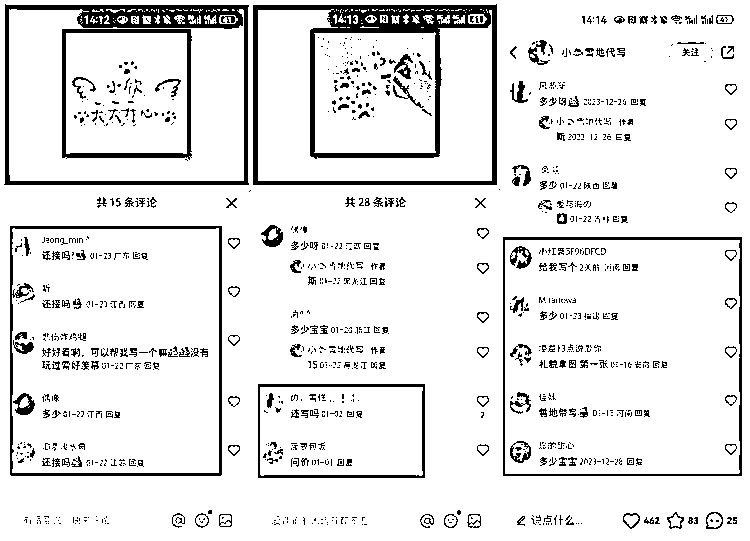

# 如何挖掘并验证风向标“雪地代写”？

> 原文：[`www.yuque.com/for_lazy/thfiu8/vy2szp6kpr3cvt0n`](https://www.yuque.com/for_lazy/thfiu8/vy2szp6kpr3cvt0n)

## (34 赞)如何挖掘并验证风向标“雪地代写”？

作者： 希平

日期：2024-02-04

如何挖掘并验证风向标“雪地代写”？
在生财的九个月，我写过几百个风向标，不少被亦仁设为中标，幸运的话，一天还能中 3 个。
随
但对于风向标，不管是我写的，还是他人写的，我都没有实践到项目中，也就是没有赚过一分钱。
因此，怎么靠风向标赚到钱，成为我一直想要搞懂的点。
一周前，我偶然间发现生财航海有实战活动「挖掘风向标」，里面的文档资料，让我惊呼找到家了。
于是我立马拜读，并且按照里面的作业，一步步去做，首先是写风向标，其次是验证风向标。
在写了 20 条风向标后，我终于完成验证风向标的步骤，而项目，正是本文要讲的：雪地代写。

目录：
一、怎么发现需求？
二、怎么调研市场？
三、怎么验证需求？

为给你更好的阅读体验，请移步语雀：[`www.yuque.com/maoxiaodd/operation/bgwt5fx2c54dwii6`](https://www.yuque.com/maoxiaodd/operation/bgwt5fx2c54dwii6)

* * *

评论区：

苏二 : 这也可以啊
希平 : 我当时也没想到的[偷笑][偷笑][偷笑]
苏二 : 哈哈，后悔没早点看到，河南已经下了六天大学，感觉错过好多，尝试一下
希平 : 现在也不晚[偷笑][偷笑][偷笑]
歧黄之后 : 看到了一个免费的代写引流，后续变现其他，也是很不错
Bryant : [玫瑰][玫瑰][玫瑰]
芮 rui : 我 12 月月底就注意到雪地代写，就是没有想起来还可以做中间商有人买了去多多下单，想到了第一层没有想到第二层。你这个思维，厉害厉害
希平 : 嘿嘿嘿

* * *