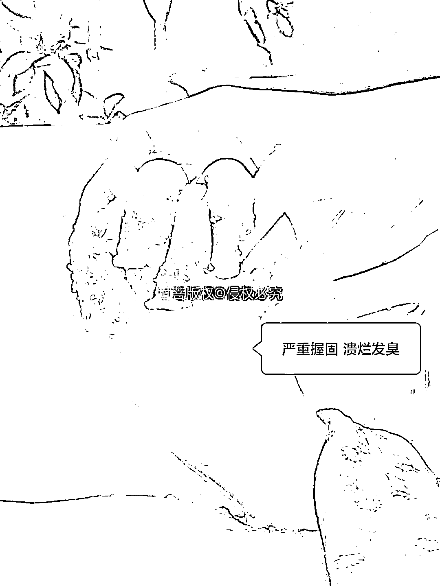
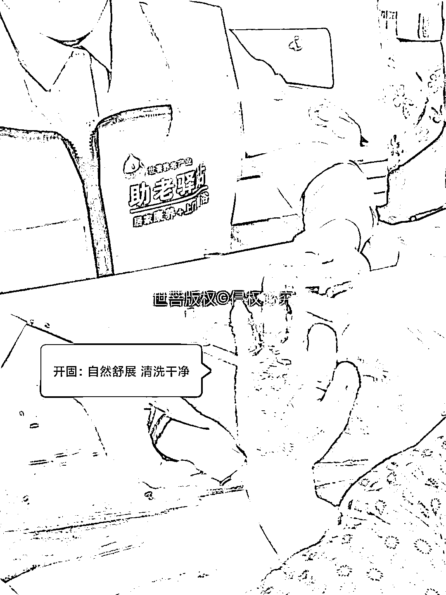
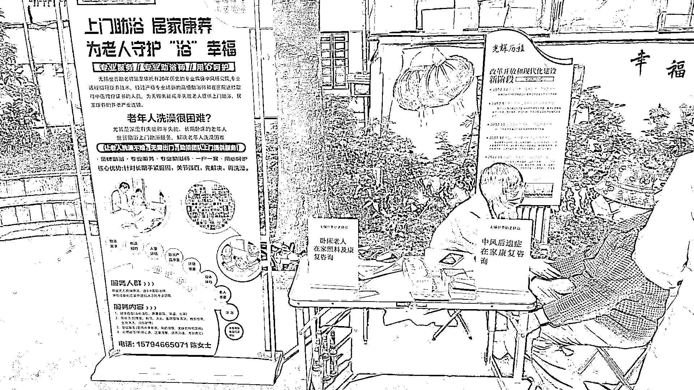
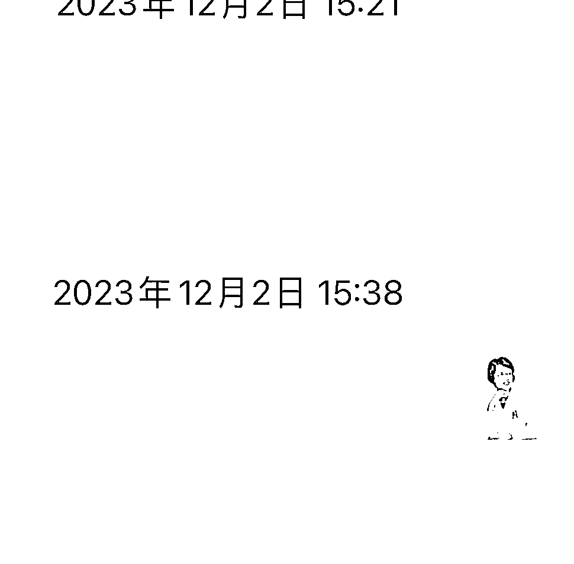
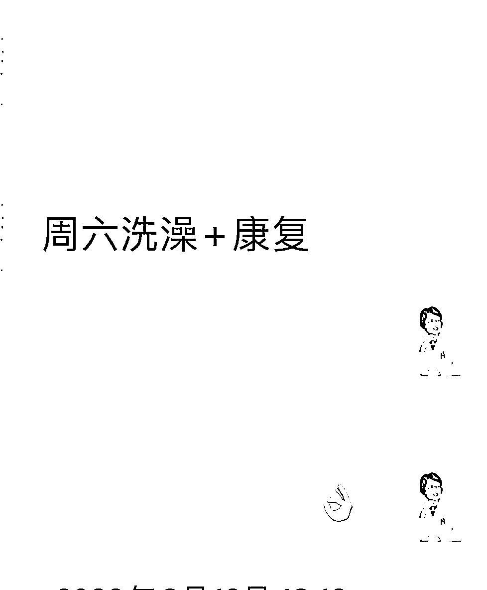

# 上门给老人洗澡，都是怎么赚钱的？

> 原文：[`www.yuque.com/for_lazy/thfiu8/dgv6knwqnn5qg22d`](https://www.yuque.com/for_lazy/thfiu8/dgv6knwqnn5qg22d)

## (29 赞)上门给老人洗澡，都是怎么赚钱的？

作者： 王彩诗

日期：2024-02-06

上门给老人洗澡，是门好生意吗？

人口老龄化加剧，无法自理的老人越来越多，吃饭、睡觉、上厕所，都成问题。其中洗澡是痛中之痛，解决问题的人少之又少，这也是我入局的原因之一。

先说一下变现情况，一单助浴费用为 400 块，包月的话是 6000，聘请了一支 3 人小团队，除去人工费等成本，我自己的利润一个月差不多 1w 块。

当然，助浴只是我们前期服务，解决的是刚需问题，针对老人的健康及心理问题，有后续的康养和安宁疗护作为利润点的延伸。

我们的客户主要来自社区推广，每天约有 4-5 个人咨询，2-3 人可转化为顾客，40%的客户会后续做康养或者安宁疗护。通常情况下，做透一个社区，养活一个团队，基本没问题。

这本身是一个带有公益性质的项目，也没有想象中的那么简单。今天我也会从行业形势、用户来源、团队配置和服务流程等方面，给大家做一个简单的科普。如果你想亲自下场，也可以按照我给的方法进行尝试。

你好，我是王明霞，一名在医养集团任职的临床医生，现今社会，养老话题是一个热门话题，中国正在老龄化中。

在银发经济中，今天我们主要围绕失能老年人居家养老中助浴问题展开一些分享，并针对失能老人居家养老中的上门助浴服务项目的进行可行性分析和讨论。

主要是对助浴行业的优势和可做之处、用户来源、团队配置和服务流程等方面的讨论做一些我们曾经做过的事情的一个简单的分享。

老年人居家养老是当前社会面临的重要问题之一。随着人口老龄化的加剧，老年人居家生活的质量成为社会关注的焦点，除了去专业养老机构养老的，选择在家护理的也占有一定比例，失能老人居家养老存在各项挑战，包括但不限于以下几个方面：

**1、日常生活照料：**老年人在日常生活中可能会面临穿衣、吃饭、如厕、上下床、室内活动、洗澡六项日常自理活动等方面的困难，特别是老人在半失能及失能后在洗浴、如厕、进食等都需要有人进行照料和帮助。

其中最困扰老人和家属的便是洗澡。

**2、安全隐患：**老年人可能因为行动不便或生理上的原因，容易发生摔倒、烫伤等意外，失能后如果家属给予淋浴，老人坐不稳；

浴缸泡浴，老人进浴缸是难题，即使进去了，在洗浴的过程中，满身泡沫时易滑进浴缸底部引起不良后果，所以需要有人进行特殊关怀与照料。

**3.、孤独与心理健康：**老年人在家中可能会感到孤独和无助，缺乏陪伴和心理关怀，需要有人进行陪伴和心理支持。

我可以列举很多例子来说明这个市场的前景，但话不多说，因为我们自带助浴工具提供上门服务是一项有益的服务项目，能够帮助满足失能半失能老年人日常生活的需求，同时给老人带去有尊严的晚年。同时也为创业者提供了商机。

以下是对老人上门助浴服务项目可行性的分析及讨论。

## 一、我们所在的助浴行业为什么能做起来？

主要有以下原因：

**1、差异化定位：**

目前上门助浴既是一个新型的行业，又是一个不少家政服务员已经参与的行业，行业服务还没有形成标准化，国家也没出台相关政策及标准。

而我们选择的助浴团队和目前市场上绝大多数的家政行业所做的上门助浴有有个很多的区别就是，我们是通过医护团队的医生现场或远程评估，筛选出适合并需要助浴服务的老人，接下一般家政行业无法助浴或者助浴困难的老人。

在助浴过程中，遇到比如握固（就是手掌紧紧握住不能打开）及肩关节、髋关节、膝关节挛缩（缩成一团不能打开的情况）这样的老人，我们有技术壁垒保障，先用开固技术，让老人全身放松，展开，然后助浴。这种差异化的定位能够确保服务的针对性和有效性，提高用户满意度。

针对浴缸易滑倒的情况，我们有依据人体结构及力学的专利支撑产品完美的解决这一难题，让老人非常舒服的完成清洁过程。 如下图：握固严重的老人无法完成清洗：

舒张开以后，容易清洗：

**2.、精准定价：**

对有疾病和皮肤病比较严重的老人，提前沟通，利用医护团队的优势解决问题之后再上门，确保服务质量和安全，因为有医护团队保驾护航，因此收费比家政服务公司高，那就主要面向高端家庭提供服务。

**精准定价有助于提高服务的品质和形象，吸引更多有需求的高端客户。**

**3、利润点：**

助浴服务作为前期服务，先解决刚需问题，针对老人的健康及心理问题，有后续的康养和安宁疗护作为利润点的延伸，提高服务价值，增加项目的盈利空间。

我们接的助浴客户有个 105 岁的老人，因为老人发生脑梗，卧床不起，家人从网上找到我们后，我们给老人助浴的时候就带着安宁疗护的人员一起去，助浴完成后，当场就给他子女沟通，说：你看你家老人这么高寿，我们有高龄老人特别的赠送，让您生病的老人的痛苦一天天减少，那就是我们的老年安宁芳香疗法；

家属很愉快快的答应，毕竟这么高龄，安宁疗护迟早要介入，可能很多人都没接触过，那我们就换种说法，叫“芳香疗法”安宁疗护不是我们自己团队在做，但也是我们利润的一部分。

## 二、用户来源

老人上门助浴服务的用户来源主要包括以下几个方面：

**1、传统推广：**

我们通过加入本地社交群、社区的团购团，在这些社区群里和群主提前沟通征求群主同意后然后以社区养老义工的身份在里面分享一些有关老人在家养老的常用的护理专业知识，特别会提到如何清洁及洗澡问题，在群里有互动的人基本上是在护理老人上遇到问题，加微信私聊的人很精准

另外社区居家养老的一起做社区义诊，这是我们做的最多的，也是最受老人欢迎和信任的一种方式，我们在社区老人活动的场所放易拉宝 ，放一张桌子就可以，然后写上免费为不能自理老人上门做健康检测。

那么来咨询的就已经过滤了是家有卧床老人，我们在给来咨询的健康的老人或者家属测血压的同时散发助浴传单的简单方式进行推广。

一般社区的人对于这种推广接受度很高，而这种推广没有任何技术含量，就是拿个电子血压记给来往的人量个血压，顺便把宣传单发给他，直接讲我们是做失能老人上门助浴，家中或邻居或周围有没有需要帮助的老人，告诉我们。

我们在一个社区做透，1-2 个社区养活一个团队没问题。

初期客户都是通过这一方式获得的，一般来咨询的都是家中有卧床老人，我们的传单写的非常清楚，针对人群及收费，所以要不就不咨询，咨询就基本买单，这些都属于野蛮推广，无任何技巧。

我们的第一个客户：老杨，男 61 岁，车祸后脑出血至左侧肢体偏瘫，生活不能自理，右手能吃饭，语言功能没有障碍，但不能站立及行走，坐的时间也不能太长，他妻子照顾他两年，每次洗澡要女婿一起帮忙，好几次因为坐不稳滑到在卫生间，近半年干脆就不再在家洗了，只是做做擦洗。

他的女儿看见我们的宣传单，就打电话给她妈妈，我们上面助浴时，这位老人的妻子说，“终于解决我的难题了，我是洗一次，恨一次，哭一次”，第一次躺在我们的浴缸里泡澡的时候，老人说“舒服、真舒服，半年多了，没有洗过一个干净的澡”后来这位客户每月都要上门 1-2 次，并且还给他做了上门康复指导，对康复指导结果也非常满意。

线下推广和天气有很大关系，最近天冷，南方冬天给老人洗澡的少，来我们咨询的人较少，我们也就不做线下推广了。

**2、我们也做一些线上渠道推广：**

随着互联网的普及，线上渠道成为获取客户的一种手段，因为给老人买单的都是他们年轻一代的子女，他们更倾向于通过互联网获取信息和服务，我们小红书和抖音都只做了一个账号，视频和文章不是很多，在抖音、小红书、公众号等互联网平台发的都是一些助浴的场景小视频。

这些都是抄作业，视频做个简单的搬运和混剪就行；小视频的制作 15-30 秒就行，目前咨询的也不多，但咨询的买单率较高，一般达到 50% 。

我们的第一个线上引流来的是一个 95 岁的住院老人，她女儿看见大上海有上门助浴，抱着试试看的心态搜索了一下小红书，就搜到我们了，我们在征得医院里面的人员同意的情况下，把助浴浴缸搬到病房，给老人泡了一个舒舒服服的热水澡。

**3、私域成交：**

通过私域流量的有效管理和转化提高成交量。私域流量的管理和转化对于提高客户的复购率和忠诚度至关重要，目前我们私域主要是复购比较多，陌生转化的少，私域做的都是属于后续和延伸服务。

依托医院下的一个 3 人助浴团队，线下推广每天约有 4-5 个人咨询，2-3 人可转化为顾客，40%的客户会后续做康养或者安宁疗护。签约安宁疗护的一般都是 90 岁以上的，疾病晚期的老人为主。

## 三、团队配置

老人上门助浴服务项目的团队配置需要合理安排，包括以下几个方面：

**1、人员配置：**

一个助浴团队 3 人，包括一个男性和两名女性。性别搭配的合理性有助于老年人的接受和信任，男性给男性老人的清洗个人隐私部位，同时负责上门设备安装，水温控制等事项，

一名在专业知识上稍微懂一点的做开固技术和解答家属提出的基本健康知识，为后面康养买单信息搜集，一名沟通能力稍强一点的前期沟通，以及助浴过程中和老人沟通，让老人在整个助浴过程中接受度和满意度不断提高，医护人员一般做远程指导就行，没有条件不一定非要在场，如果有医护人员配置，当然第一次能到场最好。

## 四、服务流程

老人上门助浴服务的服务流程一般包括以下几个环节：掌握好以下服务流程，即时没有接受专业的助浴培训，针对一般性的老人助浴基本上都可以完成助浴过程。

**1、评估：**对老年人进行现场或远程评估，确定老人是否适合接受助浴服务，评估过程中包括但不限于：老人是什么原因引起的失能，既往是否有心脏病、高血压等慢性疾病，检查老人是否有皮肤病，有没有鼻饲管、尿管、气管插管。

一般来说，有高血压及心脏病的老人压特别注意，尽量远程跟医生视频沟通一下，这样家属也会觉得这个团队很专业，与其他不一样，有严重皮肤病的老人尽量不洗，带各种管子的老人也要跟医生沟通后决定，根据不同的情况来评估。

评估结束签约免责书，因老人自身原因或者不可抗拒原因引起的老人意外免责书一定要签，保护好自己和团队，减少不必要的麻烦。

**2、预约：**客户预约助浴服务，团队安排合适的时间和人员进行服务。指导家属配合助浴事项，比如家中热水器容量是否满足助浴所需要的水量，家中的室内温度是否能达到助浴的要求。

如果没有，提前烧好热水储备好备用，提前把家中空调调好适宜的温度之内。出发前 1 小时再次确定，家属是否热水及室内温度是否到位。

**3、上门服务：**团队按照预约的时间上门，快到前 10 分钟确定马上到客户家，为老年人提供专业的助浴服务，在助浴过程中，需要开固的开固后助浴，其中包含理发，剪指甲等不再额外收费等。

**4、跟进：**服务结束后，团队可以进行客户满意度调查和跟进，以确保服务质量和客户满意度 后续康养和安宁疗护的意向。

我们在这个过程中，一天大约服务 3-4 次服务次数，老人在温度高的时候一周一次，天冷半月到 1 个月一次，基本上包括 2 次助浴，1-2 次的康养，每次助浴时间 1.5 小时 -2 小时之间，每次康养时间 40 分钟 -1 小时，除去路上时间，一天基本上只能安排 2 次助浴，2 次康养。

因为是上门助浴：除了前期购买助浴设备，学习助浴专业知识所需费用外，上门助浴中所花费较少，因为热水是老人家的，电是老人家的，有时候毛巾沐浴也是自己家的，几乎没有消耗品，所以利润比较高。

我们的收费及利润分成：每次收费３９８元，４楼以上及５公里以上另外加收３０元。

没有成为合伙人的，每次上门助浴一次拿纯手工费，我们请的兼职人员，一次助浴或上门康养给 60 元手工费，一起投资的按照去除手工费后按约定比率分成，一般来说，投资者全程不参与助浴服务的话，398-60*3=218-（来回车油费）-损耗=150 元左右。

康养：收费 6000 元/（15 次康养+送 2 次助浴 ）-手工费（15*60+60*3*2）-损耗 100 左右=4640

我目前所做的团队不是每天排满的，一个月利润收入在 10000 左右，作为我一边上班，一边远程指导偶尔也参与助浴过程来说，目前能做到这一步，我个人认为这个项目属于被我跑通了，我的计划是明年再扩充 2-3 个团队，多做几个社区，及抖音小红书自媒体宣传加强。

补充：老人助浴这个项目的可行性及一些注意事项前面基本就是这些，如果想自己下场尝试一下，可以参考一下步骤一步步执行：

**1、思想准备：**

做好前期思想建设，也要做好长期和老人打交道的心理建设。找的合作伙伴或者员工需要直接自己动手干，就要有不怕脏不怕累的心理建设，毕竟干的是给老人做清洁的活，打交道的都是老人，不可避免遇到老人味特别大大的，家人没给老人清洁到的部位特别脏。

**2、资金准备 ：**

购买助浴工具包，可以选项加盟一个养老项目，也可以选择加盟单纯助浴项目；加盟需要注意的是不要入坑，市面上加盟费 3-20w 加盟费都有。

如果单纯助浴的话，也可以自己去选择充气浴缸或者拼接式浴缸，要买那种全套式，一般老人用品店有卖，网上搜索一下也可以参考，当然最好还是让同行的咨询一下，把把关，不然不知道哪种最好用，一般助浴工具 1w-2w 基本就可以了。

**3、人员准备：**

人员要做一些基本的护理培训，给老人洗澡，看起来是个没技术含量的活，但在助浴的过程中，会有一些意外发生，如果没做培训，失能老人的转运都无法完成。

所以基本的培训示必要的，比如我们团队与众不同的开固技术，那就需要专门人员参与培训掌握。助浴师证书，不是全国统一考试的，而是每个城市，每个省份自己颁发的，在护理培训学校或者一些医疗机构培训都有助浴师证颁发，助浴需不需要持证上岗，目前没有明确规定。前面已经说过，一个助浴团队 3 个人配置就行。

如果上门给老人擦拭，一个人即可完成。

**4、助浴过程中，需要特别注意的是，就是老人安全第一，安全第一，安全第一；**

上门助浴一定要签好免责书。其余的就是老人和家属的满意度为重要。

还有老人的隐私保护要做好，一般来说，只要把浴巾盖在老人身上就行，在助浴的过程中，注意温度控制，水温 38℃左右，第一遍泡浴，20-30 分钟后淋浴一遍就可以结束整个助浴过程，助浴的具体操作需要专业的培训后才能进行，这是另外一个话题。

**5、助浴后跟进及服务：**

助浴后的跟进就是满意度调查，为下一次买单做好铺垫，一般来说，够买一次性服务的比较少，除非特别不满意。还有，如果有资质配置齐全有理疗推拿师的，可以做后期的按摩康复指导，没有资质的助浴服务就此结束。

**我们的经验是：**完全单纯助浴项目，既累、时间花费也长，最终利润也不大，在这个基础上一定要做后续的项目跟进。

**个人经验是：**

一是要服务做到专业，在每次助浴的过程中，跟家属及老人左充分的沟通后了解他们的需求后，给到他们在家庭护理中的不足点的补充指导，比如卧床老人一定要 2 小时翻身一次，每次翻身时扣扣背，扣背的动作和要领及掌握的轻中度当场教会家属。

二是要做好充分的前期客户例证的准备，把这些例证做好视频或者照片保持在文件夹中，随时把改善的例子给他们看，也就是展示出我的专业在这，我的例子也在这，你的痛苦也在这里，后续成交就顺其自然。

后续康养成交就需要和一些专业的人员和机构合作，有专业机构托底，自己从零开始学习不太现实。同时也要注意的是因为助浴师不是医生，不是康复师。

因为资质原因，所以沟通过程中只是沟通做身体放松，改善身体长期紧张所致的血气循环不畅的情况，做一个被动的在家锻炼。

**总之：**上面助浴是一个新兴的可行的行业，抢占了这个市场，后续有关在家养老的失能半失能老人的相关产业和产品都可以慢慢嫁接进来。以上的一些分享是我们平时做新员工培训时的一些相关资料，希望你阅读到处此能有所收获。欢迎多多交流。

* * *

评论区：

郭少飞-日拱一卒 : 遍地是生意[捂脸]

* * *