# 保险行业如何用差异化提高复购率和转介绍 30%

> 原文：[`www.yuque.com/for_lazy/thfiu8/az8dkv10io09rlrq`](https://www.yuque.com/for_lazy/thfiu8/az8dkv10io09rlrq)

## (18 赞)保险行业如何用差异化提高复购率和转介绍 30%

作者： 雨欣

日期：2024-02-06

大家好，我是雨欣，一个从编制内语文老师辞职专业做金融的理想主义。

辞职前因为自己月光，本着自学自用的目的，考了不少金融相关的证书，FAP 家庭资产高级规划师，国内的 CHFP 和国外的 AFP，都是金融理财师，还有 FWP 家族财富规划师，RPP 注册养老规划师。

虽然朋友圈只有 300 好友，做保险第一年，转介绍和复购率累计超过 30%，我前 3 个月就实现跟编制内收入一样了。

由于之前自己的被动收入成绩还算不错，做到了单个收益 90%，家庭年化 10%，我第二年把基金、股票、可转债、海外资产等各种金融工具纳入我的理财规划模型，开始做财商相关的理财陪跑，手把手带。理财课程的拉新群，群里只有 130 人，成交的有 66 人，转化率 50.7%，再加上我依旧保持极高的复购率和转介绍率，接下来我的年收入都是每年翻倍增长。

因为之前的工作是编制内的老师，加上是 i 人（内向型），所以认识的朋友非常少，只有单位同事和学生家长，还有一些学习群认识的朋友，而且以前认识的朋友要么是毫无知识付费意识的用户，要么是非常 peace，对搞钱欲望没有那么强的朋友

所以我辞职做保险经纪人，再到做理财规划，搭建团队，再到做财商的知识付费，这一路走来从 0 到 1，有很大程度上就是靠转介绍和极高的复购率。

我每年年终复盘我的增长的原因，在客户这一块，我是真的比一般人走得更快，有很大程度上是那些信任我的朋友贡献给我的。

所以其实经营客户也是一门非常大的学问。如果你做好了，也可以大幅提高自己的转介绍或者复购率。

在正式讲复购和转介绍之前，先来讲一下我们需要意识到复购和转介绍是能直接提高我们的收入的。

我们的年收入可以用这个公式来算，业绩=流量*转化率*客单价*复购/转介绍。

流量，转化率以及客单价的重要性我们都知道，但是在复购和转介绍这一点，很少会有人说。其实复购转介绍做好了，加上足够的流量，就是一种杠杆，直接放大我们的势能。

那我把我极高的转介绍和复购率提炼出 4 个必要因素，分享给大家：

一、朋友圈差异化

二、交流差异化

三、服务差异化

四、产品差异化

## 一、**朋友圈差异化**

其实我在第一年只做保险经纪人的时候，复盘那一年的用户画像，就发现了一个很大的特点，我特别容易吸引有某些特质的人，比如爱好学习爱好钻研的人，比如内心很温暖很阳光的人，或者认可知识付费认可财务规划重要性的伙伴，非常努力的伙伴，等等。

那我到底朋友圈是怎么发的呢？

主要分成两类：1.个人形象，主要呈现自己的价值观，自己做事情的态度。2.对保险的科普。

其实很多保险行业的代理人也好，经纪人也好，很容易出现一种情况就是，只发产品，一天发几条几十条，这种大概率是会直接被屏蔽的。比如说这种，虽然我认为泰康确实养老院做的不错，但是我直接把这位屏蔽了，因为她朋友圈很无聊。

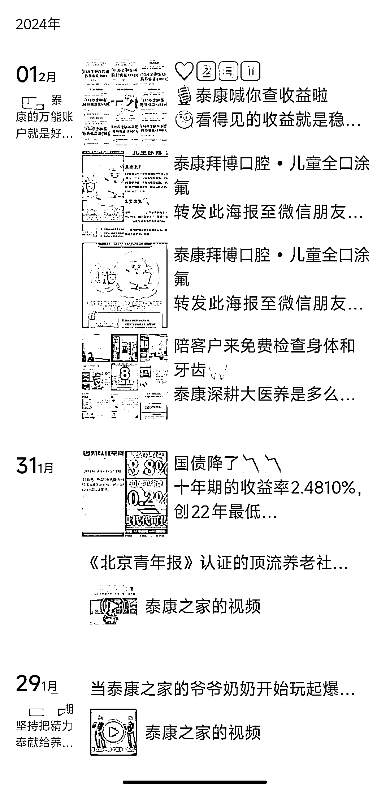

鉴于我自己就是不喜欢看广告的人，所以我也不喜欢把自己的朋友圈做成广告。我经过不断地朋友圈，测试，总结，开始形成了自己的一套方法论。

首先，发圈原则有 4 个：

##### 1.**说人话，接地气。**

我非常喜欢用比喻，比如我要科普重疾险的缴费规则，我是这样用比喻来科普的，重疾险的缴费就好像买房子，有些人有钱，直接一次性首付付清了。有些人没钱，可能用 10 年，或者 20 年，甚至 30 年去付房款。

那时间越长，利息就越高，交的总金额就越多。

但是重疾险只要在开始付的那一天，归属权就有了，就终身有效。

那要是有什么情况，就是 6-9 倍杠杆赔付。

那要是你平平安安的，没有理赔，就可以像卖房子一样，退了这个保单，也是钱全部取出来还要多。

我这个比喻，就把重疾险的很多复杂概念之间讲清楚了，什么现金价值，缴费规则，等等，当时那条朋友圈还有朋友跟我说，本来以为重疾险是钱白白交出去的，没想原来是跟房子一样属于是资产。

##### 2.**发真正能打动客户的内容。**

对于哪些点能打动人，我也做了个总结：

（1）客户关心的硬干货

比如理赔相关的信息，比如储蓄型的保险怎么做到资产隔离，把钱指定给想给的人

（2）引起特定类型客户角色共鸣的软信息

比如，自己家里老人生病躺在病床上每个月花掉 1 万多，我的感慨

比如年轻的职场女性有丁克的打算，对未来的规划

（3）我自己相关的形象展示/价值观展示

比如我的优秀，我的温暖，我的负责，等等

（4）理想/美好生活的相关内容

自己最近的小确幸，这个比较容易让大家觉得你是个活生生的人

干货这一块，上一条原则我有说，就是说人话。

至于共鸣，形象展示，美好生活这一些，我的经验是真情流露就行。因为我的客户会找我咨询很大程度上是因为她们在认可我这个人。我刚开始做独立保险经纪人的时候，只是因为我想给自己和家人配置保险，我甚至都没有规划过要走这条路，我规划的还是自己的老本行，当个独立教师。

所以我的朋友圈很多时候是非常生活化且真诚的，我分享我是怎么学习雅思的，我遇到过的痛苦和困惑。或者分享我读了什么书，有什么感想。或者分享我的价值观，有很强的女性主义的色彩，不甘于现状，离开老家辞职去开拓我自己的人生版图。

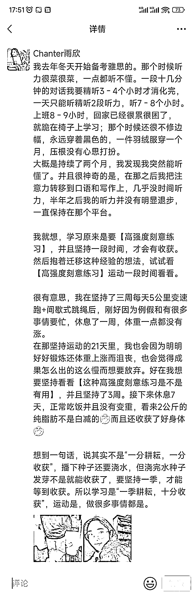

比如这条是我好几年前发的朋友圈，这条朋友圈点赞率极高，那个时候我微信只有 300 个好友，但是点赞有 50 多个。

我讲我备考雅思和【一季耕耘，十分收获】的价值观，当时这条朋友圈发完之后，我的前同事就跟我聊天了，跟我说她也年轻时一直想辞职，对于我辞职这件事非常佩服，之后她也在我这里成交了。

所以我的第一批客户单纯就是被我的这个人吸引的，他们会在我身上看到很多他们也在意的品质。比如我有很多年轻女性客户找我配置保险，她们会跟我说很佩服我，看好我，所以愿意支持我。至于宝妈群体，她们往往会觉得我很真诚。一些男性客户，会说我很专业。甚至我还有遇到过好几个案例，自己做实体的大佬，看了我一段时间的朋友圈，直接找我买保险，我说我们电话沟通讲一下方案细节，对方说不用，就是相信你。

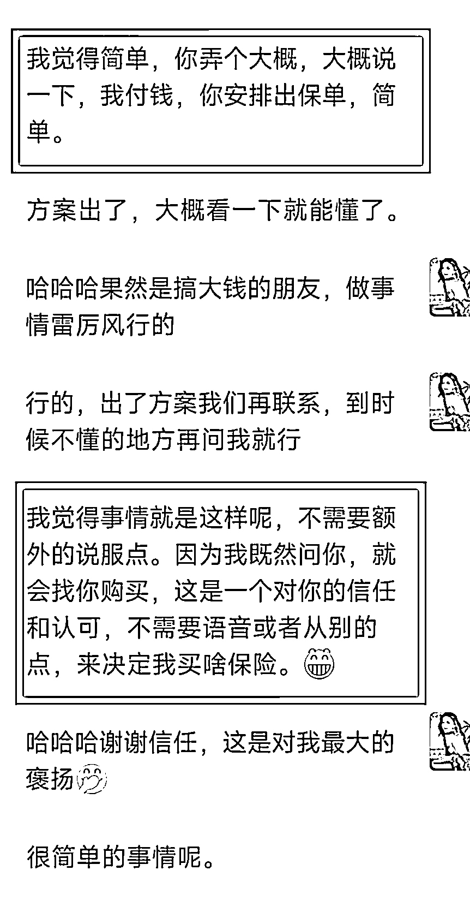

高净值客户咨询我的不少，而且高净值真的非常爽快，比如这一位，加了我好友 3 个月，只在刚加好友的时候聊过，之后毫无交集，但 3 个月后直接问我买保险，看完方案直接成交。其实高净值客户变成高净值之前，也是经历过很多痛苦，挫折，和努力克服重重阻碍的体验的，而他们在看我朋友圈的时候，就是看到了年轻时候的他们，他们认可的不是保险，是我这个人。

所以我其实一开始也因为我是 i 人，脸皮也很薄，不怎么发保险，喜欢发我的生活和价值观，但是我却因为这一点而获利。因为我的朋友圈直接帮我筛选了同频的客户，我们身上是有某些点是非常相似的，也因此互相认可。

而当客户去认可你这个人，感受到你的真实和温度的时候，她们会为你这个人买单。尤其是当你做的这个行业是跟人打交道的行业，包含咨询，或者包含售后之类的相关的业务。

当这个客户除了认可你的产品，同时也认可你这个人的时候，转介绍和复购也就顺其自然了。

##### 3.**一条朋友圈一个主旨，具体、说透才有力量**

我的朋友圈一直都是非常微观的，比如之前我有发储蓄险的朋友圈，我是拆分成很多个维度讲的，每个维度都写一条朋友圈，比如储蓄的保险要看现金价值，现金价值是什么含义，现金价值高一定是最好的吗？哪些人适合现金价值高的产品？

这样的朋友圈客户非常精准，因为我说的很透，当时有一个想要丁克的朋友跟我说，就是看了这条朋友圈，觉得自己就是需要储蓄型的保险的人。

##### **4.营造场景感，以及避免统一的话术，看起来像 AI 发的朋友圈**

统一话术的，基本在我这都是被屏蔽的，比如卖营养补品的一个伙伴

他的朋友圈是这样的画风：xx 玉竹膏真的好，小朋友原来是 xx，现在吃了都不体虚了，配图，这个产品。

或者就是类似的：谁谁谁本来有结节的，吃了 xx 玉竹膏一段时间，结节都消失了。配图，这个人的体检报告。

朋友圈很忌讳没有场景的营销和缺乏细节感受的温暖。

营造场景感=属性+细节+感受

像我之前帮一个朋友卖芒果，我自己尝过觉得很好吃，我这样说的，最近不是挺热的嘛，夏天就想要吃点凉爽的甜食，浇灭自己的燥热。这个芒果我吃过了，核跟纸一样薄，而且还很甜，就是甜到我把它跟原味酸奶一起搅拌，酸味的酸奶都被变甜了，吃起来太满足了

这种方法特别适合日用品、衣物、食品。当然我自己也用在保险上，保险上的细节和感受就是爱了，尤其是理赔发生的时候，还有妈妈给孩子买教育金的时候。

比如有一个妈妈，一直很想给孩子存教育金，但是没有钱，我帮她梳理完整个家庭财务之后，我说，你适合月存的产品，且只能短期存，我说 3 年和 5 年都行，她说，我想给女儿存 5 年。

我就把这个细节写进朋友圈，还有我感受到的这个妈妈的爱也写进朋友圈，把这个事情写的非常温暖，之后这个妈妈也很感谢我，帮她理清楚了自己一直在纠结的事情，还给我转介绍了另外的宝妈。

## 二、**交流差异化**

其实这个时代很多人在互联网也好，在线下也好，跟人交流都是很制式的，刚认识送上一张名片，但是我在跟人交流的时候，会名片之外提供大量的情绪价值。

可能是因为我的原生家庭以及之前当老师的习惯，我一直都很喜欢夸人。所以我也有不少客户是一开始的时候对保险或理财规划没有需求，但是被我夸出来需求了。也有一些是自己有了保险，给我提供转介绍的，之后也出现了给我转介绍做整个家庭财务规划的案例。

我的习惯是，刚加上好友，跟对方很走心地打招呼，我到现在也一直是保持这个习惯，我不是直接丢个名片或发自我介绍给对方，我会跟对方说，你是 xx 行业的呀，你好优秀啊，之类的话。

就是真诚地去发现对方的优点。去夸夸他，如果你不知道怎么夸夸的话，可以搜一下相声是怎么说的，相声里面有一个人专门就是负责捧哏，就是一方说完一句话，另一方说：真的吗？这么厉害/哎哟那后来呢？ 之类的话

但不要僵硬的夸，最好要有细节，看见别人优秀的细节，真诚地赞美，相信我，真诚自有万钧之力。

我的夸人的方法主要是 3 个点，都是我之前学心理学，以及考了中科院认证的心理咨询师证书总结出来的点，非常好用，情绪价值拉满：

1.找细节

2.概括对方表达的观点

3.多样化的语言

##### 1.**找细节**

这一点其实挺难的，我发现绝大多数的人都做不到有细节的夸夸。有一个技巧，就是你去想这个人身上有没有其他人不具备的特质。比如之前有一个宝妈，她发我资料的时候，都是整整齐齐的，按顺序发给我，而且每一份上面专门打字标注了“孕期前的心脏检查”“孕期时的心脏检查”等等。

我就一直夸对方这一点，我说，其他人都没有你这么细心的，发资料还都整理好还都备注上，你在生活中肯定也是一个很细心的人，而且还特别贴心，遇到你这样的客户我实在太开心了。

##### 2.**概括对方表达的观点**

其实这么说是为了让对方觉得你尊重她，而且也能给对方提供情绪价值，心理咨询师常用手段之一。

比如对方巴拉巴拉说了一大堆，我就说一句，哦，所以你的家庭目前情况是因为 xx 原因，资金流动比较紧张，但是又想买保险

对方说，是的是的

然后我就接着夸对方

夸完再引导对方说话

说了再夸再引导，一直这样重复

一步一步引导对方自己梳理清楚自己的需求

##### 3.**多样化的语言**

这个经验是从我当老师的时候学习到的，我会变着法子夸一个人，你好优秀啊，你好棒啊，你怎么做事情这么认真啊，当你的家人也太幸福了吧。

不止一个人跟我说过，非常喜欢跟我聊天。给大家看一个例子，是我以前加的一个好友。

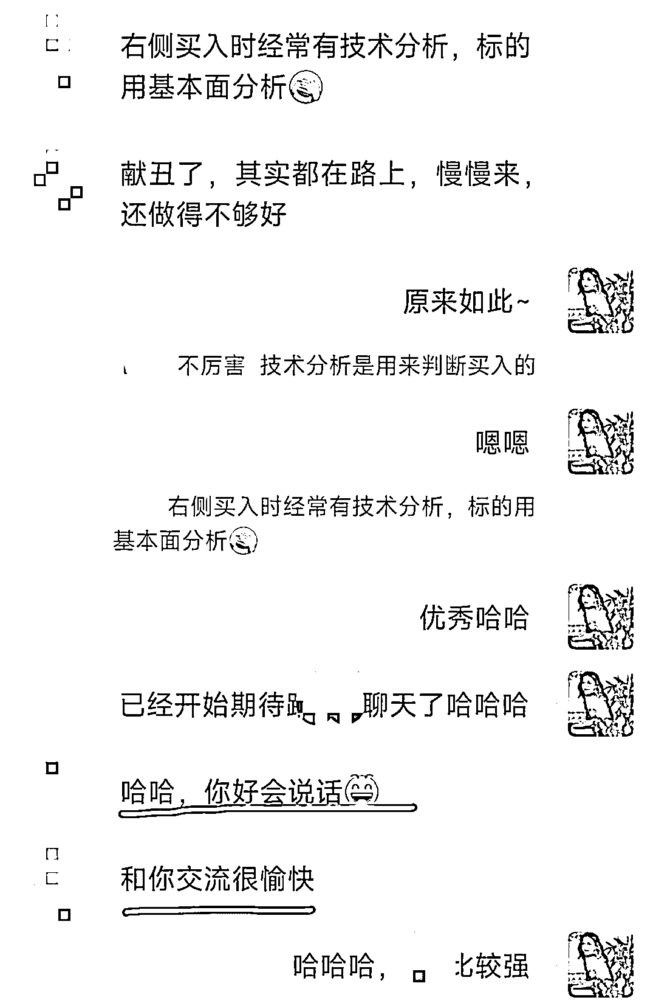

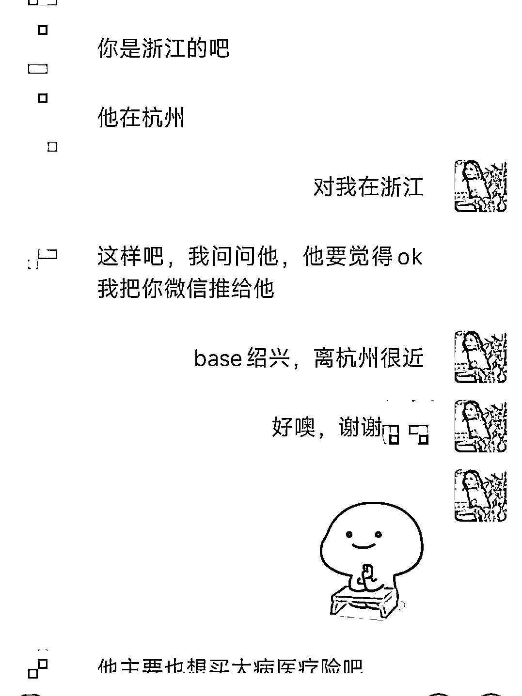

这个伙伴，当时我是加主动加他的好友，真的是没有想过要去成交对方的，只是觉得对方非常优秀，要跟优秀的伙伴多链接。我们一起聊了聊股市里的投资相关的知识，我夸他懂很多我不懂的地方，对方说“你好会说话，和你交流很愉快”

过了两天他就给我转介绍客户了。他自己有保险，同事也都知道他做家庭的全方面配置，所以同事问到他，他就给我转介绍了。而且之后给我源源不断地转介绍了很多客户，简直就是我的转介绍中心

但我不是只实质性地夸对方的，我觉得别人给我转介绍不是义务，我不能把自己当大爷，对转介绍的朋友表达感谢也很重要。

所以我也时不时会给对方送些礼物，我当时成交了他的转介绍客户之后，特意跑去杭州灵隐寺给他买了一个开过光的手串送给他，算是寓意他事业变好，财富稳健增长，对方也感受到了我的用心，之后给我一直转介绍。

对于没有在我这里成交过的客户，也是一样的。比如理财小白，不知道怎么规划财富，我们加上好友聊了几个来回，我都一直在夸对方，一个毫无理财规划意识的朋友就直接在我这里做全方位的规划，这种案例有很多。

## **三、服务差异化**

虽然我会让别人觉得，找雨欣服务我，是体验非常好的，但其实我在复盘的时候，会发现每个人在意服务的点是不一样的。

所以好的服务体验其实是多维度的，我总结了这些点：

1.回消息很快，看到消息马上回

2.自己的领域非常专业，给的建议很实用

3.主动私聊客户，关心对方

4.有仪式感的细节

所有这些你努力做好的服务，都是在给自己积累善意。

##### **1.回消息很快，看到消息马上回**

就拿回消息这件事来举个例子，不要觉得这都拉能高转介绍和复购，这件事在我身上就是真的存在很多案例的，我不少客户都因为我回消息快而选择我，我之后思考这个问题，我在想客户一定是觉得你对他很上心。

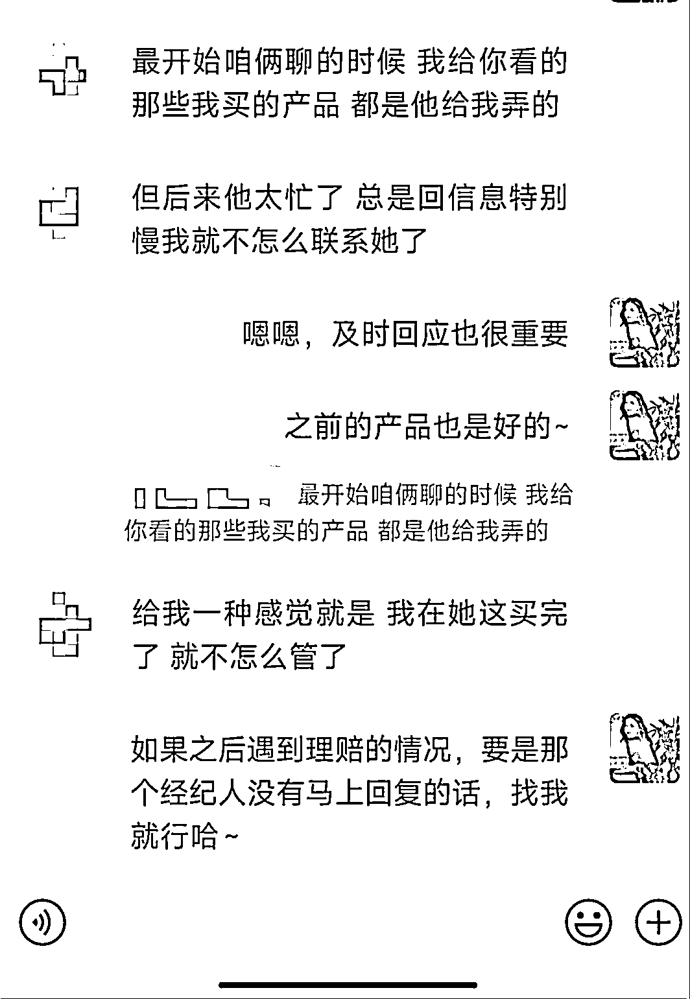

比如有一个客户，之前也是在其他经纪人那里配置的保险，而且跟我是同一个公司的经纪人。也就是说，产品线是一样的，这种情况下，那个客户却把她的保单都告诉我来梳理，并且听我的建议去做整个家庭资产配置。

那个客户说，之前的经纪人成交之后就回消息很慢，感觉体验非常不好。就不愿意跟对方交流了。她表达的看法就是“我在她那买完保险，就不怎么管了”。所以对方其实是对这种态度很不满意的。

##### **2.自己的领域非常专业，给的建议很实用**

对我来说自己的领域专业就是写的方案很好。我非常喜欢用的方式就是对比，但我不会踩别人的方案，我会直接把客户非常关系的某个产品写进 Excel 表格里，我再把自己写的方案写进表格里，直接从各个维度去做对比。客观描述完，客户自己就有判断了。

就拿重疾险来说，别人往往会推一个产品，但我推两个组合产品，价格维度上费率更低，杠杆维度上额度更高，保障维度上又是什么什么，一通讲下来，成交率和转介绍概率都极高。

尤其是遇到对比大公司的客户，拿着某个保司的产品给我看，我做完对比方案，对方会直接成交。之后朋友问起来就直接转介绍给我，说找雨欣就行

##### **3.主动私聊客户，关心对方**

主动私聊客户，关心对方是会让客户感受到温暖的，就是你是把他当朋友相处的那种温暖。比如生日祝福我是每一个客户都会祝福的，之前还遇到客户这样跟我说“老公和老妈还没有跟我说生日快乐，你一直记得，太感动了”

但除了生日祝福，还有关心健康，比如客户发朋友圈说最近甲流感染，我会看到第一时间关心对方，并且让他吃什么什么。如果有理赔相关的，也会跟对方说。

#### **4.有仪式感的细节**

比如我会给客户送礼物，会有很细致的续保提醒。其实送礼也很讲究的，最好是能送到对方心坎里去，比如我送的礼物都是差异化的，我会根据不同的人挑选不同的礼盒包装纸，温柔的女性送粉色的包装纸，开朗的女性送高饱和度的包装纸，过年送喜庆的包装纸。

选择礼物也会因人而异，小宝宝的保单送那个年龄的礼物；成年人的保单，比如经常出差很忙碌的打工人，我就送一个旅行时候会用到的用品。也有很喜欢喝酒，会染绿色头发的年轻女性，我就送一套酒具。其实花在思考送什么上，我就会耗费很多脑细胞，但是每一个礼物我都希望对方是能经常用到的，加上我会花时间挑选品质好又漂亮的包装，对方会直接感受到我的用心。我的转介绍就是这样直接上去的。

另外补充一句，千万不要发红包！钱的情绪价值是比不上礼物的。我觉得关于怎么跟人相处，可以看看《怪诞行为学》这本书，真的写的非常好，让我对人有更多的了解。我也是从这本书中知道，钱的价值反而比不上一份礼物。

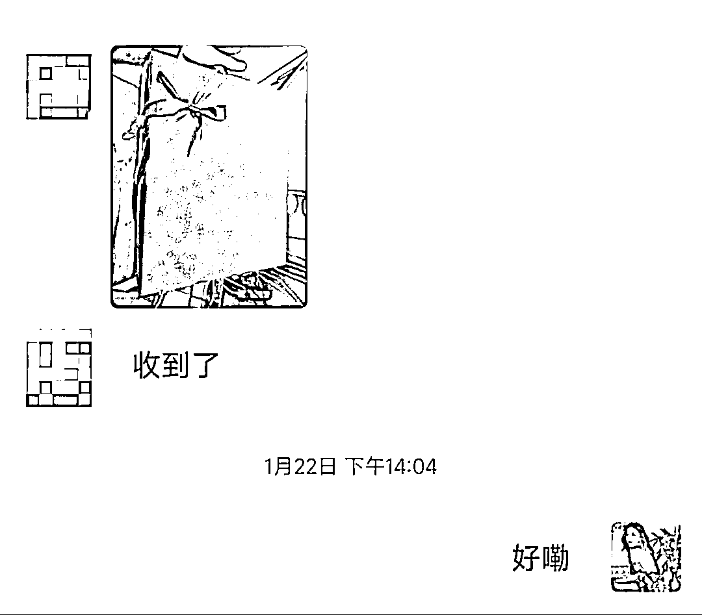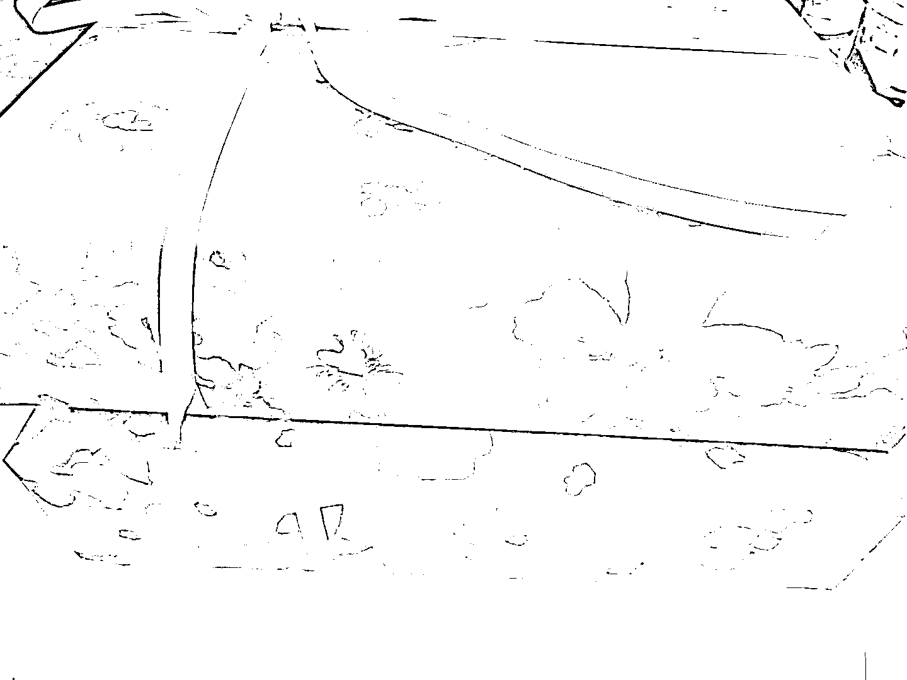

第一张图是我过年前给一个宝爸送出的纸质保单+礼物，第二张显然是女性伙伴。虽然很多时候男性是不太会表达的，我接触下来，女性会直接跟我说，谢谢，发比心之类的表情，但是男性也是能感受到你的温暖的。

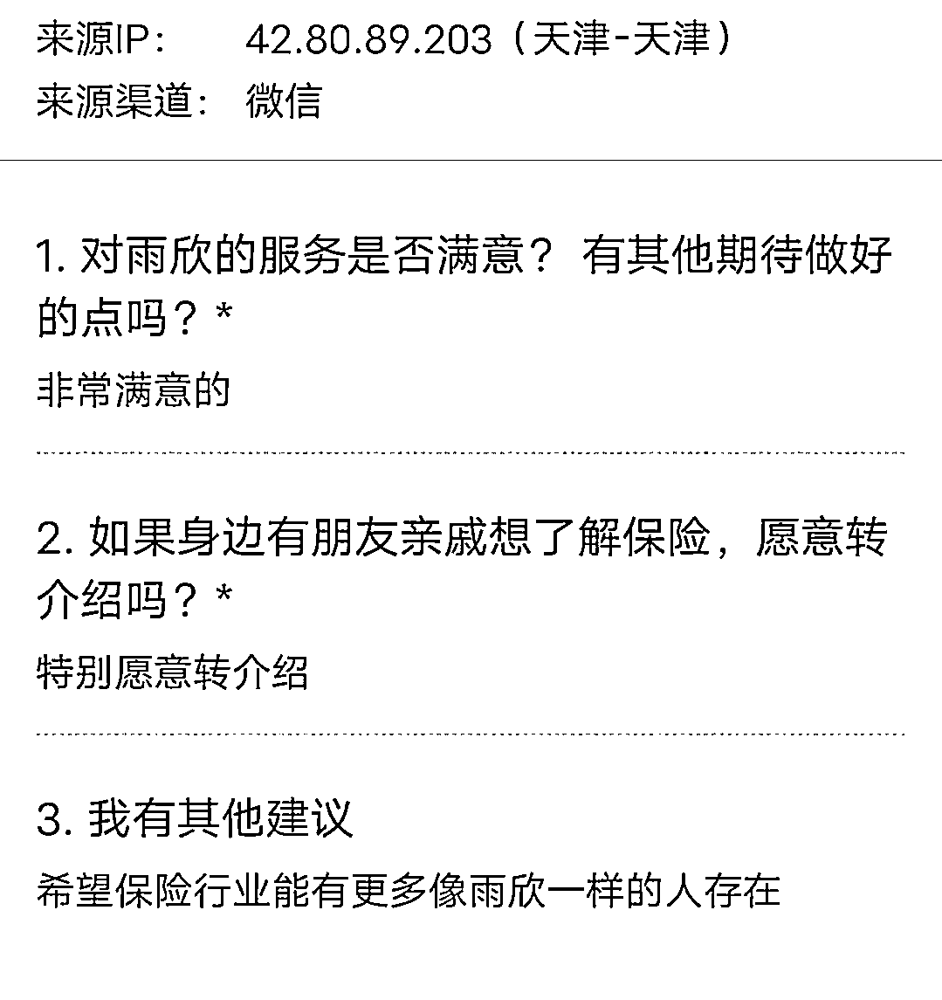

那个宝爸收到保单和礼物之后，我请他做了一个只有 3 道题目的小问卷，这张是问卷的反馈，我还挺惊讶的，在微信上没有跟我表达任何情感，但是问卷里面却说“非常愿意给我转介绍”“希望保险行业能有更多像雨欣一样的人存在”。

当然，也可能是你的某几个点组合打动了客户，比如之前有一个陌生网友加我微信，直接跟我说要配置高端医疗险。慢慢挖掘下去，对方告诉我，她觉得之前聊的经纪人要么回消息很慢，要么感觉不负责，要么觉得不专业。

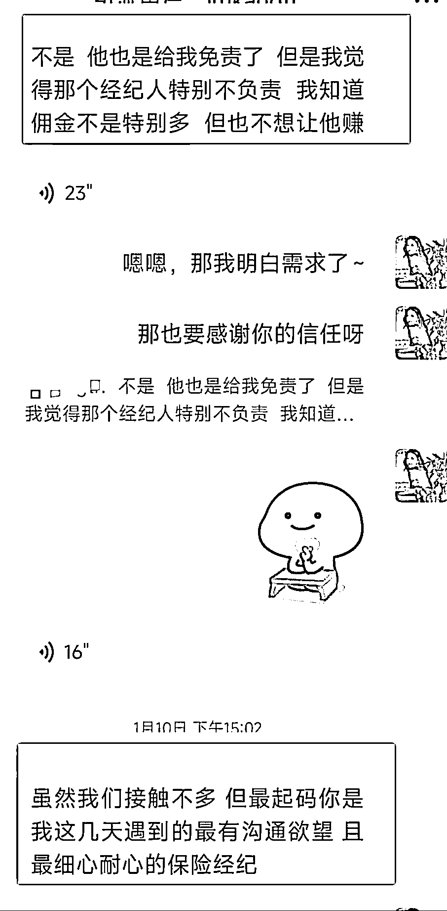

比如这个客户，她的喜好厌恶是直接写在脸上的，她就跟我说，觉得之前那个人不负责，回消息慢，体验感不好，所以也不想自己的钱给那个人赚。所以跟人打交道的行业，很多时候就是成交一个信任和好感。

那这个互联网客户就是看中的我细心，回消息快，专业，负责，各种好的售后服务，在我这里配置完了高端医疗并且理赔了之后，她就又来找我陆陆续续买了产品，后来就直接把家庭财务状况告诉我，让我梳理她的情况，直接给建议。

尤其是做高客单价的伙伴，越是高净值客户越在意服务。服务做好了，复购率和转介绍也就自然会提高了。

刘润老师有说过，温暖，是这个时代最高级的情绪。如果你能做到跟客户接触的时候，客户觉得你很温暖，那你的情绪价值就提供到位了

所以你做的一点一滴温暖客户的事，好的态度也好，好的理赔体验也好，送礼物也好，对方都是会记在心里的。这些积累看起来微不足道，但有一天可能就会汇成一股溪水，源源不断给你提供转介绍客户。

## **四、产品差异化**

虽然说我在很多时候不擅长营销，我更像是一个在后台研究如何优化产品的产品经理。但是有时候也会有获得提升自己带来的优势，这个优势就是，我从只会规划财务，到变成懂基金、股票、全球资产配置，并且搭建了一个自己非常专业的团队。

单纯就是我自己喜欢研究，加上我认可的好的交付就是多提高我自己的能力，所以我的服务也开始慢慢迭代，我可以给一个中产或高净值家庭做全面的财务梳理，给各种金融工具的使用建议方向。

而这种迭代使得我跟其他经纪人比起来有巨大的优势，不仅仅是保险经纪人，跟理财规划师比起来也有更多的优势。因为我直接自己去二级市场实操

因为我也看过市面上各种割韭菜的理财课，都是那种只告诉方法，但不会说自己如何配置家庭财富的，在我看来只说方法不说自己案例的都是割韭菜。所以我自己又研发了一个自己的产品，把我熟悉的金融工具都讲一遍，而且是手把手带实操。

这种手把手带实操的经纪人和理财规划师，生活中可能都找不到，所以我就成了那个行业 0.1%。

其实我的出发点是做一个财商的课程，带着一群朋友跟我变富，而且我也想把我的圈子变优秀，让身边人都是中产资产。其实做这个产品我也是用服务心态去做的，也就是我之前讲的第三点，服务的差异化。因为很清楚，当我带着利他心态，真正做到身边人一起被我带好的时候，客户也愿意认可我的人，愿意复购或者转介绍。

另外想分享有一些很有意思的细节，当你人品和口碑很好的时候，全世界都会帮助你。比如当时我做理财营的时候，我海报做的很丑，但有朋友说，我来帮你做几张个人 IP 的头像，我准备做群内分享的时候，我说我在考虑做个藏宝图的海报能让大家有更好的开营体验，群里的朋友又跟我说，你负责专心做内容就行，这些内容交给她来做。有很多这种温暖的细节，真的全都是我之前全部把心思放在交付上收获的信任和帮助，我跟非常多的客户都是这种关系。

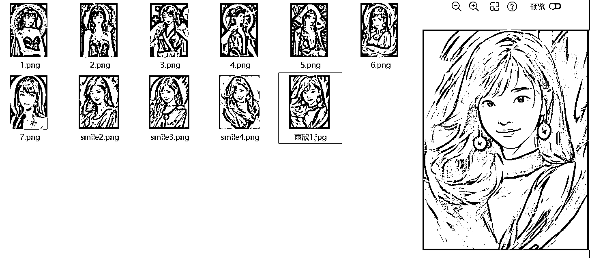

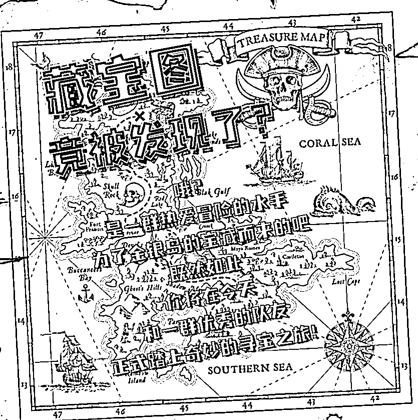

所以我的讲财商和陪跑的产品，不少毫无理财意识的朋友听完我的讲解和实操，本来对保险一无所知，也对保险没用兴趣，甚至准确地说，他们都没有意识到自己是需要保险的，但是在理财的课程中，他们发现自己的家庭财务的问题，意识到自己是需要保险的。

于是客户从买了理财的课又在我这配置了全面的资产，保险，甚至有些客户还有配置了私募之类的，这些都是得益于我搭建的团队，都是金融行业留学归来的硕士博世。

所以对我来说，我的模式从直接推荐保险，变成了一个告诉金融产品怎么用，顺便推荐了保险的模式：

讲家庭理财规划的理念→分别讲各种金融工具，股票、基金、可转债、保人的保险、保财的保险→手把手带实操→客户自己分析自己的家庭财务状况→客户找我配置保险

这个过程，是告诉客户怎么理财，然后客户拿着我给的工具自己分析出来自己需要什么产品，去查漏补缺，自己意识到跟被动成交，这样的转介绍和复购率差异是完全不一样的。

我看了一下理财营的伙伴的复购率和转介绍率，要再高 8%左右。

所以多个优势的叠加，就使得我的个人 IP 成为独一无二的了。而差异化让我都几乎不用怎么卷，别的经纪人只能提供保险，别的理财规划师只能提供思路，但我可以解决一篮子问题，人性都是偷懒的，能找一个人解决全部问题，肯定更喜欢找这个人解决。

当然，还有一点就是赚到钱，资产增长的客户肯定也乐意给我转介绍，我的转介绍率也就上去了。

所以打铁还需自身硬，自己能给客户提供越多有用的价值，客户对你的信任也会更高。这一点放在跟人打交道的行业尤其适用。

最后雨欣也要给大家一份温暖。我自己做了一份资产负债表，这个资产负债表我是只送给理财陪跑营的伙伴的，而且这个表格是雨欣独家，我是全部计算好数据的，你直接填写进去就可以看到自己的家庭资产状况了，非常省心，作为小福利，如果是生财的朋友我会免费送给你。

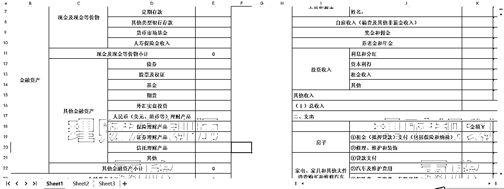

2024 年，希望我们都一起资产稳健增长！

* * *

评论区：

芷蓝 : 很详细的垂直行业解决方案
小明明 : 蹲一个资产负债表
夜未澜 : 蹲一个资产负债表

* * *