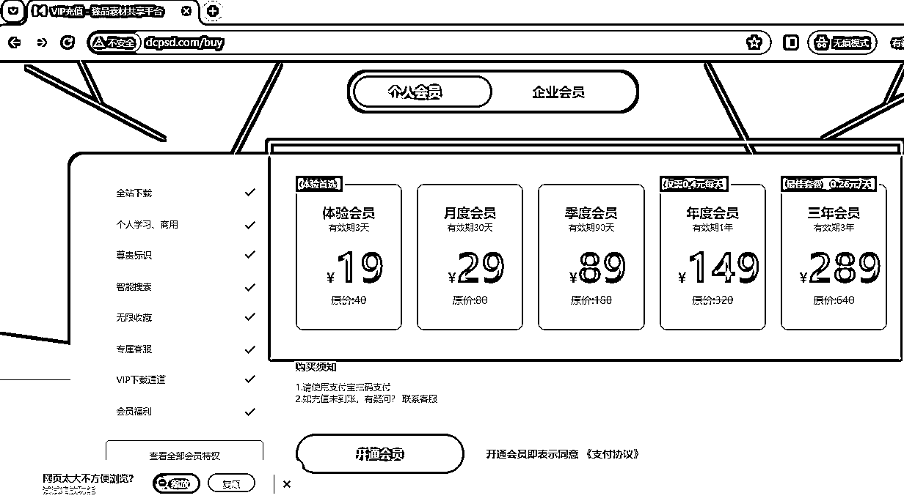

# 靠 Notion 模板年收入 100 万美元，如何通过资料整理进行变现？

> 原文：[`www.yuque.com/for_lazy/thfiu8/rp90ml9e9tr897vf`](https://www.yuque.com/for_lazy/thfiu8/rp90ml9e9tr897vf)

## (5 赞)靠 Notion 模板年收入 100 万美元，如何通过资料整理进行变现？

作者： Susumr

日期：2024-02-04

靠 Notion 模板年收入 100 万美元，如何通过资料整理进行变现？

生财的朋友大家好，我是 Susumr，今天给大家拆解通过 Notion 模版变现百万美金的案例，如何进一步通过整理资料在国内各平台进行变现。

万物皆产品，只要能满足需求，只要能解决对方的问题，皆为产品。

我将从案例剖析、【产品】如何挖掘需求、【流量】如何推广、【利润】定价策略和技巧、以及【如何做】实操路径、【放大】如何做大做强这些步骤带你了解资料变现的路径。

请大家移步飞书查看完整拆解 [`e7m0rt4uzw.feishu.cn/docx/TBaJdDfZfoNDNlx7v6rcVMZynmb`](https://e7m0rt4uzw.feishu.cn/docx/TBaJdDfZfoNDNlx7v6rcVMZynmb)

* * *

评论区：

暂无评论

* * *