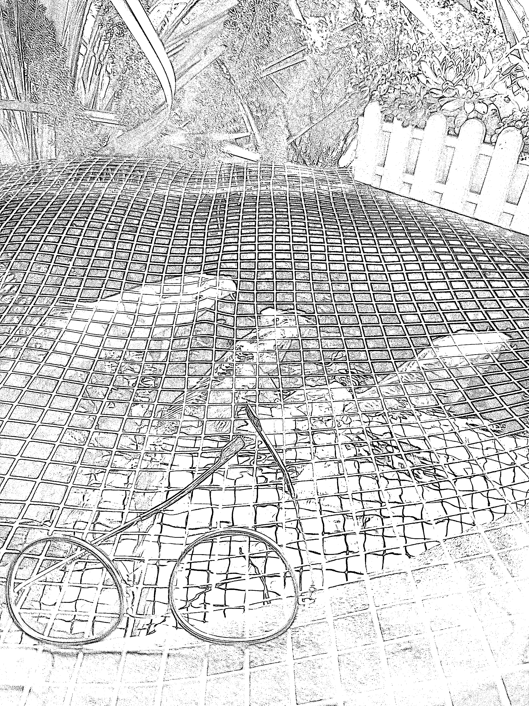

# 自媒体+知识付费，2024 年怎么做？

> 原文：[`www.yuque.com/for_lazy/thfiu8/dm0fbdb76uum13gr`](https://www.yuque.com/for_lazy/thfiu8/dm0fbdb76uum13gr)

## (235 赞)自媒体+知识付费，2024 年怎么做？

作者： 粥左罗

日期：2024-02-24

【粥左罗：自媒体+知识付费，2024 年怎么做？】

没有参考任何人的任何资料，就是复盘自己过去几年、尤其是去年的经历和感受，来讲这个主题，主要包括 6 点：有用记得点个赞🙆‍♂️😘

✅第一点，必须认真搞流量。

这是 2024 年必须要解决的一个问题，如果解决不了，你就凉凉了。

为什么？

我身边做自媒体、做知识付费的很多人，哪怕过去几年做得比较好，赚钱比较多，现在也都遇到了困难。

最大的困难是什么？

很简单，就是流量。

你的公众号粉丝不增长、视频号粉丝不增长、私域粉丝不增长，就先别扯产品怎么运营、交付怎么做、复购怎么样、转化怎么样、IP 怎么样等。

流量是最基本的前提、最本质性的问题，尤其是新流量。

为什么我每天都要直播？

我的公众号有 110 万粉丝，视频号接近 19 万粉丝，私域也有十几万，但这些都是过去的、已经被洗过很多遍的、被消耗得差不多的流量，该买我的课、社群、训练营的人，基本上都买过了。

不要说你现在有多少私域粉丝、公众号粉丝、视频号粉丝，那些从本质上来说，大部分都是已经被你消耗过的流量，我们每天都应该想的是怎么获取新流量。

如果你的新流量增长能翻 3 倍，那其他的很多问题都可以解决了。

很多人今年分销我的产品赚了不少钱，大家觉得粥老师出了一个新产品，去分销赚钱好香，一单单地卖，结果两周之后卖不动了，最根本、最核心问题，就是因为你的现有流量已经消耗完了，再天天发 5 条、10 条朋友圈也还是那样。

如果你现在觉得发公众号转化不动了，发朋友圈转化不动了，就不要继续天天发更多公众号和朋友圈了，发再多也没有用，因为该买的都已经买了。

你应该抽出时间精力，去做新流量。

2024 年必须要认真搞流量，流量是变现的前提。

每个人都可以扪心自问一下，你今年花在新流量上的时间有多少？付出的精力有多少？

大部分人都没有在这件事上真正花很多时间和精力，很多人都是出一个新产品做转化，再出一个新产品做转化，而转化就是天天发朋友圈、拉社群做群发售，一遍一遍地卷。

这种情况下，你再卷意义都不大，因为流量是固定的。

我们平时刷抖音看到一些大博主，像海参哥、大蓝、李一舟，他们都会花很多时间和精力做新流量，每天卷直播、卷短视频，这就是他们做得厉害、我们做得差的原因，一对比就知道问题出在哪。

所以，你从今天起就要想想，2024 年怎么搞新流量，不要守着自己那点人做一万遍转化，没有新流量你再怎么转化也没有用。

流量，无非是公域流量、私域流量和精准客户。

公域流量一定要去尝试，像我天天做直播就是在做公域流量，只要持续做公域流量，就会持续有新流量。

相对来说，我做私域花的时间不多，确实是忙不过来，干脆相对放弃，天天卷直播。

认真搞流量这里，有一个重点叫「精准客户」，我们搞流量应该尽量多搞精准客户。

比如我们的 5 天写作特训营，我每天直播都在卖这个产品，可能没有特别大的流量，但 5 天写作特训营的精准客户，每个月可以获得 1000 个左右。

这种情况下我现在虽然涨粉不多，但本质上我也不需要涨那么多粉，因为我增长的都是精准用户。

当然，如果我走另外一条路，做大爆款，涨泛粉，再从中筛出 20%的精准客户，也可以。

但我现在每天卖 5 天写作特训营，直接获取精准用户这条路，也可以。

我每个月都有接近 1000 个精准用户，一年就有 1 万个，我就可以把他们往 21 天写作训练营、30 天写作变现营、写作社群、新媒体变现圈转化。

如果你现在没有什么流量，那不管用什么方法你都得先搞定 3000 个基础粉丝，没有这样一个基数你会很难增长。很多人都有几千个粉丝，一些 IP 有小几万粉丝，你要在这个基础上持续发力，做新流量的增长，在已有的基础上去扩展。

搞不定流量，你明年一天发 20 条朋友圈也还是赚不到钱，还是没有营收增长，甚至还会倒退，这是根本问题。

这是第一点，必须认真搞流量。

✅第二点，必须认真做内容。

这一点跟第一点是相辅相成的。

我 2023 年立了一个 flag——写 100 篇公众号原创文章，我有 110 万公众号粉丝，一年广告营收超过 200 万，但是我并没有因此放松，仍然在认真做内容。

为什么我会立这个 flag？

前面说流量是根，其实指的是商业上的根，而内容是一个 IP 的根。

现在大部分 IP 越来越懒了，只愿意做那种碎片化的小动作，不愿意沉下心来花 3 个小时、5 个小时认真写一篇优质文章，不愿意花很大精力认真写一个短视频文案，认真把它拍摄、剪辑出来，不愿意认真策划选题，不愿意认真做内容。

大家都喜欢做碎片化的事情，做一个一个小动作，今天发个朋友圈、拉个群、优化一下海报，明天又想了一个新的社群运营小妙招等等，大部分 IP 的心思都花在这上面，反而没有花大力气做一个 IP 的根基——「内容」。

我到今天还在坚持出书，6 月份刚出了《学会写作 2.0》，12 月 21 号我的个人 IP 的新书上下两册就要上市了，这是我今年第二套书。明年 618 也要出书，明年年底还要出书。

我持续不断地写公众号文章，持续发优质原创和优质转载，持续写书，坚持直播，也做短视频，文字内容、视频内容、直播内容这三块我都没有松懈。

你们每个人都应该认真想想，自己在做内容这件事上花了多大力气？

作为一个 IP，做自媒体，不做内容就是无根之木、无源之水。

你也可以规划一下接下来重点发力哪块内容，挑一个重点去做。比如，短视频你越来越不能忽视，那你是不是要定期拍一些短视频去发布？直播也越来越不能忽视，那你是不是要开始每天做直播，或者一周做 2-3 次？公众号文章如果做不到每天写，也做不到一年写 100 篇，那能不能一周写一篇质量比较高的？

总之就是咬着牙认真做内容，或者把短视频搞好，或者把公众号搞好，或者像我一样天天直播，至少要有一个版块做好。

我观察到大部分自媒体个人 IP 做知识付费，有一个现象叫「不可能三角」。

什么意思？

就是大部分人不可能同时把内容做得很好，又把很多产品做得很好，还把产品的运营交付做得很好。

当然我们也可以举出一些反例，但这些反例一般有两种：

第一种，他有一个很好的团队，全职+兼职，至少得有 10 人团队才有机会相对做好，要做得更好，可能 10 个人都不够。

第二种，他就是一个人或者加一些兼职小助理，也解决了「不可能三角」，这种是怎么做到的？一般都是学会了放弃。

第一，在内容上只专注一个。要么核心专注公众号，要么核心专注短视频，要么核心专注直播。

第二，在产品上基本只有一两个核心产品，不做很多各种各样的产品。

第三，在运营交付上只选可以规模运营的交付方式，绝对不做一对一，绝对不做那种运营很重的交付。

做到这三点，他就可以相对保证自己持续做下去。

但是这三点大部分自媒体人、知识 IP 都没有做到。很多人在内容上，什么都做，可能同时做小红书、公众号、知乎，也同时做短视频、直播、图文；在产品上，既有私教、私董会，又有社群、训练营，还有课程，而且社群、训练营这些产品都不止一个，列出来的产品一页都列不下，发售也发售不过来，运营也运营不过来，光做详情页、海报都做不过来，做得一塌糊涂，一年下来也没赚多少钱。

在运营交付上，如果人手不够，尽量不要碰那种重交付的方式，尤其是一对一。我从来不做一对一，不管你一个小时给我一万块钱还是两万块钱，因为一天只要有两三个人来找我，就把我绑住了，我就没法干别的了。

当然如果你选择只做一对一，就没问题了，核心是你要有所选择，不能什么都做。

这是第二点，必须认真做内容。

✅第三点，必须要做社群、训练营、圈子。

现在纯课程已经基本没有人买了，如果我现在出一门时间管理音频课，199 元 30 节，基本很难卖出去。

为什么？

因为过去这五六年、七八年，大家买了课不学习是常态，买了课什么都没有获得是常态，自然就越来越不愿意买单纯的课程了。

现在必须要用社群、训练营、圈子的方式去做。

我自己也开始做出很大的改变，我们新媒体变现圈第三期开放了微信交流群和星球发帖，这都是第一期、第二期没有的。

新媒体变现圈第一期和第二期以课程为主，也实验了两年，对于怎么做自媒体、个人 IP、知识付费，我们的课程非常牛逼，一百多场大课，每场课程一个小时，你想学什么这里都有，而且都是非常实操、非常实战的，但没有用，3 个月之后，听课的人还是越来越少，进直播间学习的人也越来越少。

我之前的一些音频课程现在已经卖不动了，我把它们挂在直播间，告诉大家我们有时间管理课、普通人的系统逆袭课等等，199 元 30 节，可以买了自己听，一场直播下来也卖不出几个。除非是新品类，比如 AI 课还是可以卖出去的，但大部分常规品类都已经没有人买了，你今天去做一个教人读书的课，基本卖不动。

但我们的写作训练营一直卖得很好，每个月都开班，21 天写作训练营已经开了 47 期，30 天高阶写作变现营也开了 27 期，一直没有断，每一期都能成功招满。

一百多的课程卖不动，一两千的训练营、社群能卖得动，这就是现状。

除此之外，还有一个非常重要的原因，我最近逼着自己使用 AI 辅助写作，在使用 AI 的过程中发现，未来纯知识的交付已经没有意义和价值了。

为什么？

再过一两年、两三年，如果 AI 能够普及到所有普通人手里，一个人需要任何知识，AI 马上可以给到他，而且给得很好，不亚于一个专业的人。

在这种情况下，纯知识、纯认知已经越来越没有竞争力了。

那什么有竞争力？

带着大家行动有竞争力，组织大家训练有竞争力。

知识、认知可以随时获得，你想学时间管理、职场沟通，铺天盖地到处都是免费知识、免费干货，而且质量很高。

在这种情况下，只有带着大家行动，陪伴大家成长，组织大家一起进步，才有竞争力。

现在做知识付费，纯卖课卖不动，如果做社群、做训练营只是走走形式，没有真的组织大家训练，也没有竞争力。

现在很多训练营，表面上看起来是个训练营，但他只是走了个形式，只是把他的课放在一个小程序里，让大家自己去听，作业也没几个，还写得稀烂，没有训练价值，也没有非常牛逼的助教老师一对一指导。

如果只是像这样走走形式，其实还是没用，你得从根本上真的带着大家去行动、去训练，才会有竞争力。

往后 AI 继续发展下去，真的就不需要买课了。以后干货会越来越不值钱，ChatGPT 最擅长回答干货，将来还会有各种所谓的大语言模型，问它如何做计划、如何做好时间管理等，它回答得比大多数老师还要好。

你一定要明白知识付费的走向是什么。

这是第三点，必须要做社群、训练营、圈子。

✅第四点，必须要做好线下运营。

2023 年 11 月我们做了昆明的线下见面会，200 多人参加，非常好的一次体验，所有来参加的人都非常开心，觉得有收获、有价值。

我们有 9 场嘉宾分享，除了我和刘可乐没讲干货，另外 7 场嘉宾分享，讲的都是非常好的干货，大家听完都觉得非常有价值，学到了很多。

但有一个扎心的问题，他们讲得再有价值，这些干货网上铺天盖地都是，每个嘉宾分享的半个小时真的比网上的一篇干货文章质量更高吗？真的比网上的一节课质量更高吗？不见得。

包括我的分享也一样，真的比我在公众号上写的一篇干货文章更有价值吗？不见得。

那为什么大家听完又觉得很有价值？

其实是因为线下的场景、线下的互动、线下的封闭式、线下人与人之间的交流和链接。

你在线下得到的，永远不可能在线上得到，永远不可能在一篇干货文章里得到，永远不可能靠一节课、一个免费的帖子得到。

当 AI 发展得越来越强大，人和人在线下见面就越来越重要，人和人这种面对面的交流越来越重要，我们要学会组织这件事。

你今天想学时间管理、想学沟通、想学写作，网上的知识都触手可及、免费可得，越是知识、认知本身不稀缺的时候，人和人在一起见面就越稀缺。

所以，做自媒体、做个人 IP、做知识付费，2024 年要多搞线下运营。

这并不是说你要一直搞线下课程，大的聚会、小的聚会都可以搞，见面会也可以搞，甚至聚餐都很有意义。

比如我在昆明，所有新媒体变现圈在昆明的小伙伴们，周末出来一起吃个饭，这比让你花 199 元买个课更有吸引力。

把人和人聚在一起，就是现在做自媒体的价值。

现在大家天天都是刷短视频、公众号、朋友圈，使用 AI 生成内容，天天跟手机打交道，越是这种时候人越是渴望和人见面。

话又说回来，你跟你的同事见面，周一到周五都互相气够了，不可能周末再约在一起聚会；成年人，尤其是已经结婚生小孩的，也没有几个朋友了，你的老同学也都不联系了；所以很多时候我们天天在家里捧着手机，希望和人见面，但是没有可以见的人。

但如果我们都是一个写作社群的同学、都是一个 IP 训练营的同学、都是粥左罗顶峰会的成员，就有见面的理由，我们也想见面、愿意见面。

那你就得给大家提供这个机会。

现在的线下见面会、交流会、聚会都得是同一个组织的，比如同一个训练营、社群、私董会、俱乐部，这样才有价值。

我明年也会做更多线下活动，线下课会开，大的聚会、小的聚会也会开。

尤其今年搞了昆明见面会，我觉得非常棒，明年争取搞个四五百人的聚会，不同的城市也搞一搞。

很多时候凑七八个人就可以很好，多一点的话凑 20 人也可以，再大点的就可以叫见面会，要请分享嘉宾、组织流程。

知识星球的官方经常组织星主聚会，他们有一个规定，每次聚会不能超过 8 个人，一旦超过 8 个人，交流就不充分，就变成碎片化了。8 个人以内总会有三四个内向不爱说话的，剩下三四个人可以说很多，这样就可以形成充分的交流、提问、讨论，2023 年我已经参加两场这种星主聚会了，非常有价值。

这是第四点，必须要做好线下运营。

✅第五点，必须要做减法。

很多人纠结自己一个产品也没有，也有很多人产品太多。

我经常刷朋友圈，刷到太多做知识 IP、知识付费的人，产品真的太多了。

我创业 6 年，现在核心产品就是新媒体变现圈、写作社群和两个训练营。其他产品，成长社群基本上是轻运营，耗费不了多少精力；顶峰会是会员制，基本也不用专门服务，我做的课程是一年一年累积下来的，也不用额外交付，而且现在基本都变成了福利和赠品。

我每年花精力运营的就是新媒体变现圈和写作训练营，今年新增加了写作社群，我不运营私董会、不接私教，也没有其他乱七八糟的社群，相对比较简单。

虽然我还每年出书，但出书也不是需要我花时间运营交付的产品，也不需要我做销售转化和营销宣传。

每个人都必须要学会做减法。

很多人也说要做减法，但砍掉自己的一些产品和服务又觉得心疼，事实上没必要心疼，你在朋友圈封面上列了 8 个服务，可能 80%的服务一年下来也赚不到多少钱，真的不值得你花心思运营。

我觉得需要你去核心做运营、交付、转化的，1-3 个产品就够了。

包括做内容也要做减法。我朋友圈发得很烂，私域也没怎么运营，但我一年有 100 篇原创文章，每天都做直播，这就够了；你不要想着每天既要把朋友圈发得非常好，又要把短视频拍得非常好，还要写一篇优质文章，再做一场直播，这么多你真的做不过来。

我们可以学很多，但最终不是什么都要做。

还是那句话，除非你有一个非常大的团队，每件事都有专门的几个人在认真地、专业地做，才能都做好，否则就要做减法。

我现在其实就认了，经常有人问我怎么不拍短视频，我说我做不过来，做好直播就行；还有人问我怎么不做抖音，我也说我做不过来，做好微信生态就行。

一定要知道，人的时间和精力是极其有限的，如果不学会做减法，每一个都做得稀烂，那你永远不会成功。

每个点上的竞争都很激烈，如果你不会做减法，什么都要搞，最终每个点都做得稀烂，等于每个点都竞争不过别人，任何一个产品都做不好，那你就得不到回报。

这是第五点，必须要做减法。

✅第六点，必须要专业加靠谱。

以前做自媒体，可能不专业也行。

什么意思？

比如当年公众号最火热的时候，想学公众号的人很多，提供公众号教学的人很少，随随便便写门课也有很多人买，因为供给小于需求。

包括两三年前很多人想学写作，那时候市面上没有几个写作课，就算你的写作课写得稀烂，也能卖得不错。

前几年有这种红利，你发现了信息差，比别人觉醒得更早，比别人动作更快，即便做得稀烂也能卖得不错，顶多就是没有复购。

但现在，教抖音的人一大堆，教小红书的人一大堆，教写作的人一大堆，每个人想买任何一个领域的课程、训练营、社群时，都不像以前那么傻了，不会随便买，而是会反复验证这个老师的专业性。

我们以前买课没有太多选择，教什么的都比较少，但现在教什么的都一抓一大把，你只能靠专业来赢得客户。

现在知识付费的消费者都回归理性了，前几年你可以蒙人、糊弄人，现在真的糊弄不了。

如果你在专业上很差，那就赶紧沉下心来，老老实实提升自己的专业性，别天天瞎忽悠、捡漏。

有一些人可能暂时还没有接触到其他优秀的老师，觉得你挺厉害的，就为你付费，这叫捡漏；但现在捡漏不好捡了，因为信息都铺天盖地地覆盖过很多遍了。

现在学写作、学发朋友圈、学做小红书该找谁，大家都知道。

未来 10 年，你只能靠专业来赢得客户。

除了专业，还需要靠谱。

还是那句话，以前不靠谱，也行。好好包装一下自己，贴一些标签，夸张、夸大、吹牛逼，不靠谱也能转化。

但是现在知识付费的消费者已经很理性了，很多人对直播间夸张、夸大的营销宣传已经不相信了。现在私董会也越来越难卖了，交 5.8 万进最牛逼的圈子，大家已经不信那一套了。

所以，我们坚持三天无理由退款，数据都是老老实实地报，不夸大、不夸张，卖产品也是讲清楚，不会骗你说来我们的新媒体变现圈就能赚多少钱。

我的顶峰会客单价一万多，卖了近 900 个，一方面很多人愿意买，另一方面很多人还愿意帮我分销，就是因为我很靠谱。

当消费者回归理性之后，大家都开始挑那种靠谱的、专业的、谦虚的、有实力的人学习，也会辨别谁是有料的、谁是没料的，谁是夸张夸大的、谁是扎扎实实做交付的。

现在再走以前的路，已经走不通了。

包括写软文也是。两三年前知识付费的软文动不动就是：我跟谁学小红书多久，买了一套房；我原来月薪 5000，学了理财课后财务自由；我靠写作还债 100 万等等。

这种软文以前卖得还挺不错，但现在已经没人信了，这一套现在行不通了。

当很多人被割过韭菜之后，割韭菜的方式就行不通了，用户的警惕性提高了很多。

这是第六点，必须要专业加靠谱。

以上是这次分享的内容，感谢大家。

———————❤️🙆🙆❤️——————

如果对你有帮助，点赞支持一下吧！

* * *

评论区：

烽火 : 干货！学习了，思维打开了！
生财小苗哥 : 太强了'一点点逐字看完。

搞流量，做内容，做社群，做减法，要专业，多见面，要靠谱。
唯一* : 看了文章，思维上有了新的提升，感谢分享
天昊 : 学习了
甜甜圈 : 学习到了
旭哥 : 谢谢分享
juliet : 感谢分享
陈小胖 : 总结一下
✅第一点，必须认真搞流量。
✅第二点，必须认真做内容。
✅第三点，必须要做社群、训练营、圈子。
✅第四点，必须要做好线下运营。
✅第五点，必须要做减法。
✅第六点，必须要专业加靠谱。

* * *