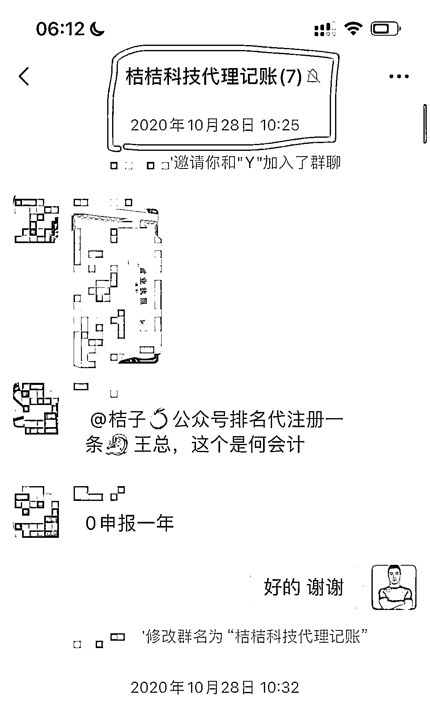
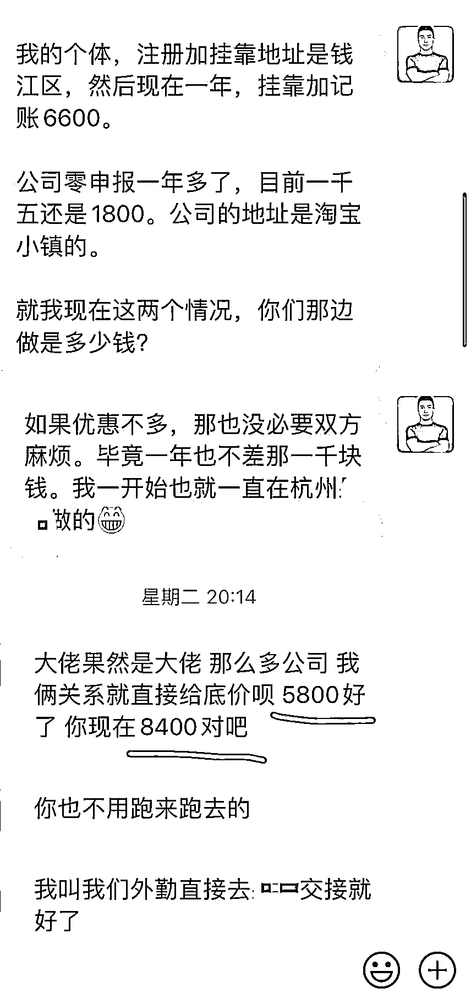

# 公司-个体开对公+挂靠+代记账的那些坑，避开后，我一年省了 2000+

> 原文：[`www.yuque.com/for_lazy/thfiu8/tcqbki2f0zwqo1yl`](https://www.yuque.com/for_lazy/thfiu8/tcqbki2f0zwqo1yl)

## (29 赞)公司-个体开对公+挂靠+代记账的那些坑，避开后，我一年省了 2000+

作者： 桔子@小桔圈

日期：2024-02-23

大家好，我是桔子🍊，小桔圈的桔子

**我的公司/个体办理与注销➕超高代记账的那些事，（看完或许一年帮你省几千，绝对不吹牛）**

每个人办理公司/个体的原因都不同，有的为了电商 有的为了公众号/小程序，有的为了微信商户号（h5 例如付费进群系统需要微信支付）等等

而我呢

我 2020 年 9 月底从健身教练职业离职，10 月份就办了公司执照

**我第一个公司执照的作用很纯粹，为了批量注冊公众号**（公司执照，正常不封号可以最多注册 50 个）

我的一个启蒙大哥给我指的道，2000 左右代办理公司的➕开对公。为此我还专门跑去了宁波去和财务公司对接。

折腾 2 天，最后因为那时某些非我的原因，开通不了对公…退钱回杭[苦涩]

但是我需要，不能不办啊 只能忍痛在杭州办了，

杭州办公司或个体都必须要有地址，当时项目做的还可以，于是我直接去租了办公室（大胆试错）

不出大家所料，几个月后工作室关门走人（押金是 2～3 个月吧，不退）

所以我现在想法就是在稳定月入 10w 前，能不搞线下绝不碰[抠鼻]

PS:第一个公司注销还花了 1500

然后就是个体了，前 2 年陆续办了几个个体，其他城市的，几十一个成本。主要用于注册小程序上线 注册微信商户号 为主。那时候 个体小程序可以批量注册几十个啊

其他城市个体，我不敢办多，够自用就行，毕竟注销还是有点麻烦，且办理需要把信息都发给别人➕需要扫脸。

接下来是真正大头，**我的杭州公司办理和杭州个体办理与记账的相关费用。**

**如果你没办过需要挂靠地址的执照，那么你看完再去操作，可能会省几千❗️**

因为我第一个公司办理的事，所以在我需要第 2 次办理公司执照时，我特意多查询与交流了下。

（为啥又办杭州公司执照？其一还是需要批量注冊公众号[破涕为笑] 其二想好好做 ip ）

果然，在生财星球里，我发现了直接可以一年省几千挂靠费的信息差，（再杭州办理公司执照不需要提供地址-也就是不需要挂靠费）

杭州是必须提供可作为营业场所地址的，我没有或不租公寓 写字楼，那么我只能选择挂靠，我当时各种对比查询（淘宝）杭州地址挂靠费基本都是 3000➕

**你说只是注冊公司➕0 挂靠费，这个方法值多少米呢？**

于是我 0 成本办了杭州公司执照且不需要挂靠地址（一年起码省了 3000➕）

几个月后我需要开对公账户，自己去跑了附近几家银行，毛用没有。我只能借助财务公司，

因为开对公就意味着得记账，所以我用**1800 一年代记账 0 申报获得了免费帮开对公➕代记账服务。**

说实话，我当时觉得很划算，挂靠费一年省了 3000➕，这 1800 代记账就感觉很香了，**哪知道这根本不是财税行业的核心低价，不，平均价都达不到[破涕为笑]**

记着:我的第 2 公司也就是目前正常的公司是 0 申报 0 挂靠费代记账一年 1800

接下来先说 我的杭州个体

杭州个体注册就是为了提现腾讯流量主的

因为个体对公每个月有 10 万左右额度可以直接转到个人账户，公司对公没有足够发票，直接转个人账户需要扣 20%点

**我的杭州个体，一条龙（注册 开对公 挂靠地址➕代记账）一年 6600**

当时流量主收益确实不错我也觉得可以长期干➕个体对公确实比公司对公好用，于是我直接就搞了

于是我的杭州公司代记账 1800➕杭州个体代记账➕挂靠 6600，一年费用 8000+

人在做项目时有时候是很冲动的，觉得可以就拼一拼 花点钱很正常

后来我了解多了 才知道我的价格不是偏高，那是相当的高❗️❗️❗️

但是，费用都是一年一交，加我确实公司 个体都需要，所以也不能注销

所幸，我还是等到了我的省钱时机。

一次杭州生财线下聚会，认识了一位开财务公司的圈友，她给我讲了正常的财务价格，我才知道我有多冤大头

不过还是那句话，我们**做互联网的永远不要为之前的冲动 失误懊悔，干了就干了，只要不违发，亏点钱算啥？**

于是她说可以换到她们公司，她们员工一条龙把服务都迁过来，不用我操心。

我说👇🏻

Ps:我公司已经 0 申报一年多了，不能一直 0 申报，这个价格包含我公司不 0 申报的代记账费用

没办过公司的伙伴不理解很正常哈

**也就是我 2 个公司，一年省了💰2600**

好了，我的有对公的公司/个体所有之路已经说完了。

有开过对公 记账➕挂靠的伙伴懂我说的，没弄过对公公司或个体的伙伴可能比较懵皮，很正常，分享就是让大家做些了解，第一次就不被高价坑

我给目前有对公➕挂靠➕代记账的伙伴建议，如果你的一条龙服务超过 4000+一年，建议你去找更划算➕靠谱的

如果没有办过对公公司/个体的伙伴，更是要擦亮眼睛，仔细对比 财务公司规模与价格。

我是桔子🍊，小桔圈的桔子，专注于自动化变现项目与微信搜一搜 seo +微请备注来意**10038140**

* * *

评论区：

詹小乐滴娘亲 : 还是有点没看懂[流泪]
芮 rui : 我看得津津有味，就是有点蒙皮，看不明白。但是也不妨碍我涨知识。万一以后用得到呢。
桔子@小桔圈 : 哈哈 没弄过的看不太懂也正常，因为大部分伙伴都可能会经历办需要对公的公司或个体营业执照。

看看有个概念，以后如果需要可以有点印象。起码知道这里面水还是比较深。
江南 style : 😂我东莞实体店，找的本地做账公司，一个月 600，每年申报还要 1000，贼高。因为每个月要开票，也不敢随便换。

* * *