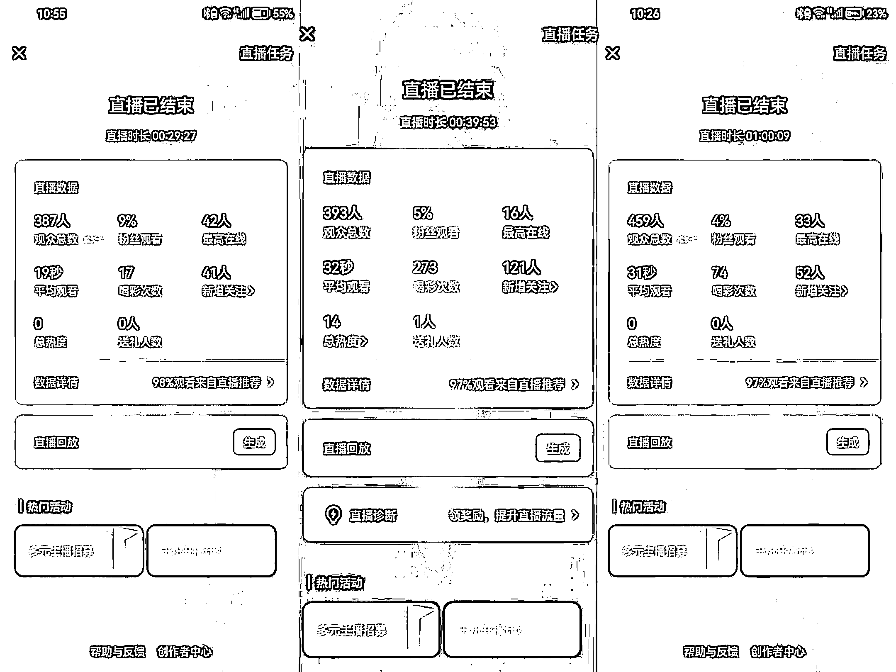

# 视频号电台直播，单场涨粉几百、上千的流程玩法复盘

> 原文：[`www.yuque.com/for_lazy/thfiu8/lwx0uq6egs6gg0ag`](https://www.yuque.com/for_lazy/thfiu8/lwx0uq6egs6gg0ag)

## (25 赞)视频号电台直播，单场涨粉几百、上千的流程玩法复盘

作者： 辰风

日期：2024-02-18

视频号电台直播，单场涨粉几百、上千的流程玩法复盘

大家好，我是辰风。最近这段时间，很多朋友都在尝试做语音视频号直播，数据也非常可观。

我的一位朋友通过单日的直播，一天涨了 1000 多粉，我做了三场直播，每场涨粉也有 100 左右。

流量玩法简述：

视频号最近热度很高，很多人都入场在玩，并且拿到了数据反馈，场观可以多的达到 2-3K，少的也有几百。

没有基础粉丝没关系，我们走的是平台推荐流量的模式。

玩法很暴力：语音电台开播，然后挂福袋，适当互动聊天，留人在直播间，做涨粉就好了。

目标是两个：私域导流、视频号涨粉。

视频号涨粉 1000 之后，就可以开通橱窗带货；涨粉 100 以上，达到要求可以开通创作分成计划。

后端变现就是，通过私聊、朋友圈进行成交，借助直播项目，副业项目变现。

更多内容请移步飞书：[`k874t2qh8w.feishu.cn/docx/OjmfdzO4HoJPnJxJypOcKtKenPg`](https://k874t2qh8w.feishu.cn/docx/OjmfdzO4HoJPnJxJypOcKtKenPg)

* * *

评论区：

BLUE : 电台直播带货，效果如何，有测吗？
辰风 : 电台状态下挂车这个倒是没有尝试
BLUE : 测测呢？

* * *