# 十天布局售卖虚拟资料，收入近万元，我的公域引流私域经验分享

> 原文：[`www.yuque.com/for_lazy/thfiu8/lpit2eofw9ml3ggn`](https://www.yuque.com/for_lazy/thfiu8/lpit2eofw9ml3ggn)

## (34 赞)十天布局售卖虚拟资料，收入近万元，我的公域引流私域经验分享

作者： 桃子🍑

日期：2024-02-22

哈喽，大家好，我是桃子，在读研一，17w 粉公号博主、百人合伙人团队主理人、自媒体&私域导师、靠公众号和写作变现 7 位数。

今天分享的主题是《十天布局售卖虚拟资料，收入近万元，我的公域引流私域经验分享。》

做自媒体快五年了，可以说我有非常敏锐的搞钱思维，当我前年考研的时候向学姐买考研资料时，就想好了自己之后同样可以售卖。

所以初试考完后，我就提前布局了考研资料的售卖，不出所料，收获了不错的的引流成果：

当时我主要的引流平台是小红书和闲鱼，知乎也有同步，一共没花多少时间，小红书主要是写了一篇经验贴，之后都是辅导需要，我也顺带在小红书也发了，闲鱼只发了一条，知乎也是直接复制粘贴。

相当于几篇笔记，引流 40+人，人虽少，但是非常精确，成交率极高，其中大部分都是卖资料，少部分主动提出要参与辅导，整体加起来上万元，早已经把我去年考研的钱翻倍赚回来了。

十天的时间，靠小小副业赚了上万元还是很不错的，因为当时有自媒体工作，所以也没继续了，如果继续深耕，肯定会有更好的成绩。

而且这些流量在后续的私域也有成交，所以请大家重视“引流”这项操作，对未来做私域有非常大的帮助。

**现在刚好处于大三学生准备考试需要资料的节点，所以如果有这方面资源的可以提前准备一番。**

接下来我会以我自己做“考研虚拟资料”的经验为例，来给大家详细讲一讲“公域引流私域”的操作，保姆级教程，如果你有产品想依靠公域进行引流或是通过卖资料赚钱，那么我建议你认真看一看。

**本次分享的主要内容有以下几个方面，大家可以按需查看：**

**一、公域引流的底层认知和变现模式**

**二、售卖虚拟资料方式及三大平台规则介绍**

**三、公域流量转化私域，私域成交方法大全**

**一、公域引流的底层认知和变现模式**

桃子先给大家打破一下信息差，**什么人需要引流？**

**首先，**一是你有商品，包括实实在在的商品，那么可以引流至微信，这类就是我们通常说的微商；还有一种虚拟商品，可以复制多份的，比如虚拟资料等等。

**第二，**即你有自己的付费产品，那么可以尝试引流“对应需求的精准流量”，建议不要太杂了，精准很重要；或者你想要靠分佣来赚钱，也可以对自己的私域进行引流。

那么，**引流和变现如何结合？**

一是有自己的产品，那么自己宣传自己的产品进行售卖即可，比如桃子是教写作和公众号的，那么我就可以写自己依靠公众号和写作赚了多少钱，并且持续输出干货，从而吸引也想靠写作和做公号赚钱的人。

二是你擅长一项技能，比如原画，这时候也可以引流想学画画的人来到你的私域；

三是进行分佣，也即是售卖其他人的产品，比如宣传生财有术的星球，大家不用自己交付就能赚钱。

那么具体的引流操作，若是前面两者，一定是需要给点“福利”，也即是免费的资料，吸引大家来领取，这样也会给来人个好印象，比如每次小红书加我的朋友，我都会送两份见面礼：

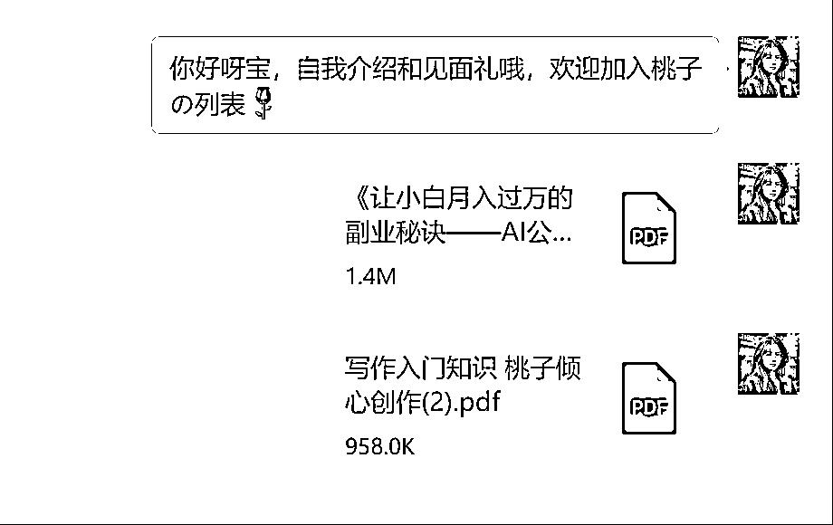

（大家也可以提前搞几份自己写的资料）

经验证明，很多收到见面礼后，说谢谢的人，后续都是会有成交的可能的，因为大家骨子里还是比较礼貌的，认知也还可以。

如果是虚拟资料的话，你自己设计的 PPT，你画的画或者设计的头像，你曾买的电子资料（包括但不限于教资、计算机二级、考研初复试资料、各领域考试专门的资料……）等等，均可以用于出售，只要你能引来对应的人群。

这种就更适合低价，或者直接不告诉价格，需要加微信来问，后者成交率会更低，建议前者，引流也值得。

其实不论是产品还是商品，本质都是卖货，所以即便今天讲的是考研资料，大家也可以融会贯通到自己身上。

那么认知搞定了，那么接下来桃子直接上实操了，感兴趣可以继续跟着桃子脚步往下看哦。

**二、售卖虚拟资料方式及三大平台规则介绍（以考研资料为例）**

**1.第一个平台——小红书**

小红书应该是目前非常适合个人卖产品或者资料的平台了，因为它的用户量极多，而且是公域平台，流量范围广，但是不太友好的点就是小红书笔记极其容易不被收录甚至违规，对于引流的管理也非常严格，但是还是可以用一些技巧。

我在前期引流的时候是直接发资料的截图，直截了当地表明是哪个学校，这样引来的用户一般都是搜索来的，其实也就是我们常说的**“硬广”**。

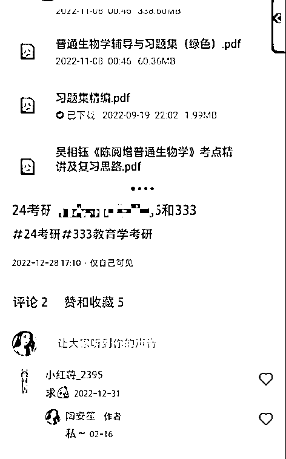

就像这样直截了当，这样直接发的好处就是 1 方便快捷不费时间 2 来的用户非常精准，但是也有很大的弊端，也就是流量很少，一般都会限流的。

如果你是自己整理的一手资料，还是可以尝试一下的，但是那种二手资料还是极容易限流，而且可能会侵权。

所以之后我就换了一种方式，也就是写经验贴的方式（也是因为当时考完研，很多学妹会来问经验，所以我干脆直接写了一份经验贴，也就一个多小时吧，之后直接截图发就可），这种就是我们所谓的“**软广”**，也就是“**靠内容吸引人”。**

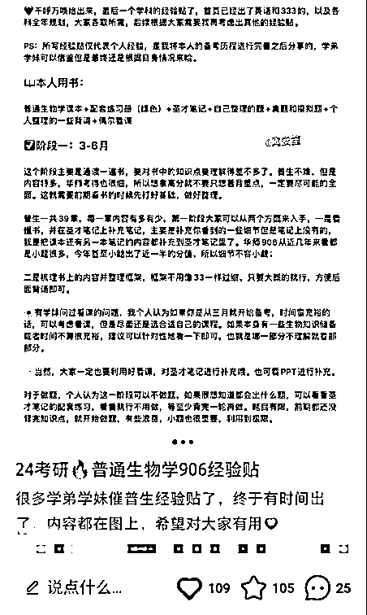

像这类经验贴一般是不会被限流的，而且需要的人甚至会主动来问你可以出资料或者能否辅导，因为写了经验贴才更像是真实的学长学姐，而且人家看你的学习方法不错，自然也信你。

所以，如果想要在公域平台卖资料的话，建议至少准备一篇你的个人经验贴。

一个小 tip：如果有小爆款，大家也可以尝试在评论区留粉，增加关注。

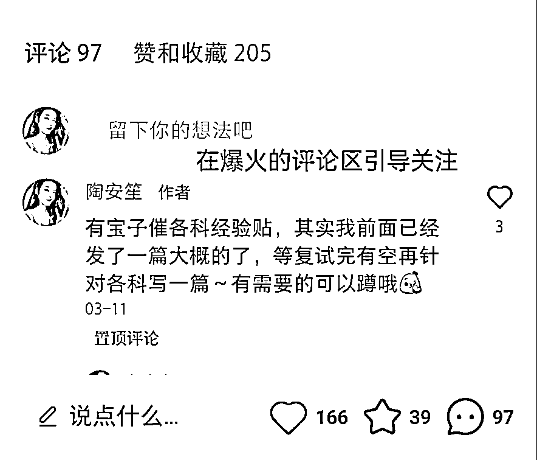

那么再说到卖产品，我在小红书看到很多卖产品的都是图文介绍，或者视频介绍，一般都是需要在小红书开店铺，如果不开店铺的话，可能限流和违规概率就会大很多。

但是也没有太大关系，只要你能抓住用户的痛点，然后把产品的优点多说说，同时注意天时，也就是提前蹭热点，父亲节母亲节儿童节等等都可以蹭。

还是建议大家以软广的形式，可以写故事或者聊天记录推荐等等，以获取更多的流量，虽然不一定爆火，但是因为流量很精准，所以来的人成交率很高。

再说到自己“卖技能”，可以发一发自己的 P 图成果或者剪辑、做 PPT 成果，简介可以偷摸摸地说明自己可以接单的意向。

之前我就看到过一个老师把自己的课件放在小红书售卖，而且效果还是很不错的，其实知识付费售卖课程也是如此，展现自己的强能力，并表明可以收徒。

所以你看，只要你有技能，只要你肯钻研，什么都能卖，赚钱的地方有很多！

**2.第二个平台——闲鱼**

闲鱼一直都是以“卖二手闲置物品”出名的软件，之后就被各种延展开始卖新物品，卖资料，卖盗版等等，所以在闲鱼卖产品或者资料还是比较适合的，但是缺点是流量没那么大。

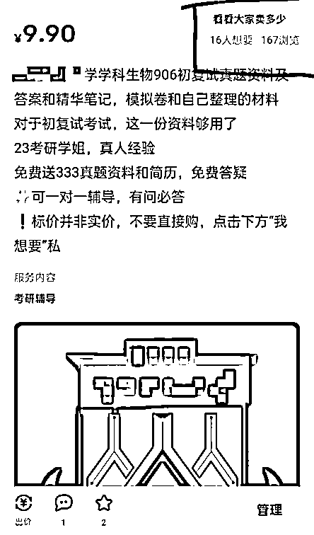

这是我在闲鱼卖的资料，也是顺手发的，一分钟的事，就只需要写明你有什么就可以了。

大家可以看到仅 167 的浏览量，就已经有 16 个人想要了，也就是来询价，大概也成交了几个人。

我的价格其实标的非实价，在后面也说明了，实价会在私信回复，之所以要注重私信人数，是因为在搜索页面，是会根据私信人数和体量来决定位置的，当然也和日期有关。

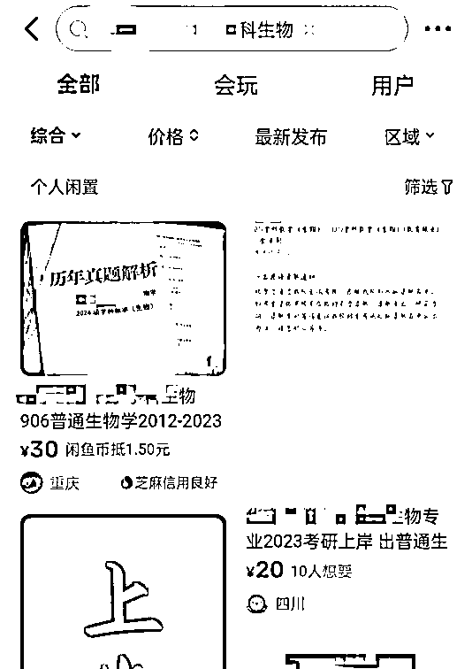

标明实价的话可能会有竞争对手来比价，打开率也会很低，但是虚价的成交率会低一点，所以还是看自己的目的了。

接下里给大家说说闲鱼卖资料或产品的步骤：

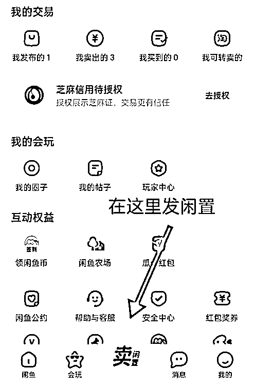

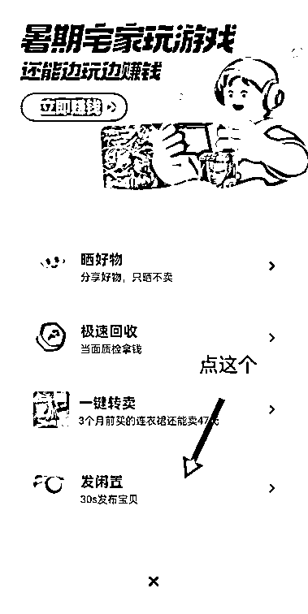

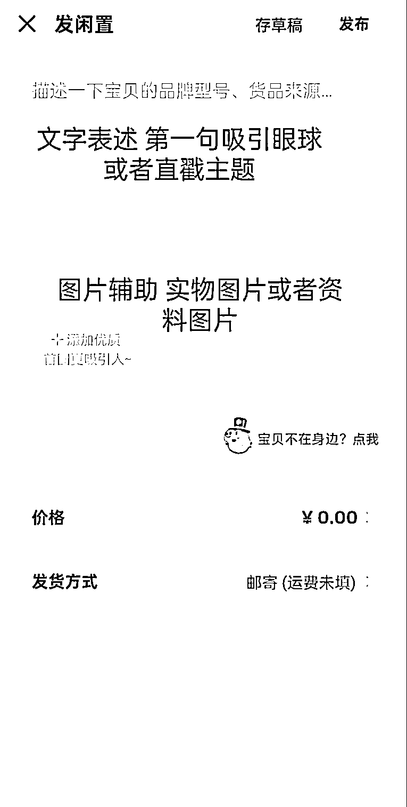

另外，在闲鱼买东西的话，发完记得每天去点点擦亮曝光，这样会给你多加曝光量。

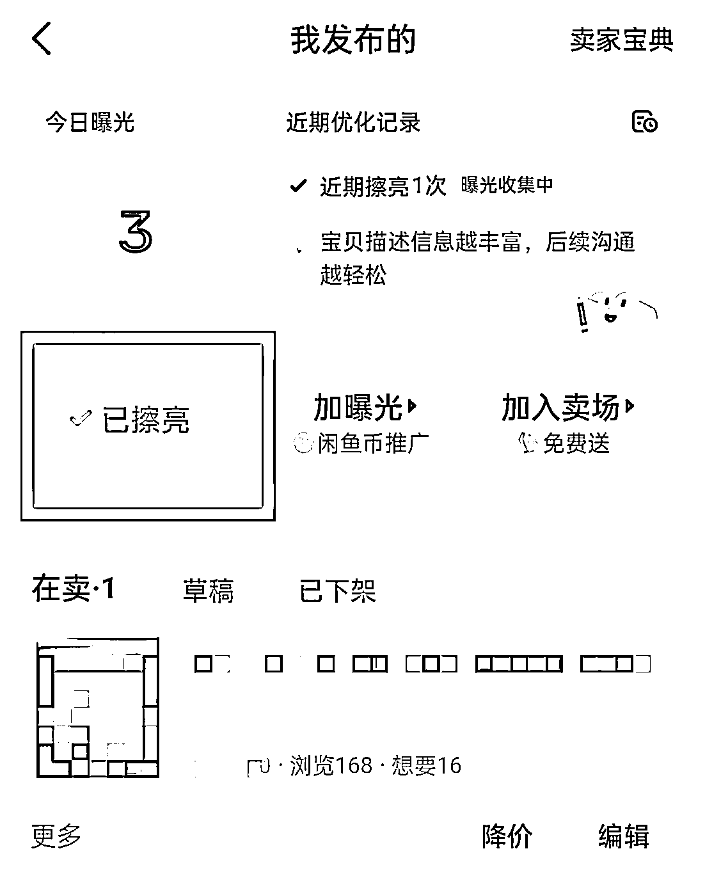

其实起初我在闲鱼发了好几条，但是其他的都违规了，只剩下一个独苗，后来我才发现，原来二手资料（尤其是电子版）是不能直接截图售卖的，所以后面我就换成了小红书上写的经验贴，一文多用，这样就不影响了。

所以大家在发闲鱼闲置的时候也可以多发几遍，增加曝光度，但是要稍微换一下图片文字，因为我没时间，而且这不是主要工作，就还是这一条。

产品也是一样，拍摄不同的角度，直接定价就好了。

有技术的话就可以尝试在闲鱼接单，前面可以价格便宜一点，接单量上去了，有一定的权重，就可以自行决定了。（另外，在淘宝也可以接单哦，如果给店里打工可能会被赚差价，有条件可以考虑自己开一个淘宝店）

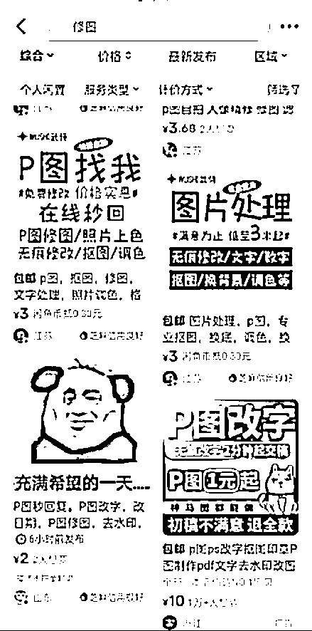

**3.第三个平台是——知乎**

之前玩过知乎，几千粉了，后来因为推征稿函被封了，所以一直没用过。但是后来卖考研资料想全面撒网，试试效果，（因为之前我自己就很喜欢在知乎搜经验贴），所以我也顺带发了一下。

好久没登过了，但是后面一去看，没想到已经有不少的收藏了，而且居然还有学妹私信。

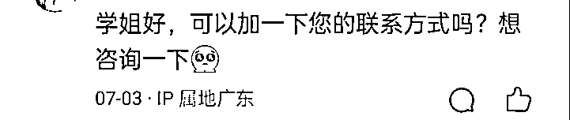

所以知乎的长尾效应真的是很强，而且基本上都是搜索来的，非常精准，直到现在还有人问我要复试资料，又是躺赚的一波了。

你看，我只是把在小红书写的经验贴直接搬过来了，再稍微介绍了一下自己，之后完全不管了，自然流量就有这么多，所以如果是这方面的资料还是可以试试哈。

卖产品和其他的技能接单也是可以把主平台的资料照搬过来，但是不要太明目张胆了。

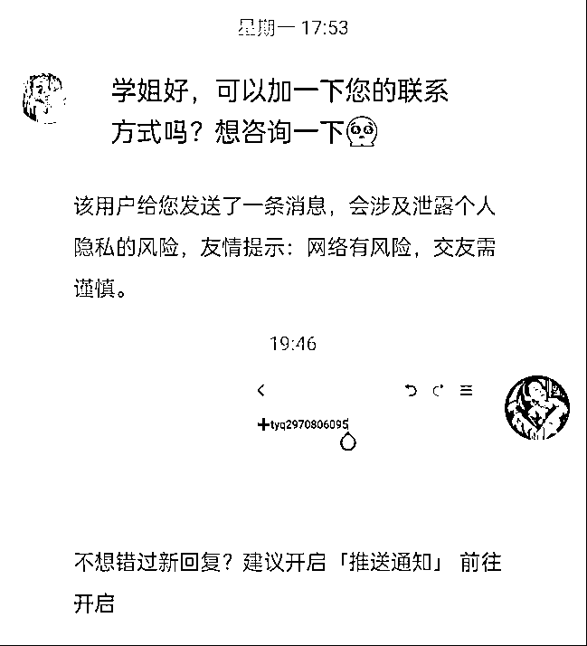

这是我在知乎回复那个学妹的，引流我是用的图片，违规风险小很多。

其实，我也在抖音、快手和其他平台同步发过，但是基本上没什么水花，所以我也就不抱什么希望了，毕竟抖音快手都是泛流量，普通人也很少去抖音搜学习资料。

但是产品还是可以的，尝试开个商品橱窗，给产品做视频进行宣传，同时同步到视频号。

所以，就我目前全网测试来看，以上三个平台是比较适合进行虚拟资料售卖的，但是每个平台都有其禁止引流的规则。

接下来桃子给大家介绍一下如何将外域的流量引流到私域，教你完整地实现公域卖资料或者引流操作。

**三、公域流量转化私域，私域成交方法大全**

其实各个平台引流的底层逻辑都是一致的，所以桃子在这里主要分享方法。

先给大家说说引流反面样例：

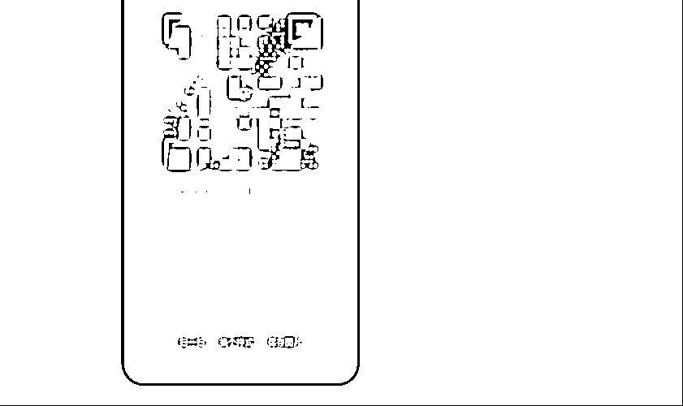

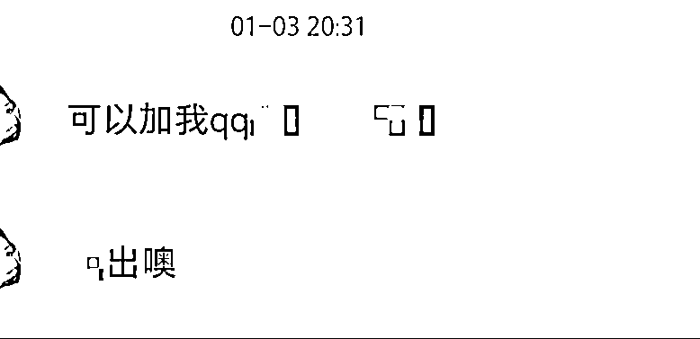

这是我之前买学校复试资料时，学姐发我的，大家可以看出来，操作非常大胆了，也许这样发个一两次没关系，但是之后被检测出来，很容易是直接封号的，多次违规对账号的权重也很有影响。

之前我有一个小红书就是因为公众号引流，彻底违规没有流量，之后直接注销了，所以大家谨慎引流，不要直截了当地就发，对自己账号好一点。

也请大家明确，所有的公域流量都不允许往私域引流，所有大家引流的时候一定不能光明正大地发“微信”“QQ”“公众号”甚至于微信二维码，非常容易被检测违规。

还有一种是，用字母或者谐音来引流，比如下面这种，就是我最开始用的方式。

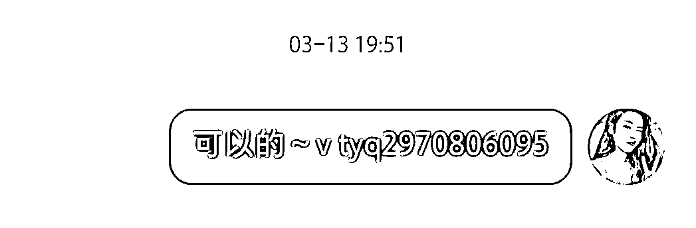

这种会比直接发微信好很多，但是用多了次数，我发现，还是会被平台检测，我小红书之前就被警告过几次，所以如果次数不多，还是可以试试，但是要长期发展的话，还是不建议。

那么桃子给大家推荐几个方法，尽量减少违规（再好的方法也不能保证百分百不被检测）

**1.图片设置微信号发送**

比如，我在之前发知乎就是在备忘录编辑一下，然后发了图片，不要提及微信，vx/v 也不可以。

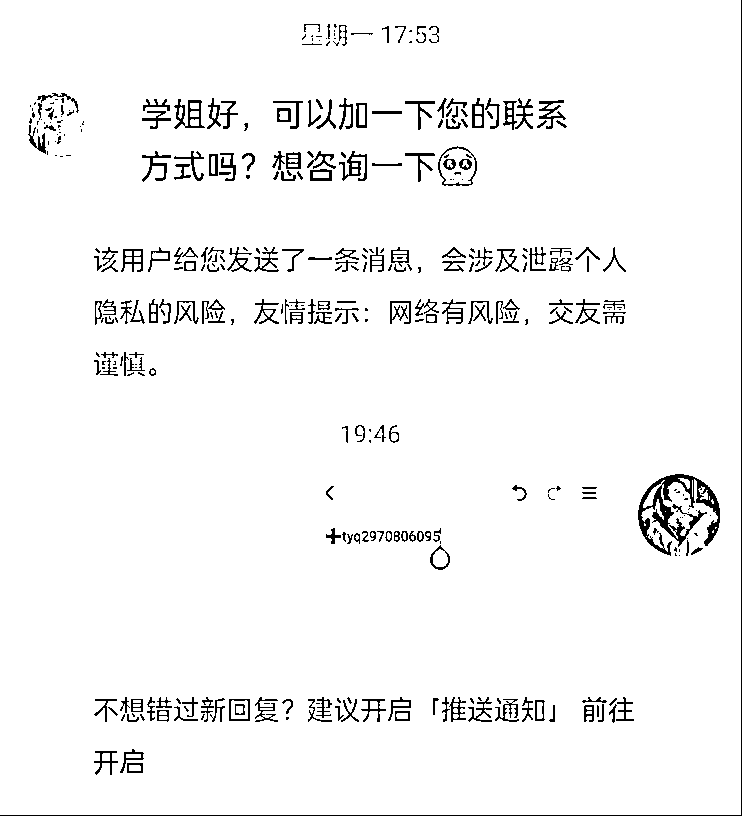

再比如这个是我之前找简历模板的时候别人给我发的，是特地做了一个相应的图，更加美观直观，但是出现 v 风险还是蛮大的，可以优化后尝试。

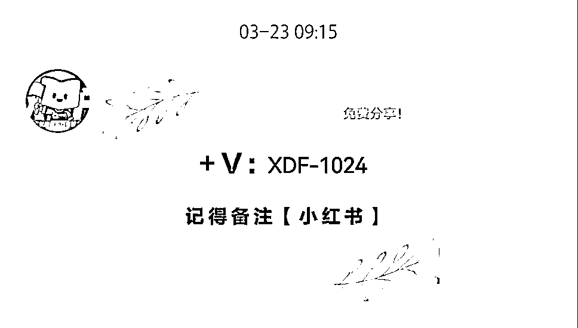

**2.小红书号设置为微信号引流**

自从被警告之后我就不再提 vx 了，而是直接把小红书号设置成了我的微信号，这样我就可以以小红书号代替微信号，之后我是这样给来买资料的学弟学妹们回复的：

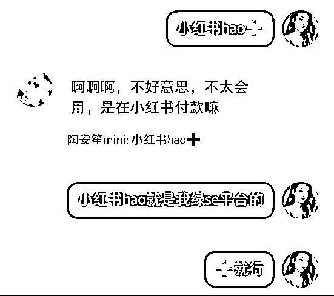

不过，也有很多宝子不知道是什么意思，就需要借用“绿 se 平台”来解释一下了

**3.计算机式引流**

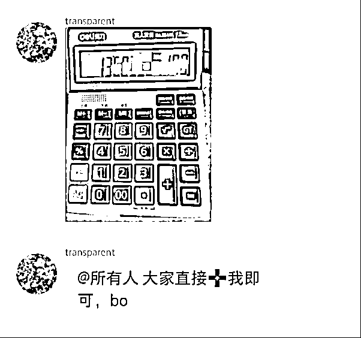

还有这种用计算机进行引流的，着实很有新意，这样被检测的概率更小了，不过这样的缺点是——仅限于你的微信号都是数字，如果有字母或者特殊符号可能就不适用了。（此方法取自合伙人辰风社群）

**4.设置群聊引流**

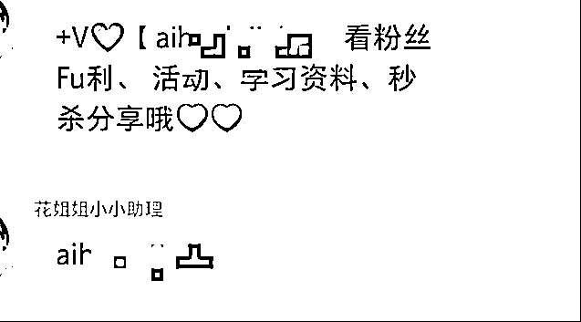

比如这种，当你的小红书粉丝进入到群聊之后，直接发送微信号进行引流，（这里建议还是用图片或者其他形式哈），可以设置一些小福利，引导大家去加微信，毕竟没点利益吸引，转化率低很多。

**5.大号引流小号转化**

当你小红书大号有较多的粉丝，怕引流违规影响权重，就可以试试开设一个专门的小号，和你的大号关联一下，这种尤其适合在小红书做付费产品的，即便小号违规也不牵扯到大号。

或者设置一个助理号，让助理为你对接引流，不影响自己的主号，目前很多知识付费的都是这样搞的。

**6.简介谐音引流**

有的小红书博主是会在简介上放自己的公众号的，但是注意一定要用谐音，严的时候甚至连谐音都不让，但是还是可以试试。

当有人私信问你怎么获取 xx 的时候，可以直接让她到简历的某个地方去看，小红书发不了，之后就可以引流到公众号了，再从公众号筛选到微信，这个前提是得有一个公众号哈。

桃子也非常建议，所有做公域平台，之后想往私域发展的朋友都搞一个自己的公众号，因为这是承接公域流量过渡的最好的平台，之后进行招生也是非常方便的。

**7.设置合集/群聊名称引流法**

有些博主会直接设置一个合集，合集内容直接放上自己的微信号，这样粉丝都无需私信就可以直接添加，非常隐秘。

还有一些博主会开设多个社群，社群的首页图片连起来就是自己的微信号，而单个社群封面则看不出来，进行混淆视听，这种方法也可以借鉴。

**今天我主要介绍的是小红书，其实其他平台也是一样的道理，很多底层逻辑都是可以互通的**，像知乎和闲鱼，用图片还是更好的，小红书可以尝试用小红书 hao 来引流。

所有的方法大家都可以套用，不是非要固定用什么方式，你觉得那种方式好用就可。

但是注意，小红书直接发私信，一天三次以上也是容易被警告的，警告之后就是违规被禁了，所以建议私信次数还是不要多了。

以上就是桃子给大家整理的一些虚拟资料售卖方式及公域引流方法了，大家学会了以后在其他平台也都可以适用，同样做知识付费也可以利用这些方式来引流。

最后感谢生财有术的平台，也希望对大家有所帮助！

* * *

评论区：

詹小乐滴娘亲 : 谢谢分享
小冰 : 微博学校超话也可以去发 能引流一些人，成交的概率没小红书高，不过微博留微信不用担心违规
盟主君 : 太棒了

* * *