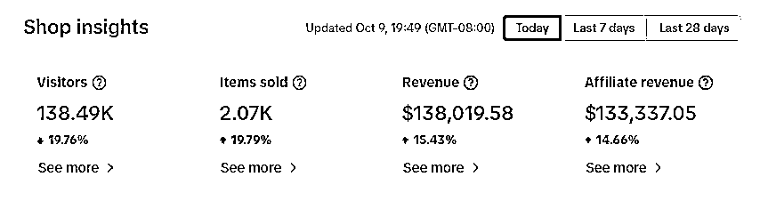

# 从没做过跨境，怎么入行 TikTok 赚到 100 万？

> 原文：[`www.yuque.com/for_lazy/thfiu8/vortzyr8xfsygddc`](https://www.yuque.com/for_lazy/thfiu8/vortzyr8xfsygddc)

## (60 赞)从没做过跨境，怎么入行 TikTok 赚到 100 万？

作者： 星耀出海~众里

日期：2024-02-21

9 月加入生财，跑通 tiktok 美国带货；到 10 月份变现 100w，今天来分享一下我是怎么做到的。

我们目前跑的是跟爆款自然流和店群自然流。tiktok 美区带货一天 3000 万 gmv，大概店铺流量占比 20%，也就是每天几千万人民币的业绩会到店铺搜索上。我们要做的，就是把更多的商品链接在搜索上曝光出来。

当然这个过程中踩了很多坑。初入行选了便宜物流，却因为物流商跑水单，直接亏损 7 万美金；10 月碰到平台封店潮，资金冻结 1 个月，卖货这件事也停滞了一个月。

所以说，做 TikTok 美区，先谈风险在聊卖货，能不能接受店铺被封，货卖出去资金冻结 30 天，卖侵权产品不能回款，能接受这个问题，在这个市场一个月赚 10 几万很容易，有资金放大很容易就能实现月入百万千万，把风险想好就能冲。

今天，我将详细拆解我们的玩法，包括店铺选择、网络搭建、选品上架、物流发货等关键环节，以及如何在美国 TikTok 小店中实现自然流量和店群模式的高效运营。希望对大家有所帮助。

大家好，我是生财圈友众里，9 月加入生财跑通 TikTok 美国带货项目到 10 月份变现超百万，很荣幸受邀回来给大家做这个分享。

先做个自我介绍：

1.  96 年双子男，连续创业者。

2.  目前公司业务：餐饮 SAAS（7 年老业务完全不管）、娱乐直播（500+主播）

3.  TikTok 美国卖货（未来 10 年深耕出海）

大学期间靠 APP 推广（支付宝收款码/大众点评等）拉新实现最高月收入 10 几万，工作后进入餐饮 SAAS 行业，吃到了公众号+小程序对餐饮行业的红利。

21 年第一批抖音团购服务商，从服务餐饮连锁到自己开餐厅亏损后战略放弃餐饮板块的业务，专注在字节系深挖

# 一、项目背景

加入生财后通过线下聚会了解到 TikTok 美区小店，回去验证后用抖音+小红书找到精准客户售卖美国本土店铺，并出手册 9.22 号在生财分享，一批生财的小伙伴跟我们买店。[美区 TikTok Shop 销售手册](https://kvtg1zi247l.feishu.cn/wiki/G69OwCsBzi0hB8k0A4Gc4qkOnh9?from=from_copylink)

随着卖出去一批店铺，很多小白都是上架没几天爆单，我们也开始自营开店卖货，最开始 1 个人研究，陆续增加到 3 个运营（都是小白）管理 30 个店铺，2 个月赚了 100 多万。

数据最好的两家店铺，其他的店铺有的被封了，有的出几千美金，几万美金的。

因为 10 月平台封店潮，资金冻结 1 个月，担心回款问题卖货卖店铺这两件事停滞 1 个月，在 11 月月底全部回款后去泰国旅游放松刚回来（在杨爽、鱼丸的督促下赶出来这篇）。

**回款证明一件事，字节目前不会像亚马逊那样收割中国卖家。**

当然这段时间也没闲着，亚马逊时代，一批卖家靠铺货铺成了上市公司。业内靠 TK 店群赚到钱的这批卖家，封店期玩直播短视频投流赚钱就很辛苦，在批量回款以后又开始玩店群

我们围绕着开店效率做了解决方案，加上自己有一些研发能力，开发了几个插件，做了自动采集+自动翻译+自动采购下单全流程自动化，实现一个人管理 50-100 个店铺，该板块过于复杂，研发还在迭代优化流程。

[`shengcaiyoushu01.feishu.cn/docx/XK3WdhQeOopQMAxRNpLcRxAnnih`](https://shengcaiyoushu01.feishu.cn/docx/XK3WdhQeOopQMAxRNpLcRxAnnih)

对外还投了一个小团队在测试美国矩阵短视频带货，有一点小结果（预计 1 月份跑通模型给大家分享）

# 二、玩法拆解

所以，今天重点聊聊如何在美国 TikTok 小店开店卖货这件事，我一个电商小白怎么入行赚到这 100 万的。

目前平台主流的卖货玩法有几种：**店铺自然流、直播、短视频、达人带货、付费投流、私域、引流独立站**

我们是基于自身供应店铺，目前跑通的模式就是跟爆款自然流和店群自然流。

**自然流核心：**

1、便宜稳定的店铺及安全的网络节点

2、高效的协同工具，便于批量采集、同步、素材去重、发货对接

3、更多的商品链接占据平台商城搜索流量，被消费者看见

那 TikTok 美国带货一天 3000 多万美金的销售额，大概店铺流量占比 20%，也就是每天几千万人民币的业绩会到店铺搜索上。

比的就是谁有更多的链接，不仅有用户购买，还有达人会因为你的链接排在前面免费来带，可能别的店家分佣比例 50%，你只是 5%，达人也会带

**（1）店铺选择**

TikTok 美国小店就等于抖音小店，区别就是美国身份才能开店，本土店目前可以当成杂货铺上架，一万个 SKU 也能铺上去，而且平台 5 月份开放市场，现在还有运费补贴。

而跨境店限制类目，能卖的产品类型就会变少，更重要的是需要亚马逊流水，老卖家才能搞定。

**（2）网络搭建**

店铺网络要求不高，不需要像直播那样对网络高要求，但是网络至关重要，很多店铺会因为网络被封，测试下来一圈。

如果你是刚启动，经营 1-5 个店铺，紫鸟浏览器这种直接买网络节点就能运营了，大概 100/个月，目前买了 IP 还有免费的达人邀约功能。

要是玩店群模式，意味着会有几百上千家店，使用紫鸟成本就高了，我们是技术自己搭建的美国静态住宅 IP，不会重复，自己的成本 2-3 块一个，对外 40/月。

浏览器我们从战斧、紫鸟、ADS，再到**比特、Hubstudio**，目前两个都在用，方便美国那边注册完店铺协同

**（3）选品上架**

我们运营做的基础操作手册，有店铺不会基础设置的看看这个视频：

[`shengcaiyoushu01.feishu.cn/docx/NjopdYPGXoYOt6x4KZYcSZOsnob`](https://shengcaiyoushu01.feishu.cn/docx/NjopdYPGXoYOt6x4KZYcSZOsnob)

FastMoss: [`www.fastmoss.com/dashboard`](https://www.fastmoss.com/dashboard)

Tabcut: [`www.tabcut.com/workbench`](https://www.tabcut.com/workbench)

我们常用的两家选品网站，找到爆款产品，回来上架到自己的店铺里。

从网站里找到美国的爆款，别看首页这些一天卖几万几千单的，一般从第 10 页之后，算上物流运费+货损，1688 图片搜索到对应的上品比价。比如第二名得卷发棒，我们也出单卖过 100 多单，卖 49 美金，采购价 69+虚拟仓物流费，算起来有一半可以赚。

选品有个点要注意，图片得去重，优化后的素材跟同行就不一样了，发的货可能还是同样的，价格可以定高。

上面是 1688 采购，另外有一些交流群会发一些海外的货盘，大多数都是几道贩子总结的，没啥利润，自己要注意货盘表得成本。

如果跟工厂对接，**没有在海外仓备货的厂家意义不大**，刚入行，千万别自己备货，给工厂买一批货发国外，万一卖不掉，几万块就没了，建议先虚仓发货摸索。

**（4）物流发货**

大量的博主讲虚拟仓被封，其实是物流时效性跟不上，TikTok 美区要求本土发货，3 天备货，7 天妥投，这个时间大部分的物流商解决不了，在行业初期承接商家的订单，因为没有跟字节的 API 打通，导致虚拟订单不能回传，一直显示待发货中，对于卖家造成损失。

我们选择用香港的货代，没有备货海外的产品销售后发到深圳，2 天送达后，当天装上物流商去香港的车，晚上飞往美国，同时物流商产生了虚拟轨迹信息回传平台。

**优点：0 库存周转，不用备货，卖一单发一单**

**缺点：物流成本高，近期物流起步价都要 100+，退货=货损**

**关键点提醒！！！不管虚拟仓还是海外仓，小白最容易踩坑了，我们本来能多赚快 100 万，因为物流商跑水单，直接亏损 7 万美金，后来又测试了几波物流商才验证出来。**

PS：最开始发虚拟仓，80+30 这样的物流费，还不能帮我们打包，所以想换物流商。经朋友介绍，把订单给到一家新的物流商段总，40+30 一单，还能垫资 3 个月，初入行受不了这诱惑

（物流是支出大头，如果能垫资这么久，自己的资金就能多周转赚更多的钱了）

无脑给了他几千单发货，结果就是没有订单回传，产生了航运欺诈，导致店铺被封，订单退还，货也给到物流商没了，现在还在打官司。

TikTok 美国通过店铺把货卖出去是件简单的事情，只要上架更多的产品就能出单，并且这个节奏很快，我们合作的工厂买了店铺，没两天就出单了。我们测品的店铺，上架 2 天出单 800 多美金，这都是最近的事。

所以做 TikTok 美区，先谈风险在聊卖货，能不能接受店铺被封，货卖出去资金冻结 30 天，卖侵权产品不能回款，能接受这个问题，在这个市场一个月赚 10 几万很容易，有资金放大很容易就能实现月入百万千万，把风险想好就能冲。

感谢生财让我破圈，抓住了风口了，今天的分享就到这里，希望每个入行的圈友都成为亿级卖家。

* * *

评论区：

冬日暖阳 : 大佬好
冬日暖阳 : 小白求带
星耀出海~众里 : 早做了几个月，欢迎大家交流指导[嘿哈]
冬日暖阳 : 方便加一下微信不
牧言木语 : 小白求带
星耀出海~众里 : 欢迎交流，过两天会把美区短视频变现玩法做出来发布
牧言木语 : 方便加下大佬的微信吗？
星耀出海~众里 : 方便的

* * *