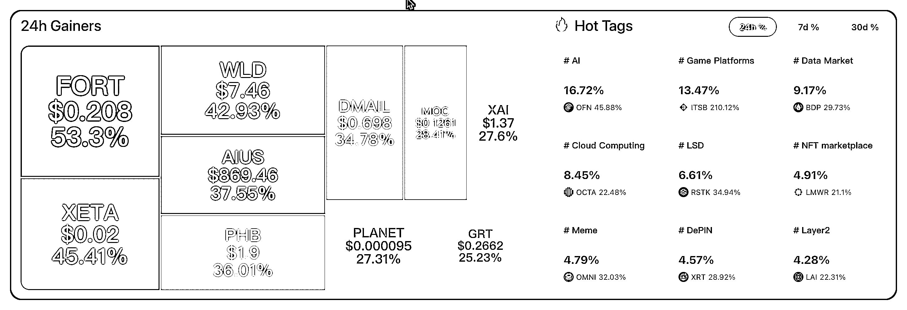
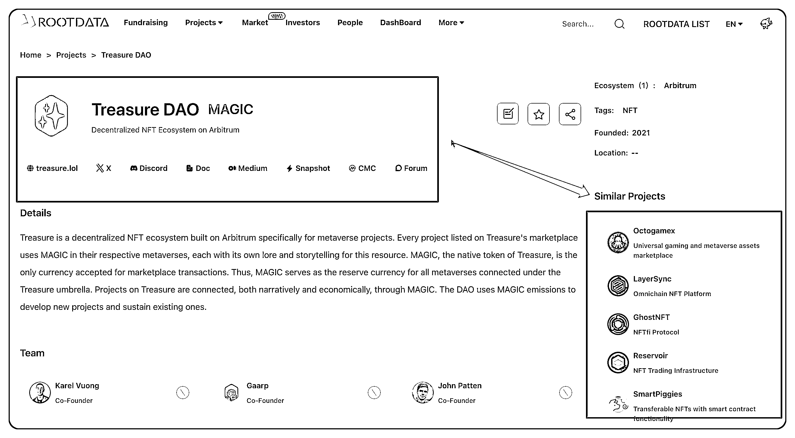
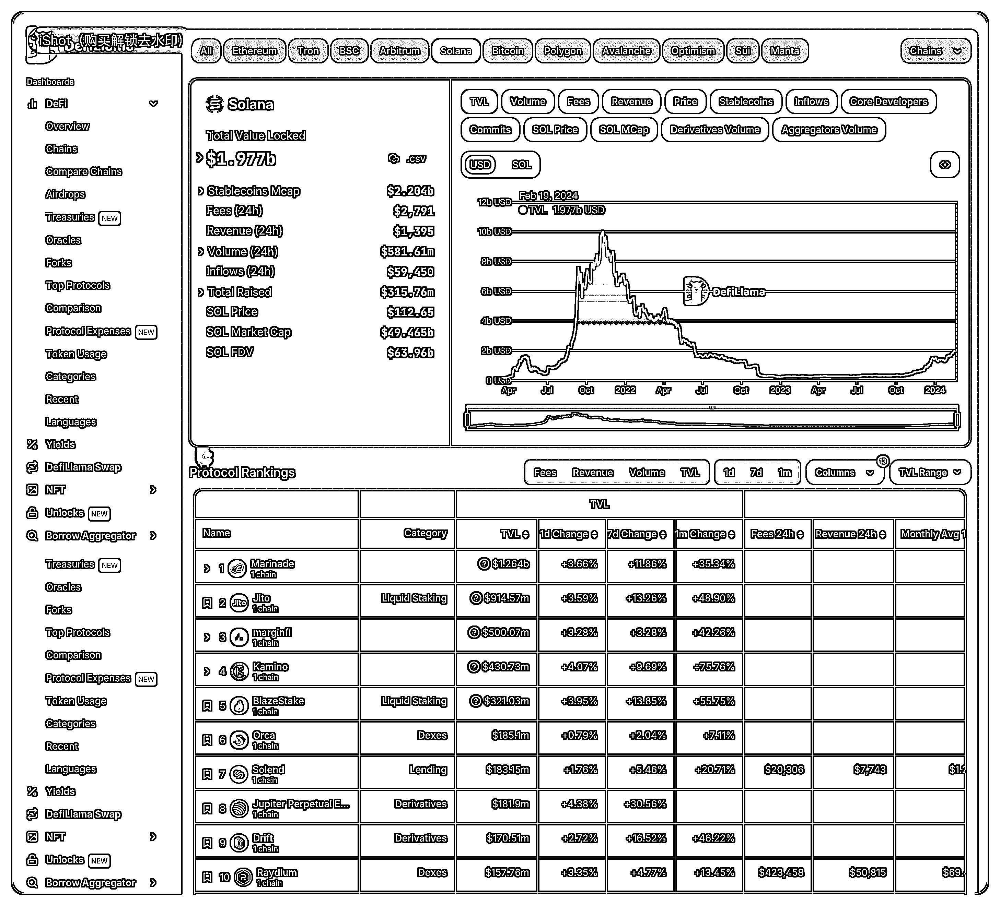

# Web3 赛道从 0 到 1 的点线面成长方式

> 原文：[`www.yuque.com/for_lazy/thfiu8/gsa63l0g1cnttrk7`](https://www.yuque.com/for_lazy/thfiu8/gsa63l0g1cnttrk7)

## (22 赞)Web3 赛道从 0 到 1 的点线面成长方式

作者： Start9527

日期：2024-02-19

点线面是立体几何的概念，用于解释我们看到的视角。

去年币圈科学家和 Anymose 都以投资的角度，从点线面的角度讲了建立自己的投资体系，大致意思：点是单个标的，线是以此串起来的板块，面则是由此形成的叙事，如果有这么一套投资系统是很幸福的事，但我们都知道这并不容易。

而我更喜欢研究新赛道的参与方式，满脑子都是怎么让新人更容易进入这个赛道，更好建立自己生态位的思考，尤其是已经有了一个不大不小的 Web3 新手实战营 Web3Going（314 人）以后，更多的心思都在怎么帮助社区伙伴更容易上手项目，而不是成天 FOMO 或是在一些细节上焦虑，所以，就有了今天的内容，相信对 Web3 新人而言一定会有启发。

Start，Gogogo！！！

本文有三个前提：

1.  知识都是可以免费获取的，但你需要选择正确的进入方式，否则那些好的知识也与你无缘，而错误的方式会带你去深渊；

2.  对于新人而言道比术更重要，术就在那里，会有不同，但是懂得了道，会更容易理解术，尤其是新人，很多新人也加了高阶社区，但对于分享的项目一头雾水就是这个原因；

3.  建立点线面的思维系统，更快的在 Web3 找到属于自己的生态位，这点尤其重要也是本文的核心论点。

我在 Web3Going 社区的会员服务过程中，经常遇到：很多伙伴会纠结在某一个点上，卡住就过不去；有些伙伴没有参与某一个项目，但却会因为信息过载 FOMO 被埋；有的伙伴打到了好标的，但没卖在高点就感觉很悔恨，时常想拍断大腿。但当你经历了之后往回看，那些问题好像又都不是什么事儿。

所以，我站在生财有术 Web3 小航海教练的位置，和大家分享一下如何从 0 到 1 建立自己在 Web3 的生态位。

今天内容干货比较多，记得点赞关注转发。

# 找到第一眼的优质项目

首先，每一个人都一定有自己的第一眼项目。我经常给 Web3Going 社区伙伴讲我的第一眼项目是 FLOW，尽管这是一个悲伤的故事（因为亏损），但是它让我知道了公链，让我知道了 Cadence 语言，让我知道了好项目不等于好价格，让我知道了公链就像系统一样，可以基于此开发各种项目，里面包含着各种板块：链游，Defi，NFT 等等。

第一眼项目就是要吃透它，做到这个项目你能成为半个专家。怎么做呢？其实也并不难，我们一般有三个步骤

## 第一步：信息捕捉

Discord，推特，官网是很基础的信息捕捉工具，了解项目的路线图，经济模型，团队，项目愿景等等背景基本就够了；

## 第二步：链上分析

可以在推特或者 Youtube，Rootdata 等工具搜索项目，然后综合了解项目，帮助你优化官方的信息；

## 第三步：深度参与

尝试能和项目方有沟通，甚至可以有机会做中文区的 Mod（社区管理），如此这般你会真正的参与到一个 Web3 项目的建设中体验项目，这一眼便是很久很久。无论是赚是亏，都会对你未来在 Web3 赛道产生很长远的影响。

PS：但要知道在 Web3 赛道有各种公链，各种板块，各种形式的赚钱亏钱方式，尤其是合约和土狗是对新人最不友好的，所以，在上万个项目中，我希望大家能够重点参与更好的标的，比如，Btc（市值最大），Eth（生态最大），Magic（链游标的），BNB（最大交易所）等等，想想怎么吃透它才是最好的。

# 横看成林侧成峰

等你研究透了一个标的，触类旁通，会发现很多项目理解起来就容易多了。最重要的是你可以有一个线性的思考框架，对类似的标的基本逻辑有判断，以此为根基找到相应生态的板块，延伸着研究一下。

说真的就像德州扑克一样，一场真正能大赢的就那么一两把，但是促成这一两把的无数次尝试是极其有必要的。不过肯定不必全部都试，因为 Web3 的标的太多了，所以，我们还是沿着你点的项目做延展，具体有两种方法。

## 一种是横向相似标的的探索

就是我们常说的板块，这里我们借助 Rootdata 数据来讲解，如下图：

本图呈现了各类板块，包括：AI，链游，LSD，Depin 等，每一个标的背后其实都有很多相似的标的点进去后就是下图

以链游板块 Maigic 为例，与其相似的标的有 Octogamex，GhostNFT，数据非常直观，该网站甚至还帮你整理好了项目的相关信息，研究起来极其方便。

我们以自己研究透的那个点为中心，延展出去，把相似的标的多找一些，然后根据自己的喜好和教练的指导，最终选择那么三五个，包括：经济模型，投资机构。团队成员，链上数据等等信息进行搜集，然后持续跟进；

## 另一种是纵向到垂直的探索

就是我们常说的生态，这里我们借助 Defiilama 数据来讲解，如下图：

文图呈现了 Solana 生态的数据，包括：TVL 和排名前十的生态项目。

你可以先研究 Solana 再研究生态中的系列项目，也可以先研究生态中的某个项目再研究 Solana 生态，总之就是要把这个生态给研究透。知道这个生态有哪些 DEX（去中心化交易所），有哪些原生的 NFT 蓝筹项目，哪些 Defi 项目，哪些链游项目，哪些 Depin 项目等等。

相信我，到这一步其实已经需要消耗大量的精力和时间了。当你研究透了以后，其他的生态其实也大抵如此，也是一通百通的。

PS：同样在那么多标的中，我们是选择优质的成熟标的？还是选择早期的 Alpha 标的？这个都得看自己。但是土狗和合约，新人不建议，甚至永远都不要想。

# 坦白讲「面」我不擅长

这是我不擅长的部分，因为我还没有真正经历一个周期的洗礼，很多数据和信息都看不准，只大概的感受到一些，比如：降息就会涨，反之亦然，减半就要涨，减半后大饼价格会逐渐趋近矿机成本等等。

另外，还有一个小周期的板块轮动，一般是从 Defi 开启，具体表现是链上行为增加相关板块开始涨，之后资金会流转到公链生态，买公链代币参与其生态应用，包括：nft，铭文，游戏，depin，ai 等等板块标的，小周期赚了钱，获利离场再回到 defi，完成一个小周期。

当然，我也大概知道接下来的预期在哪里。比如：比特币减半围绕它的机会就有：比特币的二层机会，比特币的符文；以太坊的坎昆升级，Defi 类标的会再次强大；东方比特币西方索拉纳，Solana 生态也不容小视，还有链游，Depin，RWA 等有热点短期肯定有炒作机会的板块。

而这些信息综合起来就形成了所谓的面。

这是一个比较系统的成为 Web3 高玩的路线图，着急不来。当然，你也可以选择加快速度，所以你就需要三个社区：一个是带你入门的社区，就是可以手把手教你快速过度新手阶段的社区；一个是一级 / Alpha 赛道的社区，对于新人而言一级的性价比要高于二级，二级定投就好，相信我就对了；一个是免费同期生的小圈子可以无所不谈，就是你们同一时间进入 Web3 赛道，而且也能聊得来，可以经常碰撞交流甚至半夜三更给你打电话打项目的小社区，人员不超过 20 人的那种。有这个三个足矣，多的都是浪费。

当然，有了这些你还得磨练自己的心态。在一个金融赛道，有两个最不可有的心态，一个是懒，懒了喂饭教程都不管用；一个是贪，贪了再好的标的都会亏光。

而这点线面的新人进阶方法，你能够坚持下去就会越来越好，在无限的正反馈中肯定会更快的找到属于自己的那片天。生财就有好几位圈友是单靠铭文这个板块出圈的，还有些可能还不够出圈，但已经非常优秀的，比如：晴山（大饼生态），比如：犀牛（游戏板块）。

其实，本质上来讲：优质的标的和信息大家都是知道的。但是怎么做投资决策，怎么放大收益，这个才是最重要的，尤其是过年期间刷屏的关于深圳 Web3 圈子的小作文，成为了我向往的地方。

这不，我也要往高走，最近我决定在深圳成立 Web3Going 工作室，走到信息源（深圳就是最大的 Alpha 社区）去放大社区，扩大收益预期。要知道在那里，撸毛的高玩甚至可以组织同一小区的大爷大妈，成为他批量撸毛的真实身份，这是多牛的创新。想想都很酷呀。

好了，今天就到这里，希望本文对你系统建立自己的 Web3 生态位有帮助。

* * *

评论区：

李响啊 : 太棒啦

* * *