# 2024 巴西 Tik Tok 半闭环调研报告

> 原文：[`www.yuque.com/for_lazy/thfiu8/bha4u3dxh62rltnw`](https://www.yuque.com/for_lazy/thfiu8/bha4u3dxh62rltnw)

## (15 赞)2024 巴西 Tik Tok 半闭环调研报告

作者： 阳光杉木

日期：2024-02-23

近期 Tik Tok 已启动巴西半闭环的入驻招商，目前以邀请制的形式内测，已有玩家拿到邀请码开始测试。

半闭环模式，是指通过第三方平台（比如独立站建站工具 shopify 等）的插件与 TikTok 绑定，用户通过 TikTok 视频里的购物车和主页橱窗点击购买，然后跳转到独立站下单。

市场情况

巴西是拉丁美洲最大的经济体，其电子商务市场近年来呈现出爆炸式增长。随着移动互联网的普及和社交媒体的影响力日益增强，TikTok 等平台成为连接消费者与商家的重要桥梁。巴西超过 70%的网民通过移动设备上网，其中大部分用户年轻，对新鲜事物充满好奇，这为电商提供了丰富的土壤。

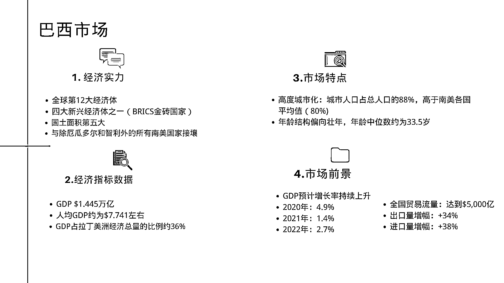

据 Statista 数据显示 Tik Tok 占有巴西社交媒体 50%的用户份额，巴西用户排名前五

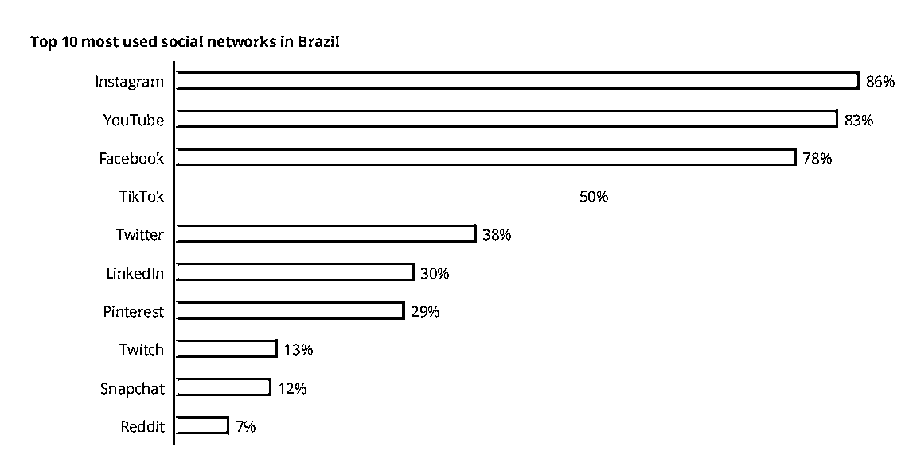

pipiads 数据观察显示，截止到 2024 年 2 月，全球 TikTok 广告受众排名中，美国位列第一，1.58 亿广告受众，印尼位居第二，1.4 亿广告受众，巴西排名第三，有 1 亿受众。巴西相比 1 月新增 180 万广告受众。

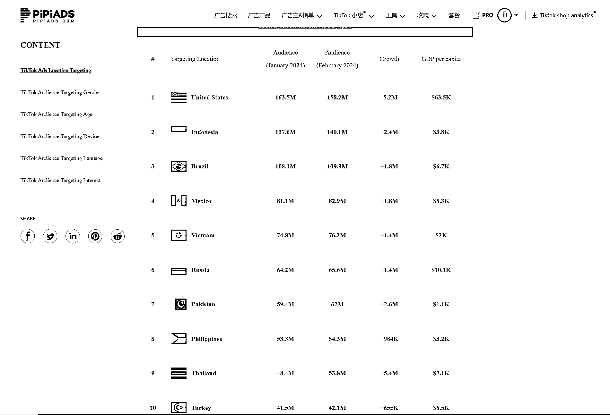

### 用户行为分析

巴西的 TikTok 用户活跃且参与度高，他们喜欢探索新产品、品牌故事和创意营销内容。用户偏好包括但不限于时尚与美容、健康与健身、家居与园艺等类目。通过深入分析这些偏好，商家可以更好地定位自己的产品和营销策略。

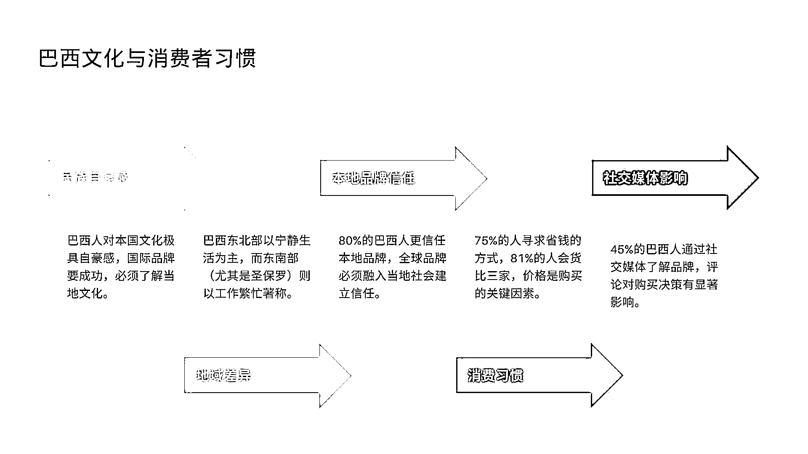

### 选品指南

巴西市场对于以下几个电商类目的需求尤为旺盛：

1.  时尚与美容：巴西人对个人形象非常重视，时尚服饰、饰品和化妆品等都有很好的市场。

2.  健康与健身：健康意识的提升使得营养补充品、有机食品和健身器材等成为热门类目。

3.  家居与园艺：随着居家时间的增加，家居装饰、改善和园艺用品需求增长。

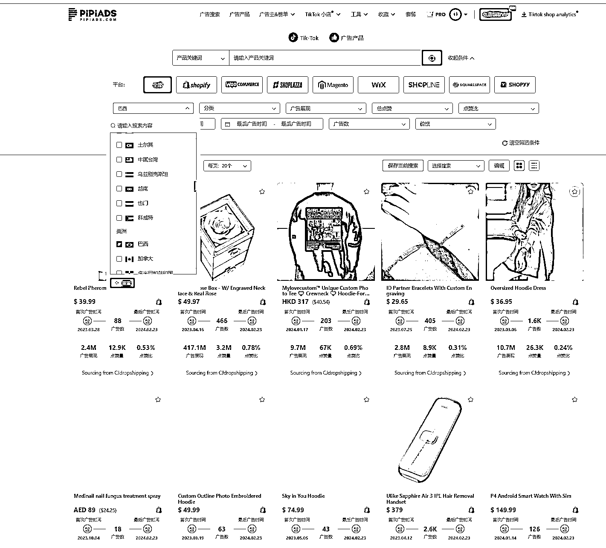

### 市场调研工具

有效的市场调研工具对于理解巴西市场至关重要。推荐使用：

1.  Google Trends：追踪搜索趋势，了解消费者兴趣。

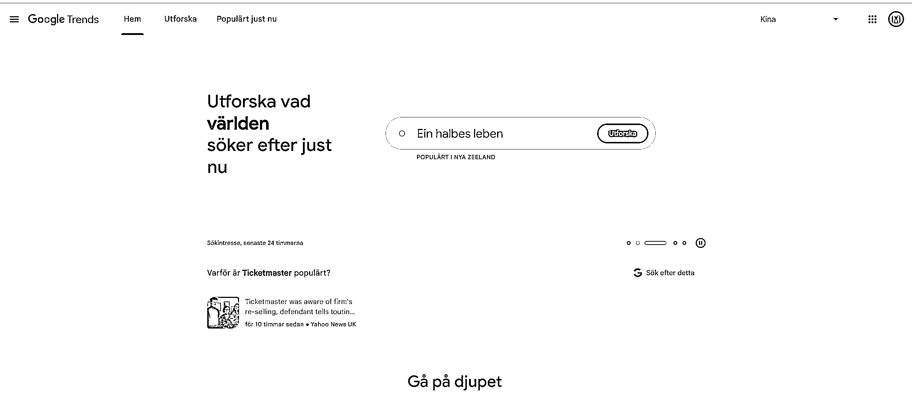

1.  pipiads：广告投放情况，流量来源和用户行为。

2.  各巴西市场电商平台：获取信息差。

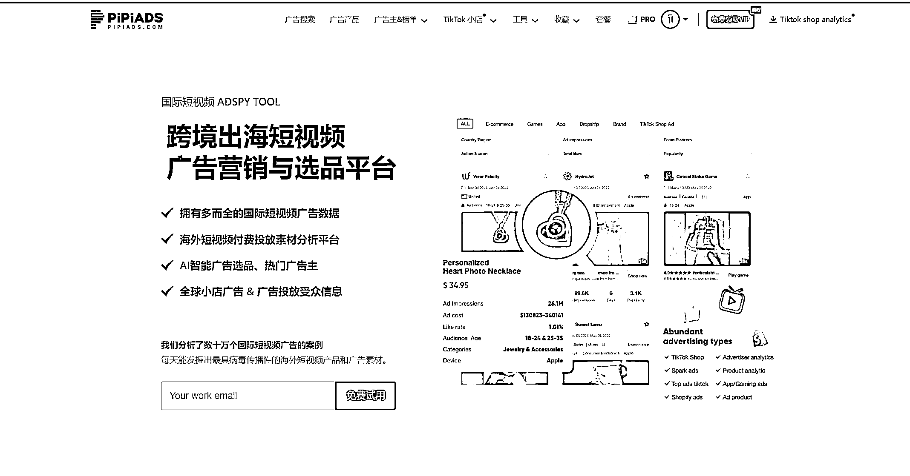

### 主要电商平台

在巴西，除了社交电商如 TikTok 外，还有几个关键的电商平台值得关注选品趋势和本地化需求：

1.  Mercado Livre：拉丁美洲最大的在线市场，涵盖广泛类目。

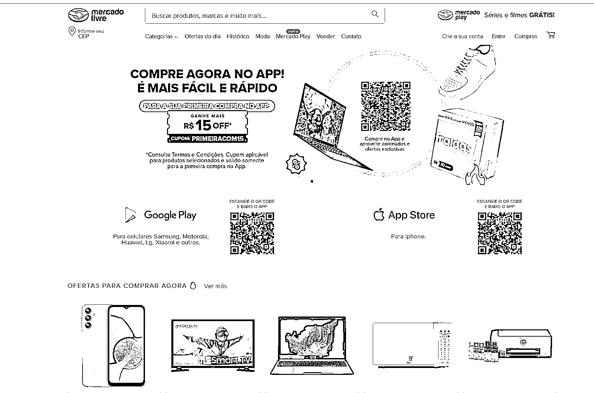

1.  Americanas、Magazine Luiza：提供电子产品、家居用品等。

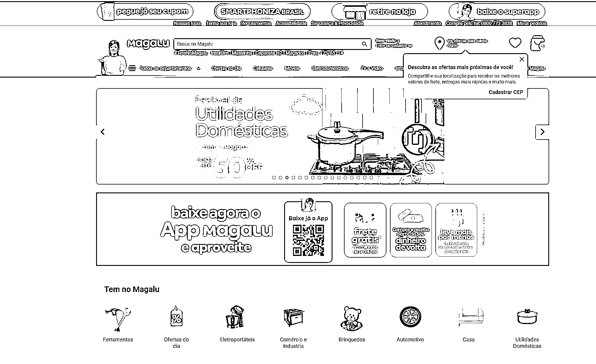

1.  OLX：二手商品交易平台，覆盖多个类目。

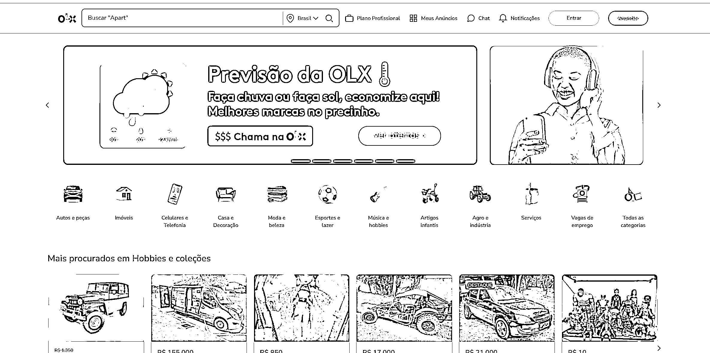

### 营销节点：

特定的节日、体育赛事、文化活动以及重要的经济日期。

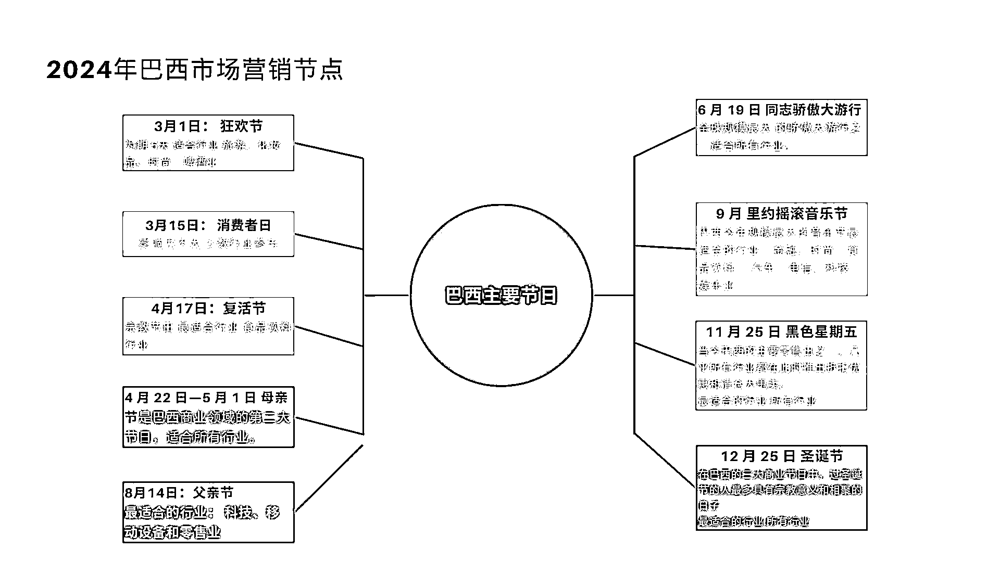

挑战与解决方案

#### 物流和供应链

1.  挑战：物流成本高，配送时间长。目前巴西市场有清关难及物流慢两大特点及难题，目前巴西物流慢和退货丢件率高也是众多卖家的心头刺。

2.  解决方案：建立或合作本地仓库，优化物流网络，目前据相关数据调研，如安骏物流早在几年前搭建出了一条巴西跨境小包直邮专线，国内电商轻小件进入巴西，由此拥有了一条最便捷快速的路径。在此之前，中国货物到巴西的时间是 30 天-90 天，安骏的小包专线上线后，在巴西主要的城市中，80％的货量能够实现 9 天-14 天送达，巴西中西部的物流时间大概在 14 天-25 天。

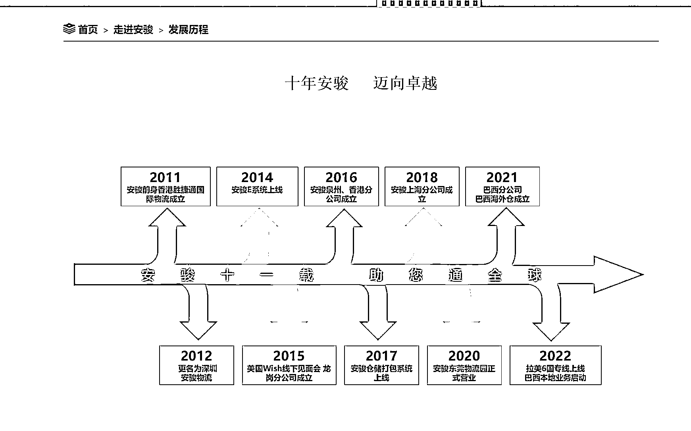

#### 支付方式

1.  挑战：支付方式多样，巴西消费者习惯按月分期付款，大多做巴西的网站都会表明全价及分期付款的金额。除了信用卡和银行转账，巴西还有一些本地的支付方式，如 BoletoBancário 和 DébitoOnline。BoletoBancário 是一种流行的支付方式，允许消费者通过生成和打印付款单进行线下支付。DébitoOnline 则是一种允许消费者直接从他们的银行账户进行在线支付的方式，Pix 也是巴西流行且快速增长的支付方式之一。由中央银行建造并拥有，通过动态二维码或代码复制工作，具体取决于客户的设备。过程简单 0 手续费并且即时到账，与国内的支付宝/微信支付非常相似，目前已有 70%的成年巴西人使用过 Pix。

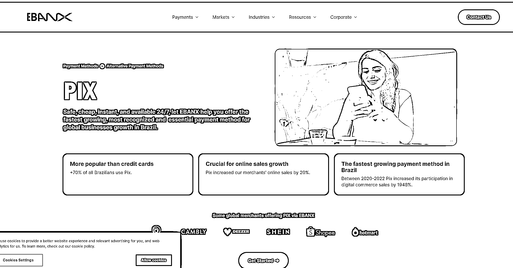

1.  解决方案：集成多种本地支付方式，提供灵活的支付解决方案。

#### 文化差异

1.  挑战：市场和文化差异大。

2.  解决方案：其实早在美国小店的整体爆发情况来看，后续巴西电商主力大概率还是通过达人生产内容推动商品带货，合作当地达人也是走出第一步最关键的制胜点。

#### 法律法规

1.  挑战：复杂的税收和进口政策，巴西税局 2022 年就开始发布一系列的文件，22 年 12 月 21 日，巴西联邦国税局颁发了 RFB 2124/2022 号规范性文件，对跨境电商入境包裹的规范申报做了具体的要求与规定，考虑到新的规范性要求涉及到政府监管部门系统与邮局及国际快递公司物流系统的调整与升级，新的规范文件给了 6 个月的过渡时间，要求在 2023 年 7 月 1 日开始生效。 2023 年 6 月 29 日，巴西联邦国税局又颁发了 RFB 2146/2023 号文件，确定了自 2023 年 8 月 1 日起对入境巴西的所有跨境电商包裹征收 17%的 ICMS 税（进口流转税）。 2023 年 7 月 25 日，联邦国税局又颁发了 DOU 130/2023 号标准操作类文件，对入境包裹申报与缴税的 PRC（合规缴税计划）方式做了规范性操作说明。由于操作性规范文件的颁布距离 8 月 1 日的新政生效时间太近，所以联邦税局与口岸海关在具体执行时给出了一个缓冲过渡时间，并鼓励各电商平台在这个过渡时间内完成向联邦税局申请 PRC 备案注册，取得 PRC 注册编号。

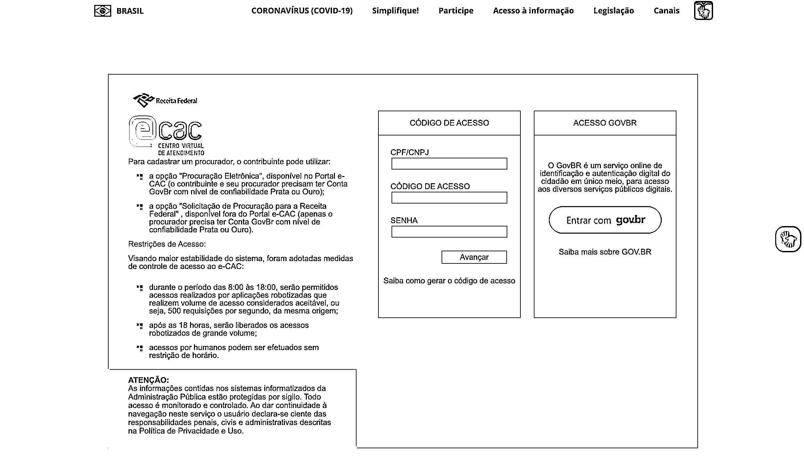

1.  解决方案：咨询当地法律顾问，合规经营。

巴西潜在市场机会：

年轻消费者主导巴西电商市场

巴西网购用户渗透各个年龄层，从 Z 世代到熟龄人群均有覆盖，平均年龄为 36~50 岁；女性消费者占比大（58.9%）

案例一：化妆品-护发素

投放广告展现 2.4 亿播放，售价 12 美金，预估拿货成本不到 5 块钱

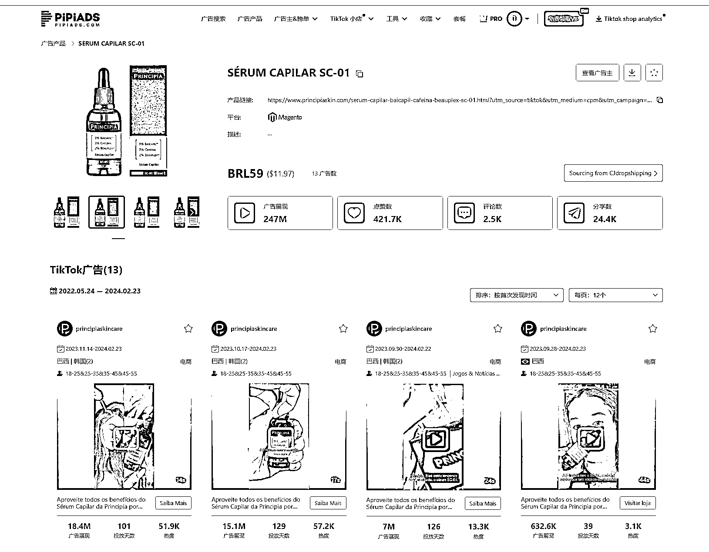

[`www.pipiads.com/zh/product-search/63983bac5602e34654467b24/`](https://www.pipiads.com/zh/product-search/63983bac5602e34654467b24)

1800 万广告素材：

达人真人露脸讲解+场景化刺激

暂时无法在飞书文档外展示此内容

极简的网站设计

产品图+描述+youtube 红人背书

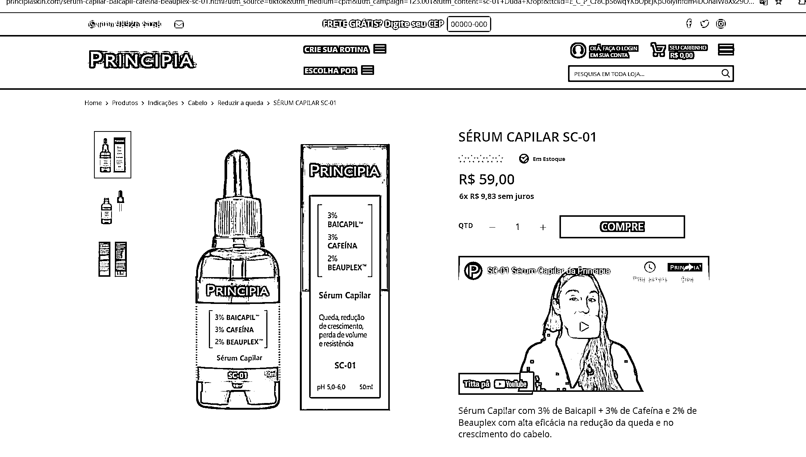

案例二：男装-纯色男士短袖

22 年投放到至今，1.1 亿广告展现，126 条广告

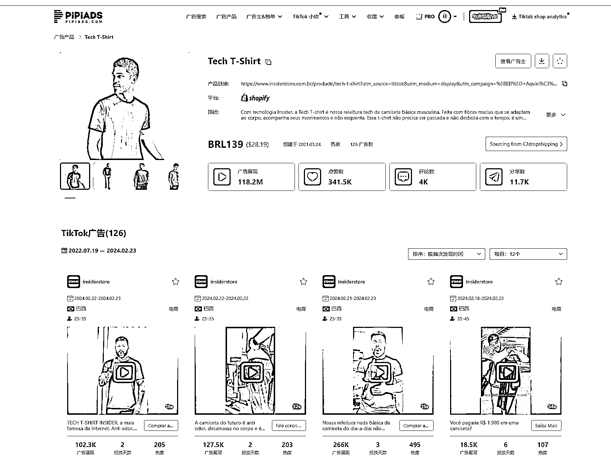

[`www.pipiads.com/zh/product-search/63078d3eaccc4615a5247375/`](https://www.pipiads.com/zh/product-search/63078d3eaccc4615a5247375)

1100 万播放广告素材：

本土化达人真人露脸讲解+场景代入

暂时无法在飞书文档外展示此内容

138 个 SKU，售卖三年

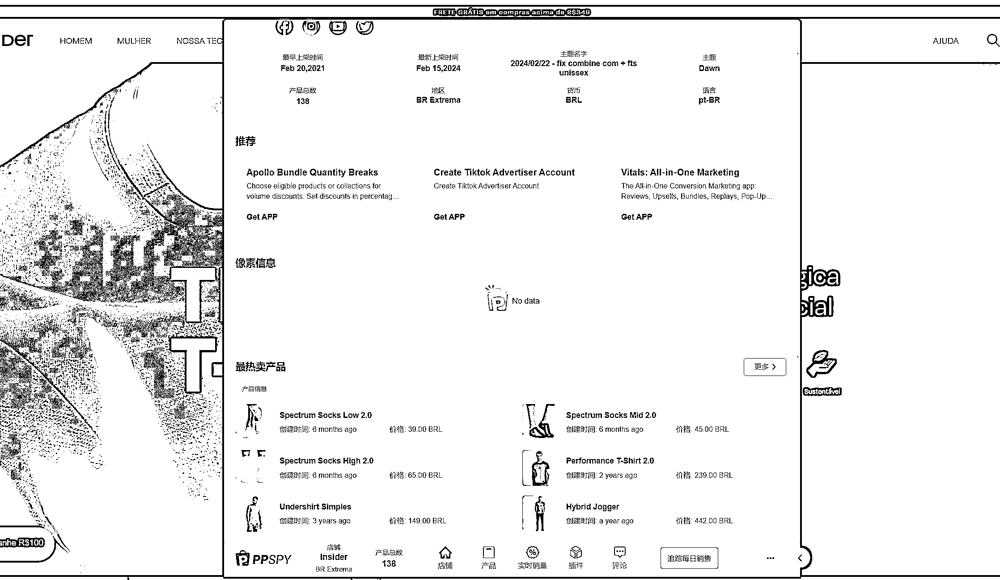

案例三：3C 电子-蓝牙耳机

1688 拿货￥9.6，售卖 BRL168，约$34

投放广告展现 4100 万

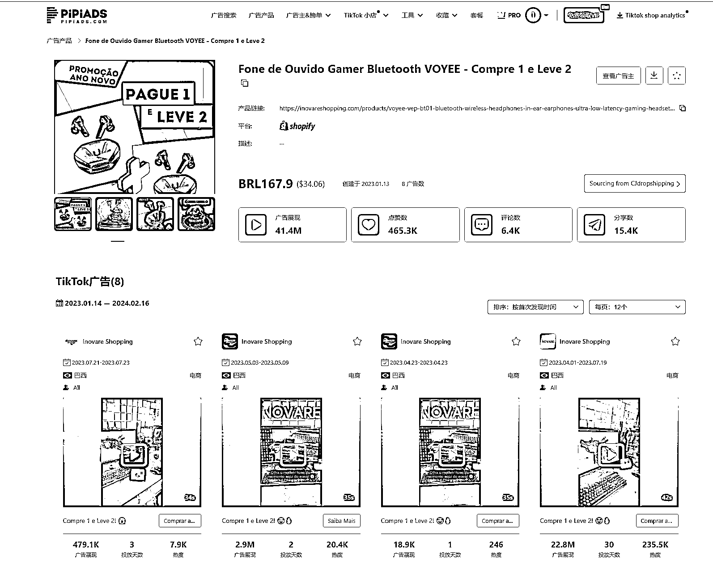

560 万播放广告素材

痛点展示+种草+解决方案+实物展示

暂时无法在飞书文档外展示此内容

案例四：宠物用品-狗便盆

广告展现 4800 万，广告数 21 条

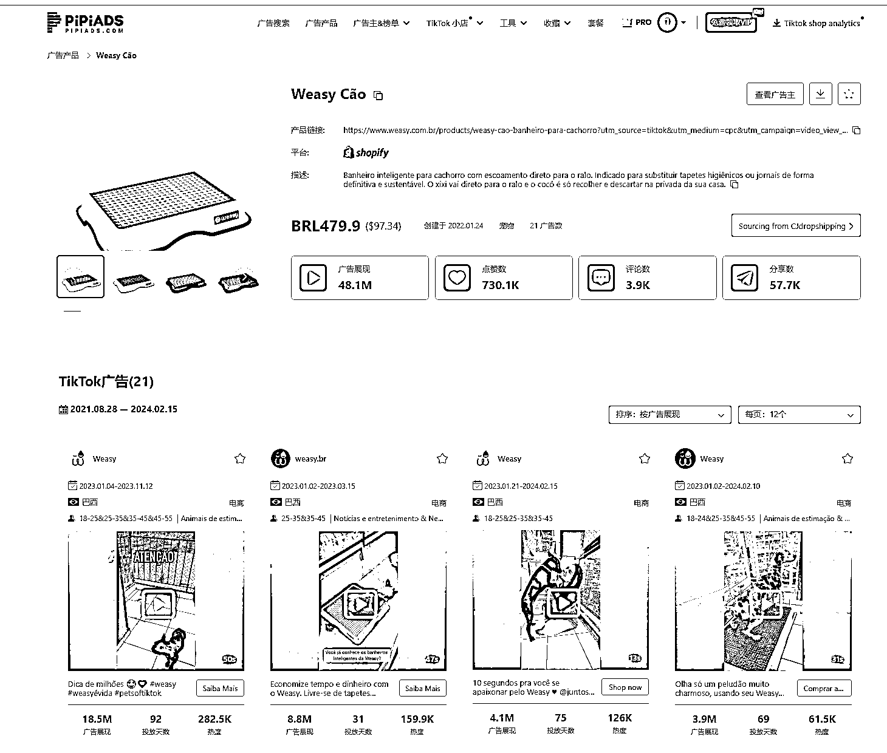

1850 万播放广告素材

痛点场景展示+解决方案

暂时无法在飞书文档外展示此内容

案例五：时尚-卷发器

2600 万广告展现，广告数 131 条 利润高旺竞争激烈

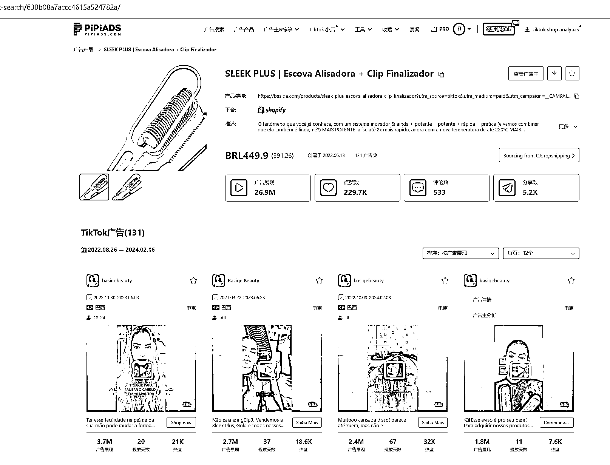

370 万广告素材：

利他+达人露脸+对比

暂时无法在飞书文档外展示此内容

总结：

整个巴西市场的电商潜力是非常惊人的，大家都在紧盯市场。

不过据皮皮观察，目前 TikTok 上线半闭环的内测，未必是一个入场就能捡钱的商机，再加上独立站也不是巴西市场的主力，也不是平台未来平台的发展主力，卖家需要解决的问题和难题将会很多，如本土化布局（支付 税 语言 消费习惯）

巴西市场的发展可以让子弹飞一会，全闭环上线需要时间。新市场新机遇新挑战。

2024 的重点可继续放在美国，更多的行业趋势可关注 PiPiADS 平台。

视频可移步飞书文档查看

[`za6kyadmdr.feishu.cn/docx/QKQ7dxu2DoLxCgxCX06cJOABn9b?from=from_copylink`](https://za6kyadmdr.feishu.cn/docx/QKQ7dxu2DoLxCgxCX06cJOABn9b?from=from_copylink)

* * *

评论区：

暂无评论

* * *