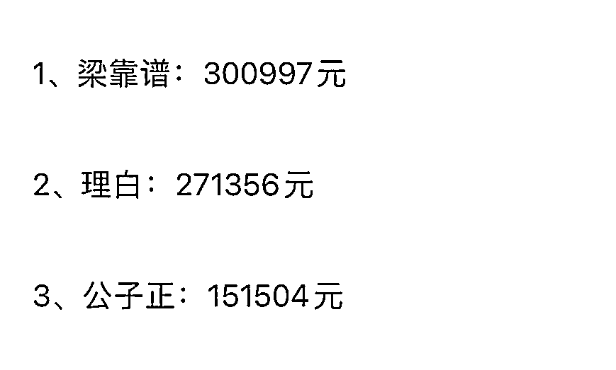

# 公子正：0 基础入行，自媒体半年变现 21 万，普通人如何被动成交客户

> 原文：[`www.yuque.com/for_lazy/thfiu8/wwp5ft6r3p8ggykv`](https://www.yuque.com/for_lazy/thfiu8/wwp5ft6r3p8ggykv)

## (29 赞)公子正：0 基础入行，自媒体半年变现 21 万，普通人如何被动成交客户

作者： 公子正

日期：2024-02-20

大家好，我是公子正。

非常荣幸，从我去年 9 月加入粥左罗老师的顶峰会，至今变现了 16 个 W（数据未更新），在粥老师的变现榜单上排名第三。

作为一个入行半年多，一文不名的小卡拉米，名字能出现在梁靠谱、理白两位大佬后面，深感荣幸。

加上我自己产品的收入，入行自媒体到现在，已经变现 21 万多了。

不过比起赚到这些钱，更开心的，是我所有为我付费的客户都是满怀喜悦，直接打钱，从未有一人斤斤计较，讨价还价。

很多朋友好奇，我怎么可以让这么多人，心甘情愿地付费。

我的偶像刘德华先生曾说：“得到的要给人，学到的要教人。”

接下来，我将为大家分享，我 0 基础入行自媒体，半年变现 21 万，让用户主动哐哐打钱的“高能收钱之法”。

本次分享分为三部分：

第一部分、销售的三重境界

第二部分、客户主动打钱的两个前提

第三部分、实现高能收钱的 5 个步骤

**√第一部分、销售的三重境界**

销售有三重境界：

第一重，是挣钱。

挣，意味着你很卖力，去争不属于自己的钱，那多半是挣不到钱，还搞得自己很累。

比如有很多销售新人，他们不愿花时间了解产品，精进业务。为了挣钱，要么拼命杀价返佣，要么向亲朋好友强推。

先说杀价返佣，不仅扰乱市场秩序，成单后还有隐患。特别是知识付费行业，都是非标品。如果客户认可价值，就会愿意正价买，如果不认可，即使你返佣让客户觉得占到便宜购买。但由于他始终没那么认可，没看到价值，第一个会怪你。到时你没赚到啥钱，还得落个埋怨。

再说向亲朋好友强推，恕我直言，这是没啥出息的做法。生意始终是建立在价值交换而非人情上的，像亲朋好友推销，先不说人家可能不给你面子购买。即使买了，这种生意又能持续做几单？

所以，做销售，别想着挣钱，辛苦不说，还没啥尊严。

第二重，是赚钱。

赚，又有哄骗的意思，意味着用套路，话术去获取客户的钱。

市面上这种销售很多，坑蒙拐骗，智计百出，和客户斗智斗勇。凭借虚假承诺，和精巧的包装，高明的话术，哄客户掏钱。

亚伯拉罕·林肯说过：你可以暂时欺骗所有的人，你甚至可以永远欺骗一部分人，但你不能永远欺骗所有的人。

这种销售，可能会有收获，但一定不会长久。

第三重，是收钱。

收，意味着容纳，聚拢和接受。

你要做的，是成为一部分客户打钱时必然的选择。让他们主动向你聚拢，而你，只需要接受他们哐哐打钱。

如此，客户开开心心打钱，你也潇潇洒洒收钱，两全其美。

以上，就是销售的三重境界。

**√第二部分、轻松收钱的两个前提**

为什么客户愿意开心打钱，你也能轻松收钱？

很多人觉得不可思议，其实只需要满足两点即可。

第一点、客户迫切地想要花钱解决问题。

第二点、客户是个有目标、有梦想、有未来的人。

**先说第一点，客户迫切地想要花钱解决问题。**

这个问题的本质是，我们在什么时候倾向于花钱解决问题？

我举两个例子：

问：

一个光棍，为什么给媒婆或者婚恋网站打钱？

一个卖不出去产品的菜鸟，为什么会找正正打钱？

答：

光棍打钱，是想要脱单，但靠他自己找不到，单身一年又一年，遭不住了。

销售菜鸟打钱，是为了赚钱，但他自己摸索会很慢，可能饿死还没赚到钱，受不了了。

我举了两个例子，大家应该能大概 get 到收钱的本质了。

**一个人心甘情愿掏钱，是因为：**

**1、他很痛苦，他想达到一个理想的状态。**

**2、靠他自己，他需要很长时间才能达到，或根本不能达到。**

正因如此，他产生了需求，如果有刚好可以满足他的解决方案，他就会迫切地想用钱来交换。

所以你看到了，收钱不是因为你技能多牛比，背景有多强，而是你有帮客户快速高效达到理想状态的方案。

举个极端点的例子：

比如现在有个人想吃冰淇淋，但不知道哪有。那么他不大可能为了一个冰淇淋，就去买台冰淇淋机自己做，更不需要你教他怎么做。

他现在最需要的，是有人拿一个冰淇淋，送到他手上。

而你也不需要会做冰淇淋，你只需要知道哪有，买一个交到他手上，或者告诉他去哪买，满足他的理想状态，获取你应得的报酬即可。

为什么能赚这个钱？

是因为你帮用户快速高效地达到了理想状态，节约了他的精力时间。

**时间是唯一的不可再生资源，而钱，在人的一生中，只是可不断再生的工具之一。**

如今这个繁荣的现代社会能正常运行，就是因为每个人都用自己的精力时间，去满足别人的理想状态。

当一个人想用钱交换你的产品，来满足他的理想状态，我们就说，这个产品有需求。

当一群人都渴望用钱来交换某一个产品或服务，我们就说，这个产品有市场。

我们人类痛苦何其多，所以这个世界上，每个人，每天都需要使用钱，去交换别人的价值，满足自己的理想状态。

正因如此，我们现在才能想看病就看病，想学写作就学写作，想去旅行就去旅行。

所以只要你能帮助客户从当下的不满意状态快速达到理想状态，而这个改变他自身又难以做到或根本做不到。

那你收钱，便是天道，顺其自然。

以上，是第一个前提，用户迫切地想花钱解决问题。

**再说第二点，用户必须是有目标，有梦想，有未来的人。**

有些人，对人生早已不抱希望，只想活一天算一天，衣食住行都不讲究，也没有想要完成的目标，那他必然不是你的客户。

有些人，巴不得所有东西都是免费的，能自己做就绝不花钱，5 毛钱一个的馒头都恨不得自己学着蒸，那他也很难是你的客户。

有些人，不懂得珍惜时间，为了吃上一个冰淇淋，宁愿自己研发机器，制作冰淇淋粉，最终花个几十年，还未必能吃上，这些人也肯定不是你的客户。

道德经有言：“天之道，损有余而补不足。人之道，损不足以奉有余。”

人类社会发展，靠的是每个人都贡献自己的价值，来满足别人的理想状态。

如果人类都不去创造价值，或者交换价值，大家只能回到石器时代，靠自己摘野果过日子。

所以你贡献得越多，才能收获越多；你若毫无贡献，连你仅剩的也会没有。

而上述三种人，不去创造价值或者不愿交换价值。违背了天道，注定会活在人类世界的边缘。

你在这些人身上下功夫，不仅浪费时间，还非常消耗能量。

就算千方百计赚到他们的钱，最终也难以服务：经常为了点小事不满的是他们，因为一点困难情绪崩溃的是他们，需要长时间心灵按摩的是他们，最后退费闹得你心力交瘁的也是他们.....

刘润说过：“别赚难赚的钱。”

那好赚的钱是怎样？或者说，肯爽快付钱交换价值的人是什么样的？

答案很简单：他们都是有目标，有梦想，有未来的人。

有目标，所以想要快点达成；有梦想，就会想要确定实现；有未来，才会舍得当下花钱。

无论做什么生意，都记住一条铁律：“去帮助那些本该成功的人成功，而不是做谁的救世主。”

只有这些有目标，有梦想，未来注定成功的人，才会开心掏钱，你也才能畅快收钱。

以上，是第二个前提，用户必须是一个有目标，有梦想，有未来的人。

**√第三部分、实现高能收钱的 5 个步骤**

“这个产品我要卖出去，需要专业、背书，销售技巧，赠送福利等等条件，只有这些全部具备了，我才能搞定客户，我现在还没有，所以卖不出去，还是算了吧。”

上面，大多数人没收过钱的新手的思考路径。

总觉得自己还不够好，看到很多人比你强的人在卖，觉得无力争夺市场，开始自我否定，导致拖拖拉拉，迟迟不肯动手。

我曾经也深深受困于自己的内心，不断自我否定，画地为牢。

但今天，我想帮你看清收钱的真相：

**你觉得难卖，是因为你不会卖，而不是卖货这件事对你要求太高。**

埃隆马斯克曾说：“行动力不足的问题，往往源于对事情路径认知不清。”

即便造火箭这种看似非常复杂的事情，只要掌握了 27 个关键步骤，也能顺利造出。

收钱也是如此，当你学会收钱，清楚明白知道如何吸引别人哐哐打钱，就会发现，销售这件事，专业和业余，明白和碰运气，注定是两种结局。

其实从不知道怎么收钱的门外汉，到成为一个收钱高手，收钱潇洒如吃饭，只需要五步：

**第一步，高能收钱主张。**

客户打钱，不是为了买产品，而是为了满足自己的理想状态。

我们能收钱，是因为我们给出了满足对方通往理想状态的方案。

这个方案，就是我们的高能收钱主张。

古代行军打仗，招募士兵，攻城略地，都需要人提着脑袋上，比让人从口袋掏钱难多了。

然而那些领袖，却可以靠他们的主张，来驱动这些人。

随便举几个例子：

刘备主张“匡扶汉室”和“保国安民”，换来天下英杰和广大人民群众支持。

李自成主张“闯王来了不纳粮”，让老百姓们早早开门迎闯王。

《东方红》最早的歌词里还有句“待到革命成功时，一人一个女学生。”虽然这个主张三观不正，但这句话在当时的杀伤力不言而喻。

**商场如战场，做生意要人拿着钱来找你，和打仗让人提着脑袋跟随你是一样的道理。**

你需要有自己的主张，将你和市场上的竞争对手区分开来，让你成为一部分人打钱时必定的选择。

举个例子：

前阵子在火车站，看到一家快餐店生意特别好，旁边冷冷清清，但他家顾客络绎不绝。

为什么这么豪横？一看门头我就明白他赢在哪了，上面写着“12 块钱吃饱吃好”。

这个主张一出来，顿时让周围某某热干面，某某水饺，快餐小吃都黯然失色。

因为他切中了那些出门在外，想省钱对付一顿的人的理想状态，成为那些人掏钱时必定的选择。

当然，其他快餐店也许也只要 12 元，也能吃饱吃好，但他们没有主张，这部分客户不知道，自然也不会有选他的理由。

同样功能的产品，有主张的比没主张的更有优势。同时，更贴合用户理想状态的主张，也自然会比模糊的主张更有竞争力。

当你有了独属于自己的收钱主张，就会成为一部分人打钱时必然的选择，吸引来真正乐于给你打钱的客户。

以上，是高能收钱第一步，高能收钱主张。

**第二步，高能收钱流程。**

谈客户时开不了口，收不到钱，核心原因还是不知道让客户开心掏钱的行动路径。

很多人都把成交当做攻略客户的游戏，这样的人要么智计百出，和用户斗智斗勇；要么害怕做错，不敢轻举妄动。

无论哪种，最后都会把自己搞得身心俱疲。

而收钱高手，需要的不是缩手缩脚不作为，也不是盲目进攻碰运气。

而是不断去和客户确认默契，等到成交的信号灯亮起，客户就会把钱交给你。

所谓确认默契，是指一种潜沟通，也可以算作一种试探。

就好像谈恋爱，不是盲目表白，无脑付出就能讨得对方欢心。需要不断校准双方关系，一步步推进，最终自然水到渠成。

收钱也是一样，是一个确认对方付费默契的过程。

只需先筛选出有钱买和有意愿购买的客户，然后引导用户主动咨询。

而我们，只需要帮助对方诊断问题，描绘出他的理想状态，并给出方案，引导付款即可。

如此，当你清晰知道从筛选客户到成交客户的完整流程，并不断精进，自然不会再自我否定，羞愧，尴尬，不敢收钱。

也只有成交流程可控，每一步皆在掌握，才能轻松收钱，不再为明天的午餐焦虑。

以上，是高能收钱第二步，高能收钱流程。

**第三步、高能收钱能量场。**

如果你不能被动地，成批地激活客户主动咨询，那每个客户你都得靠自己主动联系建立信任，一定会很累。

如果你不知道谁是会掏钱的大哥，那就得不断忍受客户的拒绝和白嫖，一定会很苦。

而被动收钱的高手，靠打造自己的能量场，并不断通过各种方式引潜在客户入场，筛选出乐意掏钱的客户，不说话、不谈单，就可批量一对多打造信任，主动成交。

只服务肯掏钱的大哥，那你必然心情舒畅，笑脸相迎；只需坐等客户打钱，那你必然不会尴尬，羞愧，拧巴。

那什么是高能收钱能量场？

可以是一个网店的详情页和评论区，所有能量集中在此处，百把块的产品，一个页面足以让用户直接掏钱。

也可以是一个公众号的文章列表，能量逐个向客户释放，层层叠加，千把块的东西，十几篇文章足以让客户付费。

还可以是一个上百条动态的朋友圈，能量持续高频释放，万元以内的产品，几十条动态足以让客户把钱交给你。

当用户来到你的高能收钱能量场，不仅会不断对你累加信任，屏蔽其他竞品。当需求被激发时，甚至会反复说服自己，给你打钱。

看过一部动漫，里面有小和尚法力低微，但只要念动咒语，张开结界。那么在他的场域里，即使诸天神魔也要法力尽消。

高能收钱能量场，就是属于收钱高手的结界。

以上，是高能收钱第三步，高能收钱能量场。

**第四步、高能获客渠道。**

什么是高能获客渠道？

就是让客户带着钱和想法，来主动找你的获客方式。

巧妇难为无米之炊，如果没有持续获取精准客户的路径，难免吃了这顿愁下顿。

一般的获客方式，如小广告、群推，流量裂变，日发千帖等等，引来的都是低价值流量。

有的躺在微信列表里从不吱声，有的时不时给你发点小广告，有的偶尔和你客套客套。但指望他们给你打钱，基本没戏。

不要对不能带来精准流量的渠道，抱有任何幻想。虚假的繁荣没有意义，没有转化的热闹也只能感动自己。

只有选对渠道，引对流量，才能实现顺畅变现。

而且最好是引流方式简单可复制，甚至半自动化。

当然，最重要的，是让你的客户主动来加你，向你诉说需求，这才是最好的生意。

如果你想有源源不断，给你哐哐打钱的客户，就得着手构建自己的高能获客渠道。

以上，是高能收钱第四步，高能获客渠道。

**第五步、高能提升自我**

孔子云：“德不配位，必有灾殃；德薄而位尊，智小而谋大，力小而任重，鲜不及矣。”

翻译成大白话，就是人永远赚不到认知外的钱，即使凭运气得到，也会凭实力失去。

一个月入过万的人，跟月入十万，月入三十万人的人硬件配置上可能相差不大，但思维上肯定完全不同。导致他们看到的世界不同，格局不同，行为模式不同，所以最终能获得的成就也就天差地别。

当我们开始收钱后，需要谨记，收钱只是路径，不是目标。我们最终是要靠足够的金钱，去实现自己的理想生活。

钱这东西，在吃饭成问题时，重如泰山。但在不再为三餐发愁后，它就只是和社会置换资源的工具。

收钱即修行，在这个过程中，我们要学会用钱，去持续提升自己眼界、格局，思想层次。

比如怎么遇见人生中的导师和贵人；怎么成为圈子里的核心人物；怎么在自己的领域里，建立起个人品牌。

周易有云：“同声相应，同气相求。”

**随着思想层次越高，你看到的世界，吸引的人，身边发生的事都会大不一样，你做成一件事的难度也会越小。**

你会从一个小范围开始，不断建立权威，建立影响力，打造自己的品牌效应。让客户只要一想到要解决某个问题，就会想到找你或者向别人推荐你。

到时你可以像明星一样，别人主动想要认识你，想要跟你去做朋友。别人成为你的客户，还会觉得自己真是太幸运了。

这时，你就拥有了可以持续深耕的事业。

当然，这条高能提升自我之路没有尽头，我也还在路上探索。

**比起最终我们是否能成为某个领域的大咖，或者行业领袖。更重要的，是我们一步步摆脱自身的狭隘、懦弱、自我否定，实现自由富有的生活。**

以上，是高能收钱第五步，高能提升自我。

最后，再送给你一句话：“将欲取之，必固与之。”

**当你把爽快打钱当成理所当然，吸引来的自然都是爽快打钱的客户；当你把成就别人当做习惯，也会吸引来成就你的贵人。**

希望这篇分享，能让你哐哐收钱，也能哐哐打钱，等你报喜～

* * *

评论区：

小凯 : 学习了！
小凯 : 我接着评论表示二刷了，应该不过分吧[呲牙]

* * *