# 围绕“人群”做生意有多香？我做了 7 年海外留学生的私人营养师

> 原文：[`www.yuque.com/for_lazy/thfiu8/gckygplkst4u2pi8`](https://www.yuque.com/for_lazy/thfiu8/gckygplkst4u2pi8)

## (32 赞)围绕“人群”做生意有多香？我做了 7 年海外留学生的私人营养师

作者： 美国 RDJingle

日期：2024-02-23

说到营养师，大家第一时间想到的可能是铺天盖地的考证广告。

当然，这份肯定不会像广告描绘得那么完美，就像每一份工作一样，它有门槛、需要积累。

这是我做私人营养咨询的第 7 年，已经实现时间自由、地点自由、月入 3w 保底。

我自己是不做社群的，也不做单次咨询，前者是不擅长，后者是没效果。在这种情况下，我的收入来源，90%都来自私人咨询，一个月的指导价格是 2450。全靠我一个人服务，没有团队。

目前客源主要来自小红书和播客，我会在上面发一些会营养科普和个人生活，进行深度种草，吸引来的客户磁场相吸，信任感也更强。

我很建议你的客户群体，是和你生活条件相似的人群。就像我自己是留学背景，懂白人饭，会做全英食谱，因此我的客群是 18～35 岁为主的留学生或者有海外生活经历的人，服务起来很顺畅，甚至不少人还能成为朋友。

今天就来分享我在这个行业的经验与感受，给想入行的朋友多一些参考。

大家好呀，我是 Jingle，美国注册营养师。

我做私人营养咨询第七年啦，现在已经实现月收入至少 3w。我在这个行业有些经验和感受，如果你是对私人营养师这份工作感兴趣，考虑入行的朋友，这一篇内容对你也许有帮助。

私人营养师是一个能实现时间、空间工作自由的工作。许多自由职业者、数字游民都在做这个工作。当然，它也很适合作为兼职，给你增加额外的收入。

当然，就像每一份工作一样。它有门槛、需要积累。

我整理了一些入行干货，内容包含：

一、入行资质门槛

二、私人营养服务产品设计以及定价策略

三、服务流程和形式参考

四、宣传方式

五、联系目标客户

六、优化服务内容

七、其他避雷的建议

一步一步做完以上准备，那就等着收钱包到账吧！

## 一、门槛和建议

**（1）资质**

因为私人营养服务是一个专业类型的咨询服务。所以自己是需要具备专业受训背景的。你的结果体现可能是**一个受行业认可的证书**或者**一个专业匹配的学位**。

专业的私人营养师，是需要时间的积累的，一定不是在社交媒体学了一些方法后就能去教人的。因为社交媒体上的很多饮食建议都是错误的，比如：健身需要补充蛋白粉、不吃晚餐减肥、靠运动减肥、一定要吃早餐、增加体重是为了提高基础代谢。

唉，错误的信息数不胜数。如果在社交媒体学习，或者任意在网上买课学习，再去自己服务客户，这是不负责任的，也不能熬过时间的淘汰赛。

1.  **如果你在留学：**美国、加拿大的注册营养师的资质是最难获取的，受训过程也很严苛，比较硬核。澳大利亚和日本的注册营养师也好。如果你有海外注册营养师，大部分是可以回国就直接拿到中国注册营养师的证书的。

1.  **国内学习/转行：**中国的营养师很有多种，比如公共营养师、注册营养师等。因为我已经有美国注册营养师和美国专家的认证，我就没有再深入了解中国营养师的证书类型。如果你感兴趣考一个中国的营养师证，可以在其他渠道了解，我相信很好找。

如果你资质已经准备好了，那我们开始继续下面的内容吧：

## 二、个人 2023 年私人营养师服务收入情况

选择收款方式，是我们要做的第一步。

客户怎么买单方便？你怎么记账方便和正规？

我在 2023 年 7 月注册了自己的一人公司 - 杭州金钩营养服务有限公司。并且在 8 月份开始我提供的所有私人营养师服务的费用都是用公司的公帐账号来收款的，实现平均月入 3 万以上。

从个人收款转为公司收款，这是为了更方便管理自己的这一部分收入，也为了自己的服务产品越来越正规，慢慢从小作坊走向正规市场游戏。

以下是 2023 年下半年我做私人营养师工作的收入情况。

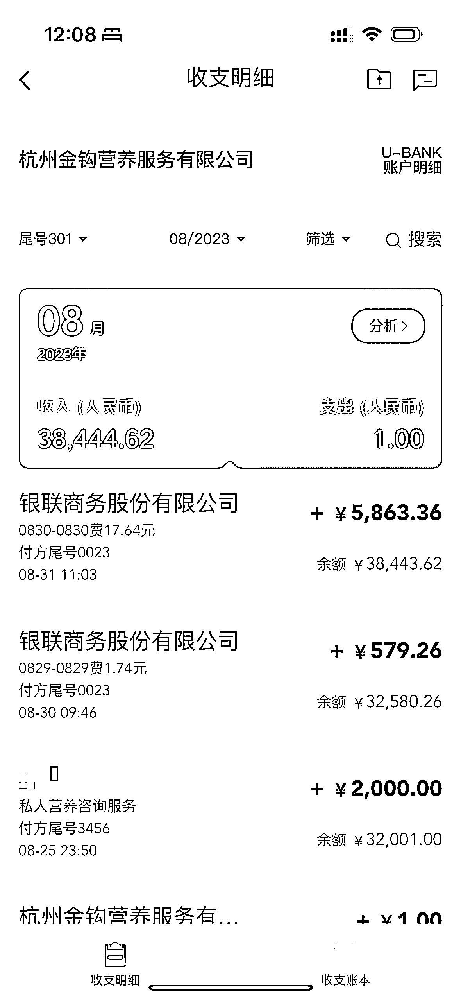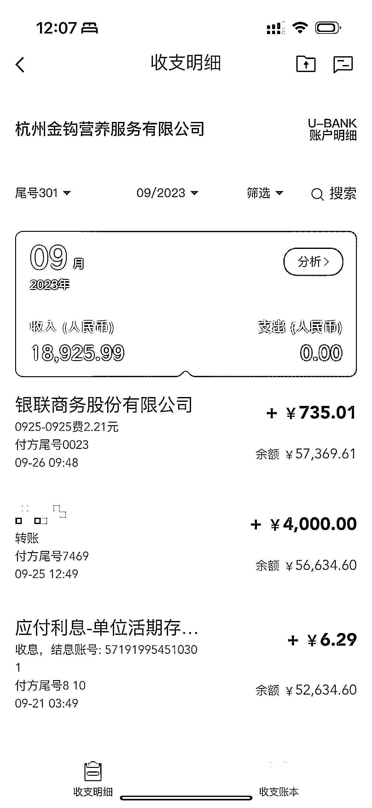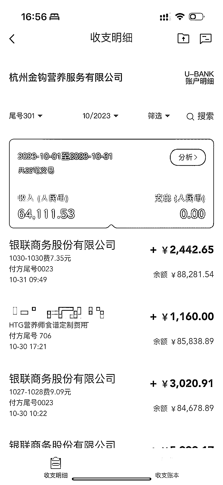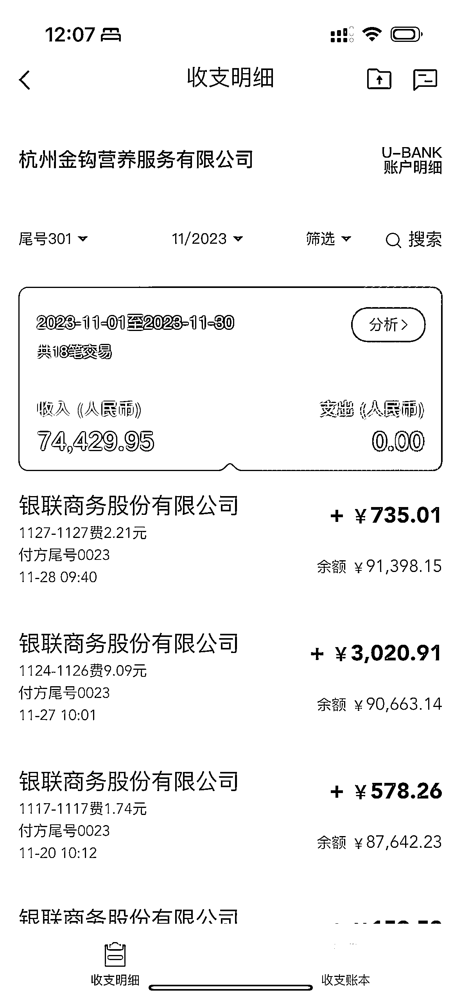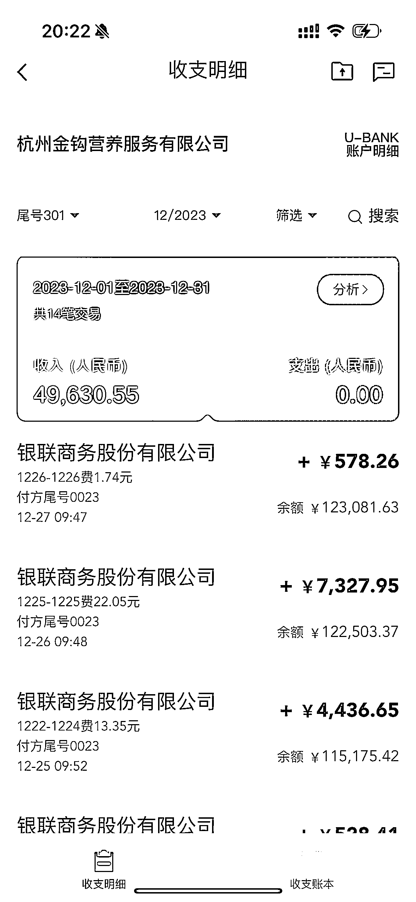

客户当然是微信、支付宝付费最方便。所以要实现这一点，我们需要一个收款码。

**和第三方收款合作：**

因为公帐没有收款码，转账收款让很多客户付费不方便，所以我与第三方收款合作（银联商务），给我做了一个我公帐的收款码。

我就用这个收款码来收款，客户可以用微信或者支付宝扫码支付，让客户用熟悉方便的付款方式付款。我的公司账户会在第二天收到所有前一天的收入。

在这个过程中会损失一点费用（银联商务服务费用+银行服务费用），但是我现在收入少，所以“nothing to lose”现在摸清楚所有流程，比以后客户量大了或者有其他更多商务了忙起来再去熟悉，要好多了。

我也还会继续了解其他更好的方式，减少没必要的损失。

**收入情况：**

私人营养服务（90% ）>课程培训费（10%）

私人营养师的服务形式是知识付费，私人营养服务是占我收入的一大部分，其次是偶尔和一些机构或品牌合作，教授内部的营养培训课程。

每个人的收入情况不同，这和你的服务产品有关。

下面就是设计你的服务产品。

## 三、如何变现

**（1）设计服务产品，增加收入**

由于私人营养服务的主要形式是咨询付费，所以要让自己的有限单位时间最大限度的获得价值。

这无非是 2 种形式：

1.  高客单价，做精致客户服务。

2.  低定价，走量。

结合个人优劣势情况分析，我不适合走量的服务方式（主要不善于群运营，或者卖课）。

私人营养服务可以有很多种：付费社群、单次咨询服务、定期回访跟踪、每日跟踪指导、私人食谱定制、营养科普课程、家庭烹饪营养师、讲师等。

考虑到要最有效的使用自己的时间，我做了以下几种考虑：

**1、不提供单次咨询服务。**

1.  单次咨询很少能真正解决客户的问题，还需要一个结构性的方案，比如食谱。也需要向教练一样在饮食问题发生的时候，营养师的陪伴指导解决真实问题。

1.  因为有微信联系方式，不好避免客户后面追问，时间不好计算，客服工作是负担。

1.  40 分钟/1 小时营养咨询的通话和视频，一段时间完全只给一个人，是私人营养服务的天花板。

**2、我也不做社群。**

1.  我是做知识付费的，社群里的咨询问题，很难避免。如果我都在社群里回答了，也会减少和我买单 1 对 1 服务的客户。

1.  营养是很私人的，每个人的情况都不一样。在社群中给一个人饮食建议，很容易出现“住户群”的杂乱现象。

1.  让你的客户都互相认识，并不是一件好事。（当然，这是我的客户群体，和我个人的运营情况。如果你能更好地运营社群，那也很好。)

1.  定期回访跟踪：过往工作经验告诉我，这是一个客户流失率很高的服务方式。pass.

我试过不同的服务形式，到目前我只主要提供 2 种：**每日跟踪指导的私人营养师和私人食谱定制。**

1.  每日跟踪指导的私人营养师：由于是线上服务，没有地点限制。我可以在一天服务多位客户。我不把自己的一段时间只限制给一个人，我就有更大的客户容纳能力。目前最忙的时间，也就是一日三餐客户打卡的时间。同时，我的客户在不同时区，找我的客户分布在不同时间段。我也不会在某一时间点过于忙碌。

1.  私人食谱定制：在完成营养评估后，用自己有空的时间做 30 天的私人定制食谱方案是一件比较容易的事。因为我的服务是单次交付，也很轻松。后期没有客服类工作。

1.  课程：偶尔会有品牌找我合作，做内部专业知识培训。

1.  做专业培训课：一个小时的内部培训课程收入是 1500。有时候是 2000。

1.  偶尔会做一些品牌的内部培训。做专业培训课：一个小时的内部培训课程收入是 1500。有时候是 2000

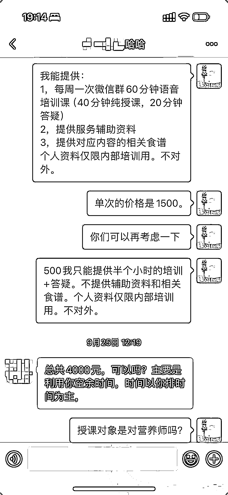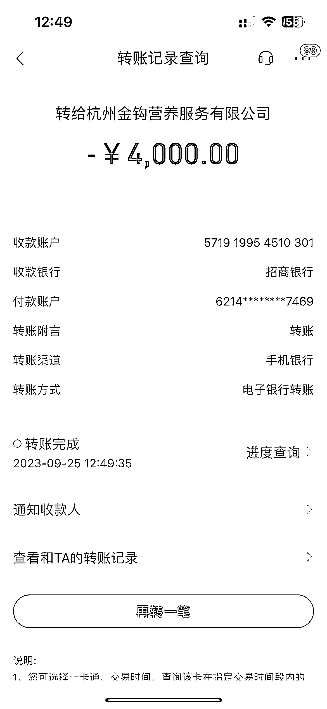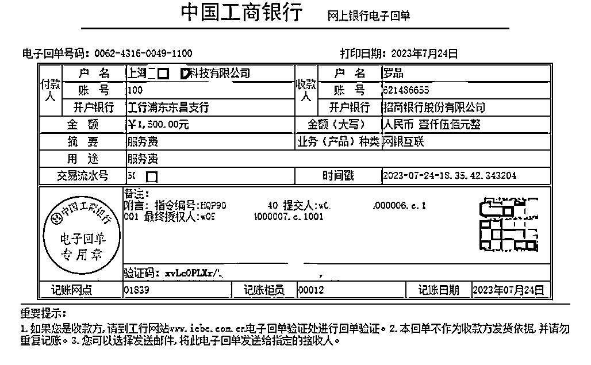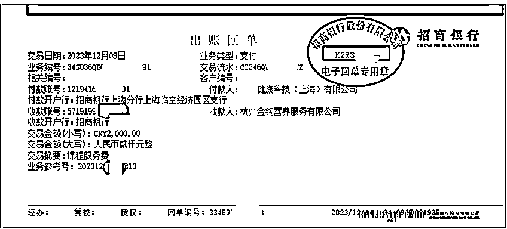

这些是我近期做的品牌内部培训的课程收入。

通过对服务形式的挑选和不断更新，我创造了最适合自己的服务产品，在有限时间内，最大限度容纳更多客户，相对高的客单价，这让我的收入还不错。

**（2）我的私人营养服务介绍**

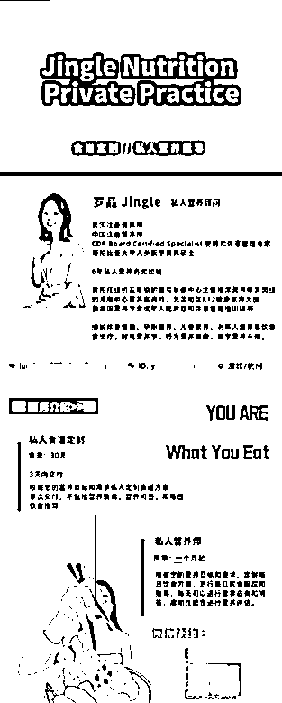

1、私人食谱定制服务会根据你的需求和情况，定制 30 天的食谱。食谱可以循环使用。在付款后，我会给你发送一个信息收集问卷，了解你的基础情况，问卷内容很全面。

如果有补充信息也可以和我留言。收到你的问卷后开始为你私人定制食谱方案。这个服务不包括营养咨询和问答，也不包括每日膳食跟踪指导。价格是 580。

2、私人营养师是长期跟踪指导的服务。周期为 30 天，包括每日饮食方案定制，每日膳食跟踪指导，可以随时进行营养咨询问答，还有定期的营养评估报告，这一个服务一个月的价格是 2450。

我之前还有一个 14 天的食谱定制，价格是 360。不过目前我只提供 30 天的食谱定制，价格是 580。

我目前不买产品，因为没有遇到好的食品合作。偶尔我会帮客户买一些西梅汁。我的公司也有食品经营许可证。后期有合适的食品产品，也可能会加入，来满足我客户的需求。

**（3）服务折扣**

老客户会有折扣，我和续约得越多的，当然折扣更大。

新客户一次约 3 个月或以上的也会给折扣。

我不会打折促销，因为我的每一个服务花的时间和精力都是一样的。节假日定的人多了（万圣节和春节前是我的旺季），客户只能排队。

私人营养服务的价格只会越来越高，这会随着营养师的经验积累和继续深造，让价格越来越高。因为不断学习和丰富服务经历的营养师能提供更好的私人服务。

现在你设计好了你的服务产品，那要给他们标价格了。

这个价格只会上涨，不会下降。

随着你的经验积累，客户量的累积，你只会越来越值钱。

**（4）定价参考方式**

定价，你可以首先找 2～3 个和你资质相似的同行，对比同行的情况和你的情况，再定价。

以下表格中的因素是通常会影响价格的因素。

比如，同行的咨询经验比较多，因此你的定价可能比你高一些。当然，这些因素会是一个 combination，需要综合、理性、客观的考虑。

价格不是一成不变的。你的经验累积会让价格合理上涨的（这一行干得越久越香）。

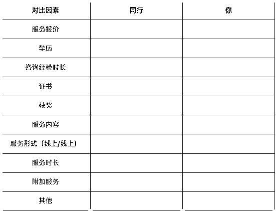

这里我希望同行们都直面沟通，欢迎友善交流。

因为这个圈子很小，会在圈子里有了解。请不要假扮客户去打探其他同行的服务情况，请尊重同行们的时间和工作成果。

我非常希望这是一个良好正直的行业。

现在，你的服务设计完成了，价格也确定了。那么，具体工作怎么完成？用什么工具？是否需要购买什么软件。

以下是我在工作中用的工具，和我的服务形式。一点不 fancy，但是成本合算，非常够用。

## 四、服务形式

我试过很多服务平台，包括国外和国内的。试了一轮，踩了无数坑，目前我觉得一个微信就够了。

1.  和客户的咨询沟通 - 用微信

2.  咨询服务报告 - 用飞书

3.  定制食谱 - 用 excel

我全部服务，目前都在线上提供。大部分情况用微信文字沟通，在客户有需要的时候可以和我视频或者语音。

**服务流程是：**

1.  提前支付全款费用

2.  发送信息收集问卷了解情况，进行沟通

3.  定制方案

4.  进入服务

万事具备，只欠客户。客户怎么来？还需要你曝光自己，做宣传！

感谢现在新媒体时代，让我们宣传自己变得特别容易。

## 五、服务宣传

我目前在做宣传的主要地方是：

1.  小红书：美国注册营养师 Jingle

2.  播客节目：《营养不营养》

我大部分的客户群里来自小红书，也因为我导流现象太明显给平台发了 2 次 14 天禁言。我后来参加了生财有术的小红书航海才了解到一些安全导流到方法。目前还算良好。

小红书我更新的也不频繁，会发一些营养科普，也用来展示自己的资质。客户找到我是因为我发过介绍私人营养师服务的内容和介绍我自己资质的内容，通过搜索找到我的。

现在发现播客是个更适合我的平台。我在播客中能讲得更多，给潜在客户深度种草。

我的播客不单单讲营养，还分享了自己生活，让听友更了解我是什么样的人。如果听友听完，喜欢我相信我，我们的合作当然会更舒服和顺利。

客户和营养师互相的磁场是非常重要的。

客户要喜欢和相信这个营养师很好理解。营养师也需要相信客户，因为这是一个双方合作配合的过程。

我是只要客户愿意相信和配合我，我会同样相信和配合他。所以播客是一个更便于我和听友互相过滤的工具。

如果你用视频号、抖音、微博等平台，也完全没问题的，主要是选一个你最会玩的平台。

## 六、我的客户群体

我的客户群体比较特别，是 18～35 岁为主的留学生或者有海外生活经历的人。

这和我本身的情况有关。

我自己也是留学生出身的，从高中开始在美国读书，然后研究生毕业后在纽约参加工作。

我从高中开始就在积累与健康食物相关的工作，来积累经历申报大学和专业。

我大一就是食品和营养专业。在美国的求学非常看重学生的实践能力，所以我在高中开始就是在和健康食品打交道了。大学继续做营养研究和相关的工作积累经验，申请营养师实习和研究生。这培养了我对一切有关营养和食品的信息敏感度。

在美国成为注册营养师最难的部分就是需要通过一个至少 1200 小时的受训和实习。在美国面对所有营养学生，这个实习申请通过的概率是 50%，申请过程就和国内高考填志愿是一样的，是需要双方互选 match 上的过程。

除了看你的学业成绩，还要写文书，看你的工作经历简历。完成了这快一年的实习学习，才能坐在注册营养师的考场完成考证考试。

我是在 2018 年考取的美国注册营养师证 RDN、2019 年在哥伦比亚大学医学院中心获取硕士学位 MS，在 2023 年作为中国第一位考取美国跨学科肥胖和体重管理专家证的人 CSOWM。

这是需要持有美国注册营养师资格 2 年以上，并且有相关的 2000 小时以上医学营养服务经验，还需要有人推荐，通过美国注册营养师委员会的审核通过后，才能参与考试考证的。

这些字母是会一直跟着我的名字后面的，是资质的认证，便于客户、患者、医疗专业人员识别。

我的签名完全写出来是：Jingle Luo， MS， RDN， CSOWM

我的这些认证和个人经历，也吸引了相似背景的人成为了我的客户。

我更能理解“白人饭”的需求，了解在海外的生活，也可以做国外食材全英文的食谱，也有资格 referral 客户给其他健康专业人士，比如心理咨询师、言语治疗专家、物理康复治疗师、糖尿病管理专家等。

我第一次接触到我的首批客户是在我刚拿到美国注册营养师，我发了朋友圈，有朋友们看到后来和我做营养咨询。这些朋友们也都是留学生，他们在体验了我的咨询服务之中，会口口相传帮我介绍。我也会在一些留学生群里介绍我自己。

我后面接触到更多客户是在疫情期间，2019 年底。

当时美国疫情开始，留学生之间有很多疫情互助群，我也在这些群里。

有人需要心理咨询，有人需要营养咨询，我也在社群里介绍我自己和我的服务。当时我的私人营养服务也就一下子打开了。

**（1）客户目标**

我建议你“定”的客户群体，是和你生活条件相似的人群。

这就像，我不建议觉得营养咨询服务费过高的人，来购买我的服务。因为这会沟通很困难，而且服务效率低。

一个例子是，我在帮助客户重新培养和食物之间的关系，在锻炼对自己饱腹感的认知，吃到 8 分饱需要停下来的时候。

一个客户舍不得浪费食物，已经吃到 8 分饱，也要吃完全都东西。尽管我和客户说了，我会根据他这周的食量情况，调整下一周的方案减少浪费。

如果我的咨询服务费是需要他克扣自己其他生活部分省出来的，我是不建议他来做这个服务的。因为一定会有心理压力，并且会影响饮食行为。其他例子也有很多，我不在这里讲故事了。

我举过一个例子。就像你买了一个对你来说价格过高的贵妇护肤精华液。说明书建议你每天用 3 泵才会有效果，但是因为你觉得他太贵舍不得用 3 泵，每天只用 1 泵，到最后用完了也没有护肤效果，还浪费了一整瓶精华液。

不仅你的客户要匹配你，你也需要匹配你的客户人群。

我在刚回国的时候加入了一个营养师学习群，我看到了几次，群友说想做营养师，因为这是服务“富人”的行业。我相信很多人对这样行业有误解。

这个思维方式，在我看来是不切实际的。

如果你想服务比你收入高许多的“富人”，你怎么保证你的思维方式和他们匹配呢？

私人营养服务是需要和客户紧密沟通，合作的工作。并且提倡“以客户为中心”的服务，满足客户的要求。如果你的生活和客户的生活差的太多，你在定制食谱方案或者在咨询给建议的时候，客户的体验感不会太好的。

因为你很难站在他的情况，用相似的思维思考，并且做出合适的饮食方案，提供合适的建议。

所以，我的建议是，你的服务定价，需要是你自己支付这个费用觉得没有负担，不会影响你的生活质量，你才更容易吸引和你生活水平相似的客户群体。

我的客户群体，和我的生活背景是相似的。收入水平也相当，所以我们能很好的沟通，也更容易建立信任度。并且有可能成为朋友。

## 七、如何做到让客户满意

因为我最擅长的就是体重管理服务，大部分找我的客户也都是需要体重管理的专业帮助。

在服务开始之前我会先给客户预估他如果按照方案来吃，一个月会达到什么样的效果，减去几斤。

我预估的结果是以客户能做到 80%的方案来计算的。如果客户能 100%按照方案来吃，那最后的到的效果会超过预期。

我会给客户做体重变化的计划，用曲线图和图表的方式呈现，精准到每一天体重变化的参考（这是我的服务细节部分，这里不展示了）。

我 90%以上的客户都能达到减重目标。

我的营养服务价格不算低，所以进入我服务的客户大部分都是做好了为了目标而改变的准备，配合有效的方案就能达到目标。

在我每日跟踪的私人营养服务中，我要求客户给我每天打卡饮食沟通，遇到任何问题都可以和我联系咨询。比如突然要外食，加班没时间吃饭，应酬吃多了，需要家庭聚餐，情绪性进食的发生等。我的客户可以随时联系到我。我会指导我的客户怎么做，和之后如何做体重补救。帮助客户回到计划的体重轨道上来。

因为我们是人，生活有变化再正常不过了。我的工作就是根据客户的生活变化给他出谋划策。

每日跟踪指导的服务是一个月起，我会至少每周更新一次饮食方案，做一次营养服务评估。记录客户的体重变化，用客户新的体重来重新计算客户的基础代谢和每日减重能量需求，再定新的方案。

根据客户这周的饮食适应情况来计划下一周的方案。这个服务的效果也比一次性定制 30 天的私人饮食方案（我的另一个服务）的效果要好。

在和我打卡沟通的过程中，我的客户也在学习如何面对生活的变化，如何调整饮食，重新建立和自己身体/感受到链接，培养自己对饮食和体重的掌控力。

我们想要有对自己体重/健康的掌控力。无非就是如果今天多吃了，我后期如何健康的为自己调整？在被迫外食的情况下，如何掌控食物选择和食量控制。

当然，也有没有达到计划目标的客户。

也因为在服务中需要客户每日进行饮食打卡，如果客户吃了方案外的东西，也是有记录的。如果客户没有做到多吃了之后的饮食调整方案，也是有记录的。这是营养师对自己服务的 back up。

这也是给客户自己一个反馈，他在这个过程中，他能了解自己做了多少努力？对方案依从性有多高？是否能做出改变？

在服务中做好记录，是对客户的负责，也是对自己服务的保护。

**（1）从副业到主业**

在 2023 年 8 月份之前我的私人营养服务还只是我的副业。我在这之前是有一个自己的本职工作的。

因此，我也不建议你一开始就辞职，让私人营养服务变成你的全部工作，因为前期收入可能少和不稳定。我是在主业工作中慢慢培养和积累自己的客户的。当客户量到达你不得不在主业工作时间中用至少 20%时间回复客户信息时/做食谱方案时，你就可以开始考虑将这份工作作为你的主业了。

我的第一份工作是做临床营养师的工作。当时工作时间是 7：30am 上班，下午 15：30pm 下班。当时这个过早的下班时间，让我还有大半天的空闲的。我对营养的热情一直很足，我还想再利用自己多余的精力做点什么。

所以我开始在下班后提供营养咨询服务。如果你的主业让你下班后还有精力做点什么，也非常适合你自己做私人营养咨询。

我当时每个月的收入是工资 + 私人营养服务的收费。

在 8 月份之前我的私人营养服务的收入都是用微信收款，因为我的服务也是通过微信提供的，用微信收款比较方便，偶尔用支付宝（看客户的需求）。

不过在我开始全职做私人营养师之后，收入也有回报。这就是你投入多少，就有多少回报的工作。这是一个一开始难，但是越积累越容易的工作。

我之前在做所有工作都和营养服务有关：

1.  我的第一份工作是在纽约的一家犹太人开的私立医院做临床营养师

2.  第二份工作是回国做健康教育

3.  第三份工作是在一个创业公司做营养咨询的平台

我和深圳三甲医院营养科的主任关系很好，因为我在大学期间每次暑假回国都在医院帮忙和实习。不过我没有选择回国在医院工作，这纯粹是个人选择。如果你想和我聊这一块，也欢迎交流。

这里我想分享的是，你不是非得有医院工作的背景，才能做私人营养师的。

在所有我的“本职”工作之外，我一直都在做这个“私人营养服务”，现在是第 6 年，马上步入第 7 年了。

2023 年 7 月份我离开了原先的公司，完全开始自己做了。

以下是我 8 月份前私人营养服务作为副业的收入：

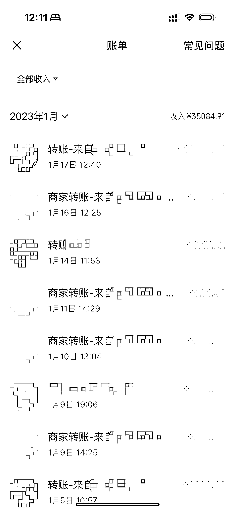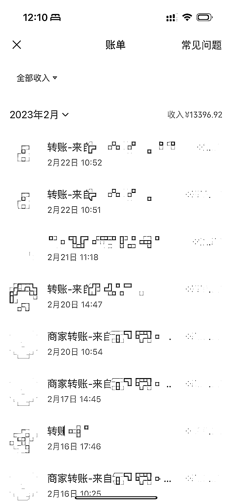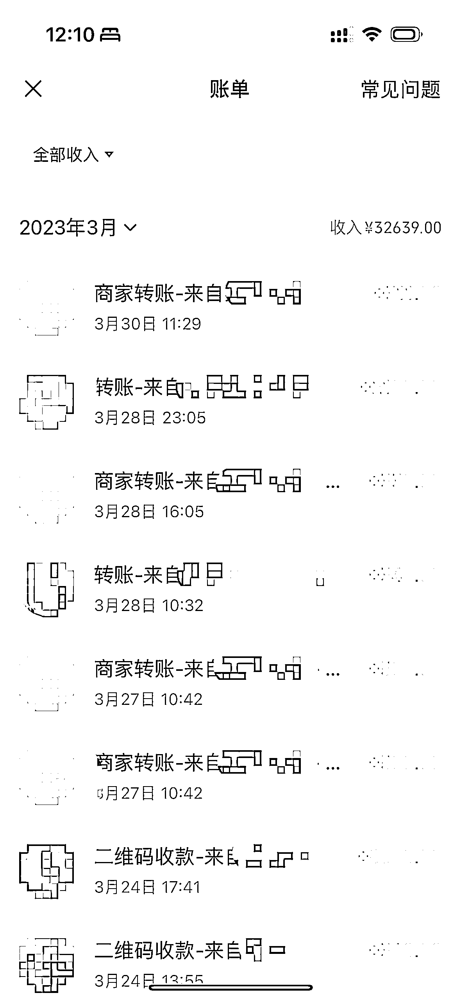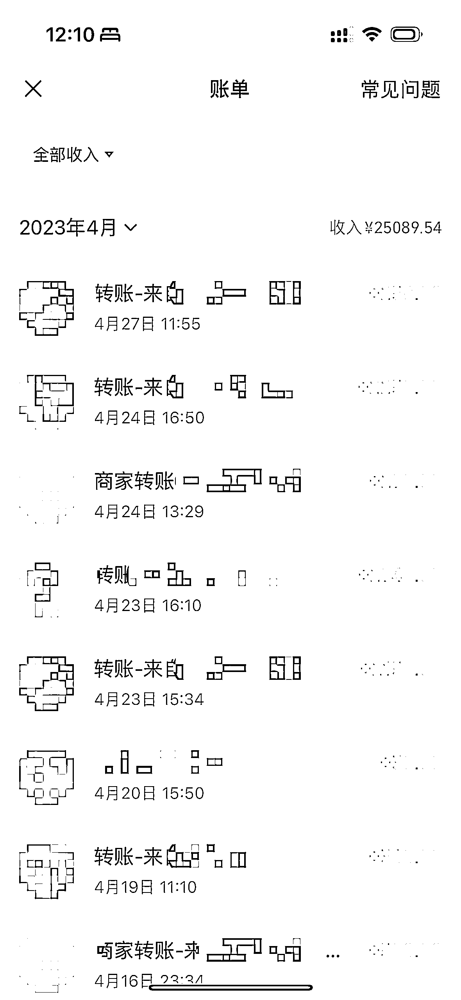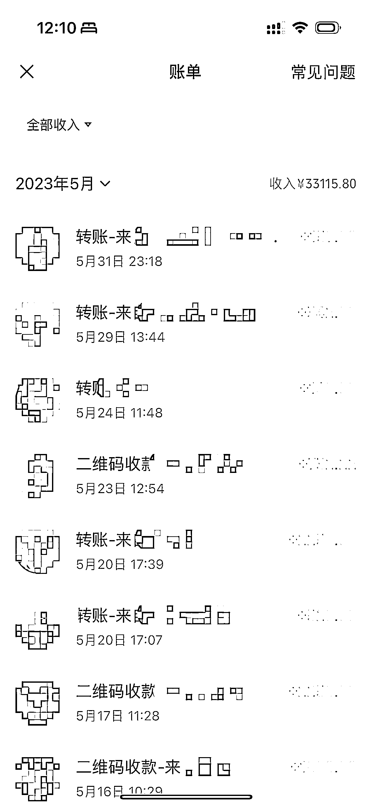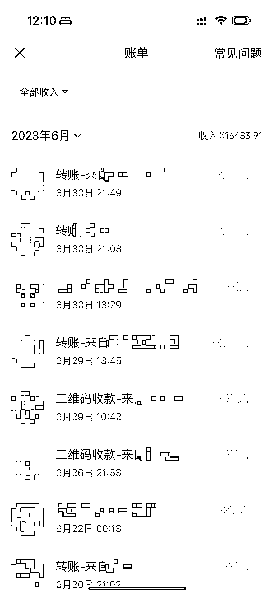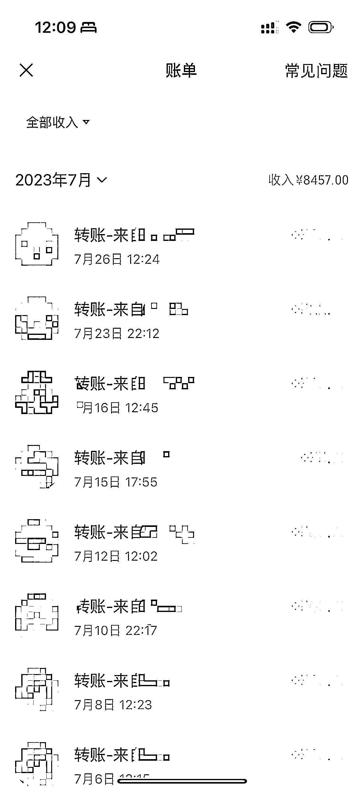

（因为我的上一份工作是和公司团队一起在做营养咨询服务的平台，所以我把我的私人客户也用平台的方式接单，来测试所有的流程，因此有很多平台的“商家转账”。)

## （2）这个工作的吸引力

我做了 7 年的私人营养服务，我觉得这个工作很好，因为几乎没有“成本”。

如果非要说成本，那就是之前接受的教育和受训费用吧，但是哪一行没有这样的学习费用呢？

除了大学/研究生的受教育费用，我的营养师执照是需要每年经过继续学习教育才能持有的证，我们受美国注册营养师协会的监管，五年一查，五年需要积累 75 个学习学分。

当然，这种继续学习教育课程也有很多方式可以免费学习来积累学分的。

所以在我看来，没有场地租金，没有人工，没有物料费，基本可以属于“0 成本”的工作了。

**（3）让这份工作变为主业前的其他考虑因素**

在美国有不少营养师开自己的工作室，这两年也慢慢开始在国内有营养师自己成立工作室提供服务了，在我看来，这是个很好的迹象。

不过我之前在美国和一些医生和营养师的合作过程中了解到，有些医生和营养师自己成立诊所和工作室独立 practice 没多久后又选择回到了循规蹈矩，按部就班的工作。

所以，独立做私人营养服务有利有弊，你该投入多少精力在上面，它适不适合你作为你的全职工作或者用来创业，这里你需要好好思考。

独立提供私人营养服务的优势有很多，应该也是它吸引你的地方。

**香的部分：**

**1、自我管理**

你可以独立经营，收获最大利润。如果你想创业，这可能是你最容易开始的一个事业。容易开始，容易停止。总的来说，你是老板，你定规则，你做决策，该怎么玩，你说了算。

**2、充满新鲜感的工作**

可以面对不同类型的客户，每天和不同的人交流。当你成立了自己的工作室，你可能做的不单单是营养咨询，工作有许多可能性，你可能给某个总裁做私人的贴身营养师，也可能给早教中心做食谱，做家长课堂讲师，社群营养师，或是直播，有很多很多可能性。

**3、保持营养热情**

如果你对营养事业充满激情，你就能在私人营养服务工作中尽情发挥，实现自我价值，得到自我满足。

**4、相对自由的工作时间**

自己定工作时间，工作时长。无地区和时差问题，你可以给世界各地的客户提供服务，只要你不介意时差的问题。就像我现在还有很多客户是在美国生活的华人。这能够满足很多种生活方式。

私人营养服务工作和你现在的生活方式能够匹配。如果你想要生活工作平衡，私人营养服务工作就是一个不错的选择。 现在说的那个词 - 数字游民，说的就是一部分在提供线上咨询服务的营养师。你可以过岛民的生活，在潜水冲浪的同时做营养咨询服务。

看到这里，你会不会觉得营养咨询的工作很有魅力。但是做这份工作效果如何呢？真的为你赚到钱了吗？这份工作和任何工作一样，有利有弊。如果你还没有开始独立做营养咨询服务，你可以了解一下它存在的弊端。

弊端是肯定有的，所以很多营养师就把它作为副业，而不是主业了。

**可能不太香的部分：**

1、前期收入不稳定：前期客户量不稳定，所以会影响收入。你是否有其他的经济 back up 不影响你的生活。在前期，你没有经济压力，才能更容易坚持这份工作。

2、清醒的自我意识：私人营养服务的工作就像坐一个好玩的过山车，你需要清晰知道自己现在在哪一个阶段。

你该自己承担哪些责任。我有听到一些同行会抱怨“现在人们还没有营养咨询的意识” ，“市场还没有准备好”或者 “平台流量不好，没有给我推荐客户”，如果你这么想，那可能这份工作并不适合你，如果市场准备好了，你脱颖而出，做出影响力的机会也更小了。

有挑战才有机会。先慢慢学会从自己身上找问题，完善自己，找出解决方案。生意不好，那你是不是没有做好个人宣传，你是不是该好好运营自己的潜在客户社群，是不是该用新媒体宣传，你是不是咨询经验还不够？

从自己身上找问题，你才能走到别人前面，遇到更多客户，提供更高质量的服务，获得更多收入。

3、变动多：如果你的客户想要的可能和你原先设定的服务不同。比如客户想要你给他一份食谱，而你原先的服务中不包含食谱这一项，这时你需要变通，根据情况，尽量满足客户的需求。

在最初的时候，用户体验是最重要的。你可能在这个客户身上多花几个小时，但是你要相信，你如果吃亏也就是多花了几个小时，但是你又多了一个食谱产品，而且还能得到这个客户背后的许多潜在客户。

4、身兼多职：CEO、CFO、CTO、营养师、市场专员、行政助理、业务经理、销售经理。这些工作在最开始都由自己承担。

所以你可能要考虑一下自己会不会算账，会不会做公众号或运营短视频平台等。但是好在各个方面的工作，已有许多工具可以供我们使用。

5、必须会销售：前期你需要会宣传自己的营养服务。虽然很多营养师不擅长销售，但是如果你在提供私人营养服务，就需要有一定的销售能力。早就已经过了就像不怕巷子深的年代了。

这里建议你在平时生活中多去和别人展示你对营养的热情，和你的专业能力，讲你擅长的营养话题，给朋友们做科普。

比如当朋友聊到减肥的话题，你可以多和她们说说，什么是间歇性进食减肥法，什么是正念饮食等等。让别人对你影响深刻，才有可能在需要的时候想到有个认识的营养师很不错。

如果只是考了一个营养师证，并且你和别人展示的也只是你这个证，那说服力是不够的，你不向别人展示你的专业，别人怎么知道你有能力呢。这部分是需要营养师推自己一把的，走出舒适区，锻炼一下自己的销售能力。

我常用来展示的平台就是小红书和播客。

**（4）不建议太早和其他同行合作或加入不成熟的平台**

私人营养服务的工作是可以独立完成的。我吃过 2 次大亏。

**第一次亏：**

因为我入行比一些同行朋友们比较早，在他们还是学生的时候，我就是他们的 mentor 了。他们成为美国注册营养师之后，自然的加入了我的团队。

我会把我自己的一些客户介绍给这些营养师。发现每个人对待客户的方式不同，导致我努力培养的客户流失了。

当自己客户体量不大的时候，过早的建立“营养师团队”没有帮助。因为客户真的也只需要一个和他契合的营养师就够了。

**第二次亏：**

我在上一份工作是和团队搭建营养咨询平台。我把自己的客户带到平台上去进行平台功能的体验和测试。结果因为平台不成熟，客户体量不大。

我并没有因为入驻平台而得到很多新的客户，平台的客户也很难转化成自己的长久客户。因为这是“平台客户”，不是“你的客户”，这有很大区别。从平台来的客户对你的信任也不强，因此沟通也更难。

再就是自己的客户带到平台上来服务，也可能导致自己的客户流失，你的客户会在平台找其他营养师尝试。

虽然私人营养师工作刚起步会很慢，这是一个需要时间培养的过程。我相信其他工作也都是一样需要有积累的过程的。

不要因为自己不成熟，而过早的抱团取暖。这会对你的个人业务发展有阻碍。

等到你有自己的竞争力了，再与其他专业人士合作，会碰撞出更勋灿的火花。

**（5）竞品？**

可能的竞品是：

1.  健康管理师

2.  签约减重机构

3.  减重药

4.  医院的营养科

5.  营养咨询平台

6.  ?

我私人营养服务的区别是：

1、只提供营养为主的服务。健康管理师可能提供的服务有体重管理、慢性病管理、运动、心理、睡眠、皮肤管理、压力管理等。

我拿什么资质的证书就对应提供什么领域的服务，这让我的服务部分更深入更专业。我的两个证书给我医学健康服务的专业资质。我的美国注册营养师已经让我的 scope of practice 仅限于营养部分，其他部分不是我的服务领域。

而我的另一个资质 - 肥胖和体重管理专家能让我的服务部分包括：成人、儿童、孕产期体重管理、和体重管理相关的运动管理、代谢手术管理、减重药物、体重心理管理等。

2、体重管理服务是基于科学和健康的基础上的。我的私人营养服务是需要营养师和客户双方配合的团队合作。所以我的服务不会有签约减重。我无法对客户的个人选择和行为负责。

3、我的服务不仅包括减重药物的使用评估、药物使用指导、药物营养搭配等。还包括营养咨询、营养食谱定制、饮食行为指导、饮食心理学等。

4、和医院的营养科相比，我不提供单次咨询服务。我的服务更贴合日常，客户可以随时进行营养咨询，营养方案也是私人定制化的。而医院营养科通常是用医院营养科系统里的资料，实用性并不高。

5、客户选择我的服务，是和我建立连接，是选择我这个人成为他的营养师，是和我建立信任。在营养咨询平台，往往客户是相信平台，和营养师本人的链接不紧密，依从性会更弱，达到个人健康目标的效果并不理想。

**（6）写在最后，这个工作也许不会让你致富**

像是我们提供专业咨询类的工作，有一个形容词形容这类工作的人 - **HENRY**

**HENRY** = **High Earners**, **Not Rich Yet**

高收入，但是还没有到富有的一类人。

我的咨询收费可能算不低的，但是因为保证生活水平的花销也在这，所以这个收入目前无法让我因此而富有。

在我做私人营养服务的过程中，我也在寻找新的思路，和新的机会。也因此注册公司，让自己的所有流程在一开始就正规化。这是为以后抓住机会提早做好准备。

私人营养师这个工作不是我的唯一收入，所以如果遇到这个月客户量比较低，或者我想休假几个月的情况下，我的生活不会收到影响，也因为给自己有 back up 所以这份工作能让我一直坚持到有现在的成果。

这是一个可以让生活和工作非常平衡的一类型工作。我目前的时间分配是 50%是工作，50%是生活。如果你的工作比例比我高一些，你的收入当然也会增加。这是我选择的生活状态。如果这样的分配比例你也会觉得很满意，那私人营养师的工作你会有很多满足感，也能提高生活幸福指数。

我这里想和给对这行感兴趣的朋友的一个建议是，这个工作能让你一个月比较轻松地赚几万。但是如果你想用这个工作而致富，是不太可能的。因为工作性质是这样的。

如果你找到其他突破的机会，我为你开心，并且会崇拜你和你学习。

**（7）成为私人营养师**

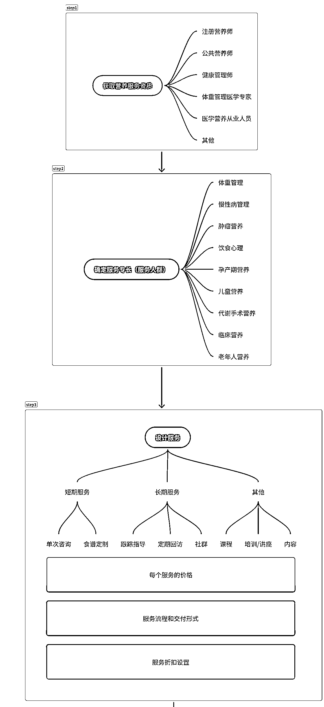

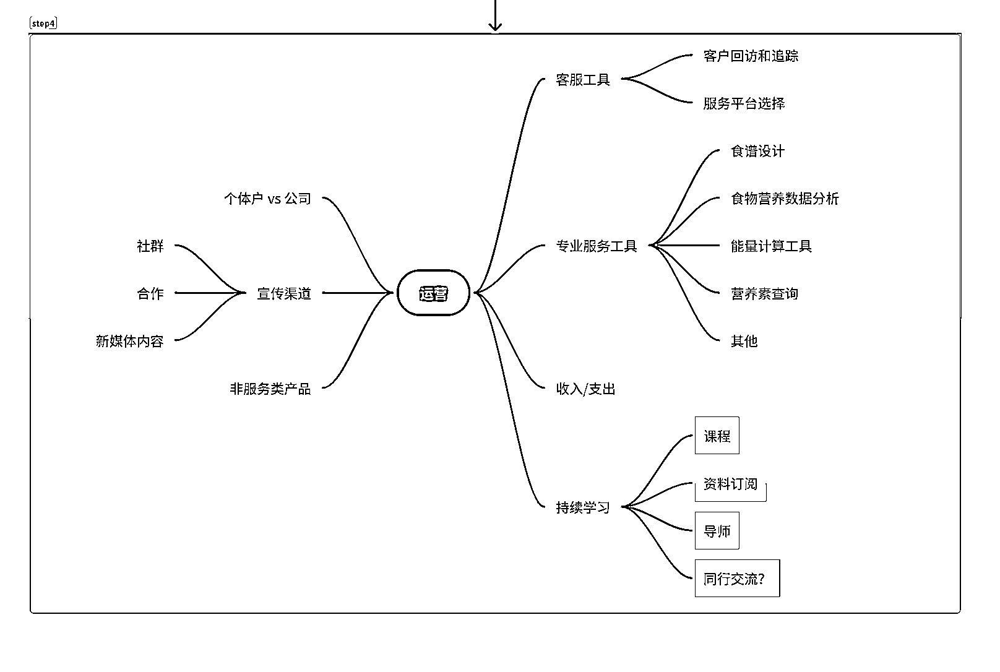

* * *

评论区：

蔡小菜 : 目前营养科在职，不得不说你这个算是目前营养师最理想的的状态了
美国 RDJingle : 嗯嗯，慢慢做自己喜欢的事，一切自己说了算是很快乐的。
^O 汝则吾 : 在异常浮躁的自媒体时代，小姐姐的分享和做的副业娓娓道来，踏实，也注定走的长远[玫瑰][玫瑰]
美国 RDJingle : 喜欢的事情一直做，一定会有结果的
阿钦 : 感谢分享[玫瑰]很有启发

* * *