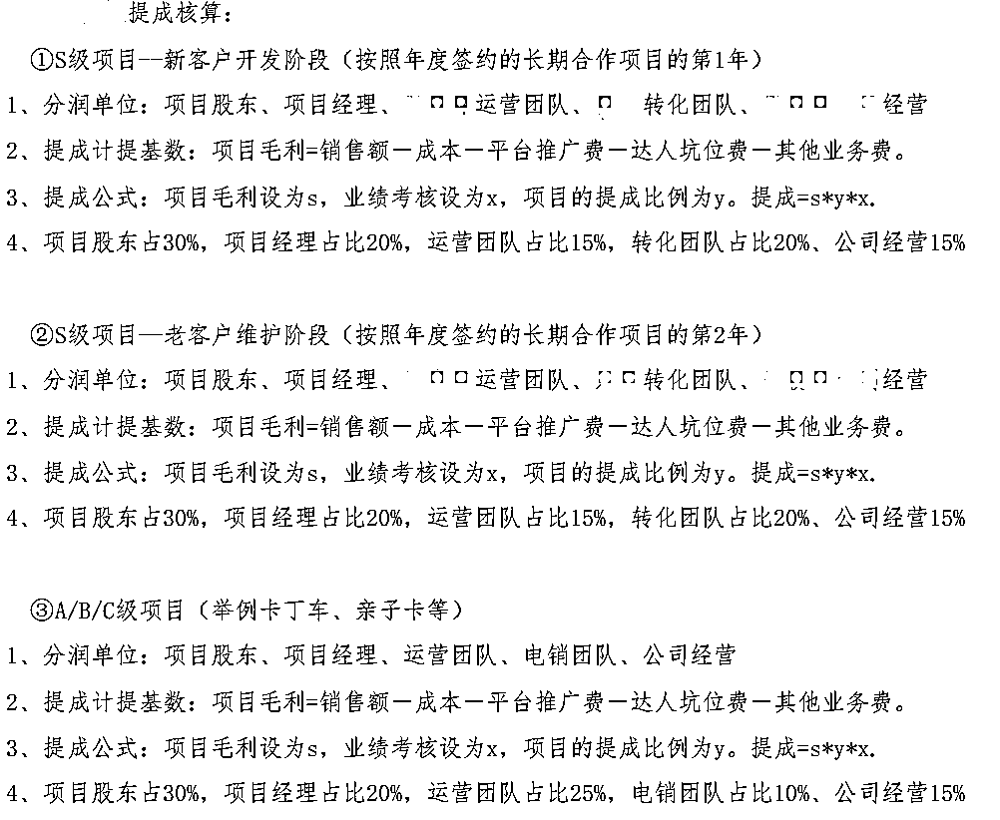
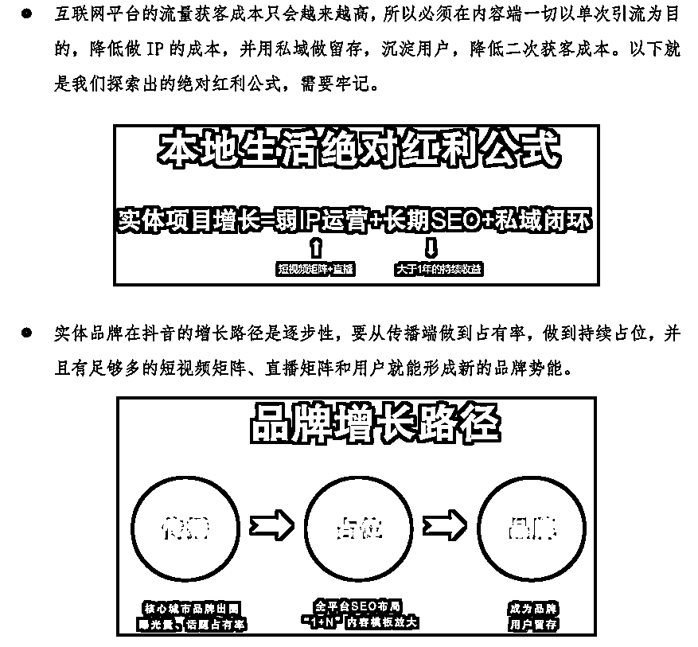
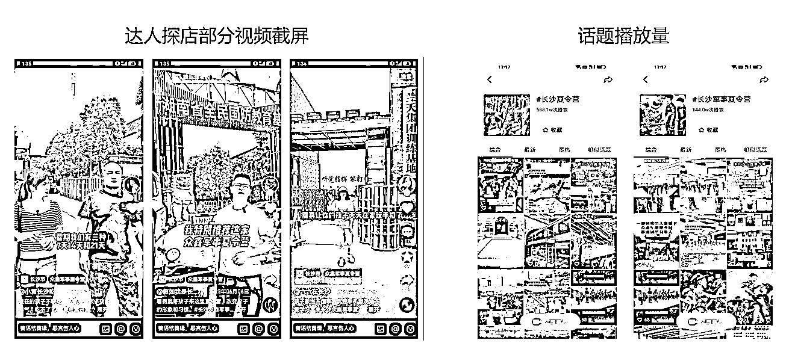
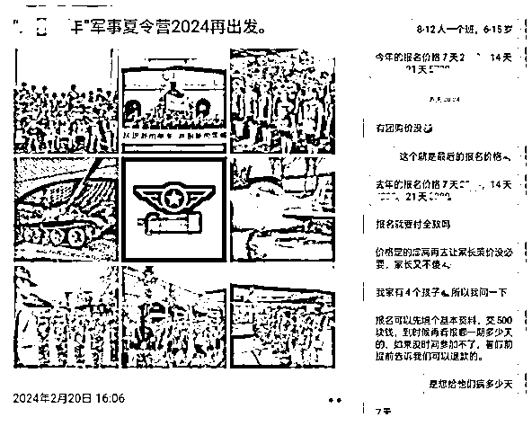
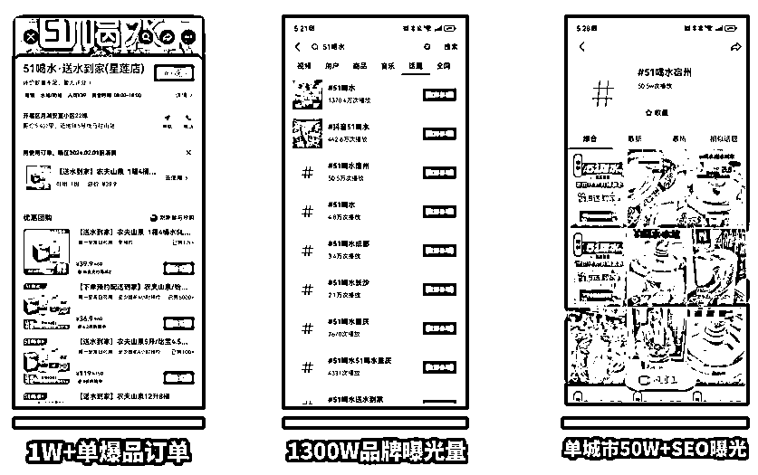

# 价值千万！2024 年抖音本地生活如何赚钱？

> 原文：[`www.yuque.com/for_lazy/thfiu8/qcx9m7xq5b192k0i`](https://www.yuque.com/for_lazy/thfiu8/qcx9m7xq5b192k0i)

## (25 赞)价值千万！2024 年抖音本地生活如何赚钱？

作者： 楚川

日期：2024-02-23

大家好，我是楚川，一个从 2020 年下半年开始入局抖音本地生活的超级实战派。如果你看到这篇文章，还请不要烦这万字长文，并建议你耐心看 10 遍以上！因为我们过去到现在已服务超过 5000 个实体商家和品牌，无论你是小商家，还是 SKA，或者是服务商，你们在抖音本地生活的所做所想，我们基本上都经历过，一切均有解。                                                                                                                              ——楚川

时值 2024 年各团队开工之际，此文用来回顾我们团队奇特的 2023 年，展望继续拿大结果的 2024 年。

## 一、2023 年楚川团队的本地生活全程复盘

### 1、服务商的转型之路

2023 年我们全面放弃餐饮客户，尽管我们参与投资了 2 个餐饮品牌（也完成了从 0 到 1 阶段），也依旧很笃定认为抖音本地生活给餐饮的机会不多了；其次是在酒旅大赛道中，我们从景区门票、亲子乐园、旅游路线、区域网红城市的推广、夏令营，都合作一轮，最后发现夏令营和亲子乐园的机会最大，能够绑定合作在 3 年以上；我们在合作完第一个家政项目后，也亲自下场做了直营家政品牌，维修品牌，在流量起来后发现，供应链才是这条线中最核心的一环。

这些经历，我们有得有失，最大的惊喜是加入到天鹅到家，将项目从 1 到 10 完成突破，实现单月 7133 万的突破，打破了大家对于抖音家政的预期。因为小华总的启发，我自己也认识到 O2O 行业的新机会和魅力，于是在 2023 年先后参与爆破送水到家、上门洗车，均给我们惊喜。

抖音综合类目的大放异彩让我们团队明白，曾经会认为抖音本地生活很难实现盈利，到现在的理解为遍地是黄金。但一年内经历数次，合作被坑的经历，让我们痛定思痛，开始做“丑话说在前头”的老实人：第一，建立公司选择客户和项目的金标准；第二，合作方式的笃定；第三，建立一套团队内部都接受的分钱机制。就这样，我们团队从一个服务商乙方的身份，变成项目联营方或者是项目合伙人。

#### （1）选择客户的标准建立和合作机制

1.  亏钱的项目 90%是纯佣合作

2023 年，我们盘点亏钱的项目当中，一共有 5 次，其中 4 次为熟人关系产生的项目，因为说不开口收取前置费，就以纯佣合作的方式进行。在项目正常运营后，我们无一例外发现收回款是做流量运营难度的 100 倍。

这个过程中，我们有尝试过好说歹说、发律师函、每天发信息讨账，以及被翻脸不认人，因为此损失在 300 万以上。合作过的小伙伴，大部分都会认为我们是讨好型人格的合作方，哄一下就能干活，酒喝好了，就嗷嗷叫干活，最后又会因为抹不开面子，不断退步。这些不太光彩的经历，我和橙子经常安慰对方的方式是与其花这么多时间去纠扯，不如寻找更好的机会崛起，时间和时机都不等人。

不过在 2023 年年底开始，在好朋友的劝解下，我个人开始变化，成为一个间歇性“发疯“的人。第一我们坚持杜绝任何纯佣合作的项目，钱到位才会干活；第二在面对白嫖的客户或者合作伙伴，直接以最直白的话回怼，拒绝合作要干脆利落；第三，尊重个人命运，持续没落的企业或者品牌，不是没有机会和能力搞流量，绝大部分都是因为团队内部或者是高层出问题，我们作为流量方哪怕是逆天改命，拿到一个阶段的结果，但最后的结局无一不是被踢出局，或者在流量放大后，公司团队直接崩掉。

1.  供应链无法坐庄的品牌自营迟早会被 KA 和平台吃掉利润

在选择合作伙伴（供给端/品牌方）上，我们现在已经有自己的金标准。第一，必须接受前置流量费由我们团队去使用，我们负责品牌、策划、获客，合作方只需要承接流量，以及做好留存；第二，在项目中，合作方已经具备基本盘，不需要额外做大面积基建工程（开城、招人、开店等）；第三，合作方的供应链能力可以到行业第一第二梯队，具备某个环节的坐庄能力（定价、控量、放大等）；第四，在合作周期内，能够做到项目价值评估，任何一方违约，均要赔偿一定比例的违约金；第五，正式确定合作后，周期内的收益能大于 100 万。

基于此，我们在筛选客户的范围变得比较精准。尤其是在考核合作方的供应链能力的时候，有足够多的经验，我们有自己的评估方式，来判断对方的供给能力。在合作过程，需要多少流量，对应多少推广费，能比较好的把控。当然也有失手的时候，如 2023 年 7 月我们的保洁供应商，单量一发力就供应不了，我们就会当机立断结束合作；2023 年 11 月，2 个城市的水站单量开始第二周，就从 2 小时送达到次日达，那都会叫停。

一系列的合作，我们发现当下抖音本地生活的竞争慢慢的不是在流量的获得，而是优质供应链的组织力，网格能力。2020-2022 年的经历，我们做爆的餐饮客户，大部分投诉和恶评均来自于流量大而导致的服务品质、菜品缺失/低劣，也是反应出供应要有保障。哪怕是，我们 2022 年用自有供应链介入合作，还是解决不了流量-供应链的矛盾。所以 2023 年换成供应优势更大的 O2O 项目，天鹅到家就是最典型的代表，过去将近 10 年的沉淀，让到家集团的供给做到绝大部分都是直营，随着平台流量越来越精准，竞对在一个量级无法消化，而天鹅到家的流量却能持续注入，这就是优质供应链的优势，会被抖音无限放大，而这个过程显而易见的就是利润也会增加。

在供应链无法坐庄的过程，类目下抖音的市场空间会被竞对挤压；行业往前发展，竞争激烈后，订单成本也在上涨，利润就被掏空了。这就是抖音本地生活生态逐渐完善后，信息差和野路子空间几乎没有，真刀实枪的拼杀下，就只能靠供应链这张王牌。

#### （2）团队内部的分钱方式

1.  可替代的人力全部外包

2023 年，我们在人员的优化上也是比较明显，因为本地生活的低毛利和核销率制约，只能让各环节的人力成本能省就省。在团队人员盘点上，我们把无法身兼 2-3 个职位的岗位全部优化。

第一，2021 年年底我们把所有的达人全部解约后，一直沿用到所有的主播全部外包，到目前为止在长沙合作过的带货主播已经超过 400 个，对不同能力层级的主播做了价格和能力的标签，以小时制的结算方式进行灵活操作；

第二，在摄影师的选择上，我们针对不同的需求，选择外部合作的摄影团队。如职人视频，会请达人进行额外的素材采集；IP 视频和达人高级云剪辑，则会动用专业摄影师，根据不同的脚本批量收集素材。

第三，在技术搭建上，我们从 2020 年开始研究技术逻辑线路，所有基础开发为外包，橙子则带领团队进行二次开发和优化，满足团队不同的需求。在这一块，尤其是抖音小程序的开发、批量化剪辑和发布工具的开发，我们会进行大量的实践和探索，每月跟外包团队沟通，进行技术升级。

所以，我们团队基本上 2 年多时间保持在 15 人以内，但人效拉到极致，在百万级到亿级项目都能支撑，核心优势在于运营能力的建立。至于说如何建立起我们的能力壁垒，“无他，唯手熟尔”，抖音本地生活的营销我们基本上做到肌肉记忆，各环节的衔接、更新，后台子菜单等都能背出来。如果说未来需要持续在本地生活拿到结果，无非是品牌自运营团队做深做透，长效经营。

1.  人人都是操盘手

这个观点会有点吹牛，但可说的是团队目前在朝这个方向发展。我们在内部以阿米巴的方式运转时，会不断让小伙伴转岗，适应不同的岗位，保证留下的团队都是多面手。在一个项目中，能做到力挽狂澜，并在落地过程中会有团队都认可的分配机制，分配方式细化到各岗位，杜绝吃大锅饭，保障项目良性推进。

2024 年是我们做本地生活的第五年，我们在人员的培养上，基本可以形成 3 个月给品牌商家搭建有战斗力的团队，6 个月带出真正的项目操盘手。当然从另外一个维度讲，依旧是这个大赛道利润低，必须是不断提高人效，用规模换取利润。

### 2、抖音本地生活方法论的完善

#### （1）实战永远放第一位

1.  平台变化太快，方法论的总结均来自于实操

抖音的变化不断考验运营团队的进化能力，过去 4 年我们保持方法论的核心不变，具体的落地细节更新在 50 次以上，在我的运营笔记 1.0、知识星球、线上线下课，都不断在说明一线实操的重要性。我们团队也一贯保持开放的态度，对绝大部分同行、品牌方都是倾囊相授，因为我们深知：固有方法论无法持续在抖音拿结果，需要根据实际情况升级和调整，每个月都需要有变化，所以从来不怕外部团队学习。

1.  亲自撸起袖子干才有真正的手感，才能知道业务本质

在过去 4 年多，我一直在阐述一个观点，一定要在一线持续实操，才有机会拿结果。我在公司人最多（220 人）的时候曾脱离一线，最后的结局就是全年亏损 1500 万；我也亲自辅导过超大电商盘转型本地生活的公司，CEO 只在作战室指挥，我所传授的技能和知识，并未亲自验证和实操，最后转型失败，令人惋惜；3 年前，我们合作过的技术服务商因为团队调整，创始团队持续脱离战场，结果另外一家兄弟公司只用 10 个月不到，在抖音本地生活行业完成绝对的超越。这些都是团队负责人没有真正撸起袖子干导致的失败案子。

#### （2）短视频本地生活基建工程高过超强开场的 KOL 视频和直播

1.  2024 年商家经营已成阵地战，需要建立自己的山头

这个观点对于目前的品牌商家来说是一个陌生的认知。过去的服务案例，我们持续在观察发现，成功的客户当中固然有供应链的能力，但同等级别中的成功案例都在抖音生态的基建做的比较扎实。如何理解抖音本地生活的基建工程？核心还是去反思，当大宗流量结束后，如何持续吃到短视频和直播的流量，也就是商家自我的日常运营。可以从以下几个点来拆解。

1.  商家 IP 本质：一切为了成交。我一直在强调弱 IP 的打法，不是说不做 IP，而是减弱 IP 的依赖性，有区别于超级 IP 养活一个公司的方式。将品牌 IP 账号作为日常对外经营的窗口，不管流量大小，每次曝光都以成交为目的。弱 IP 是职人矩阵、宣发视频以外的流量转化入口，SEO 流量承接的大头，从我们熟知的“聚光灯”型变成“实用型”。

1.  职人矩阵：在抖音发传单不丢人，没流量才痛苦。职人视频是抖音本地生活未来 2-3 年必做的工程，我们时刻需要反思当达人流量无法持续，当预算收紧的时候，用什么去取代，用什么降本增效，其实答案就是职人矩阵。矩阵的价值点，真正的意义，在之前的文章有详细的拆解。未来一定要将职人视频做到日常工作，保证每日更新 3 条以上，做到厚积薄发，我们用职人的打法已经拿到了大量的结果。毕竟顶天立地，不如铺天盖地。

1.  抖音 SEO：当没有大宗流量进入后，搜索流量就是商家持久战的必胜法宝。不管大家信不信，抖音的搜索流量已经超过百度，2024 年也将是抖音 SEO 元年，品牌商家提前做好基建就是一道防御线。我们已经有项目，每个月吃抖音 SEO 流量产出在 1000 万级别，看上去做简单机械化的铺视频，选择常见的关键词，但最后的持续价值是超出预期。举例，我们供应链和夏令营项目，1 年后依旧能接到咨询电话，这就是搜索流量的价值，长尾效应惊人。

1.  POI 建立：好的门面是成交和触达用户的关键。过去 2 年，POI 是抖音治理比较头疼的一面，虚假 POI 和占用的问题，产生的舆情不断。但背后的原因还是在于 POI 的铺设，类似像蜂窝煤状网络，密度提高后，具备群集效应，获取流量的效率更高。第二层意义就是 POI 的统一装修，提高 POI 质量分的同时，也可获得平台的流量加持，可为营销动作滚雪球。第三层意义就是 POI 的名称命名，后缀类目的设定，不但可以吃到平台搜索流量，也是一个品牌形象规范管理的窗口。

1.  铁打的商家，流水的探店达人

1.  KOL 和 KOC：不同等级代表销售能力的高低。这是一个老生常谈的问题，职人和素人就像是品牌商家在抖音的传单员，每条视频都是在不断发传单的行为。KOL 和 KOC 则代表了不同销售能力的销售员，把这个逻辑缕清就能明白在品牌的营销动作即时需求。到底是先发传单，还是先做销售动作，这就要从具体的场景去拆解。如首次宣发营销，肯定先发传单，再开店让销售员跟进销售；老店的长线营销，可能就是直接安排销售人员卖货，到流量枯竭后，再安排更多的传单触达更多的人群。理解这些现象，那就能明白，探店达人再也不是我们要跪舔的甲方，而是做好自身的日常营销体系，供应链优势。

1.  不同的流量属性具有不同的价值，单因素论 ROI 就是耍流氓。这是我经常跟合作方产生激烈冲突的点，本地生活的营销从职人、素人、达人和直播，不同环节都有其价值所在，这是一套组合拳。单论产出，肯定是职人和素人的 ROI 最低，但其实这又是营销基建不可获取的环节。在讨论运营打法上，从预算的构成，因为不同环节的产出不一，所以难免会倾向于提高 ROI 指数高的项，降低 ROI 指数低的投入，这其实是极度不合理。因为此，我经常跟合作伙伴急眼。

#### （3）直播是放大器，能爽到，也能识别到弱点

1.  先做好短视频，再用直播放大

不少朋友经常笑我，对于直播的偏见坚持了 4 年。从我入行到抖音本地生活开始，我都不建议品牌商家，在没玩好短视频之前，开启直播项。因为本地生活行业中，大部分的运营团队能力层级没有电商高，这是不争的事实。在短视频有红利的阶段，一定是完全拥抱短视频，将这块流量吃透。

如何理解将短视频流量吃透呢？那就是 ROI 至少是正向的，核销率能在行业平均值之上，并且在区域的搜索和推荐流量占位能在前 5，这就是代表流量已经有统治力。而本地生活直播就是将短视频矩阵挖掘到的用户，拉到直播间进行密集型成交，只有视频-直播同频共振，才能产生 1+1 大于 2 的效果，不然效率会低下，也就无法让本地生活项目盈利。这也反映出抖音本地生活的商家运营容错率不高，一定要一步步都扎实。

1.  商家的产品能力是底线，适应平台一直爽

1.  质量是生命线。抖音的流量放大能力极其恐怖，对立面则是一个差评，需要美团 10 倍代价来补。所以品牌商家在经营的过程要首先注意产品质量，这是生命线，不可以触碰的底线。我们过去见到的餐饮合作伙伴，一旦在这块打马虎眼，就能在 2-3 天看到流量的反噬，ROI 直线下降，并且第二次再攀升销量的时候，成本会提高数倍，导致亏损。

1.  货盘组合和优化是营销基础。本地生活的货盘在直播起来后，重要性越来越明显。过去不少品牌方在入驻抖音本地生活项目的过程，产品和套餐基本上从店内套餐、美团、小程序平移过来，但一段时间会发现抖音的用户跟原有用户完全不一样，对于产品的理解和认知完全不一样。我们做过的送水到家类目中，80%为 25-40 岁女性用户，跟美团和饿了么的下单人群差异化很大，那传统的桶装水（收押金）首次很难适用，用户期待和理解程度完全不一样。那就说明，在抖音的推广过程，从下单到履约环节，一定要提前调研人群喜好，并及时调整，在货盘上做到迎合用户，那就能持续放大。

1.  主播的产品解读能力是流量密码。本地生活方法论很难一招鲜吃遍天，抖音探店达人超过 1000 万，那不同标签的主播非常多，用户群里大概率也不太一样，所以在产品的解读上，需要极其关注。我们过去 3 个月测试出不同类型的生活服务主播，在带同一种产品的时候，卖点的透传完全不一样，让用户下单的点也不一样。这需要商家跟达人做详细的沟通，并能激发对方，这就是为什么当下阶段真正用达人直播拿到大结果的品牌如此稀少的原因，核心是产品解读能力没有激发。

1.  平台的直播识别能力超乎想象

1.  真人直播和无人直播的使用技巧。在品牌官方账号直播、达人账号直播、无人直播的 3 个维度，我们经常观察数据的变化，其中平台对于无人直播的稽查和识别能力极强，只是在增长和治理间做了权衡。因此在成本的节省上，商家选择直播的方式，肯定需要优先考虑真人直播。因为无人直播间的价值在于真人直播溢出流量的消化，用成本最低的方式完成转化，而非一个基本盘，一个拿结果的靠山。另外平台对于品牌方的流量推荐，会从进直播间的流量转化效率考核，那在真人和无人直播的考量上，一定要做好先后顺序，主次的思考，这个留给大家分析。

1.  达人直播的价值和破局选择。当下阶段本地生活头部主播的刷量严重，最能看出问题的地方在于核销率远低于正常值，退款率远高于正常值。在这种情况下，我们也很长一段时间不想尝试采用达人直播的方式拉高支付 GMV，但多个案例对比后，发现当选择最具有爆发力的达播渠道后，一个维度的订单暴增会带动整个大盘的势能，推动了整个品牌的销售量增长。所以尽管达人直播的 ROI 存在缺陷，在项目的必要爆破阶段，可以作为一个破局切入口。

#### （4）商家长效经营的公式总结

品牌商家在抖音的长效经营，我依旧保留运营笔记 1.0 的想法，做好用户的新增，沉淀价值用户，把一件事件做到长期性，慢慢就有了品牌势能。

### 3、案例拆解

这一次主要从两个实战案例来拆解抖音本地生活的两个获客方向，第一就是获取客咨转单，第二就是平台直接打单卖货逻辑。尽管两个项目结果跑得一般，但两个方向的探究值得大家参考。

#### （1）夏令营：POI+职人矩阵+抖音 SEO+客咨私域转化

在军事夏令营的案例，我们从 2023 年 4 月开始签约了湖南的国防教育基地，基地的接待量和课程软实力都是行业区域顶级。我们选择联合运营，流量端选择最简单的自有矩阵分发，秉着“大力出奇迹”的方式，把获客成本压到行业最低，视频覆盖面最广。

第一，基地独家承接线上流量。在流量合作方，我们签约了独家合作，提前规避了大宗流量进来，没有基地承接服务的情况。这是我们第一年操盘这种类型的项目，考虑到各环节的变量控制，销售环节，我们也承包了，也就是基地只需要负责交付环节。在流量进来后，我们选择的是电话-转私域-线下邀约参观-签合同的组合拳。

第二，基于 POI 流量的分发逻辑获取区域客咨。我们一共收集了 17 个抖音职人矩阵号，从 4 月开始筹备，经历素材的采集、养号、视频剪辑和发布，在 5 月正式起步宣发，截止到 7 月底，开始停下宣发动作。在 POI 的选择上，我们所有的视频都带 POI，以区域为大半径的方式吃流量。所有的职人视频单日平均发布量在 10 条左右，另外也采取一部分外部云剪分发账号，全程总计视频发布在 8 万条视频左右，客咨的方式均为用户主动咨询和评论，然后销售跟进，用话术获取联系方式，进一步沟通转化，直接加私域 2000 多人。因为第一年定价全省最高，导致转化率较低，营收只有 200W 出头，但是一个值得探索的方向。

第三，抖音 SEO 长线经营。在 2023 年 8 月停止宣发和招生后，抖音 SEO 部署开始体现长期价值，基本上每日依旧有 5-10 条进线咨询，这种状态持续到了寒假。2024 年 2 月团队开启筹备夏令营，刚开始运营朋友圈，去年的用户就开始咨询，证明了这个项目值得长期运营的潜力。

#### （2）到家行业：POI 矩阵+职人矩阵+抖音 SEO+KOL+KOC

到家行业的分享，因为经常提到家政，这次选择了新鲜出炉的水行业跟大家分享。当时选择这个行业的原因在于刚需、高频，两个特点让我们暂时忽略了低毛利率的现实。下面进入分享的是我们 2023 年 10 月爆破 51 喝水的经验，在水行业的探索，我们目前已经分别从水厂、水站、水品牌、水平台公司的角度去探索这个行业的价值，以及如何在抖音赚钱，未来会有更加详细的拆解，当下只讲送水到家的获客经验。

第一送水到家的营销爆破上，我们首先选择了爆品。我们用具有价值锚点的农夫山泉和怡宝作为引流品，实际上客单价高于便利店，以及社区团购的价格。但前面依旧是有分析到，这个行业在抖音的用户跟传统水行业下单用户不一样，前者是女性为消费主力，后者为企业男性为主。那么对于价格的敏感度会有差别，所以在第一波流量打爆后，转化率高于预期，首月 1300W 的曝光可创造 150W 的销售额。

第二营销打法上，POI 的装修和名称紧紧贴合用户本身，让刷到视频的消费者点击和下单率提高；绑定水站送水工的抖音号作为职人矩阵，降低宣发成本；抖音 SEO 则选择平台、水品牌、业务名称，场景和城市，5 个维度做部署，持续几个方向占位，并获得搜索流量，成交占比为 30%；KOL 和 KOC 选择快消品销售能力较强的达人，在职人和素人视频铺量后，此类视频订单猛增。

第三水行业未来的运营层面上，大部分企业必须建立起自运营团队。因为毛利率足够低，无法中间再加一层服务商，必须掌握自运营能力，持续将能力升级。

## 二、用什么样的心态去面对 2024 年

### 1、全面拥抱新的 O2O 时代

#### （1）短视频流量的爆发力让商家起盘有了基础

2015 年 2016 年 O2O 行业触达用户的方式是靠地推，发小广告去触达用户。把广告布得非常密集后在一些城市里打板，打完板之后 n 个城市、n 个大区去复制。现在抖音其实无非就是把这套模式套在短视频里面，做到高频触达，品类封杀，一切的目的都是为了成交，为了获得新的用户。

在我们将抖音家政行业做起来的阶段，并未有如此深的体感。但在 2023 年维修行业、按摩行业、上门洗车、送水到家等先后开花，让我充分认识到短视频可能迎来了中国 O2O 的再次崛起。

#### （2）传统且可坐庄的供应链具备新的增长机会

O2O 行业在抖音的新增机会，肯定有一个普遍的前提，那就是供应链具备爆破的属性，适合场景化，并且拍视频做传播。但到了 2024 年，商家竞争格局有了变化，爆品供应链还加了“可坐庄”的大前提。如何理解传统且可坐庄的供应链？

第一，传统的 O2O 供给大部分缺失流量，已经饥渴很久，但又没很好的破局机会。到了 2023 年，抖音综合类目开放，不少半路入局的品牌商家和服务商，乱拳打死师傅，一个月可以做到大几千万的规模。大部分从业者都会认为原有传统 O2O 品牌方机会不多了，因为该开放的类目，抖音基本上已经跑过一轮。但很负责任的说，当下是最佳时机，因为抖音本地生活已经过了疯狂增长的阶段，4000 亿的体量已经可以做到叫板美团的水平。那在关键的 2024 年，平台一定是要优质供给，而半路出家的供应链会因为掌控力和行业沉淀不足逐渐丧失份额，甚至被平台抛弃。那这就是传统供应链的最大诱惑点。

第二，在可坐庄的维度上那就是掌握供给的控价权、供给量、服务质量等。当供应链的紧密程度不够高，没有坐庄能力，就会被大户快速吃掉，因为对方具备更强的体量、议价权都强，只需要一点手段就能快速占领市场。2022 年我们团队在做生鲜供应链的时候，跟餐饮品牌合作（供应链&抖音流量服务），就发现这个最大的 bug，于是果断在 2023 年放弃再做一年。

### 2、抖音 SEO 的红利开始明显

本文已经强调多次，抖音 SEO 越来越重要，这是一个长期要部署的动作。当下抖音电商、生活服务的生态已经成熟，用户在平台的停留越久，那搜索量会持续上升，所以 2024 年开始必将是一个激增的方向。

### 3、商家短视频的能力建设是长期战役

品牌商家的短视频能力并非一朝一夕，而是长期战役，这块最重要的 3 个因素为：IP 的运营、职人矩阵、达人视频。其中达人视频属于流动的，永远会冒出新的达人，付费即可合作，不算是企业真正的壁垒组成；这一块重要的部分在于 IP 和职人矩阵的搭建，两者相辅相成，职人矩阵长期做批量化视频剪辑和分发，占领用户心智，品牌 IP 则作为流量收口，转化为增长。

### 4、全域整合营销是最大的挑战

抖音作为第一个切本地生活的短视频平台，也证明这个大赛道的诱人空间。那在未来的 5 年内，所有的新媒体平台一定会跟着开放，尝试分一杯羹。文中反复提到过 IP 的能力、短视频的能力，这些基础能力和认知在任何平台都会有部分通用，所以在接下来的时间，商家如果要持续获得增长，那就意味着要掌握不同平台，全域新媒体的营销能力，也可以称之为整合营销。这就是本地生活从业者未来最大的挑战，也是企业持续获得增长的秘密。

## 三、穿云团队未来的定位

#### 1、聚焦到家赛道，将流量能力做到极致

我们在 2023 年团队重新调整，完善自己，确定未来 20 年都要把穿云团队做下去。未来选择的方向依旧会是到家赛道，持续聚焦，将这个赛道流量获取能力做到极致。过去 1 年的经历告诉我们，当自己选择聚焦后，利润越来越高，团队也更加轻松，有更多时间思考、复盘，这将变成我们的核武器。

#### 2、只服务具备供应链优势的品牌，实现 3 倍以上的增长

在接下来的时间，穿云团队会持续保持一线实战，我们始终坚信实操才能带来真正的方法论。作为团队的领路人，本人依旧很长时间会作为这个行业的经验分享者，尝试不同的方向，给大家复盘。好的坏的都会有，核心是都能照镜子，一起进步和成长。

随着我们团队的进化，我们目前在合作伙伴的选择上也会要求更高。当下聚焦到家行业具备供应链优势的品牌商家，并具备 3 倍以上增长空间。以上就是穿云团队 2023 年的复盘，以及 2024 年的一些展望。

* * *

评论区：

江南 style : 感谢分享，看了 2 遍，很有收获。
木紫 : 怎么联系大佬
楚川 : 有缘在生财见到[偷笑]
周先生 : 核心：别做餐饮
楚川 : 有钱，但是难度有点大

* * *