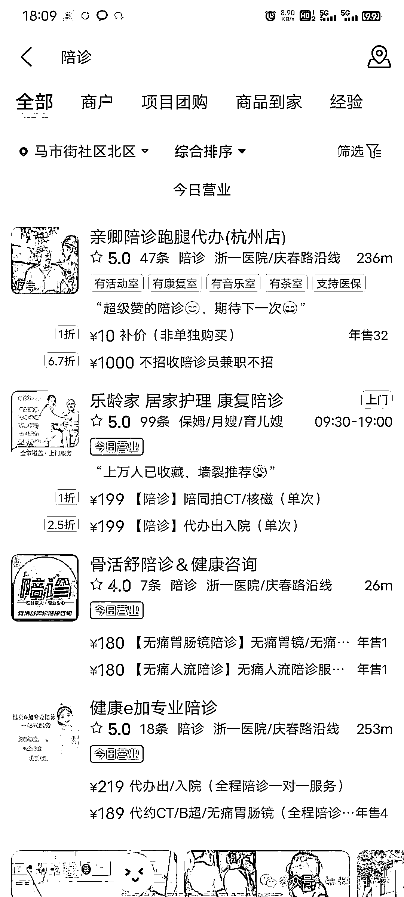
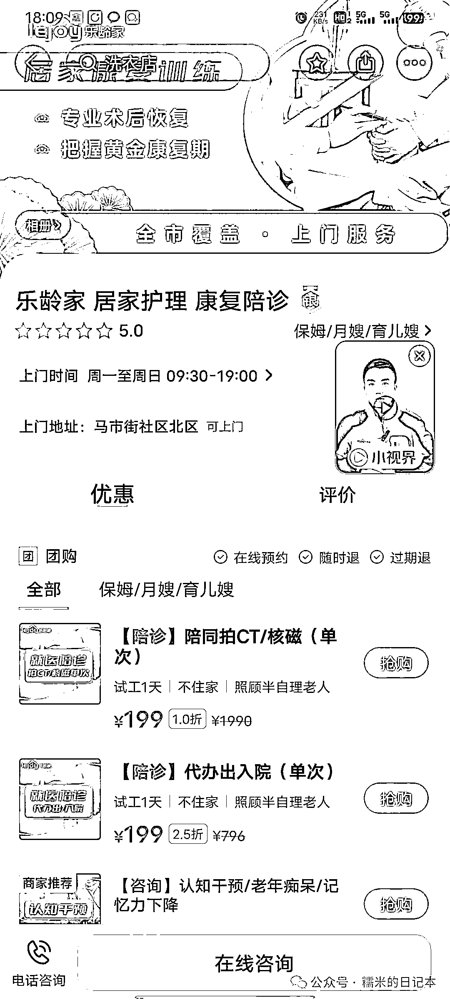
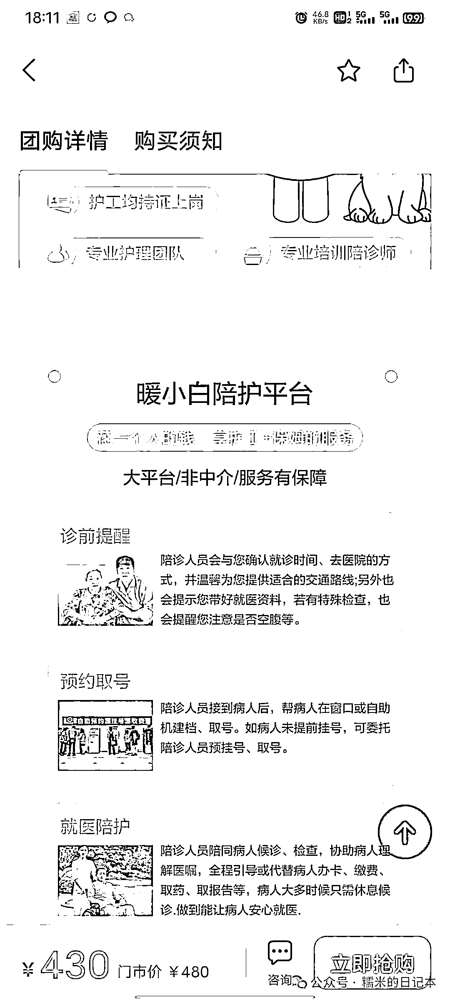
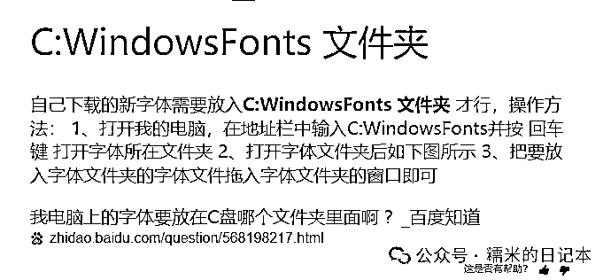

# 《糯米的陪诊实战手册》——陪诊电商店铺的低成本装修外包

> 原文：[`www.yuque.com/for_lazy/thfiu8/yyati4irb9kfaep5`](https://www.yuque.com/for_lazy/thfiu8/yyati4irb9kfaep5)

## (14 赞)《糯米的陪诊实战手册》——陪诊电商店铺的低成本装修外包

作者： 糯米

日期：2024-02-21

基于糯米说过的，在美团做陪诊店铺的价值，不言而喻。那做电商店铺势必就要涉及到店铺装修

如果不是自己有美工设计的技能，或者有自有团队，基本上还是选择外包好了

（ps.学习能力逆天的不在范围之内）

外包其实就是应了那句话

**“把专业的事儿交给专业的人做”**

一次性也就花个几百元，真不多，但我也理解有的小伙伴觉得一张图就得五几十的，还是有点舍不得

那今天就是给大家分享如何低成本，高效率，搞定这个电商店铺的装修外包的

像这种美工设计装修外包，某宝上一搜一堆的，很容易找，这个大家多去对比几家即可，500 元足够搞定了，甚至后续你要再增设图片，都不需要花钱（方法后面说）

**像美团的店铺装修，搞定四类图片即可**

**1.入口图**——就是你在美团里检索某个关键词之后，跳出来的店铺的店铺头像

**2.轮播图**——进入店铺之后在店铺顶上能看到几张滚动展示店铺摆设或者介绍的图片，一般 5 张

**3.团购图**——简单理解为你产品的头像

**4.产品详情图**——相当于淘宝买衣服的时候，衣服链接首页下拉后的一系列产品介绍，什么面料，工艺之类的，美团上也一样，像这种详情介绍，陪诊领域做一个总览的总介绍即可，一张图通用所有团购产品的详情图

糯米做完自己的一套图，总共收获了 13 张图，1 个入口图，5 个轮播图，6 个团购图，1 个详情图，总共花了 380

**整个过程糯米遇到了这几个问题**

1.工期拖拉，出图很慢，和设计师沟通效率很差

2.统一模板，只是修改关键词也是原价一张图的价格

3.图片存在违规，需要反复修改细节，此时外包已经交付结束

**解决思路也很简单**

1.工期拖拉很简单，多找几家，谁能按照要求的时间完工，就要谁的图，几家同时开工，不满意的就退掉，最多扣点钱，这一手操作简直不要太完美

一定要提前聊好交付时间，也尽可能给具象化的设计参照，不要太完美主义，你怎么可能一上来就做出吊炸天的图片装修吊打同行呢？差不多就得了

给个可抄袭的模板给设计师，让他扒出来给你做个差不多的，这个阶段就是图个快速上架

背后的逻辑你也要知道，设计图片这个活儿本来就是要不断修修改改的，而且一个设计师可能同时在做好几个案子，如果你们不能做到即时对话，每次沟通需要你等他几个小时才回复，他等你几个小时才回复，这样必然拖拉，每天只能交流 2-3 次，好了，一天过去了

2.你给了设计师可抄袭的模板商家，设计师轻松了，但是收费还是老样子，一个图 50 块，就是换换关键词而已，你是不是很不爽？

**糯米的大招来了！！！**

让设计师把 ps 文件，就是后缀为.psd 的文件一起发你，你自己下载个 ps，自己在原有文件上去改，这不就完了吗？

咱们复杂的设计图片做不到，难道还做不到改改文字么？

这要求有一定的自学能力，比如 ps 里的功能，不会的自己查，自己摸索；原稿件里有的字体是自己电脑里没有的，自己要会学着搞定字体的下载导入

这些问题，只要自己能有一定的自学能力，去摸索解决，根本犯不着 1 张图片 50 的买，人家还只是给你改改文字

（ps.敲黑板！让设计师把 psd 文件发你！！！）

3.后期人家都交付好了，你在上传图文的时候，平台提示图片有违规，这个时候怎么搞定呢？

最简单的还是自己搞定 ps 的自学

糯米最近就是在不断更新团购产品，里面就会提示图片中有什么文字违规，图片存在医生形象，就是不给通过，这不耽误事儿么？

所以我一怒之下，掌握了一项新技能（或者说 ps 里面的几个小功能，ps 我也玩得不 6，就是遇到啥问题解决啥问题而已）

**综上，如果你也是类似的需要外包美工设计，初期完全不用太求完美，找人给你抄一个同行的做出来，快速上架，再加上自己的一点学习能力，去摸索 ps 的玩法，解决一些小问题是完全没问题的，独立且自主！**

在做这个的过程中，糯米有两个很深刻的感触：

1.学习能力和动手能力的重要性，这两个能力能让人一辈子处于不败之地

2.团队遇到问题的时候，大家的选择会决定自己在团队中未来的位置及利益

画饼嘛，有的人听着就不会觉得是画饼，有的人就会觉得是，见仁见智，不予置评

* * *

评论区：

暂无评论

* * *