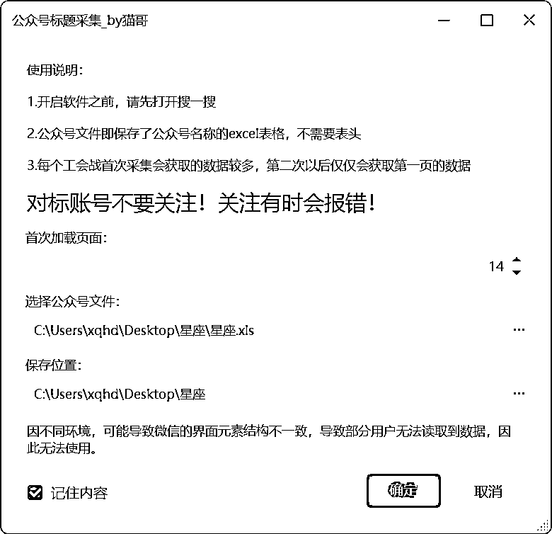
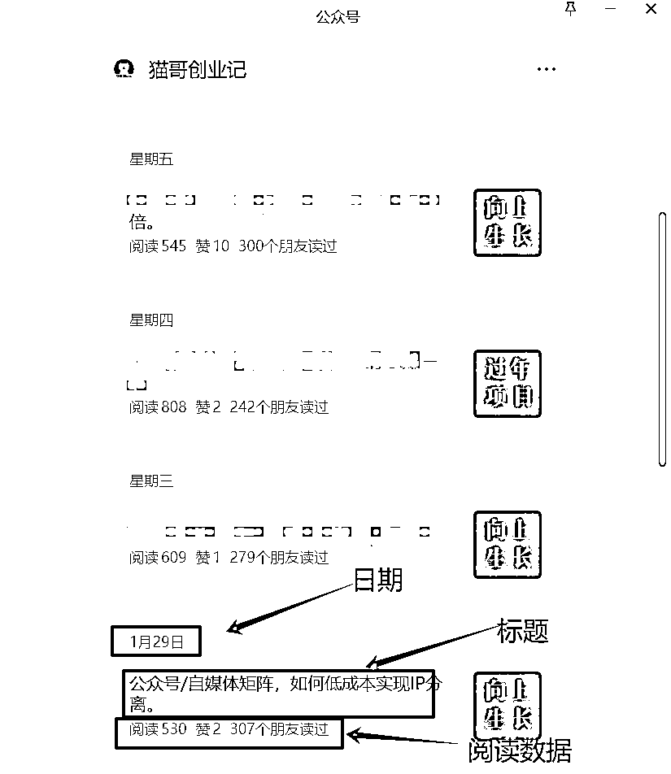
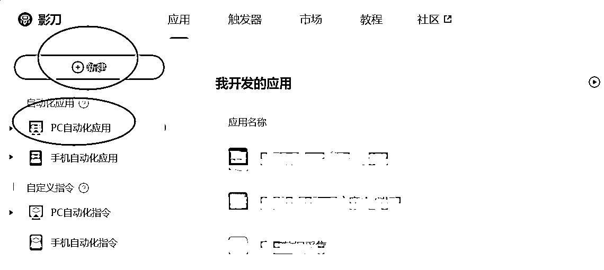
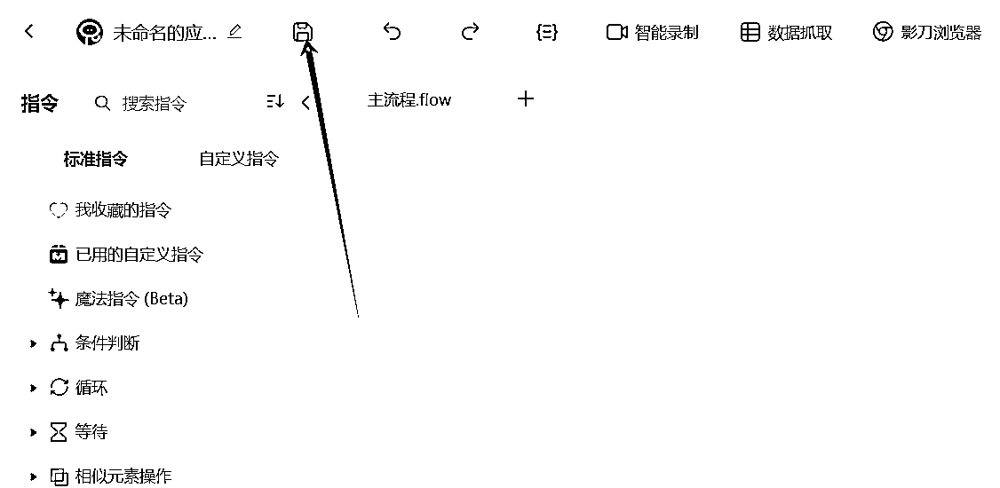
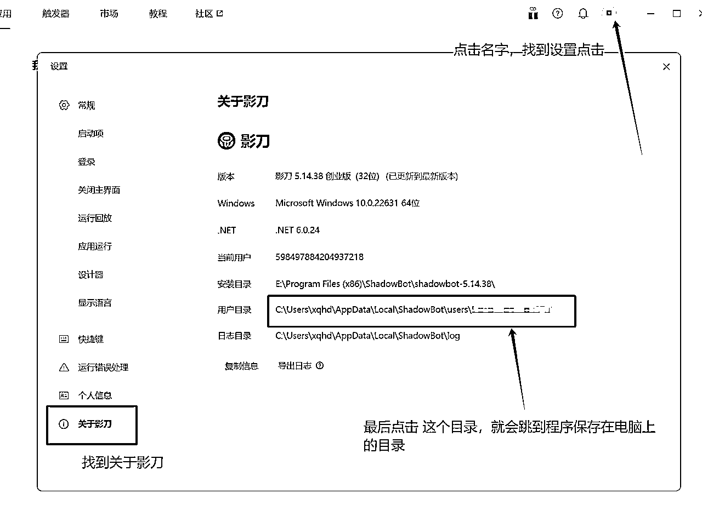
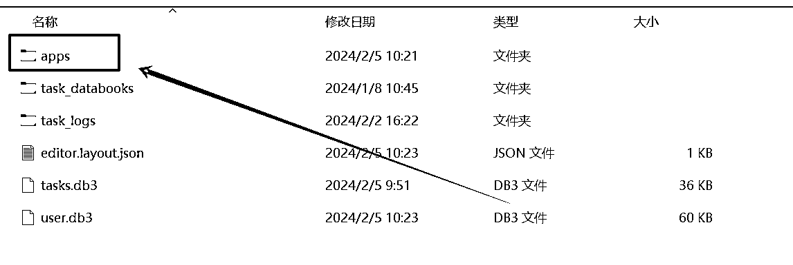
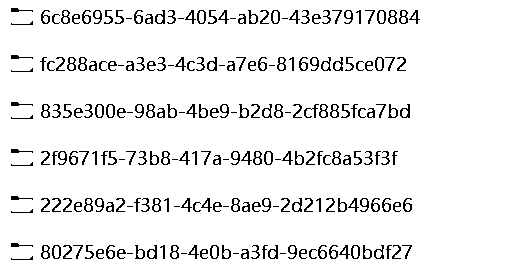
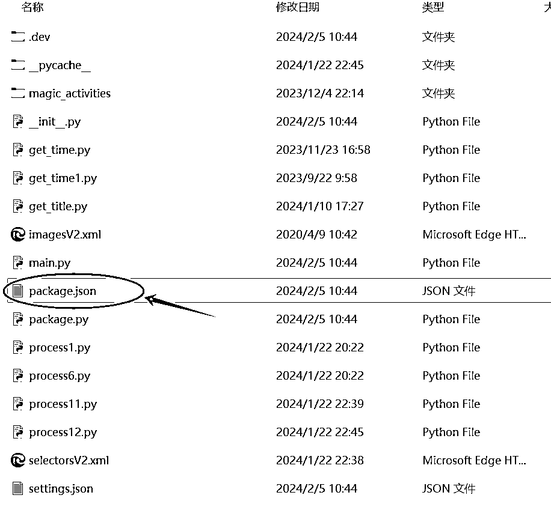
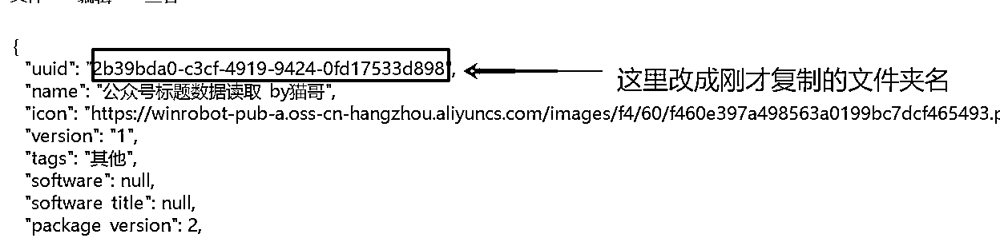

# 来波大的，公众号爆款标题获取工具源码分享，做自己的工具

> 来源：[https://ex5bha8e8ip.feishu.cn/docx/A8ksd6GwCoryFTxIH2YcD2GAnac](https://ex5bha8e8ip.feishu.cn/docx/A8ksd6GwCoryFTxIH2YcD2GAnac)

# 写在前面

前阵子分享了，一个工具，公众号爆款标题获取，很多小伙伴反馈使用起来大大提高了效率，发现了新世界。

接下来，我希望做的是，发现更大的新世界，看到更多的可能。

很多时候，我们总是对未知充满了恐惧，谈到程序代码，就觉得很难，依稀记得，我当初写第一个程序的时候，也是找人写的，那个时候只是按键精灵，写完后别人给我源码，我打开的那一刻，我发现并不是那么难，因为里面都是中文代码。从此消除了我对程序的看法，也让我开始慢慢自学程序，到目前为止已经学习过了很多开发语言，从按键精灵，易语言，php，js，python都有所了解，也都开发出来一些产品，提高了自己的效率。

对于这个充满未知，充满多变的未来，多掌握一门技巧总是好的，特别是RPA，这种搭积木的方式，对于新手学习很友好，本次分享更多是让你了解程序的原理，实际上如果要做好一个好的产品，还需要去不断学习。

# 开发思路

这款小工具开发的背景是由于自己经常要搜索这些对标账号，查看阅读数据，从而获取爆款话题，但是每天都是重复性的工作，比较乏味，而且毫无建设性，白白浪费了很多的精力。

恰逢公众号开放了历史文章阅读，在电脑上，点击历史文章也可以直接看到阅读数据，刚好又有小伙伴反馈在B站看到这样一款工具，但是太贵了，问我能不能做出来，起初我以为很简单，实际上并没有那么容易。

# 开发过程

## 1.拆解动作

首先把整个操作拆解下来，就得到了如下的流程。

打开搜一搜搜索公众号->点击公众号->滑动查看历史文章数据->读取数据进行保存

这是一个循环过程，不断地循环就可以获取不一样的公众号数据。

## 2.操作难点

在搜一搜的搜索结果页面，可能会搜出来多个公众号，而且目标公众号有的时候并不是排在第一，所以盲目的点击第一，是肯定不行的。

为了更加准确的识别，这里就需要对元素抓取过程进行编辑，然后做一个变量传递到元素中去，从而找到唯一的正确值。

在历史文章页面，这里可以看到我们要获取的有3个点，分别是日期，标题，阅读数据。

原本以为我只要获取最外面的整个元素结构，然后再通过获取子元素的方式就可以分别获取到这些数据。

然而另外意外的是，这些数据全部不是一个父元素，甚至差了很多个结构。

最终只能分别获取这些数据，但是获取这些数据后，都是分离的，如何正确的匹配也是问题。

最终经过研究，把这些元素的位置取出来，分别按位置排序即可正确匹配。

## 3.完善优化

经过一系列的操作，最终终于开发出来了，但是作为一个windows程序，不像是网页程序，结构框架那么固定，实际使用过程发现有些win10电脑和win11电脑上的结构并不一样，又进行了多次匹配，最终实现同时兼容win10和win11。

另外为了更能清晰看到阅读数据，同时采取了2种保存模式，每个公众号既分开保存，同时又合并保存，创建了一个合集表格，把所有的数据都写入进来，同时还有按公众号独立保存的表格，便于单独对比。

# 源码迁移

声明：本方法无破坏影刀的任何程序，仅通过复制粘贴来实现源码的迁移，如有侵权，请联系删除。

由于影刀本身查看代码需要企业版，但是大部分小伙伴都是没有企业版，于是就用这种方法来帮助大家实现，本方法仅供大家学习交流，做出更好的程序。

我们需要准备的工具：

1.影刀

2.原影刀程序代码

## 1.创建程序

打开影刀，点击新建，选择PC自动化应用。

点击保存，输入程序名字，即可创建一个空的程序。

## 2.打开数据文件夹

通过右侧图片的方法，找到程序目录，这个目录是存放在你电脑上的程序原文件。

找到对应的程序文件，打开apps这个文件夹，里面会有很多看起来杂乱无章的文件夹，这些文件夹就是程序的文件夹，其中文件夹名称是程序的识别码，后续我们还要用到。

## 3.迁移源码

首先通过这个链接下载源码：https://www.123pan.com/s/KtY7Vv-kQuzv.html

下载完成以后，解压压缩包，在xbot_robot目录找到package.json，这个文件，然后可以直接用记事本打开。

然后找到我们刚才在第2步自己创建的程序文件夹，复制文件夹名称，然后修改这个uuid的值，进行保存。

接下来直接把整个文件夹，全部粘贴到你创建的程序文件夹里面，要保存目录的一致性，提示覆盖的时候，记得点击覆盖。

## 4.影刀验证

操作完成后，直接打开你刚才创建的程序，可以看到是现在的这个情况，说明就是成功了，直接点击保存就可以了。

# 关于学习

影刀运行的底层是基于python，所以实际情况是可以实现很强大的功能的，里面可以引入python包，直接调用。

学习的话，我是在B站搜索相关的教程学习的，整个过程比较简单。

# 写在最后

现在AI已经很强大了，很多程序只需要我们了解最基本的，然后直接把我们的需求告诉AI，AI就可以帮助我们来创作程序，遇到报错直接粘贴给AI，分分钟给你正确的代码，你要做的就是不断告诉他，不断让他改，最终就大概能满足你的需求。

现在的时代是急剧变化的，每个人都在追求效率，而提高效率最快的方法就是不断使用程序来替代我们完成工作，才能体验科技带来的快乐，而不是永无休止的工作。

那么，就先走进去，再抽出来，好好体验生活吧，爱你所爱的人，看这个世界的繁华。