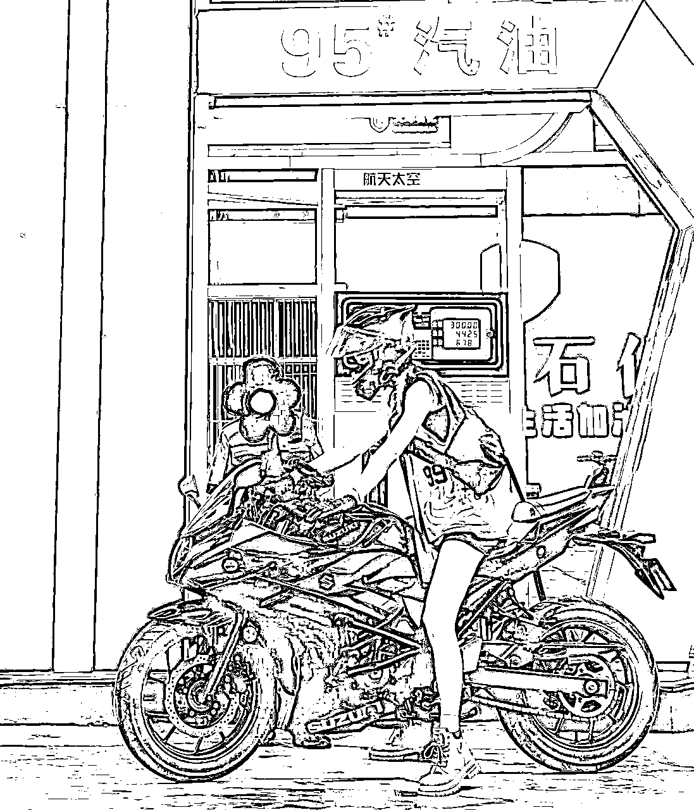
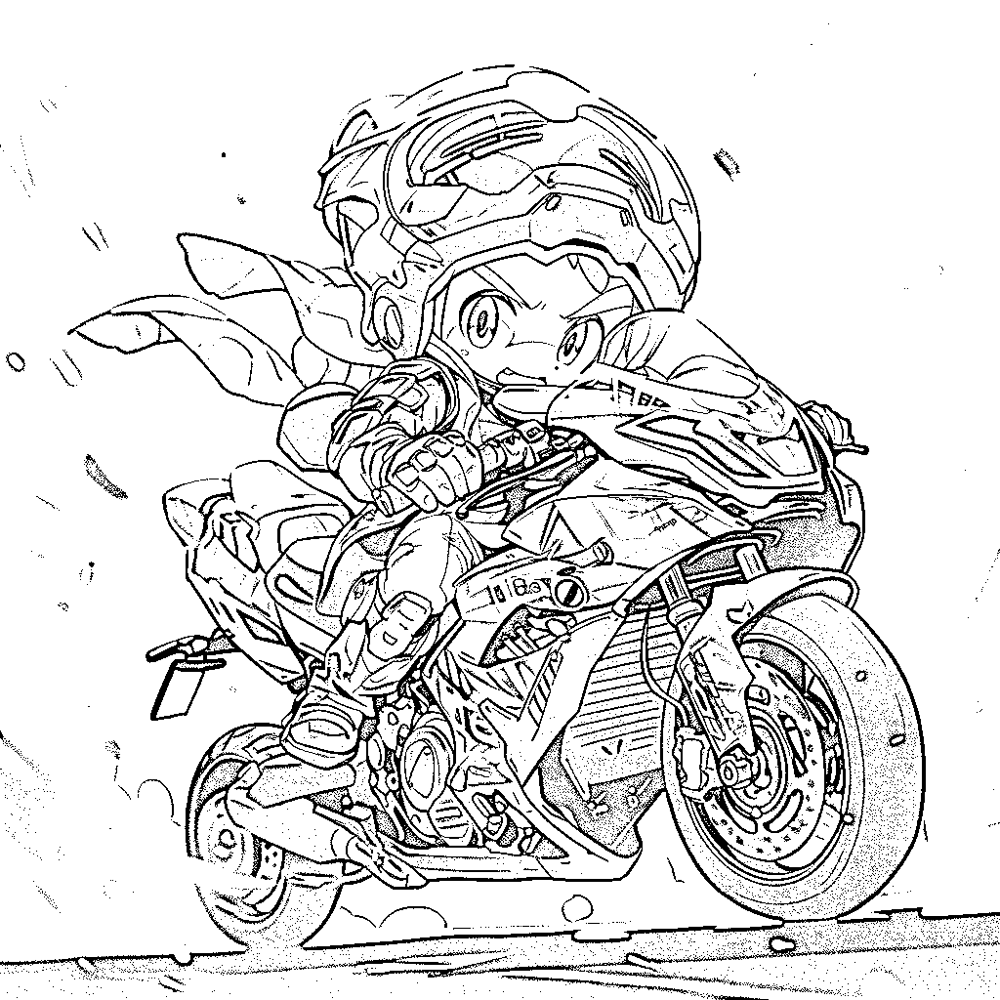

# 《AIGC变现！带领300+小白跑通赛博机车项目，完整复盘及保姆级实操手册分享！》

> 来源：[https://ry5hwpuf7b.feishu.cn/docx/A8ycdY4fDouIncxVGHLc90acnEc](https://ry5hwpuf7b.feishu.cn/docx/A8ycdY4fDouIncxVGHLc90acnEc)

大家好，我是吴东子，互联网骨灰级玩家，旗下孵化多个千万粉丝IP账号，目前在AI创业中

去年在AI的探索过程中，我发现了一个还在极早期的AIGC互联网项目异常值——AI赛博机车，思考完变现方式和路径后，觉得大有可为

于是在和洋哥的配合下，我们做了一场项目实战训练营，免费带领了300多人去把这个项目跑通

两周的时间，有数百名朋友通过这个项目快速赚到了钱，从几百到几万不等

后来，这个项目在全网被放大，越来越多人参与进来，定价变得越来越卷，很多人在赶完风口后就放弃了

但其实直到现在，仍然有非常多人在用AI赛博机车赚钱

很多时候，不是赛道变卷了就没法做了，而是自己的各种技能有没有随之迭代，继续深耕，如果自己不学会迭代，而是天天追风口，是永远成不了大事的

不过那些都是外话了，今天我会完整复盘整个流程，以及把AI赛博机车项目的保姆级实操方法分享给大家

全文近7000字，无论你是想积累自己的技能，还是想听完这整段经历，我相信都会对你有所帮助

一、完整复盘流程

1.发现异常值

2.思考价值

3.实操探索

4.成功爆发

5.总结收获

二、保姆级操作手册

1.制作公式

2.网盘链接

3.优质模板

4.常见问题

那我们现在开始

# 完整复盘操盘流程

## 发现异常值

事情从一个异常值开始

我那天在获取信息时，刷到了一个视频

这个视频的内容是：用SD技术生成 赛博朋克机甲风 图片，实现超酷的“变装”效果

SD指的是AI绘画工具Stable Diffusion，我之前也分享过教程

因为加上BGM卡点，让整个视频视觉效果很好，本就符合短视频平台的调性，可以获得比较大的流量

那我觉得异常的点在哪里呢？

无论是实现这个变装的效果，还是剪辑的效果，都非常简单，不需要什么水平

而这样简单的操作就可以在抖音获得上万赞，十万赞，甚至还有几十万赞的

这是第一个异常点，让我知道了，小白也可以用这个方式做出大流量

但如果只是流量大，还不足以引起我的重视，因为这样的异常点一天能发现非常多

让我真正觉得异常的地方，在于评论区

一个3000赞的视频，里面有1000条评论，而1000条评论里面有一大半都是发图请求帮忙制作的

这意味着什么？

意味着需求存在，而且量不少，或者说直白点意味着捡钱

接着我又挖掘到了一条更加说明异常值的案例

这是一条只有29赞的视频，做过抖音的朋友都知道29赞是非常低的了

但这条视频的评论，却有34条

而在这34条评论里，有近10条是这样发图的需求

再来看一个非常离谱的异常值例子，这个视频一定要看！！！

评论区的需求，刷都刷不完……

而这，竟然是在一个139赞的视频里出现的

139赞，100条评论，几乎全是需求

这个也是1000赞 2400评论

## 思考价值

我想看到这聪明的朋友都知道这意味着什么

要知道最重要的一点，很多时候流量不一定有用，如果流量群体没有付费能力，那流量的价值其实是不高的

而需求AI机车图的客户呢，基本都是成年人，本身自己已经愿意为机车这种比较酷的东西付费，再为一张AI机车图付费基本也不会抗拒

这个用户人群是很精准的，有需求，有付费能力

且制作成本不高，掌握了SD的人，基本2分钟就能做出一张

于是我就去和这些博主交流

其中一位博主告诉我，他的一张图是150块，每天至少能接20-30单往上

还有一位博主是免费流，即免费制作，付费可以插队，刚开始做，现在私信已经被刷爆了，每天消息根本回不过来，单单一天免费的做了300张往上，付费的有100张往上，他的单价是25一张

尽管已经有人在赚钱了，但其实这些博主本身对商业的理解是不够的，真正下场把这个当成互联网项目去变现做的人寥寥无几

## 实操探索

我判断完

第一是还没多少人知道

第二是别人不一定能意识到这是异常值

第三是本身需要具备SD技术，有一定门槛

而我正好三者兼具，所以我是能做的

对我个人来说，这个项目的上限不够高，我接一单广告就够这个做好久了

但想到或许能帮助很多互联网小白，AI小白们通过一个项目去赚到他们的第一桶小钱

更重要的是能在这个过程中，了解到互联网项目是怎么玩的，链路是怎样的

这个意义还挺大的

所以立马和洋哥发动了一场快闪分享，免费带了300多名小伙伴一起做

我一边搭建群给伙伴们解答，一边出教程完善手册

除了技术方法，lora模型，还包含账号包装，引流路径，成交话术

伙伴们只管去前面往前冲

## 成果爆发

然后，就爆了！

第二天，就有人视频火了，开始有客户在评论区和私信咨询

第三天，就有10多人开始接单

第七天，多人变现一千以上

第十天，开始有人做出百万播放，跨过万元门槛

……

## 总结收获

这个项目目前还能不能做？

能做

第一，因为信息差永远存在，这种蓝海项目更多是看你能否触达到精准人群，而非市场卷就不能做，你要知道仍然有一大堆人没有被触达到，不要觉得你在的小圈子好像全都在做就没法做了

实际上绝大多数人都是跟风追风口的，正如之前的多多视频项目，公众号爆文，天涯神贴等等项目，很多人会觉得太卷了，都被人做烂了，实际上仍然有非常多人在里面赚钱，你需要根据环境的改变自己去迭代，而不是只靠别人喂饭给你吃

第二，这类项目的本质是用AI做有趣的定制产品，再通过内容做流量吸引客户再私域成交

随着AIGC技术的发展，越来越多有趣的AI定制产品都随之出现，无非是一些变现价值更大，一些变现价值比较小，但接下来只要技术成熟了，通过信息差就能吃到AI的红利

这个项目里赚到钱的人都有什么特点？

足够“傻”

你没听错，就是要自己足够傻，这个话的意思不是真傻，而是当他们面对未知的知识时，愿意听话照做，先老老实实跟着教程做，直到自己能做好了，再开始独立思考，加上自己的想法

最怕就是自以为是的小伙伴，自己觉得懂得很多东西，然后这里搞搞那里搞搞，实际很糟糕

以上就是整次经历的复盘，希望对大家有所启发

之后说不定还会发现一些优质项目，也会分享出来和大家一起探索，接下来我们讲具体的保姆级实战方法

# AI赛博机车保姆级手册

AI赛博机车图，一句话来说就是，用SD技术生成「赛博朋克机甲风」图片，实现超酷的“变装”效果

①因视觉效果非常好，本就符合传播属性，做成内容在自媒体平台发布，便可以获得相对比较大的播放量——【流量有了】

②同时，又因机车一族群体，对酷的东西有追求，经过数据验证，他们会愿意为这样一张定制化图片付费——【需求有了】

所以一张图片就可构成流量、产品闭环，于是AI赛博机车图成为了一个互联网副业小蓝海项目

如果你有一点Stable Diffusion的基础，基本无能照着步骤操作也可以制作出来

如果你一点基础都没有，可以先去了解一下，或者看我之前发的教程也行

SD终极教程

文字版：

视频版：https://www.bilibili.com/video/BV1yz4y137Yy/

## 整合资料网盘链接

大模型、Lora、ControlNet、Embedding文件、PNG信息提取：

链接：https://pan.baidu.com/s/1u6XKK7NVQ0WC0AoLlweQHw?pwd=sky6

提取码：sky6

## 制作公式

①大模型

②提示词

③基础参数

④Lora及触发词

⑤ControlNet

⑥剪映模板

### 一、大模型：

1.  majicMix Realistic（真实机械风）

1.  comix v3.1（赛博次元风）

### 二、正向提示词：

①画面高质量词：4k,best quality, masterpiece, high quality,realistic,finely detailed,ultra highres,(photorealistic:1.4),

②对画面的描述：1 girl, a motorcycle,helmet,Reflective windshield,solo,

③基础风格词：mecha,mech clothes,neon lights,

④霓虹灯 Lora：neon,CyberpunkAI,GlowingRunes_red,<lora:glowingrunesaiv4:0.5>,</lora:glowingrunesaiv4:0.5>

⑤机甲、机械 Lora：robot,roblit,mecha musume,mechanical parts,robot joints,headgear,

<lora:amechasss musume="" parts="" joints="">,</lora:amechasss>

⑥增加细节 Lora：<lora:add_detail:1>,</lora:add_detail:1>

### 三、负向提示词：

3个Embedding：

*   EasyNegative

*   ng_deepnegative_v1_75t

*   badhandv4

通用负向关键词：

nsfw,worst quality, low quality,lowres, watermark, monochrome, grayscale, ugly, blurry, Tan skin, dark skin, black skin, skin spots, skin blemishes, age spot, glans, disabled, distorted, bad anatomy, morbid, malformation, amputation, bad proportions, missing body, fused body, extra head, poorly drawn face, bad eyes, deformed eye, unclear eyes, cross-eyed, long neck, malformed limbs, extra limbs, extra arms, missing arms, bad tongue, strange fingers, mutated hands, missing hands, poorly drawn hands, extra hands, fused hands, connected hand, bad hands, wrong fingers, missing fingers, extra fingers, 4 fingers, 3 fingers, deformed hands, extra legs, bad legs, many legs, more than two legs, bad feet, wrong feet, extra feets,

### 四、基础参数

①迭代步数：30（28-32都可以试试看）

②采样方法：DPM++ 2M Karras 或者 DPM++ 2M SDE Karras

③宽高比不用设置，后面会自动调节的

④总批数设置4批，抽卡概率高些

⑤随机数种子：-1

### 五、Lora及触发词

1.霓虹灯 Lora：

①（neon）CyberpunkAI

触发词：neon,CyberpunkAI,

②GlowingRunes

触发词：GlowingRunes_red,

red可自由替换成：paleblue、green、purple、yellow、pink

2.机甲 Lora：

①Robotaction

触发词：robot,roblit,

②AMechaSSS

触发词：mecha musume,mechanical parts,robot joints,headgear,

3.增加细节Lora：

①Add_detail

触发词：无

### 六、ControlNet

①把启用、Pixel Perfect（完美像素）、Allow Preview（允许预览）打开

②ControlNet模型选择：Lineart或者Tile

Lineart的采样方法是线稿，用来出次元画风

Tile的采样方法则是先模糊再放大，用来出真实画风

③弄完点击蓝色框框可以把图片尺寸替换上去，但是要注意会不会过大，如果过大就要长和宽都除以2

### 七、剪映模板

①一秒出镜全框版

https://lv.ulikecam.com/activity/lv/sharevideo?template_id=7249025953911950604&sec_uid=MS4wLjABAAAAkR2OxCv1nxHPiWsHeci6Brf9-TtY-c6u8OWMxDQFcNt34oN_-AaRoEuO1LEdjdaY

②一秒出镜小框版

https://lv.ulikecam.com/activity/lv/sharevideo?template_id=7053036033767640331&sec_uid=MS4wLjABAAAAkR2OxCv1nxHPiWsHeci6Brf9-TtY-c6u8OWMxDQFcNt34oN_-AaRoEuO1LEdjdaY

③压迫感拉镜横屏版

https://lv.ulikecam.com/activity/lv/sharevideo?template_id=7235896419435957564&sec_uid=MS4wLjABAAAAkR2OxCv1nxHPiWsHeci6Brf9-TtY-c6u8OWMxDQFcNt34oN_-AaRoEuO1LEdjdaY

④压迫感拉镜竖屏版

https://lv.ulikecam.com/activity/lv/sharevideo?template_id=7235264616488553785&sec_uid=MS4wLjABAAAAkR2OxCv1nxHPiWsHeci6Brf9-TtY-c6u8OWMxDQFcNt34oN_-AaRoEuO1LEdjdaY

## 优质模板

以下案例都已打包好放在网盘链接里的PNG信息库中

可以到SD的PNG图片信息中，直接提取同款提示词和参数设置

### 1.真实机械风

大模型使用majicMix Realistic，ControlNet使用Tile

提示词：

4k,best quality, masterpiece, high quality,realistic,finely detailed,ultra highres,(photorealistic:1.4),

1 girl, a motorcycle,helmet,Reflective windshield,solo,

mecha,mech clothes,neon lights,

neon,CyberpunkAI,GlowingRunes_red,<lora:glowingrunesaiv4:0.5>,</lora:glowingrunesaiv4:0.5>

robot,roblit,mecha musume,mechanical parts,robot joints,headgear,

<lora:amechasss musume="" parts="" joints="">,</lora:amechasss>

<lora:add_detail:1>,</lora:add_detail:1>

提示词：

4k,best quality, masterpiece, high quality,realistic,finely detailed,ultra highres,(photorealistic:1.4),

1 girl, helmet,a motorcycle,helmet,Reflective windshield,solo,

mecha,mech clothes,neon lights,

neon,CyberpunkAI,GlowingRunes_purple,<lora:glowingrunesaiv4:0.5>,</lora:glowingrunesaiv4:0.5>

robot,roblit,mecha musume,mechanical parts,robot joints,headgear,

<lora:amechasss musume="" parts="" joints="">,</lora:amechasss>

<lora:add_detail:1>,</lora:add_detail:1>

提示词：

1girl with helmet,white neon lights,(Lights Strip:1.4),(neon lights:1.8),1 mechanical girl,

(Mechanical clothes:1.4),mecha,A glowing mech,mechanical parts,mechanical arms,(Glowing helmet:1.6), motorcycle, outdoors, solo, sky,mechanical skeleton,8k,best quality,masterpiece,extremely delicateand beautiful,wallpaper,realistic,(photorealistic:1.4),finely detail,masterpiece,best quality,

(Mechanical body:1.4),ultra high res,(mechanical joints:1.3),more mechanical lines,

### 2.赛博次元风

大模型使用comix v3.1，ControlNet使用lineart

提示词：

best quality, masterpiece, high quality,realistic,finely detailed,ultra high res,

1 girl with a helmet riding amotorcycle,Mechanical body,Mechanical clothers,mecha, helmet,

sitting on a motorcycle,(Neon clothes:1),background,hlurry,starry sky,colourful background,bokeh,

((neon light:1),portrait,sidelocks,Cyberpunk clothes,clothes,

提示词：

Red and blue, Optimus Prime,(1mechanical boy),solo,looking at viewer,Cyberpunk city setting,

Mech helmet, robot,standing,A glowing mech,((ultra realistic details)), portrait, global illumination, shadows,

octane render,8k, ultra sharp,metal,intricate, detailed ornaments, cold colors, Egyptian detail,

highly intricate details, realistic light, trending on cgsociety, glowing eyes, neon details, machanical limbs,bloo

提示词：

Red and blue, Optimus Prime,(1mechanical boy),solo,looking at viewer,Cyberpunk city setting,

Mech helmet, robot,standing,A glowing mech,((ultra realistic details)), portrait, global illumination, shadows,

octane render,8k, ultra sharp,metal,intricate, detailed ornaments, cold colors, Egyptian detail,

highly intricate details, realistic light, trending on cgsociety, glowing eyes, neon details, machanical limbs,bloo

### 3.真人露脸图

大模型使用majicMix Realistic，ControlNet使用Tile

会偏概率抽卡，不一定百分百出好看的

1girl, neon lamp , masterpiece,

high quality, best quality, beautiful, perfect lighting, detailed face, detailed body,

(((photorealistic, hyper-realistic, RAW photo:1.2))),

intricate details, 8k uhd, perfect face, perfect eyes,biomechanical, mechanical parts,dramatic lighting, cyborg ,(FULL BODY:1.1),ruins,

1girl, neon lamp , masterpiece,

high quality, best quality, beautiful, perfect lighting, detailed face, detailed body,

(((photorealistic, hyper-realistic, RAW photo:1.2))),

intricate details, 8k uhd, perfect face, perfect eyes,biomechanical, mechanical parts,dramatic lighting, cyborg ,(FULL BODY:1.1),ruins,

### 4.星空机甲图

大模型使用majicMix Realistic，ControlNet使用Tile

提示词加上(((White and golden))),(starry_sky:1.3),(hyper_galaxy:1.3)

提示词：

1 girl,a motorcycle,helmet,Reflective windshield,solo,

(((White and golden))),(starry_sky:1.3),(hyper_galaxy:1.3),mecha,mech clothes,neon lights,muscle-like lines of the mecha，reflected metal，

4k,best quality, masterpiece, high quality,realistic,finely detailed,ultra high res,(photorealistic:1.4),

robot,roblit,mecha musume,mechanical parts,robot joints,headgear, <lora:amechasss musume="" mechanical="" parts="" joints="">,</lora:amechasss>

<lora:add_detail:1>,</lora:add_detail:1>

## 路线图

第一周，先在3天内把基础任务完成，剩下4天把进阶任务完成

第二周，全力操作跑结果

第三周，没出结果反思复盘迭代后继续跑，跑出结果看怎么放大

基础任务——跑通内容闭环：

进阶任务——内容迭代+跑通变现闭环：

## 问题答疑

### 一、账号问题

#### 1.老账号能不能用？新账号需要养号嘛？以前发过视频有没有影响？以前视频需要删掉还是隐藏？等等这些账号问题

一句话回答完：只要账号没有违规过，不管什么账号都可以发，绝大概率情况下不会出问题，万一出问题了你换个新号发不就解决了嘛

因为你不是做1-2天，是做半个月以上，意味着至少10-20期视频。在内容质量是好的情况下，一个账号不可能一点效果都看不到。如果看不到，内容又没问题，就是账号问题了。这时候再换个新号，原账号视频删掉，换新账号再发即可

绝大多数数据不行都不是账号问题，而是内容问题（得从观众视角去判断，这个内容是不是他们真的会看的）

只有说你发了10条内容左右了，数据还是在1-99两位数之间徘徊的，那就是账号不行，换个账号即可

完全全新注册的账号，可以稍微养养号：用流量数据模式，刷1-2天抖音，让账号看起来像个正常人就可以

以前发过的无关的视频，隐藏和删掉都可以，不隐藏也没大问题，隐藏会给观众看起来定位清晰一点

#### 2.账号主页怎么包装

参考破局圈友【刘驴】驴哥团队的简介

①头像元素尽量少，让小图时也能看清即可

②壁纸清晰可见

③名称不要太营销属性即可

④简介例子：

⭐️AI探索家｜机车爱好者

🉑️制作｜学习｜合作

#### 3.视频需要同步什么平台？

抖音、小红书、视频号，这三个平台比较合适

建议选择一个平台专心运营最好，其他平台可以同步分发，但不放过多精力

#### 4.视频发布多久才有流量？

不要去纠结于刚开始发1-2期的流量，一天做个3-5期，先发个10期等几天再看看

把重心和精力放在怎么让你的内容更好上，这才是最重要的

### 二、出图问题

#### 1.是关键词、大模型、ControlNet完全照抄就可以了吗？

不是，现有提供的只是为了给大家快速的入门，至少你能实现出AI赛博的风格出来了

因为每一张原图的不一样的，如果想做出真正好看，适配的AI赛博图，需要自己去多多测试

不同的关键词、大模型、ControlNet都会出来不一样的效果，自己多去试一下，才能更深刻感受到每一种的区别在哪里，之后才能更好的迭代

#### 2.用文生图还是图生图？

都可以，最好的答案是都试试

#### 3.出来的图片和上传的没有半毛钱关系，以及用不了ControlNet

虽然有ControlNet，但是没有装ControlNet的模型，需要把模型和预处理器都装上

#### 4.Lora使用方法

①放到这个文件夹里

②web ui里点击这个小红书

③点击刷新，就可以用Lora了

提示词里：<lora:glowingrunesaiv4:1></lora:glowingrunesaiv4:1>

注意最后这个1的参数可以调节，过强了就调成0.5，弱了就1.3，<lora:glowingrunesaiv4:1.3></lora:glowingrunesaiv4:1.3>

#### 5.出的头盔图露脸怎么办？

试试头盔护目镜这个词

### 三、内容问题

#### 1.为什么【一秒出镜】剪映模板自动生成漫画风了？

因为有很多个一秒出镜模板，有一些是用了配套的“AI生成”的，会自动生成机甲漫画风

需要找到没有带“AI生成”的一秒出镜模板就可以用了

#### 2.剪映模板都已经能一件生成了，这个项目是不是就没有门槛了？

不是，你用过剪映生成就知道出来的图有多离谱，完全达不到内容的成分，用户也不会为此买单

对比一下原图、剪映、SD，应该能看出来吧hh

#### 3.抖音小红书如何无水印下载视频或者图文

微信小程序搜索“去水印助手无损”，每天看一次广告可以无限下载

有其他工具也欢迎推荐

### 四、引流问题

#### 1.怎么引流，引流有哪些方式？

注意！

①账号不要一上来就引流，多发点内容，账号权重提高之后再去做引流的动作

②不要担心会不会因此损失了那几个客户，视角放长远一点，内容不爆的话客户也多不到哪里去，内容爆了再参照的引流方法来做也不会迟，但万一因为 引流动作 失去了 爆款机会，就得不偿失了

③引流都存在风险，没有绝对安全，都会有风险

##### 1）群聊引流

抖音或者小红书都可以建群聊，通过群公告、群消息、小卡片来引流

抖音群聊直播一次就可以创建，不过直播需要实名，然后1万粉才能显示在主页

小红书群聊都可以创建，点击底部“消息”，右上角＋号，即可创建群聊

##### 2）简介小号引流

主页艾特小号账号，小号置顶图文联系方式

##### 3）直播引流

通过直播现场做图片，有观众的话可以让他们加粉丝群发图，你现场做

第1单免费，第2单收费

或者第1单免费，要拿高清图加V进私域

需要注意自己电脑配置能不能支持“直播+SD生图”

#### 2.引流话术

①可参考圈友【大东】的话术，说得非常好，既不得罪客户，又把付费意思表达了

但引流方式尽量换一个，直接发微信的话风险有点大

②圈友【sky陈天】的话术，把情况都阐明了

这种发图的方式比较容易形成成交，但被检测到的概率也会大一些，前期小小引流可以，后期建议还是用更隐蔽的方式

### 五、变现问题

#### 1.怎么去定价比较合适？

如果你的视频流量很大，出的图质量很高，别人认定了你这个人话，定价可以高一点，因为有议价权，99元一张都会有客户买单

如果你还在刚起号阶段，其实就有很多探索的方式了

现在就已经有3种方式了

①因为AI做的数量有限，每人限量免费一张，想要更多可以49.9直接定制

②发图可以免费排队制作，28.88可以插队

③免费做图，但是给有点模糊的图（嘴上说因为平台压缩），如果要高清原图可以加v进私域给，这样后续再去做营销

④和机车博主合作，你帮他们做，他们发共创视频带上你，这样可以吸一点流量

核心还得是靠爆款，爆款做出来了，需求就来了，到时候选择哪种变现方式都可以

#### 2.如何做到超预期交付！MJ机车图

小米发家主要靠口碑传播，之前在雷军的一本书上学到“用户需要的不是性价比，而是超预期”

很多人认为，好产品就会有口碑，或者便宜的产品有口碑，或者又好又便宜的产品有口碑

如果你这么想，可能会很失望，为何你做了但是没效果。什么产品有口碑呢？最重要的是“超越用户的预期”，超过客户的心理期待，这个产品才会产生真正的口碑

同理我们做的这个机车项目虽小，但却是跑通了一个从公域做内容流量，引流转化到私域销售，的一套完整闭环，这个其实已经有点商业模式的雏形了，剩下无非是换成更高客单价的产品，或者更有效率的流量打法

所以我就想我们的AI赛博机车项目如何做到超预期，对客户来说超预期了，他可能还会复购，还会把你推荐给他的朋友，1个公域流量转进来，就可能会带来2-3个私域潜在客户，让大家慢慢感受商业的魅力

这里可以用到的工具是Midjoueny，因为MJ的特点就是简单高效，只需要输入提示词就能输出很精美的图片，不需要像SD搞这个大模型，那个ControlNet之类的

试想这样一个场景：

你给客户定制完SD图片，她本身很满意的收货了，这时你再给她一张专属的MJ二次元画风机车头像，又可爱又酷，她肯定就超开心了。

即便你之前定制的SD图她如果没有特别满意，你这一通操作下来，她也会觉得你很真诚，也会把口碑打出来！

具体怎么使用MJ这里我就不多说了，大家看我之前的文章或者网上搜一搜都有

我直接把我拆解好的提示词分享出来，大家只需要根据客户图片去描述一下翻译成英文再替换上去就可以

关键词拆解：

A little boy wears a helmet on his head and rides a motorcycle,Cute,handsome,full body, anime style, chibi,motion blur, cyberpunk,the best quality --niji 5 --s 200

一个小男孩头上戴着头盔，骑着摩托车，可爱，帅气，全身，动漫风格，赤壁，运动模糊，赛博朋克，最好的质量--niji 5 --s 200

加粗字体可以随意更换

横向思考：

A girl in a black jacket and a helmet rides a pink motorcycle,cute,handsome,full body, anime style, chibi,motion blur, cyberpunk,the best quality --niji 5 --s 200

穿着黑色夹克和头盔的女孩骑着粉色摩托车，可爱，帅气，全身，动漫风格，赤壁，运动模糊，赛博朋克，最好的品质--niji 5 --s 200

### 六、SD问题

#### 1.大模型怎么安装？

这里的SD根目录就是大家在下载时，存放SD的那个文件夹

#### 2.宽高比插件怎么安装？

①找到【扩展】选项

②点击加载扩展列表

③搜索【Aspect】

④安装【Aspect Ratio Helper】

云平台用户也可自行安装

https://github.com/thomasasfk/sd-webui-aspect-ratio-helper.git

#### 3.ControlNet怎么安装？

①下载预处理器

下载网盘里的《1.预处理器》文件夹

里面有一个“downloads”文件夹

把整个文件夹复制到SD的文件夹里面

具体位置：SD文件 > extensions > sd-webui-controlnet > annotator

②下载模型

下载网盘里的《2.模型》文件夹

里面有14个模型，把这些模型复制到SD文件夹里

具体位置：SD文件 > models > ControlNet

# 最后

以上就是这篇文章的全部内容了，希望能对大家有所帮助