# 风向标拆解第3期--小红书高销量手串背后的逻辑--安妍

> 来源：[https://p8rx5phwj1.feishu.cn/docx/AEGXdPZ2VoywS4xUH8ccb4UnnTh](https://p8rx5phwj1.feishu.cn/docx/AEGXdPZ2VoywS4xUH8ccb4UnnTh)

# 小红书手串赛道案例拆解

嗨喽我是安妍，今日分享小红书饰品手串爆品的赚钱逻辑。

重点提示由于我是在小红书前端流量部有些小小小心得。会重点分析在前端流量爆款笔记部分。后端产品部分由于我不太了解具体成本，大概简单过了一遍，有做生意的老板应该是一看就能了解，没做过生意的伙伴可以重点看小红书流量笔记部分。

为什么会选择这个账号呢

*   产品垂直，小红书上只卖围绕手串来进行售卖。

*   作品产出效率高，使用有效果的模板化的图文封面。

*   一条爆款的手串销量4.4万。在同类手串销量中算是比较高的。

* * *

# 账号流量

总结：

*   测试爆款，复制爆款，挂店铺链接。

*   薅尽爆款流量，同时探索更多的爆款模板笔记，薅完一个换下一个模板

## 1.账号数据

*   首先我是从小红书商场购物搜索关键词手串以及销量最高的产品。通过产品点击进去看到账号主页。

*   先从账号数据上来看。这个账号5.4万粉，448个笔记。46.8万的赞藏。后台查看账号起号的时间至少在一年左右。笔记内容几乎都是视频形式。图文占比不多

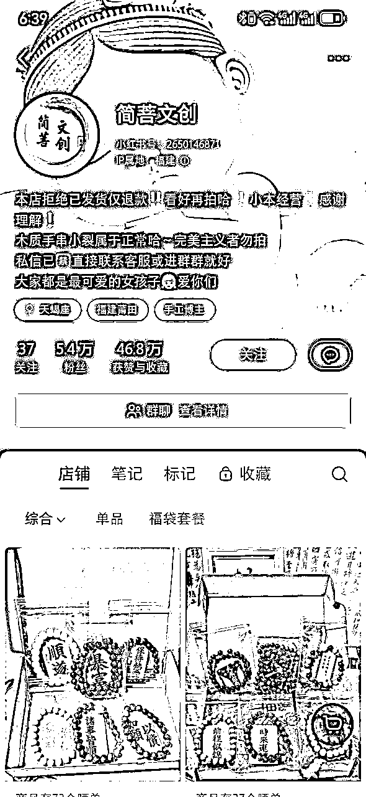

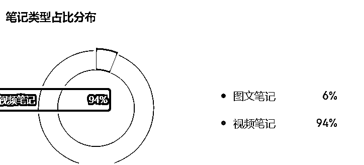

*   该账号的置顶爆款笔记有一个7.9万点赞，2.9万的收藏，2767的评论。并且同步挂了手串链接。

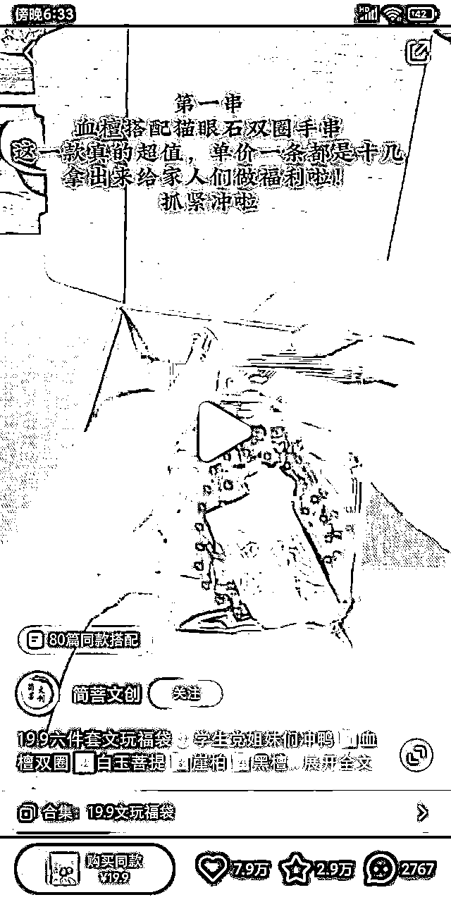

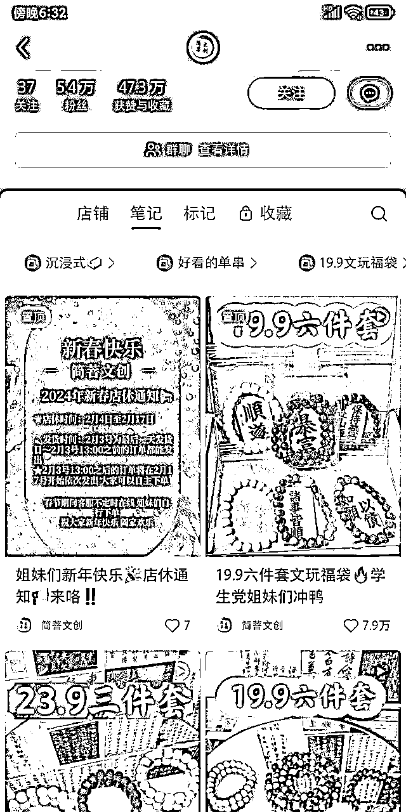

*   店铺最高的销量手串是4.4万多的19.9六件套的文玩福袋。相同的福袋的标题和相似的封面，也有一万多的购买

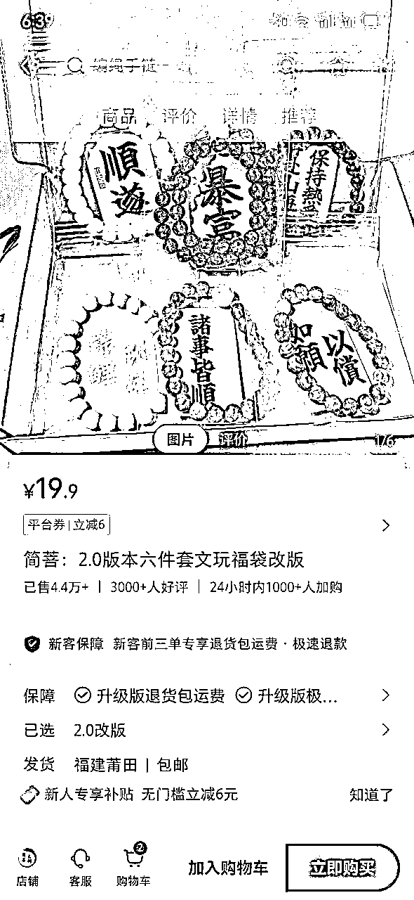

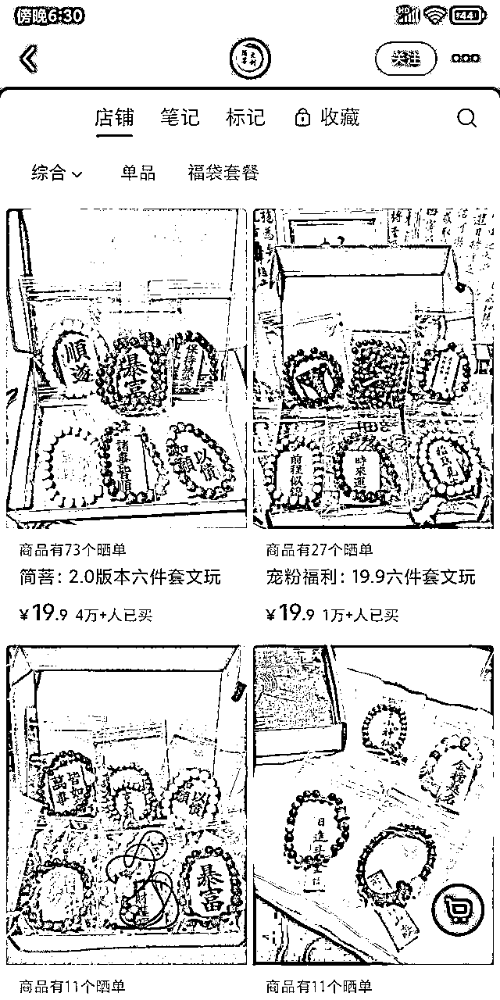

## 2.爆款笔记

*   该账号的所有视频都是视频形式的，根据过往的视频能够看到该博主的爆款视频视频其实是一点一点测出来的。

*   内容分早期和第一次爆款笔记，加上近期三部分，

*   早期视频比较混乱的，封面都是手持产品或者是上手佩戴那种，比较平平无奇不出彩。

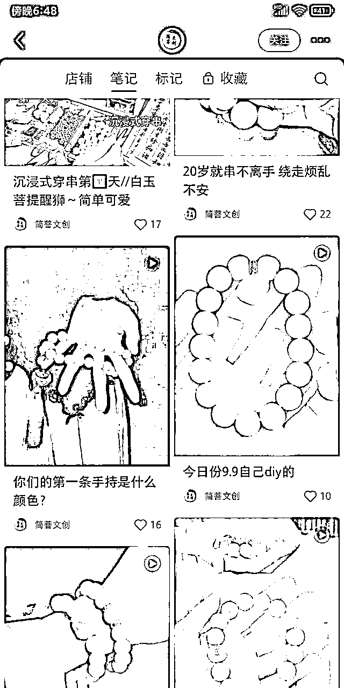

*   第一次出现爆款笔记的时候，视频内容是展示手串，打包手串，并且配上手串讲解。

*   往回推，能够看到是有几个视频也是手串打包视频，只是封面不显示，但数据有了明显的上涨。

*   这个时候最初的数据上涨的笔记封面开始了出现价格加福袋的文字。紧接着第一个爆款笔记就出现了如图二所示，爆款视频关键元素有手串价格，福袋，以及手串加祝福词的打包快递视频。

*   当第一个爆款视频出现以后，后续的封面笔记依然是在变动一直探索各种封面和拍摄场景，但基本关键元素都还在如图五和图六。

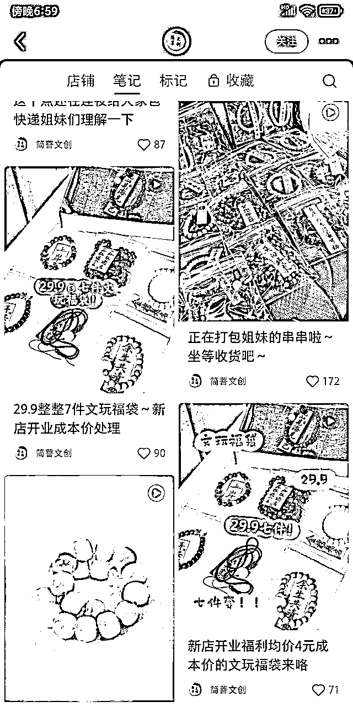

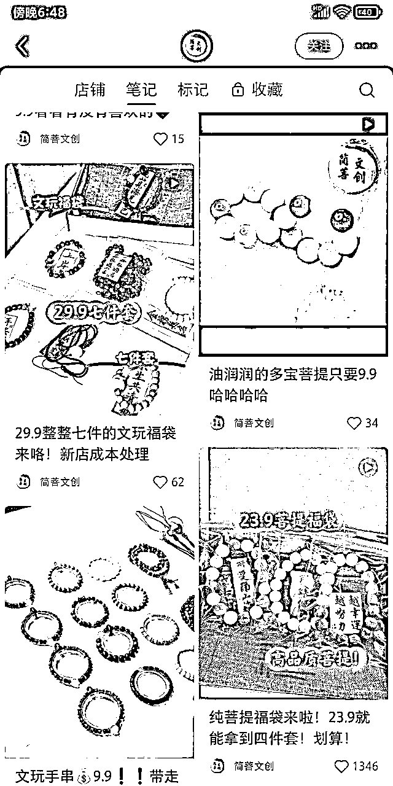

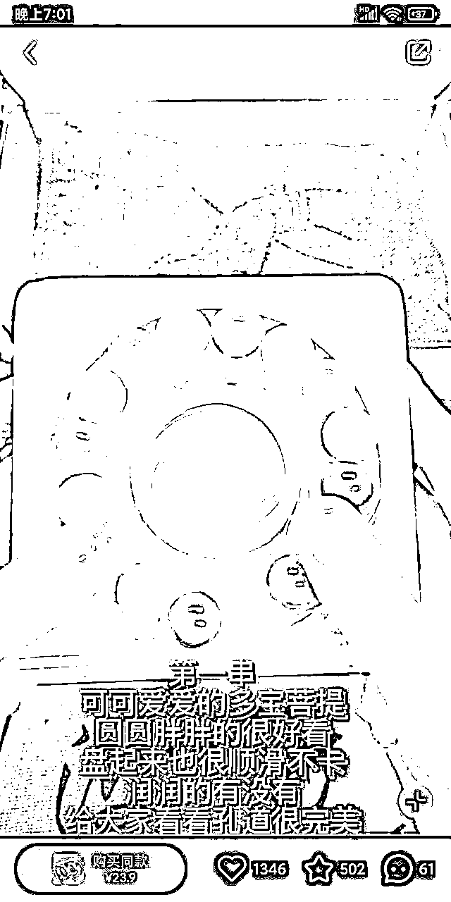

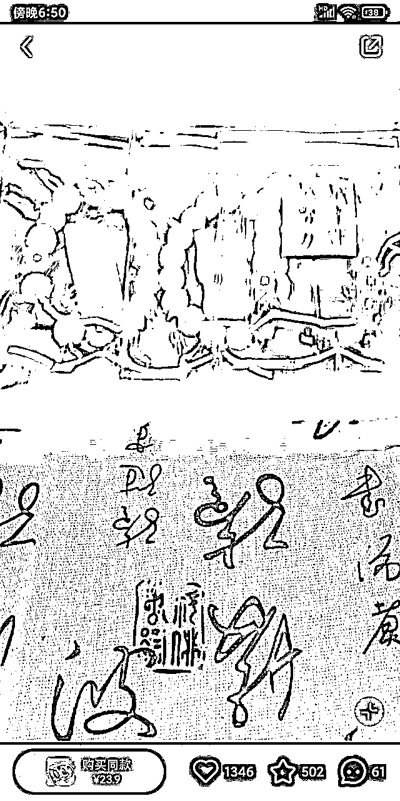

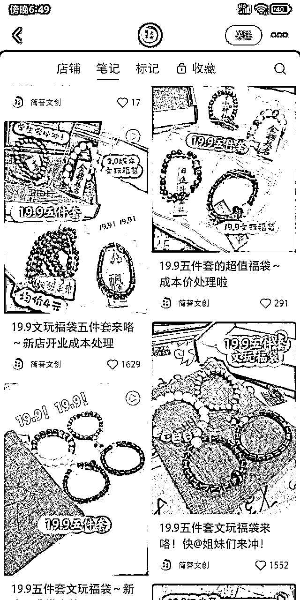

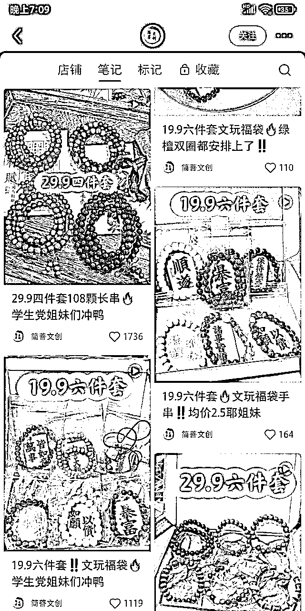

*   近期最新的视频则是找到了比较标准的模板化的封面，提高视频产出效率。

*   因为内容就是拍摄手串打包视频，只要打包的时候加上手机录视频，五、六分钟录制一套。一天产出四五十个来个视频问题不大

*   通过批量制作笔记找到爆款模板笔记，挂上车。并且把爆款笔记封面反复运用，以及19.9这个价钱，封面笔记和标题反复提及。这19.9的福袋合集里的，十个视频每个视频都有不错的数据流量。属于找到一个流量密码使劲薅的节奏。

*   一个便宜的手串爆款笔记就可以吸引不少用户下单，更何况多个爆款视频足以让店铺手串数据成交率变着更高。

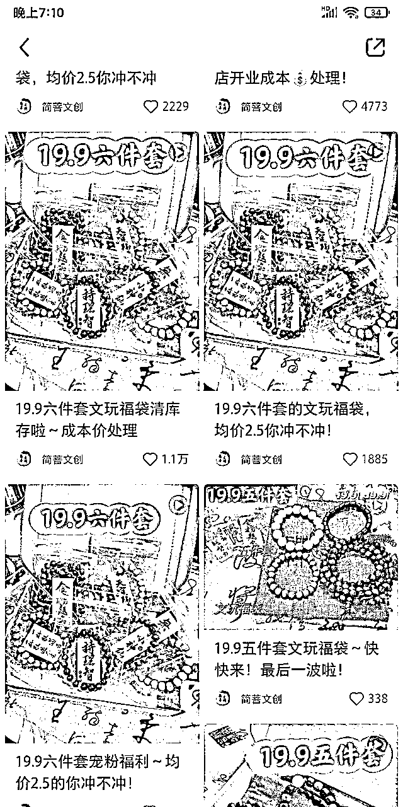

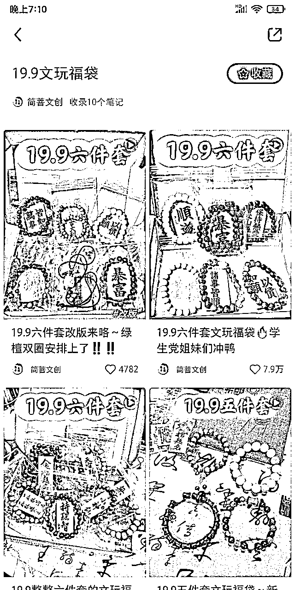

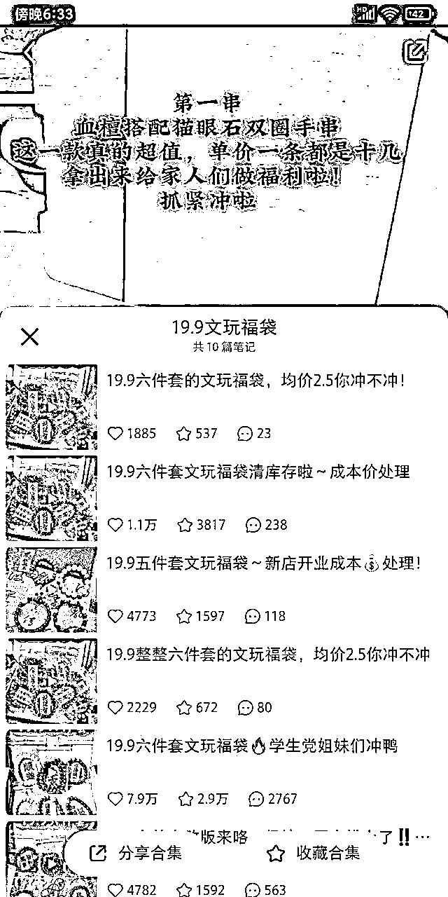

# 产品销量

*   卖的爆款产品定价是比较低的，定位的人群从大学生到业余文玩的用户。左右店铺的里的手串价格不高，在被爆款笔记吸引到，很容易比较冲动下单，不用思考决定。

*   目前店铺的价格从52、39.9、 23.9.19.9。都有，目前价格高一些的且能卖的动基本都是23.9 和39.9左右的。

*   我们来看一下整个店铺的销量。19.9的文玩手串一共累计卖出70997单，销售额是1412840。其他的暂时不算啦

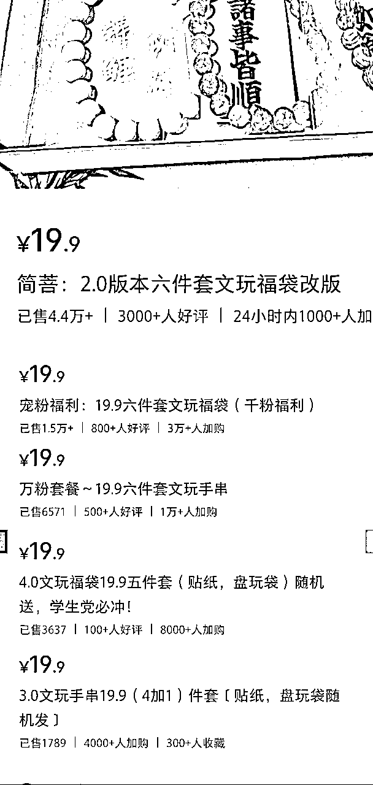

# 利润成本

我们在来看产品定价以及进价，有两种情况可以赚到最大的利润，一种是自己家有厂出货卖，一种是自身文玩渠道拿货.都可以拿到很低的进价。

*   小红书上19.9六条定价，博主销量过万的情况，我记得风向标有生财圈友提过，最低可以拿到一块甚至更低一些。这部分成本我其实不太了解，以下利润成本为预计假设情况哈，不足之处还请谅解。

*   假设19.9的六条手串，单条售价只赚一块钱，六条赚六块钱，卖出70997单就是425982元。平均到每个月利润35498.刨除各种快递打包成本，估计也有的剩，就看快递和打包能压倒多低了。更何况这是预计的最低的利润

*   实际上文玩手串在义乌应该是按也可以按几毛一串，甚至一块论斤买下来的。 更别说23.9至39.9的产品也有上千的销量来拉高一些利润点。

# 5.低价文玩手串适合谁做

*   结论下来就是在小红书上真的很适合自己家有厂，有手串资源，可以拿到最低价格的朋友们

*   普通人可以直接和有手串资源的人进行合作，普通人负责在小红书前端发视频，测爆款模板挂车，后端交给别人进行打包发货。

第一次拆解小红书赚钱案例。在对于整体以及后端利润成本，拆解和描述不足不准确之处，还请各位大佬多多包涵。有经验的小红书大佬也请多多指教。