# 风向标拆解第3期-小红书爆款，售卖件数50W+的店铺到底是怎么赚钱的-沐一

> 来源：[https://fxx6d3i9bl.feishu.cn/docx/Ag0tdawI3o4Ho1x5jykcfk1TnOc](https://fxx6d3i9bl.feishu.cn/docx/Ag0tdawI3o4Ho1x5jykcfk1TnOc)

# 结论在先

垂类视频+爆款的模式确实是有机会的。单店月利润区间为300w-330w。

这种视频+素人推广的模式确实能做，通过1天多条视频以及矩阵的形式效果比较好；与此同时，供应链把控确实很大程度决定了这款产品的产能以及低价，很考验供应链。

# 一、项目基本情况

## 1、账号

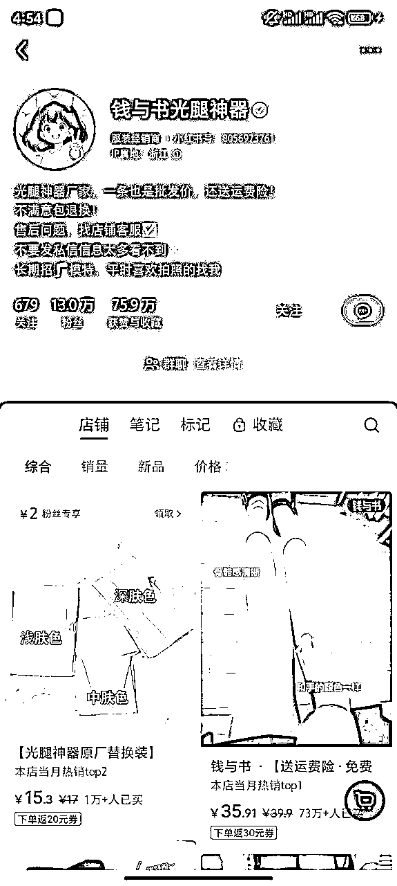

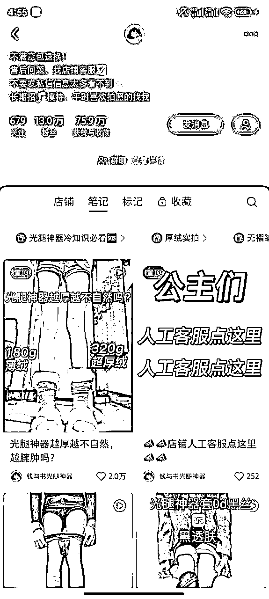

## 2、类目

光腿神器，打底袜

## 3、赛道

小红书

选择该账号拆解的原因：

*   小红书一家专卖光腿神器的女装店👉垂类店铺

*   靠视频笔记+素人推广👉起号简单

*   一条光腿神器销量74w+👉销量很高

# 二、流量与变现

1）视频剪辑

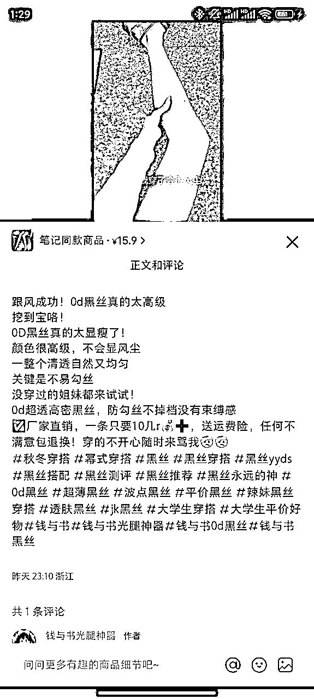

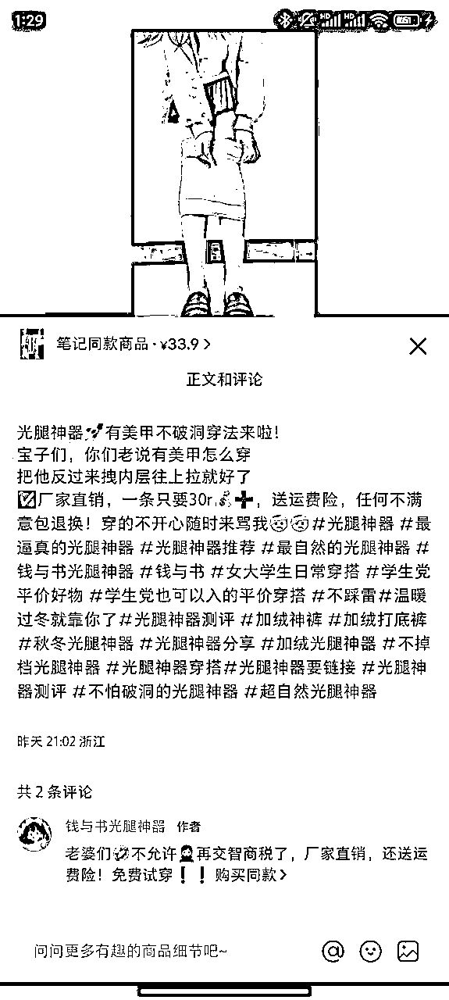

*   每天发布2-3条视频笔记，基本都挂车，尽可能多的引导用户购物。

*   一天发2条，2月1号当天发布时间为：21点、22点，以量取胜，基本每隔30条图文，会出现一个几百赞的小爆款。

*   视频内容：每个视频放都是上身效果，图上配文字，精准吸引年轻女性用户。

2）素人合作

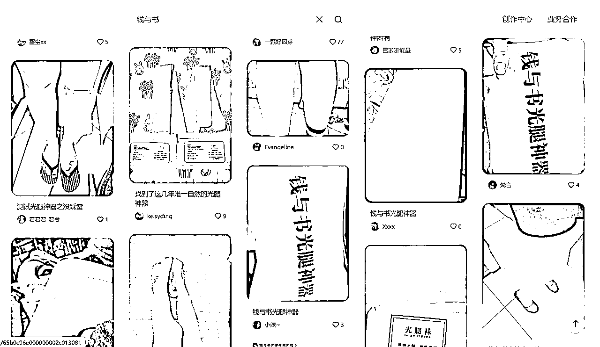

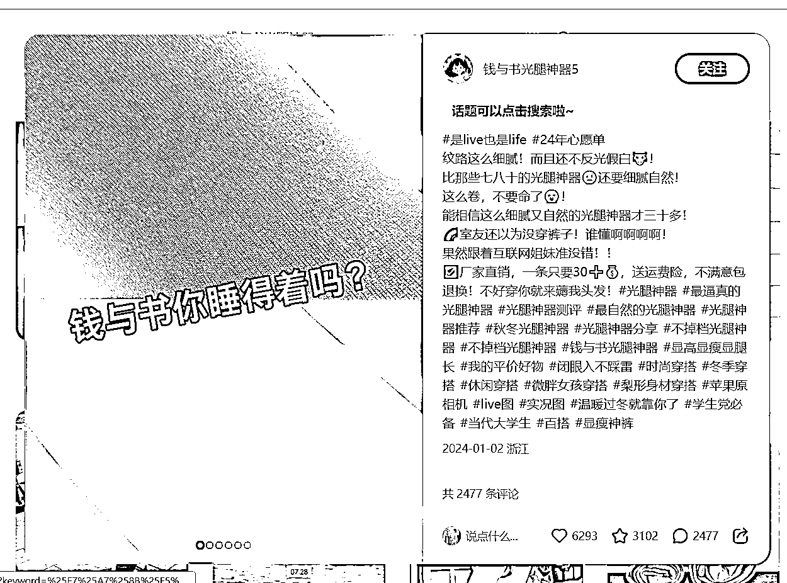

*   素人博主合作推广，堆量打造爆款（并且首页上也找模特，以货品置换的方式合作）

*   多个小号持续发笔记，堆量

3）定价与优惠

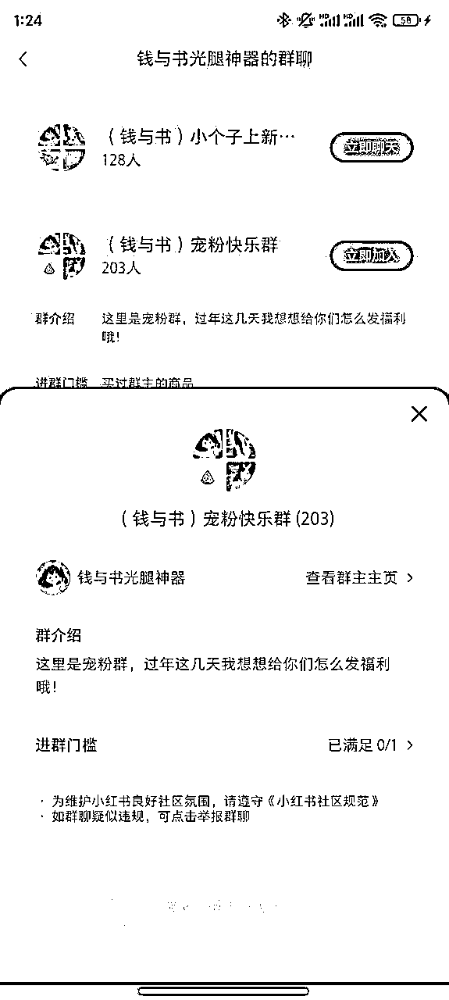

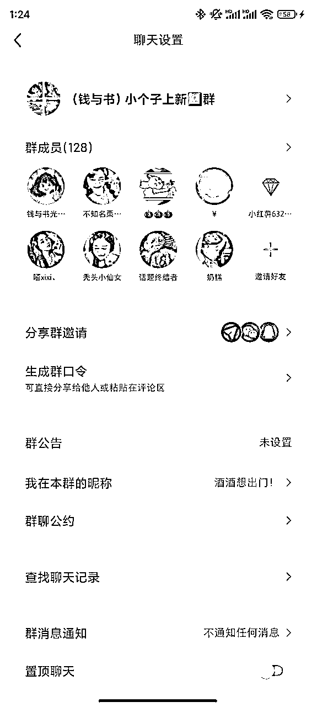

*   定价及其低，在同类型赛道里面，属于低价位，对女学生价格友好，而且穿坏了的话这个价格也不心疼

*   在极其低价的同时，还设置了粉丝专属券

*   免费试穿，包运费险

*   社群运营，设置了专属门槛的粉丝群以及没有门槛的粉丝群，通过群内运营的方式维护

4）产品来源

*   厂家发货，工厂合作

*   低价的同时要保证质量，很考验供应链

# 三、利润怎么核算

光腿神器在1688上搜到最低价格12元左右，去掉活动福利，成交一单按30元客单算，利润有18元/单。

按照目前73w销量，利润在1314万，账号笔记最早时间是23年11月，按4个月时间算，每月利润有328.5万。

如果是真自有工厂，利润还有空间。

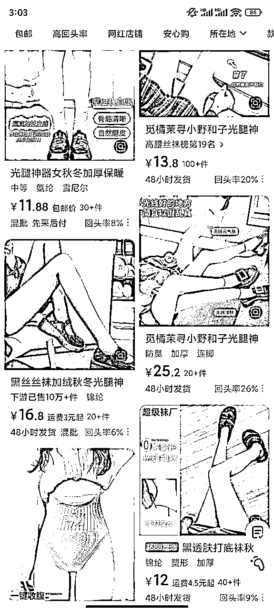

# 四、项目放大

小红书店铺目前已经成功打造出爆款，同一家店铺其他平台搜索👇

淘宝👇

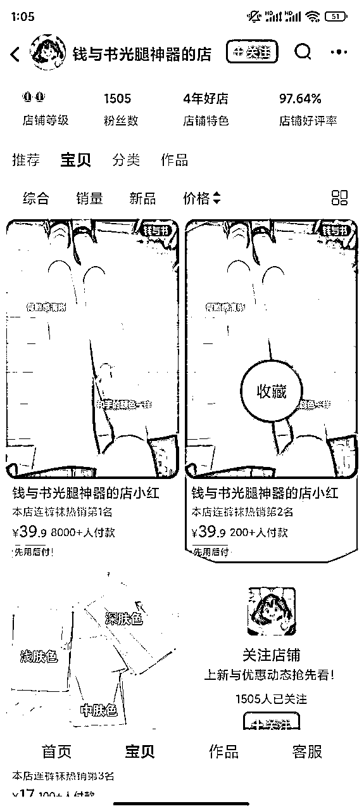

抖音👇

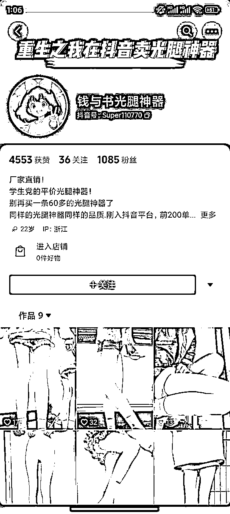

快手没有店铺，放大同个形式可以在快手以及闲鱼，价格定位相似，且同个形式量起来操作难度不高。