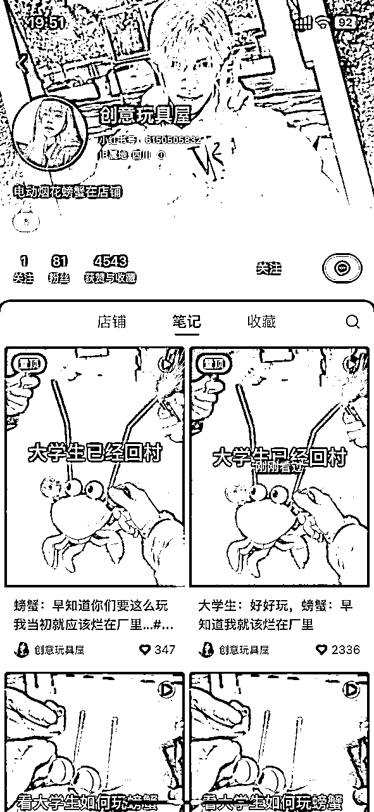
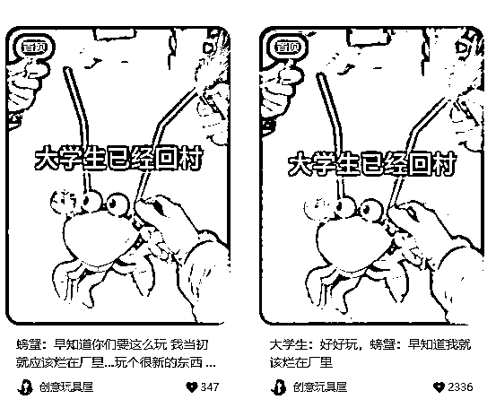
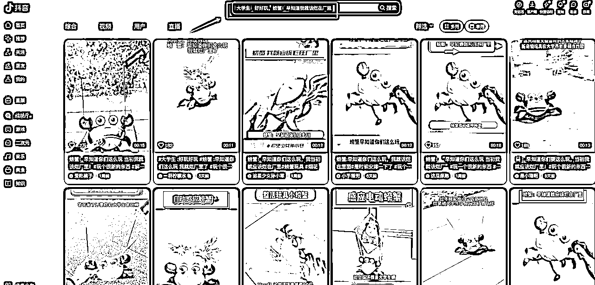
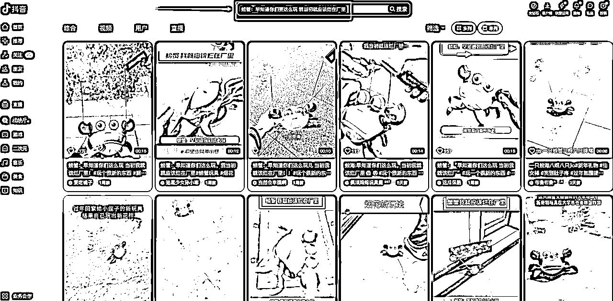
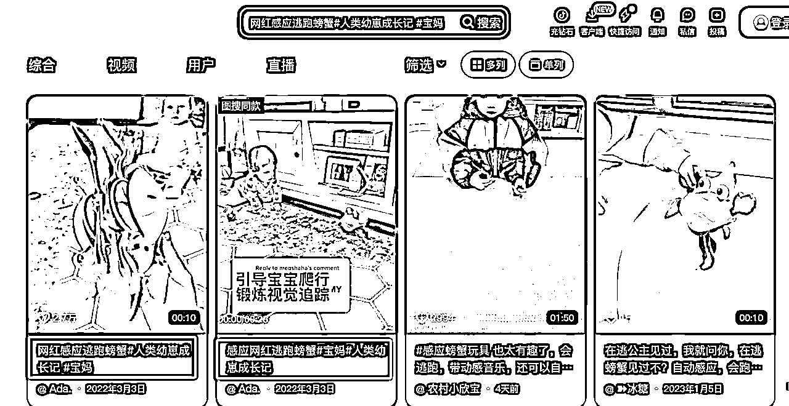
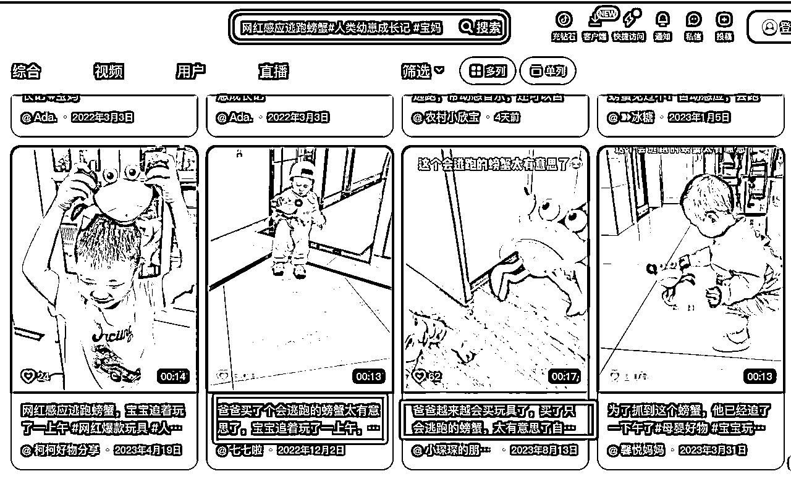

# 风向标拆解第3期--售卖50W+件数的小红书爆款店铺到底是怎么赚钱的--仙道不懒惰

> 来源：[https://v8h7wrse38.feishu.cn/docx/ArSOdEA3tobjfSxAynxcZ885not](https://v8h7wrse38.feishu.cn/docx/ArSOdEA3tobjfSxAynxcZ885not)

# 一、项目背景

之前有参加过小红书店铺运营的航海，关注的是玩具赛道的，所以经常会刷一些玩具类的内容，发现有个玩具最近很火，小红书的数据很好，账号的第一个视频是在1月23号发的，后面都日更一个到两个视频，整个店铺只有一个产品。

# 二、账号分析

账号拆解

账号头像：年轻女生

账号背景：帅气男生

账号昵称：创意玩具屋

账号简介：电动烟花螃蟹在店铺

账号粉丝：81

产品分析

产品卖点：有趣好玩，可以夹着烟花走动，新奇特又跟过年有联系

人群分析

面对大学生群体，大学生现在放假，时间多

内容拆解

爆款文案：1.大学生：好好玩，螃蟹：早知道我就该烂在厂里

2.螃蟹：早知道你们要这么玩 我当初就应该烂在厂里…

标签：#玩个很新的东西 #解压玩具 #玩具 #玩具推荐 #大人也要玩玩具

视频文案：1\. 大学生已经回村

2\. 看大学生如何玩螃蟹

视频内容

爆款视频封面：

前三秒：点燃烟花，放夹着燃烧烟花的螃蟹在地上走动

中间/结尾：夹着烟花的螃蟹来回走动场景

素材收集

抖音：直接用小红书上的爆款文案寻找风格类似的视频

其他平台一样的方式也能找到很多视频素材（快手、小红书、视频号）

素材剪辑

爆款素材内容场景拆分

找到场景相似的素材片段，对爆款素材的场景进行替换

当然自己拍摄也是可以的，整个视频的内容时长15秒钟左右，主要展示螃蟹的来回走动的场景，拍摄难度很低。

# 三、利润分析

产品售价分析

| 产品款式 | 拉线款 | 电池款 | 充电款 |
| 小红书售价 | 29.8 | 39.8 | 49.8 |
| 拼多多 | 14.79 | 24.5 | 27.6 |
| 毛利 | 15.01 | 15.3 | 22.2 |

# 四、项目延伸

其他用户人群

宝妈：买给小孩子可以玩

奶爸：买给小孩子可以玩

付费投流

新号付费投流首次有优惠

矩阵放大

可以多个账号同时操作放大爆款的可能性还可以同步传到其他视频平台，如抖音，快手和视频号。