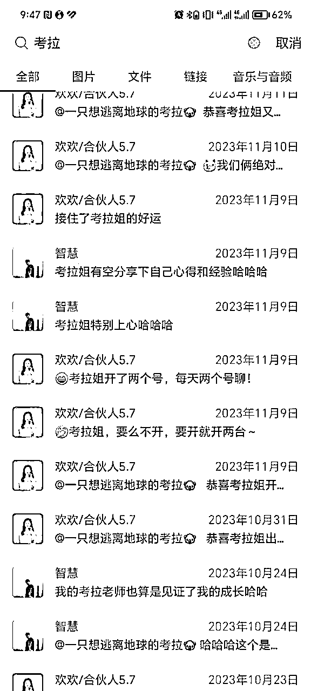

# 第一次做知识付费产品，月入过万的五条心得

> 来源：[https://mjizjbkmh8.feishu.cn/docx/AzvJdEYM2oADOPxSIhOc3AHenFe](https://mjizjbkmh8.feishu.cn/docx/AzvJdEYM2oADOPxSIhOc3AHenFe)

生财的圈友们大家好呀，见字如面，我是智慧，03年在读飞行员，副业闲鱼iPad电商运营以及iPad电商私教陪跑！10月和11月因为自己被生财第一次邀约发了我在生财的第一篇精华贴（详情可看）：https://wx.zsxq.com/mweb/views/topicdetail/topicdetail.html?topic_id=811258458841212，然后就顺水推舟开启了智慧的知识付费年度社群和第一期私教服务产品，年度社群90位学员，第一期私教总共收了20位，并且通过知识付费营收月入过万

对于我来说真的是非常惊喜的，因为我一直觉得自己的iPad电商项目在生财里面太low了，一个月也就四千左右的收入，三台店铺的话可以做到月入过万，仅此而已

但没想到依然有那么多圈友主动链接我并且为我付费学习，他们也因为我的私教服务改变了自己实现了自己的第一个正反馈，所以我才明白过来，原来之前白哥说的100分可以教80分，80分可以教50分，50分可以教30分说的是这个意思：任何赛道都会有对应的人群，我们只需要做到可以解决用户的问题，为用户提供价值，就可以做知识付费！

虽然我这个项目不能赚到大钱，但是对于一些刚接触自媒体的新人来说，这个项目也确确实实是真的非常容易上手的，他们也特别需要正反馈来激励自己，所以我这个项目可以解决的就是帮助自媒体小白比较轻松赚到自己的互联网第一桶金！

以下是我自己的第一期闲鱼iPad电商私教的营收和私教们取得的正反馈证明截图：

好啦，废话不多说啦，下面开始分享自己第一次做知识付费的心得总结，希望对圈友们能够有帮助！

一、听有结果的人的话

我是在23年2月份加入的生财，当时刚加入生财时真的是觉得什么都好新鲜，什么都想尝试，我的生财贵人老师们芷蓝姐、靠谱姐还有白哥给我一开始的定位其实就是深耕闲鱼iPad电商，因为我自己是在这个项目上深耕了一年边学习边搞钱拿到了五六万结果的，但我自己总觉得这项目太low了，不起眼，没有什么很大价值，不会有人想做这个的

所有就没听这些老师一开始给我的定位，自己到处折腾，各个项目都折腾，但无法定心，折腾到最后发现自己依然还是适合闲鱼iPad电商

到9月份的时候因为生财的邀约，阴差阳错得开启了自己的闲鱼iPad电商私教陪跑并且取得了不错的成绩，后面我才发现：原来每个赛道都有对应的人群，没有高低贵贱之分，我们只需要能提供价值，可以解决用户的问题，就能做知识付费！所以呀一定要听有结果的老师给你的建议，不要自己觉得觉得，7个月的试错时间也还是很珍贵的！

二、行动行动再行动

行动真的很重要，为什么？因为如果不行动，咱们有再多的想法也都还是0。其实我早就有想法做iPad电商私教这个知识付费了，但一直不知道怎么行动，因为自己从来没做过知识付费，从来没有收费带过学员，万一带不好怎么办，万一搞砸了怎么办?收不到学员怎么办？

我在一个未知的领域当中下场之前真的会给自己想很多问题，因为我思维才干排名很靠前，就是会冒出各种各样的想法来阻碍我自己，我相信也会有圈友跟我有一样的想法

但是我发现只要自己行动了，原来给自己预设的各种各样的问题都在行动过程中迎刃而解了，比如我下半年是我飞行理论期间最后一个学期，我学业还比较繁忙，怎么才能既做好交付又把学习弄好？

我在行动的过程中遇到了欢欢，我跟她是在5月份当生财志愿者认识的，可能因为我们两都是大关系建立吧，所以彼此都互相认可喜欢，她后面成为了我的私教，又刚好有5年社群运营经验，于是我就跟她谈合作，我说我们一起合伙交付私教，钱的方面我们三七分，我们就双向奔赴一拍即合开搞，这样我的交付压力真的非常小了。

所以23年下半学期，我的学业既没耽误，副业私教交付也仍然取得了不错的成绩！还有很多案例就不分享了，就是一句话：先行动，在行动中解决问题，千万不要提前被问题吓得不敢行动了，这样结果只会为0！

三、广结善缘、真诚利他

第一期我的20位闲鱼私教学员有来自生财看了我的精华帖来为我付费的，有我以前大一暑假的时候打暑假工认识的老师，有我参加一些训练营认识的同学，有私教转介绍的，有通过社群分享来链接为我付费的

就是第一期的私教学员来源分布真的是让我非常感慨，他们觉得我的分享非常真诚利他所以为我付费，他们对我这个人线下接触过认为我人不错为我付费，他们觉得我的私教服务认真负责为我转介绍

所以呀，咱们做知识付费真的一定要广结善缘，真诚利他，只有这样，我们才能一直做下去并且得到更多人的喜欢和正反馈，说不准哪天被贵人大佬喜欢了就起飞了哈哈

四、好的圈子很重要

好的圈子真的是能够滋养人的，如果不是因为来到了生财，在生财耳濡目染，我根本想不到还能够做社群，做私教服务！

没进入生财之前想赚钱就是只能靠自己运营闲鱼，在学校只能空闲时间做做，一个月三四千块钱，寒假的时候三台店铺做可以过万，但确实很累！回消息都是从早回到晚，而且熟悉了之后真的非常像个机械人，但是为了赚钱还是能接受的哈哈

但幸运的是通过芷蓝姐、靠谱姐还有白哥他们来到了生财之后，我也找到了自己的定位开启了自己的第二条知识付费管道收入：带领自媒体新人通过闲鱼iPad电商赚到自己的第一桶金

当我身边的同学在吃喝玩乐的时候，在摆烂的时候，我看到生财这么多优秀的大佬以及优秀的同龄人真的很难再跟身边同学一样了，心里一直想的是自己怎么样才能慢慢靠近他们，然后自己在行动过程中真的也越来越优秀了且拿到了小结果

所以呀，好的圈子真的可以给自己带来很大改变和成长，只要不断选择优秀的圈子我们也一定会慢慢变优秀的，一切都只是时间问题罢了！

五、坚持大于一切

这是我今年最深刻的心得，因为去年2月进入生财到现在快过去整整一年了，一开始我的收入并没有因为自己加入生财而马上翻倍，再加上我是一个很需要正反馈的人

所以刚开始的低迷期真的非常难受，但是只要自己慢慢坚持，就像靠谱姐说的那样每天五条朋友圈真诚链接五个好友回访五个老朋友，就会慢慢越来越好

很多人其实都做不到这上面这个五五五，所以自己就把自己打败了，而只要坚持，你看我一个知识付费界的新人，通过一年时间，也赚回来了生财门票的十倍多了，还认识了很多志同道合的朋友，打开了自己的见识，提升了我的认知，这些都是金钱之外给自己带来的额外价值！

所以，既然选择了就一定要深耕，一定要坚持，只要在对的圈子做对的事情慢慢坚持，肯定慢慢都会有结果的，我们静等花开哈哈

六、总结

以上五条就是智慧自己第一次做知识付费的所有心得了，因为自己做事踏实认真负责在行动过程中遇到了好朋友也是好搭档欢欢，她也一直在支持鼓励我；也因为自己前期的积累，所以私教发售有了第一次较为满意的成绩；也因为自己真正希望能给自己的学员带来帮助，我们的服务也确确实实给私教带来了成长改变和金钱增长；

总之希望通过这次复盘自己的实际经历总结出来的五条心得能够给大家带来继续前行的力量，我们都要成为更好的人啊！

最后还要特别感谢我的贵人老师靠谱姐、理白哥还有芷蓝姐，是他们带我进入生财这么一个高质量的社群圈子，让我得到了很大的成长！