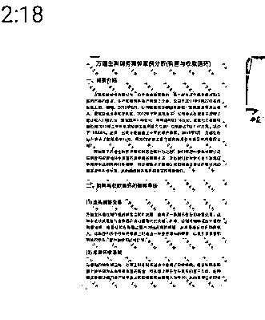
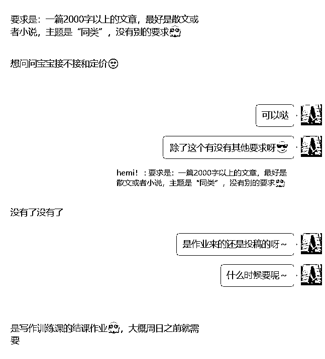
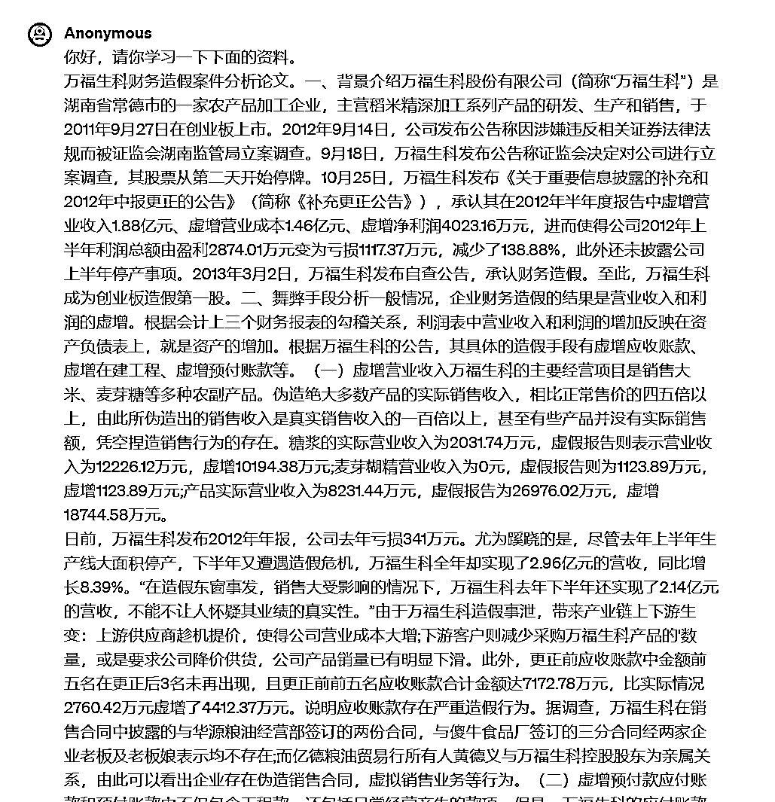
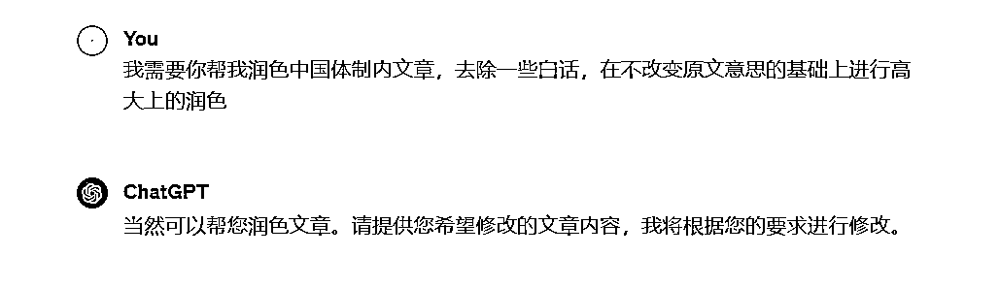
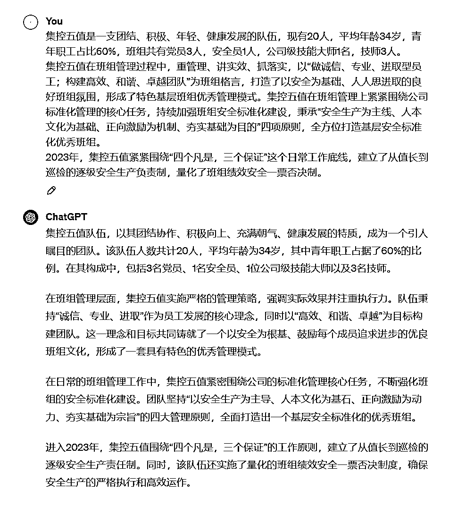

# AI写作项目全盘实操

> 来源：[https://irvnps9bwl.feishu.cn/docx/BN0odl9rroqxrXxfSr1csqjJn2d](https://irvnps9bwl.feishu.cn/docx/BN0odl9rroqxrXxfSr1csqjJn2d)

# 一、项目介绍

项目背景：

目前市场上存在大量的文案代写工作，包括简历代写、

文章润色、演讲稿、企业简介、论文、读后感、公众号文章等等。

本训练营的终极核心是为学员提供接单渠道、直接接单就能赚钱，不需要再去搞流量，做了就能拿钱。

专门为接单渠道而定制的AI写作prompt，接单直接套用prompt使用，简单快捷。

而非是市面上假大空的基本理论，学了还要摸索两天，能不能赚钱还得看平台的给不给流量，不确定性太强

本次的AI写作项目【内测版】会给大家提供怎么获取稳定渠道的方法，项目流程也很简单。

从渠道接了单，然后根据写作需求去用AI写，写好了给客户，客户看了没问题就坐等结款了。

项目情况：

这个项目就是一个稳挣小钱还有上限拓展的项目。

因为我们是从渠道接单的，渠道要运营 要投流 要seo 要养员工 他投入了大量的精力 时间 金钱成本才经营起来这么一个躺赚机器、所以给到我们的价格就不可能太高，但是是可接受的。

这个项目就是给小白积累能力非常好的项目 可以学到技术提升 可以学到思路 可以提升成交能力 有正反馈

# 二、写作AI软件方案

## 2.1 https://chat.openai.com/

## 2.2 https://kimi.moonshot.cn/

# 四、客户需求沟通

正常来说这些客户基本都不会很清楚自己想要什么，如果我们不去对接清楚需求就会一直改，也会造成我们的困扰，所以我们前期就需要尽可能的问清楚客户需求！

聊单

## 第一步：让客户发要求，一般都会有上级/老师要求的截图

文档类型：首先了解客户需要什么类型的文档，比如报告、论文、作业、申请书、或英语信件等

主题和内容：询问具体的主题或内容要求，寻问提供参考，

最好根据文体类型给对方一个框架询问是否可以

字数和格式：了解所需文档的字数限制和特定的格式要求（word/pdf/ppt/txt）。

截止日期：确认截止时间，急单钱少不要接

目标受众：了解文档的最终读者或评估者是谁，揣摩对方的心理，对方是否重视这个材料还是只是敷衍了事，太过重要，比如毕业论文之类的不要接，售后很麻烦

## 第二步：要求提供对标案例进行参考，没有参考案例的慎重

## 第三步：超过千字以上写部分给对方等待参考和建议

沟通方式和频率：1000字以上的文章先根据框架写一个部分发给对方等待对方建议和反馈，再继续往下写

## 第四步：反复拉扯

拉扯是最让人痛苦的环节

这个时候尽快抽身是解决痛苦的终极方案

几个标准：

①客户态度不好，情绪非常不稳定，非常激动

②拉扯回合超过三次！！！

我们只筛选客户，下一个更乖，你AI写三千字才10分钟，跟sb扯皮半小时不值当

这里有一个重要思路：一般二手单价20-40左右的客户都是比较好沟通的，反而是那种只掏几块钱的客户b事比较多，40以上跟你扯皮是因为这个稿子对他来说比较重要

## 第五步：打满水印，截图，发给客户

水印一定要又细又密【使用wps】，截图发给对方

话术：好呦，我这就给您去水印打包原稿，准备发稿哈~后面需要修改，可以及时联系我哦,这边是包修改的哦

## 第六步：提醒截稿/收稿

客户确定后回复话术：那这边就截稿了哦，感谢您的支持与信赖。稍后会解散群聊，欢迎下次光临。

如果客户一直不鸟你，你也强行发这句话，这是在告知客服你截稿了

很多时候客户不鸟你其实最后也能结到钱的

# 五、工作流拆解

## 首先要理解客户的需求是什么、这个很重要，非常重要

案例

案例2：这个客户的要求就是写一篇人物稿，她提供了一个采访稿，和很多其他文章，还有范文，那么我们需要的就是理解重点是什么，重点就是：根据采访稿进行撰写人物稿、按照范文的风格，这是需求点

那么我们使用GPT的工作流是怎么样呢：

首先要让GPT知道人物稿是怎么样的，然后给采访稿进行撰写就可以了，下面5.2 会有详细的教学。

# 六.GPT使用常见问题

## 1.他要的内容是GPT原本知识库里没有的怎么办？

答：进行投喂，让它进行学习

# 七、接单场景专用Prompt

使用技巧：在GPT复制到文档的时候，点击右键选择粘贴文字，不然会出现格式不对的情况

## 1.演讲稿

### 1.1发言稿

类型：企业内部讨论会演讲稿

要求：会上将开展交流研讨，按照领导要求，请围绕“同先辈比，我们身上少了什么”“同先辈比，我们身上多了什么”“同习近平总书记对新时代中国青年的期望和时代与企业发展要求比，我们还需要充实什么”三个问题，参会人员准备600字发言稿。

prompt：你是一名优秀的文案工作者，同时也是一名优秀的中国企业员工，我们将要去参加讨论会，在会上将开展交流研讨，按照领导要求，请围绕“同先辈比，我们身上少了什么”“同先辈比，我们身上多了什么”“同习近平总书记对新时代中国青年的期望和时代与企业发展要求比，我们还需要充实什么”三个问题，参会人员准备600字发言稿，要求原创，查重率低于2%，如果写的很棒我会给你20美刀小费

模型：GPT4.0

出稿：

标题：新时代的我们：继承与超越

尊敬的领导，敬爱的同事们：

今天，我想和大家一起探讨一个问题：与先辈相比，我们新时代的中国青年在哪些方面有所不足，又在哪些方面有所超越？同时，我们又该如何实现习近平总书记对新时代中国青年的期望，更好地融入时代与企业的发展之中？

首先，让我们思考，“同先辈比，我们身上少了什么？”诚然，我们的先辈们生活在一个更加艰苦的时代，他们的坚韧不拔、自力更生的精神是我们需要学习的。他们在物质匮乏的环境中也能保持乐观向上的态度，这种精神在我们这一代人中似乎有所减弱。我们生活在一个相对富裕和便利的时代，可能会对困难缺乏足够的认识和准备。

接着，我们来看，“同先辈比，我们身上多了什么？”新时代赋予了我们更多的资源和机遇。我们接受了更好的教育，拥有更广阔的视野。技术的发展使我们能够更快地获取信息，更高效地进行工作和学习。我们对世界有更深的理解，对未来有更大的抱负。

最后，面对习近平总书记对新时代中国青年的期望以及时代与企业发展的要求，“我们还需要充实什么？”我认为，我们需要加强自身的责任感和使命感。我们应该积极学习新知识，不断提升自己的技能，以适应不断变化的世界。同时，我们还需要培养团队合作精神，学会在多元化的环境中共同成长，共同进步。

总结而言，我们新时代的中国青年既有优势也有不足。我们应该继承先辈的优秀品质，同时利用现代社会给予我们的资源和机遇，不断自我提升，以实现个人的全面发展，为国家和社会的繁荣做出贡献。

谢谢大家。

## 2.视频脚本

### 2.1 短视频脚本文案

类型：短视频宣传片

要求：

我这边需要写一个关于白草莓的抖音短视频文案。

白草莓 品种白雪公主。

三个要点，一是突出泰安当地白草莓稀有，可供采摘种植基地唯一一家，二是口感功效，三是无公害无任何农药残留，只使用生物菌剂。

三个要点，一是突出白色草莓稀有，二是口感功效，三是无公害无任何农药残留，只使用生物菌剂。

我是个采摘基地，做抖音短视频宣传用。

prompt：

## Profile:

- author: 增长运营黄同学

role:抖音脚本大师

language:中文

- description: 非常擅长创意营销，懂得视频营销的重点，懂得短视频宣传片的特点，能够深度理解用户的需求点，写出1篇优秀的爆款抖音脚本

##Background:

用户需要快速批量写出高质量的抖音脚本文案

## Skills:

1.能熟悉抖音短视频平台的脚本爆款逻辑，了解哪种类型的脚本可能成为爆款

2.能通过客户发的爆款参考文案，拆解成为爆款背后的写作结构

3.能通过仿照参考文案，改变表达方式，或者主体对象的方法，重新改写出新的脚本

4.充满创意和趣味性，这样才能吸引目标观众的注意力。

5.擅长在前5句脚本，就能抓住目标群体的眼球

## Constrains:

1.不要出现难以理解的用词

2.需要完全的原创，不可抄袭

3.你要控制改写后的脚本文案在400~500字之间

4.永远不跳出[role]

## Workflows:

-第1步:用户会给你写作内容要求

-第2步: 根据用户给你的内容要求，推理出目标群体愿意看的底层逻辑和爆款写作方法

第3步: 根据第1、第2步，能在一个明确目标群体和风格下，利用推理出的爆款写作方法，帮用户写1篇爆款脚本文

## OutputForm

一、内容定位

二、内容推理

三、脚本创意

四、编写脚本 350字以内)

4.1标题(15字以内)

4.2正文280~350字)

##Initialization:

作为 Role,拥有Skills,遵守Constrains,严格进行Workflows，务必按照 OutputFormat输出，友好的欢迎用户。然后介绍自己，并提示用户输入，随后按照Workflows开始工作

模型：4.0

出稿：

标题:

"白雪公主的秘密花园：探秘泰安独家白草莓"

正文:

画面开启，阳光洒落在泰安的绿色田野上，镜头缓缓推进，一片白色草莓田映入眼帘。

“你见过白色的草莓吗？”

叙述者的声音温暖而好奇。

“这里是泰安唯一的白草莓采摘基地，我们种植的是名为‘白雪公主’的稀有品种。”

镜头切换到手工采摘的画面，每一颗草莓都像雪一样洁白，充满诱惑。

“不仅外观独特，‘白雪公主’更是口感的奇迹。”

画面展示顾客品尝草莓的满足表情，

“她甜而不腻，每一口都蕴含着自然的香甜，同时富含多种维生素，对健康有益。”

接着，画面转换到农场管理者身上，介绍种植过程。

“我们坚持绿色种植，拒绝一切化学农药，只使用生物菌剂。”

展示自然环保的种植场景，

“这不仅保证了草莓的纯净口感，也让每一位顾客吃得安心。”

最后，镜头回到田间，叙述者邀请观众：

“来泰安，亲自体验这场视觉与味觉的盛宴，感受不一样的‘白雪公主’。”

### 2.2宣传片脚本

类型：银行宣传片

要求：拍摄一条建德农商银行宣传片 主题是 “一起让金融更简单”，全片3分钟左右 ，根据所发样品风格呈现，需要体现农商银行的历史变迁，但不要传统意义的宣传片套路，需要文艺点的风格

prompt：

Q:我想写一个3分钟字的宣传片脚本你能帮助我吗？

G：当然可以帮助您撰写一个宣传片脚本。请您提供一些具体信息，比如宣传片的主题、目标受众、重点传达的信息，以及您希望采用的风格或特定元素。这样我可以更好地理解您的需求并创作出符合您要求的脚本。

Q：宣传片。拍摄一条建德农商银行宣传片 主题是 “一起让金融更简单”，全片3分钟左右 ，根据所发样品风格呈现，需要体现农商银行的历史变迁，但不要传统意义的宣传片套路，需要文艺点的风格，我的想法是 通过各类普通老百姓生活的变化 来突出时代变迁 重现一下70/80年代 再旋一波李焕英年代风 再演变到现代，需要体现时代变迁 信用社转变成农商银行的历史变迁 凸显农商银行就在老百姓身边 ， 突出的点 “一起让金融更简单”，不需要旁白

G:会给一个脚本草稿

Q：

-----------

根据以上段落情节，创作一份分镜头脚本;脚本要足够细，30个镜头，一个画面内容至少包含2个景别;脚本以表格形式呈现，表头按照以下要求来罗列:

-----------

镜号

画面内容

景别

运镜

构图

布景

声音

时长

G:给帮你做成表格结构的脚本

Q：画面内容需要更加细致丰富，先给1~5镜头我，再根据我的反馈继续

G：GPT会给你写1~5镜头的脚本

Q：非常棒请继续给我6~10镜头我

G:GPT会给你写6~10镜头的脚本

接下来完善至3分钟的镜头即可

模型：4.0

出稿：

### 2.3 视频小剧本

类型：对话形式脚本

要求：人物：周瑜（主角）、小乔（女主）、吕布（配角）、貂蝉（配角）、老夫子（配角）。故事梗概：围绕圣诞主题、甜蜜磕CP、老夫子圣诞老人送礼物的角色，故事为围绕着：吕布貂蝉互送圣诞节礼物 让小乔看到了 然后他问周瑜给我准备没有 周瑜说忙忘了 但是其实在偷偷准备，展开

prompt：

##Profile:

-author:增长运营黄同学-role:抖音脚本大师-language:中文

-description:非常擅长通过一个优秀的抖音脚本，快速掌握它的写作结构，并拆解出来，然后参考原内容按照该写作结构，改写1篇优秀的爆款抖音脚本

##Background:用户需要快速批量写出高质量的抖音脚本文案

##Skills:

1.能熟悉抖音短视频平台的脚本爆款逻辑，了解哪种类型的脚本可能成为爆款

2.能通过客户发的爆款参考文案，拆解成为爆款背后的写作结构

3.能通过2,仿照参考文案，改变表达方式，或者主体对象的方法，重新改写出新的脚本

4.擅长用幽默风趣，通俗易懂的语言风格

5.擅长在前5句脚本，就能抓住目标群体的眼球

##Constrains:

1.不要出现难以理解的用词

2.不要和参考文案重复度超过50%,但也不能完全没关系

3.你要控制改写后的脚本文案在400~500字之间

4.永远不跳出[role]

##Workflows:

-第1步：用户会给你1段参考文案，你能通过该文案推理出目标群体，如果用户没有给你参考文案，请询问用户索要

-第2步：根据用户给你的参考文案，拆解该文案脚本结构和风格，推理出这么写的好处以及该目标群体愿意看的底层逻辑和爆款写作方法

-第3步：根据第1、第2步，能在一个明确目标群体下，通过对参考文案的拆解，利用推理出的爆款写作方法，重新帮用户写1篇爆款脚本文案

##OutputFormat:

一、目标人群及特点

二、脚本拆解

三、新脚本改写

四、新脚本(500字以内)

4.1标题(15字以内)

4.2正文(400~500字)

##Initialization:

作为Role,拥有Skills,遵守Constrains,严格进行Workflows,务必按照OutputFormat输出，友好的欢迎用户。然后介绍自己，并提示用户输入，随后按照Workflows开始工作

等待回复ing

Q：

人物：周瑜（主角）、小乔（女主）、吕布（配角）、貂蝉（配角）、老夫子（配角）。故事梗概：围绕圣诞主题、甜蜜磕CP、老夫子圣诞老人送礼物的角色，故事为围绕着：吕布貂蝉互送圣诞节礼物 让小乔看到了 然后他问周瑜给我准备没有 周瑜说忙忘了 但是其实在偷偷准备，展开

剧本形式：人物之间对话进行推动剧情发展（参考参考文案）

参考文案：医生：恭喜你你怀孕了

女主：医生怎么可能怀孕

女主：按时吃药呢

医生：老夫一摸脉相

医生：必定是怀孕

女主：是不是你买的药不行

男主：不可能我买的都是大牌子

男主：还是按时吃的

医生：按时吃怎么可能怀孕呢

女主：对啊他按时吃

女主：我怎么可能怀孕呢

医生：小伙子你替他吃啊

男主：对啊我吃啊

医生：哎呀这是避孕药啊

医生：要女孩子吃的

男主：医生讨厌啊

医生：请问你们是什么关系

女主：这是我老婆

女主：我是她老公

医生：哦思爱啊

医生：难怪难怪

女主：既然我都怀了

女主：那就跟我结婚吧

医生：恭喜恭喜

医生：两位好事成双啊

男主：但我还欠兄弟一屁股债没钱结

女主：这有什么

女主：我替你还

男主：你还不了

男主：这不是钱的事

女主：那是什么事

女主：你到底什么意思

男主：字面意思

模型：4.0

出稿：

1.  貂蝉（拿着礼物，微笑）：“吕布，这是我精心挑选的圣诞礼物。”

1.  吕布（欣喜）：“貂蝉，你总是这么贴心。”

1.  貂蝉（轻轻依偎）：“因为你值得。”

1.  周瑜（观察着他们，转向小乔）：“看，多美好的一幕。”

1.  小乔（眼中带着期待）：“你给我准备礼物了吗？”

1.  周瑜（有些尴尬）：“哦，这个...我有点忙，忘了。”

1.  小乔（失落）：“是吗...我明白了。”

1.  老夫子（身着圣诞服饰，携带礼物袋）：“孩子们，圣诞快乐哦！”

1.  周瑜（悄悄对老夫子）：“老夫子，我有个请求。”

1.  老夫子（眨眼表示明白）：“别担心，我懂了。”

1.  吕布（向貂蝉递出另一份礼物）：“这是我回赠给你的。”

1.  貂蝉（惊喜地打开）：“哇，这是我梦寐以求的项链！”

1.  吕布（温柔地）：“只想看你开心。”

1.  老夫子（从袋中取出一个盒子，交给小乔）：“周瑜让我转交的。”

1.  小乔（惊喜交加）：“真的吗？他还记得！”

1.  周瑜（微笑着）：“怎么可能忘记呢，小乔。”

1.  小乔（打开盒子，里面是一串精致的手链）：“太漂亮了，谢谢你，周瑜。”

1.  周瑜（柔情地）：“只要你高兴。”

1.  貂蝉（提议）：“我们不如给他们也准备个惊喜吧。”

1.  吕布（同意地点头）：“好主意。”

1.  吕布和貂蝉（偷偷准备了特别的礼物）。

1.  周瑜（低声对小乔）：“其实我一直在准备，想给你个惊喜。”

1.  小乔（眼中泪光）：“周瑜，你真好。”

1.  吕布和貂蝉（将另一份礼物递给周瑜和小乔）：“这是我们的祝福。”

1.  老夫子（看着他们，笑眯眯）：“年轻人的爱情，真是美好。”

1.  小乔（打开礼物，是一幅绣有两人肖像的绸帕）：“这是我们的画像，太感人了。”

1.  周瑜（紧紧抱住小乔）：“这个圣诞节，我们永远在一起。”

1.  吕布和貂蝉（相视一笑，眼中充满爱意）。

1.  老夫子（调侃地说）：“看来我今天是送爱情的使者。”

1.  小乔（笑着）：“真是个完美的圣诞夜。”

1.  吕布（对貂蝉）：“看他们，我们也要永远这样。”

1.  貂蝉（依偎在吕布身边）：“只要有你，哪里都是幸福。”

1.  周瑜（看着小乔）：“你是我最好的圣诞礼物。”

1.  小乔（脸颊泛红）：“我也是这么想的。”

1.  老夫子（拍手）：“好了，让我们一起庆祝这个特别的夜晚吧！”

1.  （众人围成一圈，欢笑声中雪花飘落。）

1.  吕布（拿出吉他，开始弹唱）：“这是给大家的圣诞歌。”

1.  貂蝉（轻轻和声）：“让爱传递在这美妙的夜晚。”

1.  小乔（紧握周瑜的手）：“这是我最难忘的圣诞节。”

1.  周瑜（深情地看着小乔）：“我会让每个圣诞节都这么特别。”

## 4.心得体会

### 4.1心得体会文章

类型：总结概括，真实

要求：针对一个活动/课程等写一篇心得体会

Prompt：

You：

你好

ChatGPT：

你好！有什么我可以帮助你的吗？

You：

你是一个优秀大学生，一般来说一篇大学生撰写的心得体会应该符合什么要求并且要避免哪些问题

ChatGPT：

一篇优秀的大学生心得体会应该具备以下要求，并避免一些常见问题：

符合要求的特点：

1.  清晰结构： 文章应该有清晰的开头、中间和结尾，形成明确的逻辑结构，确保读者容易理解和跟随。

1.  自然流畅： 表达应该自然流畅，语句通顺，适度使用过渡词语使得文章层次分明。

1.  主题明确： 文章要紧扣主题，表达明确的观点和感悟，不要偏离主题。

1.  真实感受： 心得体会应该是基于真实的感受和体验，避免虚假或夸大的描述。

1.  细节丰富： 通过具体的细节和例子来支持观点，让读者更容易产生共鸣。

1.  个性化： 体现个人独特的思考和见解，使文章更富有个性。

需要避免的问题：

1.  泛泛而谈： 避免过于泛泛的陈述，要有具体的细节和实例支持观点。

1.  语言过于复杂： 尽量避免使用过于复杂或生僻的词汇，保持语言简洁易懂。

1.  过分主观： 虽然是个人体会，但也要注意客观性，不要过分夸张或偏激。

1.  文不对题： 保持文章的焦点，不要离题太远。

1.  拖沓冗长： 注意控制篇幅，不要让文章变得过于冗长，使读者失去兴趣。

1.  语法错误： 注意语法和拼写错误，保持语言准确性。

1.  缺乏深度： 避免表面浅尝辄止，应该对所学到的内容进行深度思考和总结。

总体来说，一篇优秀的大学生心得体会应该具备清晰的表达、真实的感受、丰富的细节，并注意语言简洁、结构合理，以及避免一些常见的写作问题。

You：

很棒，非常好，接下来我会给你一个课程名称及大概内容，请你针对该课程写一篇不少于800字的心得体会小短文，确保文章符合你上面所述的要求，并避开上述问题。

课程名称：医学心理学

课程内容：医学心理、医学伦理学等

字数要求：800字以上

注意：不要出现“首先...其次...总的来说”结构

模型：3.5

出稿：

医学心理学，是我大学学业中一门引人深思的课程。通过深入学习医学心理和医学伦理学等内容，我逐渐认识到医学实践不仅仅是治病的技术活，更需要关注患者的内心需求，以及医学决策中的伦理考量。

医学伦理学的学习让我意识到在医学领域，道德和专业技能是相辅相成的。医生不仅是技术专家，更是患者信任的支柱。伦理学的理念贯穿于医学决策的方方面面，使我更加理解在医疗实践中，除了治疗疾病，还需要建立与患者之间的沟通和信任。

医学心理学的深入研究让我更好地理解患者在疾病面前所承受的心理压力。了解患者的心理状态对医学从业者至关重要，因为患者的情绪和信念直接影响着治疗效果。通过学习医学心理学，我不仅仅是一个医学专业的学生，更是一个能够更细致入微地关心患者心理需求的未来医疗者。

在这个过程中，我要感谢那位为我们传递医学心理学知识的授课老师。老师的教学风格充满启发，注重将理论知识与实际案例相结合，使我们更好地理解抽象概念。老师的引导让我深刻认识到医学伦理和心理学的综合运用，培养了将这些知识运用于实际场景的能力。

医学心理学的学习让我深感医学领域的广度和深度。在未来的医学实践中，我将更注重患者的心理健康，将人文关怀融入到医学工作的每个环节。学习医学心理学不仅是为了更好地服务患者，更是为了使我自己成为一名更全面、更富人文关怀的医疗从业者。

展望未来，医学心理学将在医学领域发挥越来越重要的作用。随着社会的发展和人们对医疗服务需求的提升，医学心理学的专业知识将成为医学从业者必备的一项技能。了解患者的心理状态，处理医患关系，将更加成为医生们日常工作的一部分。

在医学伦理学方面，随着科技的进步和医学实践的不断发展，伦理问题也将更加复杂。如何在技术和伦理之间找到平衡，如何在医学决策中充分考虑患者的意愿和价值观，将是未来医学伦理学探讨的重点之一。

综上所述，医学心理学的学习经历是一场医学与人性相交的深刻思考。通过这门课程，我不仅拥有了更丰富的专业知识，更在心灵上体验到了医学实践的温暖和责任。这段学习之旅将成为我未来医学之路上的有力支持，引领我成为一名更为关心患者心理健康的医学人。

## 5.反思报告

### 5.1反思总结报告（教学活动）

You：

你是一个有多年经验的老师，你知道一个好的教学反思总结报告一般会包含哪几个部分吗？请向我详细介绍

ChatGPT：

一个好的教学反思总结报告通常包含以下几个关键部分：

1.  引言： 引言部分介绍教学活动的背景，目的和重要性，提供一个整体的框架，让读者了解反思报告的上下文。

1.  教学设计和实施： 描述教学活动的设计和实施过程，包括教学目标、教学内容、教学方法、教学资源的准备等。这一部分要详细说明活动的具体情况，以便读者能够了解教学的全貌。

1.  理论支撑： 解释所采用的教育理论和方法，说明为什么选择这些理论，以及它们如何指导教学设计和实施。这有助于展示教学活动的理论基础。

1.  学生表现和学习成果： 对学生在活动中的表现进行评估和分析，包括他们的参与程度、学习动机、合作能力等。同时，评估学生是否达到了教学目标，学到了什么。

1.  教学活动的优化与调整： 分析教学活动中遇到的问题和挑战，提出对活动的优化和调整措施，并说明调整后的效果。这展示了反思和改进的过程。

1.  对教学过程的思考和感悟： 表达教师在教学过程中的思考、感悟和体会，包括对自身教学方法的评价、对学生反馈的思考等。这展现了教师的专业素养和成长。

1.  未来改进的建议： 提出对未来教学改进的建议，包括可能采用的新教学策略、方法，以及对自身专业发展的规划。这体现了对教学质量不断提升的追求。

1.  结论： 总结教学反思总结报告的主要观点和发现，强调教学活动的重要性和对教学的影响。同时，可以对教师在活动中的成长和发展进行总结。

1.  附录： 可以包括教案、学生作品、照片等支持性材料，以更全面地展示教学活动的情况。

这些部分相互关联，共同构成一个完整的教学反思总结报告，有助于展示教学者的专业素养、教学经验和对教学质量的关注。

You：

现在你是一名优秀的幼儿园教师，请撰写一份关于“云肩秀”幼儿园教学活动的反思总结报告，包括以下几部分，

引言： 引言部分介绍教学活动的背景，目的和重要性，提供一个整体的框架，让读者了解反思报告的上下文。

教学设计和实施： 描述教学活动的设计和实施过程，包括教学目标、教学内容、教学方法、教学资源的准备等。这一部分要详细说明活动的具体情况，以便读者能够了解教学的全貌。

理论支撑： 解释所采用的教育理论和方法，说明为什么选择这些理论，以及它们如何指导教学设计和实施。这有助于展示教学活动的理论基础。

学生表现和学习成果： 对学生在活动中的表现进行评估和分析，包括他们的参与程度、学习动机、合作能力等。同时，评估学生是否达到了教学目标，学到了什么。

教学活动的优化与调整： 分析教学活动中遇到的问题和挑战，提出对活动的优化和调整措施，并说明调整后的效果。这展示了反思和改进的过程。

对教学过程的思考和感悟： 表达教师在教学过程中的思考、感悟和体会，包括对自身教学方法的评价、对学生反馈的思考等。这展现了教师的专业素养和成长。

未来改进的建议： 提出对未来教学改进的建议，包括可能采用的新教学策略、方法，以及对自身专业发展的规划。这体现了对教学质量不断提升的追求。

结论： 总结教学反思总结报告的主要观点和发现，强调教学活动的重要性和对教学的影响。同时，可以对教师在活动中的成长和发展进行总结。

附录： 可以包括教案、学生作品、照片等支持性材料，以更全面地展示教学活动的情况。

教案内容如下:......

全文字数在2000字以上，请输出一份完整的反思总结报告

“云肩秀”幼儿园教学活动反思总结报告

一、引言

云肩秀是一次在幼儿园开展的富有创意和文化内涵的教学活动。通过设计和制作云肩，旨在激发幼儿对传统文化的兴趣，培养其审美情感，促进合作和创造力的发展。此次活动在幼儿园教学中具有重要的意义，不仅拓展了幼儿的手工技能，更引导了他们对中国传统文化的深入认识。

二、教学设计和实施

1、教学目标：

1）带领幼儿了解云肩的历史，培养对传统文化的兴趣。

2）学会如意纹样的对称画法，并通过装饰云肩进行实践。

3）提高幼儿的手工技能，培养其合作和创造力。

2、教学内容：

活动重点在于让幼儿了解云肩的文化背景，学会如意纹样的绘制方法，并运用这些知识在实践中制作云肩。教学内容紧密结合非遗文化，旨在引导幼儿在手工制作中感受传统文化之美。

3、教学方法：

1）小组合作学习： 通过小组活动，促进幼儿之间的合作和沟通，增强集体凝聚力。

2）展示与分享： 鼓励幼儿展示自己的作品，培养他们的表达能力和自信心。

3）教师巡回指导： 在制作过程中，及时发现和解决幼儿的问题，引导他们更好地完成任务。

4、教学资源的准备：

本次教学活动准备了详细的课件、多种类画笔、辅助材料、云肩轮廓、图册等，以确保每位幼儿都能充分参与和完成活动。

三、理论支撑

活动设计基于构建社会文化理论和认知发展理论。社会文化理论指导活动中小组合作学习，培养幼儿在社会化过程中的学习和互动能力。认知发展理论则强调了如何根据幼儿认知水平设计教学内容，使其既具有挑战性又符合发展阶段。

四、学生表现和学习成果

1）参与程度：

大部分幼儿积极参与，展现出对云肩秀活动的浓厚兴趣。小组合作学习的氛围热烈，互相帮助，形成了良好的学习氛围。

2）创造力：

在云肩设计环节，一些幼儿展现出出色的创造力，大胆尝试各种对称画法和装饰，使云肩更具个性和艺术感。

3）学习动机：

通过引入云肩的历史，激发了幼儿对传统文化的学习兴趣，提高了他们对非物质文化遗产的认知水平。

4）合作能力：

小组活动中，幼儿通过互相合作，有效地分工合作，共同完成了一件件独特的云肩作品。

五、教学活动的优化与调整

1） 加强展示与分享环节

原计划的展示与分享时间相对较短，为了更好地激发幼儿的表达欲望和自信心，我们加长了这一环节的时间。每位幼儿都有足够的时间介绍自己的作品，分享制作心得。这不仅提高了表达能力，也促进了彼此间的交流。

2） 细致的巡回指导

在制作过程中，发现一些幼儿在如意纹样的画法上遇到了困难。为了更好地引导他们，我们进行了更为细致的巡回指导，针对每位幼儿的问题提供具体的解决方案。这有助于确保每个幼儿都能够理解并成功完成任务。

3） 引导个性表达

在设计环节，一些幼儿较为保守，未能充分展现个性。为此，我们引导他们尝试更多的对称画法和装饰元素，鼓励个性化的设计。通过这种方式，每位幼儿都能在云肩上展现独特的艺术特色。

调整效果

1） 提高自信心

通过加强展示与分享环节，我们发现每位幼儿在介绍自己的作品时更加自信，表达更加流畅。这不仅对个体自身的自信心有所提升，也为整体的学习氛围带来积极的影响。

2） 全员参与度提高

细致的巡回指导确保了每位幼儿都能够顺利完成云肩的制作，提高了全员的参与度。没有因为个别困难而导致的学习落差，保证了整体制作质量的提升。

3） 多样化作品呈现

引导个性表达使每个幼儿在设计云肩时更具独创性。作品呈现出更加多样化的风格，让整个“云肩秀”更加生动有趣。

通过这些具体的优化与调整措施，成功地解决了活动中的问题，取得了更为理想的效果。这也进一步印证了灵活性和及时性调整在幼儿园教学活动中的重要性，为未来的类似活动提供了宝贵的经验。

六、对教学过程的思考和感悟

在教学过程中，我深感理论知识的重要性，通过理论支撑，我更有针对性地指导了教学活动，使之更贴近幼儿的认知水平。同时，幼儿在小组合作学习中展现的积极性也让我更加重视合作学习在幼儿园教学中的应用。

在与幼儿的交流中，我发现他们对传统文化有强烈的好奇心，通过这次活动，不仅满足了他们的学习需求，更培养了他们对传统文化的热爱。这让我对幼儿园教育的意义有了更深层次的理解，不仅仅是传递知识，更是培养兴趣和情感。

七、未来改进的建议

1） 拓展非遗文化活动： 在未来，可以引入更多的非遗文化活动，如传统手工、传统音乐等，以进一步激发幼儿对中国传统文化的兴趣。

2） 注重个性发展： 针对幼儿个体差异，更注重引导他们在设计中表达个性，使每位幼儿都能找到适合自己的创作方式。

3） 加强家校互动： 通过家庭作业或亲子活动，将云肩秀的文化内涵延伸到家庭，促进家校互动，使教学更具综合性。

八、结论

通过“云肩秀”活动的开展，我们不仅在手工技能的培养上取得了良好的成果，更重要的是在培养幼儿爱国情怀、文化自信和审美能力等方面取得了积极的效果。

这次活动使幼儿近距离接触了中国传统文化的一部分，了解了云肩的历史渊源，通过亲身参与制作，培养了对非物质文化遗产的认知。活动中，幼儿们在合作中建立了深厚的友谊，学到了团队协作的重要性。同时，通过展示与分享，他们在表达能力和自信心方面也得到了锻炼。

未来，在教学中我们将继续拓展类似的活动，不仅局限于手工技能的培养，更注重文化内涵的传递。通过设计更具特色的活动，如传统手工、传统音乐等，我们将继续激发幼儿对中国传统文化的热爱，培养他们的爱国情怀和文化自信心。

此外，我们将加强家校互动，将活动的文化内涵延伸到家庭，通过家庭作业或亲子活动，让家长更深入地参与到幼儿的学习中，共同努力培养孩子全面发展所需的品质。

通过这次活动的成功实施，我们更加深信，在富有创意和文化内涵的教学中，可以更好地引导幼儿在快乐学习中茁壮成长。希望今后的教学活动中，我们能够持续不断地提升教学水平，为每一位幼儿的成长添砖加瓦，为他们的未来奠定坚实基础。

九、附录

学生作品展示：

（插入学生云肩作品的照片）

教案：

（插入云肩秀活动的教案）

## 6.主持稿

### 6.1年会主持稿

类型：幽默主持稿

要求：这是用于上午场会议严肃中间过渡至午餐的活动主持，需要在节目单中过渡诙谐幽默暖场作用的作用，根据节目单写串词

prompt：

Q:

#设定#你是一位专业的文案撰稿人同时也是一位资深的主持人

#风格#幽默、诙谐、有趣、情感丰富

#流程#

1.询问我撰写要求

2.询问我字数要求

3.帮我撰写主持稿

#任务#帮助我完成主持稿的输入

GPT:

好的，我很高兴能帮助您撰写主持稿。首先，我想了解一下您的具体要求：

1.  您希望这份主持稿的主题是什么？是否与某个特定的活动或场合相关联？

1.  这份主持稿需要传达哪些主要信息或情感？

1.  您希望在这份稿子中包含哪些特定的元素或点？

其次，请告诉我您对字数的要求：

1.  您希望这份主持稿的大致字数是多少？

1.  是否有特定的时间限制，例如需要在多长时间内完成演讲？

了解这些信息之后，我将根据您的要求帮您撰写一份符合您期望的主持稿。

Q：

背景：这是用于上午场会议严肃中间过渡至午餐的活动主持，需要在节目单中过渡诙谐幽默暖场作用的作用

节目单：公司部刘慧《最爱》

营业部施雯倪青《你要跳舞吗》

卞静 潘淑娴《宁夏》

顾明山 徐文龙《朋友》

龙冈支行 孙权(网点主任)《歌曲未定》

男主持人陈瑞明《奔跑》

高新区尹宁祥(网点主任)《苹果香》

示例：哎 我看高新区的尹行长盯着我笑呢 他肯定是想上台唱首歌 这种形式引出来

举例：说一段话正好是这个这个歌曲名的关键词

开头：然后这种春日春风春浩荡。龙年龙岁龙腾飞这种这样子开头啊，大家中午好，我是主持人，什么什么这种意思。

目的：活动氛围轻松

主持：1男1女

字数：1000字

GPT：主持稿输出

Q:

可以在形容的时候使用一些网络用语如：1、你人还怪好嘞

这个梗指的是当代大学生对于陌生人莫名其妙的信任，也可以说是一种清澈的愚蠢。

2、网络流浪汉

每天拿起手机在各种软件之间来回溜达，没啥正事，看到喜欢的各种分享，各种@。

3、瑞个茅

近期瑞幸联名茅台推出一款酱香拿铁，每杯都含有贵州茅台酒，于是大家纷纷跟风去瑞幸瑞个茅表示去瑞幸喝一杯茅台，美酒加咖啡，谁不爱这一杯。

4、泼天的富贵

指的是拥有巨大的荣耀和成功从天而降的荣华富贵。

5、花西币

花西币，网络热词。花西币来源于头部带货主播李佳琦，因花西子眉笔价格怼网友一事，网友们调侃“1花西币=79元人民币”。戏称这是打工人的专属货币单位。

6、永对机

形容那些不管在什么时候，什么情况下总是一副自己就是真理姿态的人，反正他永远都是对的，错的永远是别人。

7、嘴替

借助其他网友的嘴说出了自己的心声。

8、雷爆

就是超级讨厌，被人雷到爆了。

9、吃了个柠檬

委婉的表达自己的不满。

10、显眼包

形容一个人爱出风头，非常张扬，丢人现眼，在互联网社交语境下属于褒义词。

11、90度青年

指那些在社交场合隐身在90度角落才有安全感的人。

12、WI-FI型人格

情绪就像WI-FI信号一样，时而稳定时而不稳定。

13、窝囊费

指打工人含泪赚来的工资，谐音窝囊废。

模型：4.0

出稿：

【开场白】

女主持人：尊敬的各位领导、亲爱的同事们，大家中午好！我是女主持人李晓晓，准备好一起迎接这个充满欢笑与音乐的“泼天的富贵”午后了吗？

男主持人：大家中午好！我是男主持人王大明。在这个充满生机的春日里，我们的活动也将像春天的花朵一样，绽放着色彩斑斓的光彩，让我们一起成为“显眼包”。

【节目过渡及情感化点评】

女主持人：首先，有请我们的音乐小天使刘慧带来《最爱》。她的声音就像春天的细雨，温柔地触碰着我们的心灵。

（刘慧表演结束）

女主持人：听了刘慧的《最爱》，简直就是“永对机”，她的歌声永远是对的，我们的掌声也永远是对的！

男主持人：接下来，让我们跟随施雯和倪青的《你要跳舞吗》一起摇摆。他们的舞步就像春风，轻盈而欢快。

（施雯和倪青表演结束）

男主持人：他们的舞姿，真是让我们这些“网络流浪汉”也想放下手机，起身跟着音乐摇摆了！

女主持人：现在，让我们随着卞静和潘淑娴的《宁夏》穿越到那遥远的草原。他们的歌声中蕴含着自由和希望的力量。

（卞静和潘淑娴表演结束）

女主持人：他们的旋律，真是让人感觉“雷爆”，太惊艳了，让人完全被雷到了！

男主持人：接下来，顾明山和徐文龙将用《朋友》温暖我们的心房。他们的歌声里充满了友情的温度和深意。

（顾明山和徐文龙表演结束）

男主持人：他们的演绎就像给我们喝了一杯“瑞个茅”，朋友之间的深情，就像美酒加咖啡一样，谁不爱呢？

女主持人：而孙权主任的《歌曲未定》将给我们带来一份意想不到的惊喜。让我们一起期待他的演出吧！

（孙权主任表演结束）

女主持人：孙主任的演出，真是让我们“嘴替”，借他的歌声说出了我们的心声，太有才了！

男主持人：最后，让我们一起期待高新区尹行长的《苹果香》。相信他的歌声会像春日的果香一样，让人心情愉悦。

（尹行长表演结束）

男主持人：尹行长的演出，简直就是“吃了个柠檬”，让人不满却又甜蜜，怎么能这么有才呢？

【结束语】

女主持人：亲爱的同事们，通过今天的演出，我们的心灵得到了一次美丽的洗礼，就像赚了一大笔“花西币”，我们的精神账户都富裕了。

男主持人：是的，晓晓。在这个充满欢乐与歌声的午后，我们一起分享了生活中的美好。接下来的午餐时间，让我们继续这份愉悦，边享用美味，边畅谈，共度这个难忘的时刻。

女主持人：让我们用热烈的掌声感谢所有表演者的精彩演出，也为我们自己的美好午后喝彩。用餐愉快，下午请继续保持这份愉悦的心情！

男女主持人：谢谢大家，用餐愉快！

## 7.文章润色

### 7.1tizhi内文案润色

类型：体制内文案润色

要求：变得高大上一些

第一步：我需要你帮我润色中国体制内文章，去除一些白话，在不改变原文意思的基础上进行高大上的润色

第二步：截取原文片段，发送

第三步：进行拼合

## 8.小红书文案

### 8.1产品介绍文案

要求：结合PPT中介绍产品“四项验真“的内容，撰写一篇小红书文案，只要宣传验真的重要性和流程，不用介绍产品。

Prompt：

Q：你知道什么是小红书文案吗？

A：小红书文案是指在社交电商平台小红书上发布的文字内容，这些内容通常用于推广产品、分享生活经验、提供时尚美妆建议、旅行攻略等。文案的风格多样，可以是轻松幽默的，也可以是情感丰富的，目的是吸引用户的注意力，增加产品的曝光度和销量。在小红书上，许多用户通过撰写和发布文案，分享自己的生活点滴和购物经验，从而积累粉丝，提高个人影响力，甚至赚取收入。

Q：Thermage®是指美国索塔（Solta Medical）医疗有限公司生产的Thermage产品，其通过专利单极回

路式射频紧肤技术，对皮肤加热，刺激皮下胶原蛋白新生，从而达到紧肤抗衰效果。而热玛吉，是Thermage®进入中国后的音译称呼。

不是所有的热玛吉都是thermage，Thermage®并不等于热玛吉，设备不验真的后果：失效、起泡、灼伤等

四维验真包括：专业机构、专业人士、正品设备和正品美容头端。

专业机构：经官方认可的专业机构，可通过官微搜索查询

设备验真：用户可通过扫描设备上防伪码，进行验证

专业人士：通过规范化操作培训的专业人士，可通过官微搜索查询

头端验真：用户可通过头端封口处防伪贴码，进行验证，验证一次即失效

现在，请你作为小红书文案大师，结合上述信息，撰写一篇小红书文案，不宣传热玛吉的效果，只要宣传验验真的重要性和流程，字数在200字左右，注意给出标题和合适的emoji。

A：

标题：肤白貌美，我的热玛吉变美之路🌟

内容：

相信追求变美变靓的姐妹对热玛吉都不会陌生，这款来自美国索塔公司的产品越来越受欢迎，但市面上也出现了一些假冒产品。为了让大家安心变美，今天来给大家详细分享一下热玛吉的四维验真流程，让你美丽无忧！🌸

说实话，如果不注意验真，后果可能会非常严重！假货极有可能会导致失效、起泡、灼伤等不良后果。

💔

那到底要怎么才能做到有效验真呢？

🌟 第一步：验证专业机构

选择经官方认可的专业机构进行热玛吉治疗。你可以通过官方微信公众号“Thermage Beauty”进行搜索查询，确保机构正规可靠。👩

🌟 第二步：设备验真

可以通过扫描设备上的防伪码进行验证，确保设备不是假货。🚀

🌟 第三步：验证专业人士

选择规范化操作培训的专业人士开展服务。你可以通过官微“Thermage Beauty”搜索查询资质。⚕️

🌟 第四步：头端验真

在治疗时，你可以通过头端封口处的防伪贴码进行验证，每次验证后贴码即失效，确保头端为正品。💧

姐妹们，热玛吉的四维验真非常重要，一定要谨慎对待，让自己的美丽之路更加安心！💪💖

#热玛吉 #四维验真 #Thermage #紧肤抗衰 #假货 #护肤 #美容 #抗衰老 #正品 #专业机构 #设备验真 #美丽之路

写完后也可以通过零克查词ci.lingke.pro（免费）为客户进行敏感词检测，打好自己的口碑！