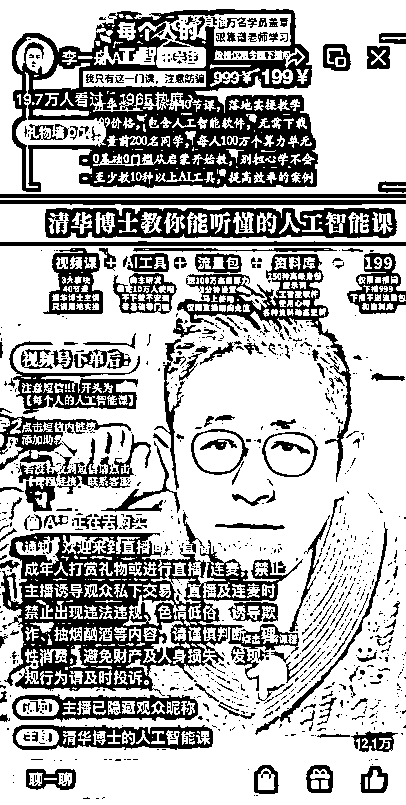
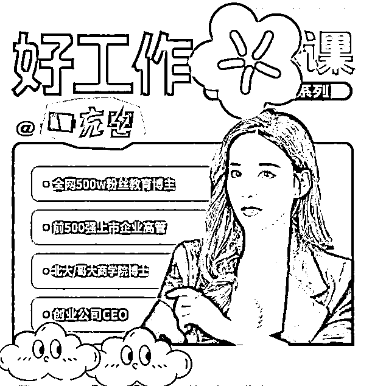
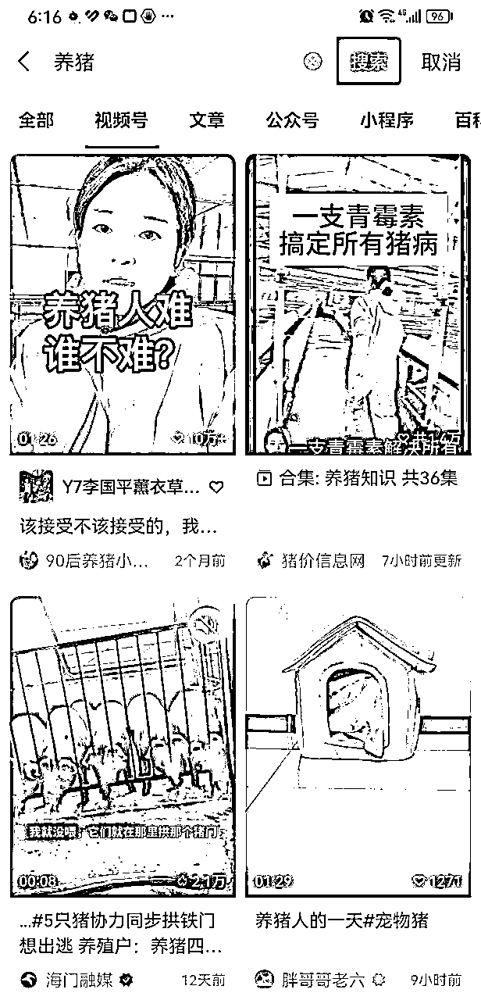
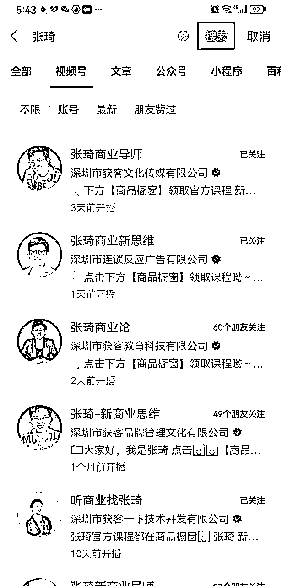
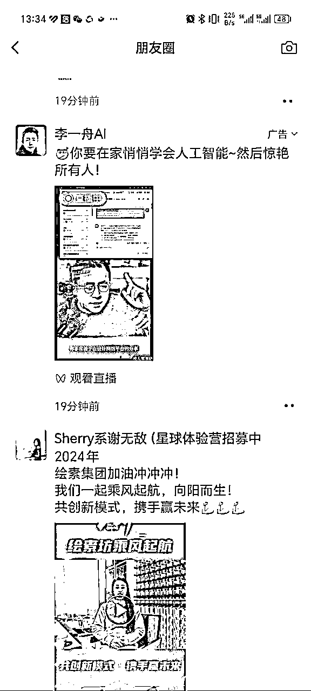
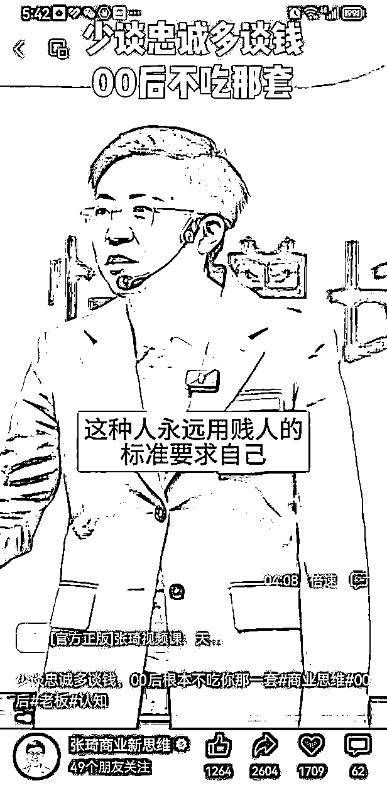
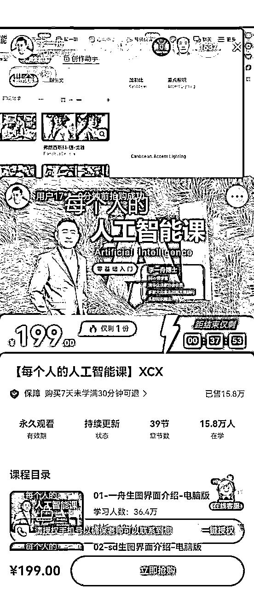

# 风向标拆解第 3 期--视频号高销量的知识付费是怎么玩的--启点

> 来源：[https://v59gesklr7.feishu.cn/docx/AtoEdX43YowfiJx2r0UcxIeInRd](https://v59gesklr7.feishu.cn/docx/AtoEdX43YowfiJx2r0UcxIeInRd)

# 知识付费的现状和概念

## 概念

要拆解怎样玩出高销量的知识付费，就需要搞清楚什么是知识付费，为什么要做知识付费。

知识付费是一种基于互联网平台的商业模式，指的是传播者通过分享自己所掌握的知识、经验或技能，而接收者在获取特定知识时支付一定的费用。

## 现状

视频号正在对教培行业大力扶持，许多类目的知识付费，都呈现出高客单、高销量的姿态。

靠一些小众课程，赚个几百万、几千万的大有人在。早上宝妈带娃，卖教育规划，5000块的课，一场能卖5-6单；晚上白领下班，卖职业规划，399的课卖出4000单。

为什么会是这个时间点直播引流？这类型的知识付费，解决的是什么人群的什么问题？他们核心打法是什么，是靠IP营销卖课，还是电商人货场那套玩法？一场直播下来，到底能赚多少钱？当我们在拆解过程中，把这个变现逻辑去梳理清楚，或许就能找到知识付费在视频号赛道的终极玩法。

以上也说明了在社会大背景的趋势下，以及平台方面，对知识付费的需求。

接着借用明白老师的“兵器库”，围绕需求-引流-营销-变现进行拆解。

# 需求

需求=痛点（需要）+欲望（想要）

## 找需求，就要先找痛点

痛了，就要找“药”，知识是“药”，头痛医头脚痛医脚，用户需要治的是哪方面的“痛”？你能提供的是哪方面的“药”？

“痛”=产生的问题

“药”=解决问题的“有效”方案

找到痛点，是达到引流、营销、变现的基本前提。但会遇到一个问题，你的“药”一定能治他的“痛”吗？

特别是知识付费领域，用户需要的是能“有效”解决成长、晋升、赚钱等“痛点”问题的方法，甚至是需要立竿见影的结果，这是他们的“痛点”。然而一般能够提供的是趋于普适化的一些知识资料、以及整体的一套学习方案，也有可能提供一些圈子、资源、方向，但是这些，都没有办法保证适用于所有人。

因为在同样的学校，有同样的老师和同样的教材环境下，也总会有学霸和学渣之分，我们无法保证提供的方案一定能够解决不同人的“痛点”问题，因为之所以会产生“痛点”，就是由于难解决，而这不一定靠谁就能够完美解决的。

如果有做知识付费宣传说一定能带出“结果”的，可能就需要多些心眼了，多看看，结果是否有效，一般无法保证。

有痛点，客户才愿意花钱解决问题，我们需要围绕“痛点”设计产品，但要卖出高销量，仅仅是这样应该是不够的。

我们需要考虑的是需求的另一方面——欲望。

## 调动欲望，给予希望

什么是欲望？

就拿吃这方面举例，人类其实只要吃饱就行，而在这基础需求之上追求“美味”、“营养搭配”、“价廉物美”，甚至“就餐环境”等等，像这些就是欲望。

而围绕着这些“欲望”，就能产生客户愿意为此花钱的“卖点”。

餐厅打的是菜品，也需要利用“贪嗔痴”的人性出发调动欲望：

贪——把性价比做高，菜量比别人多、价格比别人低、免费自助赠品（甜品、小菜）；

嗔——营造出高逼格，美味的菜式，精致的摆盘，优质的食材，高档的餐厅布置；

痴——打造粉丝模式，像很火的明星队或网红店，明星代言背书、主播种草打卡、稀缺特色菜式，疯狂排队模式。

利用人性中的“贪嗔痴”，为品增加附加价值（更多的可能是情绪价值），借此将更有利于达到引流、营销、变现。

接下来就围绕着客户需求中的痛点和欲望，尝试拆解视频号中高销量的知识付费是如何做到的。

# 引流

## 视频号平台

引流就是传播，传播需要平台，需要选择流量大，人群相对匹配的平台。那么，视频号是最佳的选择吗？

视频号背靠着拥有日活10亿用户的微信，目标是打通视频号+公众号+小程序+微信号+社群的营销闭环。马化腾近期也公开表示:2023年视频号不负众望，今年全力发展视频号直播电商。

由此可见，应该不缺流量。2023年，视频号核心人群画像段仍集中在 40-50 岁，是中轴线里最多的人群，以中老年人为主，特点就是有钱、有闲，而且这群人的消费能力非常强，价值很高。而预计2024年，30-40岁的用户是平台主攻的方向。这个群体在知识付费领域应该是比较匹配的，而且同是腾讯生态，有利于绑定微信引流至私域。

## 人设背景

以爆火的李一舟为例，知识付费博主的天花板，让人印象最深刻的标签就是“清华博士”，几乎是第一次听到介绍就能刻入脑中，一般人能有多少机会能够听清华博士直播讲课？这就是在人设上营造的“高逼格”，而且他同时配上了同样“高逼格”的人工智能课，当清华博士和AI的标签叠加在一起，李一舟博士的人设就瞬间高大上起来。

随手截图，看得出来场观是相当高的，粉丝粘性应该很强，而且愿意听比较专业的课，一般都是比较精准的粉丝。李一舟也不能仅仅只靠“清华博士”的标签，实力也得有。讲搞流量，分析商业搞钱，确实头头是道，逻辑清晰，而且节奏感强，让人感觉确实是降维般的讲课。个人认为这不是一般人能模仿得来的，底蕴不足就很容易露怯。

既有清华博士，还有北大学姐。这个IP名为杨知只，自称是北大&哥华商学院博士，前500强企业高管，同样是在人设上营造的“高逼格”，卖的是跟经济行业分析和找工作相关课程，附送AI工具。

以上两个IP都是打造了“高大上”的人设，这是利用了人性中的“嗔”，两位都有“美味的菜式、优质的食材”，而后者被称神似AB的美女颜值可能还多了“精致的摆盘”，这面还能吸引男性粉丝，能利用人性中的“痴”。

人都会有慕强心理，想要长得更高，想要长得更美，想要赚更多钱。为什么会有欲望，必然是看到有更高的，更美的，更富的，在比价下才激起了欲望，如果在哪方面你是第一，在那方面也就不一定会有欲望了。

你不会听胖子给你推销减肥产品，不会听比你穷的推荐赚钱方法，也不会听学渣来教你学习。

“好好学习，天天向上”。必然是想向上（成长、晋升、赚钱），而不是想向下的。

但并不是说一定要成为学霸，一定要高大上，才能做知识付费。视频号中可以看到，教写字、教画画、教钓鱼、甚至教养猪的同样都是知识付费，在贴合目标人群的领域，选择所擅长的、感兴趣的、能“言之有物”的，或者跟自己身份有关的定位，必然能够比部分人强，80分可以教60分的，60可以教40分的，在别人的眼中你同样是“高大上”。

可能你知道的比他们多，也可能是你经历过他们的阶段，有过实际解决过问题的经验，有解决问题的方案，就行。

自己的标准由自己决定，当别人“想要”达到你的标准，就有可能关注，就有可能达成变现。

## 大佬背书

接着拆解下同样很火的商业导师张琦。跟上面两个IP不同，张琦火出圈是借了格力总裁董明珠“高大上”和“粉丝”的势，在这之前本身并没有能拿出来达到大火的“标签”，但“董明珠”就是个高大上的“标签”，借了大佬的势瞬间就火出圈。就好比如果我是马云的好朋友，那会不会引起好奇呢？如果有足以让用户信服的大佬背书，就有可能借势。

除了标签，张琦的口才也可算是一流，也是说得头头是道，再加上情绪价值，就有不少的粉丝关注以及下单。当然后面有着强大的“博商”团队在支持运作，需要的爆款稿子源源不断，各方面的条件可谓扎实，能极好的发挥优势。

## 切片传播

打造人设或者大佬借势这些是基础操作的话，那么切片传播就是引流营销的利器，像“张琦”名字的账号在视频号有数十个，这样可以进一步的扩大传播，同时也扩大了知名度和影响力，这跟线下网红店的疯狂排队模式有异曲同工之处，火到处处都能看到，难道不会好奇点击看一眼？这就利用了人性中的“痴”吸引更多粉丝关注。

## 付费投流

说到引流，当然少不了“付费投流”这个利器，直接花钱解决问题。据说视频号的投放人群是比较精准的，ROI也比较高，这跟腾讯庞大的数据库很大关系，每个人与腾讯各种产品的粘性，一些习惯、爱好、圈子等等，腾讯都有可能比较容易掌握。

像李一舟的直播能火到这个程度，跟投流必然是离不开的，而且应该是很大笔的数额，但他能够打造如此“高大上”的IP，自身也有雄厚实力，就有把握让投入能够获得高回报的价值。

以下就是在朋友圈看到的李一舟投流广告。

在吸引粉丝关注、成为客户下单的前提，首先就是需要引起人群注意并且点击，只有点开看到你是什么样的人，在说什么样的话，做什么样的事，才算真正触达用户，前面所讲到的才能真正产生效果，进入下一步的营销和变现。

# 营销

营销，是需要针对需求的，前面所讲到的，需求=痛点（需要）+欲望（想要），欲望是调动的，痛点是根本的。

需求是基础，变现是目的，引流是从需求到变现连接起来的“管道”，而营销应该是从头到尾，见缝就扎的“针”，能够随时找机会刺激用户“痛点”，调起“欲望”的“针”，只有扎“痛”了，才会想找“药”，才会“被引流”和“被变现”，才会心甘情愿掏钱，索要解决方案，还有可能谢谢你。

就像赵本山经典的“卖拐”小品，本山大叔是怎样忽悠范伟“找痛点”的？范伟最后是怎样心甘情愿“买拐”的？值得慢慢品。当然，从道德层面来说确实是“忽悠”，但可以说是经典的营销案例，挖掘痛点，而“拐”就是一个解决方案。

而张琦，就是营销方面的佼佼者。

## 扎痛点讲案例

张琦几乎在每一个视频中，都有“扎”一个或者多个痛点的“针”，而且是如容嬷嬷那般直接“亮针狠扎”，如上图提到的“少谈忠诚”、“多谈钱”、“不吃那套”、“贱人的标准”这些词，很难说不被哪个词“扎”到痛点或者好奇心而点击进去看吧？如果没有也可能你不是目标人群的范围。这些就是为某人群埋下的“针”，也可以说是好的选题、爆款元素。

只是提下痛点，那不够“痛”，在视频中接着讲一些相关的案例，能让观看者跟自己生活遇到的事情密切联系起来，才有可能产生“切身之痛”，这时就会激起他需要找“药”的需求，而且案例中提到了通过主播而最终解决了痛点问题，也就是明示或者暗示主播有“治痛点”的“药”，当然观看者就很有可能会关注多看看，甚至也有可能直接下单。

## 干货碎片+价值钩子

一般在视频或直播中是怎样明示或暗示解决方案呢？除了直接讲案例，更多的应该是讲干货，也就是解决方案中的一些碎片认知或者实操方法，观看者会自己用理性去感知判断对自己是否有用，感觉你说的在理，引入你的逻辑，而且是他没听说过的认知或者方法，就觉得你比他强，又利用到“嗔”和“痴”的“慕强”人性。

除了主播分享的干货，加上产品本身，都应该具有“实用价值”，也就是这个“药”能够帮助用户解决一些问题。在这基础之上，尽可能的多一些附加价值，比如信息增量、附送工具、陪伴圈子等等，这些就是“价值钩子”，利用人性欲望的“贪”，让用户感到物超所值，当然就更有可能触发购买，愿者上钩。

而除了“实用价值”，很多主播也会为用户提供“情绪价值”，而且用户也很有可能为“情绪价值”关注和买单。因为人们遇到的问题，很多确实存在实际的困难，但也有很多的困难是在心理上的，那么在某部分满足了用户心理上的缺失，也可能部分解决了用户的痛点，自然用户也会报以情绪，会心甘情愿的，或是冲动下单购买。

在这里提一个问题，大家有没有想过，为什么很多大主播都是在晚上进行直播，大约是在吃饱饭后，睡觉以前？

这里也是一点关于人类心理或是生态上的知识，人类在白天是比较趋于理性的，而当进入夜晚天黑以后，就会逐渐趋于感性，尤其是在吃饱饭后睡觉以前，理性就会逐渐松懈下来，人就会比较容易情绪化，在阴天时有些人也容易产生情绪，也是同理。

在这个时候就更适合看看电视，看看直播，刷刷小视频进行娱乐放松，获得些情绪上的满足，而正是在这个时间段，带货主播进行促销产品，就更容易突破用户的心理防线，触发冲动购买。关于这点，可以观察试试。

## 矩阵营销

前面提到张琦切片传播的矩阵账号，而除了传播内容，引流关注以后，矩阵同时也承担放大营销以及变现的效果。

如下图所示，直播时候张琦并不需要本人在场，主播主要负责介绍产品，偶尔加入张琦的一些录播切片，即可达到营销效果。而这是源于平时张琦的IP形象以及干货内容已经深入人心，这样可以更低成本的扩大传播以及营销效果。

## 低价销售

本次要拆解的是高销量的知识付费，要达到高销量，一般应该是低客单的，而前文提到的三个案例，所售产品均是低客单达到了高销量，李一舟的人工智能课是199元售出超过15万件，

# 变现

最后来讲讲变现。

变现的方式有不同价位档次的课程、社群、工具、训练营等等，很多是组合变现，也就是价值叠加，设计更多的产品类型，也会产生更多的组合，有更多变现的机会。

引流、营销和变现最终围绕的核心都应该是“价值”，而“价值”应该是建立在满足用户“需求”之上的，无论是用户因痛点而需要，还是因欲望而想要，如果能用自己的认知或者经验、方法，让用户用理性判断出你的能力水平，并且用感性感受到你想帮他解决问题的真诚，那就很有可能达成变现的结果，而且还有可能重复购买。

这里再思考一个问题，为什么要为知识付费？除了用户本身希望“成长、晋升、赚钱”这类想变强、变好的需求，或许更需要的是“体验”，就像在游戏中，大部分人都想要赢，都想成为头部大佬，获得更多的资源，这就是需求，而这是竞争机制所造成的，游戏中需要激发玩家们的互相竞争，激发他们“贪嗔痴”的欲望，开发者能获得更多变现。

而正是在追求的过程中，达成的和想要的形成落差，产生各种麻烦、不爽、不甘的情绪，才会产生“痛点”。但是，更重要的难道不是体验？无论是哪方面的“充值”付费，无非就是为了解决一些问题，购买得到更好的游戏“体验”。

在客户面前，营造自身是强者或者是成长者的角色，能够帮助客户解决问题，或是能够陪伴客户成长，都有可能是使得客户获得更好“体验”，客户愿意付款达成变现的方式。知识如果就摆在那，大多数人的观点可能认为是不值钱的，也就没有必要为此付费。所以实际上，是为了“知识传播”而付费，与其说是为知识付费，不如说是为了“学习怎样运用知识”而付费，“运用”知识解决问题以后获得的价值是他们需要的，在追求过程中的“成长体验”，也是他们需要的。

知识付费是典型的“人带货”，这跟校外的培训班老师比较像，无论是人设、讲课内容、方式，都是围绕“知识传播”的价值核心。作为“知识传播者”，给客户心里种下一颗“种子”， 教会播种的方法，重在陪伴的过程，而对于客户，结果能够收获什么，更多的因素还是在于他自己。

# 结语

这是第一次做拆解，水平有限，时间有限，没有抽更多的时间去查找分析案例，难免存在很多的不足，敬请见谅！