# 纯数据流，理科生如何攻坚“公众号爆文写作”？---2024春季RPA工具发布会

> 来源：[https://ovumyiw67u1.feishu.cn/docx/Xo3TdARTCoPfWdx4F3hcNzqqnqd](https://ovumyiw67u1.feishu.cn/docx/Xo3TdARTCoPfWdx4F3hcNzqqnqd)

# 开场白

最新版本已更新，请移步

嗨，大家好，我是RIO

专门研发"能搞钱的RPA工具"，定期公布RPA工具以及分享背后的运营逻辑

今天分享主题是公众号爆文写作

由于本人在12月参与第一次航海---公众号爆文写作

在航海最后一天终于有第一笔收入

具体数字在各位大佬面前不值一提

算是从0到1跑通了整个项目

1个月以来，一边痛苦一边思考

作为新人，太多太多太多太多问题，想不明白

每次看手册听课程都觉得很简单，自己做很难，有没有？

选择哪个赛道好难？找哪个对标好难？

选择什么话题好难？素材哪里找难？

热点在哪？蹭哪个热点好难？

怎么内容有人看？什么内容会爆？

怎么提高原创度？怎么提高完读率？

怎么涨粉？0阅读怎么办？忽然没流量了好慌？

...

关于爆文，许多教程停留在方法论上，而且越来越玄学

身为理科生，真心听不懂文科生在BB啥

所以，我把这两个月学到看到的

以纯数据的角度来探讨文学

把所有的思考都融入到一行行的代码上，落地成一个个RPA工具

给公众号爆文做阶段性总结

以我理解，公众号写爆文的套路，按顺序来应该为：“赛道-选题-写作-运营”

1、选赛道，需要市场数据，先要了解每个赛道收入情况，以及分析赛道文章的爆文因子，才有决策依据

2、选题材，需要监控市场，采集今天的热点与对标账号阅读量，以及分析大盘走势，才选出今日话题与素材

3、写文章，需要挖掘读者需求，还需要一个好标题，文章内容要过原创，要有深度，要有情感

4、做运营，需要一键同步到其他平台才有更多收入，通过做起步的数据才能卡到更大的流量池

对应每个环节配置合适的工具，闭环才算走通

废话不多说，我们聊点刺激的话题如下，顺便公布几个比较满意的工具

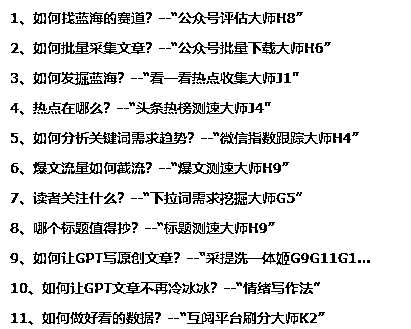

考虑大家对代码都不熟，代码不做过多介绍

只展示每个工具运作效果与分享工具的设计逻辑

# 1、如何找蓝海的赛道？--“公众号评估大师H8”

写爆文第一步要选对赛道（或称为领域）

核心在于判断这个赛道是否蓝海

根据前辈说，如果新号的文章，很容易出爆文，就证明是个蓝海

最终方案变成了找对标账号，查看阅读数据，统计他们爆文率

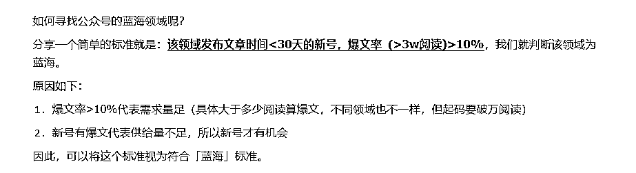

介绍如何对标方法有很多，这里就不展开了

这个工具是一个找对标的统计助手

有了目标公众号后，他能采集公众号下面全部文章，包括标题，发布时间，阅读量，点赞数

效果视频：https://www.bilibili.com/video/BV1kF4m1771d/

首先在电脑上打开公众号，手动下滑，滚到多少页采集多少页，然后运行脚本

然后程序会采集数据并对数据进行统计，爆文率，平均阅读量，发文频率等，按最低1.8元每千次估算，就能评估这个号的收入水平

最终形成一个文档，放在桌面，下图对“生财”最近一个月的情况做了全身检查

结果“生财”基本上是粉丝在阅读，点赞量很高，但阅读量不高，平均有6-7千，没有爆文出现，这个阅读量一个月保底能赚300块

然后统计下面是文章清单，有发布日期阅读量，点赞量与标题，可以用了作为写作参考

多收集几个，打包到一起，大概知道该赛道收入情况，净是这块数据应该可以卖9块9吧

有了这些情报，好处主要能防止心态崩溃（实测有效），或者防止预期起太高，降低失落感

看别人起号的新号，能看到他们一步一步数据如何来的

什么时候出爆文，什么时候流量又下去了，坚持多久又上来了

起号路径有所了解了，心态不会太过着急

第二，有了收入预期也了解到这条赛道能赚多少

避开不赚钱的赛道，选择比努力重要

为什么以1.8去换算呢，就是为了不要过高期望

什么月入过千都是割韭菜的，不可信

因为数据放在眼前

怪不得，前辈说，多开号才是正道

一个号收入有限，天花板就在那里

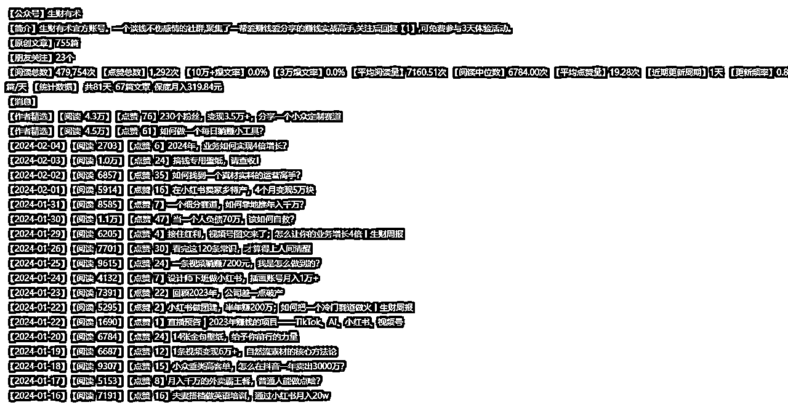

附：生财有术2月5日公众号完整体检报告:

# 2、如何批量采集文章？--“公众号批量下载大师H6”

# 

写作前要建立素材库，常规做法就是下载对标账号的文章

筛选出爆文，多看同赛道的爆文，自己就能总结出该赛道的爆款因子

听说下载文章外面收费很贵，的确有技术门槛

难点在于元素的定位，一般人采集不到

由于微信的文章展示方式多种多样

一行文字，二行文字，有图片，没有图片

中间还可能穿插纯图片分享

影刀类似的工具根本没法找到相似元素组

导致无法实现轮询

需要用非常规的做法才能实现

该工具能定位下载标题，从而点开文章，采集链接，发布时间地点，正文，如图

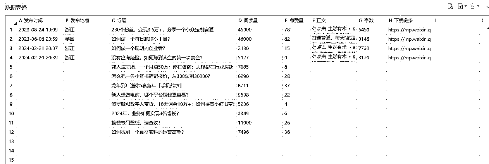

首先在电脑上打开公众号，手动下滑，滚到多少页采集多少页，然后运行脚本

程序会先找到标题，再用标题定位到文章

然后打开文章，把文字复制下来

保存到同一个Excel里，如此循环

一个公众号生成一个Excel文件

之后可以把几个Excel文件合并到一个表里

然后通过Excel的工具进行过滤与排序

可以得到同一个赛道下对标账号的爆文数据了

展示视频：https://www.bilibili.com/video/BV1qz421d7W5/

附件：采集生财有术公众号文章的效果

# 3、如何发掘蓝海？--“看一看热点收集大师J1”

通常，外面的教程都给你找好了赛道

听话照做就行，可是，为什么还是难起来

原因是放出来的赛道，基本都已经红海

而且不断有看过教程的新手涌入，只会越来越卷

所谓，授之以鱼，不如授之以渔

学会自己找赛道，才是正道

如何找？凭感觉来？你喜欢的文章，读者未必喜欢看

谁最能知道读者喜欢什么

微信！他有全盘的数据，他告诉你了，你却视而不见而已

例如，刷看一看的时候会不会看到有带“热点资讯”标签的文章

还是10万+的文章，都是平台算法中得出来大众喜欢的文章

这个工具可以在你在忙时候，默默地刷新看一看页面

记录下带标签的文章，包含标题与发布的公众号

等你闲的时候给你参考，挖掘潜在的蓝海赛道

你可以用上面的评估大师与批量下载大师对这些号进行分析

最后决定要不要加入该赛道

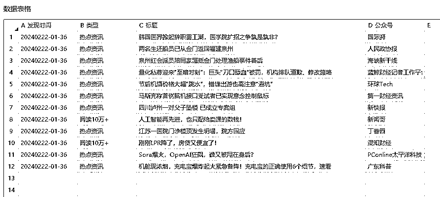

展示视频：https://www.bilibili.com/video/BV1qz421d7W5/

# 4、热点在哪么？--“头条热榜测速大师J4”

蹭热点都知道好，热点哪里找？

关于热点，都在关注几个大平台的榜单，或者数据分析网站，例如新榜或易撰

但热点是动态的，除了排名，还需要了解他的数量级，发布时长，流量速度

我发现，阅读量与排名没有直接关系

反而流速越快，真实反映了这个热点吸引力大

通常一个热点事件各平台同步发布的，但头条跑的最透明

跑出来的榜单比公众号快半天

一般地，6小时后微信就跟着火起来

你没看到只是微信没有推荐给你账号而已

这个工具主要针对今日头条的

头条把每个事件做了统计和打包了几条关键文章

脚本会按榜单顺序依次打开

采集阅读总量，找出最早发布的文章

流速=阅读总量/(现在时间-最早发布的时间)

工具最终生成一个EXCEL文件

我一般是通过Excel的工具按流速排序，得到热点结果

最近建了一个群，定时分享热点信息，感兴趣可以链接我

通过这个方法成功预测到“谷歌杀妻案”“梅西事件”

展示视频：https://www.bilibili.com/video/BV1t1421Z771/

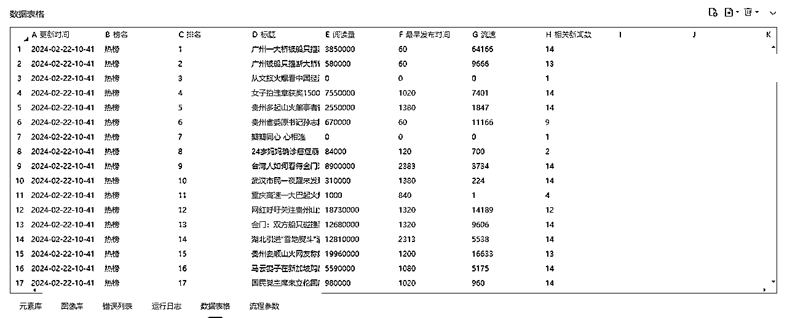

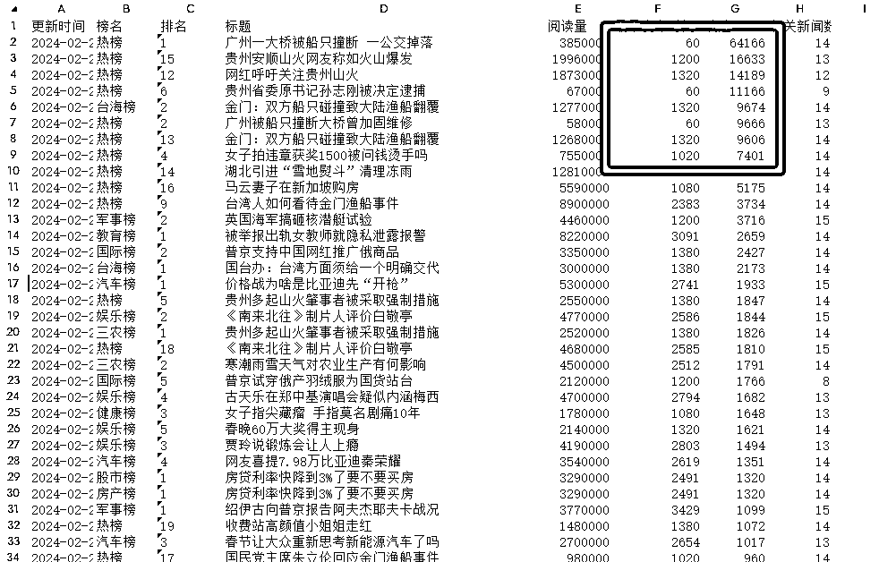

附：2月22日10点58分头条热点采集数据表格

# 5、如何分析关键词需求趋势？--“微信指数跟踪大师H4”

微信指数是一个小程序

官方说法，体现关键词相关内容的受欢迎程度（即读者需求量）

只有这个地方可以查到微信公开的数据

这个数据在中午12点更新，是昨日统计结果

跟踪某个词的变化，就可以看到这个词的趋势

也可以横向对比，优化你的关键词

这个工具能自动按表格查询与采集

形成文件，放在桌面

可以理解为昨日赛马结果

而且指数更多来源于视频号

指导公众号不太准确，我作为大盘走势参考

可能视频号项目更具有指导作用

展示视频：https://www.bilibili.com/video/BV1Jz421R73E/

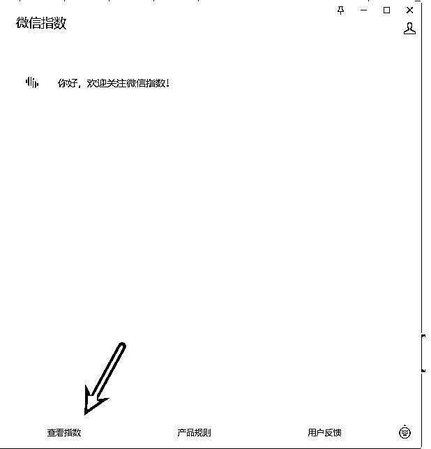

附：跟踪结果文件

# 6、爆文流量如何截流？--“爆文测速大师H9”

每天选题最伤脑筋，但选题直接影响收入，重中之重

蹭热点是选题一种打法，能带来突发性的增长（参考热榜测速大师），缺点是不常有，中标概率不高

还存在另一个打法，深耕某个垂直赛道，细水长流，不用操心世态炎凉

但极度考验持续输出能力

基本上，普通人没有这个能力（本人也没有）

爱情都有七年之痒，何况赛道，基本上一周两周都耗光了存货与耐性

有些教程让你去洗历史爆文，原理是“爆过还会再爆”

其实历史爆文全国人民洗了不止千百遍，机洗手洗正洗反洗都有，需要更刁钻的角度更猛的操作才能搾出汁

意味洗稿成本越来越高与爆文概率越来越低

有没有破解之计？有！找新爆文截他流

原理是监控赛道的对标账号（3个或以上，越多当然越好，没有限制）

采集他们今天和昨天的新文章，计算他们的流速

发现异常值，就是新爆文种子，然后...懂得都懂

这个工具能按你通过的账号名单去查找发布文章记录，统计流速

最终形成EXCEL文件，放在你桌面

所以为什么你不要轻易公布自己的号或文章么

就是一旦被监控了，你就成为我的测款账号，每天准时检查作业

在黑暗深林里，不知道有多少个像我这样猎人，偷偷盯着

展示视频：

顺便找个三个公众号（多多得罪有怪莫怪）采集他们文章，分析如图

多少流速才算合格，要看赛道，看多了就自然知道

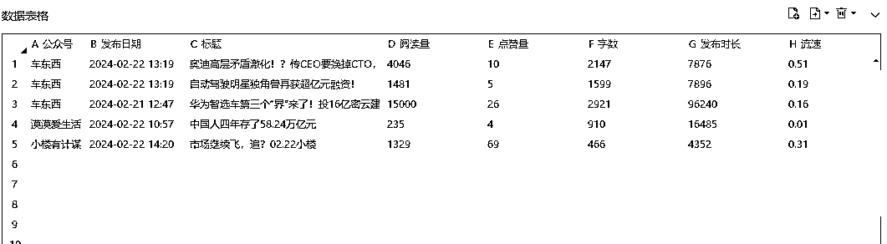

附：最终结果文件

# 7、读者关注什么？--“下拉词需求挖掘大师G5”

选好题材后，怎么知道读者对这个选题关注点在哪

作为读者，如果对某个话题很好奇，最常见就是搜搜看

搜索框的下拉提示词，就是平台给我们总结这类用户常常搜的那些词

这些词就是读者需求点

下拉词后面还有下拉词的下拉词 ，所谓长尾

这个工具能把所有1级，2级的词都记录下来

不过，挑排名靠前的几个点来写应该足够了

展示视频：https://www.bilibili.com/video/BV1qS421P7ZT/

当然还可以去抖音、小红书执行相同操作

但要考虑读者受众是否一致

建议做公众号就在公众号找答案稳妥点

以最近热点“沥心沙大桥”为例，文章侧重写解答这些读者需求，文章会有很好的SEO

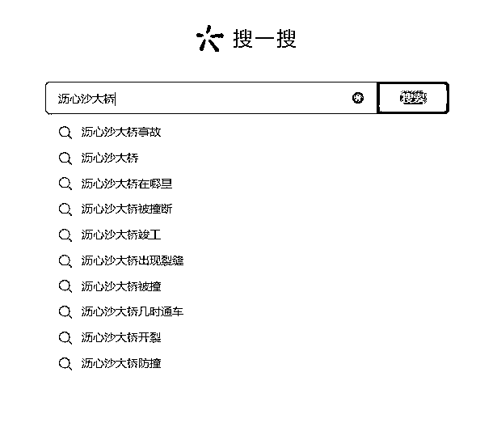

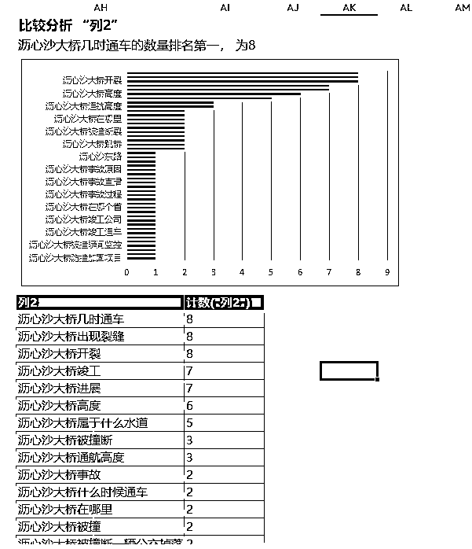

# 8、哪个标题值得抄？--“标题测速大师H9”

# 

选好题材后，必须选个好标题，提高点击率

有些大号，随便起个标题，都可以爆，不讲道理

我们这种小小小小号，随便起标题马上0阅读，不信你试试看

所以必须为我们闺女找个好人家

好标题胚胎通常来源于爆文

当你搜一搜，把同个话题的，当天最热的文章清单刷出来

这么多标题该选哪个？这个工具可以给您参考

运行脚本，就会显示每个文章的流速

同样是1万阅读，有些标题只要1小时就能完成，有些用了1天

按降序排列，根据公众号的名称滤掉大号

剩下就是低粉账号，靠实力吸睛的标题胚胎

据前辈说，1分钟200阅读增量属于小爆款

有了胚胎，再用开门雷击的方法改造一下，就是我们的爆款标题

以最近热点“沥心沙大桥”为例，跑出来的结果如下

看到没，这个就是纯实力的低粉爆款号（多多得罪有怪莫怪）

找到标题后...懂的都懂

展示视频：https://www.bilibili.com/video/BV1ov42167ix/

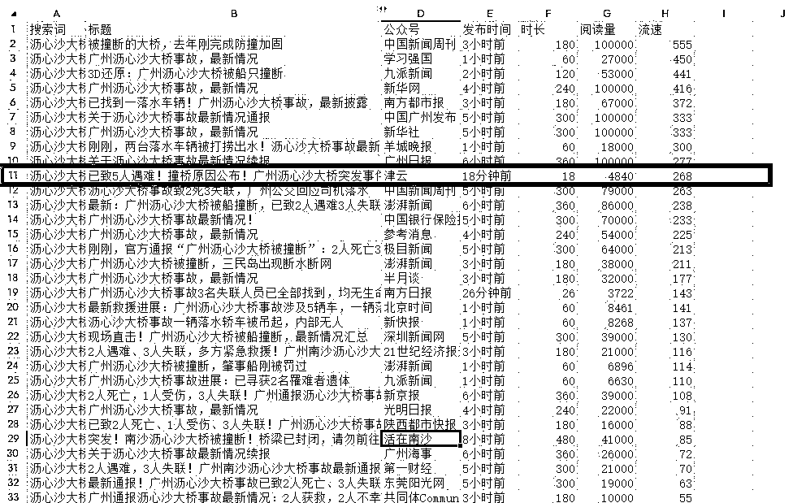

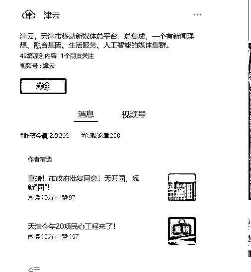

# 9、如何让GPT写原创文章？--“采提洗一体姬G9G11G12”

真正的问题是如何提高原创度？

根据圈友的分享，行内流传一种打法：“拼接法”

这套打法，需要采集两篇或两篇以上文章，然后提取相同论点A的不同论据B和C

然后把论据B+C交给GPT，让他围绕着论点A重新编写文章

过程中还可以调整论述结果，例如原文是先因后果，改写为先果后因

一番操作基本上等于原创

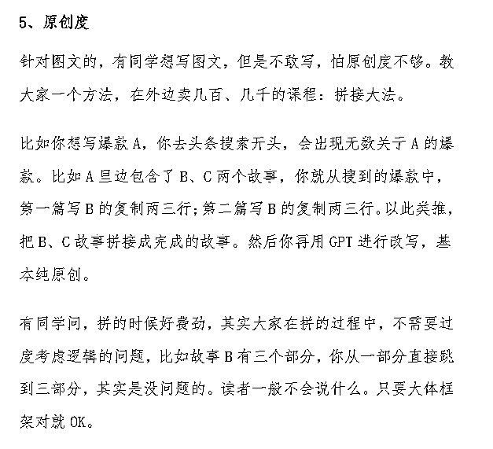

如何让文章显得有深度？我理解，所谓深度就是有信息增量

在原文基础上增加了更多细节，原文没有硬知识，原文没有的小八卦，或者原文没有观点

例如，有看到过一篇文章，报道了某个明星死于心梗的新闻

另一篇文章在原新闻的基础上增加了防心梗的注意事项

另一篇文章则增加了明星他爸也有心梗的家族史

这都是增加了文章信息，比原文挖得更细更深入

当然如有自己新观点更好

基于上面的原理--工具采用了采提洗三步法

第一步（采）：需要机器人具备多端采集的能力，目前适配了微信PC端，今日头条WEB端，今天头条APP端、小红书WEB端，自定义

通过搜索工具可以找到很多同个话题的不同观点的文章，还记得下拉词需求挖掘大师么

他能协助你找到“值得写的”读者需求与文章

机器人除了能采集文章标题与正文，顺便完成图片去水印，简单去重

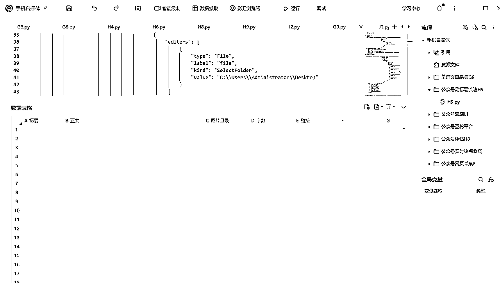

第二（提）：要机器人有批量调用GPT的能力，这步需要GPT把文章拆解

请将文章分为若干章节，并且总结归纳每个章节的中心论点

找出该章节中支撑论点的论据，统计论据数量并摘录各论据原文

并且保留姓名、时间、地点、金钱、职位、对话和具体数字等关键信息

在于对GPT网页版的监听，这里有个小技巧

那个发送按钮的状态在GPT书写的时候，是灰底，写完了，是实黑（比设置固定等待时长高级一些）

根据这个状态可以完成全自动批量操作

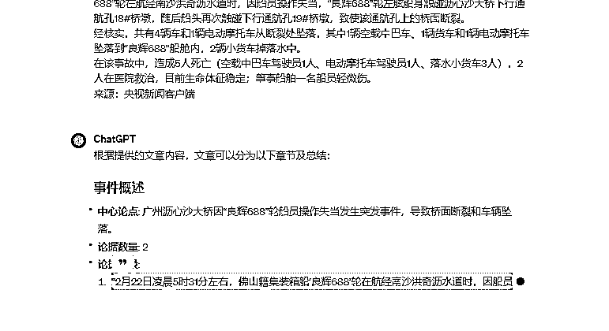

第三（洗）：需要机器人根据论点与论据交给写作机器人，分段重写

多段合并一起，送去5118检查违规词，再发送到公众号排版工具，生成样式

完成整个创作过程

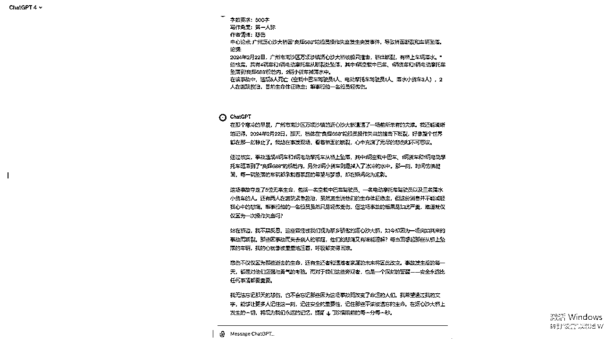

# 10、如何让GPT文章不再冷冰冰？--“情绪写作法”

prompt是一个炼丹的历程，不断教然后修正，再教再修正

没有最好，只有更好

这里分享让GPT写文章带情绪的提示词

# 11、如何做好看的数据？--“互阅平台刷分大师K2”

破零就是我们这些新人最难熬的

辛辛苦苦写的文章没人看

所以，自己文章要自己推广

有没有一些组织能帮忙推广呢

网上真的有，有些组织号称有1W+运营者在抱团取暖

所谓，互阅平台

好处是可以做“好看”的数据给到平台

你帮别人阅读攒取积分，花积分请人阅读自己的文章

一来一回，实现人人为我，我为人人

等于说，只要手头有积分就有阅读量

尤其可以花高价请人点击“在看”

一旦有人在看了，平台会推给他朋友，他朋友有可能也看，雪球就滚起来了

问题变成了如何攒取更多积分

平台有规定满足10秒阅读时长，还有必须看到文章末尾

把当前阅读量回填到平台，才能合格阅读

等于说攒取积分要花费人力，谁有这个闲工夫

这个工具就能帮上你

他能自动完成整个流程，挂机刷积分，无限撸

让你实现积分自由

积分多了，想做什么数据都可以

展示视频：https://www.bilibili.com/video/BV1um411Q7J1/

# 尾声

以上是参与12月航海的成果

公众号文章写作肯定会继续下去。继续深挖

因为对于我来说，公众号不是玄学

而是实实在在的数据，实实在在的抓手

每个决策都不是来自主观

而是数据告诉我该怎么做

爆文不是靠大运

这就是纯数据流

另外看到平台在打击AI洗稿，其实是好事

不希望RPA应用停留低质洗稿软件

他应该有更大生产力

他需要有人教更深层次的问题

对公众号这套打法感兴趣，可以链接我

对影刀RPA开发有问题的也可以链接我

趁机我想找个小红书的导师，能够带徒直接赚到米的那种

希望共同开发新武器，分享成果，例如

# 收集读者评论--“小红书评论采集器I2”

这是生财里面有视频贴，呼吁去做小红书评论的采集

据说，通过评论可以挖掘需求出来

但市面上很少这类软件，所以运营人员都手工采集

比较麻烦

这个需求在网页端是比较难实现的

要处理折叠与异步加载

但在手机上会比较简单实现

虽然开发已出来了，但不会用啊

希望真正懂的人带走，随便带带我

# 

感谢文中引用到的两位大佬精彩文章： 毛韩教练、徐言随谈

感谢这次航海的教练与领队

链接方式 rio0235