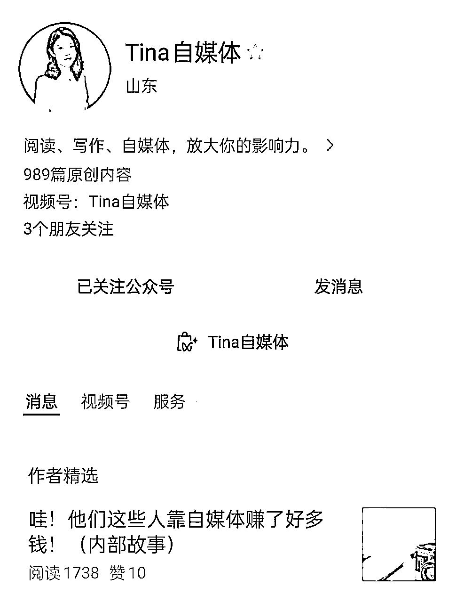
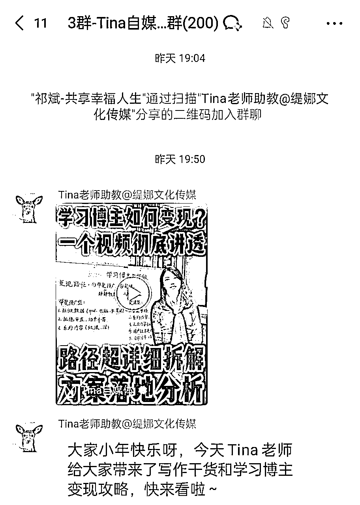

# 视频号高销量的知识付费是怎么玩的--阿翰

> 来源：[https://opc8tu4qr0.feishu.cn/docx/DPBrdN0QnoxGtUx4U1Xc40wrnqh](https://opc8tu4qr0.feishu.cn/docx/DPBrdN0QnoxGtUx4U1Xc40wrnqh)

# 案例拆解

## 1 账号情况

Tina自媒体：读书，写作，自媒体IP培训

## 2 产品怎么解决？

4-5年的知识博主，自己做课。目前上架的商品有多个，而且价格不便宜。

高客单价：自媒体年度陪跑课

中客单价：自媒体创作线上课，写作线上课

低客单价：读书营，拆书写作营，超级个体密训课，卖书的佣金

## 3 流量怎么运营？

视频号免费流量：直播和发视频

视频，日更且做了5个定位相关的合集

死磕直播，每天12点直播，之前的没截图。

公众号免费流量，8年老号，粉丝也得有个十万。

通过送资料方式，引流至微信群。以后发送文章，视频，开直播等，也会把链接发到微信群中。

小红书十万粉丝，且还有小号，小号粉丝1万多，关于自媒体IP打造的。

## 4 利润怎么算？

这是我在她朋友圈找的直播数据，单场成交一万多，因为很多价格在直播时，有优惠。

年入7位数，博主亲口说的，我相信，因为她多平台都有店铺，且很多高客单价。尤其是在小某书有十几万粉丝，这个群体购买能力很强。

视频号知识付费店铺数据：总计1688742元

高客单价GMV：19800x4=79200

中客单价GMV：5980X205+3099X62=1418038

低客单价GMV：999X71+999X112+119X73=191504

成本：平台收费，小助理，部分投流。

## 5 项目如何做&如何放大？

### 1）项目如何做？

前期通过读书写作培养内容输出能力，然后在平台公开发表出去，积累粉丝。然后根据粉丝要求，做相应的付费产品。

通过内容，获得粉丝，然后直播卖自己的课。

### 2）项目如何放大？

多平台一起做，案例博主就是的。

多矩阵操作，我在平台发现，博主不止一个号。

付费投流，我在她直播时问过，她偶尔也会付费投流。

## 6 项目结论

赚钱是赚钱，难度有些大，首先要具备很强的内容能力，直播时才能留人。

其次，要具备做课，做训练营的能力。这样才能出产品。

新手不适合这种模式，新手先培养一个能力吧！