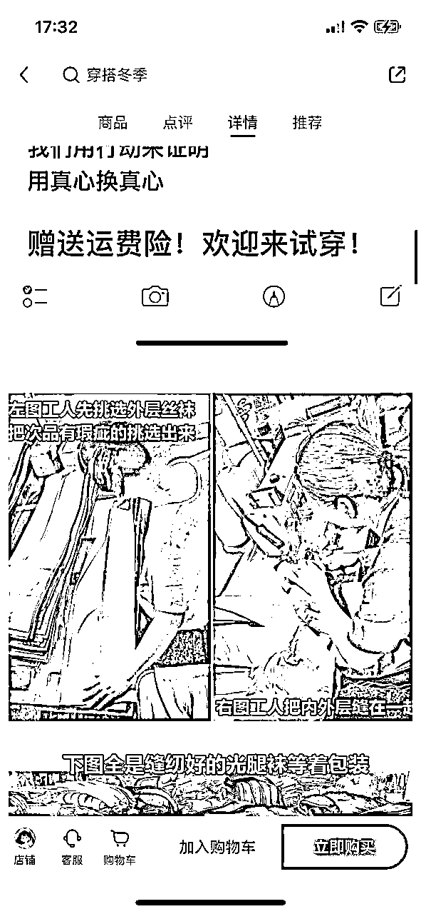
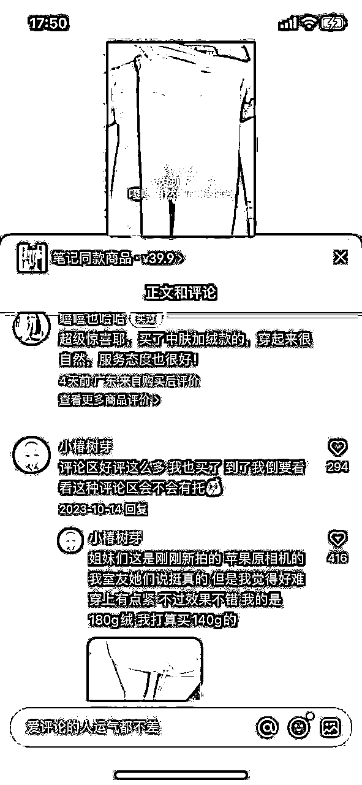

# 风向标拆解第 3 期--小红书爆款，售卖件数50W+的店铺到底是怎么赚钱的--假装我不在

> 来源：[https://iw4syatsfgo.feishu.cn/docx/XQtMd1Ye5oVtBnxc72PcX2uTnGe](https://iw4syatsfgo.feishu.cn/docx/XQtMd1Ye5oVtBnxc72PcX2uTnGe)

大家好，我是湉湉（佃佃）～

最近有幸被选中参加了咱们风向标第三期活动，我拆解的风向标项目是：小红书爆款，售卖件数50W+的店铺到底是怎么赚钱的。这篇帖子的拆解目标是随意找的，并没有定向寻找。

主要是为了随机性，任意找一个类目我也能把店铺的变现逻辑整明白，同时也帮助圈友们少走弯路~

# 前景概述

时尚穿搭类目达人很多，五万粉丝以下的账号有将近 9 万个，一万以下的素人 6.5 万个，这个赛道还是比较卷的，但是做电商还是没问题的，保险一点可以选择大赛道下的细分赛道，比如服饰中的衬衣、打底裤等。

小红书电商项目我还是比较看好的。

# 小红书行业大盘数据

从大盘数据上看，女装类目的细分赛道是很有潜力的，小红书女粉较多，裤子赛道中打底裤做的人是整个类目中比较少的，因此上升空间是很大的。唯一的缺陷是季节性。

# 目标店铺账号

钱与书光腿神器，做了蓝V认证，也做了服装经销商认证。

# 目标店铺账号分析

*   账号ID：钱与书光腿神器5

*   粉丝数：1.5w

*   笔记数：176

*   赞藏总数：14.8w

*   赛道：穿搭-服饰

*   产品：打底裤-光腿神器

*   价格：17-49.9元

*   店铺单品销量：最高单品 76万

*   用户画像：97%女性，主要年龄18-24，活跃时间段为晚上11点，粉丝数TOP3：广东（12.90%）、山东（8.30%）、河南（7.30%）

近一周该店铺销售 3 万，近半个月销售 10 万，15 天平均销售单数 3K+。截止到现在，店铺累计约 80万单，整体销售额 3000多万，利润至少千万。数据非常好，吃到了平台的红利。

该店铺于 2023.11.13 开始发笔记，整体以视频为主，图文为辅，视频笔记占比 75%，爆文比例 5.5%。2023年秋冬时期，光腿神器应季节而生，笔记也容易出爆款。第一条笔记爆款笔记为 11月30日 产生，该店铺关联达人 4 位达人，涨粉速度和出单率都很高，最高单品出单 76.1 万单。该店铺 3 个多月整体销售 80万 单。

店铺累计上架 7 个商品，最高销量单品为单价 39.9 的光腿神器。店铺详情页由视频+图文结合，并不一定要精美图文，也不需要高适配性，主打真实，介绍详细，把产品亮点写清楚。

自店铺创建起，笔记内容热词覆盖以下内容，高频词穿搭、时尚、光腿神器、平价好物、测评、显腿长等

从数据上，该店铺关联4个账号，近3个月有3天是爆文，爆款笔记为2023年11月秋冬季，这篇爆文连带着后续的半个月的流量都特别好。随后在12月初和月末分别产生爆文。

# 店铺流量密码

*   店铺装修：厂家人设到位，主打低价高性价比，由于是服装类目，设置了运费险，打击用户痛点。不合身、质量问题等随时退。服装类目设置运费险好卖，但是也需要考虑售后成本。

*   内容选题（笔记内容）：每一条爆款笔记都是视频，视频内容并不是以美为主，而是真实，主打光腿神器的用户痛点，比如假白、不自然、太贵、质量问题、没有售后；拍摄模特非本人，这是小红书的真实模特，这一招真是一举多得，让用户免费得一条打底裤，获得用户免费广告，并以此为素材宣发。

*   视频笔记：穿搭类目的产品需要视频拍摄，测评对比

*   店铺设置优惠券，新用户关注即可领取

*   店铺鼓励用户写晒单笔记，可以给店铺带来额外的销量。

# 爆款笔记分析（含用户痛点）

*   标题：30+就可以买到超自然的光腿神器!

*   内容：宝子们!谁懂啊!一个月1500生活费怎么买平价好物!我们家光腿神器厂家直销，没有中间商赚差价，一条只要30十，还送运费险，包满意包退换!穿的不开心随时来捶我… #光腿神器 #最逼真的光腿神器 #光腿神器推荐 #我的平价好物 #平价穿搭分享 #女大学生 #钱与书光腿神器 #钱与书 #学生党平价好物 #学生党也可以入的平价穿搭 #不踩雷

*   笔记类型：视频

*   视频内容：狠抓用户痛点，全程试穿，非同一个主播，多段素材混剪，多角度展示，如直接展示、上身试穿（蹲下、拉扯、伸腿、蹦跶）

*   视频时长：28s

*   视频文案：家人们，我发现了一条嘎嘎好的光腿神器，很有弹性，双层设计，无论怎么动都非常自然，，蹲下来几乎没有褶皱，好像在拉自己的皮，非常贴合关节处骨骼清晰，咋蹦跶都没有毛病，瞧瞧这对比，也太滋润了，家人们真滴爱了

*   用户痛点：自然、超薄、亲肤、无褶皱、平价、高性价比、不踩雷、不掉档、有售后保障、真实

# 总结

*   服饰穿搭类目的笔记推荐以视频为主，图文难以展示优势，其细分赛道潜力很多，唯一的缺陷是具有很明显的季节性。钱与书光腿神器账号，最近流量不太好，主要原因还是服饰行业的原因，季节性很明显。

*   视频内容可以做混剪，不建议全部下载，容易被判违规，建议加上我们自己的拍摄的内容。这样既能保证留存，也能保证不被判违规。

*   标题和文案介绍还是要以主打的人群特点，并围绕这群人的用户痛点去提炼关键词，另外，也不要太粗暴了，可以用这群人比较喜欢的语调表述。

*   店铺装修方面。立人设，新店铺不建议直接做高客单，还是先做下流量品，先测一下。

*   售后方面。如果做服饰鞋履，建议带运费险，好卖一些。如果做极致售后，可以发一篇帖子，所有相关的售后问题都在这里，但凡有人问，就可以发给她。

*   其他。店铺可以设置新手优惠券，或购买优惠券，但是一定要测算自己的利润空间，低于20%真的没有必要做了。