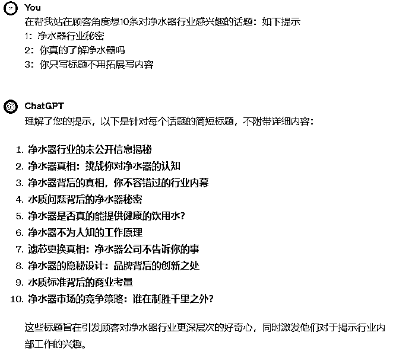

# 风向标拆解第 3 期--传统制造业如何通过抖音矩阵化＋SEO优化获客--大路边的西瓜

> 来源：[https://j7z5rfbqyp.feishu.cn/docx/DY0qdpnfdomTBXxPzEIcu3vMnRg](https://j7z5rfbqyp.feishu.cn/docx/DY0qdpnfdomTBXxPzEIcu3vMnRg)

大家好，我是大路边的西瓜

# 前言

1.  有幸被选中参加了咱们风向标第三期活动，我拆解的风向标项目是：传统制造业如何通过抖音矩阵化＋SEO优化获客。

1.  最近发现抖音一个带货账号利润非常牛皮，属于小众品垂直品，利润非常爆，不到四年变现超500W+

1.  起号到现在不到四年

# 1 ：项目前景分析

【据尚普咨询集团数据显示】2023年全年全球净水器市场规模将达到1400亿美元，中国净水器市场规模将达到300亿元。目前，净水器行业竞争激烈，技术创新和品牌建设是企业的核心竞争力。未来，净水器行业将面临更高的环保标准和消费者需求，同时也将迎来更多的市场机遇和发展空间。（项目本身属于比较小众，很多大佬看不上）

*   制造业小众项目的特点：

*   竞争小，利润空间不错

*   内容引流疲劳程度相对低

*   痛点1：需要只播，直播成交高，要懂点净水器的知识，

*   痛点2：存在售后需要花点心思（交给第三方可以解决，后面会讲到）

# 2：如何在抖音起号获取流量

经过研究发现他的账号主要是以大部分用户的痛点来做文案录播上传视频，不管说得好不好每个星期录播3-5条视频积累，也开直播，一个星期开3-5场，勤奋的时候每天直播，这个账号20W+粉丝我已经关注他一年的了经常看直播。

自己出境拍视频和直播

### 录播：内容怎么做,以下是对标账号

*   揭秘进水器行业的秘密

*   净水器的坑你知道吗？

*   千万别乱买净水器浪费钱

*   超滤机解决不了水垢问题

*   我观察了很多他的视频，内容来回就十几个不断的重复拍，最多就是稍微修改下文案继续拍“说白了就是重复拍”干就完了

#### 如果你是个行外人怎么找顾客痛点标题，内容怎么做？

1：可以复制别人爆款的视频内容提取文案，自己稍加修改，你也重复拍

2：当然是利用最火的AI来生成，只要你给指令他就干活

3：以下是我让AI生成的10个标题，选取合适的用就行，没让他一起把内容写出来，以为写10个标题在把对应的内容写出来始终不如人意，待学习更好的指令。

4：AI生成标题内容，不断调试后给了足够多的指令内容还可以

### 直播：

1：需要一点专业知识，具体什么知识问来问去无非就几个问题，就是他发视频标题那些，可以看他的视频分析用户最关心那些问题直接抄下，边做视频边直播边学习就行了。我看他拍第一个视频的时候说话并不是很流畅，信心也不是很足，隔了好多天才继续拍，后面拍得视频我总结的就是“信心够足，够肯定”这样给消费者很大的下单鼓舞。

2：直播还是多联系就行了哈，（我也没直播过）

# 3：构建产品壁垒

1.  贴标后他的产品就是独一无二

1.  分析：据我研究这刘师傅的净水器是自己贴标的oem产品，也就是普通净水器厂家代工产品，

1.  不同的是机器定制了他的名字“刘师傅”这种操作你也可以😂，

1.  看图，一模一样的机器多了几个字而已。

## 商标要注册吗

*   目前没发现刘师傅商标被注册过我就不多说了“脑补一下”

## 该怎么做

*   直接阿里找厂家，询盘问能不能定制或者帮或者贴标，说出你的想法给对方想象，大部分厂家都会合作，其实不用画饼厂家也乐意，有钱不赚的老板没见过

# 4：变现分析

*   一共分为5个品，都是用在净水器上的，买了他的净水器还得每年或者半年换一次滤芯，长期有收入。

*   流量结构

大部分都是粉丝和自然流，基本没投流

## 品1：刘师傅净水器利润分析

*   发货顾客自己安装价格1299

*   发货师傅上门装1399（贵一百块师傅山门装足足有多了）

*   阿里拿一台机器的价格来算，机器成本拿货价约570元，邮费50，估计量大还可以谈

*   这个品我们保守按1299不包安装直接邮寄来算，1299-570-50＝679*7579=5146141

## 品2：刘师傅净水器原装滤芯

*   原套装滤芯

*   1，2，4，号滤芯卖79（成本40包邮可以寄非洲了）

*   3，号600G RO滤芯卖199（成本120包邮，一线品牌）

*   全套卖269（成本160元包邮）

*   这次咋们取一个销量赚100元来算，420*100＝42000

## 品3：TDS水质监测笔

*   这个9.9引流品，单拿一只4.5元不包邮，6只起包邮

*   9.9包邮的话基本不赚钱

## 品5：净水器压力桶

*   这个亦正压力桶，拼多多43包邮利润56

*   利润580*56＝32480

# 5：间接接单赚钱的机会

很多老板看了他的账号视频要求上门定制办公室直饮水，工厂直饮水的单子并不少见，利润比卖这个净水器高不少，也可以从他视频中看到他上门定制办公室净水额视频，包括售后维修，换滤芯等都是机会。

# 6：机器安装怎么解决

*   做这个项目可能需要上门安装，购买机器的都是全国各地可能还包括港澳台

*   很简单直接找第三方平台对接比如“骑兵到家，师傅来了，等平台

*   可以网上搜一下,净水器安装平台即可，只要你的单子多对方会帮你安排专业对接的客服，不用自己操心

# 7:做这个项目需要几个人？

*   分析了他的账号后基本一个人运营，配一名客服对接发货的厂家和第三方售后平台，

*   目前只看到一个账号运营，还有其它二个小号陆续停更了

*   8:我是去年四月进入生财的，目前兼职跑套了一些项目变现不多2W左右，目前在尝试公众号爆文，兼修AI工具和RPA，有空还得盯着生财，确实学习了很多东西，提高看认知，开拓了自己的视野。第一次手写这么多字，逻辑可能并不是很清晰请见谅，感谢生财，感谢圈友。