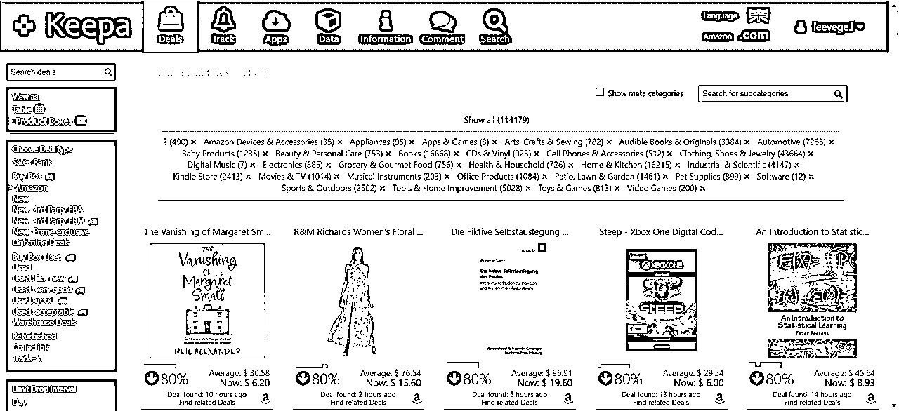
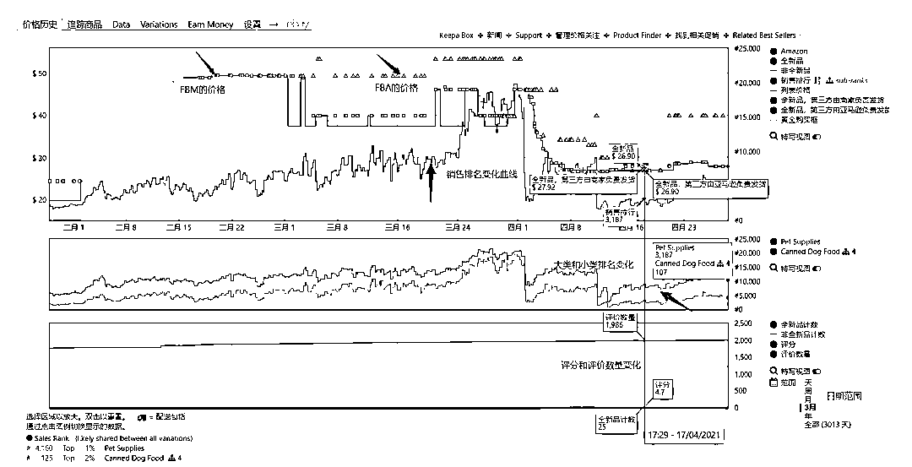
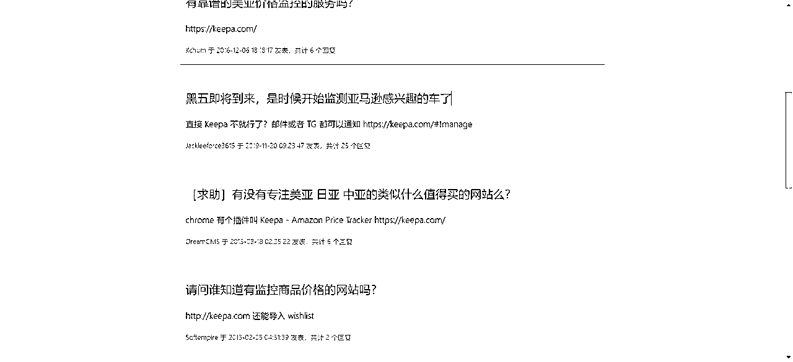
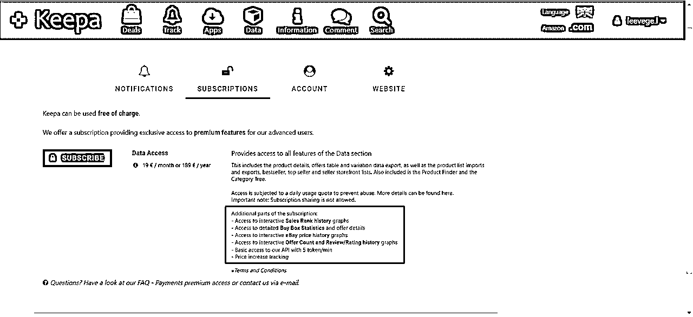
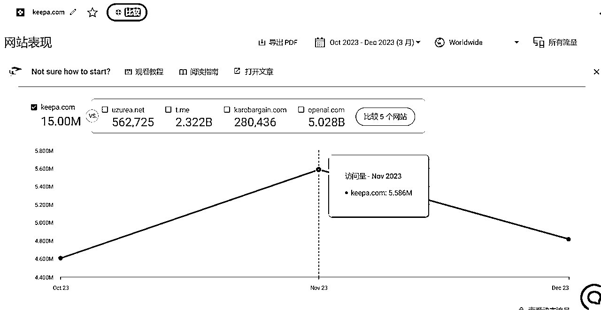

# 风向标拆解第 3 期--做个海外服务商，分析一个跨境商品数据分析插件如何盈利--Leevege

> 来源：[https://hxp8qe2o0x.feishu.cn/docx/DdWddxxW8oIVVZxXz8FcqALnnDh](https://hxp8qe2o0x.feishu.cn/docx/DdWddxxW8oIVVZxXz8FcqALnnDh)

你好，我是出海数据分析师Leevege，有幸参加风向标拆解第3期的活动，我想要拆解的是：做个海外服务商，分析一个跨境商品数据分析插件如何盈利。这篇文章就以商品数据监控插件keepa为例，希望也能帮你了解到从开发者的角度来说那些插件怎么样可以匹配到用户的需求。

拆解大纲如下（可以点击对应标题跳转）

1.赛道前景概述

2.如何定位要做的工具

3.如何引流

4.盈利模式

5.注意事项

# 1.赛道前景概述

网购刚兴起的时候，大家的购物习惯只是从线下变成了线上。其实大家的需求都没有变：在哪里可以买到性价比最高的产品？哪里可以拿到最高的优惠？我现在买会不会亏？电商带动了增值工具的发展，比价插件/软件就是其中之一。

最一开始，这种类型的插件只是为了服务买家，毕竟人数更多，需求更大，但是到后面大部分开发者都发现卖家也会用这些插件做新产品开发、了解用户属性，所以也为卖家开发了对应的功能。想当初我在做亚马逊运营的时候也没少用Keepa作为竞品分析和调研的工具。

之前看过一篇分析报告，由于海外没有像国内网速那么快，通过电脑网购还是比较主流的一种做法，跨境电商衍生的工具这个细分市场还是可以挖掘到不少需求的。

# 2.如何定位要做的工具

给跨境电商卖家提供铲子其实应该属于工具站赛道，但是众所周知工具站最难的并不是实现需求，而是发现需求。比较幸运的是，我们基本不需要担心找不到跨境电商对应的工具需求。像Keepa这样，直接针对单个商品展开，了解产品销售和评价排名变化（对于卖家来说可以知道运营效果如何），了解产品种类变化（对于买家来说是否有过全新品、是否亚马逊发货也很重要，作为买家可以蹲商品优惠）。

从上图中不难看到，Keepa还是花了不少心思在UI上面的。其实愿意为这种功能付费的用户都属于价格和排名敏感型用户，所以价格和排名理应是工具里面最显眼的，用户更关心的是两者的变动。对于卖家来说，大类和小类的排名变化结合自己手里的产品销量可以具备推测出竞争对手的销量的能力，评价数量和评分变化可以让自己得到对应listing的运营动作信息，是否有合并变体；对于买家来说也一样，结合排名和评分等变化看就可以评估一个商品值不值得买，我如果是买家的话肯定不会去买那种通过合并变体刷评价分的产品的。

从开发角度来说，分别需要站在买卖双方的用户思考对应立场的利益点是什么，插件的版位一般都比较有限，最多只能占据一个页面20%左右的空间，否则就会影响主要内容的呈现，所以尽量只展示和用户利益相关的功能。

# 3.如何引流

最常见的引流方式就是把自己的产品发到producthunt、hackernews、v2ex等平台了，所有相关的论坛养了一段时间号然后再把自己的工具/插件链接和介绍放上去。一般的论坛评论不会直接展示，更不会被论坛自带的搜索引擎收录，所以看评论的人需要二次点击才能发现评论内容，引流一般都是建议直接发帖。

如果只做插件，引流的效果可能会比较有限，所以工具站的重心可能还是要放在网站，虽然单纯靠SEO引流会比较慢，但是谷歌收录了网页之后，通过外链可以拿到更多的引流资源，只有插件而没有自己的网站的话，别人在搜索引擎里面都搜不到你的产品。有自己网站的情况下，把插件的商店链接放在自己的网页首页也是不错的选择。

# 4.盈利模式

为了吸引大部分的用户，工具站和插件很多都是以低价/免费作为噱头，限制一部分功能的使用或搜索、筛选展示结果的数量，然后再把核心功能开放给付费用户，Keepa也不例外。对于轻度网购的人来说，只需要知道大概买一个产品会不会亏就够了，但是对频繁网络下单的重度用户或者需要了解竞争对手动向的卖家来说，及时知道一个listing价格曲线是什么样的，ebay上价格怎么样，有什么卖家成功跟卖，变动可以尽早通知到自己就显得尤为重要了。

Keepa的价格是19欧元/月，可能因为自来水流量已经足够大了，所以并没有在营销上多花功夫。平均每个月五百万访问量，就算只有万分之一的人订购了，每个月的GMV都有95万欧元。

当然，作为老牌插件，这样的体量和数据我们可望不可及，但是如果是个人开发者，不妨学一下vidIQ这个Youtube插件，这个CTA做得会更吸引人。不过监控Youtube似乎用的前端处理会更多一些，所以成本也会比监控亚马逊商品更低。

总结一下，工具站/插件的盈利模式就是【免费，开放受限制的功能】，或者：【收费/几天内免费，后面收费并开放全部功能】，可能在收费的环节会分几层，按照用户支付能力开放开发成本更高的功能。为什么盈利模式这么单一？其实单一的盈利模式恰恰说明了出海工具站和插件的天花板有多高。就像大部分的海外APP那样，我们不需要去开发多余的功能，只要满足了用户最初始的需求，用户就愿意为这个需求付费。

# 5.注意事项

1）虽然工具站和插件都需要一定的门槛，但是现在搭建工具站比做插件要容易一点，上线网页可以用模板或者wordpress，对个人开发者来说更值得参考的做法是尽可能少的用代码实现需求（卖空气），当需求量变大的时候再增加人手开发。

2）谷歌插件的上传到审核发布需要时间，一定要搞清楚谷歌的插件发布条款和政策，轻则无法发布插件，重则收益会打水漂。

3）尽量要把数据处理放在前端或者用户的电脑。如果放在后端服务器处理，一方面会增加我们个人开发者的成本，另一方面会降低插件的页面表现。

以上就是我本次拆解的全部内容，希望能做到抛砖引玉，谢谢！