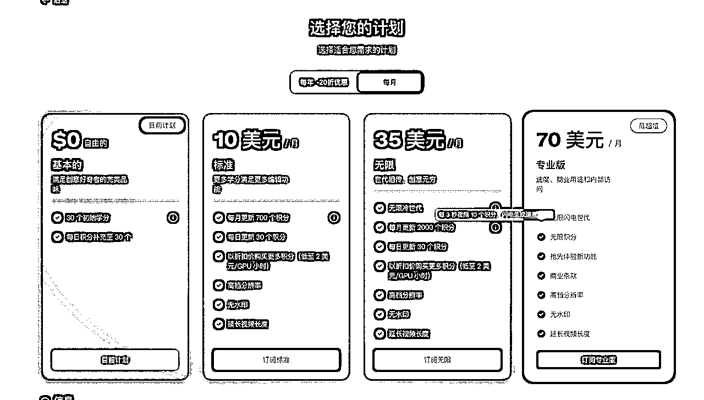

# AI产品丨01 Sora深度解析：OpenAI的文生视频革命

> 来源：[https://t16jzwqrzjx.feishu.cn/docx/Dh6Rd3e0QoJlSgx8oNjcvVYSnjg](https://t16jzwqrzjx.feishu.cn/docx/Dh6Rd3e0QoJlSgx8oNjcvVYSnjg)

# 前言

一周前，OpenAI发布了文生视频软件Sora的一些训练成果，又一次惊艳了所有人。

各种关于Sora的报道铺面而来，我的朋友圈先是被卡兹克的文章刷屏，又看到了红衣教主周鸿祎的评价。

我看完了Sora之后感觉这个产品确实很厉害，又是一个具有划时代意义的生成式AI产品，但感觉这一次的热度远远比之前GPT的热度更高一点，看了市面上关于Sora的很多文章，其实还是有点云里雾里的感觉，于是我基于市面上的文章和OpenAI官方的手册去研究了Sora，写下了这篇文章。

文章主要包含以下几个部分的内容：

1.  Sora相比Runway、Pika为什么是一个划时代的AI产品

1.  文生成视频这赛道是什么样子，大家采用的技术方案有什么区别

1.  Sora的文生视频模型逻辑是什么？它的优点和缺点在哪？

1.  Sora对于视频领域的影响有多大

1.  会带来哪些看起来还不错的赚钱机会？

# 一、划时代产品Sora

## 1.1 案例对比

让我们先拿几家产品最厉害的文生视频的例子拿出来对比一下。

Sora

Runway

Pika

让我们忽略各种技术层面的评判标准，仅仅从真实度这一个上评估就可以看到这三家的产品差距天差地别。

Sora给到的案例视频过于真实，如果不告诉你它是AI生成的视频，你或许会直接认为是人为拍摄的。

而Runway、Pika的产品还远远没有到这个地步，跟Sora就不是一个时代的产物了。

Runway还要在推特的评论区受到Sora的暴击。

## 1.2 Sora的超越

相较于其他模型，Sora的优势主要是三方面：时长、角度、世界模型。

### 1.2.1 可以生成长达60秒的视频

目前Runway、Pika支持的视频一次最大长度是3-4秒，而Sora的长度为60秒。

Prompt: A stylish woman walks down a Tokyo street filled with warm glowing neon and animated city signage. She wears a black leather jacket, a long red dress, and black boots, and carries a black purse. She wears sunglasses and red lipstick. She walks confidently and casually. The street is damp and reflective, creating a mirror effect of the colorful lights. Many pedestrians walk about.

提示：一位时尚女性走在充满温暖发光霓虹和动态城市标识的东京街道上。她穿着黑色皮夹克、长红色连衣裙和黑色靴子，手持黑色手提包。她戴着墨镜和红色口红。她自信而随意地走着。街道潮湿且反光，创造出彩色灯光的镜面效果。许多行人在周围走动。

### 1.2.2 一个视频内支持多个角度

大家看一些抖音口播视频，基本上就是一个角度拍摄一镜到底的视频。

但我们看这个夏洛特烦恼王老师的视频，会发现他有多个角度来描述来表达。

Runway和Pika是单角度的抖音口播视频，那么Sora就是一个多角度的影视视频。

多角度跟单角度的差距也就1000分和60分差距那么大吧。

### 1.2.3 理解真实世界的能力

人类世界有很多物理规律，当你要用AI生成这些视频的时候，希望达到足够拟真，你也要遵循这些物理规律。

比如说汽车开在路上能有尘土，海边会有涨潮落潮。

Sora通过海量的学习，能够理解世界，比如说海边的潮汐运动，车后的尘土。

它是一种习得性的逻辑，这个世界它见过的东西，它能够模仿出来。

世界模型：它理解了这个世界。

# 二、文生视频赛道解析

## 2.1 AIGC热门方向

正好我们接下来要讨论文生视频赛道，那让我们先对AIGC整个赛道做一个回顾：

AIGC（人工智能生成内容）和我们相关较大的热门赛道主要是以下五个：

1.  文生文（Text-to-Text）：这一赛道专注于利用AI技术生成文本内容，如新闻文章、小说、诗歌、代码等。代表产品有ChatGPT、Claude、Kimi、智普；目前存在很多不错的商用产品。

1.  文生图（Text-to-Image）：这一赛道涉及将文本描述转化为图像的技术；代表产品有DALL-E、Stable Diffusion、Midjourney等；目前存在很多不错的商用产品。

1.  音频生成（Text-to-Audio）：这一赛道专注于将文本转换为语音或音乐；代表产品有Google的Text-to-Music、Github开源项目Coqui TTS等。

1.  数字人（Digital Humans）：这一赛道专注于创造和应用具有高度逼真外观、行为和交互能力的虚拟角色；代表产品DID、Heygen、硅基智能、风平智能；目前存在很多不错的商用产品。

1.  文生视频（Text-to-Video）：这一赛道的目标是将文本描述转化为视频内容。目前这一领域还处于早期发展阶段，主要产品为：Runway和Pika，目前Sora带来一定的颠覆式创新；目前不存在好用的商用产品。

文生视频从技术实现路线上来说可以是这五个模块中最难的一个模块，不是Runway和Pika太弱，而是Sora过强。

## 2.2 文生视频技术路线区别

Runway和Pika都使用了Diffusion Model技术，而Sora使用的是Diffusion Transformer技术。

让我们用一些更简单的例子来理解Diffusion Model和Diffusion Transformer，由于我对技术的理解有限，所以我召唤了万能的Kimi来给我讲个案例来分析一下：

想象一下，我们有一个艺术家，他想要创作一幅画。这幅画的创作过程可以类比为数据生成的过程。

Diffusion Model（扩散模型）：

*   想象这个艺术家开始时只有一张白纸（初始状态，相当于高斯噪声）。他开始在纸上滴上颜料（扩散过程），随着时间的推移，颜料逐渐扩散开来，最终形成了一幅复杂的画作（数据点）。

*   现在，艺术家想要复制这个过程来创作新的画作。他需要逆向工作：从已经完成的画作开始，逐步移除颜料，直到回到最初的白纸状态。这个过程需要他记住颜料是如何扩散的，然后逆向这个过程来生成新的画作。这个过程可能很慢，因为艺术家需要仔细地观察和模拟颜料的扩散过程。

Diffusion Transformer（扩散变换器）：

*   在这个例子中，我们给艺术家提供了一个特殊的工具——一个智能画笔（Transformer结构）。这个智能画笔能够记住颜料在纸上的扩散模式，并且能够快速地在不同区域之间传递信息，帮助艺术家理解整个画作的结构和细节。

*   当艺术家想要创作新画作时，这个智能画笔可以更快地模拟颜料的扩散过程，因为它能够同时处理整幅画作的多个部分，而不是一次只处理一个点。这样，艺术家可以更快地从白纸状态生成新的画作，同时保持高质量的输出。

Sora和Runway和Pika最大的不同在Transformer赋予的它对世界的理解能力。

# 三、Sora能力解析

OpenAI发布了多篇关于Sora的文章，我主要基于OpenAI官方公布的文章来给大家解析Sora的能力

参考文章：Video generation models as world simulators

## 3.1 Sora介绍

Sora 是一个能够根据文本指令创造现实和富有想象力场景的人工智能模型。

OpenAI正在教授人工智能理解和模拟动态物理世界，目标是训练能够帮助人们解决现实世界互动的问题的模型。

1.  Sora 能够生成长达一分钟的视频，同时保持视觉质量和对遵循用户的提示词。（OpenAI原文）

一分钟的视频我们在开头介绍过很多次了，这里主要讲一下遵循用户的提示词。

原文：Introducing Sora, our text-to-video model. Sora can generate videos up to a minute long while maintaining visual quality and adherence to the user’s prompt.

其实刚刚看到这里我是有点懵的状态，为什么遵循用户的提示词这个事情要单独拿出来说一下？按道理遵循用户的提示词不应该是一个模型应该做到的吗？

我去把它的提示词和视频都看了一下，发现它的提示词的每一个点，在视频都有体现。

Sora对文本和视频都有非常深刻的理解且具有强大的映射能力，这是它世界模型强大之处。

Several giant wooly mammoths approach treading through a snowy meadow, their long wooly fur lightly blows in the wind as they walk, snow covered trees and dramatic snow capped mountains in the distance, mid afternoon light with wispy clouds and a sun high in the distance creates a warm glow, the low camera view is stunning capturing the large furry mammal with beautiful photography, depth of field.

几只巨大的长毛猛犸象正踏步穿过一片雪地，它们长长的羊毛状皮毛在行走时随风轻轻飘动。远处是被雪覆盖的树木和壮观的雪顶山脉，在午后的阳光下，天空中的薄云和高悬的太阳营造出温暖的光辉。低角度的摄像机视角令人惊叹，捕捉到了这些大型毛茸茸的哺乳动物，呈现出美丽的摄影作品和景深效果。

Animated scene features a close-up of a short fluffy monster kneeling beside a melting red candle. The art style is 3D and realistic, with a focus on lighting and texture. The mood of the painting is one of wonder and curiosity, as the monster gazes at the flame with wide eyes and open mouth. Its pose and expression convey a sense of innocence and playfulness, as if it is exploring the world around it for the first time. The use of warm colors and dramatic lighting further enhances the cozy atmosphere of the image.

动画场景特写一个短毛茸茸的怪物跪在一支融化的红色蜡烛旁边。艺术风格是3D且逼真的，重点在于光影和质感。画面的氛围充满了惊奇和好奇，因为怪物用大眼睛和张开的嘴巴凝视着火焰。它的姿势和表情传达出一种天真和俏皮的感觉，就像它第一次探索周围的世界一样。温暖的色彩和戏剧性的照明进一步增强了图像的舒适氛围。

A young man at his 20s is sitting on a piece of cloud in the sky, reading a book.

一个20多岁的年轻人正坐在天空中的一片云朵上阅读一本书。

1.  Sora 能够生成具有多个角色、特定类型动作和准确细节的复杂场景。模型不仅理解用户在提示中所要求的内容，还理解这些事物在物理世界中的存在方式。（OpenAI原文）

能够生成多个角色，这么多电视机里每一个都是完全不同的画面。

The camera rotates around a large stack of vintage televisions all showing different programs — 1950s sci-fi movies, horror movies, news, static, a 1970s sitcom, etc, set inside a large New York museum gallery.

摄像机围绕一堆大型复古电视机旋转，这些电视机上播放着不同的节目——1950年代的科幻电影、恐怖电影、新闻、静态画面、1970年代的情景喜剧等，场景设定在纽约一家大型博物馆的画廊内。

1.  Sora 对语言有深刻的理解，能够准确解释提示并生成表达丰富情感的引人入胜的角色。Sora 还可以在单个生成视频中创建多个镜头，准确地保持角色和视觉风格的一致性。（OpenAI原文）

多镜头在文章刚开始就给大家展示了，这里看一个非常惊艳对语言理解的案例。

A cat waking up its sleeping owner demanding breakfast. The owner tries to ignore the cat, but the cat tries new tactics and finally the owner pulls out a secret stash of treats from under the pillow to hold the cat off a little longer.

一只猫唤醒它的熟睡主人要求吃早餐。主人试图忽略猫，但猫尝试新的策略，最终主人从枕头下拿出一个秘密的零食储藏来暂时安抚猫。

不过好像罐头没有拿出来，哈哈哈；

但是我们也可以看到这么简单的提示词，能够生成这么复杂的场景，Sora的世界模型太厉害了。

1.  当前模型存在弱点，它可能在准确模拟复杂场景的物理方面遇到困难，也可能不理解特定因果关系的具体实例。（OpenAI原文）

Sora基于Diffusion Transformer的逻辑，构建了强大的世界模型，但是它对于世界的理解是我们不可控的，就比如说人在跑步机上跑步，Sora能够模拟，但是人是逆着跑步机跑步的，这些我会在Sora不足跟大家分享案例。

## 3.2 Sora如何生成视频

我看了Sora论文，给我的感觉就是我看了一篇论文，我尽量用容易理解的话来阐述它如何生成视频的。

在说Sora之前我们先说LLM的产品ChatGPT，他们有着类似的逻辑。

ChatGPT是使用Transformer（深度学习技术）架构的文生文产品。

LLM通过学习大量的文本数据，来预测生成下一个词，这个词的最小单位我们称之为Token。

与 GPT 模型类似，Sora 使用Transformer架构，解锁了优越的扩展性能。

Sora 是一个扩散模型，它通过从一个看起来像静态噪声的视频开始，逐步去除噪声来生成视频。（OpenAI原文）

Sora 将视频和图像表示为较小的数据单元集合，称为块，每个块都类似于 GPT 中的 Token。（OpenAI原文）

也就是他们和GPT一样打包了一个最小单元Token的概念。

通过统一我们表示数据的方式，我们可以在更广泛的视觉数据上训练扩散变换器，涵盖不同的时长、分辨率和宽高比。

Sora 建立在 DALL·E 和 GPT 模型的过去研究之上。（OpenAI原文）

它使用了 DALL·E 3 中的重新标题技术，该技术涉及为视觉训练数据生成高度描述性的标题。结果，模型能够更忠实地遵循用户在生成视频中的文本指令。

GPT理解文本=Sora理解视频。

OpenAI做的最核心的事情是让模型去理解世界，而不是去做特定的任务。

当模型理解了整个世界，文本也好、图像也好、视频也好，它最底层逻辑其实是一样的；OpenAI把在文生文的事又放在了文生视频又做了一遍，再一次证明了，他们的技术路线是具有高度可行性的。

不过目前来看AI还是模仿生成，他们对这个世界的理解有但距离人类的学习理解依然有很长的路要走。

## 3.3 多尺寸视频生成支持

Sora可以采样宽屏1920x1080p视频、垂直1080x1920视频以及两者之间的所有内容。

这让Sora能够直接在其原生宽高比上为不同设备创建内容。

它还让我们在生成全分辨率之前快速原型化较小尺寸的内容——所有这些都使用同一个模型。（OpenAI原文）

看图可以很直观的感觉到Sora对于不同尺寸的内容生成支持。

垂直1080x1920

基于两者之间的尺寸

宽屏1920x1080p视频

## 3.4 图像生成视频

Sora能够基于图像和提示来把它变成视频，

一只戴着贝雷帽和黑色高领毛衣的柴犬。

以扁平设计风格绘制的多样化怪物家族。这个群体包括一只毛茸茸的棕色怪物，一只光滑的黑色怪物带有天线，一只斑点绿色怪物，以及一只微小的圆点怪物，它们都在一个充满趣味的环境中互动。

一个真实的云朵图像，拼写出“SORA”。

## 3.5 视频编辑

### 3.5.1 拓展生成视频

Sora能够向前或者向后来拓展视频。

这两个视频的开头不同，但Sora给他们生成了相同的结尾。

### 3.5.2 视频编辑

Sora可以改变视频的风格和环境，目前看起来这个案例还不错，期待后续更多的案例放出来。

### 3.5.3 连接视频

Sora可以识别两个视频并且将他们进行合适的转场链接，实现无缝过渡。

视频1

视频2

视频链接1和2

## 3.6 图像生成能力

看多了上边惊艳的画面，这个图片生成反倒是没什么太惊艳的事情了，大家知道Sora也支持这个事情就可以了。

## 3.7 Sora的不足

看了那么多惊艳人的案例，我们终于可以点评Sora的不足了，让我们看看官方给出的那些失败的案例。

当前模型存在弱点，它可能在准确模拟复杂场景的物理方面遇到困难，也可能不理解特定因果关系的具体实例。（OpenAI原文）

Prompt: Step-printing scene of a person running, cinematic film shot in 35mm.

提示：拍摄一个人跑步的场景，使用35毫米胶片拍摄的电影镜头。

弱点：Sora（可能是指某种软件或技术）有时会产生物理上不可信的动作。

它的理解世界并不是物理意义上的理解，而是模仿意义上的理解规律。

Prompt: Five gray wolf pups frolicking and chasing each other around a remote gravel road, surrounded by grass. The pups run and leap, chasing each other, and nipping at each other, playing.morePrompt: Five gray wolf pups frolicking and chasing each other around a remote gravel road, surrounded by grass. The pups run and leap, chasing each other, and nipping at each other, playing.

提示：五只灰色的小狼崽在一条偏远的砾石路上欢快地嬉戏，互相追逐，周围是一片草地。这些小狼崽奔跑、跳跃，互相追逐，轻咬对方，玩耍。

弱点：在包含许多实体的场景中，动物或人可能会突然出现。

当一群狼在一起时，它似乎对于每一条狼的动作处理出了问题，可能是场景过于复杂。

Prompt: Basketball through hoop then explodes.

提示：篮球穿过篮筐后爆炸。

弱点：这是物理建模不准确和物体“变形”不自然的一个例子

你说它没爆炸吧，它也爆炸了，但是这个爆炸是💥，而不是篮球炸开，可能提示词写成篮球穿过篮筐后篮球爆炸裂开更好一点，但是又不太符合人类思考逻辑。

你说它生成的不对吧，其实它按照提示词生成的也对，每一个提示词它都精准做到了。

你说它做的好吧，蜡烛也没灭，人物表情也非常奇怪。

它是很惊艳，但也很假。

Prompt: A grandmother with neatly combed grey hair stands behind a colorful birthday cake with numerous candles at a wood dining room table, expression is one of pure joy and happiness, with a happy glow in her eye. She leans forward and blows out the candles with a gentle puff, the cake has pink frosting and sprinkles and the candles cease to flicker, the grandmother wears a light blue blouse adorned with floral patterns, several happy friends and family sitting at the table can be seen celebrating, out of focus. The scene is beautifully captured, cinematic, showing a 3/4 view of the grandmother and the dining room. Warm color tones and soft lighting enhance the mood..

提示：一位头发梳理得整整齐齐的祖母站在一张色彩斑斓的生日蛋糕后面，蛋糕上插满了蜡烛，摆放在木制的餐桌旁。她的脸上洋溢着纯粹的快乐和幸福，眼中闪烁着幸福的光芒。她向前倾身，轻轻地一吹，蜡烛便熄灭了，蛋糕上覆盖着粉红色的糖霜和彩色糖屑，蜡烛也不再闪烁。祖母穿着一件带有花卉图案的浅蓝色衬衫，可以看到几位快乐的朋友和家人坐在桌子旁庆祝，他们的身影略显模糊。这个场景被美丽地捕捉下来，具有电影感，展示了祖母和餐厅的3/4视角。温暖的色调和柔和的灯光增强了氛围。

弱点：对于模型来说，模拟物体之间以及多个角色之间的复杂互动往往具有挑战性，有时会导致生成的结果显得滑稽。

我觉得有的时候我们得多看点Sora的失败案例，来给人类增加一些信心，最起码今年不会被AI替代。

# 四、Sora的影响

## 4.1 迷雾赛道中的灯塔

就像GPT的技术路线一样，很多时候大家会面临很多很多种选择。

但在一个划时代的产品出现之前，大家都不知道，哪条分支是对的。

但是随着一个确定性的技术路线出现之后，各家其实只需要在这条确定性的路线上做追赶，就可以有所突破。

就跟造原子弹一样，造第一颗是对于未知的探索，难度最大；后边的都是已知的探索，难度会简单很多。

Sora其实就是文生视频（Text-to-Video）路线的一个灯塔，它又一次验证了Diffusion Transformer能够高质量的跑出来这条路。

相信就和LLM在GPT之后百花齐放一样，文生视频（Text-to-Video）在Diffusion Transformer也会迎来更多的东西，去在这条路上做探索。

## 4.2 算力成本：到底是奔驰迈巴赫还是比亚迪秦？

让我们看一算力成本，我们按照月度粗略估算一个成本出来，来评估Sora的成本影响。

计算过程中我们不考虑无限制视频生成这个选项，这个可能是根据用户最大生成数计算出来用于赚钱用的。

首先是Runway，35美刀一个月，5学分可以生成1秒gen2视频，也就是35美刀一个月你可以做450秒的视频。

一分钟视频成本在32块人民币（4.6美刀）

Pika，35美刀一个月，10积分可以做3秒视频，也就是35美刀一个月可以做200秒的视频。

一分钟视频成本在63块人民币（10美刀）

Runway和Pika实际上都是按3-4秒最大程度来生成视频。

Sora那如果生成60秒的视频，因为要保证整个视频的连贯性，有可能算力成本会是3-4秒拼凑60秒视频的10倍成本以上，有可能会出现一分钟视频成本在300-600元之间。

通过算力的粗算，我们可以看到：

Sora对行业的立即性的影响到底有多大，最终还是要取决于它的算力成本。

如果说Sora能够把1分钟的视频成本压缩到32块人民币（4.6美刀）左右，那Runway和Pika只有被吊打的分了，如果还要再低一点，比如10块钱一个高质量的1分钟视频，那Sora可以跟比亚迪秦有一拼了，价格战没有人可以赢。

但如果Sora的成本比想象中的还要高，达到1000元一个1分钟视频，那就是奔驰迈巴赫了，我们普通人看看但是用不上，只能等待算力成本下降才有使用的可能。

这个算力成本其实不算严谨，只是根据Runway和Pika的成本来估算，实际上还应该算成片率等多个因素加进来，成本还会进一步飙升，不过仅以基础套餐计算我们其实已经能够感觉到算力成本的影响了。

## 4.3 对视频行业的影响：颠覆行业还是遥遥无期

Sora不会颠覆视频行业，就像MJ、SD也没有颠覆作图行业。

甚至Sora对视频行业的影响从目前来看，都没有“稿定设计”对作图行业的影响大。

稿定设计你只需要花200多块钱，就可以买2年的作图使用，你可以去改各种图片，一个月你高频用的话其实跟一个月5K左右的设计做的没啥区别，你的成本才有多少。

SD、MJ、稿定设计，他们其实都是工具对于设计作图这个大场景下部分垂类场景的细切。

它们对于某一类细分场景下都有很不错的解决方案。

AI工具更多是在整个工作流中的某一个环节帮助人提升效率，而不是取代这个工作流。

Sora也一样，当它的算力成本很低的时候，它可以让每个人都用很低的成本制作出有意思的视频，但是这些视频只是人类所有视频中的一小部分，而不是全部。

视频行业从业者可以用Sora快速产出一个案例让大家更好的理解他想拍摄的画面，是提效不是取代。

从GPT出来之后，自媒体上一直在喊整个世界要被颠覆了，1年半时间过去了，其实没什么太大的变化；AI进入了我们生活，在局部场景有提效，但是整体还是老样子。

智能手机用了十几年改变了人类的生活方式，AI或许也会，但很有很远很远的距离。

不必过度焦虑，多关注多学习就好了。

# 五、Sora对应的赚钱机会

我们客观的来看借助sora有哪些不错的赚钱机会，从纯粹商业的角度。

如果Sora正式公开使用，那么最大的赚钱机会依旧在：体验、学习这两点上。

## 5.1 体验

### 5.1.1 套壳Sora使用

案例：https://sorawebui.com/zh/playground

通过API接口来通过信息差获利。

跟GPT刚出来的时候套壳GPT一样的逻辑，套个壳利用信息差来赚钱。

不过强依赖Openai的Api权限，如果OpenAI不做开放或者限制开发，那这个生意比较难做。

### 5.1.2 卖账户

同套壳差不多的逻辑，主要考验的是渠道能力；也强依赖于OpenAI的开放授权，部分放开的情况下感觉账户的溢价会稍微高一点。

### 5.1.3 卖提示词/代做视频

这里有一个点要看OpenAI给到的算力价格有多少，如果一个视频要35块（5美刀），那门槛真的是天大的高，体验不一定卖得好，因为太贵了。

反而有可能提示词和代做视频的需求会提升，典型的MJ的提示词和SD赛博机车作图。

## 5.2 课程学习

### 5.2.1 不要割韭菜，认真用心做教育

Sora火了之后，很多AI培训行业的从业者给出了不同的答案，“通往AGI之路”更新了Openai直译的论文和大量免费的案例，“AI风向标”里大家整理了最新咨询和48个Sora官方提示词。

氛围还是很不错的。

但是行业里还是有一些害群之马的，一群没有Sora测试权限也不懂Sora的人公然打出了这张割韭菜的海报。

互联网是有记忆的，大家很多圈子也是互通的。

多提升专业技能去助人，善因得善果，比什么都强。

### 5.2.2 认知培训（避免焦虑）

AI的通识类教育我觉得还是有很多机会，比如整个AI发展+商业的串讲，不过这个用户人群可能就要铆钉好了，到底满足用户什么样的事情。

或许可以考虑可以做AI通识公开课+培训课变现的思路，也可以考虑针对企业中高层做AI发展+商业思路的串讲，这个具体看你能够接触到那些用户和你对应的水平是什么样的。

当大家过渡焦虑的时候，帮助大家治愈焦虑还是蛮不错的事情。

### 5.2.3 生成视频教学课

AI的使用一向是个大难题，光看Runway和Pika这种要调的参数都让我头疼。

估计Sora也会很多需要培训的地方，写prompt、选风格、自定义之类的。

比别人先学会AI再去教别人，是个不错的思路。

Runway

Pika

## 5.3 流量获取

对于AI行业从业者来说，跟紧时事做一个手册或许是个不错的流量获取方式。

或者注册好域名或者公众号，然后做转卖赚钱，也是个不错的选择。

### 5.3.1 飞书云文档手册

### 5.3.2 域名及公众号

# 结语

我更多的是站在产品运营的维度去看待Sora，技术的细节可能会有一些理解不足，如果大家发现我对技术解析不正确请及时跟我沟通修正。

Sora是一个惊艳的产品，了解它有利于让我们更好的在这个变革的时代跟上节奏，但也没有必要过度恐慌、过度焦虑，我们只要通过学习跟上时代的变化就好啦~

# 🌟 知识库内容汇总