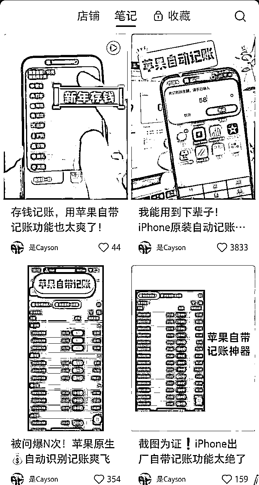
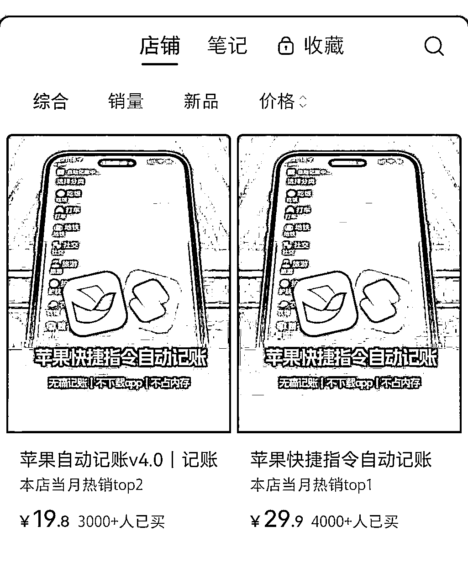
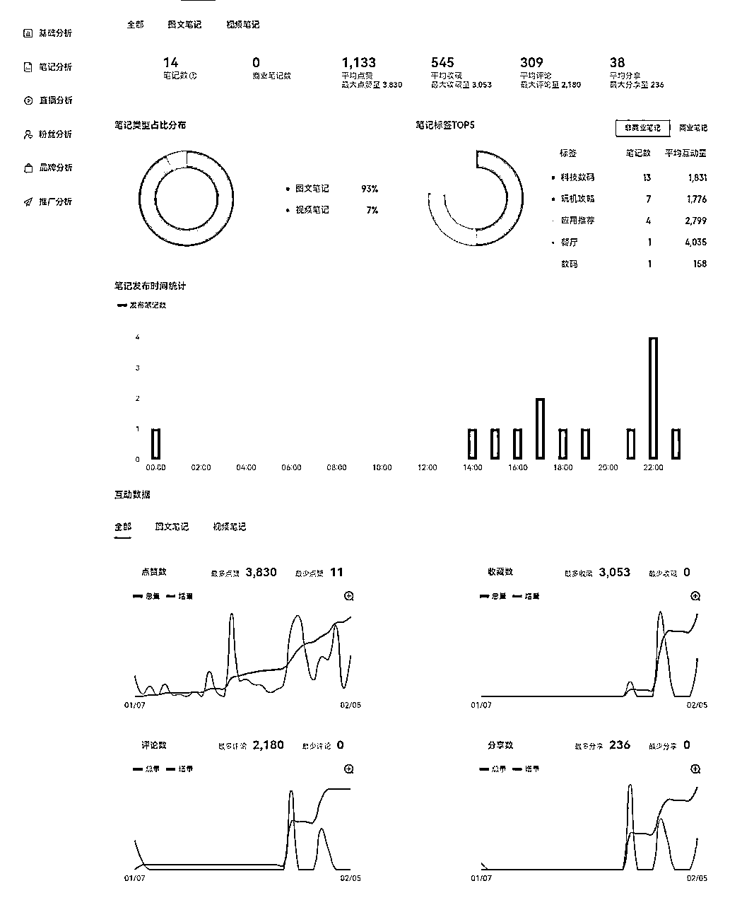
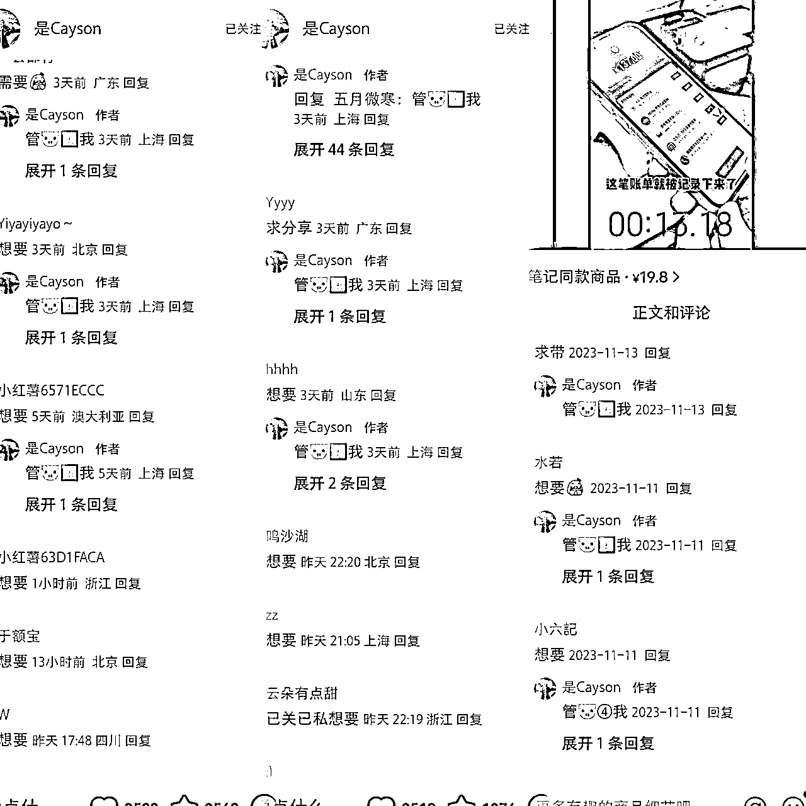
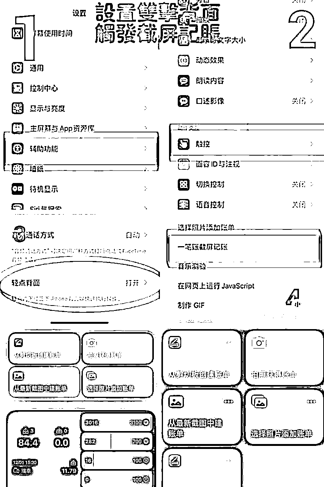

# 风向标项目拆解：会偷懒就能赚钱 一个自动记账快捷指令是怎么变现的 ？

> 来源：[https://daln6hnloj1.feishu.cn/docx/FO9odYLuIoLJO8xDu0dcxEuxn6e](https://daln6hnloj1.feishu.cn/docx/FO9odYLuIoLJO8xDu0dcxEuxn6e)

# 前言

大家好，我是袁圆。最近有幸参加了风向标第三期活动，我拆解的风向标项目是：会偷懒就能赚钱 一个自动记账快捷指令是怎么变现的 ？

自动记账算是小众赛道，但是随着经济下行的现状，越来越多的人开始有理财、了解个人收支和消费习惯。于是对于记账，尤其是更快捷的自动记账需求渐长。新年期间，红包、人情往来也促进了自动记账的销售额。新手小白第一次拆解，分析不到位之处还请各位大佬多多交流指正。

本篇拆解大纲如下：

# 一、项目介绍

小红书自动记账类型主要分为两类，一类是以推广APP为主；另外一类是苹果手机自带的快捷指令+飞书多维表格，通过轻点手机背部两下这个快捷指令，简化记账过程。

该项目主要是满足了很多人既要简单易上手，又能快速解决记账不能坚持的痛点。

# 二、案例分析

平 台：小红书

店铺名称： 是cayson

粉丝数： 1.7W

赞藏数： 12.3W

笔记总数：46

店铺销量：18.8W

产品是什么：店内只有两款在售商品，下图是在售商品截图：

# 三、流量运营

账号“是 cayson”的店创建于2023年11月5日，截至到2月5号，总共发布了46篇笔记。以图文笔记为主，占比（93%），虽然发布的笔记量不多，但是点赞收藏量达2000+的笔记就有17篇。笔记爆的原因分析如下：

图文笔记分析：每一篇笔记发4-5张图片，展示记账界面、轻敲背面、自动记账弹出页面、同步记账和月账单5张图片。清楚的交待了记账的快捷和便利。

视频笔记分析：以到店扫码付费为背景，通过人声讲述+手动操作自动记账的步骤和细节。并配上秒数。突出记账的快捷。

评论区： 评论区留钩子，如：需要快捷指令教程，扣想要； 管猪4我；，进群以内购价格购买

# 四、产品怎么解决？

产品是苹果快捷指令加飞书多维表格的组合 ，抖音和小红书有很多免费的教程可以实现。店主主要是卖自己的模板和整个设置流程服务 。为那些对手机功能使用不熟悉，和嫌麻烦的红薯们解决安装过程中遇到的问题。

# 五、利润怎么核算

该账号以小红书为主阵地，抖音也同时发布笔记。但是小红书取得的成绩明显要比抖音的要好很多 。19.8元的国外版本销售3211份，21.9元的国内版本卖了4181份。在4个月内赚了15万+。利润非常可观。

由于自动记账是以手机自带的快捷指令和飞书操作完成， 除了开店铺需要1000元押金和售后指导外，成本几乎没有。

# 六、项目如何做&如何放大

首先， 该账号同时做小红书和抖音，但是抖音的销量和点赞数据却差强人意，想要做大，首先要找到精准人群，小红书的高质量女性就非常适合。加以精简生活、大女主的生活理念。

自动记账目前小红书做的还不多，但是市场有需求，而且笔记的要求并不高，新手小白也可以模仿操作。还可以通过做矩阵账号，多账号齐发。毕竟该项目的复购率不高，就看大家的执行力了。

其次，通过观察，基本每一个做自动记账的群每天都会有挺多咨询和购买的，可以引流到私域，根据群体的特点售卖与手机相关的产品。