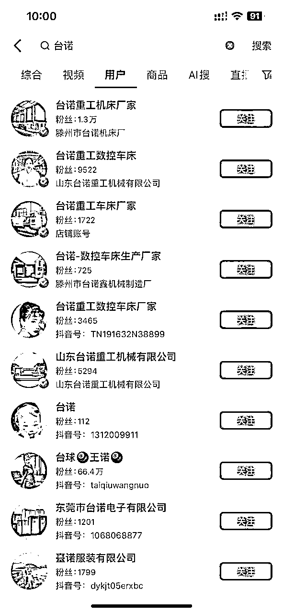
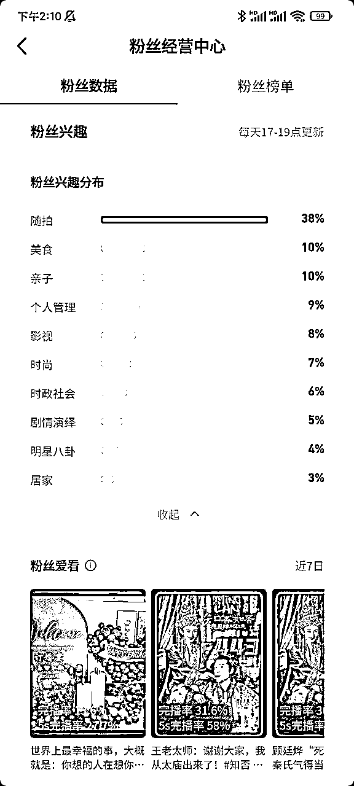
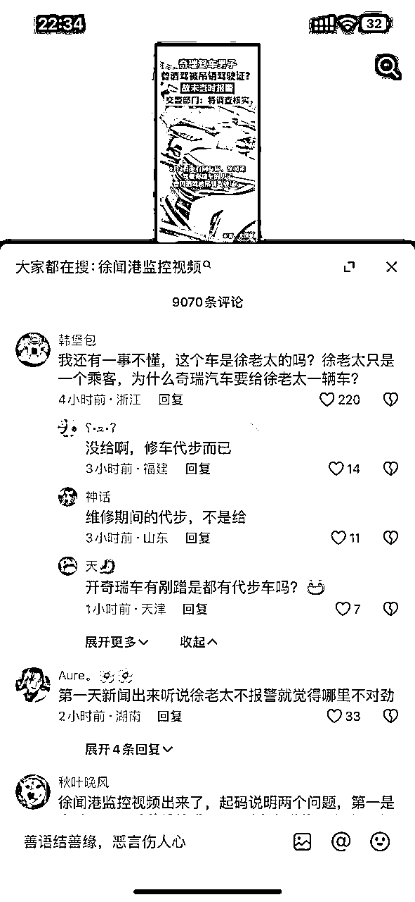
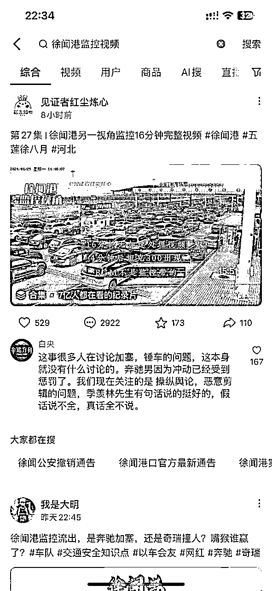

# 风向标拆解第 3 期-传统制造业如何通过抖音矩阵化+SEO优化获客-纳兰乘风

> 来源：[https://p0vyv4d0mv3.feishu.cn/docx/DwjTdMdvwocmloxf9jgcVh10npd](https://p0vyv4d0mv3.feishu.cn/docx/DwjTdMdvwocmloxf9jgcVh10npd)

## 项目介绍

#### 传统制造业抖音概况

经过几天的搜索发现很少有传统制造行业在抖音进行矩阵化推广和SEO优化，反过来说，就算现在才入局抖音，仍然有很大的机会拿到反馈。

#### 抖音矩阵和抖音SEO的获客潜力

这6个矩阵号的机床车床生产厂家，23年销售额2.8亿，而且看各个账号发布的视频，没发现有SEO优化的痕迹，所以应该还有很大的提升空间

## 项目难点

### 理解抖音账号及视频的搜索排名规则

#### 影响账号搜索排名的因素

昵称：带有行业属性，蓝V，黄V会靠前（例如XX婚礼，XX中式策划，XX主持人，认证后排名会靠前）

账号标签：主页作品跟垂直领域关联性是否足够紧密（例如我做婚庆，账号主页分享婚礼案例和婚礼现场故事）

粉丝属性：粉丝中兴趣标签跟关键词相关的人数有多少，占比越多的排名越靠前（不按照粉丝体量排名）假如你是美食账号，那么你的粉丝属性中兴趣标签里面美食占比，就要比其他兴趣分布占比要高，才能排到靠前位置。如何查看粉丝兴趣标签：抖音创作者中心—粉丝数据—粉丝中心，查看更多。

IP地域：优先搜索到本地的账号（例如我的IP是成都，搜索成都婚礼，我的账号会靠前）

他人推荐：你的产品好，被他人发布作品推荐后，账号的搜索量会高于作品搜索量（找KOL，KOC发软广合作就有助于做抖音SEO搜索）

#### 影响抖音视频/图片的搜索排名的因素：

话题：带#字的关键词，系统识别作品的第一个标签

标题：嵌入关键词，与作品有关联，符合用户的搜索习惯（例如我的账号标题里面就会经常带婚礼，或者成都婚礼）

文案：作品上传后，AI算法抽取6帧来识别，前6帧的字幕或者就要加入关键词。

评价：系统抓取评论的关键词来调整推流方向，甚至是作品标签，在评论区引导用户把关键词打出来，有利于提高搜索权重。

封面：封面标题帮助系统识别，醒目的标题能够提高搜索用户的进入率

排名引用自圈友@越檀《如何做好婚庆账号SEO，做到月获客300+高净值客户》

## 项目落地

#### 抖音矩阵账号的搭建

由于1个营业执照只能认证2个蓝V，根据影响搜索排名的因素，建议多注册几个营业执照，以提高矩阵效果。同时每个账号的昵称，头像，背景图片等内容也做好统一的规划。

#### SEO关键词的选择、优化及对应视频或图文内容的创作

SEO关键词的布局，可以从以下几个方向选择

1.泛词：行业词、类目词

2.精准词：冷门产品词、产品组合词

3.热点词：行业热词、抖音热榜、抖音热点宝

4.品牌词：竞品词

SEO关键词相关的视频和图文内容制作：可以搜索之后，点击排名靠前的视频，然后看评论区是否有“大家都在搜：xxxxx” 这种超链接，如果有的话，可以点击进行二次搜索，然后看排名靠前的视频，有没有解答用户的疑惑，如果没有解答，或者你感觉可以比目前排名靠前的视频回答的更好，那就按照当前这个问题制作相关视频或图片内容，大概率你的作品排名会很靠前。例如下面的例子：

