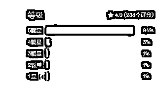
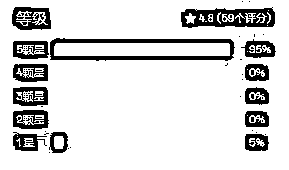
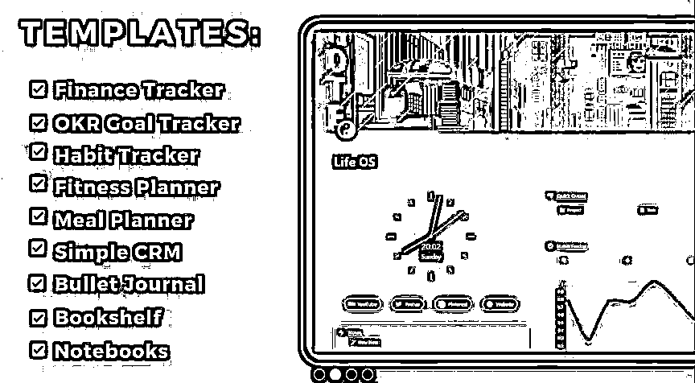
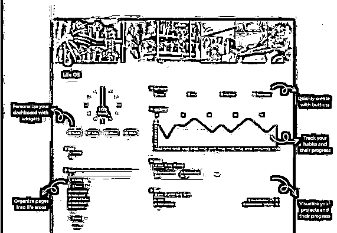
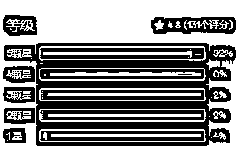

# 风向标拆解第3期-机会9-枫

> 来源：[https://qf8xr66n0a.feishu.cn/docx/Dy9SdXTDaoKYLmxWY4Gcrk0QnEf](https://qf8xr66n0a.feishu.cn/docx/Dy9SdXTDaoKYLmxWY4Gcrk0QnEf)

# 卖notion模板可以收入17w美元？

## 什么是notion?

想象一下，你把谷歌硬盘，谷歌表格，谷歌文档和所有其他谷歌应用程序放在一个在线页面，在国内可以把谷歌网盘换做百度、夸克网盘，谷歌表格、文档换做wps文档、表格。

这些概念通常被称为“生产力的乐高”，它就像一盒乐高积木。

您可以通过简单的拖放来构建任何类型的系统、设置或文档而无需编程经验。不需要技术知识。

### 人群基数大

如今，这种概念在全球拥有超过4,000万用户。

这意味着你有一个4000万人基数的市场要服务。

而所有这些用户都有一个共同点：他们都需要并购买预建模板。

这就是你出现的地方，通过创建这些预先构建的模板，您将帮助那些没有时间或知识来自己做的人。

作为回报，他们会把钱给你。

这意味着你实际上将经营一个真正的企业...不像其他很多商业模式在现实中，这种商业模式是简单和诚实的:

你创造了一个好的产品，客户为这个产品付钱给你。这意味着你可以自豪地与朋友和家人分享你所做的事情而毫无羞耻。

### 单次创造，无限次售卖

您可以创建一个notion产品一次，然后永远出售它，而不需要:

实体店或地点

库存或产品库存

复杂的运输过程

## 一个卖了10w美刀的notion是什么样？

#### 使用了哪些工具/平台？花了多少钱？

*   Notion - 主要内容的承载软件 - 免费

*   - 设计工具 - 免费

*   - 图标网站 - 免费

*   Gumroad - 电商平台 - 手续费（只有你赚了钱它才收费）

#### 作者Easlo

Easlo是这个第二大脑模板背后的概念认证的创造者。

Easlo2年间已经售出了超过60万+概念模板，Easlo致力于帮助学生、创造者、企业家和任何介于两者之间的人提高他们的生产力，并利用理念简化他们的工作。

#### 模板内主要内容：

一体化仪表板

目标设定

项目与任务管理

知识库

引言和高调

阅读清单

每周回顾

包括教程和示例

终身访问更新

使用Circle上的专属社区

这个模板总共有238个评分，该模板分为79元的基础款和99元的标准款，按照购买商品评价比率1:3来算，基础款和标准款各一半来算的话，销售额就达到了惊人的6w美元，数据可能有很大的误差，因为各商品的评价比率不好估算，所以若是按照1:5的比率来计算，销售额就在10w美元左右。

### 打包/捆绑模板

Easlo还有打包模板，售价也是分两种，一种299美元，一种499美元，其介绍为：

您将无限制地访问最佳概念模板，用于生产力、工作、财务、健康等。同样按照商品评价比率1:3来算，基础款和标准款各一半来算，销售额也达到了7w美元，简直是就是妥妥的造富神器。

## 其他的notion模板案例

### 注重生活起居的（life os）

之前有人拆解过，如果是模板，会显得很廉价，谁也不会为模板买单，即使会，单价也不高。厉害的是，这位创作者把自己的经验、工作流、以及最佳实践整合在了一个模板里，并刻意把产品叫“操作系统”这样客户买的的就不是冰冷冷的模板，而是某个领域的“最佳实践”了。

所以后续有很多人可以把自己打造的模板命名为“系统”，这个就是量身制作的“生活起居系统”。

#### 主要内容包括：

财务追踪

OKR目标跟踪器

习惯追踪器

健身规划师

膳食计划员

简单的CRM子弹日志

书架笔记本

### 注重工作的的（business os）

## 我们能做什么？

国内的平台也在售卖模板，定制rpa，找到有需求的人，坚持更新，持续迭代。学会用平台放大自己的能量，小红书等平台上对于notion的接受度蛮高，相对于notion，也可以在其他办公协作平台制作相关的概念“系统”，最重要的是要持续，像其他人拆解的Janel，一开始在平台上提出os系统的概念也是无人问津，在坚持了6个月后才达到了该事业的爆发期。

所以，认准一件事情，去做吧，坚持下去，才会渐渐的看到效果，也许效果比预期还要高。

