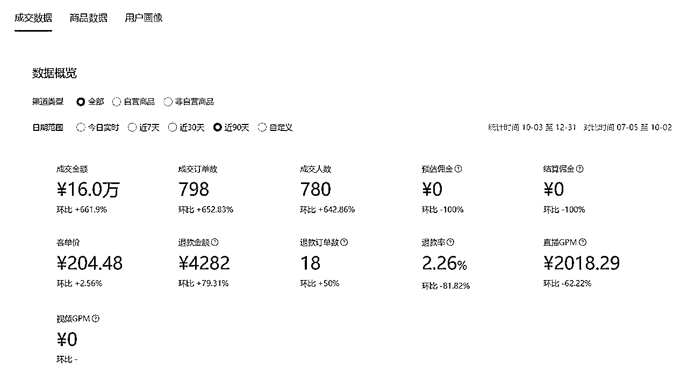

# 00后在视频号做AI知识付费，通过直播卖课，三个月卖了2000单，变现40w

> 来源：[https://rfgsytrye6.feishu.cn/docx/E0r2d5qOtopzvSxZ4kjctZ4dnzY](https://rfgsytrye6.feishu.cn/docx/E0r2d5qOtopzvSxZ4kjctZ4dnzY)

Hi，我是锦亿，刚好是00后在广州，2022年大学毕业，在视频号做AI知识付费，通过直播卖课，短短一个星期就开始变现，在10月到12月这三个月卖199的AI入门课程，三个月卖了2000单，变现40w。如图：

如果你想在视频号上想通过直播卖课变现，如何快速进入到一个类目进行变现，想了解如何快速制作出一门课程，这篇文章相信能给大家提供很多思路。

下面给大家带来非常详细完整的复盘，从选项目——找对标模仿学习——细节迭代优化，跟大家详细分享我是如何卖到2000单课程的，希望对你有所帮助~

# 一、我是如何找到AI知识付费项目的？

今年的关键词AI在我的生活中被反复提起。

### 1、学员反馈

在做AI之前我是做美术赛道的知识付费，卖工具加卖课程，课程的学员在学画的过程反复跟我提起AI绘画这个关键词，且在我做美术时发现同行的直播间反复用到了AI关键词吸引家长。

### 2、朋友圈、公众号、聊天社群

微信上的信息重复提起AI的关键词，在朋友圈、公众号、聊天社群、各大短视频平台和各大博主（曹大的知识星球信息），基本可以明确AI是一次重大变革，加上自己好奇心主动搜索相关知识学习，也在第一时间在电脑上安装了Chatgpt学习体验，但直到九月份，我依旧是在做美术直播。

### 3、项目放弃时偶然刷到卖AI课直播间

美术知识付费这个项目终于决定放弃，需要寻找新方向，我印象最深刻的就是在九月份刷到各大博主的直播间，一场直播卖AI课500单，刷新了我的认知！

随后立马深入研究，寻找更多同行，发现各大博主都在抖音上卖AI课，大博主每天能卖1000单199，一天20w。已经累积数万单，这个数据是我在直播中很少见到过的，这让我断定这个是天花板很高的项目，至少比美术赛道高得多的多！

### 4、观察多个平台对AI的需求

除了观察抖音，观察视频号和小红书同样重要，发现小红书没有卖的很好的案例。而视频号有很多小博主卖的非常好，一天两场直播，能出300单。也有刚在视频号做不久的博主同样卖的很好，三个月累积有3000单。

这时候我已经可以确定要做AI知识付费这个项目了，为什么我能够做呢？我体验过chatgpt，发现用起来并不难，还有像这些之前没接触过AI，以前是卖短视频课的博主，都能够来卖AI课，门槛肯定不高，也就是60分的人教别人做到20分的事情。

而且我看到各大博主的直播，看到直播卖课的核心本质是，不在于你使用AI做多厉害的事情出来，而是靠嘴去塑造AI的价值和自己的人设。这个对我做过美术类目知识付费来说，逻辑上是一样的，所以我是一定能做的。

那选择在抖音做还是视频号呢？我的答案非常坚决，一定是视频号！首先我做过美术项目，深刻知道视频号卖课比抖音好卖一百倍，当时就是抖音卖不出去才被迫转到视频号，才起死回生。

视频号用户大多都是宝妈和中老年群体，很单纯很干净，没有被直播电商洗礼过，成交难度非常小，其次是视频号的用户群体非常包容，只要你敢表现自己，就能有流量，特别是真人出境，你照着直播稿子没有感情地念都能够卖出课程。

在抖音，即使你有大流量，大付费，有成熟的主播经验，你都不一定能卖的动课程，目前大多数卖课都是公域流量转私域进行成交。

举一个抖音和视频号的账号案例，我发现很多博主在抖音拍AI视频火了，有巨大流量，即使开直播，直播间也是寥寥几人，根本卖不动，那些上百人AI卖课直播间，大多数是付费投流出来。

而视频号只要你视频有流量，攒预约开播，随便卖就是几十单，丝毫不夸张。

所以视频号就是红利，就是属于小白的机会，我毫不犹豫选择视频号，而且做的视频也没有同步到其他平台。选好了赛道后，第一件事就是快速找对标账号像素级别模仿。

找对标是一项及其重要的能力，好的对标能让你思路清晰，知道该做什么，往哪个方向去走。而且不是找一个就够了，是需要找多个账号，多个维度去模仿才能够保证你做的好。

# 二、我是如何找对标账号的？

像知识付费这类型的项目，我需要找课程对标，视频素材对标，直播对标。

如果你只模仿一个人，那大概率是做不好的。

就像我看到很多同行只模仿头部主播。有一个算一个，没有哪个做的非常好的。主要有两个原因，第一个大博主是积累了很久的IP势能，小白很难模仿。第二个，他们的流量大多来自付费，没钱很难跑通。

所以小白刚入场，该怎么找对标模仿呢？我的做法是，找AI行业的大中小博主，各个平台各个板块进行拆分模仿学习。

分成课程对标（交付）——视频素材对标（流量）——直播对标（转化）三个板块进行独立模仿，而这些对标学习，我是建立在低成本创业的理念上同时去进行的。

## 1、课程对标（交付）：

首先去买各大博主的AI课进行学习，自己先统一看一遍，结合各大博主课程，整理课程目录。

用飞书妙计转写文字稿，做PPT，用直播伴侣录课，因为自己做过老师，讲课这块很擅长，把流程优化好，从开始到结束仅用了五天就把初版课程上架了。

而且一定要注意一个误区就是，不要等你把课程出完的时候再开始卖！不要等你觉得课程能卖的时候才开始卖！你要做的就是边修窗户边补轮胎，项目初期的录课是件极其消耗心力和没有正反馈的事情。

先把初版上架，有爆发的迹象再持续更新都是可以的，对用户来说，持续更新也是一个重要交付！如果等到你出完课再开始卖，黄花菜都凉了。

交付过程我遇到最困难的问题是AI工具怎么能持续提供给用户，我不懂研发，甚至可以说AI我都是现学现用的，在学习课程中你会发现大博主是自研AI工具，我也问了自研的成本，套壳2w，每月还有维护费用，对我而言，这个方案绝对是否掉的。

刚开始低成本创业绝对是最重要的，一开始就担负过多的压力，只会影响你的发挥，主要是2w对于那时的我来说，就是巨额成本。

这时候就不能看大博主的交付，而是看中小博主是怎么做交付的，发现很简单，国内有免费的AI工具，文心一言、讯飞星火和度加剪辑，在课程详细指引用户下载就能让用户使用上AI工具，本质上就是信息差，但是也给我省下了巨额成本。

有和没有自研AI工具根本不重要，在直播卖课时把话术改一改，效果是相同的，但是你的成本会增加上万元。

而我选择的是轻交付，只有一门199课程，学员拍完课程加微信，是我本人一对一进行指导，更加让学员安心拍课。这里别担心自己一对一指导会花费你很多时间，99%的问题学员看课就可以解决，有很少问题产生.

我会每天固定三个时间段统一回复问题，即使现在有2000名学员，每天的一对一答疑总共花费半小时搞定。

交付轻，就可以把重心放在获取流量和直播转化上，搞流量，搞成交，搞利润。

课程解决后就到了核心关键问题，流量怎么来？

## 2、视频素材对标（流量）

我认为知识付费这个赛道，不管你是付费还是投流，视频素材一定是最核心的点，没有素材就等于没有流量。想投流也很难投出去。而我获取流量的核心也只有一个，找对标，像素级模仿，永远不要自己造轮子。

AI在三月份已经在短视频爆发，市面上很多火过的文案已经被验证过了，到十月份开始做的时候，已经有大量素材可以模仿抄袭。

我要做的就是把各大平台关于AI文案全部扒下来，只要有超过一千点赞的，有一个算一个，扒下来自己真人出境口播，抖音的文案素材用轻抖小程序转写文案，视频号的视频用录屏录下来用轻抖小程序识别文案，一天拍十几条视频。

前期全部都是自己去出租屋旁边的河道拍摄，回来自己剪辑，四十分钟剪一条，一天三条素材产出，基础的流量有了。

如果可以真人出镜，一定要真人出境口播，这个是为直播转化做铺垫，真人出境的转化绝对是非常高的，不要担心自己表现力弱，都是训练出来的。当你拍了上百条素材后，面对镜头的你一定很自然。

对视频号而言，面对中老年群体，我认为不需要很专业的拍摄技巧，反倒是越接地气越好。我前期所有视频都是用苹果11前置摄像头拍摄，在剪映打开提词器直接怼脸拍。

讲话的语速一定要慢一些，想要自然的拍摄可以搭配手势和眼神不要一直盯着屏幕即可，总得来说，先拍，只要你照着稿子读完，你的视频就会有流量，因为你的素材内容都是火过的，也不用担心抄袭，一字不漏的读都是你自己的原创。

拒绝花里胡哨的剪辑和高大上的拍摄场景，一定要简单明了，说话语速慢，视频声音大，字体大，素材清晰，不需要所谓的转场、文字音效和重点文字变色等等。因为你会发现在抖音火的AI视频在视频号有很多火不起来，原因就是中老年人不爱看。

一定要坚持拍摄素材，不断优化拍摄和剪辑技巧，直到现在我每天都花一个小时用来刷视频寻找素材，没有素材就等于没有流量，就算你付费也是没有。

对于我这样的新手小白，最好的方式就是拍素材，获取自然流。

同时把直播预约打开，非常重要！！！直播预约就是用户在看你视频的时候视频下方会有预约条，如果对你视频感兴趣都会通过预约直播来听，开播时用户会收到微信的直播通知提醒，一般是50%左右的预约进入率。黄金时间是晚上七点半到九点。

PS:直播的时候所发的视频就不会出现预约条，视频会出现直播入口引导用户进入。

前期的预约可以放到三到五天后，每天三条素材，即使是基础的播放量也能够攒到预约进行开播，如果视频爆了就可以临时加一条预约在今天，预约的积攒是可以撬动直播推荐，也可以让你在直播卖课第一波有足够多的听众供你成交，我自己卖课最主要的成交都是在第一波。

前期我先是运营一个账号，每天发三条素材，两天开播一次，在视频不火的情况下，我其中一场直播总共202人看过，但是那天我照着稿子读出了4单199课程。如图：

这个时候我非常惊叹，这就是趋势的魅力吗！相比于之前美术类目的直播，一天播三场，卖课就是难如登天，视频号上万场观卖不出去一单课都很常见，也验证了我的想法，选择大于努力，同样的努力程度在不同类目的选择结果是完全不同的。

## 3、直播对标（转化）

那我是怎么做到如此高的转化，平均50个人来看过，就有1个人下单，在我前期的直播中，大多数都是这个比例。接下来跟大家分享我的直播转化流程。

想要直播有个好的转化，需要了解你的成交群体是哪个年龄阶段和身份的人，对症下药。

比如我做的AI知识付费，我的群体绝大多数是中老年群体，50岁以上，有钱又有时间的人群，对新事物感到好奇。所以直播话术内容要往这类群体的需求去设计。

以抄为主，第一步是把直播话术稿子整理出来。首先蹲守录屏各大博主的直播间，反复听，以头部博主的话术为主，分析他们的话术结构是如何进行成交的.

一定是多个主播，多份话术相结合，不要一昧全盘抄写，结合视频号的调性，整理出一份话术。包含：实操讲解，课程钩子，憋单话术，逼单话术。

比如A博主直播话术以讲解为主，基本不实操，但成交部分的话术做的非常好，我在成交部分全盘抄写。

而B博主注重实操，对于中老年人特别适用，有实操可以直观感受AI的强大，但他的实操内容主要针对年轻人、打工者群体为主的案例，比如写表格做ppt，对老年人不适用，但可以借鉴思路进行修改。

最后我结合视频号中层博主的实操案例话术，做健康问题的演示，做风景视频的实操，成交以A博主话术为主，拼凑成一份成交率极高的话术稿子，字数共12000字，读完需要40分钟。

12000字的稿子初期可以照读，就能够出单，但最主要就是背下来，以理解为主全部背完，你就能够出演一场又一场的好戏了。

为什么说是一场好戏，因为我认为这类的直播，本质就是一场演出，你把台词背熟了，每句话对应的语气、动作和眼神排练好。在直播的时候就是现场表演，而且每场直播都是这个表演，一场直播表演3次，总共两小时。公屏的互动回答交给运营，你只管表演即可。

直播形象的打扮，由于我是00后，上镜显得稚嫩，所以我在形象上稍加打扮，梳大背头，带金丝边框眼镜，穿黑色西装衬衫，西装衬衫夏天穿短袖，冬天穿长袖，每条买了四件，固定穿搭。背景直接在网上买了背景贴纸，书房背景，没什么讲究，直接就开干了，到现在还是这个形象。

只要有流量，咔咔出单，我用这个话术逻辑框架最高峰在10月31号连续播6个小时，两个号视频都爆了，小号单场直播出104单，大号直播2小时43单，一天8个小时，一天买了近150单199课程。后面还有多场直播过万，朋友圈特此记录了一下。

由于有前面的直播练习积累，视频火了后，能够非常好的打开直播接住流量进行转化，尝试到了一举出大单的滋味，而这一些流程的打通，全靠自己一个人摸索借鉴，在直播时配备一个运营，两个人就这么搞起来了。

这时候我刷到了之前关注视频号的ip博主拍摄情感账号的视频，发现有多个矩阵号，多场直播可以同时开，素材稍微变化一下，多个账号同时发都有流量，这让我坚定了做矩阵的想法，要知道，单个账号的价值非常有限，流量累积需要时间，需要概率。

简单算个概率就清楚了，如果一个账号一天发三条视频，在没有火的情况下，每条视频1000播放，积攒两天的预约就可以开播一场，那如果两个账号都这么发，那就可以每天直播，每天都有收益了，而且火的几率翻了多倍，以此类推。正是这个决定，为我带来了巨大的效益。

直接又注册一个新号，每个号一天怼三条视频，早中晚雷打不动发布视频。结果就是，新号在一个星期后一条视频爆了20w播放，视频带来的流量非常精准，中午起来直接开播，一场直播干了六个小时，直播话术循环播放十次，104单，也是目前单场最高的记录。老号在这一天也同时爆了，错峰预约，在当天播完六小时，稍微休息后，继续播老号，又干了43单，一天就干了差不多3w营业额。十月份就做到了8w的营业额，约等于利润。

为什么这次疯了一样能一场干六个小时？而且这六个小时不是摸鱼的直播，知识付费直播是需要保持亢奋的情绪带动成交，期间不休息，不上厕所，偶尔趁展示的时候30秒空闲时间塞些面包和水，保持亢奋干了六小时。

原因就是受到同行出单的刺激。在视频爆前的一两天，好几个同行都是一场直播100单，200多单，也是视频火了立马开播，不需要预约，视频就能够把人引入直播间，而且是源源不断的。理解到这一底层逻辑后，明白只要视频火了，就可以开播，而且能播到流量耗完为止。

还有一个原因是大家都是一起做的，我为什么不行，我不服！

一直憋着一股劲，正是因为这股劲，中午刚睡起来没吃饭，打开手机看见视频爆了3w播放，毫不犹豫开播，没想过能出多少单，就是不服，没想到每一次循环直播话术都能够出单，一直循环说了10次，破百单！目标达成，憋的一股劲泄下了。

我是特别感谢同行的，要不是同行视频爆单让我发现这个规律，我也不会有一场直播百单的出现。除了这一次，到现在都没有当时的勇气再播六个小时，现在播三个小时心力就耗完了。

这个时候，明显感受到自己的精力时间不够用，在视频火的时候我需要直播，那就顾及不到视频素材的产出。

我自己需要做的事情非常多，找素材、拍摄、剪辑、客服和直播基本全部事情都是我自己在做，一个人运营两个号非常极限，加上后面还有更多矩阵，所以当下最重要的就是招剪辑帮我分担视频工作量，保证每天有素材产生的同时，能让我把重心放在获取流量和直播上。

这里分享一下像我这样的个体招人的心得：

招人要求很简单，做过剪辑和为人坦诚就好了，工资管够。

一、有经验，不用培养剪辑技巧，我优化好剪辑流程和要求，让剪辑的员工上来就能够做，剪辑员工只需要注重剪辑，其他事情都不用做，每天六小时来到工位后高效产出，做完下班。

二、为人真诚，不绕弯不矫情，我自己招人一定是先看人品再看能力，有事说事，你对视频有好的想法及时提，用案例来说服我。我有要求也会及时提出，用案例来说服你，你觉得工资低了做的不开心及时说，一起看你的视频产出价值来定义。

跟这样的人沟通交流是非常高效的，做事利落，这是我在看一本名为《不拘一格：网飞的自由与工作责任法》学到的，还有很多方法，也推荐大家看看，真诚是最好的沟通方式。

# 三、售后问题

做知识付费行业，售后是一个关键点，你不可能永远拒绝用户退货，会导致平台客服介入，售后纠纷率过高。

在11月底，平台直接下达一条消息，老号的店铺永封，资金冻结一个月，账号永久无法进行带货。没有任何提醒，直接是永封，而且官方一旦判定等于是无法申诉回来的，这对我来说，是这个项目遇到的一个小挫折。

刚好封禁的这天，老号的一条精准视频爆了200多w播放，眼睁睁看着流量流失而无法变现，按照以往经验来看，这条视频最低能够出500单以上的199课程。

对于这类情况，放在以前，我可能要好几天吃不下饭了，但是我的状态没有受到影响，只是感到惋惜，因为我知道，我有能力再造出许多个一模一样的号出来，还有其他号兜底，反倒是提前遇到是一件好事，需要及时调整。

1、明确是由于拒绝售后过多导致的纠纷率高才会被永封，所以需要把售后控制退货比例，该退的退，该协商的进行协商，而不要因为捡了芝麻丢了西瓜。

2、重新起号，起多个号，用来对冲平台的规则变化带来的风险。

3、最后是仔细研究平台规则，避免再犯错误。

策略执行下去后，一个星期时间，每天单个号三条视频，很快我的新号变成了大号，一举超过了被封的老号，其他的新号也开始起来，现在只要直播，就能够出单。

就这样，搭建好流程，每天发视频，搜集素材，拍视频和直播，视频交给剪辑做。每天重复这些动作，三个月时间矩阵号一共卖了2000单，变现40w。

自己作为创始人，所有流程都需要自己亲自跑通，在未来半年会继续放大这个项目，复制这套逻辑和打法，做到10000单。方法很明确：找合作伙伴放大项目；持续做多个矩阵号；寻找合适的出境ip合作，复制多个我。

# 四、结尾

回想起刚毕业那会没想好要去做什么，大学本科期间做过非常多的0-1，始终找不到方向，拿不到结果，毕业找工作那会面试过销售岗位，拿到过一些offer，但实习了一会发现不合适做销售。

开始自我怀疑，听了家人的话去考个稳定的教师编制，最好的结果是进终面了，表现的非常好，但结果是成绩按学历排名，最后随便找了个职校临聘老师做过渡。

但我一直认为，生活需要向上的希望和可能，才能对未来有所期待。

闲不下来的我还是趁着在学校暑期时间，在2022年8月底找项目，探寻生活向上的可能，找到了美术直播的赛道，是自己擅长的，也有着明确的对标学习，花了300块把直播所用的东西买回来，埋头开干，雷打不动每天坚持直播，每天都需要花两小时。

那时候啥都不懂，所谓的直播场景搭建，话术框架，流量逻辑都不会，现在回看之前的视频和直播，光都没怎么打，画面都是黑乎乎的，傻傻的坚持了半年，最高峰干到一万人在线，半年总共变现1000块。

但是非常开心，发现自己摸到了生活向上的可能。所以每场直播只要能卖出一单工具，就开心的不得了，感慨今天的猪脚饭又有着落了。

在2023年迎来一次转变，二月份开学前，学校临时通知我不用去上课了，我也被迫把美术直播从兼职转到全职，全力all in，先是主动找到符合自己的小公司团队，学习完整的直播链路和短视频逻辑，一个星期时间从早到晚的学习，实操，终于学到一定的知识。

由于还处在团队磨合期，每天需要坐地铁从顺德到广州，来回就要四个小时，早上八点出发，晚上十二点回到家休息，虽然累可是非常充实啊！

而运气还是站在了我这里，顺手在视频号发了一个自己在抖音快手都火过上百万播放的视频。第一次发在视频号只有几个播放，不信邪，发了第二次，没想到直接火了，668w播放，在后面的三个月，光靠这个视频卖工具卖课就变现了5w利润，不多，是我真正意义上在直播获得结果。

没有经验，不懂开预约攒人数，在这三个月，在视频号同行中应该是是做到了最好，直播画面，话术都在被同行围观抄袭。

后面视频热度下降，不能够继续生产内容，不懂内容，即使做到了小类目中的最好，利润也只够生活费，在很长一段时间里每个月只有5000块，甚至更少。

所以才决定了转型做AI知识付费的项目。但回望过去的一年，轻舟已过万重山！只要还留在牌桌上，就有向上的希望和可能。

以上就是此次项目的完整复盘，如果在我的角度没有写全面的地方，大家还是想了解，可以找我探讨交流呀，知无不言，言无不尽！一起生财有术啊，我们下次见~