# 风向标拆解第 3 期--小红书高销量手作饰品都是怎样的运转逻辑--大雨

> 来源：[https://y8ua8lkzq5.feishu.cn/docx/EIYsdpCzao4XAaxxc9UcHHJgnsh](https://y8ua8lkzq5.feishu.cn/docx/EIYsdpCzao4XAaxxc9UcHHJgnsh)

# 1.前景概述

随着个性化和文化消费升级,手工饰品满足了消费者对非均质化产品的需求,拥有广阔的市场前景。盈利模式多样，可以通过电商销售、策划服务、教学培训等多种方式实现盈利,商业化变现路径清晰。技术门槛不高，部分手工饰品的技术学习门槛不高,容易上手。成本控制可行，小批量生产可以有效控制成本支出。用户粘性强，手工饰品富有情感价值,用户粘性和重复购买率高。小红书手工饰品创业具有广阔市场前景、多样盈利模式等优势,是值得推荐的创业方向。

在小红书上【手工】话题下的浏览量高达180.7亿，而【手工饰品】话题下的浏览量为2.7亿。

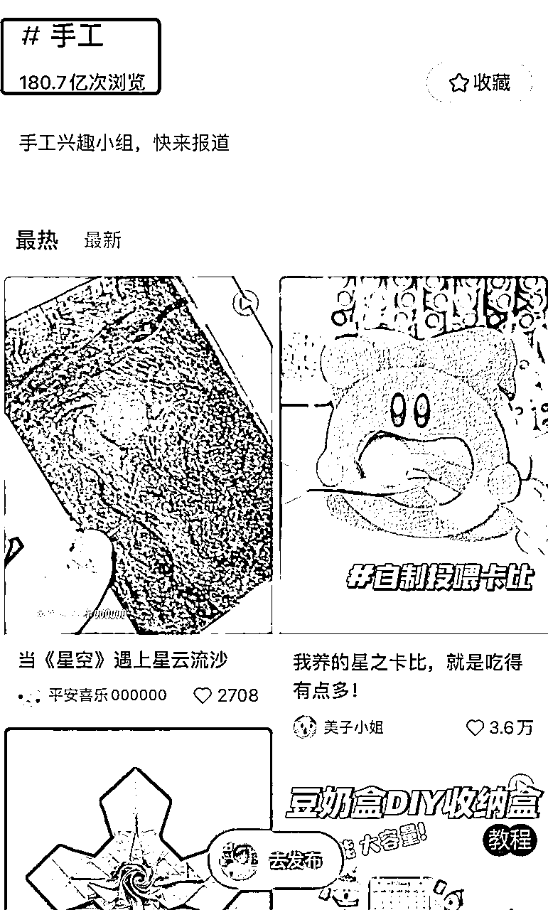

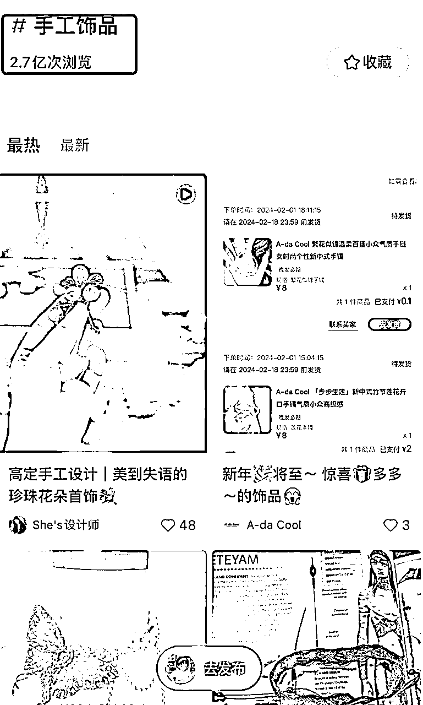

手工饰品完全依靠人工手艺制作完成,而非机器批量生产，具有独特性，强调个人化、独特性和考究的工艺,能够满足消费者对个性和质感的追求,是很受欢迎的饰品形式。和小红书用户群体相匹配，需求量很大。

## 小红书手工饰品项目适合的人群主要有:

1\. 有一定手工制作技能的人

有编织、钩织、串珠等手工制作技艺基础,可以独立完成产品制作。

2\. 对手工艺品设计感兴趣的人

对手工艺和设计领域感兴趣,有一定的审美和创意能力。

3\. 熟悉小红书的运营者

了解小红书的运营模式,知晓如何进行内容运营。

4\. 有一定文字和摄影能力的人

能够撰写产品文案,拍摄产品图片。

5\. 有一定美工编辑技能的人

可以对产品图片、视频进行后期编辑加工。

6\. 对电商和新媒体营销感兴趣的人

愿意学习新媒体电商转化的知识和技巧。

总体来说,有手工技能、新媒体运营基础,且具备一定创业精神和资源的人群比较适合这个项目。

# 2.如何在小红书上起号

## ①账号定位+首页装修

### 【账号定位】

手工饰品的分类非常的广，可以根据自己的兴趣和擅长的方向选择。

手工饰品可以分为以下几类：

1.  纸艺类：利用纸张折叠、剪切、雕刻等技巧制作的饰品，如折纸、剪纸、纸雕、纸浮雕等。

1.  布艺类：利用布料、丝带、蕾丝等材料缝制、编织、拼贴等技巧制作的饰品，如香包、钱包、手机包、布娃娃、布艺画等。

1.  编织类：利用钩针、棒针、梭子等工具，用毛线、棉线、丝线等材料编织出各种形状和图案的饰品，如毛衣、围巾、手套、帽子、挂毯等。

1.  珠串类：利用珠子、水晶、玉石、贝壳等材料，用金属线、丝线、皮绳等工具串联起来的饰品，如手链、项链、耳环、戒指、挂件等。

1.  彩绘类：利用颜料、油彩、水彩等颜色材料，在各种平面或立体的载体上绘制出各种图案和风景的饰品，如彩绘T恤、彩绘扇子、彩绘石头、彩绘葫芦等。

1.  绣艺类：利用针线、丝带、珠子等材料，在布料、纸张、皮革等载体上刺绣出各种花纹和图案的饰品，如十字绣、丝带绣、珠绣、刺绣画等。

1.  雕塑类：利用木头、石头、玉石、金属、陶瓷、玻璃、树根等材料，用刀、锯、锤、钻等工具雕刻出各种形象和造型的饰品，如木雕、石雕、玉雕、金属雕、玻璃雕塑等。

1.  漆艺类：利用漆料、油漆、沥粉等材料，在木头、金属、玻璃等载体上涂抹、刻画、腐蚀等技巧制作出各种图案和效果的饰品，如漆器、雕漆、磨漆、蛋壳画等。

1.  铁艺类：利用铁丝、铜丝、铝线等金属材料，用钳子、剪刀、锤子等工具弯曲、剪断、敲打等技巧制作出各种形状和图案的饰品，如铁丝手工、铜丝画、铝线花等。

确定好细分领域后，就需要对账号进行定位和包装了。

### 【账号名称】

在小红书上做手工饰品,昵称的取名可以从以下几个方面考虑:

1.  反映手工属性

例如“小溪手作坊”“椿木手工吧”“YY手织工作室”等,使用“手工”“手作”等词,突出手工特征。

1.  反映品牌个性

例如“糖朵手饰”“公主手工屋”“小碎花工房”等,使用描述品牌风格的词汇。

1.  使用名称命名法

例如“沫珂作坊”“Lily Handmade”“Hazel工坊”等,使用具有意义的名字,增加识记度。

1.  使用地域命名

例如“浙江杭州咏字巷手工坊”“成都悠悠手作”等,突出产地特色。

1.  使用数字及字母

例如“B12手工店”“YU56手作屋”等,简洁大方。

1.  反映设计元素

例如“木兰手作”“印花手绘”“枫木编织”等,突出设计风格。

1.  反映创始人

例如“杨小宝的手工世界”“Linda手作屋”等,增加亲切感。

1.  使用谐音词

例如“幸福旺旺手工”“小蜜蜂手作坊”等,增加趣味性。

整体来说,取一个简洁大方、能反映品牌属性,同时富有创造性的昵称,能让用户更记住你的品牌。

### 【账号头像】+【背景图】

在小红书上做手工饰品,账号的背景和头像是重要的品牌识别元素,可以考虑以下方法:

1.  背景图:

*   使用手工制作过程或工艺制品的图片,突出手工属性。

*   使用品牌logo或代表性产品图片。

*   与品牌风格相关的场景或元素照,如植物、旅行等。

*   变换不同季节、主题的背景图,增加新鲜感。

1.  头像:

*   品牌logo是最简单直接的选择。

*   也可以选用创始人/设计师的照片,增加亲切感。

*   代表性产品或工艺的近照也可以成为独特的头像。

*   根据不同季节、主题更换不同头像。

1.  整体风格:

*   背景和头像风格上需要统一、匹配,突出品牌特色。

*   色调明快,采用品牌主色调。

*   风格大方简洁,不要太杂乱。

*   留有空白,不要元素太杂。

总之,背景和头像在视觉上要突出手工和品牌特点,同时要考虑简洁与新颖的平衡。加强品牌识别度。

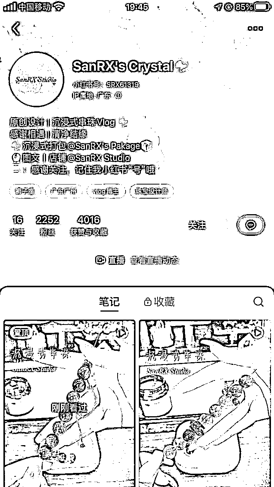

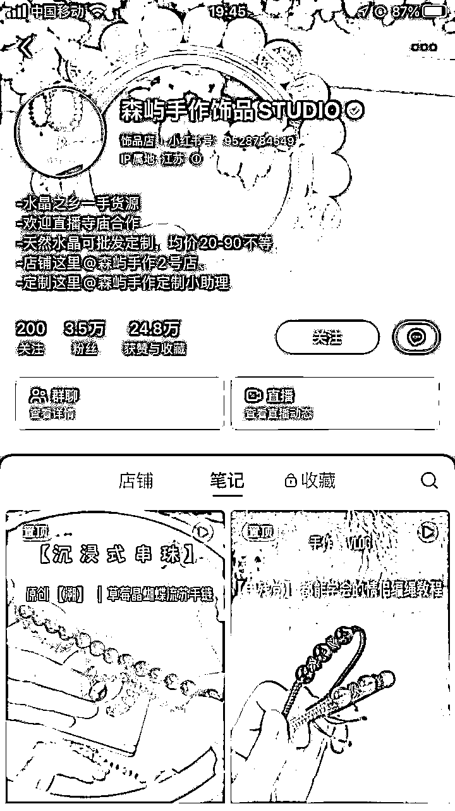

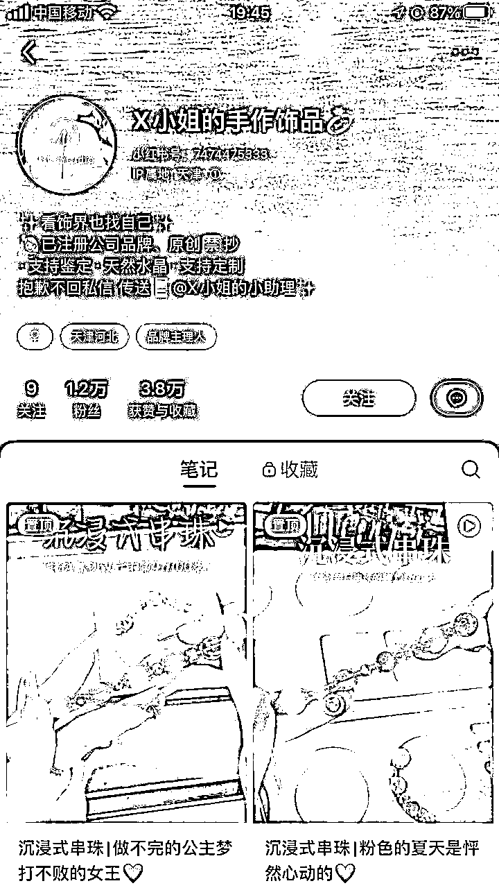

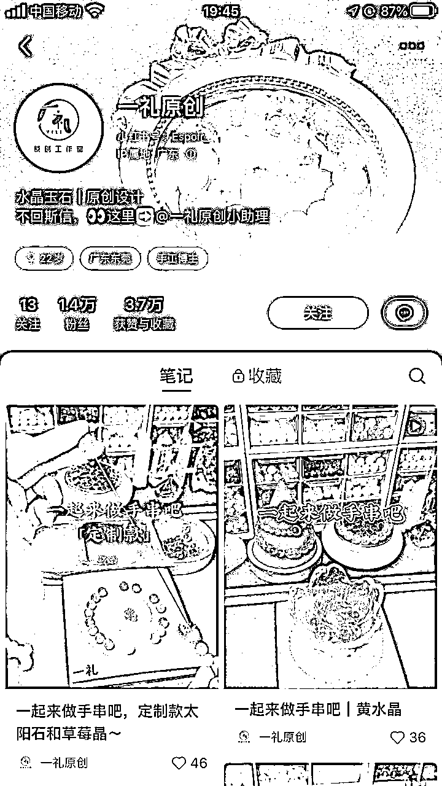

### 【个人简介】

小红书上做手工饰品的账号,可以从以下几个方面来写个人简介:

1.  介绍自己的手工匠人身份,昵称和真实姓名。

例如:“椿木匠人Ami的手工饰品屋”

1.  介绍经营的手工产品种类及风格特色。

例如:主营古典优雅风珠宝配饰,注重传统工艺和高品质原材料。

1.  突出自己的手工制作特长及经验。

例如:10年手工编织经验,擅长高难度编织工艺。

1.  介绍工作室文化,如致力回归手作、重视精益求精等。

例如:秉承祖传古法,与机器生产绝不妥协。

1.  表达对用户的服务宗旨。

例如:为每一位用户提供贴心订制,选择无忧。

1.  分享获奖情况或作品曝光情况,提高认可度。

例如:作品多次入选国际手工大赛,深受海内外顾客喜爱。

1.  提供 contact 联系方式。

example:联系我获取更多手作信息或订制你的专属配饰。

1.  字数控制在50-100字为宜。

总之,通过个人简介让用户对你的品牌及产品有整体印象,并提供联系方式促成业务转化。

## ②内容选题

确定好自己的细分领域后，找对标账号，模仿标题内容，以下是火过的内容：

## ③内容输出

内容有视频和图文两种形式。视频主要是展现手工饰品的做成过程，图文主要是展示成品。

## ④案例分享

接下来，我主要拆解几个手工饰品的账号，给大家参考。

# 3.如何在小红书上引流

在小红书上进行获客引流可以考虑以下几点:

1.  个人简介引流

把小红书ID设置成自己的微信号，在个人简介里放上联系自己的方式。

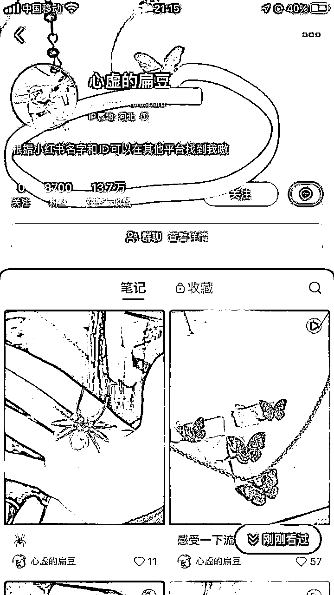

1.  开聚光投流

开聚光投流，会有“立刻咨询”的点击框，并可以在评论区引导。

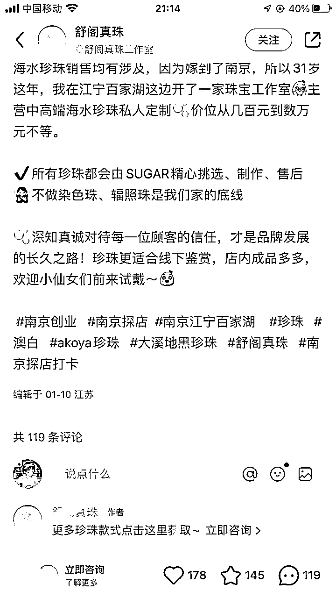

1.  小助手引流

在个人简介这里@自己的小号

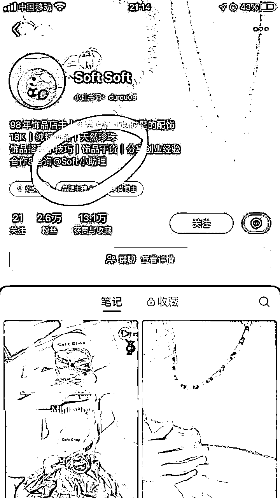

1.  直播引流

针对想做副业、创业的人群做公益讲解活动的直播。

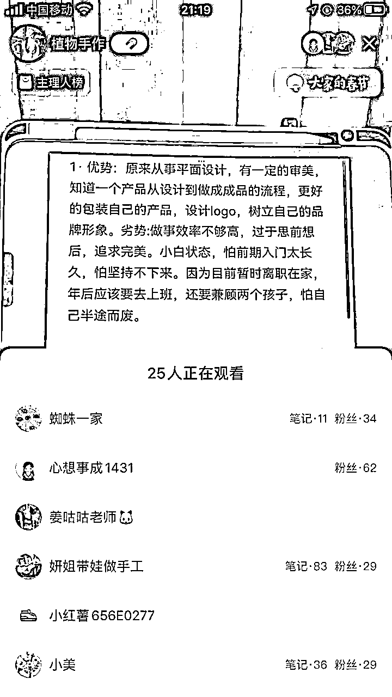

1.  公益课引流

做个低价1元购的创业工业课链接。

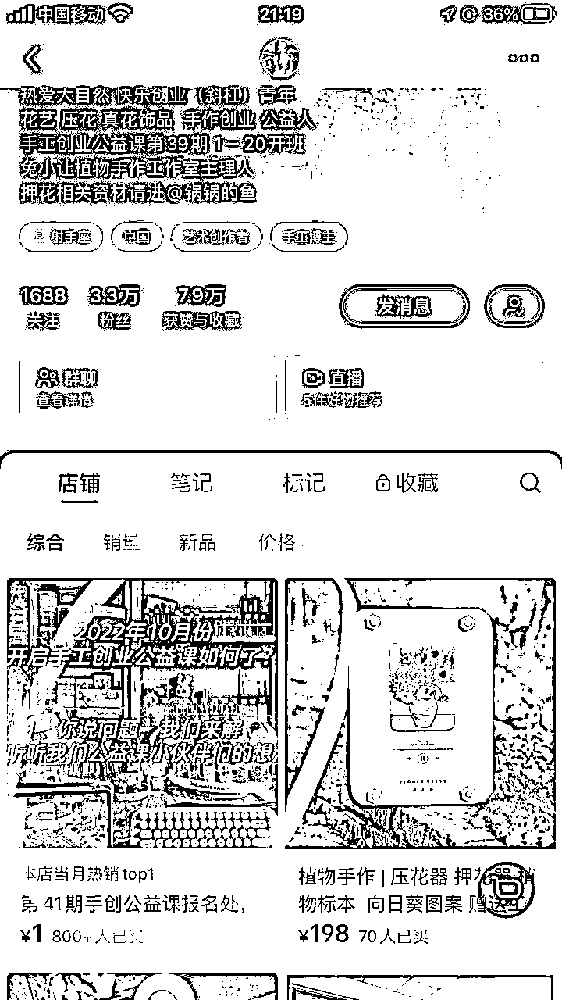

# 4.变现分析

## ①成本

最大的是时间成本，前期可以自己在B站找相关的教学视频学习，或者是报课学习，边实践边输出内容

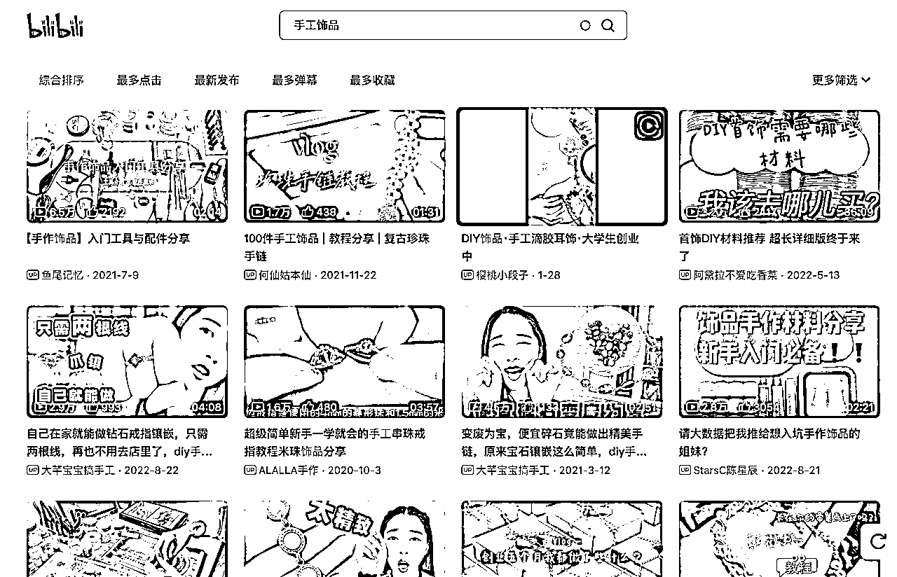

## ②变现方式：

1.  卖成品

*   在社交平台开店或进驻电商平台,直接售卖手工设计和制作的成品饰品

*   开设实体店,销售线下

*   参加各类展销活动及手工集市现场销售

1.  手工沙龙策划承接

*   为品牌或商家策划手工体验活动,DIY活动等

*   提供手工课程设计及教学服务

*   提供手工装饰设计服务,为商家提供创意策划服务

1.  手工饰品课线上线下教学

*   开设线上视频课程,教授手工技法

*   举办线下手工课程,教授编织、钩织等技艺

*   组织手工兴趣小组,开展定期手作交流活动

*   提供私人订制化的手工课程

1.  学员回单

*   鼓励学员在学成后在平台上开店售卖作品

*   提供销售支持,与学员品牌合作推广

*   从学员销售中抽成

1.  代理

*   推出自有品牌,采取代理模式扩大销售

*   招募线上或线下经销商,扩大产品覆盖面

*   提供产品、渠道、推广支持,与代理商实现共赢

# 5.注意事项

1.从产品创新角度讲，现在小红书各类细分领域的产品还蛮多的，需要有有竞争力和优势的产品。笔记图和产品要尽量保证一致，以免会有消费者的投诉。

2.从版权的角度讲，有的产品是有版权的，不能随意的抄袭和搬运图，以免原创作者的投诉。包括自己有设计出产品，也要保护自身知识产权,防止作品设计被抄袭。

3.从产品研发的角度来讲，手工饰品产品迭代周期相对较长,需要提前准备物料库存。

4.从产品的变现角度讲，粉丝数量和内容传播范围需要一个积累过程，借助网红或品牌合作可以快速获得流量红利，但要控制商业推广投放比例,保证内容的原创度。

5.从盈亏平衡周期，预估一个合理的达到销售盈亏平衡的时间节点，制定费用支出规划,控制投入风险，盈亏平衡后要持续优化运营,扩大利润率。