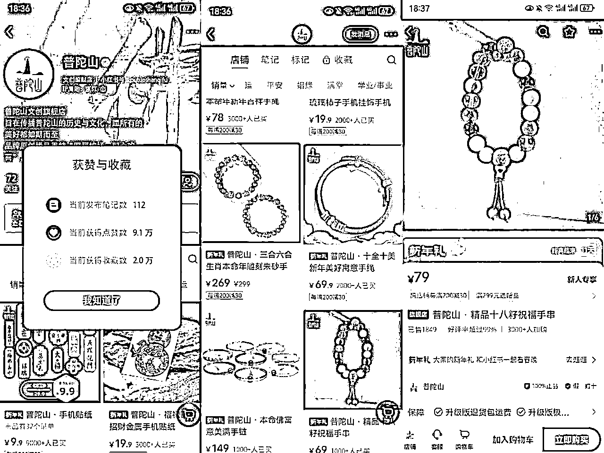
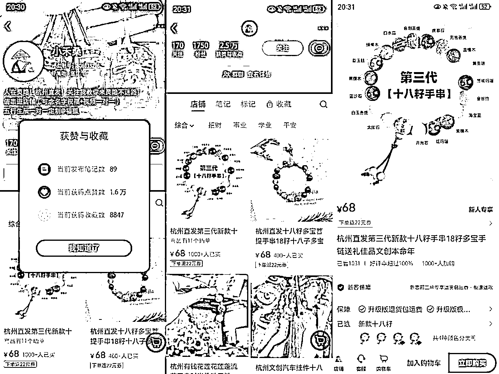
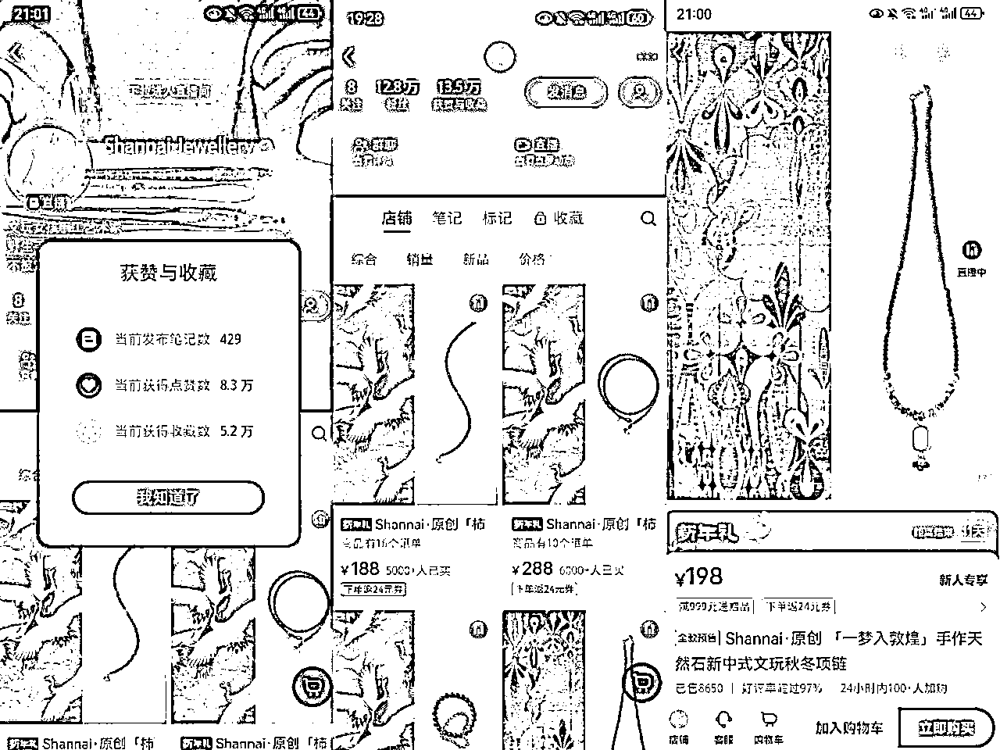
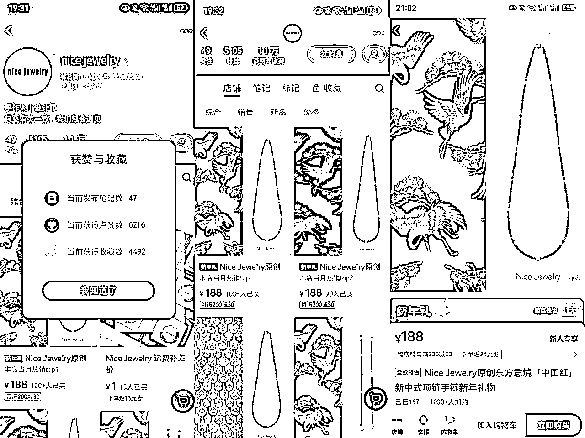
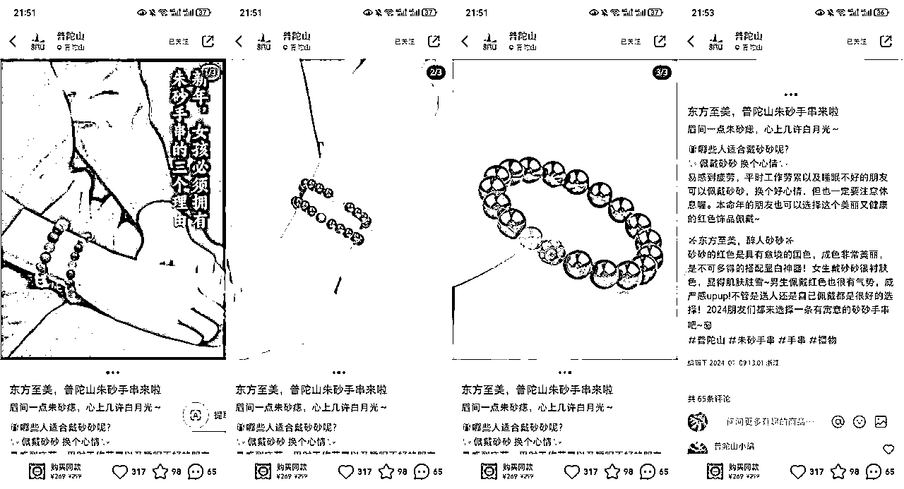
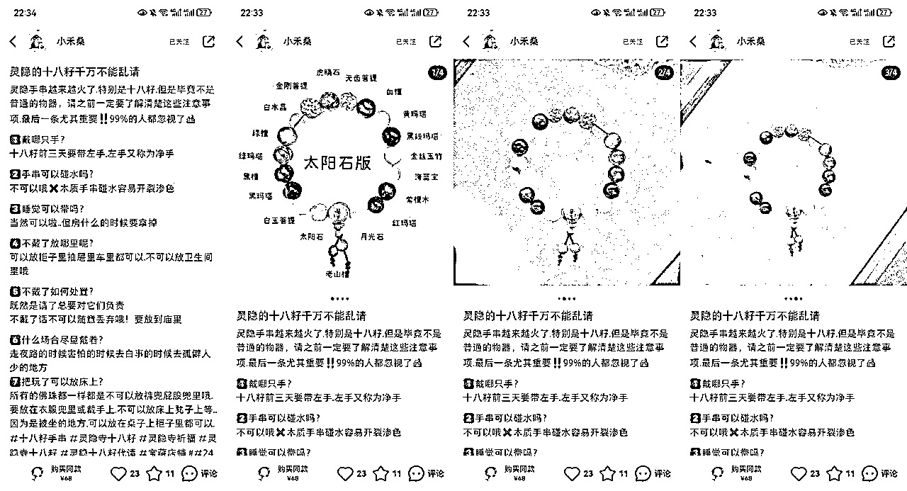
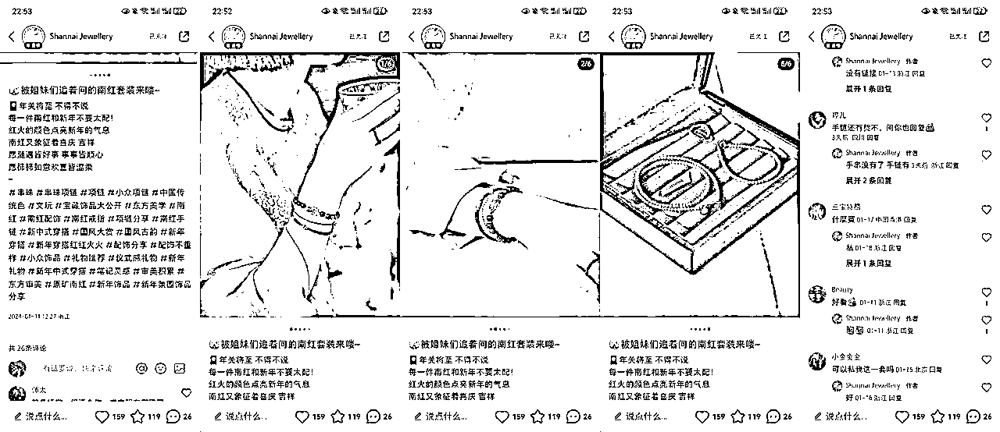
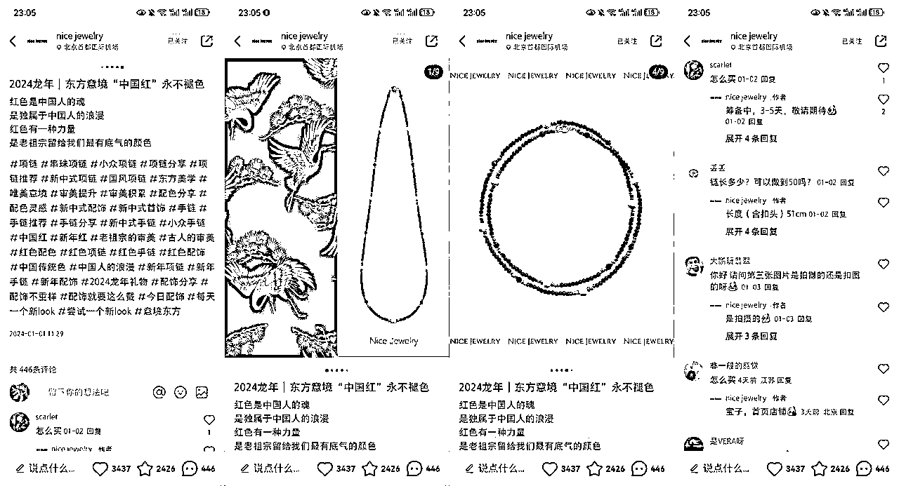
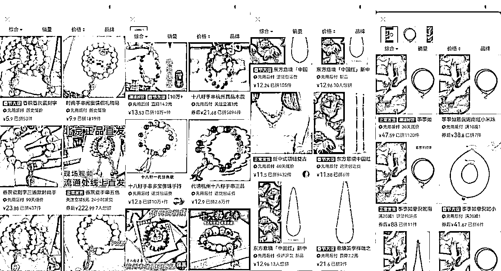
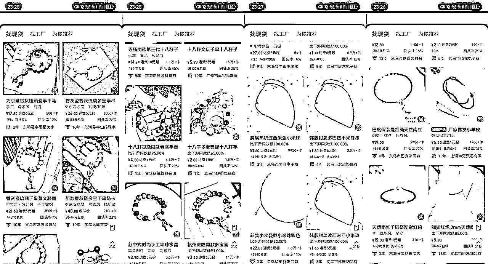

# 风向标拆解第 3 期--雍和宫手串、灵隐十八子，小红书高销售量手作饰品都是怎样的运转逻辑

> 来源：[https://qq8alk00fg.feishu.cn/docx/ERp7dtOpeoFwM7xFjaucqKRBnge](https://qq8alk00fg.feishu.cn/docx/ERp7dtOpeoFwM7xFjaucqKRBnge)

## ✅背景概况

#### 关于选题

刚拿到这个选题，发现其实出题人把雍和宫手串/灵隐十八子这类带有玄学性质的手串和手工制作的饰品混淆了，运营逻辑有相似之处但不完全相同，并且最重要的是这两类产品的核心卖点是完全不同的，前者是满足消费者追求精神寄托/玄学方面的需求，后者则是对独特和个性化需求的满足，所以我在拆解时还是给区分开，方便圈友们来对比着看。

#### 相关案例基本情况

*   雍和宫手串/灵隐十八籽

账号名称：普陀山

账号类型：企业号

带货方式：图文/视频笔记挂车带货、直播带货

起号时间：2023.08

起号方式：以50条手串抽奖的方式起号、分享普陀山拜观音攻略、逐步转向十八籽带货

账号名称：小禾桑

账号类型：个人号

带货方式：图文挂车带货

起号时间：2023.05

起号方式：以礼物赠送的角度进行直接图文带货

*   手作饰品

账号名称：Shannai Jewellery

账号类型：企业号

带货方式：图文挂车带货、直播带货

起号时间：2023.07

起号方式：以手作饰品笔记进行直接图文带货

账号名称：nice jewelry

账号类型：企业号

带货方式：图文挂车带货

起号时间：2023.12

起号方式：以手作饰品笔记进行直接图文带货

#### 选择以上案例的原因

1、全部都是近半年左右起号做起来的；

2、涵盖企业号/个人号、笔记堆量/侧重质量、纯图文/图文+直播，能够提供比较充分的参考价值和借鉴意义；

3、整体销量都不错，哪怕是新起号两个月的nice jewelry销量也在350+，利润可观；

4、爆款模板简单可复制，可操作性强。

## ✅流量怎么运营？

1）“普陀山”：通过图文笔记挂车和直播带货

*   图文笔记信息

图文笔记内容：科普普陀山相关知识、礼佛礼仪、拜观音攻略、手串佩戴方法等；

笔记发布频率：更新日期不规律，看起来像是日更，然后把数据不好的隐藏了；

笔记发布时间：没有特定发布时间，10:00am～22:00pm都发布过笔记；

图文笔记框架：文案部分是对手串讲解+配3～4张图，前两张图是佩戴在手上的，最后一张图是特写。

*   直播信息

直播时间：一般在晚上19:00/20:00开播；

直播场次：近3个月达到60场。

2）“小禾桑”：通过图文/视频笔记挂车带货

*   图文笔记信息

图文笔记内容：科普各类手串的组成、用途功效、识别真假方法、佩戴方法、保管方法、禁忌等；

笔记发布频率：3天一更；

笔记发布时间：没有特定发布时间，12:00am～23:00pm都发布过笔记；

图文笔记框架：文案部分是对手串佩戴方法/保管方法/禁忌等讲解+配4张图，第一张图是标出每颗珠子名称，后三张图是特写。

*   视频笔记信息

图文笔记框架：如何分辨真假十八籽+真假对比

视频笔记时长：20秒左右。

3）“Shannai Jewellery”：通过图文笔记挂车带货、直播带货

*   图文笔记信息

图文笔记内容：非常简洁的手串解读/搭配场景/鸡汤文案等；

笔记发布频率：日更2篇；

笔记发布时间：没有固定发布时间，9:00am～20:00pm都发布过笔记；

图文笔记框架：美好祝福寓意的文案+配5～7张图，分别是佩戴在手上的和套装图。

*   直播信息

直播时间：一般在11:00/15:00开播；

直播场次：近3个月达到91场；

直播时长：9-13小时左右。

4）“nice jewelry”：通过图文笔记挂车带货

图文笔记内容：极其简洁的手串寓意文案；

笔记发布频率：1～2天一更；

笔记发布时间：没有固定发布时间，10:00am～23:00pm都发布过笔记；

图文笔记框架：美好祝福寓意的文案+配5～9张图，首图是左边一幅画加上手串拼图，其他的都是手串的特写图。

## ✅产品怎么解决？

产品可以在平台上合作中心选品进行带货或者自有供应链或者无货源，以上的案例都是开通了自己店铺的，所以是走的自有供应链/无货源，这两者之间对于普通人可借鉴的自然是无货源模式；

关于无货源的玩法：可以从拼多多/1688找到同款/同类产品，跟商家协商好进价、物流、售后以及产品详情资料等，就可以开通小红书店铺进行带货了。

雍和宫手串：拼多多¥10上下，小红书¥300上下；

十八籽：拼多多¥13上下，小红书¥70～200；

手作饰品：拼多多¥12～40，小红书¥188～500；

雍和宫手串：1688 ¥20上下，小红书¥300上下；

十八籽：1688 ¥10上下，小红书¥70～200；

手作饰品：1688 ¥2～20，小红书¥188～500；

## ✅利润怎么核算？

普陀山：价格¥49～2188，销量38000+，按照销量较多的中位数¥88的来计算，总销售额达到¥334+w，参考拼多多和1688的进价，利润率在240%上下，整体利润大约在¥240+w左右；

小禾桑：价格¥38～238，销量1500+，按照销量较多的中位数¥68的来计算，总销售额达到¥102000，参考拼多多和1688的进价，利润率在250%上下，整体利润大约在¥75000左右；

Shannai Jewellery：价格¥128～818，销量45000+，按照销量最多的中位数¥198的来计算，总销售额达到¥900+w，参考拼多多和1688的进价，利润率在900%上下，整体利润大约在¥810+w上下；

nice jewelry：价格¥88～368，销量350+，按照销量较多的中位数¥188的来计算，总销售额达到¥65800，参考拼多多和1688的进价，利润率在900%上下，整体利润大约在¥56000左右。

## ✅项目如何做&如何放大？

1.  选好品，通过图文笔记起号出爆款，进行分销或者直接开通店铺/橱窗直播带货；

1.  打造矩阵账号进行多账号获取流量放大收益；

1.  开通聚光投流进一步扩大收益；

以上各环节在生财里都有不少大佬分享了很详细、很落地的实操方法，包括投流技巧，这里就不展开了，直接搜索即可。

## ✅项目结论

1.  以上账号在近半年起号，做到1K以上的粉丝量都取得了相应的成绩，说明这个赛道目前仍然可以小门槛进入；

1.  纯粹的图文/视频笔记带货是相对直播来说非常吃亏的，从上面的账号带货类型和流量获取情况对比以及利润核算就能看出来，如“普陀山”GMV比“小禾桑”多31倍，“Shannai Jewellery”GMV比“nice jewelry”多出来143倍，这是非常夸张的数字；

1.  在产品的包装上可以借鉴这些做的好的爆款产品，要有统一的风格区分开其他的无货源产品，有利于更好的转化。

以上，祝圈友们生财有术！