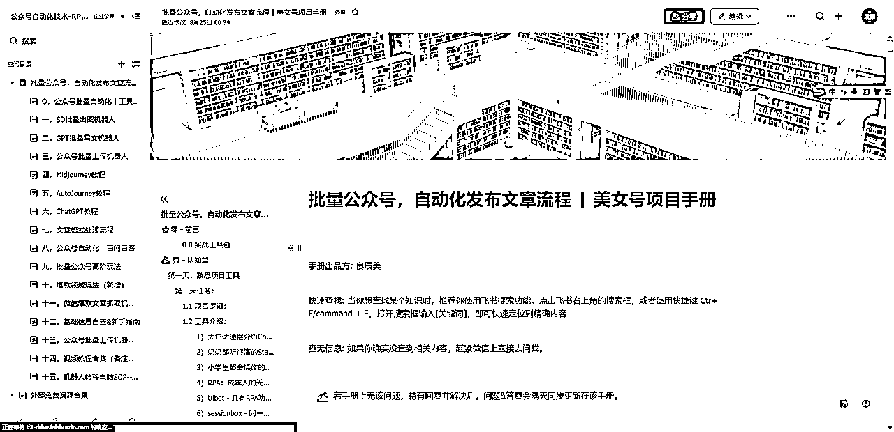
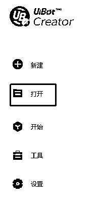

# 十一，微信爆款文章抓取机器人

> 来源：[https://fqlleg2dnfa.feishu.cn/docx/GggKdRRd5o5crGxHuowckobyncd](https://fqlleg2dnfa.feishu.cn/docx/GggKdRRd5o5crGxHuowckobyncd)

目前实践应用于电商&小红书&公众号领域，有需要可深度线下交流。V：zhuhou-xi

### 一、 概述

##### A. 机器人运行逻辑：

##### B. 必备条件：

### 二、主要功能

##### A. 基础目的

获取用户给定关键词下的微信爆款文章。

操作原理：通过旧版微信，搜索给定关键词下的爆款文章，复制链接保存到表格，抓取链接里面的文章内容。

##### B.高阶调试

可以获取多个下拉页面的爆款文章，可以获取关键词下的最新文章，可以获取多个关键词的爆款文章，并写入区分关键词。

### 三、下载安装机器人

##### A. 机器人运行环境：

https://mydown.yesky.com/pcsoft/44417133/versions/ 微信历史版本

直接下载 微信电脑版 3.9.0.28 大小：165MB|更新： 2023-02-13

（该版本之后，看一看搜一搜的功能区分了页面板块，机器人就不是很好读取）

最新更新等待版本8.18复制界面有比较多的变化

##### B. 机器人压缩包：

##### C. 配置步骤：

点击打开

导入机器人安装包

##### D. 开始运行：

点击运行按钮

（尚未在其他电脑测试，目前是以按钮点击形式，在本地我的一台电脑中支持）

注意先打开微信页面（登录状态）

### 四、表格内容模板

##### A. 起始表格

标题栏使用sheet1文库

文章内容使用sheet2部分

##### B. 完成状态

机器人采用用完即删的策略，以防文案重复，所以使用完成的标题和文字都会被删除

### 五、使用说明

##### A. 常见问题

<h8>Q1 阅读量能不能抓取？</h8>

A1 暂时还不能，进一步的还在测试研究，微信端反爬虫很厉害

Q2，使用注意事项：

先登录好微信，保持桌面只打开微信客户端页面

看视频

##### B. 注意事项

机器人运行前，务必处于微信登录且最大化状态，且版本为3.02。