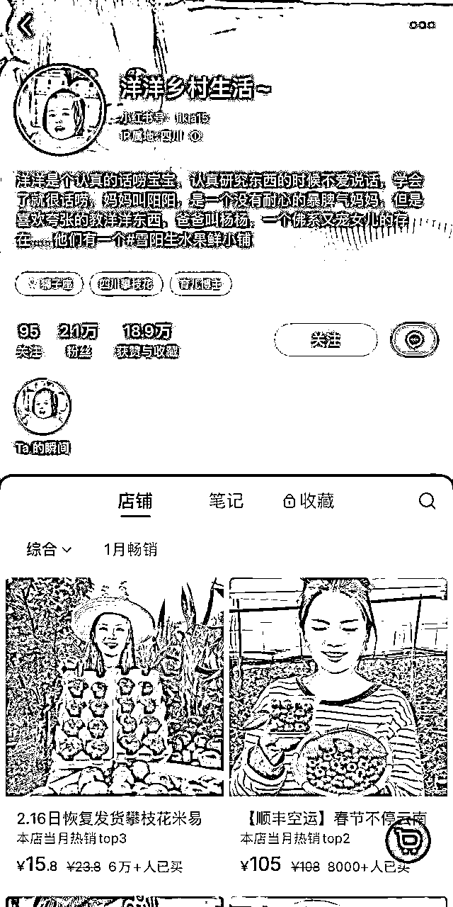
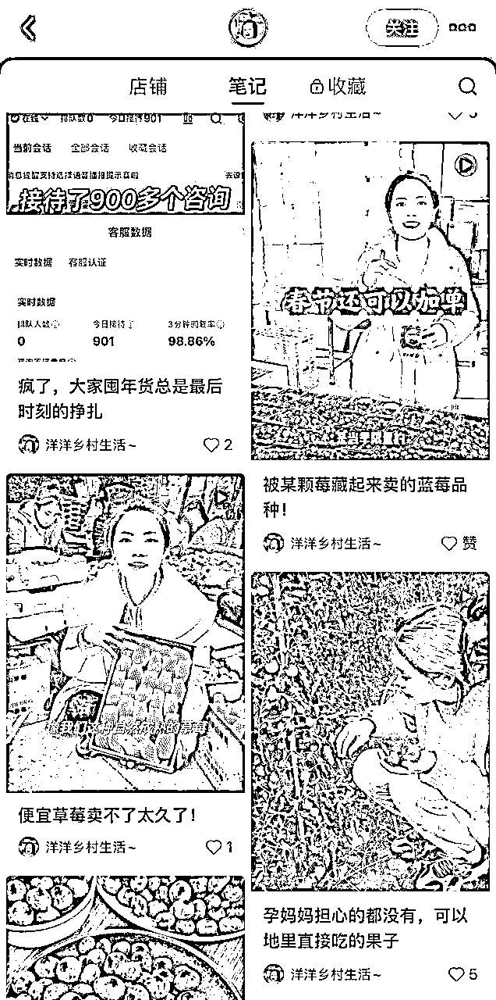
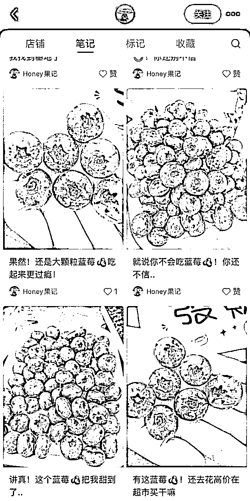
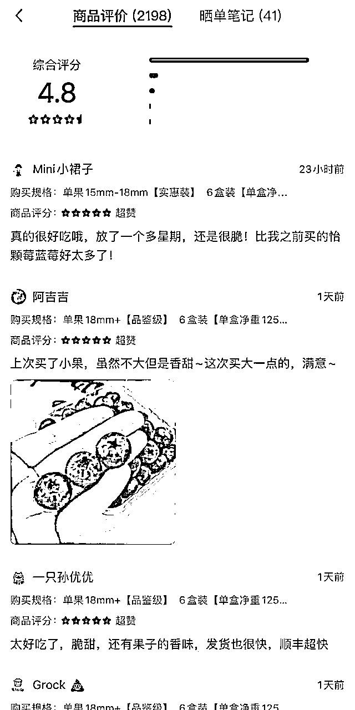
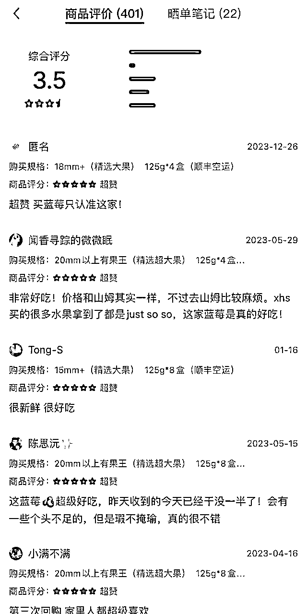

# 不想做低客单，小红书上高端水果怎么卖

> 来源：[https://rm1nv0sw1r.feishu.cn/docx/Ew3TdYNZxoxO5axIU5Gcxz02nXb](https://rm1nv0sw1r.feishu.cn/docx/Ew3TdYNZxoxO5axIU5Gcxz02nXb)

# 案例拆解

在小红书上卖高端水果，做好这三点，不愁顾客下单

# 产品选品

为什么我看好在小红书做三农账号，因为最近云南的朋友寄来了玉溪的蓝莓

快递是前一天发的，货是第二天下午收到的，顺丰空运直接送上门

打开礼盒的时候，蓝莓就像刚刚采摘下来 个大饱满 脆甜多汁

快团团卖99/4盒/每盒净重125g 帮卖佣金14

同样的产品，小红书的定价在108以上，售出5000+件

质量好的产品不担心售后

如果是一件代发的模式，售后部分也是由源头负责，无需担心退款

如果想做小红书高端水果，一定要找到一个质量超预期的后端

# 小红书账号定位

高端的水果要打造高端的人设

例如：洋洋乡村生活

孕妈能吃的水果/给孩子吃的水果

素材为出镜实拍，有时还有自己的孩子出镜

非常真实塑造了一个卖水果的宝妈形象

处处为孩子着想

在天然健康这方面下足了功夫

哪怕笔记没有爆款每天也坚持发笔记

例如：Honey果记

简介中塑造自己果园形象

没有真人出镜

每篇笔记都是直接怼实物大图

有群聊和直播

每天坚持发5篇笔记

# 小红书店铺晒单评价

【洋洋乡村生活账号】

商品评价与5星好评超多

产品质量好+引导评价

【Honey果记账号】

产品质量与价格不匹配

商品评价少+未引导评价

# 总结

如果想要深耕小红书三农产品类目

做一个真实人设非常重要

做好了无论是利润还是复购都很高

如果有优质货源和素材不妨开一个店铺尝试一下

目前小红书店铺的产品还很少

坚持发布，下一个爆单的就是你