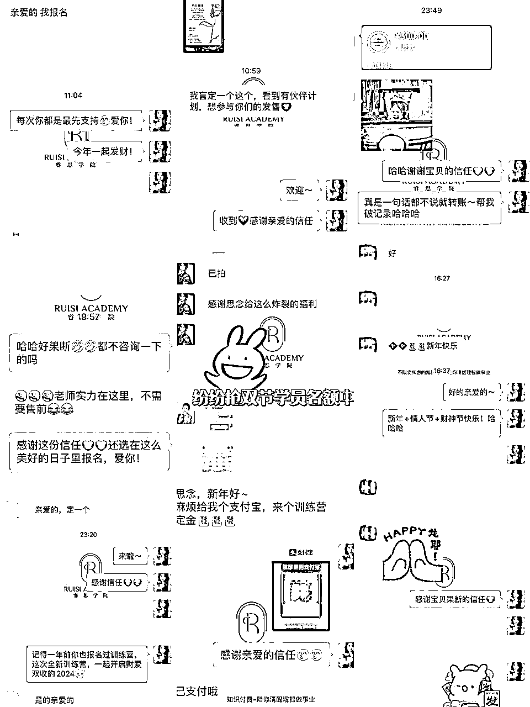
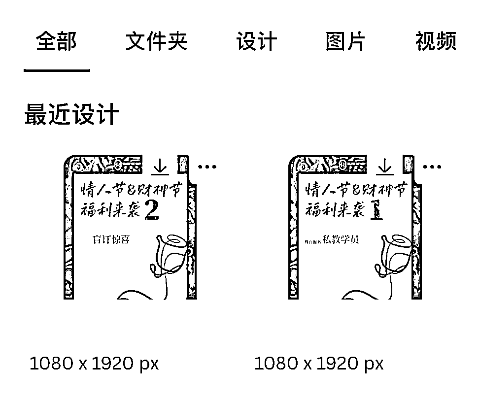
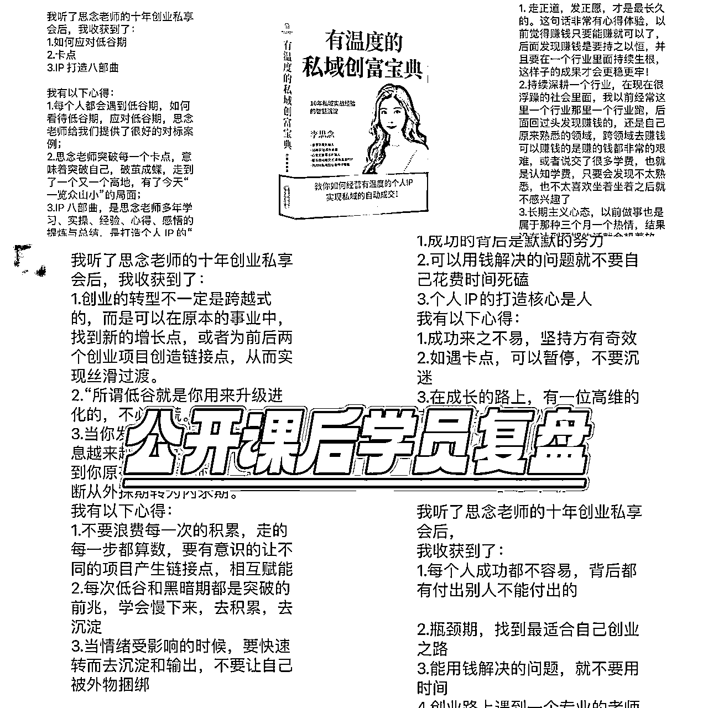
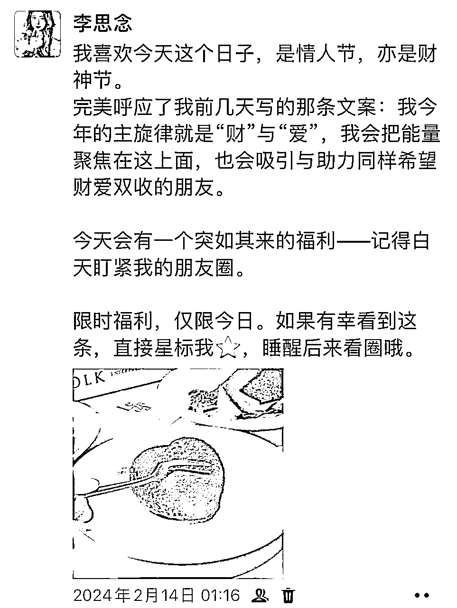
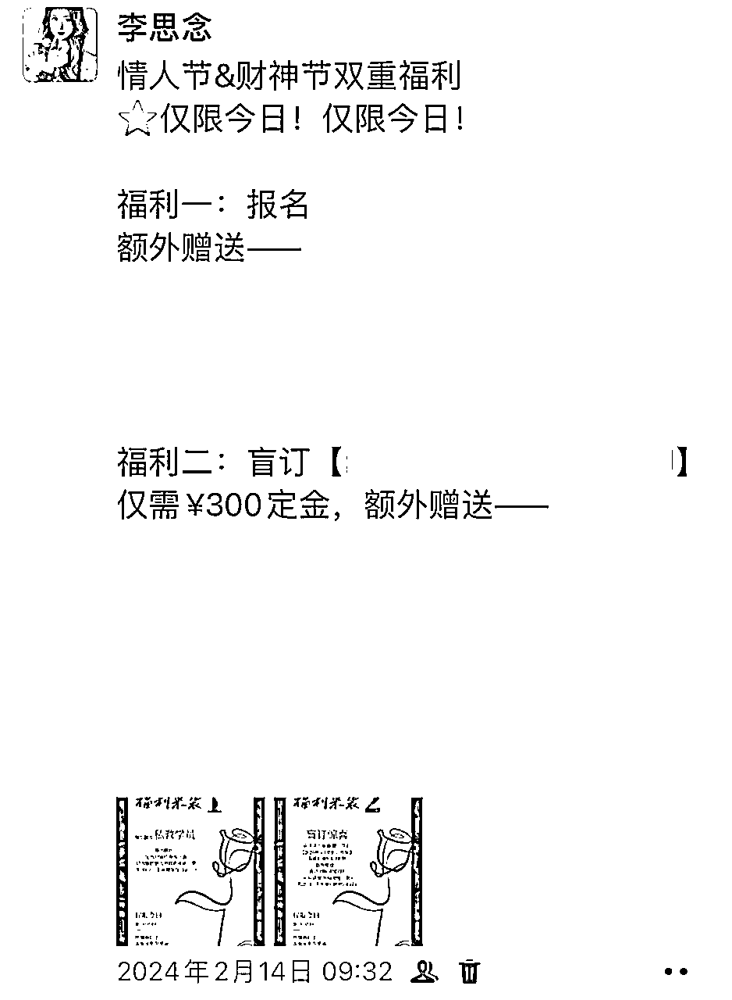
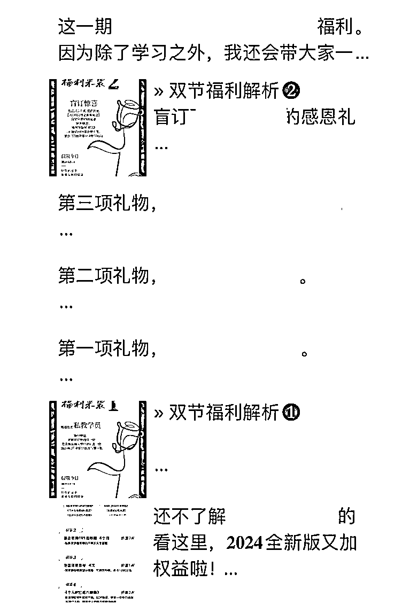
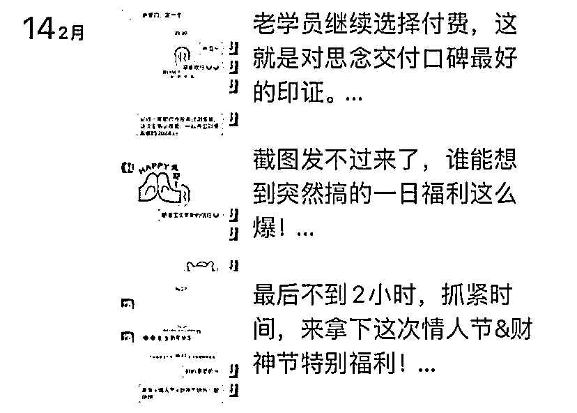
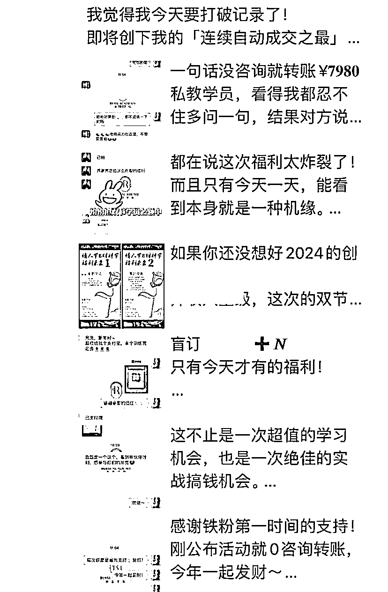

# 单日私域自动成交4w+，不销而销背后的秘密

> 来源：[https://b80fa9wrsf.feishu.cn/docx/EyBMdPOBbob5VcxQWaLcAu8On2c](https://b80fa9wrsf.feishu.cn/docx/EyBMdPOBbob5VcxQWaLcAu8On2c)

哈喽，大家好，见帖欢喜，我是思念。

是擅长做「有温度的私域」的IP创业导师。

正值今年2.14是情人节&财神节，冲着这“财爱双收”的美好寓意，临时灵感突现，花一晚上策划了一场小型发售活动，结果实现了单日营收4w+，并且创下了一个奇迹——

全部都是自动成交！当日所有用户都在3句话内付款！

关键的是，我这次活动大部分收的都是定金，且是盲订（用户不知道具体产品的情况下预定），所以最终创造的营收价值会在10w+。

但我并不想夸大数值，所以还是写目前的实际营收，更主要是来分享一下如何做到不销而销自动成交的方法论，相信这会是对于圈友而言更有价值和参考意义的part。

[ 全文已脱敏处理，不打广告，放心食用 ]

先来解释下什么是「不销而销」：

在我看来，最高级的销售方式是不需要刻意推销叫卖的，甚至不需要谈单话术，用户自动被吸引，直接转账成交。

想做好不销而销，不是单独靠某一个环节达成，背后实际上是有一整套链路设计的。

比如你的IP如何呈现出信任感、你的私域如何丝滑运营、你的文案怎么写得人越看越心动、怎么设计诱饵让用户秒下单……

那么接下来，就来给大家拆解下我这次小型发售活动的「不销而销」自动成交全链路。

# 一、1日发售活动设计

我这篇内容中，发售不是主旨，但为了方便大家更好理解，还是先简单介绍下我这次活动。

在设计活动时，从活动寓意、活动周期、活动策略、物料准备等方面入手。

## 1、活动寓意

首先是要解答“为什么要做活动”的问题，要为我们的活动赋予一个特别的寓意。

比如我的这次小活动，就是恰逢难得的情人节&财神节双节，大家都带着发财被爱的美好期望，所以我由此做了一场报名福利。

## 2、活动周期

和正式的3~5天群发售不同，我这次活动的周期仅仅只有1天，可以算是“快闪中的快闪”，所以更考验的是IP的信任值和用户触达量。

我认为，营销不需要有定式，固定的模式用户一眼就能识破意图，反而对于成交带着更多防备之心，有时候我们要适当的反套路一下，说不定就能出奇制胜。

比如我这次，就做了很多出乎大家意料的举措（后文会展开讲），却带来了奇效。

## 3、活动策略

常见的营销活动类型有打折、满减、买赠、抽奖、秒杀等形式。

这次我的活动主要是采用“买赠形式”。

由于我的课程从不降价（这是我的营销原则之一，也建议IP们不要轻易对自有产品降价，会影响IP价值），不方便做打折/优惠，因而限时加赠礼品是更好的选择。

第一重活动是简单的买赠，购买私教产品赠送其他礼物/服务；

而另外一重活动，则是我为下个月的新品铺垫，做了一个「盲订惊喜」——在未揭晓新品前，交定金的学员可以获得多重礼物。

做「盲订」活动极度考验IP的信任度，如果你还是刚起步的创业者，不太建议这样操作。

但如果你已经积累了足够多的潜在用户信任，这样仿佛“开盲盒”般的活动，反而更能勾起他们的兴趣。

果然，活动一发布，多个意向客户都在第一时间选择付费，甚至一句话没多说，就是直接转账。

在盲订福利中，我还设置了一个「负风险承诺」：

如果最终公布时，觉得盲订的产品不满意或不符合他的需求，他依旧能够获得远超定金价值的其他产品。

这个负风险承诺的设置，也降低了用户的犹豫值，为促成自动成交结果起到了作用。

## 4、物料准备

正式的发售应该提前准备海报，但由于这次是在春节期间临时决策，美工还在休息中，所以自己亲自上马，用手机设计了两张海报。

这里推荐一下海报设计app：可画

里面有大量的海报模板，可以一键套用，非常方便。

# 二、高价值IP经营

## 1、储蓄罐意识

想实现不销而销的自动成交，我们需要有一个储蓄罐意识：

你的每一个营销动作，都是在你与用户储存金币，这一金币意味着信任度和付费欲的增加，当存满的那一刻，成交就发生了。

所谓的活动或者发售场，它仅仅只是一个引爆点，是最后投入的那一枚金币。更重要的是前端的IP经营，是你如何存满前面的金币。

“零存整取”，这也是我这次小发售的方式，在存得差不多的时候，取一次。而当我取完这一次之后，还会继续存（输出价值），这样就能做到持续经营。

## 2、信任前置

我还有一个IP经营的理论是：信任前置。

在公域先做到IP的信任前置，就能在私域实现更高效的成交。

要在引流端加深IP的人设深度，不要只做一个工具人。

一个用户是为了某一份资料来链接你？还是认可你的价值观、为了认识你这个人来链接你？——最终带来的成交结果是会有很大不同的。

我的大多数准客户，都是小红书精准引流而来，他们已经提前对我产生了信任，并且相当一部分人就是因为喜欢我的文字而来链接的，本身自带好感，从而再到私域成交时就会更加爽快。

## 3、十二字经营用户关系

引流来的用户，我会放在私域里进行维护。

要怎么让用户愿意留在你的私域里？怎么让用户愿意持续去关注你？

思念想了12个字，来解答这个问题：“一见倾心，再见慕华，三见誓随。”

“一见倾心”的意思是，刚认识你，刚加上你的好友，就被你惊艳到，就忍不住想要去了解你更多。

要怎么做到这种惊鸿一瞥的效果呢？两个板块需要经营好：

第一个板块是我们的自我介绍，你要在新好友加上你的时候，给到一个非常有力度、非常能展示你实力、并且有一定温度的自我介绍。这里可以给予一定的价值，比如可以通过送见面礼的方式，让用户先从你这得到一些好处，也会加深对你的好感度。

第二个板块就是我们的朋友圈打造，新好友加上你点开朋友圈之后，映入眼帘的就是我们的朋友圈五件套。

哪五件套呢？昵称、头像、个性签名、朋友圈封面、以及微信置顶。

要想朋友圈五件套有吸引力，一方面IP要有吸引力，要能给人带来“故事感”，另一方面整体设计要有美感度，让大家有想继续看下去朋友圈的欲望。

“再见慕华”的意思是，我们需要提供有价值的内容，让用户感觉到你懂他，感受到从你这里能够收获到他需要的，从而对你产生欣赏。

这就得在我们朋友圈或者社群里，进行持续的内容输出了。

内容输出围绕什么进行呢？围绕你的IP定位，围绕你的用户需求，不断衍生选题，不断在私域经营中积累素材。

这里是我们运营私域最重的一个环节，因为内容输出是得不断进行的，并不是你输出一两周、两三个月就可以，大部分现在变现猛的私域IP，内容输出都在一年以上。所以持续深耕很重要。

“三见誓随”的意思是，我们要用人格魅力征服用户，让他决定跟随你的意见决策，比如跟你买产品，或是跟你做事业。

前者慕华是输出价值，后者誓随就是我们要提供温度。用户为什么要跟你买？一定不单单是因为你有才华，还有你的IP魅力，让用户觉得靠近你是很舒服的一件事，同时他需要的也只有你能给。

所以我们在经营朋友圈内容的时候，得在其中不断传递出来你的IP精神，你的差异化优势，你的价值主张，从而唤起我们精准用户群体的共鸣，深度锁粉。

你的每一条文案，都是通往成交的桥梁，一定要有目的性的去创作文案，坚持原创表达。

这里分享一下我之前写过的朋友圈相关文章，大家可以阅读：

这次有一个直接付费7980私教的学员，第一句话就是问“付款方式”，我当时反问她“不需要多咨询一下吗？”

结果她说了一句让我非常感动的话：“老师实力在这里，不需要售前”

当时给我的感觉就是，一切都值了。

日常的价值输出是不会白费的，很多用户虽然不会跟你交流，甚至不点赞，但一定是在默默地关注你。

这也告诉我们，IP需要耐心经营，你此时此刻的变现结果，可能是你半年前播种下的种子，唯有坚持深耕，才能看到开花结果。

# 三、社群蓄能

虽然这场小发售活动是突发奇想，但其实我很早就做出了“预判”，并且做了初步的蓄能动作。

今年年初我在做年度规划时，决定做起来自己的免费创业思考群。

出发点是由于今年我会有很多营销大动作，反复建群会容易触发系统风控，所以索性提前布局了社群。

用社群配合朋友圈，能够更大限度提升内容的触达率。

精细化运营私域，高频触达用户，不断提升运营的颗粒度，也是私域的大势所趋。

我在1月份里，通过2次公益活动聚集起来了自己的社群粉丝，一次是《生日答谢》，一次是《十年创业分享会》，而这两次活动，之所以叫公益，是因为均没有做任何转化成交行为。

很多朋友可能看不懂，包括当时我团队里也有成员不理解，因为通常一场公开课后，紧跟动作就是直接上产品追销，而我为什么却做了一场不谈成交的公开课？

这就是我的蓄能意义，也是我前面提到的“反套路”，不走寻常路。

不急于一时的成交转化，而是先去跟用户建立信任度。

通过生日赠礼、转发送书、跨年红包等动作，与用户之间增加粘性与好感度；

通过干货分享、同步思考与最新动态等行为，增强IP影响力，呈现IP价值；

同时，还通过引导大家课后复盘，提升了用户的参与感，同时促进了二次传播。

而且我认为，社群是需要靠“养”的，不能一次性竭泽而渔。

在这次取了之后，我会持续输出更多用户需求的内容，为我们的关系继续储蓄金币。

赚钱这件事，一定是你为用户提供足够多价值之后，自然而然的回报。

# 四、朋友圈自动成交

我通过社群运营配合朋友圈自动成交，促成了本次的营收成绩。

大家一定要重视朋友圈的作用，日常的经营是平稳输出价值、建立信任，而到了发售期的朋友圈，就变成了自动成交的利器。

日常我的发圈在每日5条左右，而这次活动直接发了20条朋友圈。

倒不是我刻意要发这么多，而是需要发的内容实在太多，每一条都难以舍弃，综合起来才能构成让用户越来越想付费的圈。

拆解一下我当日朋友圈的内容构成：

2条铺垫圈+1条活动公布圈+7条活动解析圈+10条成交氛围圈

第一条铺垫圈是凌晨发出的，提前告诉大家“白天会有福利，记得关注朋友圈”，这里是浅预热，也能够让不同时间段刷朋友圈的用户关注到。

活动公布圈是早晨9:30发出的，这里不需要过多话术，直接了当的硬广告即可，是为了方便之后刷到其他条朋友圈的好友，在点进你朋友圈主页时能第一时间找到活动介绍。

活动解析圈也是非常重要的，这一步往往被很多朋友忽略，从而就会加重销售难度——因为用户会反反复复询问那些共同的问题。

但其实，只要你能提前说出别人之想问，在朋友圈里统一解答大家的疑惑，解释活动每一项设置的目的和意义，就能让用户在浏览中自然而然地从理解到认同，从认同到种草。

这里我用7条朋友圈的篇幅，逐一解释了权益，为了避免过度占领朋友圈版面，所以部分是用纯文字形式发圈的。

成交氛围圈是促进自动成交的助燃剂，一方面能够不断地在朋友圈里进行晒单、烘托成交热度，另一方面通过这类朋友圈提升对私域好友的信息触达，让更多人有机会刷到你的朋友圈内容。

为了避免过度刷屏引起反感，朋友圈条与条之间的时间间隔都在30分钟之上，这样能够做到不过分打扰、但又能让准意向们看到。

也来拆解总结一下成交氛围圈的发圈角度：

①铁粉第一时间付费

②大量客户纷纷下单

③活动机会难得

④客户爽快下单

⑤老客户复购/老学员续费

⑥不断倒计时

⑦消息回复不过来

氛围的营造，这里会运用到用户的「从众心理」与「损失厌恶心理」，不断地倒计时，让那些犹豫不决的用户下定决心。

不过也要注意，文案需得有「度」，不要为了成交过度承诺或者夸大其词，不然就变成了令人讨厌的浮夸营销。

在这方面，我格外注意对数字使用的谨慎，不希望吸引过来的用户是冲着一夜暴富的，更希望大家是“真正认可价值、正好这次有福利入了更合适”的心理来参与活动。

这里面也会涉及到一个「筛选」原则，当我察觉到某个用户状态不对、过于急迫或者经济压力大的时候，也会果断拒收。

# 五、不销而销成交心法

最后再来分享几点我的成交心法，均为个人拙见，也欢迎大家来友好交流探讨。

### 1、不销而销和传统营销的不同

与以往大家了解到的营销相比，不销而销更看重IP的积累，而对于运营的技巧并不是那么看重。

在IP经营中，内容＞技巧，IP更要注重内容的力量。

我见过许多精妙的sop规划，包括我们在做大型发售时也会做详细的营销策略，但是这次毫无准备、突发奇想的活动，仅仅1天时间，却亦能够实现批量成交的效果——注意，我并不提倡大家不做周全准备就发售，但是我这一次活动也完全验证了：只要IP经营得到位，内容价值传递到位，运营技巧是可以让步的。

### 2、日常潜移默化的塑造价值

内容的触达并非发售时的单次，而是要靠日常的积累。

私域的内容包含哪些呢？像是朋友圈的文案、社群的分享、公众号的文章、视频号的视频……这些都是内容，通过内容先占领用户的心智，就能够实现更快速的成交。

在日常的经营中，不断在内容中渗透IP理念，每一条文案、每一次触达都是在传递个人品牌价值，当积累到一定量时，就能在一个合适的时间点实现引爆。

### 3、高端用户比低端用户更容易实现不销而销

很多朋友可能认为，卖低客单的产品容易快速变现，但事实上，恰好相反。

低端用户往往会有更多的问题与犹豫，他们看到一样产品时，更多关注于价格而非价值，反复对比询价，如果销售者心性不稳甚至会由此自我怀疑产品价值。

高端用户则更珍惜时间成本，“惜时”就会使得他们快速判断、快速决策，因为他们理解商业的本质，有基本的常识与付费意识，如果一款产品价格太低，便会直接默认为价值低从而选择略过。但面对足够认可、能够为他提供解决方案的产品时，哪怕价格不低，也会果断付费。

所以大家在做成交时，更要学会瞄准高端用户，不做教育市场的事，把时间留给对的人。

PS：这里的高低并非指社会地位、拥有财富的高低，而是认知与付费习惯的高低。

### 4、给予用户主动选择的空间

不要去做那些过度打扰用户的动作，比如频繁群发、不经过同意就拉群，而是要传递给用户价值，用吸引代替说服。

这样的成交背后，对于用户来说是他主动选择了你，而非你逼迫or诱导用户买单。

特别是像私教这种后端交付重且需要用户配合的产品，用户是否是主动选择的，会直接影响到交付质量和口碑。

### 5、前端做越多的工作，后端成交就会越容易

我有一个私域成交的小观点：你销售时浪费的口舌与时间，都是你朋友圈文案上偷的懒。

一定要多去深入洞察你客户的痛点和需求，然后把对应的解决方案写出来，这样用户才会在看你圈的过程中自然而然得到答疑，就不会再重复询问和犹豫。

你没能提前解决顾客的疑虑，所以真到了付费环节才会出现卡点。

### 6、面对成交不要急迫

虽然最理想的状态是0咨询成交，就像思念这次发售创下的奇迹，全部都是3句话内成交的，但是我们也要接受用户有可能的顾虑与反复纠结。

不要把自己放在和客户的对立面，不要传递出“不耐烦”的情绪。我有遇到过这样的销售，哪怕本来是很想买的，看到对方的高傲态度也会直接打消念头。

换位思考一下，对方可能仅仅是因为没有获得足够的确定性从而犹豫。所以我们也要给到足够的包容和理解，耐心的帮她解决卡点。

### 7、成交的出发点是「利他」

以利他作为我们成交的出发点，当你的产品能够帮对方解决问题＞你自己的成交意图时，成交往往更容易发生。

像我这次发售，虽然主产品是盲订，但是在我的设计中，赠送的服务是符合用户需求，能够帮助他们解决一定问题的，所以成交就会变得更顺利。

还有就是，成交时候一定要让自己有温度，像朋友一样跟你的客户沟通，给到对方的体感是更舒服的，也更容易促进成交。

### 8、成交最终卖的是价值观

人的每一个行为，说出的每一句话，都会体现他的价值观。

比如面对指导学员这件事，我的价值观是允许学员的差异化，尊重学员的成长，每个人都要找到能够长期深耕的方向，在热爱、擅长与商业化中平衡。

而有的导师可能就恰恰相反，告诉你“你就复制就行了”“无脑抄才是王道”

谁对谁错？说句公道话，本质没有对错。

还是看学员他自己本心是哪种人，他更能认可哪个理念。

吸引的背后是价值观同频，成交的背后也一定是价值观的极度认同。

而我们需要做的，就是要把自己的价值观清晰地剥离出来，呈现到用户面前，这方面一定不要含蓄表达，要大胆的发表观点。

价值观是IP人设中的纵深，这点不是打造出来的，而是生长出来的。你能被用户记多久，你值得多高的付费，就取决于此。

最后的最后，感谢大家的耐心阅读。

我是思念，祝大家在2024年事业不断上升，都能收获不销而销的惊喜！