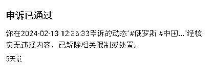

# 海外美女数字人，屡败屡战，一周变现5W+

> 来源：[https://pe3zzbrwvl.feishu.cn/docx/FaQGdRHSBoMgH0xhwTEcXcSHnEh](https://pe3zzbrwvl.feishu.cn/docx/FaQGdRHSBoMgH0xhwTEcXcSHnEh)

大家好，我是Pony，一个去年加入生财、在生财里潜水近一年、几乎毫无存在感的圈友。直到今天，我才敢鼓起勇气，和大家分享我过去一周所做出的成绩。

我是一个内向而被动的人，不善于表达，喜欢躲在角落，默默地去做一些自己喜欢的事情。这也就决定了我的圈子不大，甚至说很小，思维相对狭隘，想努力却始终找不到方向。自从去年有幸加入生财后，我的世界打开了一扇全新的大门，感觉无数机会向我袭来。曾一度感到很迷茫，因为生财里的大佬实在是太多了，而赚钱的点子也是五花八门，一度不知从何搞起。在参加了多次航海后，虽然每个项目都有成功变现，但始终没做出大的结果，对自己也陷入了无数次的怀疑。我喜欢听曹大的直播，在我无数次陷入自卑的情绪时，曹大的一些话总能带给我能量和希望。曹大前阵子分享国外有位大佬，虽然现在早已实现了财务自由，但也是在尝试了上百次后，才成功了那么小几次。连大佬都要经历那么多次的失败，更何况是我这样的普通人呢？于是我下定决心，给自己100次的试错机会，哪怕只成功1次，对，只要一次就好，我相信我的人生就会从此不同。

说干就干，我每天泡在生财里看各种精华帖、中标以及航海实战中教练分享的直播回放，想在里面找寻一个适合自己的机会。我记录了一些适合自己的可搞项目，最终选择了俄罗斯美女数字人这个项目。原因有以下几点：

1.  制作数字人的过程并不复杂，自己可以做到；

1.  本身就是学的英语专业，由于经常接触外国人，自信很了解外国人在中国生活的心理状态；

1.  由于之前做过几年代购，生财里圈友分享的俄罗斯美女数字人的带货变现模式是我所擅长的。

我起初的思路是这样的：

逻辑：俄罗斯美女数字人，热爱中国的人设，引发中老年人士的爱国情怀，产生情绪价值，进而产生消费意愿。

货：俄罗斯进口食品（糖果、巧克力、饼干、蜂蜜、奶粉、火腿）

直播：不推荐AI换脸（法律风险）；真人手播，不露脸，只讲产品

以上思路的内容来自生财圈友的分享，我觉得说的非常有道理，也很实际。想明白后，就开始行动。

我先准备了两个红米手机（便宜，加一起500块），注册了两个微信号。首先拿出一个微信，根据视频号带货的航海手册注册了第一个视频号，修改好相关的资料后，我开始准备发布第一个视频。话术其实很好找，视频号、抖音和快手里都有很多，而且生财的帖子里也有圈友整理了不少内容，我先把话术整理了10篇。

话术解决后，下一个问题就是人物模型了。圈友有分享人物模型可以在油管、tiktok以及VK上寻找，三个地方我都找了一圈，tiktok里面人物模型最多，但是大多都带有字幕和场景切换；而VK感觉网络不是很顺畅，也没找到合适的内容；接下来只有油管了，油管是全球最大的视频平台，我相信肯定找得到，但由于内容太多，我具体搜索了英语学习和真人采访这两个内容，从结果来看，英语学习相对容易找到模型。最终我找到两个合适的模型，使用圈友推荐的AI人脸替换工具和wav2lipV11来制作最初的数字人模板。

这里我将两个工具的下载地址分享给大家：

AI人脸替换工具：百度网盘链接：https://pan.baidu.com/s/1t9lS3JJx9J01uVrft5m7mA?pwd=lq2l 提取码：lq2l

wav2lipV11：夸克网盘链接：https://pan.quark.cn/s/1b71a99ab4e5 提取码：ABAx

制作过程中，最棘手的一步就是数字人的制作了。之前Heygen是可以通过多邮箱反复注册实现白嫖，后来Heygen开始限制注册了，在多番搜索下，通过WebRTC Control这款谷歌浏览器插件+outlook邮箱的方式完成了注册。然并卵，自定义数字人是收费的，官网价格比较贵，淘宝有便宜的，120人民币15分钟，说实话对于流程还没跑通的我来说有点奢侈，于是我开始继续倒腾，试图寻找性价比更高的数字人，我尝试了腾讯智影、DID以及其他很多的国外平台，效果都非常不理想，最终找到了一家完美替代Heygen的数字人平台——Anylang，但死活注册不了，不过在我三番五次地不断尝试下，最终在该平台跑通了注册流程（目前海外美女数字人带货异常火爆，在抖音、快手、视频号、小红书都能看到大量的海外美女数字人带货视频，说明这个市场前景巨大。而且由于数字人平台都设置了严格的反白嫖措施，注册账号都极度困难，即便注册定制数字人也是一笔不小的开支，因此出售数字人平台账号成为了当下一个异常火爆的风口，我在淘宝随便一搜，销量都很不错）

下面我给圈友们分享一下Anylang平台的注册和使用教程（市面价值1999元，我只在生财里免费给圈友们分享）：

1.  首先打开anylang的官网的登录页面：https://app.anylang.ai/login，选择sign up with email

1.  我们进入注册页面，这里千万不要在当前页面输入邮箱进行注册，因为根据我的实操，无论你输入什么邮箱（临时邮箱、谷歌邮箱、微软邮箱等等）都会显示not support，因为该平台设置了严格的反白嫖风控措施。

1.  我们只能选择下方的sign up with google来进行账号的注册，点进去后会进入到谷歌邮箱的登录页面（需要具备访问谷歌网站的前提），输入谷歌邮箱和密码，就会自动注册成功，进入平台的操作页面。

1.  我们先点击右上角的头像，然后头像左边的credits就会变成1，也就是可以制作1分钟的数字人视频，你也可以选择制作2个不超过30秒的视频（这里要说明一点，在Anylang平台制作数字人，我们的成本其实只有批量获取谷歌邮箱的成本，至于如何获取，大家在谷歌上搜索相关平台直接购买即可，这里我就不多说了）

1.  获取平台积分后，下一步我们就需要制作数字人模型了，我们点击页面下方的Avatar，然后将我们之前制作好的数字人模板扔进去，等待平台处理即可（过程大概需要几分钟，耐心等待即可。值得说的一点是，该平台对头像版权管控很松，你甚至不需要换脸，直接把你在网上找的视频扔进去制作都可以，甚至还可以完成出镜人身份认证，真的发现了宝藏）。

1.  平台处理模板完成后，我们会进入到一个新的页面。在这个页面我们只需要做一件事，输入你的文字稿，然后选择你喜欢的语音模板（值得一提的是，Anylang的语音模板是支持多国语言的，这意味着你的文案中如果包含中文、英文甚至其他国家的语言都可以完成音频制作，一些外国人说中文的口音表现的都很完美，是不是很棒）。

1.  选择完合适的语音模型后，我们点击页面右上方的submit，然后会显示需要扣的积分，点确认，就可以耐心等待数字人的完成了。（大概需要几分钟的时间，和Heygen的等待时间相比，简直不要太爽）

1.  制作完成后，我们在Videos里，鼠标放在我们制作好的数字人视频上方，点击下载按钮即可。

1.  接下来要做的就是在剪映里把视频截取成3：4或者是9：16，然后添加一些音乐以及完成后期的剪辑，到这里，我们的数字人制作算是完成了。

口播话术、人物模型和数字人平台都搞定后，接下来就是根据模型制作视频然后在视频号上传了。为什么选择在视频号，主要是因为航海手册里介绍的，视频号的主要群体是三四线的中老年人，获取他们的信任后很容易成交，而且退货率低。在我发出第一个视频后，说实话内心还是很忐忑的，不知道结果如何，焦虑地等待了5分钟后，开始出现点赞和爱心了，心里的焦虑才得以缓解。发布过了10分钟后，点赞和爱心逐渐变多，评论也开始出现了，到了半小时的样子，平均每分钟都能在视频号消息里看到100+的红色提醒，此时我心里出现了一个强烈信号：有戏。当天我根据航海手册的内容发布了3条视频，第二天3条视频的小眼睛就好几万了，我第一次体会到了流量爆了是什么感觉。但这时不能自嗨，我继续发布了3条视频，流量持续增长。

但此时第一个问题出现了，视频号弹出了出镜人身份验证的提示。这让我惊恐万分，我赶忙在生财里搜索视频号出镜人身份证相关的内容，在几番搜寻后，我找到了唯一一条解决出镜人身份验证的帖子，但解决过程中发现自己的视频号还未实名，不详的预感浮上心头，不过好在最后解决了。解决方法如下：先完成视频号的实名，然后使用数字人平台录制验证的话语，第二天平台就会通过出镜人身份验证，只不过在首页会提示：该账号主要出镜人形象通过人工智能技术制作。这个其实不是很重要，因为视频号的群体主要是中老年人，他们很可能看不懂这个提示的意思。

解决完出镜人身份验证这个麻烦后，流量持续走高，账号的粉丝很快破千了，我想着可以开通视频挂车的功能了，于是赶忙交了100保证金，但发现开通不了挂车的功能，平台显示创作内容不符合平台规则，太坑爹了。不过这还不是最难的，没多久，视频号弹出了被暂停推荐的提示，原因是账号存在违规或敏感内容。这让我始料不及，而且在生财也找不到对应的解决方法，在网上也没找到有用的信息。无奈之下，我只能求助chatgpt，我把我的情况和视频号发给我的提示都一并发给了chatgpt（4.0），并让它帮我写一封申诉信。抱着死马当活马医的心态，我提交了申诉，没想到第二天系统就提示通过了，这让我心里大喜，第一次觉得chatgpt如此给力。接下来的工作就是如何变现了，当时脑子里想的就是卖一些俄罗斯产品。由于视频无法挂车，因此只能在视频中、视频留言和用户评论中引导用户去主页的橱窗购买。

正当我才发出第一条带货视频后，坏消息再次袭来。这回系统弹出了视频号被暂停推荐的提示，具体内容是：你发表的视频多次可能存在刻意编造不实信息，打造虚假人设的行为没具有很强的煽动性。根据视频号运营规范已对此账号暂停推荐30天。当时整个人直接抑郁了，敢情做俄罗斯美女数字人这条路比西天取经还难。但郁闷归郁闷，出现问题还是得解决，于是我效仿上次继续求助chatgpt，再次提交了一封申诉信。只不过这次就没有那么幸运了，申诉失败。通过航海手册和教练的直播回放，这时我基本可以确定账号被暂停推荐30天且申诉失败，意味着这个账号无了。

第一个账号的成果：1255粉丝，0变现。

体验了这惊心动魄的两天后，我在心里好好复盘这第一个账号，总结内容如下：俄罗斯美女数字人的流量确实巨大，利用好了完成变现是肯定可行的。账号被限流我个人认为是提到了一些跨国婚恋的内容，可能有人借此进行过诈骗，因此平台对相关内容进行风控。在做第二个号的时候，要完全规避这个话题。

就这样，我在当天晚上就启用了第二个微信号，开启了第二个视频号的搭建。有了第一次的经验，第二个号做起来得心应手，首先完成视频号的实名验证， 然后依葫芦画瓢，发布类似的脚本内容，但严格避开跨国婚恋的话题。果不其然，第二个账号做的出奇的顺利，很快视频播放最高到了近15w，中间虽然弹出了出镜人身份验证，但很快就被解决了，粉丝也很快破了2500，这时我满脑子在思索如何变现。想来想去，还是直播变现最快，因为此时我的视频流量爆了，每分钟都有200多条视频号消息提醒。由于视频号对无人直播监控严格，而且做1个小时的数字人视频来直播成本也太高了，因此我决定效仿曹大的直播风格，制作一个精美的直播封面，通过在手机播放录制好的数字人直播话术来进行变现，为此我让chatgpt帮我写了多次直播文字稿，自己也修改了多次，最终才拿到让自己满意的内容。

说干就干，在航海手册里反复研读了视频号直播的内容后，我开启了视频号直播。说实话，这又是一个全新的、自己之前没有接触过的领域，不过为了变现，社恐自闭的我豁出去了。我拿了两个手机进了卧室，一个手机直播，一个手机播放录音，为此我还用胶带挡住了直播手机的摄像头，避免像曹大直播一样翻车，露脸，哈哈。我把两个手机的熄屏功能都给关闭了，人也守在手机前，在所有准备工作都完成后，我开启了第一次的视频号直播。刚开始的几分钟，就2个人进来，我一度觉得要凉。但很快地人多了起来，接下来越来越多，有几百人涌了进来，我看到页面提示，有好几个用户都显示正在下单，我心里大喜，这么多努力终于没有白费，我要开始成功变现了。由于我录制了半小时的音频，我打算直播两小时，因此我事先把播放调成了单曲循环，操作上没有任何困难，但是在播到了40分钟时，视频号出现了弹窗提醒，显示直播违规：在直播过程中播放录制音频的直播行为。很快处罚就来了：禁止开播1天，暂停使用视频号橱窗功能1天，禁止新增商品1天。我心想：幸福总是那么短暂，看来播放录音直播这条路走不通。

我以为事情到这里就结束了，接下来我还是老老实实地在视频里发布带货的相关内容，引导去主页变现。没想到让我绝望的事情发生了：在收到直播处罚的通知没多久，系统就弹出了视频号被暂停推荐的提示，理由和上次一样：你发表的视频多次可能存在刻意编造不实信息，打造虚假人设的行为没具有很强的煽动性。根据视频号运营规范已对此账号暂停推荐30天。这让我始料未及，我没有发跟跨国婚恋相关的内容啊，我再次求助chatgpt帮我写申诉信，紧张地等待了一晚上，但第二天还是收到通知，宣判了这个账号的死刑。

第二个账号的成果：2681粉，变现了5单。

在两个账号都做废掉后，我开始详细复盘：事实证明，即便规避了跨国婚恋的话题，这种打造虚假人设，也就是用数字人模拟外国人来打感情牌这条路是行不通的。但真就玩完了吗？我内心坚决否认接受这样的现实。经过了几番认真的思索后，我决心启用第三部手机来做第三个号。由于我经常刷同行视频，我发现俄罗斯美女数字人实在太多，这次换一种模式，我开始做巴基斯坦美女，但我在视频中全程不提我来自巴基斯坦，只在资料里添加了个巴基斯坦的国旗。这次过程就不仔细讲述了，我直接说结果：账号流量很不理想，还不到之前两个号的零头，而且最终还是收到了视频号的暂停推荐30天的提示。到此为止，我做了3个俄罗斯美女数字人账号，在视频号里以全军覆没而告终。

就这样失败了吗？我再一次陷入到焦虑而抑郁的状态。这几天的努力难道真的只是为了自嗨？真的没法通过俄罗斯美女数字人变现了吗？我不甘心，这些天自己这么努力，我不愿接受这样的现实。我得想办法解决变现的问题，不能让情绪控制大脑。我把3个账号点开，翻来覆去的看，终于被我找到了一个突破口：这三个视频号的私信里有不少人想加我为好友，而且还留下了微信号。我心想只要有流量，就不愁变现。根据以往做微商的经验来看，先不管能否成功变现，先把这些人加进私域再说。但也不能直接添加，我开始对3个微信进行了包装，把头像、年龄、资料，朋友圈都进行了更新，并设置朋友圈仅三天可见。完成账号设置后，我开始一个一个地添加好友。为了增加可信度，我在微信里和客户聊天，一般只用简单而简短的少数几个汉字，其余用数字人平台生成的音频回复，聊天过程中不断构造以下这种人设：国外普通家庭，18岁以后父母就不再供养自己，靠自己的努力勤工俭学，热爱中国，喜欢结交中国朋友，生活态度积极向上，并在朋友圈每天更新几条生活内容（包含视频、照片、文字等）。结果也比之前预想的好，由于视频号里都是中老年人，有一些还是事业成功的男性，在聊天中得知这个人设的现状后，有些客户十分乐意帮忙，我在微信里出售了一些俄罗斯特产（在1688里进货），总算有所收获，当然也不乏有一些老色胚，不理会就是了。不过由于没有持续不断的流量进入，这三个微信号赚的收入也只是杯水车薪，始终达不到自己的预期，因此还得寻求其他出路。

思路：有什么平台上的用户人群是三四线的中老年人，而且俄罗斯美女数字人是不被封禁的呢？这个问题萦绕在我的心头。小红书不行，都是年轻女性；抖音更不行，年轻人多，而且退货率也高，产品卖不动。在生财里搜索了许久后，只摸索到了一些琐碎的线索，不过还是有了新的方向：快手这个平台似乎符合我的预期。由于自己是南方人，快手用的少，但是还是大概清楚快手一般北方人用的多，而且用户画像似乎也是中老年人。

抱着试一试的心态，我在快手注册了账号，但没有着急去发布视频。我先在平台浏览了下相关的俄罗斯美女数字人视频，发现账号还挺火，看了看，每天都在更新，说明平台可能不会封禁数字人的内容（不像视频号管控的那么严格）。但同质化内容多了，感觉缺乏竞争力。经过几轮思考后，我决心从红海中挖掘蓝海，既然在快手有不少人做俄罗斯美女数字人来变现，那我做一个其他国家的美女数字人是否也可行。在这里给各位圈友一些提示：除了俄罗斯，还有哪些国家和中国关系友好，在中国人心里的印象不错呢？动动你们聪明、发财的小脑袋想想，发散一下思维，然后你们就可以开辟一个新天地。

想到这里，我搭建了一个其他国家的美女数字人形象，没抱太大希望地发布了两条视频，就去睡觉了，因为这几天实在太累了。第二天起床甚至都忘了快手这件事。吃过午饭下午打开手机才想起，点开一看，天哪，流量再次爆了。这一次我比之前更加的小心，发的文案尺度也是逐渐在缓慢加大，以测试平台的反应。经过了几天的测试后，发现快手平台对数字人以及跨国婚恋等相关话题没有任何的限制，我的粉丝很快破了2000，流量也稳定在了每条视频都过万，而且还有几条爆款视频，我很快开通了快手达人，在视频里挂车带货，没想到快手对硬广十分友好，丝毫不限流，客户的购买力也非常不错，虽然流量只有抖音的一半，但对于个体而言，已经可以吃撑了。我很快注册了第二个号，复制之前的模式，不过这次我没有申请快手达人，而是自己开了快手小店，从1688里进货，这样收益更大。因为我发现快手选品市场里很多商品也是从1688里原封不动的搬过来的。个人开店也就是比达人多了一个去1688下单、发货，然后处理售后的过程，目前看来，快手的客户还是以中老年人为主，基本上退货率极低（我只遇到过少数几个，很快就解决了）。

目前我在快手同时运营5个账号做海外美女数字人（但不是俄罗斯美女，因为实在太卷了)，5个账号加起来每天可以出100-200单，收益还是非常不错的。对我而言，也算是第一次成功跑通了一个大项目，还做出了些成就。虽然跟很多大佬比起来，我这都是毛毛雨，不值一提，但对于我这种自闭男青年来说，已经非常满意了。希望我的经历能对各位圈友有所启发，能提供些许的帮助、避免入坑就再好不过了。你们如果对以上内容有什么不明白的地方，欢迎与我联系：jingdu2024。

