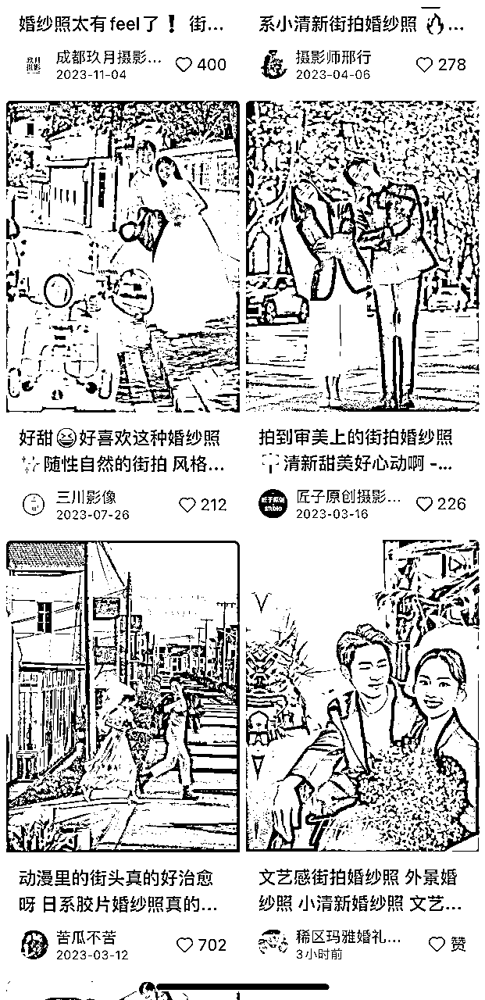

# 自己备婚DIY婚礼，一个月赚3W+，全程复盘玩法

> 来源：[https://j44nyrp7oj.feishu.cn/docx/FrszdqYj0okxRsxhonwc2ZPJnQg](https://j44nyrp7oj.feishu.cn/docx/FrszdqYj0okxRsxhonwc2ZPJnQg)

我是艺荷，90后，自由职业者，平台签约作者。

毕业5年半靠工资+理财买了人生第一套房，目前深耕自媒体写作和小红书运营，全网2W+粉丝。

2023年自己筹备策划了婚礼全流程，虽然很累，但是结果非常完美，最后省下了3W+揣兜里，所以我自认是赚了3W+，觉得很值得。

这篇复盘将是我对整场婚礼的全盘梳理，个人觉得有一定参考价值。不过里面也会多次提到小红书，先声明一下，不是广，真的是因为我仰仗小红书太多了，它太好用，以至于我什么不知道的都去上面做攻略。

# 1、自备婚礼背景

为什么会选择自己办婚礼？

我是这样子的。

①我一直有去拍艺术照的习惯，基本上每年生日都要去拍一套，虽然拍的不错，但我知道一次拍两三组是很累的。前两年和阳光（队友）刚在一起的时候，我带着他也去拍了套情侣照，发现拍出来的效果根本没法看，丑的一塌糊涂。

后来自己尝试着用相机拍了一组情侣照，觉得效果还不错，就萌生了自己拍婚纱的想法。

再到后面，是我一个要好的朋友去拍婚纱照，出了各种幺蛾子事件，就让我下定决心要自己拍婚纱了。

把婚纱照拍好以后，我觉得这事好像并不难，所以想着婚礼是不是也可以自己办呢？

②我和阳光谈婚论嫁的时候，他妈妈希望我们在他家里办（在村上），因为街坊邻居比较近，不适合去市里的酒店办。

而且，我们办婚礼，他父母给不了什么支持，基本上要靠我们自己。我想着找婚庆一方面在小地方办不好，另一方面也想着要省点钱，能省则省，把钱花在刀刃上更好。

然后我也在小红书上搜了一些相关农村婚礼diy的笔记，发现这个想法可行，所以和阳光商量着干脆自己办婚礼。

他同意了，我们自己diy婚礼的路子就确定了。

# 2、婚礼全流程梳理

其实筹备婚礼，主要是婚礼前的一些事项安排，几乎能占到90%的工作量。

从婚纱照拍摄、婚礼时间、请柬制作到风格方案确定、四大金刚安排、婚品采购等，基本上每个部分都是要耗费一些精力的。

因为我是全程安排了自己的婚礼的，所有流程都大概清楚，所以把我自己觉得要花些心思去跟进的环节拎出来好好做个梳理。

有些小细节也会提到，有可能会帮大家省去一些不必要的麻烦。

婚礼当天的流程如下：

接亲-外景拍照-男方家敬茶-婚礼仪式（朋友开场-新郎上场-父亲送新娘上场-新郎新娘宣誓互换对戒-父母发言-伴郎伴娘发言-封酒环节-集体合影）-午宴敬酒

下面的内容，主要讲婚礼前的备婚环节，基本上是按照时间顺序来复盘的，我要开始自己的表演了。

# 3、婚纱照拍摄

婚纱照，我是自己拍的。

因为我试了一下，自己拍出来的效果还不错，都还挺喜欢的，比起很多流水化作业的影楼拍摄，显得更真实有情绪。

我是个摄影小白，以前就没拿相机好好拍过两张照片，后来试拍，都是借前公司的相机拍的。

所以这件事，并不是说你小白了就不能做了，我的体验是，拍照技术可以练，而且自己拍有很多的尝试空间和时间，你可以多拍一些，总能挑出自己满意的。

拍婚纱照，主要就是下面几个方面要关注：

①拍摄风格

这个和你去影楼拍照是一样的，比如你买了个婚纱照套餐，里面包含了3套服装造型，但具体是哪3套，还是要你自己去挑选的。

我自己拍照，也要去挑选。

我不知道自己想拍什么风格的，所以求助了一下小红书。

小红书上有很多婚纱自拍的笔记，也有工作室放出来的客照模特照，但不管是哪种类型，只要你觉得还挺喜欢的，就可以拿来备选。

多选几个类型和风格，最好同时包含室内和室外，然后确定自己要拍几组，最后确定要拍哪几个风格的就可以了。

我最终拍了5组，赫本草坪风、国风俏皮风、韩式简约风、户外森系风、清新街拍风，有室内有室外，有复古有现代，就是各种风格都有。

②拍摄地点

拍摄地点就要根据你的拍摄风格来定了，这一个自己要提前在脑子里过一遍，方便在真正拍摄的时候不费时间。

而且基本上每个城市都会有你的部分场景特定的地方，就算是替代，也是能找到的。

像我拍赫本草坪风的时候，就提前踩了个点，去我朋友结婚拍外景的公园看了看。

虽然最后呈现的场景和想象中不完全一致，但选了一些照片还是特别喜欢。

户外森系风，我选的是成都的一个大湿地公园。其实最开始是打算去青岛拍外景的，机票啥的都订好了，结果突然成都疫情全城风控，一下子打乱了所有计划，实在是错过好时机了，就只好在成都拍了。

清新街拍风，就随便找了个小巷子拍了，有种老成都的慵懒感，这就是我想要的感觉。

而像室内拍摄的场景，只需要在家里就能搞定。需要红背景的就买一块红布，需要白墙的，就找一块宽点的白墙。

③服化道

自己拍婚纱的话，其实有个最大的挑战，就是造型化妆。

咱们都是普通人，可能从事的工作对服装造型也没什么要求，要是平时自己对这些关注度不够高，可能就更不会做了。

我自己平时上班就很简单的做个护肤，打底化淡妆，不会非常复杂的妆造。

但我想的是，虽然咱不会，可现在有很多在线教学的，而且不需要画的多么精致，后期修图才是重头戏，所以就大胆学。

造型上，我没有选很复杂的发型，都是在小红书上看那些好看，但又比较简单的造型，然后模仿着来做。

妆面上，我是认真学了一下的，比如怎么贴双眼皮，怎么粘假睫毛，怎么打底遮瑕等，基本上把这几个学会了，问题就不大了。

拍照比较吃妆，下手可以稍微重一点，尤其是眼妆，只要把双眼皮、假睫毛和眼影做好，起到放大眼睛的效果，就成功一大截了。

关于妆容和造型，都可以看小红书，我就不推荐具体哪个博主了，大家可以自己去搜你关心的关键词哈。

至于服装，我是尽量选同风格的，不一定要同款或非常相似的。

像婚纱主纱，就是在淘宝上买的现成品，拍完照还可以结婚仪式上传。

像国潮风的情侣装，是在拼多多上买的。

像我赫本风的黑色裙子，甚至是拿自己一直在穿的裙子直接用，也蛮好的。

其他的配饰道具，就根据自己需要的风格直接在拼多多上下单就好，我那会儿还买了拼多多的会员卡，每个月有优惠券，还能省下不少。

哈哈，我就是要把钱用在刀刃上，能省则省。

④拍摄时间

自己拍照有个很大的优势就是时间自由。

我以前去拍艺术照，只拍2-3套，就得从中午拍到天黑，腰都扭酸了。朋友去拍婚纱照的时候，早上很早就出门，拍到了晚上凌晨才回家，她和我说那天太累了。

不喜欢这么赶着拍，我就和阳光商量每个周末有时间拍一组。

所以，从2022年6月份开始拍第一组起，到最后一组在国庆节拍完，我们拢共花了有4个月时间。

每次都是玩着玩着把照片拍完，没有任何时间压力，非常轻松，而且出片效果很好。

拍婚纱照最佳的时间是天气相对舒适的季节，初夏、初秋都很合适，太冷太热都会很痛苦。如果自己拍，就要提前把时间规划好，尽量前置，不要临近婚礼才匆忙拍。

我们拍婚纱的时间提前了一年，时间非常充裕，而且把不合适的时间排除了，挑选的合适时间，所以拍的很舒服。

⑤拍照设备

因为我俩平时拍照比较少，不大会摆姿势，所以我都是提前准备了要拍的那套风格的样图，也就是在小红书上找相关风格的笔记，看别人拍的好看的，觉得自己也能做的姿势，直接照抄模仿。

拍照设备的话，我是借了前公司的实验室相机，就是个入门的佳能相机，好像是佳能D601。这个相机虽然入门，但操作简单，最重要的是，拍摄人像模式很不错。

当然，如果你有其他相机，也可以安排。同一个场景，用相机和手机拍摄，差距真的蛮大的。相机的细腻度和氛围感明显比手机好得多，所以建议，如果拍婚纱照，一定要用相机，千万不能省。

如果你没有，买一个二手或去租一个都是可以的。

除了相机，我还买了个相机手机一体的三脚架，不管是在家里还是在外面，都可以不求人。

三脚架是带蓝牙遥控的，我一般是选好景后，让阳光去机位上站好摆pose，然后我按遥控和他一起拍，可以一次多拍几张，换几个姿势，方便后面选照片。

我的5组婚纱照里，除了第一套是让我妹帮着拍的，后面4套都是自己拍的。

另外，还可以买个打光板，天气不大好的时候，拍人物特写的效果要好点，我用的不多，但确实有用。

至于照片精修，我最开始还想着自己学学P图来着，各种教程课程打包了一大堆。后来发现一方面时间不够，另一方面，性价比不高。所以，后来是在淘宝上找了修图师精修了20张，效果很不错，绝不输专业影楼。

# 4、婚礼方案及风格确定（含四大金刚）

2023年大概是3月份确定的婚期，这个时候我就开始趁空看各种婚礼风格，然后挑选适合在家里diy，且我自己能hold住的。

这就相当于说，我是有小半年的时间可以提前准备的。

因为阳光家是在山上的农村，参加婚礼的都是村里的街坊四邻，那很隆重的殿堂风、西式派对风、游园风就是不合适的。

而比较新中式的自然风、草坪风都比较适合，也施展的开，所以我就从这两个风格着重考虑。

说实话，这个过程还挺长的，并不是说一下子就能敲定。

女孩子嘛，总是想要力求完美，而选择又只能是一种，选了这个就意味着不能选那个了，会感觉有点残缺。

所以，我直到6月份之前，都没有确定要做哪种风格。

在这期间，我看了大量的农村婚礼方案，包括婚庆公司设计的、个人自己diy的，只要觉得可以借鉴，我都整理收藏了。

后来，又根据家里的实际环境和条件，确定了做自然风为主的新中式风格。

ps：案例从小红书、马蜂窝、公众号上都可以搜到，多看看，就慢慢有概念了。

确定好风格以后，我也大致确定了对「四大金刚」，也就是主持、化妆、摄影、摄像的需求。考虑到现场化妆和摄影我没办法解决外，我决定这两笔钱不能省，该花还得花。但主持我和阳光亲自上阵，摄像不是刚需，所以pass掉。

最终，确定的就是只需要请化妆师和摄影师即可。

这两个我是在7月份的时候开始准备的，先在小红书上找了找独立化妆师和摄影师，后来发现，抛开价格和稳妥度不说，如果找远一点的，还要提前安排食宿，挺麻烦的。

后来干脆就在我们当地找了一家婚庆公司，只请化妆师和摄影师，价钱要贵一点，但是稳定性高的多，而且还省心。

怎么找到这家婚庆公司的呢？我是直接用了万能的大众点评，搜索就有了，还能看到用户评价，很方便。

# 5、备婚进度表+人员分工

7月初的时候，我和阳光就开始做相对细致的备婚安排了。

这件大事，基本上只能我们自己做，别人能给的帮助不多，必须提前。

还有一点，我以前也做过很多项目活动的筹备，深知一个大事件的成功推进，是离不开详细的项目策划的，各种时间线必须清晰，张弛有度，才不容易混乱。所以，为了很好的把控，我们提前2个月就开始做进度表和人员分工了。

进度表主要是按照时间线把每个节点必须完成的事情罗列出来，具体时间点和主要负责人都要确定，这样方便后面在推进过程中有条不紊地核实去进度。

人员分工主要指的是婚礼现场分工，婚前我们还能亲自去处理各种事情，但婚礼当天，我们是主角，很多事情是没办法分身去做的，那就需要亲朋好友们的协同。

我们的大致流程是，早上男方到我家接亲，然后我们女方中午去他家参加婚宴。

需要男方筹备的事情相对更多，那么在人员安排上，也要更多助力。阳光提前和他的兄弟姐妹们打好了招呼，然后我们就大致先做了个人员分工。如果有偏差，再及时调整。

我的女方这边事情相对较少，就简单做了个分工，婚礼前一天晚上，还在家里开了个短会，再次确认分工和流程的。

把任务指定到人，可以极大地减少混乱和权责不清的情况发生。

这是我在工作中学到的，运用到生活里，一样有效。

表的内容和具体分工安排这里就不展开了，有需要的姐妹直接来找我领吧，我觉得还是挺全面的。

# 6、婚品采购（现场氛围小道具）

其实吧，其他事情虽然也多，但是花个整块的时间也就做了。

真正耗心神的婚品采购这个小部分，实在是太琐碎了。准备过双十一的姐妹们都知道，就一个双十一都挺麻烦的，更别说婚礼需要的东西这么多了。

为了更高效、更省力的完成采购这个环节，我其实做了很多功课，并且也是做了个购物清单。

按照场景和使用地来划分，更容易不错漏。

因为两边的装饰婚品都是我购买的，所以我是按照通用、我家和阳光家来划分的大景别。

然后根据具体的使用区域和环节来制作清单，比如婚房布置、伴郎伴娘、接亲环节、签到台、仪式舞台等，基本上要用到的东西都买了，没有漏买一样。

大的物品采购清单大家也可以找我要，这里就分享几个我觉得很好用的氛围小道具吧。

接亲环节：整蛊新郎用到的小游戏道具，像什么粘粘球射枪、喷钞枪、鞋盒+套圈，好玩还很出片。

可以去小红书上搜一下接亲游戏，挑自己喜欢的，文明接亲，真的很有趣。

婚礼仪式：

泡泡机/泡泡管，从我入场开始，两边的小朋友就拍摄喷泡泡了，很浪漫，很有氛围感

风铃，我们的场地旁是有树的，我买了很多红灯笼和风铃挂在树上，拍照很好看，结果仪式一结束，就不知道被谁拿走了

中式点心摆台，我们做的是新中式风格，在舞台旁边还摆了个中式点心摆台，放了一些平安喜乐摆件，好看的点心摆台，定制的可乐饮料，扑面而来的喜庆国风

照片墙，这个真的超级出片，现场感觉也很好，超出我预期。我买的渔网，撑在了摆台桌后面，挂上了我们的情侣照，非常应景

这些东西都很便宜，但效果很好，太可以安排了。

还有还有，因地制宜的找周边素材，阳光家周围有很多竹子，我们就砍了一些做舞台背景，做迎宾牌，很特别，但又与环境相得益彰，被很多人夸。

在做花艺的时候，我还去采了不少绿植，配上仿真花，以假乱真，也很好看。

# 7、喜糖盒设计定制（可选）

因为是婚礼diy，我就想尽量让个性化的因素多呈现一点，不然各种千篇一律就太没意思了。

在做备婚功课的时候，我偶然刷到一篇笔记，发现还可以定制自己的喜糖盒，而且难度对我来说很小，所以，了解了一下成本后，我决定设计自己的喜糖盒。

我做的是正规的正方体喜糖盒，去卖喜糖的铺子里看过，也去网上店铺问过，知道尺寸很多，就选了8*8*8的规格。

然后直接在Canva上制作就可以了。

具体制作流程如下：

1、确定主色系和素材。

我有一张俏皮国风的合影非常适合做婚礼头像，所以决定我把这张图当做喜糖盒主素材，自然而然就以浅粉+暗红为主色系了。

现在很流行婚纱照插画元素，我看了一下，网上很多都是找专业插画师画的。我一方面时间比较急了，有点等不了，另一方面，也是觉得以我对各种修图APP的了解，应该基础插画风的图是可以产出的。所以我马上就在小红书上搜了一下相关的笔记，还真看到有人说用醒图可以生成漫画风。

然后，我马上打开APP试了一下，我一共试了两种风格，最后确定了一种自己最喜欢的风格。

醒图APP-导入图片-玩法-漫画脸，选自己喜欢的风格就行。

这下素材图和主色系都有了，接下来该做喜糖盒设计了。

2、确定喜糖盒的刀版图。

没设计之前我还不知道，原来设计喜糖盒也要先看盒型。

和水果手提箱一样，喜糖盒也有很多种盒型。

为此，我看了不少视频，也去厂家（线上）问了好几家。最后秉着方便装盒的理念，选了个比较基础款的天地盖型。

确定盒型以后，就要自己排版设计了画面了。

3、排版设计画面。

根据自己的喜好进行画面设计。

我是结合了好几个博主和比较流行的喜糖盒素材，挑选了一些自己喜欢并且做起来没什么难度的素材。

然后用可画Canva开始设计。

打开一个8*8*8的画布，在每个版面上添加素材，排版成自己想要的画面。

具体设计应该不用展开了，做过海报的伙伴一定都知道怎么搞，主要就是文字和图块的运用。

里面的大喜字是直接搜的「喜」元素素材，打底的心形状搜的「心」元素素材，剩下的就是输入关键词去搜索相关的图表素材进行堆叠。

4、与生产厂沟通对接。

这个基本上就是喜糖盒制作的最后一步了，因为我们对接的生产厂只需要负责生产就行。

我是在1688和拼多多上都咨询了一些厂家，价格偏差不算大，但也是有的。

而且因为生产这种小纸盒是需要上机的，如果数量太小，开动一次机器的成本是固定的，单价就高，所以有些厂是有最低制作量的。

比价了半天，最后我在拼多多上找了一家服务态度很好，价格也合适的店铺。

我本来只打算做400个，后来发现400和500个的价格差别就几块钱，就干脆做了500个，价格是300块钱。

如果是自己设计画面，就只需要自己做好图片，然后把图给到生产厂。

画面自己要设计好位置和顺序。

比如，我的设计是在盒子正面放置婚礼头像，顶部是4个大字「请你吃糖」，底部无素材，用主色块打底就行，剩下的几个版面都要按顺序排开。

这是我自己最初的规划。

为了减少与厂家设计师的沟通，我直接找来了糖盒刀版图，在上面标上了哪张图在几号位置。

最后对方设计师把图片排版好，给我确认几次，没有问题就可以生产制作了。

一般做糖盒的时间是7天左右，加上做好发货配送的时间一般是3-4天，所以这个时间一定要充分预留。

等糖盒到了，自己把买好的喜糖挨个放进去封装就可以，我还买了这种小的镭射喜字贴，专门贴在喜糖盒上的，只不过本来买的金色，后来商家连续两次给我发错成红色的，就只有将就用了。

效果虽然没那么好，但也不算出错。

我自己设计的喜糖盒不想一板一眼，就搞了个喜糖盲盒，里面的内容都不完全一样，增加了拆喜糖的趣味性。

我买了各种口味风格的喜糖，还买了一些国风贴纸、钥匙扣、不倒翁公仔，还挺受喜欢的。

结婚当天，去敬酒的时候就看到一桌小孩在面前摆了好几盒喜糖，一个个拆，然后边拆边说这个里面有什么。

那个场景让我真的颇有成就感和欣慰感。

# 8、电子请柬+婚礼氛围视频制作

前面说了婚纱照是我自己拍的，精修是找淘宝的修图师修的。

我没有请婚庆，也不想花钱去做电子请柬，因为我知道现成的工具一定是有的，所以婚礼提前20天左右的时候，我又开始搜索电子请柬制作攻略了。

有很多人安利各种不同的制作APP，我就从中挑选了一个婚贝APP，直接用里面的模板了。

模板其实还挺多的，完全足够支持我的个性化需求了。

我做了好几个请柬，最终选了一个最满意的（里面的照片超级多，我还加上了很多我俩领证当天的拍的照片，氛围感拉满）。

请柬发出去的时候，好多和我关系不错的朋友说照片好看，等我说起请柬也是自己做的，她们都惊呆了。

还有个很多年不见的高中同学，她说要不是我提起，她只会在心里感慨“大城市的婚庆公司就是不一样，连请柬都做这么好看。”

直到我去年国庆节回老家和她见面，她都还在说这件事。

而关于婚礼氛围视频这个东西，我原本是完全没有想到的。

也是因为后来在刷一些关于备婚的攻略，发现好多人都做了在婚礼现场的大屏幕上播放的视频资料，也有看到在家里电视上播放的静态图。

我一看，氛围感这么足，那不如我也做个试试。

然后我同样用婚贝做了个图片库视频，这个倒是好做，只需要把原模板里的图片替换成自己想换的就可以了。

这个做完以后，我还做了个热闹的动态氛围图，和视频轮换着在电视上播放。

动态图是在可画上做的，上面有很多动态素材，像什么烟花、喜糖、花朵之类的，都是很喜庆的元素，模仿着小红书上那些好看的图片排版就可以了。

我总共做了6张动态图，最后导出成了一个视频素材。没有任何与个人有关的信息，如果大家需要，可以找我要哈。

# 9、婚礼现场布置

关于婚礼现场布置，我俩是提前了一周回去准备的。

阳光家：

①主舞台

砍了几根竹子，做了个背景墙，用来搭布幔营造现场氛围；

舞台旁的梅子树，把多余的枝条修剪了，方便挂小灯笼和风铃；

我去剪了一些延展性比较好的绿植，用来混搭仿真花，做花艺的呈现；

继续剪仿真花，锯了一些竹筒，做花卉路引，增加森系的气息；

拼接好大的立体喜字，装好蜂窝气球柱等装饰品，让舞台尽量呈现的厚重且立体些。

②中式点心台

提前摆放好桌子，绑好了竹竿做的照片墙网，等婚礼当天就可以直接挂照片了；

③制作迎宾牌

这次用了很多就地取材的素材，做的迎宾牌就是用的竹子，搭好架子后，配合插花、麻绳和大的无纺布喜字。

不怕雨淋日晒，还能很好地与整体场景融为一体。

④婚房布置

我不喜欢用各种气球装饰房间，觉得太俗气。

以各种类型的喜字为主要装饰元素，在婚房卧室做了个喜庆背景墙，方便拍摄，在床头柜放了个立体喜字+插花，增加立体感的喜庆氛围。

楼梯贴了喜字，露台栏杆挂上了喜庆拉花和挂坠，整体看也很喜庆大气。

阳光家的装饰准备我是做到了这些部分，剩下的各种路引、迎宾气球、摆台等我都顾不上，就交给他继续处理了。

我家：

①婚房布置

我采购婚品的时候都是明确了哪些是我家的，哪些是阳光家的。所以，等我回家的时候，就可以直接用了。

家里婚房布置的相对简单，也是背景墙，各种类型风格的喜字张贴。

②迎宾牌

因为我家婚礼前一天要请亲戚朋友一顿答谢宴，地点是在一家农家乐，所以也要准备一些装饰。

迎宾牌是我自己制作的，如果买的话一两百，我自己做，成本30块钱左右，而且第二天拎到阳光家，还可以二次利用。

制作原材料：写生画架、亚克力板、丙烯颜料、马克笔、仿真花

具体制作也很简单，把提前打印好的文字临摹，粘上仿真花装饰，背面涂鸦丙烯颜料，自然风干就可以了。

小红书上有很多制作笔记，不会的话可以多看看。

很多时候，我们在大脑里思考时会觉得好像事情并不多，但现场布置其实有很多琐碎的小事，我俩直到结婚前一天都还在视频沟通进度。

但是做好了的话，成就感会非常强。

# 10、主持+音乐

前面所有准备工作做完，其实就剩主持和音乐的准备了。

我俩因为是自己主持，但又不是专业的，所以需要提前把主持稿写好，并且对好词，彼此心里有点数。

主持稿是我写的，我们一起滕到手卡上。

写之前我看了不少别人的主持稿，但对于婚礼主持，是不能用别人的词的，因为每个人的经历不同，感触也不同。所以我只参考了他们的风格，选定了自己喜欢的轻松俏皮风，然后创作的主持稿。

最后呈现的效果非常好，阳光不算个善于言辞的人，但那天我们主持以后，下面的朋友都惊呼好专业，哈哈。

主持稿可以放到这里大家参考哦~

音乐的话，我俩花了一个晚上的时间商量并确定。

整体效果还是蛮不错的，我们的音乐场控很专业，都能卡点播放，超出我预期。

总得来说，这场婚礼的感觉非常不错。

当时或许还有点累的感觉，但现在剩下的全是幸福和开心回忆了，即便是现在想起来仍觉得记忆犹新。

希望我的经验可以给大家一些参考和借鉴，前面提到的资料有需求可以找我领，也欢迎大家主动链接哦~