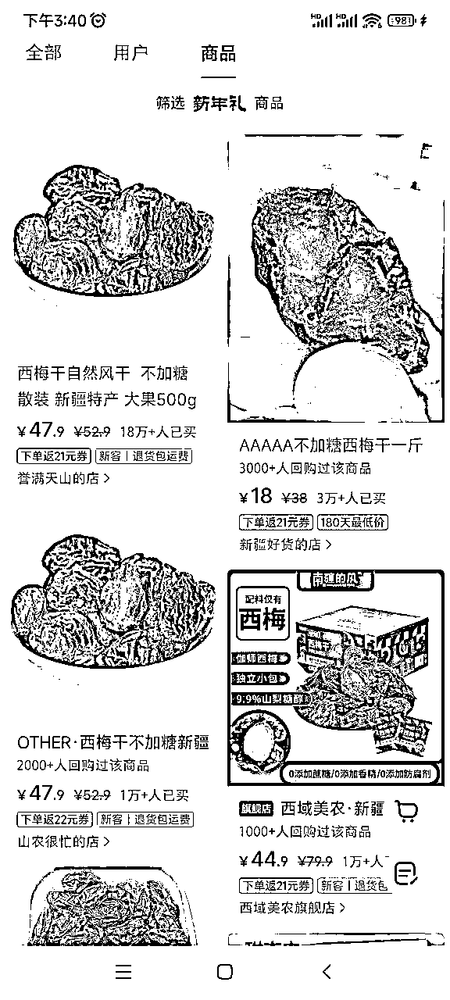
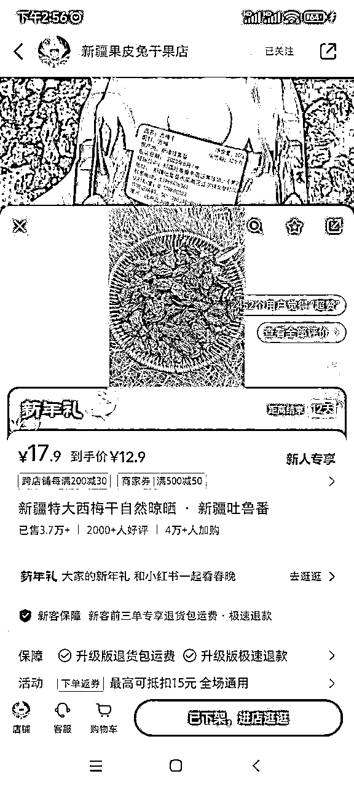
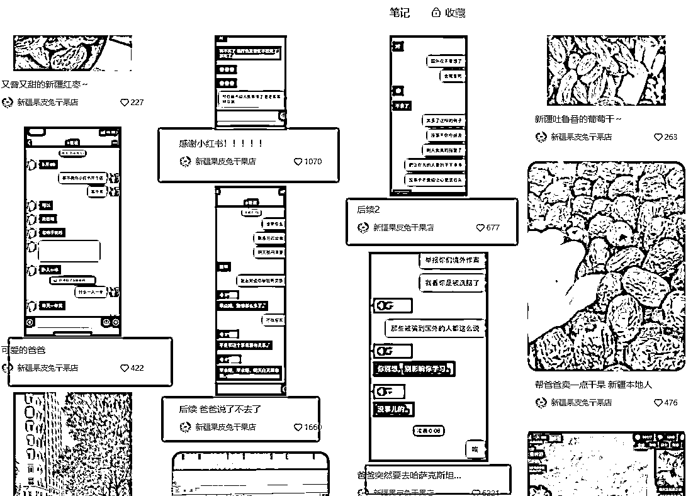
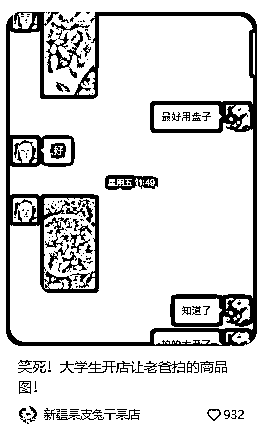
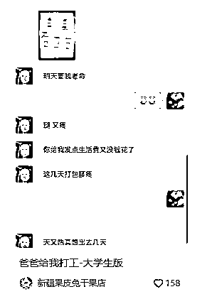
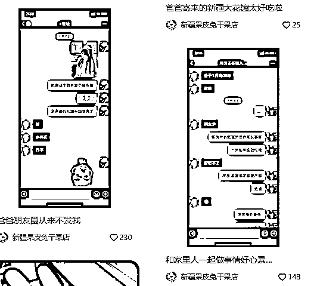
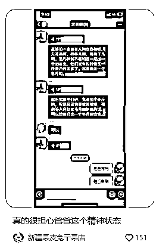
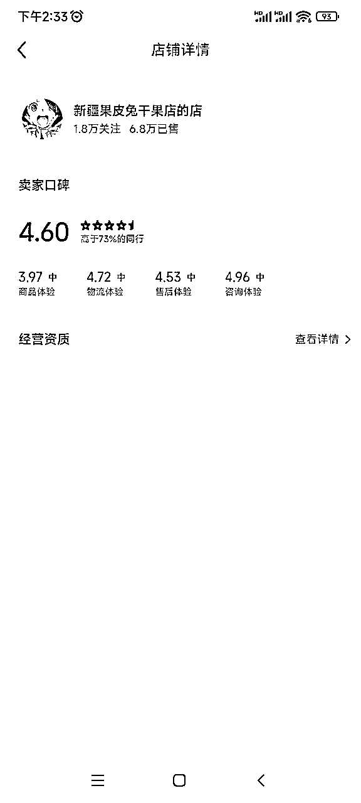
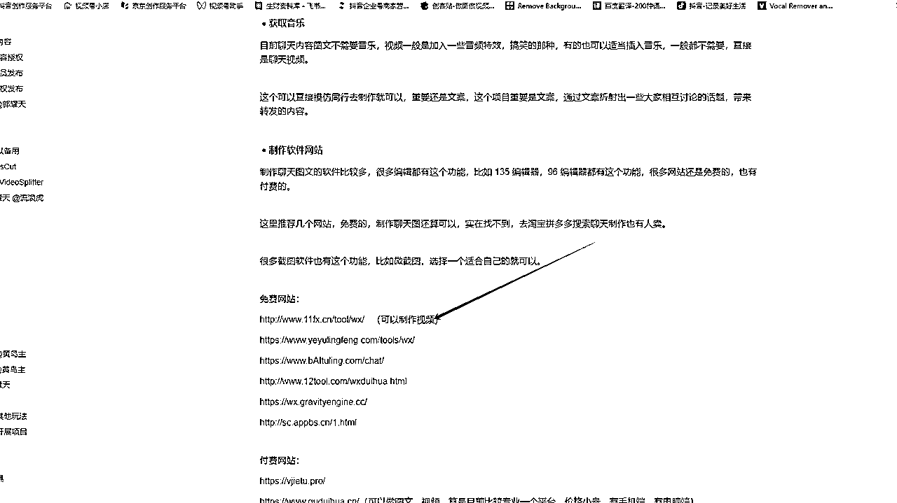

# 小红书三农账号拆解

> 来源：[https://v3n6qsg3fp.feishu.cn/docx/FxVVdsihaogRA9xsBX1c05fInHg](https://v3n6qsg3fp.feishu.cn/docx/FxVVdsihaogRA9xsBX1c05fInHg)

# 素人大学生如何在小红书爆卖家乡特产

## ✔案例拆解

小红书账号：新疆果皮兔干果店 爆品是西梅干 ,这个品受众笔记广 号称是 "噗噗神器"

便秘、减肥的女孩应该都知道，主打是无添加的，0负担，未深加工农产品，为产品增加“利器“

人设是帮家里卖， 自产自销，产品也是家乡发货，人在外地读书，很具有说服力和信任。

## 💡账号情况

账号是23年3月份 运营还不到一年时间 ，涨粉1.8万 ，单品最高笔记数量157，获赞与收藏74000， 平均每个笔记获得点赞收藏数为471

单品销量更是惊人 ：小红书搜索关键词“西梅干”，点击“商品”，第一名是销量是：180000，第二名是31000，

而分析的博主销量是37000，博主本应该是排名第二的，只是她已下架

单品类目前3名分析

溢满天上：粉丝6.1万，单品最高销量180000，发布笔记1343，获得点赞收藏数为185000，平均每个笔记获得点赞收藏数为138

新疆好货：粉丝10.9万，单品最高销量31000，发布笔记649，获得点赞收藏数为67000，平均每个笔记获得点赞收藏数为104

山农很忙：粉丝3.4万，单品最高销量11000，发布笔记1351，获得点赞收藏数为34000，平均每个笔记获得点赞收藏数为26

分析账号（新疆果皮兔干果店）：粉丝1.8万，单品最高销量37000，发布笔记157，获得点赞收藏数为74000，平均每个笔记获得点赞收藏数为471

综合上面的数据，此账号经营时间又短还不到一年时间，已做到单品类目第二了，总共157条笔记平均最少2天才日更一条，发的笔记数量就远远少于同行，说明此账号的内容更加优质，更值得学习深入学习模仿。

## 二、流量爆点在哪

爆款流量就是和爸爸的聊天记录截图 ，引发了猎奇➕真实，博主应该也知道了流量密码，所以后面大部分都是以聊天截图➕产品展示形式相结合的发笔记，这种笔记不是小爆、就是大爆，博主也没有直播，就是纯笔记挂车，也没有做过多的埋词。

她的文案也没有精辟之处，重点就是调动客户的情绪、让人感觉非常的真实，突出我是源头好吃+健康

生财圈友前几天也分享过更加详细的同类型贴子：

本来要分析他家爆品利润的，但博主已下架，具体的数字无法知道

但整店的总销量6.8万+这个数字确实不错了，运营时间还不到1年（她要真是大学生就超越身边80%人）

# 三、项目如何做

根据上面的数值，就是算不做和她一模一样的品，做自己家里的特产也可以1:1的按照她的框架模仿，

做过小红书图文笔记都知道比较吃文案，而博主这个基本没啥文案，就是普通的聊天截图形式。

在想这类型的是不是可以做两种模式

一种是纯图文模式

另外一种是聊天视频模式，生财航海的视频号分成计划航海，也有同类型的聊天视频模式，这类视频也比较容易引起共鸣，女生都喜欢八卦，用软件都能做出来，两种模型是不是可以一起做，避免同质化来矩阵放大它。

同类型笔记 一个做图文，一个做聊天视频（欢迎做过的圈友来指正）

# 总结:

23年刚好是小红书变现元年，我也是刚做小红书不久，发现小红书人群对粘性比较高的商品， 做私欲复够产品的远高于视频号，加入生财后一直做视频比较多，但是发现视频号加过来的人，平时发朋友圈粘性都不高，小红书就加还不到30个人，就10几个回购的，小红书的小姐姐复购确实比较强。

也是我第一次参加生财项目拆解项目，小白交作业，勇敢迈出0-1。